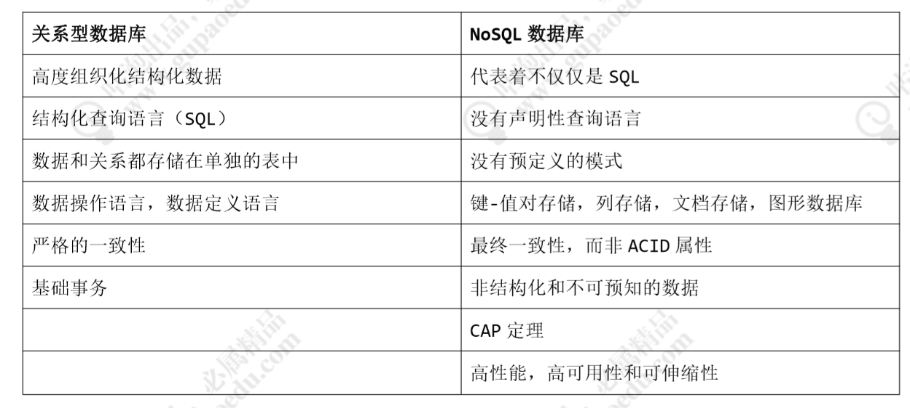

# 申明

展示只是做一些简单的介绍，之后会有详细的说明，包括MongoDB数据库的搭建

# 1. 和关系型数据库的对比




# 2. MongoDB 数据结构和关系型数据库的数据结构的对比

最主要的一部分


# 3. 需要注意的点

## 3.1 database 命名规则

- 不能是空字符串（"")。
- 不得含有' '（空格)、.、$、/、\和\0 (空字符)。
- 应全部小写。
- 最多64字节。

有一些数据库名是保留的，可以直接访问这些有特殊作用的数据库。

- **admin**： 从权限的角度来看，这是"root"数据库。要是将一个用户添加到这个数据库，这个用户自动继承所有数据库的权限。一些特定的服务器端命令也只能从这个数据库运行，比如列出所有的数据库或者关闭服务器。
- **local:** 这个数据永远不会被复制，可以用来存储限于本地单台服务器的任意集合
- **config**: 当Mongo用于分片设置时，config数据库在内部使用，用于保存分片的相关信息。

## 3.2 collection 命名规则

- 集合名不能是空字符串""。
- 集合名不能含有\0字符（空字符)，这个字符表示集合名的结尾。
- 集合名不能以"system."开头，这是为系统集合保留的前缀。
- 用户创建的集合名字不能含有保留字符。有些驱动程序的确支持在集合名里面包含，这是因为某些系统生成的集合中包含该字符。除非你要访问这种系统创建的集合，否则千万不要在名字里出现$。　

## 3.3 Document 

需要注意的是：

1. 文档中的键/值对是有序的。
2. 文档中的值不仅可以是在双引号里面的字符串，还可以是其他几种数据类型（甚至可以是整个嵌入的文档)。
3. MongoDB**区分类型和大小写**。
4. MongoDB的文档**不能有重复的键**。
5. 文档的键是字符串。除了少数例外情况，键可以使用任意UTF-8字符。

文档键命名规范：

- 键不能含有\0 (空字符)。这个字符用来表示键的结尾。
- .和$有特别的意义，只有在特定环境下才能使用。
- 以下划线"_"开头的键是保留的(不是严格要求的)。

# 4. mongoDB 数据类型

| String             | 字符串。存储数据常用的数据类型。在 MongoDB 中，UTF-8 编码的字符串才是合法的。 |
| ------------------ | ------------------------------------------------------------ |
| Integer            | 整型数值。用于存储数值。根据你所采用的服务器，可分为 32 位或 64 位。 |
| Boolean            | 布尔值。用于存储布尔值（真/假）。                            |
| Double             | 双精度浮点值。用于存储浮点值。                               |
| Min/Max keys       | 将一个值与 BSON（二进制的 JSON）元素的最低值和最高值相对比。 |
| Array              | 用于将数组或列表或多个值存储为一个键。                       |
| Date               | 日期时间。用 UNIX 时间格式来存储当前日期或时间。你可以指定自己的日期时间：创建 Date 对象，传入年月日信息。 |
| Timestamp          | 时间戳。记录文档修改或添加的具体时间。                       |
| Object             | 用于内嵌文档。                                               |
| Null               | 用于创建空值。                                               |
| Symbol             | 符号。该数据类型基本上等同于字符串类型，但不同的是，它一般用于采用特殊符号类型的语言。 |
| Object ID          | 对象 ID。用于创建文档的 ID。                                 |
| Binary Data        | 二进制数据。用于存储二进制数据。                             |
| Code               | 代码类型。用于在文档中存储 JavaScript 代码。                 |
| Regular expression | 正则表达式类型。用于存储正则表达式。                         |

## ObjectId

ObjectId 类似唯一主键，可以很快的去生成和排序，包含 12 bytes，含义是：

- 前 4 个字节表示创建 **unix** 时间戳,格林尼治时间 **UTC** 时间，**比北京时间晚了 8 个小时**
- 接下来的 3 个字节是机器标识码
- 紧接的两个字节由进程 id 组成 PID
- 最后三个字节是随机数


**MongoDB 中存储的文档必须有一个 _id 键。这个键的值可以是任何类型的，默认是个 ObjectId 对象**

由于 ObjectId 中保存了创建的时间戳，所以你不需要为你的文档保存时间戳字段，你可以通过 getTimestamp 函数来获取文档的创建时间:

```
> var newObject = ObjectId()
> newObject.getTimestamp()
ISODate("2017-11-25T07:21:10Z")
```

ObjectId 转为字符串

```
> newObject.str
5a1919e63df83ce79df8b38f
```

## 字符串

**BSON 字符串都是 UTF-8 编码。**

## 时间戳

BSON 有一个特殊的时间戳类型用于 MongoDB 内部使用，与普通的 日期 类型不相关。 时间戳值是一个 64 位的值。其中：

- 前32位是一个 time_t 值（与Unix新纪元相差的秒数）
- 后32位是在某秒中操作的一个递增的`序数`

在单个 mongod 实例中，时间戳值通常是唯一的。

在复制集中， oplog 有一个 ts 字段。这个字段中的值使用BSON时间戳表示了操作时间。

> BSON 时间戳类型主要用于 MongoDB 内部使用。在大多数情况下的应用开发中，你可以使用 BSON 日期类型。

## 日期

表示当前距离 Unix新纪元（1970年1月1日）的毫秒数。日期类型是有符号的, 负数表示 1970 年之前的日期。

```
> var mydate1 = new Date()     //格林尼治时间
> mydate1
ISODate("2018-03-04T14:58:51.233Z")
> typeof mydate1
object
> var mydate2 = ISODate() //格林尼治时间
> mydate2
ISODate("2018-03-04T15:00:45.479Z")
> typeof mydate2
object
```

这样创建的时间是日期类型，可以使用 JS 中的 Date 类型的方法。

返回一个时间类型的字符串：

```
> var mydate1str = mydate1.toString()
> mydate1str
Sun Mar 04 2018 14:58:51 GMT+0000 (UTC) 
> typeof mydate1str
string
```

或者

```
> Date()
Sun Mar 04 2018 15:02:59 GMT+0000 (UTC)   
```

# 5. capped collections

Capped collections 就是固定大小的collection。

它有很高的性能以及队列过期的特性(过期按照插入的顺序). 有点和 "RRD" 概念类似。

Capped collections 是高性能自动的维护对象的插入顺序。它非常适合类似记录日志的功能，标准的 collection 不同，你必须要显式的创建一个capped collection，指定一个 collection 的大小，单位是字节。collection 的数据存储空间值提前分配的。

Capped collections 可以按照文档的插入顺序保存到集合中，而且这些文档在磁盘上存放位置也是按照插入顺序来保存的，所以当我们更新Capped collections 中文档的时候，更新后的文档不可以超过之前文档的大小，这样话就可以确保所有文档在磁盘上的位置一直保持不变。

由于 Capped collection 是按照文档的插入顺序而不是使用索引确定插入位置，这样的话可以提高增添数据的效率。MongoDB 的操作日志文件 oplog.rs 就是利用 Capped Collection 来实现的。

要注意的是指定的存储大小包含了数据库的头信息。

```shell
db.createCollection("cappedLogCollection", {capped:true, size:100000})
```

你也可以同时指定文档数量的限制

```shell
db.createCollection("cappedLogCollection",{capped:true,size:10000,max:1000})
```


- 在 capped collection 中，你能添加新的对象。

- 能进行更新，然而，对象不会增加存储空间。如果增加，更新就会失败 。

- 使用 Capped Collection 不能删除其中的某一个文档，只能使用 drop() 方法删除这个 collection 。

  删除之后，你必须显式的重新创建这个 collection。

- 在32bit机器中，capped collection 最大存储为 1e9( 1X109)个字节。

# 6. 各类型数据的CRUD 

https://www.runoob.com/mongodb/mongodb-create-database.html

