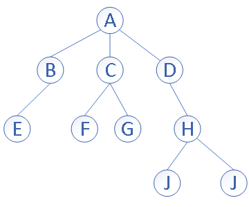
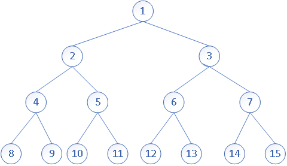
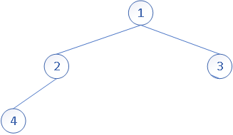
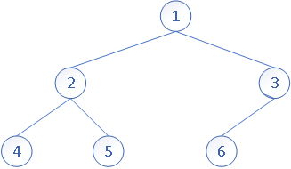
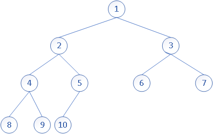
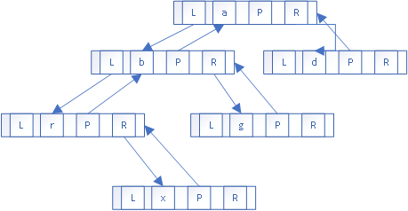
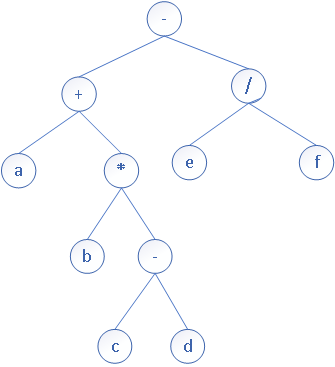

# 申明

内容主要学自我大学的一个数据结构的书《数据结构(C语言版)》

关于二叉树更多的运用请看我这个目录中的别的内容，今后也会持续做更新 https://github.com/Alan-Jun/study-note/tree/master/%E6%95%B0%E6%8D%AE%E7%BB%93%E6%9E%84/%E4%BA%8C%E5%8F%89%E6%A0%91

# 树的定义

树（Tree）是n个节点的有限集（集合），在任意一颗非空树中：

* 有且仅有一个根节点 `root`
* n>1时，其余节点可分为m (m>0) 个互不相交的子树



# 树的基本术语

* **度**：一个结点拥有子结点的个数称为它的度
* **叶子（终端结点）**：度为0的结点
* **非终端结点（分支结点）**：度不为0的结点
* **孩子结点**:一个非终端结点拥有子节点，它的子节点就是他的孩子节点
* **双亲结点**：一个非终端结点是它子节点的双亲结点
* **兄弟结点**：具有同一个双亲结点的结点互为兄弟结点
* **数的层次**：将树的跟作为树的第一层，跟的孩子作为第二层,以此类推
* **树的深度(高度)** 数中结点的最大层次称为树的深度（高度），例如上文中的实例图中的树的 高度=4
* **堂兄弟结点**：同一层的结点互为堂兄弟结点

# 二叉树的定义

在了解了上文中树的定义之后，我们来看什么 是二叉树

二叉树：一棵树的每一个结点最多只有两个子结点（子树），并且它的子结点（子树）具有左右之分，其次序不能任意颠倒。

# 二叉树的性质

## 基本性质

这些性质中，简单的性质的推到你们可以自行画图来看，因为真的很简单那，所以我就不做特别说明

在看下面的性质之前我们先看一个二叉树的图，后面你们看性质的时候可以结合这个图来看


* **在二叉树的第i层最多只有2[^i-1]个结点**

* **深度为k的二叉树，最多只有2[^k]-1个结点**

* **任意一颗二叉树，如果终端结点（叶子）数=n0,度为2的结点=n2 则 n0 = n2+1**:

  假设度数为1的结点数=n1,那么可以得出方程：

  1. n=n0+n1+n2

  在看二叉树的分支数，除了根结点`root`以外，其余结点都是有一个分支进入的，假设B是分支总数

  为B,那么有n=B+1,同时也能知道 B = n1+2n2 ,那就可以得出方程：

  2. n =  n1+2n2+1

  有2式-1式可以得到：

  3.  **n0 = n2+1**

# 满二叉树

一个深度为k且有2[^k]-1结点的二叉树称为满二叉树，如图：



# **完全二叉树**：

定义和性质

**若设二叉树的深度为h，除第h 层外，其它各层(0～h-1)的结点数都达到最大个数，第h 层所有的结点都连续集中在最左边，这就是完全二叉树。我们知道二叉树可以用数组模拟，堆自然也可以。**

* **具有n个结点的完全二叉树的深度为|log<sub>2</sub>n|+1**
* **已知一个完全二叉树的节点树等于 n， 那么他的非叶子节点数量就是 n/2的整数部分值**

* **其中如果完全二叉树用数组来存储，（如果数组从0位置开始存）那么具有以下性质**

  1. 父节点的下标是`parent`，左孩子的下标就是`2parent+1`，右孩子下标就是`2*parent+2`.

  2. `i=0`,那就是 `roo`t, `i>0` 那么他的双亲结点的编号=`(i-1)/2的结果的整数部分`，比如(2-1)/2 = 0，(4-1)/2=1,这个结果就是它的parent的index

  3. 由上面的非叶子节点的数量的性质，可以知道再从零开始存放的数组中，叶子几点的索引值都小于非叶子节点的数量值
  4. 如果 2i+1>n,则这个结点没有左孩子，否则他的左孩子编号 = 2i+1
  5. 如果 2i+2>n,则这个结点没有右孩子，否则他的左孩子编号 = 2i+2

* **如果从数组从1这位置开始存**

  1. 如果父节点的下标是 `index`,左孩子的下标就是`2*index`，右孩子下标就是`2*index+1`.

  2. `i =1` 那他就是`root`，`i>1`那么他的双亲结点的编号=`i/2的结果的整数部分` 比如 3/2=1，5/2=2
  3. 由上面的 非叶子节点的数量的性质，可以知道再从零开始存放的数组中，叶子几点的索引值都小于等于非叶子节点的数量值
  4. 如果 2i>n,则这个结点没有左孩子，否则他的左孩子编号 = 2i
  5. 如果 2i+1>n,则这个结点没有右孩子，否则他的左孩子编号 = 2i+1


* 如果给定一颗有n个结点的完全二叉树，且结点按照层序编号记作i = [0,n]，如图

  

一个二叉树当且仅当每一个结点都与深度与其相同的满二叉树中的编号相对应时，称为完全二叉树：如图：







这些都是完全二叉树

而这样的就不是完全二叉树了：


# 二叉树的存储

## 顺序存储

使用顺序存储结构（一组地址连续的存储单元）比如数组，我们来看一个完全二叉树的例子：


用数组来存就是

| 1 | 2 | 3 | 4 | 5 | 6 | 7 | 8 | 9 | 10 |

那么一个非完全二叉树怎么存呢？只要将结点和完全二叉树相对照就可以了


| 1 | 2 | 3 | 4 | 5 | 6 | 7 | 8 | 0 | 9 |

**0 表示没有结点**

## 链式存储

L 代表左指针

R 代表右指针

P 代表指向双亲的指针

* 二叉链表：

  

* 三叉链表



# 二叉树的遍历

本节我们会讨论，各种遍历方式，以及递归遍历和非递归遍历

**为什么我们有了递归遍历，还需要知道非递归遍历呢？**

**递归的优点是**：代码简单，代码简洁，易于理解 

**递归的缺点是**：占用的调用栈多，如果遇到数据庞大的情况，很可能导致调用栈无限增长，这样带来的问题一个是处理性能会比非递归慢，一个是大多数高级语言的设计，调用栈都是有深度（数量）限制的，比如java中JVM的虚拟机栈，就是有深度（数量）限制

**这时候你觉得不需要了解 非递归的实现吗？**

* 首先我们吧左子树的跟结点记作 L , 同理右子树记作 R , 双亲节点记作 P

* 然后我们需要遍历的树

  

* 主体代码（用来了解这个遍历算法的整体的结构设计）

  树结点类

  ```java
  public class BinaryLinkedNode {
  
      public static int LEFT = 0;
      String value;
      BinaryLinkedNode left;
      BinaryLinkedNode right;
  
      public BinaryLinkedNode(String v) {
          this.value = v;
      }
      /**
       * @param value 树结点的值
       * @param flag  标记是插入左还是右的标志
       */
      public BinaryLinkedNode insertChildren(String value, int flag) {
          BinaryLinkedNode node = new BinaryLinkedNode(value);
          if (LEFT == flag) {
              this.left = node;
          } else {
              this.right = node;
          }
          return node;
      }
  }
  ```

  测试，以及初始化树的方法定义

  ```java
  public class Demo {
      public static void main(String[] args) {
          BinaryLinkedNode root = init();
          recursionPreOrderTraverse(root);
      }
  		// 初始化我们上图中的树结构
      public static BinaryLinkedNode init() {
          BinaryLinkedNode root =  new BinaryLinkedNode("-");
          BinaryLinkedNode left = root.insertChildren("+", 0);
          left.insertChildren("a", 0);
          BinaryLinkedNode right = left.insertChildren("*", 1);
          right.insertChildren("b", 0);
          right = right.insertChildren("-", 1);
          right.insertChildren("c", 0);
          right.insertChildren("d", 1);
  
          right = root.insertChildren("/", 1);
          right.insertChildren("e", 0);
          right.insertChildren("f", 1);
          return root;
      }
      /**
       * 递归先序遍历
       */
      public static void recursionPreOrderTraverse(BinaryLinkedNode root) {
          if(root!= null) {
              print(root);
              recursionPreOrderTraverse(root.left);
              recursionPreOrderTraverse(root.right);
          }
      }
  
      private static void print(BinaryLinkedNode v) {
          System.out.print(" " + v.value + " ");
      }
  }
  ```

## 先序遍历 = PLR


* 访问根节点
* 先序遍历左子树
* 先序遍历右子树
* 上图的正确结果：` -  +  a  *  b  -  c  d  /  e  f `

### java代码

#### 递归实现

```java
/**
 * 递归先序遍历
 */
public static void recursionPreOrderTraverse(BinaryLinkedNode root) {
    if (root != null) {
        print(root);
        recursionPreOrderTraverse(root.left);
        recursionPreOrderTraverse(root.right);
    }
}
```

#### 非递归实现

* 二叉链表：

  ```java
      /**
       * 非递归先序遍历
       */
      public static void PreOrderTraverse(BinaryLinkedNode root) {
          //二叉链表的结构我们需要利用栈来保存结点，实现非递归先序遍历
          LinkedList<BinaryLinkedNode> stack = new LinkedList<>();
          BinaryLinkedNode p = root;
          while (p != null || !stack.isEmpty()) {
  //            if (p != null) {
  //                print(p);
  //            }
  //            if (p.left != null) {
  //                stack.push(p);//压栈
  //                p = p.left;
  //            } else {
  //                if (!stack.isEmpty()) {
  //                    p = stack.pop();//出栈
  //                }
  //                p = p.right;
  //            }
              while(p != null)
              {
                  print(p);
                  stack.push(p);
                  p = p.left;
              }
              if(!stack.isEmpty())
              {
                  p = stack.pop();
                  p = p.right;
              }
          }
      }
  ```

* 三叉链表（增加一个指向双亲结点的指针）

## 中序遍历 = LPR


- 中序遍历左子树
- 访问根节点
- 中序遍历右子树
- 上图的正确结果：` a  +  b  *  c  -  d  -  e  /  f `

### java代码

#### 递归实现

```java
/**
 * 递归中序遍历
 */
public static void recursionInOrderTraverse(BinaryLinkedNode root) {
    if (root != null) {
        recursionInOrderTraverse(root.left);
        print(root);
        recursionInOrderTraverse(root.right);
    }
}
```

#### 非递归实现

- 二叉链表：

  ```java
  /**
   * 非递归中序遍历
   */
  public static void inOrderTraverse(BinaryLinkedNode root) {
          //二叉链表的结构我们需要利用栈来保存结点，实现非递归中序遍历
          LinkedList<BinaryLinkedNode> stack = new LinkedList<>();
          BinaryLinkedNode p = root;
          while (p != null || !stack.isEmpty()) {
  //  		第一种方式          
  //            if (p != null) {
  //                stack.push(p);//压栈
  //                p = p.left;
  //            }else {
  //                if (!stack.isEmpty()) {
  //                    p = stack.pop();//出栈
  //                }
  //                print(p);
  //                p =  p.right;
  //            }
  //  		第二种方式          
              while(p != null) {
                  stack.push(p);//压栈
                  p = p.left;
              }
              if (!stack.isEmpty()) {
                  p = stack.pop();//出栈
                  print(p);
                  p =  p.right;
              }
          }
      }
  ```

- 三叉链表（增加一个指向双亲结点的指针）：

## 后序遍历 = LRP


- 后序遍历左子树
- 后序遍历右子树
- 访问根节点
- 上图的正确结果：` a  b  c  d  -  *  +  e  f  /  - `

### java代码

#### 递归实现

```java
/**
 * 递归后序遍历
 */
public static void recursionPostOrderTraverse(BinaryLinkedNode root) {
    if (root != null) {
        recursionPostOrderTraverse(root.left);
        recursionPostOrderTraverse(root.right);
        print(root);
    }
}
```

#### 非递归实现

- 二叉链表：

  ```java
  /**
   * 非递归后序遍历
   */
  public static void postOrderTraverse(BinaryLinkedNode root) {
      // 栈先进后出，我将后序遍历的输出结果倒序一个个push到栈中，最后一个个pop出来就可以了
      // 要将一颗大树拆解成一颗颗 parent,left,right 得小树取理解处理，然后我们按照后续遍历得输出顺序得相反顺序，将节点放入栈结构中，比如一个简单得小树 parent,left,right ，输出是left,right，parent,那么我们就要parent，right，left得节点顺序，放进去理解了这一步之后，也就是在处理时，先push(parent)节点，然后处理右子树，在再理左子树，也就是和递归的道理相同，不过由于这里不能使用递归，所以我们就需要用一个栈来记录我们的处理顺序，就如同下面代码中的stack2
      LinkedList<BinaryLinkedNode> stack = new LinkedList<>();
      LinkedList<BinaryLinkedNode> stack2 = new LinkedList<>();
      stack2.push(root);
      while ( !stack2.isEmpty()) {
          //取得当前树ct
          BinaryLinkedNode parent = stack2.pop();
          if(parent.left!=null){// push(ct.left)
              stack2.push(parent.left);
          }
          if(parent.right!=null){// push(ct.right) 要记住我们的栈的特性，后push的会先出来，这样就意味着下一个循环，有限pop出来的是右子树的root,这样右子树就优先得到处理，也就实现了我们的对每一颗小树都按照 parent,right,left的顺序处理了
              stack2.push(parent.right);
          }
          stack.push(parent);
      }
      while (!stack.isEmpty()){
          print(stack.pop());
      }
  }
  ```

- 三叉链表（增加一个指向双亲结点的指针）：

## 层序遍历


上文树的定义在中我们有说刀树的层次，这里的层序遍历也就好理解了，就是一层一层从左到右，输出。

上图的正确结果：` -  +  /  a  *  e  f  b  -  c  d `

二叉链表：

```java
/**
 * 层序遍历
 */
public static void levelOrderTraverse(BinaryLinkedNode root) {
    // 这里我们使用队列，存储需要输出的结点
    LinkedList<BinaryLinkedNode> queue = new LinkedList<>();
    BinaryLinkedNode p = root;
    queue.add(p);// 第一层入队
    while (!queue.isEmpty()) {
        p = queue.remove();
        print(p);
        if (p.left != null){
            queue.add(p.left);
        }
        if (p.right != null){
            queue.add(p.right);
        }
    }
}
```

