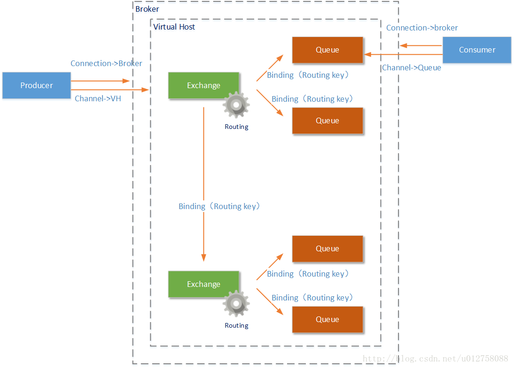
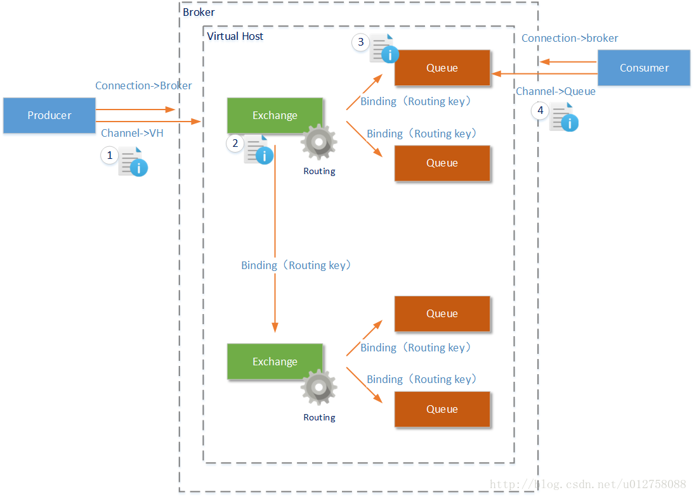
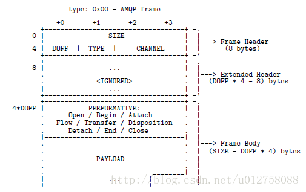
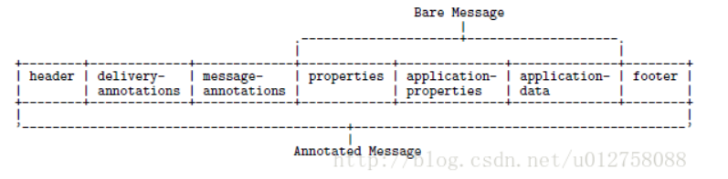
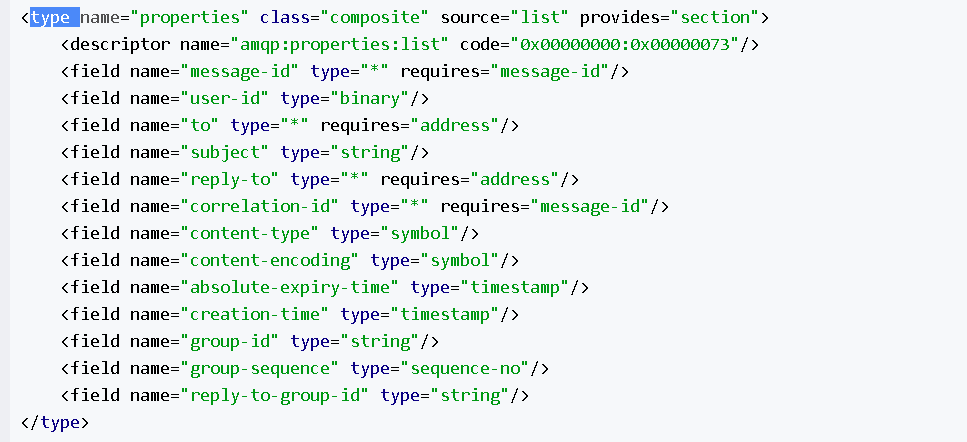

# 申明

以下内容全部是转载网络的博客的内容

# AMQP消息协议（AMQP协议）

AMQP协议的全称是：Advanced Message Queuing Protocol（高级消息队列协议）。目前AMQP协议的版本为 Version 1.0，这个协议标准在2014年通过了国际标准组织 (ISO) 和国际电工委员会 (IEC) 的投票，成为了新的 ISO 和 IEC 国际化标准。

## 1、协议概览 

AMQP官网 http://www.amqp.org/ 的协议说明文档。本小节的内容我试图在能力所及的范围内，为各位读者将AMQP协议的核心要点讲清楚。为了达到这个目的，首先将AMQP协议的原理用下图进行一个全面呈现，然后在详细讲解图中的每一个要点：

 

从上图我们可以看到AMQP协议的各个组成部分： 

* AMQP协议中的元素包括：Message（消息体）、Producer（消息生产者）、Consumer（消息消费者）、Virtual Host（虚拟节点）、Exchange（交换机）、Queue（队列）等；

* **由Producer（消息生产者）和Consumer（消息消费者）构成了AMQP的客户端**，他们是发送消息和接收消息的主体。**AMQP服务端称为Broker**，一个Broker中一定包含完 整的Virtual Host（虚拟主机）、 Exchange（交换机）、Queue（队列）定义； 

* 一个Broker可以创建多个Virtual Host（虚拟主机），我们将讨论的Exchange和Queue都是虚拟机中的工作元素（还有User元素）。**注意，如果AMQP是由多个Broker构成的集群提供服务，那么一个Virtual Host也可以由多个Broker共同构成；** 

* Connection是由Producer（消息生产者）和Consumer（消息消费者）创建的连接，连接到Broker物理节点上。但是有了Connection后客户端还不能和服务器通信，在Connection之上客户端会创建Channel，连接到Virtual Host或者Queue上，这样客户端才能向Exchange发送消息或者从Queue接受消息。**一个Connection上允许存在多个Channel，只有Channel中能够发送/接受消息。**

* **Exchange是AMQP协议中的交换机**，**Exchange可以绑定多个Queue也可以同时绑定其他Exchange。消息通过Exchange时，会按照Exchange中设置的Routing（路由）规则（路由规则还会和Message中的Routing Key属性配合使用），将消息发送到符合的Queue或者Exchange中。**

  那么AMQP消息在这个结构中是如何通过Producer发出，又经过Broker最后到达Consumer的呢？请看下图：

* 在Producer（消息生产者）客户端建立了Channel后，就建立了到Broker上Virtual Host的连接。接下来Producer就可以向这个Virtual Host中的Exchange发送消息了；
* Exchange（交换机）能够处理消息的前提是：**它至少已经和某个Queue或者另外的Exchange形成了绑定关系，并设置好了到这些Queue和Excahnge的Routing（路由规则）**。**Excahnge中的Routing有三种模式**，我们随后会讲到。在Exchange收到消息后，会根据设置的Routing（路由规则），将消息发送到符合要求的Queue或者Exchange中（**路由规则还会和Message中的Routing Key属性配合使用**）；
* Queue收到消息后，可能会进行如下的处理：如果当前没有Consumer的Channel连接到这个Queue，那么Queue将会把这条消息进行存储直到有Channel被创建（AMQP协议的不同实现产品中，存储方式又不尽相同），如果已经有Channel连接到这个Queue，那么消息将会按顺序被发送给这个Channel；
* Consumer收到消息后，就可以进行消息的处理了。但是整个消息传递的过程还没有完成：视设置情况，Consumer在完成某一条消息的处理后，将需要手动的发送一条ACK消息给对应的Queue（当然您可以设置为自动发送，或者无需发送）。**Queue在收到这条ACK信息后，才会认为这条消息处理成功，并将这条消息从Queue中移除；**如果在对应的Channel断开后，Queue都没有这条消息的ACK信息，这条消息将会重新被发送给另外的Channel。当然，您还可以发送NACK信息，这样这条消息将会立即归队，并发送给另外的Channel。

## 2. Message（消息体）

通过上一小节的描述，我们可以看到AMQP协议中消息的处理规则和Stomp协议中消息的处理规则有类似之处，比如对ACK、NACK的使用。但明显不同的地方还是很多，例如AMQP中Exchange元素提供的Routing路由规则，这显然比Stomp协议中直接发送给Queue要灵活得多。

 为了支持AMQP协议中的这些规则，AMQP协议中的消息也必须有特定的格式，**实际上AMQP协议要比Stomp协议复杂得多**。下面我们就根据ISO/IEC发布的AMQP Version 1.0标准文档，来讨论一下AMQP协议中的消息格式。

首先要说明的是目前国内多个技术站点，详细介绍AMQP消息格式的文章本来就不多（不包括那些聊聊几笔的转发），而且基本上都没有详细讲解格式本身，只是粗略说明了AMQP消息采用二进制格式（任何应用层协议在网络上进行传输，都是使用二进制流进行的，所以这个说法当然没错）。 

**有的文章还向读者传递了错误的信息。例如说AMQP消息格式包括两部分：消息头和消息正文**。 这**是不完全的表诉**，虽然AMQP消息格式确实包括Header和Body部分，但是绝对不止这两个部分。（如果真是这样，ISO/IEC组织就不需要使用125页的文档篇幅来进行说明了）	

首先我们需要说明的是，**作为一种网络通讯协议，AMQP工作在七层/五层网络模型的应用层，是一个典型的应用层协议；**另外，由于AMQP协议存在多种元素定义，且这些元素定义工作在不同的领域。例如Channel的定义是为了基于网络连接记录会话状态；Queue等元素帮助AMQP完成路由规则，这些元素在Message消息记录中都需要有所体现。 所以AMQP协议首先要记录网络状态和会话状态，格式如下（AMQP帧的定义在《OASIS Advanced Message Queueing Protocol (AMQP) Version 1.0》文档的第38页）：

其中非PAYLOAD部分，在网络协议的应用层说明Channel的工作状态（当然还有说明整个AMQP消息的长度区域：SIZE），我**们真正需要的内容存在PAYLOAD区域。**PAYLOAD区域（译文称为‘交付区’）的格式如下（可以在《OASIS Advanced Message Queueing Protocol (AMQP) Version 1.0》文档的第3部分：messaging第82页找到详细说明）：

在PAYLAOD区域一共包含7个数据区域：header、delivery-annotations（传递注释）、message-annotations（消息注释）、properties（属性）、application-properties（应用属性）、application-data（应用数据）、footer。这些元素的作用如下：

* header：header部分记录了AMQP消息的在‘支持AMQP的中间件’中的交互状态。例如该条消息在节点间被交互的总次数、优先级、TTL（Time To Live）值等信息

* delivery-annotations（传递注释）：**在header部分只能传递规范的、标准的、经过ISO/IEC组织定义的属性**。那么如果需要在header部分传递一些非标准信息怎么办呢？这就是delivery-annotations数据区域存在的意义：**用来记录那些’非标准’的header信息**；

* message-annotations（消息注释）：这个数据区域，用于存储一些自定义的辅助属性。**和delivery-annotations区域的非标准信息不同，这里的自定义属性主要用于消息的转换**。例如AMQP-JMS信息转换过程中将依据这个数据区域的“x-opt-jms type”、“x-opt-to-type”、“x-opt-reply-type”和“name”属性进行JMS规范中对应的“JMSType”、“Type of the JMSDestination”、“Type of the JMSReplyTo”和“JMS_AMQP_MA_name”

  属相的转换；

* properties（属性）：从整个AMQP消息的properties属性开始，到AMQP消息的application-data部分结束，才是AMQP消息的正文内容（译文称为‘裸消息’）。**Properties属性记录了AMQP消息正文的那些‘不可变’属性**。**在properties部分只能传递规范的、标准的、经过ISO/IEC组织定义的属性。**例如：消息id、分组id、发送者id、内容编码等。以下是AMQP协议文档中对Properties部分属性的描述（只能包含这些信息）：

   

* application-properties（应用属性）：在这部分数据中主要记录和应用有关的数据，AMQP的实现产品（例如RabbitMQ）需要用这部分数据决定其处理逻辑。例如：送入哪一个Exchange、消息的Routing值是什么、是否进行持久化等;

* application-data（应用数据）：使用二进制格式描述的AMQP消息的用户部分内容。既是**我们发送出去的真实内容**；

* footer：一般在这个数据区域存储辅助内容，例如消息的哈希值，HMAC，签名或者加密细节 。

以上才是一个AMQP消息的完整结构。当然由于篇幅限制，在某一个数据区域的‘标准’属性就没有再细讲了，例如Properties数据区域定义的creation-time属性、Header数据区域定义的durable属性。 

## 3. Exchange（交换机）

**路由规则 Exchange交换机在AMQP协议中主要负责按照一定的规则，将收到的消息转发到已经和它事先绑定好的Queue或者另外的Exchange中。Excahnge交换机的这个处理过程称之为Routing（路由）。目前流行的AMQP路由实现一共有三种：分别是Direct Exchange、Fanout Exchange和Topic Exchange。**需要特别注意的是：Exhange需要具备怎样的‘路由’规则，并没有在AMQP标准协议进行强行规定，目前流行的AMQP转发规则都是AMQP实现产品自行开发的（这也是为什么AMQP消息中和路由、过滤规则相关的属性是存放在application-properties区域的原因）。

* **direct** 

  direct模式下Exchange将使用AMQP消息中所携带的Routing-Key和Queue中的Routing Key进行比较。如果两者完全匹配，就会将这条消息发送到这个Queue中

* **topic**

  Exchange将支持使用‘#’和‘ * ’通配符进行Routing Key的匹配查找（**‘#’表示0个或若干个关键词，‘ * ’表示一个关键词，注意是关键词不是字母**）

  这里我们再举几个通配符匹配的示例： 

  * “param.#”，可以匹配“param”、“param.test”、“param.value”、“param.test.child”等等AMQP消息的Routing Key；但是不能匹配诸如“param1.test”、“param2.test”、“param3.test”。以为param这个关键
  * “param.*.value”，可以匹配“param.value.value”、“param.test.value”、“param.b.value”等Routing Key；但是不能匹配诸如“param.value”、“param.value.child”等Routing Key。

* **fanout**

  设置为Fanout模式的Exchange收到AMQP消息后，将会将这个AMQP消息复制多份，分别发送到和自己绑定的各个Queue中

**注意** : 以上介绍的Direct 路由模式和Topic 路由模式中，如果Exchange交换机没有找到任何匹配Routing Key的Queue，那么这条AMQP消息会被丢弃。（**只有Queue有保存消息的功能，但是Exchange并不负责保存消息**） 
