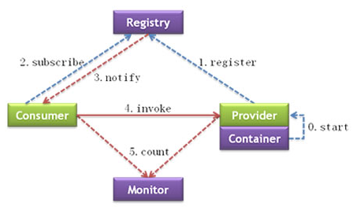

**官网链接（这里面包含用法，还有部分源码讲解）**：http://dubbo.incubator.apache.org/zh-cn/docs/user/preface/architecture.html

**dubbo整体的一个设计就像是一个电脑主板一样的东西，只要做对应功能组件的适配，那么你的组件就可以链接上来，作为这台电脑的运行时的组件**

# RPC主架构

| `Provider`  | 暴露服务的服务提供方                   |
| ----------- | -------------------------------------- |
| `Consumer`  | 调用远程服务的服务消费方               |
| `Registry`  | 服务注册与发现的注册中心               |
| `Monitor`   | 统计服务的调用次数和调用时间的监控中心 |
| `Container` | 服务运行容器                           |

# 功能

http://dubbo.incubator.apache.org/zh-cn/docs/user/maturity.html

# 健壮性

- 监控中心宕掉不影响使用，只是丢失部分采样数据
- 数据库宕掉后，注册中心仍能通过缓存提供服务列表查询，但不能注册新服务
- 注册中心对等集群，任意一台宕掉后，将自动切换到另一台
- 注册中心全部宕掉后，服务提供者和服务消费者仍能通过本地缓存通讯
- 服务提供者无状态，任意一台宕掉后，不影响使用
- 服务提供者全部宕掉后，服务消费者应用将无法使用，并无限次重连等待服务提供者恢复

# 直观地感受

服务注册，发现的demo

# 使用不同协议，会看到什么不同

