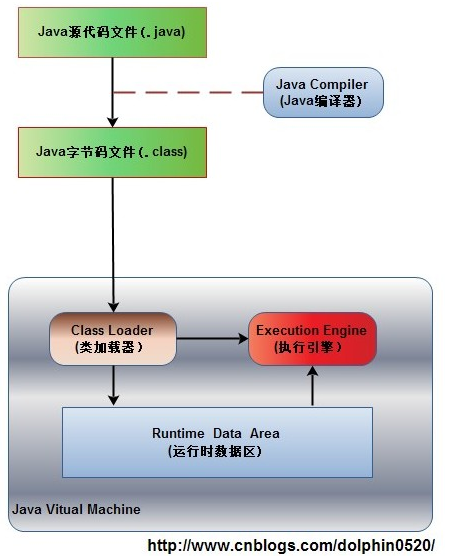
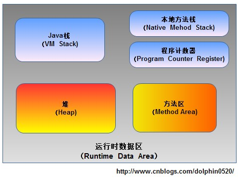
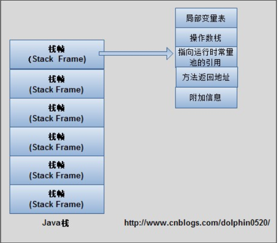

　　　　　　　　　　　　　　　　　    JVM的内存区域划分

　　学过C语言的朋友都知道C编译器在划分内存区域的时候经常将管理的区域划分为数据段和代码段，数据段包括堆、栈以及静态数据区。那么在Java语言当中，内存又是如何划分的呢？

　　由于Java程序是交由JVM执行的，所以我们在谈Java内存区域划分的时候事实上是指JVM内存区域划分。在讨论JVM内存区域划分之前，先来看一下Java程序具体执行的过程：

　　如上图所示，首先Java源代码文件(.java后缀)会被Java编译器编译为字节码文件(.class后缀)，然后由JVM中的类加载器加载各个类的字节码文件，加载完毕之后，交由JVM执行引擎执行。在整个程序执行过程中，JVM会用一段空间来存储程序执行期间需要用到的数据和相关信息，这段空间一般被称作为Runtime Data Area（运行时数据区），也就是我们常说的JVM内存。因此，在Java中我们常常说到的内存管理就是针对这段空间进行管理（如何分配和回收内存空间）。

　　在知道了JVM内存是什么东西之后，下面我们就来讨论一下这段空间具体是如何划分区域的，是不是也像C语言中一样也存在栈和堆呢？

## 一.运行时数据区包括哪几部分？

　　根据《Java虚拟机规范》的规定，运行时数据区通常包括这几个部分：程序计数器(Program Counter Register)、Java栈(VM Stack)、本地方法栈(Native Method Stack)、方法区(Method Area)(1.8 使用大小动态变化的meta splace，在直接内存区 )、堆(Heap)。

　　如上图所示，JVM中的运行时数据区应该包括这些部分。在JVM规范中虽然规定了程序在执行期间运行时数据区应该包括这几部分，但是至于具体如何实现并没有做出规定，不同的虚拟机厂商可以有不同的实现方式。

## 二.运行时数据区的每部分到底存储了哪些数据？

　　下面我们来了解一下运行时数据区的每部分具体用来存储程序执行过程中的哪些数据。

### 1.程序计数器

　　程序计数器（Program Counter Register），也有称作为PC寄存器。想必学过汇编语言的朋友对程序计数器这个概念并不陌生，在汇编语言中，程序计数器是指CPU中的寄存器，它保存的是程序当前执行的指令的地址（也可以说保存下一条指令的所在存储单元的地址），当CPU需要执行指令时，需要从程序计数器中得到当前需要执行的指令所在存储单元的地址，然后根据得到的地址获取到指令，在得到指令之后，程序计数器便自动加1或者根据转移指针得到下一条指令的地址，如此循环，直至执行完所有的指令。

　　虽然JVM中的程序计数器并不像汇编语言中的程序计数器一样是物理概念上的CPU寄存器，但是JVM中的程序计数器的功能跟汇编语言中的程序计数器的功能在逻辑上是等同的，也就是说是用来指示 执行哪条指令的。

　　由于在JVM中，多线程是通过线程轮流切换来获得CPU执行时间的，因此，在任一具体时刻，一个CPU的内核只会执行一条线程中的指令，因此，为了能够使得每个线程都在线程切换后能够恢复在切换之前的程序执行位置，每个线程都需要有自己独立的程序计数器，并且不能互相被干扰，否则就会影响到程序的正常执行次序。因此，可以这么说，程序计数器是每个线程所私有的。

　　在JVM规范中规定，如果线程执行的是非native方法，则程序计数器中保存的是当前需要执行的指令的地址；如果线程执行的是native方法，则程序计数器中的值是undefined。

　　由于程序计数器中存储的数据所占空间的大小不会随程序的执行而发生改变，因此，对于程序计数器是不会发生内存溢出现象(OutOfMemory)的。

### 2.Java栈

　　Java栈也称作虚拟机栈（Java Vitual Machine Stack），也就是我们常常所说的栈，跟C语言的数据段中的栈类似。事实上，Java栈是Java方法执行的内存模型。为什么这么说呢？下面就来解释一下其中的原因。

　　Java栈中存放的是一个个的栈帧，每个栈帧对应一个被调用的方法，在栈帧中包括局部变量表(Local Variables)、操作数栈(Operand Stack)、指向当前方法所属的类的运行时常量池（运行时常量池的概念在方法区部分会谈到）的引用(Reference to runtime constant pool)、方法返回地址(Return Address)和一些额外的附加信息。当线程执行一个方法时，就会随之创建一个对应的栈帧，并将建立的栈帧压栈。当方法执行完毕之后，便会将栈帧出栈。因此可知，线程当前执行的方法所对应的栈帧必定位于Java栈的顶部。讲到这里，大家就应该会明白为什么 在 使用 递归方法的时候容易导致栈内存溢出的现象了以及为什么栈区的空间不用程序员去管理了（当然在Java中，程序员基本不用关系到内存分配和释放的事情，因为Java有自己的垃圾回收机制），这部分空间的分配和释放都是由系统自动实施的。对于所有的程序设计语言来说，栈这部分空间对程序员来说是不透明的。下图表示了一个Java栈的模型：

　　局部变量表，顾名思义，想必不用解释大家应该明白它的作用了吧。就是用来存储方法中的局部变量（包括在方法中声明的非静态变量以及函数形参）。对于基本数据类型的变量，则直接存储它的值，对于引用类型的变量，则存的是指向对象的引用。局部变量表的大小在编译器就可以确定其大小了，因此在程序执行期间局部变量表的大小是不会改变的。

　　操作数栈，想必学过数据结构中的栈的朋友想必对表达式求值问题不会陌生，栈最典型的一个应用就是用来对表达式求值。想想一个线程执行方法的过程中，实际上就是不断执行语句的过程，而归根到底就是进行计算的过程。因此可以这么说，程序中的所有计算过程都是在借助于操作数栈来完成的。

　　指向运行时常量池的引用，因为在方法执行的过程中有可能需要用到类中的常量，所以必须要有一个引用指向运行时常量。

　　方法返回地址，当一个方法执行完毕之后，要返回之前调用它的地方，因此在栈帧中必须保存一个方法返回地址。

　　由于每个线程正在执行的方法可能不同，因此每个线程都会有一个自己的Java栈，互不干扰。

### 3.本地方法栈

　　本地方法栈与Java栈的作用和原理非常相似。区别只不过是Java栈是为执行Java方法服务的，而本地方法栈则是为执行本地方法（Native Method）服务的。在JVM规范中，并没有对本地方发展的具体实现方法以及数据结构作强制规定，虚拟机可以自由实现它。在HotSopt虚拟机中直接就把本地方法栈和Java栈合二为一。

### 4.堆

　　在C语言中，堆这部分空间是唯一一个程序员可以管理的内存区域。程序员可以通过malloc函数和free函数在堆上申请和释放空间。那么在Java中是怎么样的呢？

　　Java中的堆是用来存储对象本身的以及数组（当然，数组引用是存放在Java栈中的）。只不过和C语言中的不同，在Java中，程序员基本不用去关心空间释放的问题，Java的垃圾回收机制会自动进行处理。因此这部分空间也是Java垃圾收集器管理的主要区域。另外，堆是被所有线程共享的，在JVM中只有一个堆。

### 5.方法区

　　方法区在JVM中也是一个非常重要的区域，它与堆一样，是被线程共享的区域。在方法区中，存储了每个类的信息（包括类的名称、方法信息、字段信息）、静态变量、常量以及编译器编译后的代码等。

　　在Class文件中除了类的字段、方法、接口等描述信息外，还有一项信息是常量池，用来存储编译期间生成的字面量和符号引用。

　　在方法区中有一个非常重要的部分就是运行时常量池，它是每一个类或接口的常量池的运行时表示形式，在类和接口被加载到JVM后，对应的运行时常量池就被创建出来。当然并非Class文件常量池中的内容才能进入运行时常量池，在运行期间也可将新的常量放入运行时常量池中，比如String的intern方法。

　　在JVM规范中，没有强制要求方法区必须实现垃圾回收。很多人习惯将方法区称为“永久代”，是因为HotSpot虚拟机以永久代来实现方法区，从而JVM的垃圾收集器可以像管理堆区一样管理这部分区域，从而不需要专门为这部分设计垃圾回收机制。不过自从JDK7之后，Hotspot虚拟机便将运行时常量池从永久代移除了。

## 1.8 使用meta splace 替换了方法区

原因主要有两点：

1. 为了融合 HotSpot JVM与 JRockit VM而做出的努力 （官方给出的说明）
2. 实际使用中由于 方法去是固定大小的，经常会出现 OOM情况 （运行时字节码生成技术在现在的生产环境使用太频繁了）