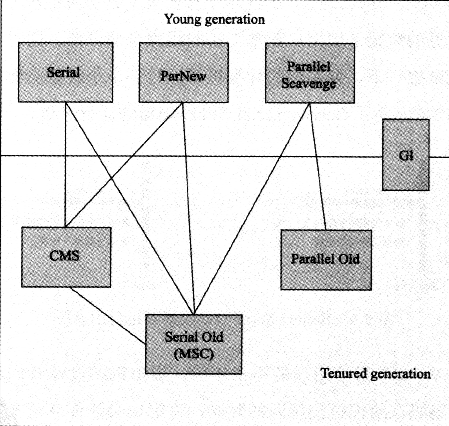
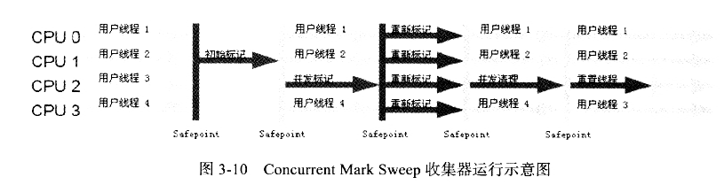

# Garbage Collection algorithm

* Mark-Sweep
* Mark-Compact
* Copying
* Generational Collection

# Garbage Collector

## Serial (Young Area Collector)

单线程收集器，收集时候必须暂停其他所有线程，直到它运行结束（Stop The World）

**垃圾收集算法: Copying**

## Serial Old 

Serial 的老年代版本，

*  主要是给Client 模式使用
* 如果在Server模式下 在JDK1.5  版本之前用来配合 Parallel scavenge 收集器使用
* 作为 CMS 收集器的后备预案（CMS 采用的 Mark-Sweep,会产生内存碎片，导致某些情况下会无法为大对象分配内存（因为没有这样一个大的连续的内存了），这时候就会触发 Serial Old 收集器）

**垃圾收集算法：Mark-Compact（会 Stop The World ）**

## ParNew (Young Area Collector)

就是Serial 的多线程版本，除了用多线程进行收集之外，别的和serial都一样的。

这个收集器是 使用CMS收集器 `-XX:+UseConcMarkSweepGC` 时候的新生代默认收集器

**垃圾收集算法: Copying**

## parallel Scavenge  (Young Area Collector)

和ParNew一样作为一个并行收集器，他的特点是，它的关注点是尽可能缩短垃圾收集时用户线程的停顿时间，它提供了一个可控的吞吐量：运行用户代码时间/运行用户代码时间+垃圾收集时间，如果虚拟机运行了100分钟，垃圾收集1分钟，那么 吞吐量就是 99%。

* 停顿时间越短，越适合需要与用户交互的程序，良好的响应速度能提升用户体验

* 高吞吐量可以更高效的利用CPU时间，尽快完成程序运算任务，适合在后台运算而不需要太多交互的程序。

那么它作为一个高吞吐的收集器,很明显适合作为一个后台运算系统使用

**垃圾收集算法: Copying**

**参数配置**：

| 参数                       | 作用                                                         |
| -------------------------- | ------------------------------------------------------------ |
| -XX:MaxGCPauseMillis       | **参数允许一个大于0的毫秒数，收集器将会尽可能保证收集时间不超过这个值**，但并不是说把这个值设置得越小越好，因为GC停顿时间缩短是以牺牲吞吐量和新生代空间换来的，系统将新生代调小，比如200M 肯定比300M收集快吧，这样时间上是快了，但是次数多了，吞吐量就下降了。 |
| -XX:GCTimeRatio            | 允许一(0,100)的值，设置系用户程序运行时间占总时间的比例，默认99也就是说99/（99+1) = 99% ，那么允许的最大垃圾收集时间就是1%的系统运行时间；如果设置19那就是 19/（19+1）= 95% ， 那么最大允许的垃圾收集时间就是5%的系统运行时间 |
| -XX:+UseAdaptiveSizePolicy | 这个开关参数打开之后，就不需要设置。新生代大小（-Xmn），Eden与Survivor比例，晋升老年代对象年龄（-XX:PretenureSizeThreshold）等细节参数了。虚拟机会根据系统运行情况收集性能监控信息，动态调整这些参数以提供最适合的停顿时间和最大吞吐量。这时候只需要设置堆的大小，-XX:MaxGCPauseMillis，-XX:GCTimeRatio 参数给虚拟机设立一个目标就好了 |

## parallel Old

parallel Scavenge 的老年代版本 ， 作为一个使用多线程。JDK1.6开始提供， 有了他 parallel Scavenge + parallel Old 的组合就是一个名副其实的**吞吐量优先**的组合收集器了，在注重吞吐量以及CPU资源敏感的场合，可以优先考虑这样一个组合。

## CMS (Concurrent Mark Sweep)

老年代收集器，采用Mark-Sweep 算法， 它是一种以获取最短停顿时间为目标的收集器，适用于重视服务响应速度，希望系统停顿时间短，能给用户带来较好体验的系统，比如互联网网站，B/S系统等。

相较于前面的几个收集器来说，它的运作过程相对复杂一些：

1. 初始标记  （会 Stop The World ）

   标记 GC root  能直接关联到的对象

2. 并发标记  （会 Stop The World ）

3. 重新标记

4. 并发清除

## G1 (Garbage First)

