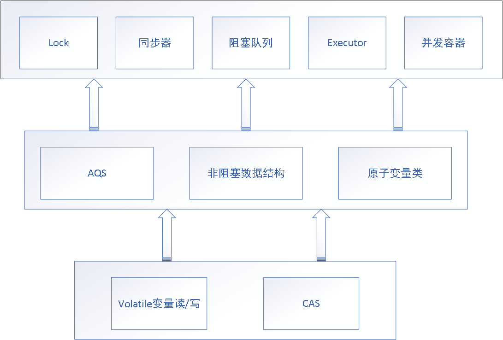

# JUC 介绍

整体结构图



从图中我们可以很明显的了解到，JUC的整个实现的基础是VAS+volatile的读写功能来实现的。

有关于CAS，volatile的详解请看：

> [CAS](CAS.md)
>
> [并发编程中的重要概念](并发编程中的重要概念.md) 介绍了volatile
>
> [一文解决内存屏障](一文解决内存屏障.md) 介绍了volatile 相关更详细的补充说明

# 原子变量类

## 分类

基本类型：

* AtomicBoolean 
* AtomicInteger
* AtomicLong
* LongAdder 高并发情况下比AtomicLong的表现要好，但是不能完全替代AtomicLong，具体的看[为什么要引入LongAdder](#为什么要引入LongAdder )
* JDK1.8时，`java.util.concurrent.atomic`包中，除了新引入**LongAdder**外，还有引入了它的三个兄弟类：**LongAccumulator、DoubleAdder、DoubleAccumulator**

数组：

* AtomicIntegerArray 、

* AtomicLongArray

reference:

* AtomicReference

* AtomicMarkableReference

* AtomicReferenceArray

* AtomicStampedReference

## 实现原理

这些类的实现在 java.util.concurrent.atomic包下。

我们java中并发下实现原子操作可以使用 **锁** 或 **通过循环CAS来实现原子操作（自旋）**,而我们的原子变量类都是使用的CAS。

举例我们来看看基本类型的原子变量AtomicLong的源代码，主要的字段：value字段，和valueOffset字段。下面源码中有注释

```java
public class AtomicLong extends Number implements java.io.Serializable {
    private static final long serialVersionUID = 1927816293512124184L;

    // setup to use Unsafe.compareAndSwapLong for updates
    private static final Unsafe unsafe = Unsafe.getUnsafe();
    // 这个值是我们数据在内存中的偏移量，查询值得时候通过这个找到内存中保存的value得值
    private static final long valueOffset;

    /**
     * Records whether the underlying JVM supports lockless
     * compareAndSwap for longs. While the Unsafe.compareAndSwapLong
     * method works in either case, some constructions should be
     * handled at Java level to avoid locking user-visible locks.
     */
    static final boolean VM_SUPPORTS_LONG_CAS = VMSupportsCS8();

    /**
     * Returns whether underlying JVM supports lockless CompareAndSet
     * for longs. Called only once and cached in VM_SUPPORTS_LONG_CAS.
     */
    private static native boolean VMSupportsCS8();

    static {
        try {
            valueOffset = unsafe.objectFieldOffset
                (AtomicLong.class.getDeclaredField("value"));
        } catch (Exception ex) { throw new Error(ex); }
    }
	// 使用volatile存储我们的实际的值，保证了数据的可见性
    private volatile long value;

    /**
     * Creates a new AtomicLong with the given initial value.
     *
     * @param initialValue the initial value
     */
    public AtomicLong(long initialValue) {
        value = initialValue;
    }

    /**
     * Creates a new AtomicLong with initial value {@code 0}.
     */
    public AtomicLong() {
    }
    // 剩下的省略掉
}
```

然后我们再来看看一个修改数据得方法具体的实现，别的放大都大同小异就不做过多说明

```java
 /**
     * Atomically increments by one the current value.
     *
     * @return the previous value
     */
    public final long getAndIncrement() {
        return unsafe.getAndAddLong(this, valueOffset, 1L);
    }
```

```java
 public final long getAndAddLong(Object var1, long var2, long var4) {
        long var6;
        do {
            // 通过实例得引用var1 + 偏移量var2 获取现在得值，这样获取到的是内存中最新的值，是满足可见性的
            var6 = this.getLongVolatile(var1, var2);
            // 然后这里在进行cas操作来实现变量的数据更新 var6 旧值，var6 + var4新值
        } while(!this.compareAndSwapLong(var1, var2, var6, var6 + var4));
        return var6;
    }
```

## 为什么要引入LongAdder 

AtomicLong类为开发人员使用线程安全的计数器提供了方便，但是AtomicLong在高并发下存在一些问题，如上所述，当大量线程调用同一个AtomicLong的实例的方法时候，同时只有一个线程会CAS计数器的值成功，失败的线程则会原地占用cpu进行自旋转重试，这回造成大量线程白白浪费cpu原地自旋转。

LongAdder类，其采用分而治之的策略来减少同一个变量的并发竞争度,LongAdder的核心思想是把一个原子变量分解为多个变量，让同样多的线程去竞争多个资源，这样竞争每个资源的线程数就被分担了下来，下面通过图形来理解下两者设计的不同之处：

* AtomicLong


* LongAdder


LongAdder维护了一个延迟初始化的原子性更新数组cells（默认情况下Cell数组是null）和一个基值变量base，由于cells占用内存是相对比较大的，所以一开始并不创建，而是在需要时候在创建，也就是惰性创建。

下面我们首先看下Cell的结构：

```java
    @sun.misc.Contended static final class Cell {
        volatile long value;
        Cell(long x) { value = x; }
        final boolean cas(long cmp, long val) {
            return UNSAFE.compareAndSwapLong(this, valueOffset, cmp, val);
        }

        // Unsafe 机制
        private static final sun.misc.Unsafe UNSAFE;
        private static final long valueOffset;
        static {
            try {
                UNSAFE = sun.misc.Unsafe.getUnsafe();
                Class<?> ak = Cell.class;
                valueOffset = UNSAFE.objectFieldOffset
                    (ak.getDeclaredField("value"));
            } catch (Exception e) {
                throw new Error(e);
            }
        }
    }
```

当一开始判断cell数组是null并且并发线程较少时候所有的累加操作都是对base变量进行的，这时候就退化为了AtomicLong。cell数组的大小保持是2的N次方大小，初始化时候Cell数组的中Cell的元素个数为2，数组里面的变量实体是Cell类型。

当多个线程在争夺同一个Cell原子变量时候如果失败并不是在当前cell变量上一直自旋CAS重试，而是会尝试在其它Cell的变量上进行CAS尝试，这个改变增加了当前线程重试时候CAS成功的可能性。最后获取LongAdder当前值的时候是把所有Cell变量的value值累加后在加上base返回的，如下代码：

```java
public long sumThenReset() {
        Cell[] as = cells; Cell a;
        long sum = base;
        base = 0L;
        if (as != null) {
            for (int i = 0; i < as.length; ++i) {
                if ((a = as[i]) != null) {
                    sum += a.value;
                    a.value = 0L;
                }
            }
        }
        return sum;
    }
```

## LongAccumulator

**LongAccumulator**是**LongAdder**的增强版。**LongAdder**只能针对数值的进行加减运算，而**LongAccumulator**提供了自定义的函数操作。其构造函数如下：


通过**LongBinaryOperator**，可以自定义对入参的任意操作，并返回结果（**LongBinaryOperator**接收2个long作为参数，并返回1个long）

**LongAccumulator**内部原理和LongAdder几乎完全一样，都是利用了父类**Striped64**的**longAccumulate**方法。这里就不再赘述了，读者可以自己阅读源码。

## DoubleAdder和DoubleAccumulator

从名字也可以看出，**DoubleAdder**和**DoubleAccumulator**用于操作double原始类型。

与**LongAdder**的唯一区别就是，其内部会通过一些方法，将原始的double类型，转换为long类型，其余和**LongAdder**完全一样：


# Locks(锁)

## Lock接口

首先我们看一下java中Lock接口的定义:

| 接口                                                         | 描述                                                         |
| ------------------------------------------------------------ | ------------------------------------------------------------ |
| void lock()                                                  | 调用该方法阻塞式获取锁，当锁获得后从该方法返回继续执行，如果为获取要一直等到获取到为止 **对应AQS的acquire/acquireShared方法** |
| void lockInterruptibly() throws InterruptedException         | 获取过程和lock方法基本相同，不过新增了可响应线程中断的功能。**对应AQS的acquireInterruptibly/acquireSharedInterruptibly方法** |
| boolean tryLock()                                            | 非阻塞获取锁，该方法立即返回，获取到锁就是true,反之false     |
| boolean tryLock(long time, TimeUnit unit) throws InterruptedException; | 在超时时间内获取锁,该方法在下面三种情况返回：<br />1.超时时间内获取到锁返回`true`<br/>2.超时时间结束未获取到锁返回`false`<br/>3.超时时间内线程被中断，返回false<br/>**调用AQS的tryAcquireNanos/tryAcquireSharedNanos方法** |
| void unlock();                                               | 释放锁 **调用AQS的release/releaseShared方法**                |
| Condition newCondition();                                    | 获取等待通知（相当于wiat()/）,该组件与当前锁绑定，当前线程只有获得了锁，才能使用和该锁绑定的这个组件await()&signal()方法，功能和 wait() , notify(),notifyAll() 相同，不过Condition提供了比他们更多的功能 |

**Lock接口的实现基本都是通过聚合了一个同步器(AbstractQueuedSynchronizer)的子类来完成线程访问控制的。**

## Condition接口

| 接口                                                         | 描述                                                         |
| ------------------------------------------------------------ | ------------------------------------------------------------ |
| void await() throws InterruptedException;                    | 使当前线程进入wait状态，直到被通知signal()/signalAll()/中断，其中被signal，唤醒之后，要直到获取到该Condition关联的锁，才能从该方法返回 |
| void awaitUninterruptibly();                                 | 和await方法类似，不过不响应中断                              |
| long awaitNanos(long nanosTimeout) throws InterruptedException; | 和await方法类似增加了超时机制                                |
| boolean await(long time, TimeUnit unit) throws InterruptedException; | 和await方法类似增加了超时机制                                |
| boolean awaitUntil(Date deadline) throws InterruptedException; | 和await方法类似增加了超时机制（一直到某个时间）              |
| void signal();                                               | 相当于notify()                                               |
| void signalAll();                                            | 相当于notifyAll()                                            |

> 关于 wait() , notify(),notifyAll()  可以看[并发编程中的重要概念](../并发编程中的重要概念.md)13.2 节内容
>
> [Lock源码](Lock源码.md)
>
> [Condition源码](Condition源码.md)
>
> 抛出该 InterruptedException 的方法，如果那个线程的中断状态被设置过，这个异常的处理机制中会重置该线程的中断状态。也就是interrupted的值会被重置

## object和JUC的Lock的监视器模型对比

| object       | juc                                                     |
| ------------ | ------------------------------------------------------- |
| 一个同步队列 | 一个同步队列                                            |
| 一个等待队列 | 多个等待队列（因为可以newCondition()产生多个Condition） |

## LockSupport

在将AQS之前我们先来了解一下 LockSupport 工具 。在JUC中当我们需要阻塞或唤醒一个线程的时候，都会使用到LockSupport工具来完成相关工作，它定义一组公共的static方法，来实现最基本的线程阻塞和唤醒功能。

| 方法名                                      | 描述                                                         |
| ------------------------------------------- | ------------------------------------------------------------ |
| public static void park()                   | 阻塞当前线程，只有调用**upark**方法或者当前线程被中断，才能从park方法处返回 |
| public static void parkNanos(long nanos)    | 在**park**基础上增加了超时机制                               |
| public static void parkUntil(long deadline) | 阻塞当前线程直到deadline时间（是1970年到deadline的毫秒数）   |
| public static void unpark(Thread thread)    | 唤醒处于阻塞状态的线程                                       |

## AQS(AbstractQueuedLongSynchronizer)

[AQS](AQS.md)

## ReentrantLock

是一个可重入的独占式同步锁，可以替代synchronized来使用，既然是锁，那么它当然要实现Lock接口中的各种类型接口了。下面我们回分析这些接口怎么用它内置的同步器来实现的

那我们先来看看它的**公平锁和非公平锁这两种同步器**  

**从代码可以看出默认非公平模式**

```java
public ReentrantLock() {
        sync = new NonfairSync();
}
public ReentrantLock(boolean fair) {
        sync = fair ? new FairSync() : new NonfairSync();
}
```

**同步器基类**

```java
/**
 * ReentrantLock 中的组合的同步器的基类，会存在FairSync，和 NonfairSync 两个实现类
 */
abstract static class Sync extends AbstractQueuedSynchronizer {
    private static final long serialVersionUID = -5179523762034025860L;

    /**
	 * FairSync，和 NonfairSync 两个实现类 会实现这个方法
     */
    abstract void lock();

    /**
     * 非公平锁的获取锁的实现
     */
    final boolean nonfairTryAcquire(int acquires) {
        final Thread current = Thread.currentThread();
        int c = getState();
        if (c == 0) {// 判断当前锁是否已被某线程获取
            // 
            if (compareAndSetState(0, acquires)) {
                setExclusiveOwnerThread(current);
                return true;
            }
        }
        else if (current == getExclusiveOwnerThread()) {// 如果获取到该锁的是当前线程，执行可重入逻辑
            int nextc = c + acquires; 
            if (nextc < 0) // overflow
                throw new Error("Maximum lock count exceeded");
            setState(nextc);
            return true;
        }
        return false;
    }
	/**
	 * 独占式：释放锁
	 */
    protected final boolean tryRelease(int releases) {
        int c = getState() - releases;
        if (Thread.currentThread() != getExclusiveOwnerThread())
            throw new IllegalMonitorStateException();
        boolean free = false;
        if (c == 0) {
            free = true;
            setExclusiveOwnerThread(null);// 将锁当前的独占锁置为 null
        }
        setState(c);
        return free;
    }
	// 是否是当前线程独占了该锁
    protected final boolean isHeldExclusively() {
        return getExclusiveOwnerThread() == Thread.currentThread();
    }
	
    final ConditionObject newCondition() {
        return new ConditionObject();
    }

    // Methods relayed from outer class

    final Thread getOwner() {
        return getState() == 0 ? null : getExclusiveOwnerThread();
    }

    final int getHoldCount() {
        return isHeldExclusively() ? getState() : 0;
    }

    final boolean isLocked() {
        return getState() != 0;
    }

    /**
     * Reconstitutes the instance from a stream (that is, deserializes it).
     */
    private void readObject(java.io.ObjectInputStream s)
        throws java.io.IOException, ClassNotFoundException {
        s.defaultReadObject();
        setState(0); // reset to unlocked state
    }
}
```

### 公平锁FairSync

```java
static final class FairSync extends Sync {
    private static final long serialVersionUID = -3000897897090466540L;

    final void lock() {
        // AQS定义的独占式获取同步状态的模板方法
        acquire(1);
    }

    /**
     * Fair version of tryAcquire.  Don't grant access unless
     * recursive call or no waiters or is first.
     */
    protected final boolean tryAcquire(int acquires) {
        final Thread current = Thread.currentThread();
        int c = getState();
        if (c == 0) {
            // hasQueuedPredecessors 判断锁的等待队列中是否有在等待的线程节点存在，如果有那就直接获取锁失败，会在AQS中被加入到等待队列的尾部，具体的就是AQS的acquire方法，反之，可以尝试使用CAS来修改state，修改成功就获取锁成功，设置该同步器的独占线程为当前线程，失败证明这时候存在竞争，并且当前线程竞争失败了。
            if (!hasQueuedPredecessors() &&
                compareAndSetState(0, acquires)) {
                setExclusiveOwnerThread(current);
                return true;
            }
        }
        else if (current == getExclusiveOwnerThread()) {// 这部代码实现了支持可重入
            int nextc = c + acquires;
            if (nextc < 0)
                throw new Error("Maximum lock count exceeded");
            setState(nextc);
            return true;
        }
        return false;
    }
}
```

### 非公平锁NonFairSync

```java
static final class NonfairSync extends Sync {
    private static final long serialVersionUID = 7316153563782823691L;
    
    final void lock() {
        // 这里也体现了非公平性获取的特性，不管该同步器的等待队列中是否存在正在等待的节点，直接尝试获取
        if (compareAndSetState(0, 1))
            setExclusiveOwnerThread(Thread.currentThread());
        else
            acquire(1);
    }
	/**
	 * acquire是AQS的独占式获取同步锁的模板方法
	 */
    protected final boolean tryAcquire(int acquires) {
        return nonfairTryAcquire(acquires);
    }
}
```

### ReentrantLock对Lock的实现

这里我这要说一trylocka方法，因为别的接口实现，都是和AQS定义的那些对应的模板方法相对应的，没有什么说明的必要

* **tryLock** 

  ```java
  public boolean tryLock() {
      return sync.nonfairTryAcquire(1);// 由于该接口是非阻塞获取锁，需要立即返回，获取到锁就是true,反之false 所以这里采取了直接使用非公平的方式来实现，大大的减少了被阻塞的可能，更加符合这个接口的定义
  }
  ```

### fair&NoFiar对比

* 非公平锁在使用时，由于使用的是抢占模式（谁抢到是谁的），这样就会避免公平性锁的问题，**能更充分的利用cpu**,**以及减少线程上下文切换带来的cpu损耗**，不过也会带来问题：**会导致线程饥饿现象**
* 公平模式，基于同步器的FIFO队列，在同步器（使用FIFO队列）中会转到等待状态，直到他的前驱节点唤醒它，这个唤醒到线程运行存在着较大延迟，带来了更多的线程上下文切换**导致对cpu的利用不够充足，以及上下文切换带来的性能损耗，也就是说会牺牲系统的吞吐量**

## ReadWriteLock 

实现类 ReentrantReadWriteLock 

### 读写锁中的互斥关系

* 读写互斥

* 写写互斥 

### 公平锁和非公平锁的同步器

初始化：默认使用非公平锁

```java
public ReentrantReadWriteLock() {
    this(false);
}

public ReentrantReadWriteLock(boolean fair) {
    sync = fair ? new FairSync() : new NonfairSync();
    readerLock = new ReadLock(this);
    writerLock = new WriteLock(this);
}
```

```java
/**
 * Nonfair version of Sync
 */
static final class NonfairSync extends Sync {
    private static final long serialVersionUID = -8159625535654395037L;
    final boolean writerShouldBlock() {
        return false; // 非公平模式下，写锁总是抢占模式
    }
    final boolean readerShouldBlock() {
        // 非公平模式下，读锁需要等待的情况只有，这时候等待的节点中国首届点是一个独占式的写锁节点
        return apparentlyFirstQueuedIsExclusive();
    }
}

/**
 * Fair version of Sync
 * 公平模式下，就和 reentrantlock里面的公平模式下的方法一样了，只要等待队列中存在节点，那么就需要按照 
 * 先后顺序来，这样才能保证公平
 */
static final class FairSync extends Sync {
    private static final long serialVersionUID = -2274990926593161451L;
    final boolean writerShouldBlock() {
        return hasQueuedPredecessors();
    }
    final boolean readerShouldBlock() {
        return hasQueuedPredecessors();
    }
}
```

### 读写锁的基类同步器

```java
abstract static class Sync extends AbstractQueuedSynchronizer {
    private static final long serialVersionUID = 6317671515068378041L;

    /*
     * Read vs write count extraction constants and functions.
     * Lock state is logically divided into two unsigned shorts:
     * The lower one representing the exclusive (writer) lock hold count,
     * and the upper the shared (reader) hold count.
     */
	
    static final int SHARED_SHIFT   = 16;
    // 32 shared 单位，共享锁的技术单位。占用同步状态字段state的高16位，记录共享锁的被获取的数量，使用sharedCount方法获取共享锁的被获取的数量
    static final int SHARED_UNIT    = (1 << SHARED_SHIFT);
    // 31 最大数量 锁计数器读锁/写锁分别的最大持有锁数，写锁就是冲入次数限制，读锁就是获取锁的相乘数量+重入次数的总数限制
    static final int MAX_COUNT      = (1 << SHARED_SHIFT) - 1;
    // 31 低16位最为写锁的计数，由于写锁是独占锁，所以计数的目的是记录重入次数，使用exclusiveCount方法获取该数值
    static final int EXCLUSIVE_MASK = (1 << SHARED_SHIFT) - 1;

    /** 返回当前共享锁的被获取过的次数  */
    static int sharedCount(int c)    { return c >>> SHARED_SHIFT; }
    /** 返回当前获取到写锁的线程的重入次数 */
    static int exclusiveCount(int c) { return c & EXCLUSIVE_MASK; }

    /**
     * 用来做每一个线程的重入次数计数器,使用ThreadLocalHoldCounter这个ThreadLocal的子类维护， 
     */
    static final class HoldCounter {
        int count = 0;
        // Use id, not reference, to avoid garbage retention
        final long tid = getThreadId(Thread.currentThread());
    }

    
    static final class ThreadLocalHoldCounter
        extends ThreadLocal<HoldCounter> {
        public HoldCounter initialValue() {
            return new HoldCounter();
        }
    }
  
    private transient ThreadLocalHoldCounter readHolds;
	/**
	 * 用于最一级的缓存
	 */
    private transient HoldCounter cachedHoldCounter;

   	// 第一个都线程
    private transient Thread firstReader = null;
    private transient int firstReaderHoldCount;

    Sync() {
        readHolds = new ThreadLocalHoldCounter();
        setState(getState()); // ensures visibility of readHolds，使用volatile的读写保证上面的 readHolds 的可见性
    }

    /*
     * Acquires and releases use the same code for fair and
     * nonfair locks, but differ in whether/how they allow barging
     * when queues are non-empty.
     * 获取和释放对fair和nonfair锁使用相同的代码，但在队列为非空时它们是否/如何允许bargging方面有所
     * 不同。
     */
    /**
     * 读锁的时候，公平锁，非公平锁的实现区别就在这里
     */
    abstract boolean readerShouldBlock();

    /**
     * 写锁的时候，公平锁，非公平锁的实现区别就在这里
     */
    abstract boolean writerShouldBlock();

	/**
	 * 写锁的独占式加锁方式就在这了
	 */
    protected final boolean tryAcquire(int acquires) {
        Thread current = Thread.currentThread();
        int c = getState();
        int w = exclusiveCount(c);
        if (c != 0) {
            // (Note: if c != 0 and w == 0 then shared count != 0)
            // c !=0 and w == 0(此时没有写锁) 那么就是有读锁，读写互斥，很显然线程应该进入同步队列
            if (w == 0 || current != getExclusiveOwnerThread())
                return false;
            //超过最大锁计数 抛出异常
            if (w + exclusiveCount(acquires) > MAX_COUNT)
                throw new Error("Maximum lock count exceeded");
            // Reentrant acquire 可重入
            setState(c + acquires);
            return true;
        }
        // writerShouldBlock 决定了当前是公平还是非公平，有初始化时选择的模式决定，和ReemrantLock
        // 是一样的
        if (writerShouldBlock() ||
            !compareAndSetState(c, c + acquires))
            return false;
        setExclusiveOwnerThread(current);// 设置独占线程
        return true;
    }
    
    /**
	 * 写锁的释放，使用该方法，因为对应的是独占式模式
	 *
	 */
    protected final boolean tryRelease(int releases) {
        // 首先判断释放锁的线程是不是该锁当前的独占线程，只有当前的独占线程（获取到所得线程）才能释放
        // 锁
        if (!isHeldExclusively())
            throw new IllegalMonitorStateException();
        int nextc = getState() - releases;
        boolean free = exclusiveCount(nextc) == 0;
        if (free)
            setExclusiveOwnerThread(null);
        setState(nextc);
        return free;
    }
    /**
	 * 共享式：读锁的获取
	 *
	 */ 
    protected final int tryAcquireShared(int unused) {
        Thread current = Thread.currentThread();
        int c = getState();
        // 此时 exclusiveCount(c) != 0 存在写锁，且持有锁的线程不是当前线程
        if (exclusiveCount(c) != 0 &&
            getExclusiveOwnerThread() != current)
            return -1;
        int r = sharedCount(c);// 获取当前被获取的读锁的数量(获取到的线程数的重入计数的总和）
        // readerShouldBlock 有初始化的时候选择的公平/非公平模式决定，判断方法和ReemrantLock相同
        // 并且获得锁的线程数量不能超过 MAX_COUNT 这个值也就是共享锁的最大共享次数，而不是最大贡献线程数，应为重入也会计算在内
        if (!readerShouldBlock() &&
            r < MAX_COUNT &&
            compareAndSetState(c, c + SHARED_UNIT)) {
            if (r == 0) {
                firstReader = current;// 记录当前并发下这是第一个获取读锁的线程
                firstReaderHoldCount = 1;// 记录该线程的重入次数
            } else if (firstReader == current) {
                firstReaderHoldCount++; //为firstReader 的重入计数
            } else {
                HoldCounter rh = cachedHoldCounter;
                if (rh == null || rh.tid != getThreadId(current))
                    // 缓存当前尝试获取锁的线程的重入计数器
                    cachedHoldCounter = rh = readHolds.get();
                else if (rh.count == 0)
                    readHolds.set(rh);
                rh.count++;// 增加重入计数
            }
            return 1;
        }
        return fullTryAcquireShared(current);
    }
    
    /**
     * Full version of acquire for reads, that handles CAS misses
     * and reentrant reads not dealt with in tryAcquireShared.
     * 用于处理CAS未命中和tryAcquireShared中未处理的可重入读取的完整版本的 acquire for reads
     */
    final int fullTryAcquireShared(Thread current) {
        /*
         * This code is in part redundant with that in
         * tryAcquireShared but is simpler overall by not
         * complicating tryAcquireShared with interactions between
         * retries and lazily reading hold counts.
         */
        HoldCounter rh = null;
        for (;;) {
            int c = getState();
             // 此时 exclusiveCount(c) != 0 存在写锁
            if (exclusiveCount(c) != 0) {
                // 持有锁的线程不是当前线程
                if (getExclusiveOwnerThread() != current)
                    return -1;
                // else we hold the exclusive lock; blocking here
                // would cause deadlock.
            } else if (readerShouldBlock()) {// 如果此时应该进入等待队列 
                // Make sure we're not acquiring read lock reentrantly
                // 这里的所有代码都是为了在这样的情况下确保我们没有以可重入方式获取读锁
                if (firstReader == current) {
                    // assert firstReaderHoldCount > 0;
                } else {
                    if (rh == null) {
                        rh = cachedHoldCounter;
                        if (rh == null || rh.tid != getThreadId(current)) {
                            rh = readHolds.get();
                            if (rh.count == 0)
                                readHolds.remove();
                        }
                    }
                    if (rh.count == 0)
                        return -1;
                }
            }
            if (sharedCount(c) == MAX_COUNT)
                throw new Error("Maximum lock count exceeded");
            if (compareAndSetState(c, c + SHARED_UNIT)) {// 获取锁成功
                if (sharedCount(c) == 0) {
                    firstReader = current;// 记录当前并发下这是第一个获取读锁的线程
                    firstReaderHoldCount = 1;// 记录该线程的重入次数
                } else if (firstReader == current) {
                    firstReaderHoldCount++;//为firstReader的重入计数
                } else {
                    if (rh == null)
                        rh = cachedHoldCounter;
                    if (rh == null || rh.tid != getThreadId(current))
                        rh = readHolds.get();
                    else if (rh.count == 0)
                        readHolds.set(rh);
                    rh.count++;// 增加重入计数
                    cachedHoldCounter = rh; // 缓存当前尝试获取锁的线程的重入计数器
                }
                return 1;
            }
        }
    }
    
	/**
	 * 共享式：读锁的释放
	 */
    protected final boolean tryReleaseShared(int unused) {
        Thread current = Thread.currentThread();
        if (firstReader == current) {
            // assert firstReaderHoldCount > 0;
            if (firstReaderHoldCount == 1)
                firstReader = null;
            else
                firstReaderHoldCount--;
        } else {
            // 获取当前线程的重入计数器
            HoldCounter rh = cachedHoldCounter;
            if (rh == null || rh.tid != getThreadId(current))
                rh = readHolds.get();
            int count = rh.count;//当前线程的重入次数
            if (count <= 1) {
                readHolds.remove();// 如果为重入，直接删除该重入计数器
                if (count <= 0)
                    throw unmatchedUnlockException();
            }
            --rh.count;// 较少重入计数
        }
        // 这里才是释放锁的逻辑
        for (;;) {
            int c = getState();
            int nextc = c - SHARED_UNIT;
            if (compareAndSetState(c, nextc))
                // Releasing the read lock has no effect on readers,
                // but it may allow waiting writers to proceed if
                // both read and write locks are now free.
                return nextc == 0;
        }
    }

    private IllegalMonitorStateException unmatchedUnlockException() {
        return new IllegalMonitorStateException(
            "attempt to unlock read lock, not locked by current thread");
    }

    /**
     * 这是写锁为了实现Lock接口的tryLock方法提供的，关于tryLock方法的定义可以看Lock接口相关定义
     * 代码很简单不做注释了
     */
    final boolean tryWriteLock() {
        Thread current = Thread.currentThread();
        int c = getState();
        if (c != 0) {
            int w = exclusiveCount(c);
            if (w == 0 || current != getExclusiveOwnerThread())
                return false;
            if (w == MAX_COUNT)
                throw new Error("Maximum lock count exceeded");
        }
        if (!compareAndSetState(c, c + 1))
            return false;
        setExclusiveOwnerThread(current);
        return true;
    }

    /**
     * 这是写锁为了实现Lock接口的tryLock方法提供的，关于tryLock方法的定义可以看Lock接口相关定义
	 * 
     */
    final boolean tryReadLock() {
        Thread current = Thread.currentThread();
        for (;;) {
            int c = getState();
            if (exclusiveCount(c) != 0 &&
                getExclusiveOwnerThread() != current)
                return false;
            int r = sharedCount(c);
            if (r == MAX_COUNT)
                throw new Error("Maximum lock count exceeded");
            if (compareAndSetState(c, c + SHARED_UNIT)) {
                if (r == 0) {
                    firstReader = current;
                    firstReaderHoldCount = 1;
                } else if (firstReader == current) {
                    firstReaderHoldCount++;
                } else {
                    HoldCounter rh = cachedHoldCounter;
                    if (rh == null || rh.tid != getThreadId(current))
                        cachedHoldCounter = rh = readHolds.get();
                    else if (rh.count == 0)
                        readHolds.set(rh);
                    rh.count++;
                }
                return true;
            }
        }
    }

    protected final boolean isHeldExclusively() {
        // While we must in general read state before owner,
        // we don't need to do so to check if current thread is owner
        return getExclusiveOwnerThread() == Thread.currentThread();
    }

    final int getReadLockCount() {
        return sharedCount(getState());
    }

    final boolean isWriteLoked() {
        return exclusiveCount(getState()) != 0;
    }
	// 获取当前写锁的重入次数
    final int getWriteHoldCount() {
        return isHeldExclusively() ? exclusiveCount(getState()) : 0;
    }
	// 获取当前读锁的重入次数
    final int getReadHoldCount() {
        if (getReadLockCount() == 0)
            return 0;

        Thread current = Thread.currentThread();
        if (firstReader == current)
            return firstReaderHoldCount;

        HoldCounter rh = cachedHoldCounter;
        if (rh != null && rh.tid == getThreadId(current))
            return rh.count;

        int count = readHolds.get().count;
        if (count == 0) readHolds.remove();
        return count;
    }

    /**
     * Reconstitutes the instance from a stream (that is, deserializes it).
    */
    private void readObject(java.io.ObjectInputStream s)
        throws java.io.IOException, ClassNotFoundException {
        s.defaultReadObject();
        readHolds = new ThreadLocalHoldCounter();
        setState(0); // reset to unlocked state
    }
  
   final int getCount() { return getState(); }
  
 }
```

### 该锁的优缺点介绍

在读多写少的情况下很容易出现**写线程饥饿**，虽然使用公平模式可以一定程度环节该问题，但是公平策略是以牺牲系统吞吐量为代价的

## StampedLock

## CountDownLatc