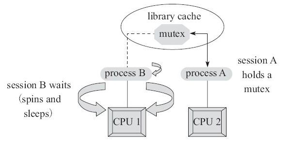

# 介绍

java中每一个对象都可以作为一个锁（锁是存在Java对象头里的。），当我们在使用`synchronized`关键字的时候具体表现是：

1. 普通同步方法，锁是当前实例对象（该关键字作用于普通方法）
2. 静态同步方法，锁是当前的类的Class的对象（该关键字作用于静态（static）方法）
3. 同步块，这个的锁就是放在`synchronized` 的括号里的配置对象了

JVM基于进入和退出Monitor对象来实现方法同步和代码块同步。代码块同步是使用monitorenter和monitorexit指令实现的，monitorenter指令是在编译后插入到同步代码块的开始位置，而monitorexit是插入到方法结束处和异常处。任何对象都有一个monitor与之关联，当且一个monitor被持有后，它将处于锁定状态。

根据虚拟机规范的要求，在执行monitorenter指令时，首先要去尝试获取对象的锁，如果这个对象没被锁定，或者当前线程已经拥有了那个对象的锁，把锁的计数器加1；相应地，在执行monitorexit指令时会将锁计数器减1，当计数器被减到0时，锁就释放了。如果获取对象锁失败了，那当前线程就要阻塞等待，直到对象锁被另一个线程释放为止。

注意：

1、synchronized同步快对同一条线程来说是可重入的，不会出现自己把自己锁死的问题；

# **Mutex Lock**

监视器锁（Monitor）本质是依赖于底层的操作系统的Mutex Lock（互斥锁）来实现的。每个对象都对应于一个可称为" 互斥锁" 的标记，这个标记用来保证在任一时刻，只能有一个线程访问该对象。

互斥锁：用于保护临界区，确保同一时间只有一个线程访问数据。对共享资源的访问，先对互斥量进行加锁，如果互斥量已经上锁，调用线程会阻塞，直到互斥量被解锁。在完成了对共享资源的访问后，要对互斥量进行解锁。

**mutex的工作方式：**

- 1) 申请mutex
- 2) 如果成功，则持有该mutex
- 3) 如果失败，则进行spin自旋. spin的过程就是在线等待mutex, 不断发起mutex gets, 直到获得mutex或者达到spin_count限制为止
- 4) 依据工作模式的不同选择yiled还是sleep
- 5) 若达到sleep限制或者被主动唤醒或者完成yield, 则重复1)~4)步，直到获得为止

由于Java的线程是映射到操作系统的原生线程之上的，如果要阻塞或唤醒一条线程，都需要操作系统来帮忙完成，这就需要从用户态转换到核心态中，因此状态转换需要耗费很多的处理器时间。所以synchronized是Java语言中的一个重量级操作。在JDK1.6中，虚拟机进行了一些优化，譬如在通知操作系统阻塞线程之前加入一段自旋等待过程（轻量级锁就有一个自旋等待过程，草果一定的自旋次数之后会膨胀程重量锁），避免频繁地切入到核心态中：

synchronized与java.util.concurrent包中的ReentrantLock相比，由于JDK1.6中加入了针对锁的优化措施（见后面），使得synchronized与ReentrantLock的性能基本持平。ReentrantLock只是提供了synchronized更丰富的功能，而不一定有更优的性能，所以在synchronized能实现需求的情况下，优先考虑使用synchronized来进行同步。

# synchronized中的多级锁

从java SE 6 开始为了减少锁的获取和释放带来的性能消耗，所以引入了：偏向锁，轻量级锁，所限目前synchronizd的锁存在四种状态（等级）：

* 无锁状态
* 偏向锁
* 轻量级锁
* 重量级锁

上诉的几个状态随着竞争情况的逐渐升级，锁的状态也会随之改变，**需要注意的是：锁可以升级但是不能降级**

## java对象头结构

为了继续说明`synchronized`的几种锁是在线程竞争中是怎样变化的，我们需要先了解 java的对象头结构，他们存储什么样的数据，因为我们知道这里的锁说到底也就是一个java对象，而在对象的锁则是在对象的对象头中管理的。

| 长度                       | 内容                  | 说明                                     |
| -------------------------- | --------------------- | ---------------------------------------- |
| 32/64 bit (取决于操作系统) | mark word             | 存储对象的hash code,分代年龄，锁相关信息 |
| 32/64 bit                  | Class Metadata adress | 存储指向对象数据类型的指针               |
| 32/64 bit                  | Array lenth           | 数组的长度（如果是数组类型的对象的话）   |

很显然我们的锁相关的信息存储在对象头的mark word 中，我们再来看看它的结构，32位JVM的默认存储结构

在运行期间对象的这部分信息会随着，锁的变化而变化，可能变成下面四种情况，在我们锁状态变化过程中，对象头的mark word的这个信息会这样变化

64位JVM

## 偏向锁

### 偏向锁的获取

偏向锁的获取方式是将对象头的 **MarkWord** 部分中， 标记上线程ID， 以表示哪一个线程获得了偏向锁。 具体的赋值逻辑如下：

* 首先读取目标对象的 MarkWord, 判断是否处于可偏向的状态（如下图），也就是我们的mark word 中此时的偏向锁信息

  

* 判断是否为可偏向状态（锁的对象头的mark woed 中的 thread id 不存在，是否是偏向锁 `1`,锁标志位`01`）

  这时候线程才可以使用CAS操作将自己的线程id写入到 锁的对象头的mark word中

* 如果是已偏向状态（thread id 存在了），只需判断该id是否等于当前线程的id
  * 相等，那就继续执行代码快
  * 不相等，证明该同步块存在线程竞争，需要撤销偏向锁（在这过程中锁会膨胀成轻量锁）

### 偏向锁的撤销

偏向锁的撤销（Revoke） 操作并不是将对象恢复到无锁可偏向的状态， 而是在偏向锁的获取过程中， 发现了竞争时， 直接将一个被偏向的对象“升级到” 被加了轻量级锁的状态。 这个操作的具体完成方式如下：

* 在偏向锁 CAS 更新操作失败以后， 等待到达全局安全点。
  * 通过 MarkWord 中已经存在的 Thread Id 找到成功获取了偏向锁的那个线程, 然后在该线程的栈帧中补充上轻量级加锁时， 会保存的锁记录（Lock Record）， 然后将被获取了偏向锁对象的 MarkWord 更新为* 指向这条锁记录的指针。
  * 至此， 锁撤销操作完成， 阻塞在安全点的线程可以继续执行。

### 偏向锁的在偏向机制

* 从偏向锁状态的mark word中的数据我们可以看到一个epoch的值，这个值就代表了该thread id对象相乘的偏向时效性
* 除了对象中的 epoch, 对象所属的类 class 信息中， 也会保存一个 epoch 值
* 每当遇到一个全局安全点时， 如果要对 class C 进行批量再偏向， 则首先对 class C 中保存的 epoch 进行增加操作， 得到一个新的 epoch_new
* 然后扫描所有持有 class C 实例的线程栈， 根据线程栈的信息判断出该线程是否锁定了该对象， 仅将 epoch_new 的值赋给被锁定的对象中。
* 退出安全点后， 当有线程需要尝试获取偏向锁时， 直接检查 class C 中存储的 epoch 值是否与目标对象中存储的 epoch 值相等， 如果不相等， 则说明该对象的偏向锁已经无效了， 可以尝试对此对象重新进行偏向操作。

## 轻量级锁

### 轻量级锁加锁

java线程在执行同步块之前，JVM会先在当前线程的这一**栈帧中**创建用于**存储锁记录的空间**，并且将对象（锁）的**对象头中的mark word数据**复制到这部分**锁记录空间中**，然后线程尝试使用 CAS将对象头的mark word 中的数据替换为指向锁记录的指针，如果成功，当前线程获取到了锁，如果失败表示其他线程竞争锁，当前线程会尝试使用自旋操作执行CAS尝试获取锁。 为了避免无用的自旋操作，会在多次尝试失败之后（也就是说这里的竞争比较激励），会将锁升级重量级锁（这时会修改对象的对象头中的锁标志为重量锁标志 `10`）

### 轻量级锁解锁

解锁过程正好相反，会使用原子的CAS将栈帧的所记录空间中对象的原mark word数据替换会对象头的mark word空间中。如果成功表示没有竞争发生，如果失败，表示当前锁存在竞争，锁就会膨胀成重量级锁

## 重量级锁

重量级锁依赖于操作系统的[互斥量（mutex） 实现](#**Mutex Lock**)， 其具体的详细机制此处暂不展开， 日后可能补充。 此处暂时只需要了解该操作会导致进程从用户态与内核态之间的切换， 是一个开销较大的操作。还会**存在锁对象的同步队列来维护该锁对象的正在等待获取锁的线程**，队列中获取到锁的线程，才会有资格参与cpu的时间片竞争

> 参考:
>
> * 《并发编程的艺术》
>* https://blog.csdn.net/lengxiao1993/article/details/81568130
> * 

