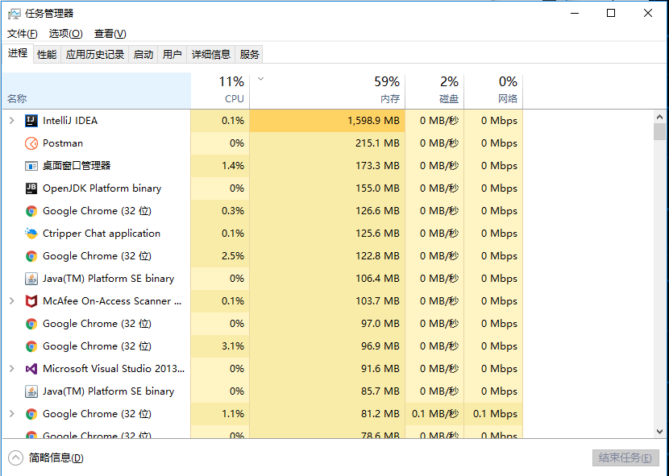
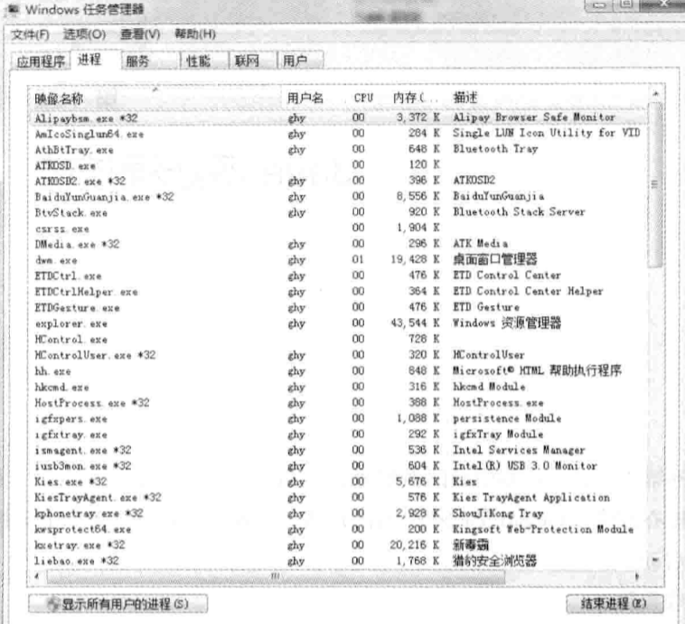

# 1.前言

在了解多线程编程之前我们需要知道什么是**多线程**，说到**多线程**那么我们也不得不说到**进程**，关于什么是进程最形象也最直观的就是下图，当我们打开windows系统的任务管理器的时候



这样一个个应用程序，在老版本的windows, 中你会看到这样的任务管理器，你会看到都是带有.exe的，因为在windows中启动的程序基本都是.exe的文件，一个进程也就是一个运行的程序，比如你打开的google浏览器呀什么的



我们再说线程，线程可以理解成我们进程中独立运行的子任务，比如我们使用的微信，你看朋友圈它使用的是一个线程，接收消息使用的是另一个线程，发送消息又是另一个线程，因为只有这样才能尽可能的达到多任务的并行，比如你在发消息给一个人A的时候，可以收到B，C,D给你回复的消息。就是你发消息和接收消息的是用不同的线程在执行任务才能实现，不然你让一个线程的做这两件事肯定是需要排队完成的

# 2.java中多线程的使用

## 2.1 在java中使用多线程的几种方式

### 2.1.1 继承 Thread  类

### 2.1.2 实现 Runable 接口

### 2.1.3 使用Callable+FutureTask

### 2.1.4 java中创建线程有几种方式？

实际上只有一种，那就是 Thread类中 init方法，上源码

我们在 `new Thread(),`new Thread(Runnable target) 或则使用 `callable + ruturetask`

```
public Thread() {
        init(null, null, "Thread-" + nextThreadNum(), 0);
}

public Thread(Runnable target) {
        init(null, target, "Thread-" + nextThreadNum(), 0);
}
.....
```


```java
  //这里指定返回String类型
        Callable<String> callable = new Callable<String>() {
            @Override
            public String call() throws Exception {
                System.out.println("Callable 已经运行啦");
                return "this is Callable is running";
            }
        };

        FutureTask<String> futureTask = new FutureTask<String>(callable);
        futureTask.run();

        try {
            if (futureTask.isDone()){   //任务完成
                System.out.println(futureTask.get());
            }
        } catch (InterruptedException e) {
            e.printStackTrace();
        } catch (ExecutionException e) {
            e.printStackTrace();
        }

```


```java
ExecutorService executorService = Executors.newSingleThreadExecutor();

        //这里指定返回Integer类型
        Callable<Integer> callable = new Callable<Integer>() {
            @Override
            public Integer call() throws Exception {
                System.out.println("Callable 已经运行啦");
                return 1024;
            }
        };

        Future<Integer> futureTask = executorService.submit(callable);
        try {
            Thread.sleep(100);
            if (futureTask.isDone()){
                System.out.println(futureTask.get());
            }
        } catch (InterruptedException e) {
            e.printStackTrace();
        } catch (ExecutionException e) {
            e.printStackTrace();
        }
```


线程池 执行 submit 方法的时候也是会把callable 包装成 FutureTask才执行的

```java
   /**
     * @throws RejectedExecutionException {@inheritDoc}
     * @throws NullPointerException       {@inheritDoc}
     */
    public <T> Future<T> submit(Callable<T> task) {
        if (task == null) throw new NullPointerException();
        RunnableFuture<T> ftask = newTaskFor(task);
        execute(ftask);
        return ftask;
    }
```

结合线程池的知识，实际上使用的都是  Thread 创建的线程在执行，再来看一下 init方法源码

```java
    private void init(ThreadGroup g, Runnable target, String name,
                      long stackSize, AccessControlContext acc) {
        if (name == null) {
            throw new NullPointerException("name cannot be null");
        }

        this.name = name;

        Thread parent = currentThread();
        SecurityManager security = System.getSecurityManager();
        if (g == null) {
            /* Determine if it's an applet or not */

            /* If there is a security manager, ask the security manager
               what to do. */
            if (security != null) {
                g = security.getThreadGroup();
            }

            /* If the security doesn't have a strong opinion of the matter
               use the parent thread group. */
            if (g == null) {
                g = parent.getThreadGroup();
            }
        }

        /* checkAccess regardless of whether or not threadgroup is
           explicitly passed in. */
        g.checkAccess();

        /*
         * Do we have the required permissions?
         */
        if (security != null) {
            if (isCCLOverridden(getClass())) {
                security.checkPermission(SUBCLASS_IMPLEMENTATION_PERMISSION);
            }
        }

        g.addUnstarted();

        this.group = g;
        this.daemon = parent.isDaemon();
        this.priority = parent.getPriority();
        if (security == null || isCCLOverridden(parent.getClass()))
            this.contextClassLoader = parent.getContextClassLoader();
        else
            this.contextClassLoader = parent.contextClassLoader;
        this.inheritedAccessControlContext =
                acc != null ? acc : AccessController.getContext();
        this.target = target;
        setPriority(priority);
        if (parent.inheritableThreadLocals != null)
            this.inheritableThreadLocals =
                ThreadLocal.createInheritedMap(parent.inheritableThreadLocals);
        /* Stash the specified stack size in case the VM cares */
        this.stackSize = stackSize;

        /* Set thread ID */
        tid = nextThreadID();
    }
```


## 2.2 Thread 类方法介绍


