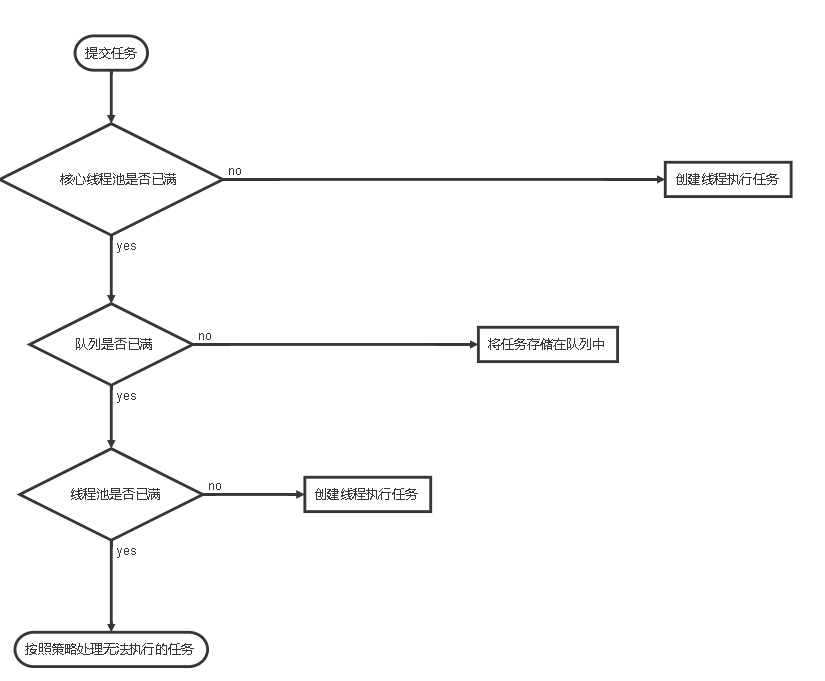
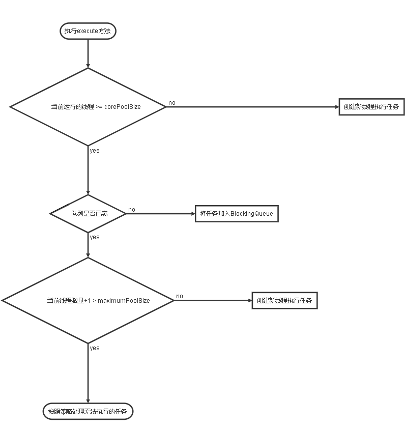

# 1. 的阻塞队列（BlockingQueue）

阻塞队列是一个**支持两个附加操作的队列**，这两个操作支持及阻塞的插入和移除的方法:

* 阻塞的插入：当队列满的时候，队列会阻塞插入元素的线程（利用AQS做同步），直到队列不满
* 阻塞的移除：当队列为空的时候，获取元素的线程会等待队列非空。

**阻塞队列常用于生产消费的场景，作为生产者存放元素，消费者获取元素的容器**

> [关于队列，阻塞队列的更多信息](../java集合/collection/queue/introduction.md)

# 1.线程池

## 1.1简介(起因+特点)

使用线程池的原因，在上文中我们说到了使用多线程的好处，以及给性能带来的提升，但是如果服务端程序每接到任务就创建一个线程然后执行，执行完销毁，这在普通请求量的情况下是比较好的。

**如果面对成千上万的请求，这时候就会创建有着成千上万的线程随之创建，销毁，这不是一个好的选择，因为线程的创建和销毁都是比较消耗系统资源的，而且带来了平凡的线程间上下文切换（这也是比较影响性能的）。**

线程池技术很好的解决了这样的问题，它预先创建一定数量的线程，线程的创建不是有用户控制，而是线程池内部机制控制，在这个前提下重复使用固定或若干数量的线程来完成任务。这样做的好处是：

* 实现了线程的复用
* 消除了线程的频繁创建和销毁带来的系统资源开销
* 面对过量任务的提交能够平缓的控制执行

## 1.2.原理

### 1.2.1 处理流程



### 1.2.2 工作线程

线程池创建线程时，会将线程封装成工作线程 `Worker` ,` Worker` 在执行完任务之后会循环获取工作队列(BlockingQueue)中的任务来执行。我们看一下`Worker的run()方法`:

```java
public void run() {
    runWorker(this);
}

final void runWorker(Worker w) {
        Thread wt = Thread.currentThread();
        Runnable task = w.firstTask;
        w.firstTask = null;
        w.unlock(); // 允许中断
        boolean completedAbruptly = true;
        try {
          // getTask() 去 BlockingQueue 获取任务来执行
            while (task != null || (task = getTask()) != null) {
                w.lock();
                // 如果池停止，则确保线程中断;
                // 如果没有，请确保线程不中断.  This
                // 这需要在第二种情况下重新检查。在清除中断时立即退出
                if ((runStateAtLeast(ctl.get(), STOP) ||
                     (Thread.interrupted() &&
                      runStateAtLeast(ctl.get(), STOP))) &&
                    !wt.isInterrupted())
                    wt.interrupt();
                try {
                    beforeExecute(wt, task);
                    Throwable thrown = null;
                    try {
                        task.run();// 执行任务
                    } catch (RuntimeException x) {
                        thrown = x; throw x;
                    } catch (Error x) {
                        thrown = x; throw x;
                    } catch (Throwable x) {
                        thrown = x; throw new Error(x);
                    } finally {
                        afterExecute(task, thrown);
                    }
                } finally {
                    task = null;
                    w.completedTasks++;
                    w.unlock();
                }
            }
            completedAbruptly = false;
        } finally {
            processWorkerExit(w, completedAbruptly);
        }
    }
```

## 1.3 线程池的使用

### 1.3.1 线程池的创建（ThreadPoolExecutor）

我们可以通过 `ThreadPoolExecutor` 提供的几个构造方法去创建线程池，由于最终调用的都是一个方法，这里我们就介绍这个最主要的方法：

```java
public ThreadPoolExecutor(int corePoolSize,
                          int maximumPoolSize,
                          long keepAliveTime,
                          TimeUnit unit,
                          BlockingQueue<Runnable> workQueue,
                          ThreadFactory threadFactory,
                          RejectedExecutionHandler handler){
                           
  ........
    
                          }
```

* `int corePoolSize ` : 线程池的基本线程数量大小，当有任务提交的时候（详细流程在16.3.1节），只要当前线程数量<corePoolSize，那就会创建一个新的工作线程来执行任务。

* `int maximumPoolSize `: 线程池最大工作线程数量，如果workQueue队列满了（前提肯定是当前线程池工作线程数量>=corePoolSize）,这时候线程池会创建新的工作线程来执行任务，**注意：如果下面的参数workQueue使用的是无界队列（也就是队列不会满）那么这个参数自然就没有作用了**

* `long keepAliveTime `: 当前有多于` corePoolSize` 的线程，则这些多出的线程在空闲时间超过 `keepAliveTime` 时将会终止，**如果每个任务的执行时间比较短，可以调大时间提高线程的利用率**，

  **默认情况下，保持活动策略只作用于核心线程以外的线程。但是只要 keepAliveTime 值大于 0，调用`allowCoreThreadTimeOut(true) ` 方法也可将此超时策略应用于核心线程，通常应该在使用该池前主动调用此方法。**

  原理是底层代码使用了，阻塞队列得`E poll(long timeout, TimeUnit unit)    throws InterruptedException` 这个方法，如果任务队列中超过该时间没有任务的话，那就重线程池得workers队列中移除该线程

* `TimeUnit unit` : 这个参数就是上面参数的时间单位了：

  * TimeUnit .DAYS(天)；
  * TimeUnit .HOURS(小时);
  * TimeUnit .MINUTES(分钟)
  * TimeUnit .SECONDS(秒)
  * TimeUnit .MILLISECONDS(毫秒=1/1000 秒)
  * TimeUnit .MICROSECONDS(微秒=1/1000 毫秒）
  * TimeUnit .NANOSECONDS（纳秒=1/1000 微秒)

* `BlockingQueue<Runnable> workQueue` : 任务队列，用于保存等待执行的任务的阻塞队列，可选择的有

  * `ArrayBlockingQueue`
  * `LinkedBlockingQueue`
  * `SynchronousQueue`
  * `PriorityBlockingQueue`
  * 等等

  更多队列以及使用这些队列的优缺点请看 [关于队列中的阻塞队列的更多信息](../java集合/collection/queue/introduction.md)

* `ThreadFactory threadFactory`: 线程的创建工厂，建议使用 ，因为在调优或则排查问题的时候，可以很好的监控到对应的线程的状态。

* `RejectedExecutionHandler handler` : 当线程池的线程数量达到最大，队列也满了的时候，这时候这个参数就起作用了，默认是使用`Abortpolicy`,jdk 1.5 中线程池框架提供了4种策略：

  * `Abortpolicy` : 当线程池的线程数量达到最大，队列也满了的时候，如果有新任务进来，直接抛出异常
  * `CallerRunsPolicy` : 当线程池的线程数量达到最大，队列也满了的时候，如果有新任务进来，只使用调用者所在的线程来运行任务
  * `DiscardOldestPolicy` : 当线程池的线程数量达到最大，队列也满了的时候，如果有新任务进来，丢弃队列里最近一个任务，并执行当前任务
  * `DiscardPolicy `: 当线程池的线程数量达到最大，队列也满了的时候，如果有新任务进来，不处理直接丢弃。

### 1.3.2 向线程池提交任务

方式分别为：

* `void execute(Runnable runnable)` : 该方法提交不需要返回值的任务

后面的这几个方法都会被包装成`FutureTask`

* `<T> Future<T> submit(Callable<T> task)` : 

  ```java
  public <T> Future<T> submit(Callable<T> task) {
      if (task == null) throw new NullPointerException();
      RunnableFuture<T> ftask = newTaskFor(task);
      execute(ftask);
      return ftask;
  }
  ```

* `<T> Future<T> submit(Runnable task, T result)` : 

  ```java
  public <T> Future<T> submit(Runnable task, T result) {
      if (task == null) throw new NullPointerException();
      RunnableFuture<T> ftask = newTaskFor(task, result);
      execute(ftask);
      return ftask;
  }
  ```

* `Future<?> submit(Runnable task)` : 

  ```java
  public Future<?> submit(Runnable task) {
      if (task == null) throw new NullPointerException();
      RunnableFuture<Void> ftask = newTaskFor(task, null);
      execute(ftask);
      return ftask;
  }
  ```


### 1.3.3  ThreadPoolExecutor 执行 execute() /submit()方法流程



注意上面的步骤中，**创建新工作线程需要获取全局锁**，`ThreadPoolExecutor` 采取上述步骤的总体设计思路，是为了在  执行`execute()`方法的时候尽可能避免获取全局锁（因为这是一个严重的性能影响点），当 `ThreadPoolExecutor`完成`corePoolSize`的预热之后，几乎所有的`execute()`方法都在执行加入`BlockingQueue`队列这一步骤，这样就避免了获取全局锁

### 1.3.4 关闭线程池

线程池的关闭有两个方法，他们原理都是遍历线程池中的工作线程，然后逐一调用线程的`interrupt`方法中断线程，下面介绍他们的分别介绍：

* `void shutdown()` :  只是将线程池设置为`shutdown`状态，然后中断所有非正在执行任务的线程，也就是说正在执行任务的线程不会立刻中断，会在执行玩任务之后，根据`shutdown`这个状态中断。
* ` List<Runnable> shutdownNow()` : 首先将线程池状态设置为`stop`,然后尝试停止所有正在执行或暂停任务的线程，并且返回等待执行的任务的列表

只要调用上诉两个方法，调用`isShutdown()`方法返回的都是`true`

当所有的线程都关闭之后调用`isTerminaed()`方法会返回`true`

## 1.4 Executor  框架详解

### 1.4.1 Executor 框架

Executor 框架有三大部分组成：

* 任务：实现`Runnable`或`Callable`接口的类

* 任务的执行：

  * 包括任务执行机制的核心接口`Executor`,它是Executor框架的基础，他将任务的提交和执行分离。
  * 以及继承自`Executor`的`ExecutorService`接口，

  Executor框架有两个关键的实现类，他们实现了`ExecutorService` 接口 :

  * `ThreadPoolExecutor` : 是线程池的核心实现类，用来执行被提交的任务。具体细节 16.3节已经做过介绍
  * `ScheduledThreadPoolExecutor` : 可以在给定的延迟后运行任务，或则定期执行任务（定时任务），他比`Timer`更加灵活且强大。

* 异步计算的结果：

  * 包括 `Future`接口
  * 实现 `Future`接口的 `FutureTask`类

### 1.4.2 ScheduledThreadPoolExecutor详解

它主要用来在给定的延迟后运行任务，或则定期执行任务（定时任务），他比`Timer`更加灵活且强大。

`ScheduledThreadPoolExecutor`线程池创建继承了父类 `ThreadPoolExecuto` 的构造方法,不过内部使用了无界队列 `DelayQueue`，因为使用了无界队列，所以自然饱和策略以及`maximumPoolSize `参数自然就没有了意义，他的线程数量最多就只能到`corePoolSize`,所以我们可以看到`Executors`工厂类创建这种类型的线程池的方法只需要传入`corePoolSize`以及 `ThreadFactory`。

**`ScheduledThreadPoolExecutor`的创建**：

* 使用他的构造方法创建
* 使用`Executors`工厂类来创建（一般都使用这个，`Executors`工厂类不止是用来创建这个的，还有很多作用，想了解的自己去看API）

**`ScheduledThreadPoolExecutor`的执行**：

* 当调用他的`scheduleAtFixedRate()`/`scheduleWithFixedDelay()`方法时，会向他的`DelayQueue`队列增添一个实现了`RunnableScheduledFuture接口的SchduleFutureTask`对象。（你传入参数之后，方法内部实例化这样的类实例）
* 线程池中的线程从`DelayQueue`中 获取`ScheduleFutureTask`，然后执行任务。

**`ScheduleFutureTask` 主要包含三个成员变量**：

* `long time`: 标识这个任务将要被执行的具体时间。
* `long sequenceNumber`: 表示这个任务被添加到`ScheduleThreadPoolExecutor`中的序号
* `long period`: 表示任务执行的间隔周期

**由于`ScheduleThreadPoolExecutor`内部使用的`DelayQueue`它继承了`priorityQueue`，所以他内部的这个队列会对`ScheduleFutureTask`排序，排序规则：**

* `time` 小的排在前面
* `time` 相同，就比较 `sequenceNumber`,`sequenceNumber`小的排在前面（也就是如果两个任务执行时间相同，那么先提交的优先执行）

