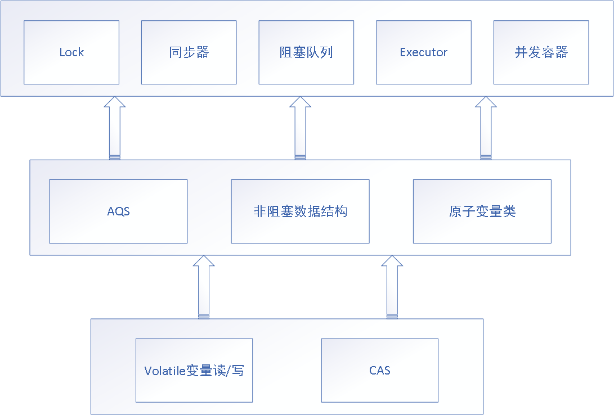

# 1.重排序

* 编译器重排序
* 处理器重排序（指令并行重排序，内存系统重排序）

目的是为了提高指令的并行度，提升性能。

# 2.数据依赖性 

如果单个线程中两个操作具有数据依赖性，比如：

```java
int a = 1 ;
int b = a ;
```

这样的两个操作就具有数据依赖性质

**重排序不会改变具有数据依赖性的两个操作的执行顺序**

# 3. as-if-serial

as-if-serial 指的是不管怎么重排序，**单线程**的执行结果不能被改变。在存在数据依赖性的操作不重排序的前提之下。其他的操作是可以重排序的

# 4. 内存屏障

一旦内存数据被推送到缓存（cpu层面的多级缓存），就会有消息协议来确保所有的缓存会对所有的共享数据同步并保持一致。这个使内存数据对CPU核可见的技术被称为**内存屏障或内存栅栏**。

**基础指令**：

- Store：将处理器缓存的数据刷新到内存中。
- Load：将内存存储的数据拷贝到处理器的缓存中。

**内存屏障有四种，但是不是所有处理器都存在这四种内存屏障**：

| 屏障类型   | 指令示例                 | 说明                                                         |
| :--------- | :----------------------- | :----------------------------------------------------------- |
| LoadLoad   | Load1;LoadLoad;Load2     | 该屏障确保Load1数据的装载先于Load2及其后所有装载指令的的操作 |
| StoreStore | Store1;StoreStore;Store2 | 该屏障确保Store1立刻刷新数据到内存(使其对其他处理器可见)的操作先于Store2及其后所有存储指令的操作 |
| LoadStore  | Load1;LoadStore;Store2   | 确保Load1的数据装载先于Store2及其后所有的存储指令刷新数据到内存的操作 |
| StoreLoad  | Store1;StoreLoad;Load2   | 该屏障确保**Store1立刻刷新数据到内存的操作先于Load2及其后所有装载装载指令的操作**。**它会使该屏障之前的所有内存访问指令(存储指令和访问指令)完成之后,才执行该屏障之后的内存访问指令** |

StoreLoad Barriers同时具备其他三个屏障的效果，因此也称之为`全能屏障`（mfence），是目前大多数处理器所支持的；但是相对其他屏障，该屏障的开销相对昂贵。

# 5. happens-before

它指的是如果一个操作  A-happens-before -B, 那么A 操作一定对B操作可见（内存的可见性）

也就是说如果操作A-happens-before -B ,那么 B 一定能知道 A 对内存数据的修改。

# 6. 锁的内存语义 

* **锁的释放的内存语义**：他会把当前本地换存中的共享变量的值都刷新到主内存中
* **锁的获取的内存语义**：他会把当前**临界区**本地内存置为无效，线程将重新从主内存中读取共享变量

**临界区**：获取锁和释放锁之间的那一块操作区域。（获取锁释放锁之间那一块代码）

# 7. volatile

volatile变量规则（happens-before）：**对volatile变量的写入操作必须在对该变量的读操作之前执行**。

**volatile能够保证变量的可见性以及变量普通读/写操作的原子性。但是不能保证 变量复合操作的原子性。**

## volatile如何解决内存可见性与处理器重排序问题

> 在编译器层面，仅将volatile作为标记使用，取消编译层面的缓存和重排序。

如果硬件架构本身已经保证了内存可见性（如单核处理器、一致性足够的内存模型等），那么volatile就是一个空标记，不会插入相关语义的内存屏障。

如果硬件架构本身不进行处理器重排序、有更强的重排序语义（能够分析多核间的数据依赖）、或在单核处理器上重排序，那么volatile就是一个空标记，不会插入相关语义的内存屏障。

如果不保证，仍以x86架构为例，JVM对volatile变量的处理如下：

- 在写volatile变量v之后，插入一个sfence。这样，sfence之前的所有store（包括写v）不会被重排序到sfence之后，sfence之后的所有store不会被重排序到sfence之前，禁用跨sfence的store重排序；且sfence之前修改的值都会被写回缓存，并标记其他CPU中的缓存失效。
- 在读volatile变量v之前，插入一个lfence。这样，lfence之后的load（包括读v）不会被重排序到lfence之前，lfence之前的load不会被重排序到lfence之后，禁用跨lfence的load重排序；且lfence之后，会首先刷新无效缓存，从而得到最新的修改值，与sfence配合保证内存可见性。

> 在另外一些平台上，JVM使用mfence代替sfence与lfence，实现更强的语义。

二者结合，共同实现了Happens-Before关系中的volatile变量规则。

##  总结

**volatile 读的内存语义+内存屏障**

* **内存屏障**：volatile读的后面会插入LoadLoad+LoadStroe内存屏障，也就是说一个volatile变量读的后面任何变量的读写操作都不会重排序到这个 volatile变量读之前
* **内存语义**：volatile 变量的读 **具有与锁的获取具有相同的内存效果**，他会把当前**临界区**本地内存置为无效，线程将重新从主内存中读取共享变量

**总结**：**这样可以实现 volatile 变量读后面的读都能获取主内存的值**

**volatile 写的内存语义+内存屏障**

- **内存屏障**：volatile写的后面会插入StroeLoad内存屏障，也就是说一个volatile变量写的后面任何变量的读操作都不会重排序到这个 volatile变量写之前；volatile写的前面会插入StroeStroe内存屏障,也就是说一个volatile变量写的前面任何变量的写操作都不会重排序到这个 volatile变量写之后；
- **内存语义**：volatile 变量的写 **具有与锁的释放具有相同的内存效**果，他会把当前本地换存中的共享变量的值都刷新到主内存中，最后通过处理器间的缓存一致性协议，将他们的缓存设为无效

**总结**：**这样就能将 volatile变量读前面的所有写操作的值都刷新到主内存，使得一系列的写操作对其他线程可见。**

# 关于上面的概念更多的内容

请仔细阅读 [一文解决内存屏障](一文解决内存屏障.md) 这里面解释了

* 可见性（编译器层面，硬件层面）
* 重排序（编译器层面，硬件层面）

* 对 volatile 的作用，以及帮助理解做了更多的补充

# 8. CAS

[CAS](CAS.md)

# 9. 锁的释放和获取的内存语义的实现方式

*  使用 volatile 变量的读——写所具有的内存语义
* 利用CAS附带的volatile 读——写语义。

# 10. juc

juc(java.util.concurrent)包。



> 详情 [JUC](JUC.md)
>

# 11. 双重检查锁

## 11.1 双重检查锁

初期的代码：

```java
public class DoubleCheckedLock{
  private static Instance instance;
  
  public static Instance getInstance(){
    if(instance == null){// 第一次检查
      synchronized(DoubleCheckedLock.class){
        if(instance == null){// 第二次检查
        	instance = new Instance();// 标记为 i
        }  
      }
    }
    return instance;
  }
  
}
```

### 为什么要使用双重检查锁呢？

为了实现绝对的单例，我们需要考略到多线程中的同步问题，这时候使用 synchronized 性能开销相对较大，所以使用的上面的代码，如果第一次检查 instance不为null，那就不需要执行下面的加锁操作。因此可以降低  synchronized 带来的性能开销。

### 这个代码是否存在什么问题呢？

问题出在 标记 i 这个位置，这行代码可以分解为：

```java
memory  = allocate(); // 1. 分配对象的内存空间
ctorinstance(memory);// 2. 初始化对象
instance = memory;// 3. 将instance指向刚分配的内存地址
```

上面这部分代码中2个3之间，可能会重排序（在一些JIT编译器上这种重排序是真实发生的）

如果两个并行的线程A，B掉用这样的代码，如果A走到标记i位置发生了重排序，就有可能发生B线程判断instance!=null,然后他访问对象，但是这个对象还没有初始化或没初始化完成这样的情况。

### 解决的方法

* 不允许2和3重排序
* 允许2个3重排序，但是不允许其他线程“看到”这个重排序（利用初始化过程是同步的这一点）

通过两个方法分别设计两种解决方案：

* 基于volatile的解决方案：

  ```java
  public class DoubleCheckedLock{
    private volatile static Instance instance;
    
    public static Instance getInstance(){
      if(instance == null){
        synchronized(DoubleCheckedLock.class){
          if(instance == null){
          	instance = new Instance();// instance 为volatile 就没问题了
          }  
        }
      }
      return instance;
    }
    
  }
  ```

*  基于类初始化的解决方案

  类的初始化：在Class被加载之后，线程调用之前。初始化的时候会去获取锁，这个锁可以同步多个线程对同一个类的初始化，

  什么时候会初始化？

  * new 一个类的时候
  * 一个类中声明的static方法被调用
  * 一个类中声明的非final的static属性被使用

  了解了这些就可以设计代码了

  ```java
  public class InstanceFactory{
    private static class InstanceHolder{
      public static Instance instance = new Instance();
    }
    public static Instance getInstance(){
      return InstanceHolder.instance;
    }
  }
  ```

  这个代码我们在并发的时候，由于初始化锁的原因，调用getInstance()方法的时候会被同步，这样在第一次初始化的时候，这个instance变量只会被实例化一次。

  # 12.线程

  现代操作系统运行一个程序时，会为它创建一个进程，而线程是轻量级进程，是比进程更小的一个单元。在一个进程中可以创建多个线程。这些线程拥有自己的计数器，堆栈，局部变量等。他们能访问贡献的内存变量。一个线程在一个时刻只能运行在一个处理器和信心上，处理器单核心会在一些线程上做切换，多核处理器线程会同时发生并行以及切换。

  ## 12.1 使用多线程的意义

  * 利用更多的处理器核心：现代处理器都是多核 cpu , 这样的处理器更加擅长并行计算，处理器在提高单核主频（每秒计算速度）的同时也在向着更多的核心发展，怎么更好利用处理器的多个核心呢？大然是使用多线程，同时利用多个核心。
  * 更快的响应时间：有的业务处理是可以拆分成好几步同时运行的。这时候使用多线程去分别处理，肯定相比你一个个串行化处理快

  ## 12.2 线程优先级

  现代操作系统会分出一个个时间片，线程会分配到一个个时间片，当线程时间片用完（线程执行完成也会切换别的线程）就会发生线程调用，并等待下一次分配。线程优先级就是决定线程需要多（少）分配一些处理器资源的线程属性。

  **注意：线程优先级属性不能决定线程是否优先执行**

  ## 12.3 java线程的状态

  

## 12.4 守护（daemon）线程

daemon线程是一种支持型线程，主要用作程序后台调度以及一些支持型任务。在java虚拟机中，当不存在非daemon线程的时候，虚拟机将退出，**同时虚拟机中所有daemon线程也会立即终止**，所以他不能保证 finally语句块能够得到执行

**所以，构建daemon线程你不能依赖finally 语句块来确保需要执行的资源释放，关闭，清理等操作**

## 12.5 java 创建线程的方式：

查看Java Thread 的源码可以看出，创建线程的方式不管是使用继承Thread，还是实现Runnable（最后也是要使用new Thread(...)）,最终执行的都是一个方法创建线程：

```java
private void init(ThreadGroup g, Runnable target, String name,
                      long stackSize, AccessControlContext acc,
                      boolean inheritThreadLocals) {
        if (name == null) {
            throw new NullPointerException("name cannot be null");
        }

        this.name = name;
				// 拿到的是当前线程，也就是即将要创建的线程的父线程
        Thread parent = currentThread();
				//...省略了部分系统检查的代码
        this.group = g;
  			// 根据父线程的 类型指定是否是 daemon,以及他的优先级priority
        this.daemon = parent.isDaemon();
        this.priority = parent.getPriority();
  			// 配置当前线程的上下文类加载器（继承父线程的）
        if (security == null || isCCLOverridden(parent.getClass()))
            this.contextClassLoader = parent.getContextClassLoader();
        else
            this.contextClassLoader = parent.contextClassLoader;
  	
        this.inheritedAccessControlContext =
                acc != null ? acc : AccessController.getContext();
        this.target = target;
        setPriority(priority);
        if (inheritThreadLocals && parent.inheritableThreadLocals != null)
            this.inheritableThreadLocals =
                ThreadLocal.createInheritedMap(parent.inheritableThreadLocals);
        /* Stash the specified stack size in case the VM cares */
        this.stackSize = stackSize;

        /* Set thread ID */
        tid = nextThreadID();
    }
```

## 12.6 线程启动 start()

调用 start() 方法，这时候只是说明可以被处理器调度运行，并不是直接开始运行了

## 12.7 线程中断 interrupt()

中断可以理解为一个标识的属性，它表示**一个运行中线程是否被其他线程进行了中断操作**，其他线程通过调用该线程的`interrupt()`方法对其进行中断。，也可以调用静态方法Thread.interrupted()对当前线程的中断标识位进行复位。通过调用线程对象的`isInterrupted()`来判断是否被中断（返回true代表中断了），需要注意的是：

* 如果一个线程已经执行完成，这时候就算你调用一个线程的`interrupt()`方法，然后通过`isInterrupted()`你也会发现返回的是false.
* Java API 中许多声明抛出`InterruptedException`的方法（例如`Thread.sleep()`），它们在抛出该异常前（也就不管是否产生异常），Java虚拟机会清除该线程的中断标识位，这时候你调用`isInterrupted()`获得的值也将是false。

> **抛出 方法定义throws InterruptedException 异常的方法，java对这个有特殊处理，会在这个过程中复位线程的中断标识**

我们除了使用`interrupt()`这个方法来实现中断线程，在有的时候也可以通过一个标识变量来实现。

```java
public class Demo {

    static volatile boolean flag = true;

    public static void main(String[] args) throws InterruptedException {

        doSomeThing();
        Thread.sleep(5000);
        changeFlag();
        System.out.println("  end  ");
    }

    public static void doSomeThing() {
        new Thread(new Runnable() {
            @Override
            public void run() {
                while (Demo.flag) {
                    System.out.println("......");
                }
            }
        }).start();
    }

    public static void changeFlag() {
        Demo.flag = false;
    }

}
```

# 13.线程间通信

这里我们主要介绍通过java自身提供的机制来实现通信

## 13.1 volatile+synchronized

* `volatile`就不做细节介绍了，前文第7节有说到，他的读写规则实现变量线程间的可见性，这样也就实现了线程间的通信

* `synchronized`它是**通过加锁的方式来实现线程同步，以及锁住的临界区间原子性，并且因为是一个同步过程，并且根据锁第6节 锁的内存语义，也能知道临界区的共享变量是满足可见性的**。

  那么`synchronized`  的锁对象都是什么 呢？

  * 用在非`static`方法上他的锁就是当前对象
  * 用在static方法上他的锁就是当前类的Class对象
  * 对于同步方法块，那就是对应括号中指定的对象

  **在同步过程中，没有获取到这个唯一对象锁的线程会进入和该对象关联的同步队列，后文中还会提到`wait()`,`join()`方法，这个东西会让线程进入和对象关联的等待队列。**

## 13.2 等待（超时）通知机制——wait() , notify(),notifyAll()

这些方法是 Object 定义的方法，主要的作用是在使用 `synchronized`的时候，使用13.1中所说的情况对应的锁对象调用这些方法可以实现等待通知。（wait() , notify(),notifyAll()方法的调用必须在`synchronized块中）

* `wait()`: 调用该方法之后，当前线程变为等待状态，并将当前线程**放置在与调用`wait()`方法关联的对象的关联的等待队列中，线程会释放当前这个对象锁，同时会释放cpu资源**。**当该线程再次获取这个对象锁的时候，会从`wait()`方法返回并且继续执行**
* `wait(long millis)`：超时等待(单位毫秒)，在上面的基础上增加了时间限制，如果在参数指定的时间内，没有获取到锁（没有用那个锁对象调用`notify()/notifyAll()`方法），那么会按时返回，继续执行
* `notify() notifyAll()`方法在调用之后，等待的线程并不会立即获取到锁从`wait()`方法处返回，而是要等调用`notify() notifyAll()`方法的线程释放锁之后才有机会获取锁。原因是：
  * `notify()`: **将对象锁关联的等待队列中的一个等待线程从等待队列移动到同步队列**，这时候对象锁关联的同步队列中的线程可以**竞争**这个对象锁。
  * `notifyAll()`:**将对象锁关联的等待队列中的所有等待线程从等待队列移动到同步队列**


**总结**：我们java中在并发时，我们的锁对象可以拥有一个**同步队列**和一个**等待队列**

## 13.3 线程中一部分方法介绍

### 13.3.1 join()

在一个线程A中，执行线程B的`join()`方法，那么线程A 只有等待线程B终止（不管什么方式终止）才能从B调用的`jion()`处返回；线程处理提供了`join()`,还同时提供了`join(long millis)+join(long millis,int nanos)`两个用于超时等待的方法，这些方法内部其实使用的是wait()方法来实现的。

`join()`源码：可以看出调用了`join(long millis)`

```java
public final void join() throws InterruptedException {
    join(0);
}
```

`join(long millis)`源码：（单位毫秒）

```java
public final synchronized void join(long millis)
throws InterruptedException {
    long base = System.currentTimeMillis();
    long now = 0;

    if (millis < 0) {
        throw new IllegalArgumentException("timeout value is negative");
    }

    if (millis == 0) {
        while (isAlive()) {
            wait(0);// 可以看到jion() 使用的是这部分逻辑，调用了wait(0)方法，只要当前线程isAlive()，也就是没有终止，那就一直等待
        }
    } else {// 这部分就是超时等待的逻辑，在判断线程isAlive()的同时，进行了超时处理
        while (isAlive()) {
            long delay = millis - now;
            if (delay <= 0) {
                break;
            }
            wait(delay);
            now = System.currentTimeMillis() - base;
        }
    }
}
```

### 13.3.2 isAlive()

当线程处于就绪、运行、阻塞（超时阻塞）状态  返回true 

新建、终止。返回false

### 13.3.3 Thread.sleep(long millis)

在指定的毫秒数内让当前线程休眠，**该方法不释放对象锁，会释放cpu资源**，到达时间后会从该方法处返回继续执行。

### 13.3.4 Thread. yield()

**暂停当前当前线程，把执行机会让给相同或者更高优先级的线程。（该方法不释放对象锁，释放cpu 资源）** 

实际上，` Thread.yield()`方法对应了如下操作：先检测当前是否有相同优先级的线程处于同可运行状态，如有，则把 CPU  的占有权交给此线程，否则，继续运行原来的线程。所以 yield() 方法称为“退让”，它把运行机会让给了同等(更高)优先级的其他线程（这些线程会去竞争 cpu）。

###  13.3.5  Thread.sleep(long millis) 和 Thread. yield()比较

两个方法都是Thread的静态方法，**都会使当前处于运行状态的线程放弃CPU**，把运行机会让给别的线程。两者的区别在于：

* `sleep((long millis)`方法会给其他线程运行的机会，不考虑其他线程的优先级；`yield()`方法只会给相同优先级或者更高优先级的线程一个运行的机会。
* 线程执行了`sleep(long millis)`方法，将转到阻塞状态；线程执行了yield()方法，将转到就绪状态。

# 14.ThreadLocal的使用

API 中该类只有4个方法 :

* `get()`: 返回此线程局部变量的当前线程副本中的值。如果变量没有用于当前线程的值，则先将其初始化为调用 `initialValue()`  方法返回的值。 

* `initialValue()`: 返回此线程局部变量的当前线程的“初始值”。线程第一次使用 get()  方法访问变量时将调用此方法，但如果线程之前调用了` set(T value) ` 方法，则不会对该线程再调用` initialValue() `方法。通常，此方法对每个线程最多调用一次，但如果在调用` get() `后又调用了` remove()`，则可能再次调用此方法。  

  该方法默认的实现返回 null；

  如果希望线程局部变量具有 null 以外的值，则必须为  ThreadLocal 创建子类，并重写此方法。通常将使用匿名内部类完成此操作。  

* `remove()`: 移除此线程局部变量当前线程的值。如果此线程局部变量随后被当前线程读取，且这期间当前线程没有设置其值，则将调用其` initialValue() ` 方法重新初始化其值。这将导致当前线程多次调用 `initialValue()`方法。

* `set(T value)`:将此线程局部变量的当前线程副本中的值设置为指定值。

例子：

```java
import java.util.concurrent.TimeUnit;

public class Demo {

    private static final ThreadLocal<Long> TIEM_THREADLOCAL = new ThreadLocal<Long>() {
        @Override
        protected Long initialValue() {
            return System.currentTimeMillis();
        }
    };

    public static void main(String[] args) throws InterruptedException {
        TIEM_THREADLOCAL.get();//这个会调用我们自定义的initialValue()方法
        TimeUnit.MILLISECONDS.sleep(2);
        System.out.println(System.currentTimeMillis() - TIEM_THREADLOCAL.get());
    }

}
```

# 15 并发容器和框架

## 15.1 ConcurrentHashMap

[Java集合框架](..\Java集合框架.md) 中的 ConcurrentHashMap篇

## 15.2 ConcurrentLinkedQueue


## 15.3 java 的阻塞队列（BlockingQueue）

### 15.3.1 什么是阻塞队列

阻塞队列是一个**支持两个附加操作的队列**，这两个操作支持及阻塞的插入和移除的方法:

* 阻塞的插入：当队列满的时候，队列会阻塞插入元素的线程（利用AQS做同步），直到队列不满
* 阻塞的移除：当队列为空的时候，获取元素的线程会等待队列非空。

**阻塞队列常用于生产消费的场景，作为生产者存放元素，消费者获取元素的容器**

### 15.3.2 正常的队列 Queue接口API

首先我们看一下正常的队列 Queue接口定义的方法， Queue:作为队列的上层接口，提供了插入，删除，获取三种类型的方法的定义，每种类型提供了两种方式：

* 插入方法定义：
  * `boolean add(E e)` 在队列尾部插入元素，成功返回true，没有可用空间抛出异常`IllegalStateException`
  * `boolean offer(E e)` 在队列尾部插入元素，成功返回true，否则返回false
* 获取队列首部元素：
  * `E element()` 获取队列首部的元素，如果队列为空会抛出异常`NoSuchElementException`
  * `E peek()`获取队列首部的元素，如果队列为空返回null
* 获取并移除队列首部元素：
  * `E remove()`获取并移除队首的元素，如果队列为空会抛出异常`NoSuchElementException`
  * `E poll()`获取并移除队首的元素，如果队列为空，返回null

### 15.3.3 BlockingQueue 继承了Queue，同时提供了阻塞的插入移除API

* 阻塞插入方法定义：
  * `void put(E e) throws InterruptedException`：这个方法会一直阻塞直到队列不满的时候才能执行，或则线程被中断以结束该操作。
  * `boolean offer(E e, long timeout, TimeUnit unit)throws InterruptedException`：阻塞等待插入队尾，如果超时了就退出（丢弃该操作）。或者线程被中断以结束该操作。
* 阻塞获取并移除方法定义：
  * `E take() throws InterruptedException`：这个方法会一直阻塞知道队列非空的时候才能执行，或则线程被中断以结束该操作。
  * `E poll(long timeout, TimeUnit unit)    throws InterruptedException`：阻塞等待移除队首元素，如果超时了就退出（丢弃该操作）。或则线程被中断以结束该操作。
* 其他新增的方法：
  * `remainingCapacity()`：返回在无阻塞的理想情况下此队列能接收的元素数量，如果该队列是无界队列返回`Integer.MAX_VALUE`
  * `drainTo(Collection<? super E> c )`：移除队列中所有可用的元素，将他们添加到指定的 `collection`中
  * `drainTo(Collection<? super E> c ，int maxElements)`：最多从队列中移除给定数量的可用元素，将他们添加到指定的 `collection`中

### 15.3.4 jdk1.7 中阻塞队列的实现类 

* `ArrayBlockingQueue`:基于数组结构实现的**有界阻塞队列，按照FIFO（先进先出）原则对元素进行处理，默认情况不保证线程公平访问队列**，构造函数`public ArrayBlockingQueue(int capacity, boolean fair)`fair 传入true可以指定公平访问。

* `LinkedBlockingQueue`: 一个基于链表结构实现的 **可指定阈值的有界阻塞队列，按照FIFO（先进先出）原则对元素进行处理,吞吐量通常要高于`ArrayBlockingQueue`，队列的默认长度和最大长度都是`Integer.MAX_VALUE`**

* `SynchronousQueue`：**是一个不存储元素的阻塞队列，因为每一个put操作都必须等待一个take操作，否则不能继续增添元素**，**线程池使用这个队列在高并发情况下很危险，**因为当一个put操作等待take的时候，这时候一直不能put元素，这时候线程池会一直创建线程知道`maximumPoolSize`，会造成大量线程被创建，线程池的优点会得不到体现，严重影响性能。使用请根据情况谨慎选择。

* `PriorityBlockingQueue`：**一个支持优先级的无阶阻塞队列**，默认情况下元素采取自然顺序，也可以自定义类实现`compareTo()`方法来指定元素的排序顺序。或则初始化该队列的时候（一般使用匿名内部类）指定构造参数`Comparator`来对元素进行排序。**不能保证同优先级元素的顺序**

  ```java
  new PriorityBlockingQueue<Person>(10, new Comparator<Person>() {
      @Override
      public int compare(Person o1, Person o2) {
          return o1.age-o2.age;
      }
  });
  ```

* `DelayQueue`：是一个支持**延时获取**元素的**无界阻塞队列**，该队列内部使用`PriorityQueue`实现，队列中的元素必须实现Delayed接口，通过源码可以看到该接口继承了`Comparable接口`：

  ```java
  public interface Delayed extends Comparable<Delayed> {
  
      /**
       * Returns the remaining delay associated with this object, in the
       * given time unit.
       *
       * @param unit the time unit
       * @return the remaining delay; zero or negative values indicate
       * that the delay has already elapsed
       */
      long getDelay(TimeUnit unit);
  }
  ```

  队列元素在实现这个接口的同时需要实现两个对应的方法：

  * `public int compareTo(Delayed o)`：和前面的优先级队列一样，用于元素排序（例如让延长时间最长的排序在队列末尾）
  * `public long getDelay(TimeUnit unit)`： 该方法返回当前元素还需要延长多长时间，自己实现的时候时间单位最好使用纳秒

* `LinkedTransferQueue`：由链表结构实现的无界阻塞`TransferQueue`队列,相对其它阻塞队列，它多了两个方法：

  * `tryTransfer()`：（后续补充吧，我也没用过）
  * `transfer()`：（后续补充吧，我也没用过）

* `kedBlockingDeque`：一个由链表结构  实现的双向队列，既然是双向队列，那么多出来了一些对应的方法，针对头和尾做增删改，比如：`addLast()`,`addFirst()`...这样的方法，和前面的`LinkedBlockingQueue`的方法效果基本相同，只是操作的位置改变了一下罢了。**在使用的时候可以设置容量来防止其过度膨胀，双向队列可以用在"工作窃取“算法中**

### 15.3.5 阻塞队列的实现原理

看阻塞队列实现原理的源码，我们需要从他的两个阻塞方法`take`,`put入手，这里我们看一下`LinkedBlockingQueue`的源码：

锁：

```java
/** Lock held by take, poll, etc */
private final ReentrantLock takeLock = new ReentrantLock();

/** Wait queue for waiting takes */
private final Condition notEmpty = takeLock.newCondition();

/** Lock held by put, offer, etc */
private final ReentrantLock putLock = new ReentrantLock();

/** Wait queue for waiting puts */
private final Condition notFull = putLock.newCondition();
```

take() :

```java
public E take() throws InterruptedException {
    E x;
    int c = -1;
    final AtomicInteger count = this.count;
    final ReentrantLock takeLock = this.takeLock;
    takeLock.lockInterruptibly();// 可中断的锁
    try {
        while (count.get() == 0) {
            notEmpty.await();// 队列为空等待，这个方法会调用AQS中的该方法的实现，然后将当前线程加入到这个对象关联的等待队列中，使用LockSupport.park()方法，具体的方法在JUC的AQS中实现的，可以点进去看看
        }
        x = dequeue();
        c = count.getAndDecrement();
        if (c > 1)// 获取元素之后队列中不为空
            notEmpty.signal();//唤醒一下
    } finally {
        takeLock.unlock();// 释放锁
    }
    if (c == capacity)
        signalNotFull();// 唤醒 生产（插入）操作那边的阻塞
    return x;
}
```

put(E e):和take类似的处理，不再做注释说明

```java
public void put(E e) throws InterruptedException {
    if (e == null) throw new NullPointerException();
    int c = -1;
    Node<E> node = new Node<E>(e);
    final ReentrantLock putLock = this.putLock;
    final AtomicInteger count = this.count;
    putLock.lockInterruptibly();
    try {

        while (count.get() == capacity) {
            notFull.await();
        }
        enqueue(node);
        c = count.getAndIncrement();
        if (c + 1 < capacity)
            notFull.signal();
    } finally {
        putLock.unlock();
    }
    if (c == 0)
        signalNotEmpty();// 唤醒 获取操作那边的阻塞
}
```

## **15.4 Fork/Join 框架**

# 16.线程池

## 16.1 简介(起因+特点)

使用线程池的原因，在上文中我们说到了使用多线程的好处，以及给性能带来的提升，但是如果服务端程序每接到任务就创建一个线程然后执行，执行完销毁，这在普通请求量的情况下是比较好的。

**如果面对成千上万的请求，这时候就会创建有着成千上万的线程随之创建，销毁，这不是一个好的选择，因为线程的创建和销毁都是比较消耗系统资源的，而且带来了平凡的线程间上下文切换（这也是比较影响性能的）。**

线程池技术很好的解决了这样的问题，它预先创建一定数量的线程，线程的创建不是有用户控制，而是线程池内部机制控制，在这个前提下重复使用固定或若干数量的线程来完成任务。这样做的好处是：

* 实现了线程的复用
* 消除了线程的频繁创建和销毁带来的系统资源开销
* 面对过量任务的提交能够平缓的控制执行

## 16.2 原理

### 16.2.1 处理流程


### 16.2.3 工作线程

线程池创建线程时，会将线程封装成工作线程 `Worker` ,` Worker` 在执行完任务之后会循环获取工作队列(BlockingQueue)中的任务来执行。我们看一下`Worker的run()方法`:

```java
public void run() {
    runWorker(this);
}

final void runWorker(Worker w) {
        Thread wt = Thread.currentThread();
        Runnable task = w.firstTask;
        w.firstTask = null;
        w.unlock(); // 允许中断
        boolean completedAbruptly = true;
        try {
          // getTask() 去 BlockingQueue 获取任务来执行
            while (task != null || (task = getTask()) != null) {
                w.lock();
                // 如果池停止，则确保线程中断;
                // 如果没有，请确保线程不中断.  This
                // 这需要在第二种情况下重新检查。在清除中断时立即退出
                if ((runStateAtLeast(ctl.get(), STOP) ||
                     (Thread.interrupted() &&
                      runStateAtLeast(ctl.get(), STOP))) &&
                    !wt.isInterrupted())
                    wt.interrupt();
                try {
                    beforeExecute(wt, task);
                    Throwable thrown = null;
                    try {
                        task.run();// 执行任务
                    } catch (RuntimeException x) {
                        thrown = x; throw x;
                    } catch (Error x) {
                        thrown = x; throw x;
                    } catch (Throwable x) {
                        thrown = x; throw new Error(x);
                    } finally {
                        afterExecute(task, thrown);
                    }
                } finally {
                    task = null;
                    w.completedTasks++;
                    w.unlock();
                }
            }
            completedAbruptly = false;
        } finally {
            processWorkerExit(w, completedAbruptly);
        }
    }
```


## 16.3 线程池的使用

### 16.3.1 线程池的创建（ThreadPoolExecutor）

我们可以通过 `ThreadPoolExecutor` 提供的几个构造方法去创建线程池，由于最终调用的都是一个方法，这里我们就介绍这个最主要的方法：

```java
public ThreadPoolExecutor(int corePoolSize,
                          int maximumPoolSize,
                          long keepAliveTime,
                          TimeUnit unit,
                          BlockingQueue<Runnable> workQueue,
                          ThreadFactory threadFactory,
                          RejectedExecutionHandler handler){
                           
  ........
    
                          }
```

* `int corePoolSize ` : 线程池的基本线程数量大小，当有任务提交的时候（详细流程在16.3.1节），只要当前线程数量<corePoolSize，那就会创建一个新的工作线程来执行任务。

* `int maximumPoolSize `: 线程池最大工作线程数量，如果workQueue队列满了（前提肯定是当前线程池工作线程数量>=corePoolSize）,这时候线程池会创建新的工作线程来执行任务，**注意：如果下面的参数workQueue使用的是无界队列（也就是队列不会满）那么这个参数自然就没有作用了**

* `long keepAliveTime `: 当前有多于` corePoolSize` 的线程，则这些多出的线程在空闲时间超过 `keepAliveTime` 时将会终止，**如果每个任务的执行时间比较短，可以调大时间提高线程的利用率**，

  **默认情况下，保持活动策略只作用于核心线程以外的线程。但是只要 keepAliveTime 值大于 0，调用`allowCoreThreadTimeOut(true) ` 方法也可将此超时策略应用于核心线程，通常应该在使用该池前主动调用此方法。**

* `TimeUnit unit` : 这个参数就是上面参数的时间单位了：

  * TimeUnit .DAYS(天)；
  * TimeUnit .HOURS(小时);
  * TimeUnit .MINUTES(分钟)
  * TimeUnit .SECONDS(秒)
  * TimeUnit .MILLISECONDS(毫秒=1/1000 秒)
  * TimeUnit .MICROSECONDS(微秒=1/1000 毫秒）
  * TimeUnit .NANOSECONDS（纳秒=1/1000 微秒)

* `BlockingQueue<Runnable> workQueue` : 任务队列，用于保存等待执行的任务的阻塞队列，可选择的有

  * `ArrayBlockingQueue`
  * `LinkedBlockingQueue`
  * `SynchronousQueue`
  * `PriorityBlockingQueue`

  这些队列的优缺点，功能请看 15.3.4 节

* `ThreadFactory threadFactory`: 线程的创建工厂，建议使用 ，因为在调优或则排查问题的时候，可以很好的监控到对应的线程的状态。

* `RejectedExecutionHandler handler` : 当线程池的线程数量达到最大，队列也满了的时候，这时候这个参数就起作用了，默认是使用`Abortpolicy`,jdk 1.5 中线程池框架提供了4种策略：

  * `Abortpolicy` : 当线程池的线程数量达到最大，队列也满了的时候，如果有新任务进来，直接抛出异常
  * `CallerRunsPolicy` : 当线程池的线程数量达到最大，队列也满了的时候，如果有新任务进来，只使用调用者所在的线程来运行任务
  * `DiscardOldestPolicy` : 当线程池的线程数量达到最大，队列也满了的时候，如果有新任务进来，丢弃队列里最近一个任务，并执行当前任务
  * `DiscardPolicy `: 当线程池的线程数量达到最大，队列也满了的时候，如果有新任务进来，不处理直接丢弃。

### 16.3.2 向线程池提交任务

方式分别为：

* `void execute(Runnable runnable)` : 该方法提交不需要返回值的任务

后面的这几个方法都会被包装成`FutureTask`

* `<T> Future<T> submit(Callable<T> task)` : 

  ```java
  public <T> Future<T> submit(Callable<T> task) {
      if (task == null) throw new NullPointerException();
      RunnableFuture<T> ftask = newTaskFor(task);
      execute(ftask);
      return ftask;
  }
  ```

* `<T> Future<T> submit(Runnable task, T result)` : 

  ```java
  public <T> Future<T> submit(Runnable task, T result) {
      if (task == null) throw new NullPointerException();
      RunnableFuture<T> ftask = newTaskFor(task, result);
      execute(ftask);
      return ftask;
  }
  ```

* `Future<?> submit(Runnable task)` : 

  ```java
  public Future<?> submit(Runnable task) {
      if (task == null) throw new NullPointerException();
      RunnableFuture<Void> ftask = newTaskFor(task, null);
      execute(ftask);
      return ftask;
  }
  ```


### 16.3.3  ThreadPoolExecutor 执行 execute() /submit()方法流程


注意上面的步骤中，**创建新工作线程需要获取全局锁**，`ThreadPoolExecutor` 采取上述步骤的总体设计思路，是为了在  执行`execute()`方法的时候尽可能避免获取全局锁（因为这是一个严重的性能影响点），当 `ThreadPoolExecutor`完成`corePoolSize`的预热之后，几乎所有的`execute()`方法都在执行加入`BlockingQueue`队列这一步骤，这样就避免了获取全局锁

### 16.3.4 关闭线程池

线程池的关闭有两个方法，他们原理都是遍历线程池中的工作线程，然后逐一调用线程的`interrupt`方法中断线程，下面介绍他们的分别介绍：

* `void shutdown()` :  只是将线程池设置为`shutdown`状态，然后中断所有非正在执行任务的线程，也就是说正在执行任务的线程不会立刻中断，会在执行玩任务之后，根据`shutdown`这个状态中断。
* ` List<Runnable> shutdownNow()` : 首先将线程池状态设置为`stop`,然后尝试停止所有正在执行或暂停任务的线程，并且返回等待执行的任务的列表

只要调用上诉两个方法，调用`isShutdown()`方法返回的都是`true`

当所有的线程都关闭之后调用`isTerminaed()`方法会返回`true`

## 16.4 Executor  框架详解

### 16.4.1 Executor 框架

Executor 框架有三大部分组成：

* 任务：实现`Runnable`或`Callable`接口的类

* 任务的执行：

  * 包括任务执行机制的核心接口`Executor`,它是Executor框架的基础，他将任务的提交和执行分离。
  * 以及继承自`Executor`的`ExecutorService`接口，

  Executor框架有两个关键的实现类，他们实现了`ExecutorService` 接口 :

  * `ThreadPoolExecutor` : 是线程池的核心实现类，用来执行被提交的任务。具体细节 16.3节已经做过介绍
  * `ScheduledThreadPoolExecutor` : 可以在给定的延迟后运行任务，或则定期执行任务（定时任务），他比`Timer`更加灵活且强大。

* 异步计算的结果：

  * 包括 `Future`接口
  * 实现 `Future`接口的 `FutureTask`类

## 16.4.2 ScheduledThreadPoolExecutor详解

它主要用来在给定的延迟后运行任务，或则定期执行任务（定时任务），他比`Timer`更加灵活且强大。

`ScheduledThreadPoolExecutor`线程池创建继承了父类 `ThreadPoolExecuto` 的构造方法,不过内部使用了无界队列 `DelayQueue`，因为使用了无界队列，所以自然饱和策略以及`maximumPoolSize `参数自然就没有了意义，他的线程数量最多就只能到`corePoolSize`,所以我们可以看到`Executors`工厂类创建这种类型的线程池的方法只需要传入`corePoolSize`以及 `ThreadFactory`。

**`ScheduledThreadPoolExecutor`的创建**：

* 使用他的构造方法创建
* 使用`Executors`工厂类来创建（一般都使用这个，`Executors`工厂类不止是用来创建这个的，还有很多作用，想了解的自己去看API）

**`ScheduledThreadPoolExecutor`的执行**：

* 当调用他的`scheduleAtFixedRate()`/`scheduleWithFixedDelay()`方法时，会向他的`DelayQueue`队列增添一个实现了`RunnableScheduledFuture接口的SchduleFutureTask`对象。（你传入参数之后，方法内部实例化这样的类实例）
* 线程池中的线程从`DelayQueue`中 获取`ScheduleFutureTask`，然后执行任务。

**`ScheduleFutureTask` 主要包含三个成员变量**：

* `long time`: 标识这个任务将要被执行的具体时间。
* `long sequenceNumber`: 表示这个任务被添加到`ScheduleThreadPoolExecutor`中的序号
* `long period`: 表示任务执行的间隔周期

**由于`ScheduleThreadPoolExecutor`内部使用的`DelayQueue`它继承了`priorityQueue`，所以他内部的这个队列会对`ScheduleFutureTask`排序，排序规则：**

* `time` 小的排在前面
* `time` 相同，就比较 `sequenceNumber`,`sequenceNumber`小的排在前面（也就是如果两个任务执行时间相同，那么先提交的优先执行）

