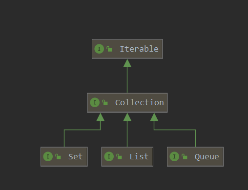
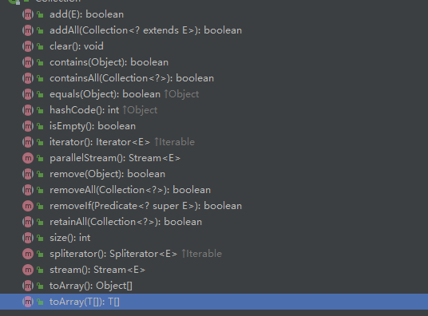

# Collection



* [List](list/introduction.md)
* [Queue](queue/introduction.md)
* [Set](set/introduction.md)

## 接口介绍



| 接口名           | 描述             |
| ---------------- | ---------------- |
| boolean add(E e) | 像集合中加入元素 |
|                  |                  |
|                  |                  |
|                  |                  |
|                  |                  |
|                  |                  |
|                  |                  |
|                  |                  |
|                  |                  |
|                  |                  |
|                  |                  |
|                  |                  |
|                  |                  |
|                  |                  |
|                  |                  |
|                  |                  |
|                  |                  |
|                  |                  |
|                  |                  |

## Iterable介绍	

该接口申明了集合类需要返回一个迭代器的接口

## iterator 迭代器

```java
package java.util;

import java.util.function.Consumer;


public interface Iterator<E> {

    //如果该集合中还有更多的可迭代元素，返回true 
    boolean hasNext();

    //返回迭代中的下一个元素
    E next();

    //从底层集合中删除此迭代器当前返回的元素（调用remove()时可以删除集合中这个一个元素（next()方法返回的元素））
    default void remove() {
        throw new UnsupportedOperationException("remove");
    }

    //对每个剩余元素执行给定的操作，直到所有元素都被处理或动作引发异常
    default void forEachRemaining(Consumer<? super E> action) {
        Objects.requireNonNull(action);
        while (hasNext())
            action.accept(next());
    }
}	
```

