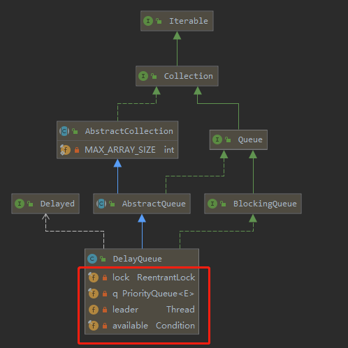

# Introduction



是一个支持**延时获取**元素的**无界阻塞队列**，该队列内部使用`PriorityQueue`实现，队列中的元素必须实现Delayed接口，通过源码可以看到该接口继承了`Comparable接口`：

```java
public interface Delayed extends Comparable<Delayed> {

    /**
     * Returns the remaining delay associated with this object, in the
     * given time unit.
     *
     * @param unit the time unit
     * @return the remaining delay; zero or negative values indicate
     * that the delay has already elapsed
     */
    long getDelay(TimeUnit unit);
}
```

队列元素在实现这个接口的同时需要实现两个对应的方法：

* `public int compareTo(Delayed o)`：和前面的优先级队列一样，用于元素排序（例如让延长时间最长的排序在队列末尾）
* `public long getDelay(TimeUnit unit)`： 该方法返回当前元素还需要延长多长时间，自己实现的时候时间单位最好使用纳秒

最小堆的建立就是用我们这个 getDelay 但会的值，和compareTo的实现来实现比较。

最小堆正实现的看  [PriorityQueue](../non-thread-safety/PriorityQueue.md)

**无界队列所以`put`不会被阻塞，使用无界队列在使用线程池的时候，最大线程数就是一个不会生效的值**

# source code

```java
// 锁
private final transient ReentrantLock lock = new ReentrantLock();
// 最小堆
private final PriorityQueue<E> q = new PriorityQueue<E>();

/**
 * 用于实现 Leader-Follower pattern ， 目的是为了减少竞争锁带来的性能损耗,关于这点在下面的 take方法中
 * 做具体说明
 */
private Thread leader = null;

/**
 * 用于阻塞，通知的
 */
private final Condition available = lock.newCondition();
```

**take**

```java
public E take() throws InterruptedException {
    final ReentrantLock lock = this.lock;
    lock.lockInterruptibly();// 获取锁
    try {
        for (;;) {
            E first = q.peek();// 存在值
            if (first == null)
                available.await();// 队列中没有值 被阻塞置入 available的等待队列
            else {
                long delay = first.getDelay(NANOSECONDS);//获取元素还需延迟的时间
                if (delay <= 0)// 延迟时间已过
                    return q.poll();// 返回值
                first = null; // don't retain ref while waiting
                /**
                 * 我们知道我们队列是一个最小堆的实现，那么first也就是最需要最小延时的哪个节点，如果一个
                 * 线程走到这的时候，需要延时，那就需要调用 available.awaitNanos(delay); 这就释放了
                 * 锁，下一个线程过来，如果还是这一个节点，那么如果还调available.awaitNanos(delay);
                 * 方法的话，可能出现的情况就是 这两个线程间隔时间很短，几乎先后被唤醒，那么很可能存在锁争
                 * 抢情况,所以针对这种情况，这里使用了 Leader-Follower pattern 避免这样的情况，第一
                 * 个过来的线程，会设置为 leader 调用 available.awaitNanos(delay); 后面的线程发现
                 * 自己不是leader 就会调用 available.await(); leader 恢复之后，它但一定(finally)
                 * 将leader设置为null,并且它一定会（finally）唤醒他们
                 */
                if (leader != null)
                    available.await();// 如果不是leader 被阻塞置入 available的等待队列
                else {
                    Thread thisThread = Thread.currentThread();
                    leader = thisThread;// 设置当前线程为 leader
                    try {
                        // 被阻塞置入 available的等待队列，超时会唤醒
                        available.awaitNanos(delay);
                    } finally {
                        if (leader == thisThread)
                            leader = null;
                    }
                }
            }
        }
    } finally {
        if (leader == null && q.peek() != null)
            available.signal();// 唤醒等待中的线程
        lock.unlock();// 释放锁
    }
}
```

# 例子

```java
public class DelayQueueTest {

    public static void main(String[] args) throws InterruptedException {
        Item item1 = new Item("item1", 5, TimeUnit.SECONDS);
        Item item2 = new Item("item2",10, TimeUnit.SECONDS);
        Item item3 = new Item("item3",15, TimeUnit.SECONDS);
        DelayQueue<Item> queue = new DelayQueue<>();
        queue.put(item1);
        queue.put(item2);
        queue.put(item3);
        System.out.println("begin time:" + LocalDateTime.now().format(DateTimeFormatter.ISO_LOCAL_DATE_TIME));
        for (int i = 0; i < 3; i++) {
            Item take = queue.take();
            System.out.format("name:{%s}, time:{%s}\n",take.name, LocalDateTime.now().format(DateTimeFormatter.ISO_DATE_TIME));
        }
    }
}

class Item implements Delayed {
    /* 触发时间*/
    private long delayTime;
    String name;

    public Item(String name, long time, TimeUnit unit) {
        this.name = name;
        this.delayTime = System.currentTimeMillis() + (time > 0 ? unit.toMillis(time) : 0);
    }

    @Override
    public long getDelay(TimeUnit unit) {
        // 延迟队列 take() 中会调用这个方法 看当前元素需要延迟多久，随着时间推移 delayTime - System.currentTimeMillis()最终会<=0，结合延迟队列中的锁，以及超时await，这样也就实现了延迟获取数据
        return unit.convert(delayTime - System.currentTimeMillis(), TimeUnit.MILLISECONDS);
    }

    @Override
    public int compareTo(Delayed o) {
        Item item = (Item) o;
        long diff = this.delayTime - item.delayTime;
        if (diff <= 0) {
            return -1;java
        } else {
            return 1;
        }
    }

    @Override
    public String toString() {
        return "Item{" +
                "time=" + delayTime +
                ", name='" + name + '\'' +
                '}';
    }
}
```