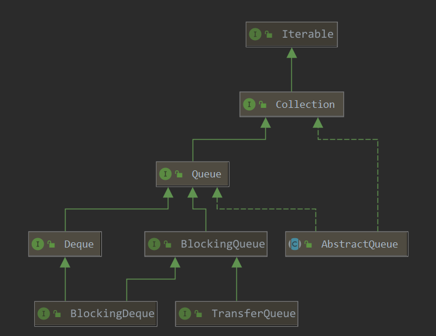
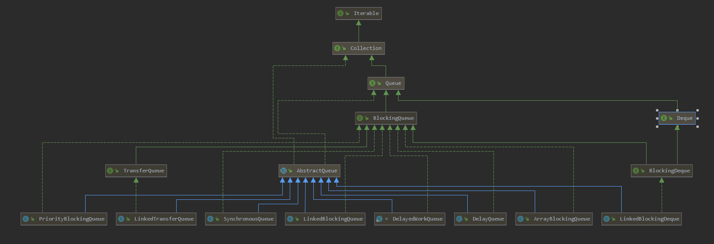

# queue在java中的整体结构图

## 顶层接口图



### queue接口介绍

#### 数据插入

| 接口名             | 描述                                                         |
| ------------------ | ------------------------------------------------------------ |
| boolean add(E e)   | 在队尾插入元素，成功返回true，<br />没有可用空间抛出异常`IllegalStateException`<br />如果该队列不允许NULL值那么抛出`NullPointerException` |
| boolean offer(E e) | 在队列尾部插入元素，成功返回true，否则返回false<br />如果该队列不允许NULL值那么抛出`NullPointerException` |

#### 获取队列首部元素

| 接口名      | 描述                                                         |
| ----------- | ------------------------------------------------------------ |
| E element() | 获取队列首部的元素，如果队列为空会抛出异常`NoSuchElementException` |
| E peek()    | 获取队列首部的元素，如果队列为空返回null                     |

#### 获取并移除队列首部元素

| 接口名     | 描述                                                         |
| ---------- | ------------------------------------------------------------ |
| E remove() | 获取并移除队首的元素，如果队列为空会抛出异常`NoSuchElementException` |
| E poll()   | 获取并移除队首的元素，如果队列为空，返回null                 |

### deque接口介绍

继承至`queue`,所以具有`queue`的方法

#### 数据插入

| 接口名                  | 描述                                                         |
| ----------------------- | ------------------------------------------------------------ |
| boolean add(E e)        | 在**队尾**插入元素，成功返回true，<br />没有可用空间抛出异常`IllegalStateException`<br />如果该队列不允许NULL值那么抛出`NullPointerException` |
| void addFirst(E e)      | 在**队首**插入元素，成功返回true，<br />没有可用空间****抛出异常****`IllegalStateException`<br />如果该队列不允许NULL值那么抛出`NullPointerException` |
| void addLast(E e)       | 在**队尾**插入元素，成功返回true，<br />没有可用空间****抛出异常****`IllegalStateException`<br />如果该队列不允许NULL值那么抛出`NullPointerException` |
| boolean offer(E e)      | 在**队尾**插入元素，成功返回true，否则返回false<br />如果该队列不允许NULL值那么抛出`NullPointerException` |
| boolean offerFirst(E e) | 在**队首**插入元素，成功返回true，否则返回false<br />如果该队列不允许NULL值那么抛出`NullPointerException` |
| boolean offerLast(E e)  | 在**队尾**插入元素，成功返回true，否则返回false<br />如果该队列不允许NULL值那么抛出`NullPointerException` |
| void push(E e)          | **将deque当作栈使用**，**在栈顶插入元素**<br />没有可用空间抛出异常`IllegalStateException`<br />如果该队列不允许NULL值那么抛出`NullPointerException` |

#### 获取队列首部元素

| 接口名        | 描述                                                         |
| ------------- | ------------------------------------------------------------ |
| E element()   | 获取**队首**的元素，如果队列为空会抛出异常`NoSuchElementException` |
| E getFirst()  | 获取**队首**的元素，如果队列为空会抛出异常`NoSuchElementException` |
| E getLast()   | 获取**队尾**的元素，如果队列为空会抛出异常`NoSuchElementException` |
| E peek()      | 获取**队首**的元素，如果队列为空返回null                     |
| E peekFirst() | 获取**队首**的元素，如果队列为空返回null                     |
| E peekLast()  | 获取**队尾**的元素，如果队列为空返回null                     |

#### 获取并移除队列首部元素

| 接口名          | 描述                                                         |
| --------------- | ------------------------------------------------------------ |
| E remove()      | 获取并移除**队首**的元素，如果队列为空会抛出异常`NoSuchElementException` |
| E removeFirst() | 获取并移除**队首**的元素，如果队列为空会抛出异常`NoSuchElementException` |
| removeLast()    | 获取并移除**队尾**的元素，如果队列为空会抛出异常`NoSuchElementException` |
| E poll()        | 获取并移除**队首**的元素，如果队列为空，返回null             |
| E pollFirst()   | 获取并移除**队首**的元素，如果队列为空，返回null             |
| E pollLast();   | 获取并移除**队尾**的元素，如果队列为空，返回null             |
| E pop()         | **将deque当作栈使用**，**获取并移除栈顶元素**<br />如果队列为空会抛出异常`NoSuchElementException` |

#### 移除指定元素

| 接口名                                  | 描述                                                         |
| --------------------------------------- | ------------------------------------------------------------ |
| boolean removeFirstOccurrence(Object o) | 移除该`deque`中第一个和参数`o`匹配的元素<br />如果参数o是null抛出`NullPointerException` |
| boolean removeLastOccurrence(Object o)  | 移除该`deque`中最后一个和参数`o`匹配的元素<br />如果参数o是null抛出`NullPointerException` |

> **<u>我们Deque可以用来做栈结构使用</u>**

### AbstractQueue

#### boolean add(E e)

```java
public boolean add(E e) {
    // 调用了offer的具体实现
    if (offer(e))
        return true;
    else
        throw new IllegalStateException("Queue full");
}
```

#### E element()

```java
public E element() {
    // 调用了peek的具体实现
    E x = peek();
    if (x != null)
        return x;
    else
        throw new NoSuchElementException();
}
```

#### E remove()

```java
public E remove() {
    // 调用了pool的具体实现
    E x = poll();
    if (x != null)
        return x;
    else
        throw new NoSuchElementException();
}
```

### BlockingQueue接口介绍

继承至`queue`,具有`queue`的定义的所有方法，下面不会意义写出来，主要介绍一些特殊的，以及阻塞式的方法

**如果是无界阻塞队列，队列不可能会出现满的情况，所以使用put或offer方法永 远不会被阻塞，而且使用offer方法时，该方法永远返回true。**

#### 数据插入

| 接口名                                                       | 描述                                                         |
| ------------------------------------------------------------ | ------------------------------------------------------------ |
| boolean add(E e)                                             | **非阻塞式**的在**队尾**插入元素，成功返回true，<br />**在java实现中调用的是`offer`方法**<br />没有可用空间抛出异常`IllegalStateException`<br />如果该队列不允许NULL值那么抛出`NullPointerException` |
| boolean offer(E e)                                           | **非阻塞式**的在**队尾**插入元素，成功返回true，否则返回false<br />如果该队列不允许NULL值那么抛出`NullPointerException` |
| boolean offer(E e, long timeout, TimeUnit unit)     throws InterruptedException; | **限时阻塞式**的在**队尾**插入元素，成功返回true,失败或超时返回false<br />如果该队列不允许NULL值那么抛出`NullPointerException` |
| void put(E e) throws InterruptedException;                   | **阻塞式**添加元素到队尾                                     |

#### 获取并移除队列首部元素

| 接口名                                                       | 描述                                 |
| ------------------------------------------------------------ | ------------------------------------ |
| E take() throws InterruptedException;                        | **阻塞直到**获取并移除**队首**元素   |
| E poll(long timeout, TimeUnit unit)     throws InterruptedException; | **限时阻塞**的获取并移除**队首**元素 |

#### 其他方法

| 接口名                                | 描述                                                         |
| ------------------------------------- | ------------------------------------------------------------ |
| int remainingCapacity();              | 返回当前队列能够非阻塞插入的元素数量，也就是队列剩余可用空间 |
| int drainTo(Collection<? super E> c); | 从该队列移除所用可用元素，并将它们移动到 参数`c`集合中       |

### BlockingDeque接口介绍

### TransferQueue接口介绍

# 非线程安全队列

- LinkedList：可以用它来实现双向队列。
- PriorityQueue：基于堆结构实现，可以用它来实现优先队列。

# 线程安全队列

并发下我们要实现线程安全的队列，有两种方式，**一种是阻塞算法（加锁）**；**另一种式非阻塞算法（CAS）**

## [ConcurrentLinkedQueue](thread-safety/ConcurrentLinkedQueue.md)

* 是一个基于**链表结构**以及**非阻塞算法（CAS）**实现的线程安全队列

* **具有 head , tail 两个指针，所以这是一个环形链表**
* **容量不受限制（只受实际可用内存大小的限制，使用不当容易导致OOM）**
* **不允许 NULL 值**
* **size是通过遍历链表的计算来的，所以时间复杂度是O(N)**

# BlockingQueue

上文中我们介绍了 BlockingQueue的接口定义，现在我们节介绍一下关于它的实现类

> **实现我们阻塞队列的方式主要是采用了锁，以及Condition 的等待通知机制**
>
> **如果是无界阻塞队列，队列不可能会出现满的情况，所以使用put或offer方法永 远不会被阻塞，而且使用offer方法时，该方法永远返回true。**



## [ArrayBlockingQueue](BlockingQueue/ArrayBlockingQueue.md) 

基于数组结构实现的**有界阻塞队列，按照FIFO（先进先出）原则对元素进行处理，默认情况不保证线程公平访问队列**，构造函数`public ArrayBlockingQueue(int capacity, boolean fair)`fair 传入true可以指定公平访问。

**优点**：有界数组，空间预非配，相比链表实现，减少了创建对象带来的性能损耗

**缺点**：相比于 LinkedBlockingQueue 采用双锁，实现put,take并发执行，同时也优化了创建对象带来的性能损耗，极大的提高了它的吞吐量。 ArrayBlockingQueue 使用一把锁同步了所有操作，吞吐量相比LinkedBlockingQueue 低

## [LinkedBlockingQueue](BlockingQueue/LinkedBlockingQueue.md) 

一个基于单链（只有next指针）链表结构实现的 **可指定阈值的有界阻塞队列，按照FIFO（先进先出）原则对元素进行处理,吞吐量通常要高于`ArrayBlockingQueue`，队列的默认长度和最大长度都是`Integer.MAX_VALUE`**

## [PriorityBlockingQueue](BlockingQueue/PriorityBlockingQueue.md) 

**一个支持优先级的无界阻塞队列**，默认情况下元素采取自然顺序，也可以自定义类实现`compareTo()`方法来指定元素的排序顺序。或则初始化该队列的时候（一般使用匿名内部类）指定构造参数`Comparator`来对元素进行排序。**不能保证同优先级元素的顺序**

```java
new PriorityBlockingQueue<Person>(10, new Comparator<Person>() {
    @Override
    public int compare(Person o1, Person o2) {
        return o1.age-o2.age;
    }
});
```

## [DelayQueue](BlockingQueue/DelayQueue.md) 

是一个支持**延时获取**元素的**无界阻塞队列**，该队列内部使用`PriorityQueue`实现，队列中的元素必须实现Delayed接口，通过源码可以看到该接口继承了`Comparable接口`：

```java
public interface Delayed extends Comparable<Delayed> {

    /**
     * Returns the remaining delay associated with this object, in the
     * given time unit.
     *
     * @param unit the time unit
     * @return the remaining delay; zero or negative values indicate
     * that the delay has already elapsed
     */
    long getDelay(TimeUnit unit);
}
```

队列元素在实现这个接口的同时需要实现两个对应的方法：

* `public int compareTo(Delayed o)`：和前面的优先级队列一样，用于元素排序（例如让延长时间最长的排序在队列末尾）
* `public long getDelay(TimeUnit unit)`： 该方法返回当前元素还需要延长多长时间，自己实现的时候时间单位最好使用纳秒

## [SynchronousQueue](BlockingQueue/SynchronousQueue.md) 

**是一个不存储元素的阻塞队列，因为每一个put操作都必须等待一个take操作，否则不能继续增添元素**，**线程池使用这个队列在高并发情况下很危险，**因为当一个put操作等待take的时候，这时候一直不能put元素，这时候线程池会一直创建线程知道`maximumPoolSize`，会造成大量线程被创建，线程池的优点会得不到体现，严重影响性能。使用请根据情况谨慎选择。

## [LinkedTransferQueue](BlockingQueue/LinkedTransferQueue.md) 

链表结构实现的无界阻塞`TransferQueue`队列,相对其它阻塞队列，它多了两个方法：

* `tryTransfer()`：（后续补充吧，我也没用过）	
* `transfer()`：（后续补充吧，我也没用过）

## [DelayedWorkQueue](BlockingQueue/DelayedWorkQueue.md) 

它是我们的` ScheduledThreadPoolExecutor` 内部实现的默认存储任务的延迟队列

## ABQ 和 LBQ 对比

**ArrayBlockingQueue的优缺点**：

* **优点**：空间预非配（有界数组，需要先指定容量大小），相比链表实现，减少了创建对象带来的性能损耗，内

  存连续，对内存的使用更友好，不容易造成内存碎片

* **相比LinkedBlockingQueue的缺点**：ArrayBlockingQueue 使用一把锁同步了所有操作，吞吐量相比 LinkedBlockingQueue 低  

**LinkedBlockingQueue优缺点**：

* **缺点**：相比来说，新增数据需要频繁的新建对象。会带来损耗，使用了双锁，也就意味着 队列的count存在 并发问题，所以要使用 AtomicInteger 来保证线程间的可见性，
* **优点**：采用双锁，实现put,take并发执行，不仅弥补了链表的创建对象的时间损耗，同时大大的提高了并发性能，相比ArrayBlockingQueue的 吞吐量更高

> [ArrayBlockingQueue可以用双锁实现吗？](BlockingQueue/ArrayBlockingQueue.md) 

# BlockingDeque

* [LinkedBlockingDeque](BlockingQueue/LinkedBlockingDeque.md) 

  一个由链表结构  实现的双向队列，既然是双向队列，那么多出来了一些对应的方法，针对头和尾做增删改，比如：`addLast()`,`addFirst()`...这样的方法，和前面的`LinkedBlockingQueue`的方法效果基本相同，只是操作的位置改变了一下罢了。**在使用的时候可以设置容量来防止其过度膨胀，双向队列可以用在"工作窃取“算法中**

