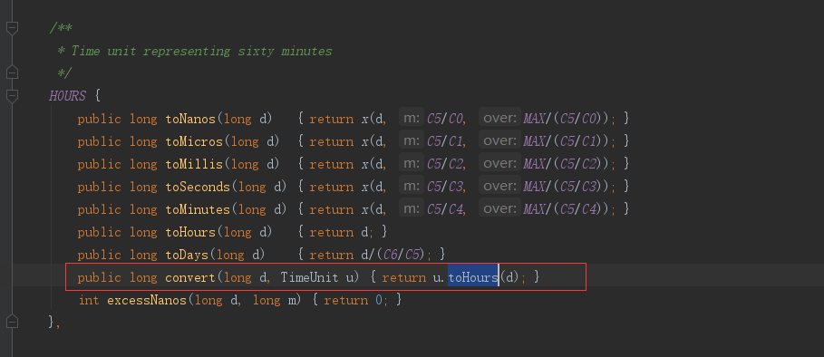

##### convert(long sourceDuration,  TimeUnit sourceUnit)

这个方法，我想用代码更好理解。

```java
//3600分钟 转换成 小时 是多少
System.out.println(TimeUnit.HOURS.convert(3600, TimeUnit.MINUTES));
//3600分钟 转换成 天 是多少
System.out.println(TimeUnit.DAYS.convert(3600, TimeUnit.MINUTES));
//3600分钟 转换成 秒 是多少
System.out.println(TimeUnit.SECONDS.convert(3600, TimeUnit.MINUTES));
```

如果你去查看源码，你也会发现他们的调用方式，我们用下面这对代码做解释

```java
//3600分钟 转换成 小时 是多少
System.out.println(TimeUnit.HOURS.convert(3600, TimeUnit.MINUTES));
```

首先找到对应的调用




