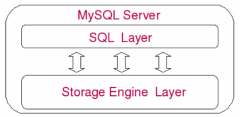
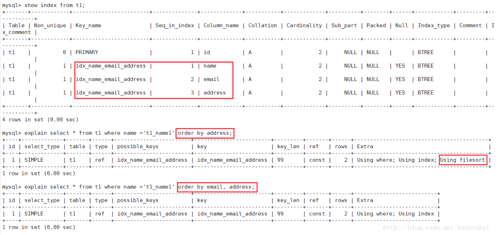

# 说明

第一块做架构的介绍，原因：

* 首先要对mysql有一个整体的意识
* 其次我们能对mysql里面的一些概念更加理解，帮助我们做优化的时候分析问题
* 知道我们优化的是mysql内部的哪些部分

# 1 Mysql 整体架构图


我们平时使用的都是上面的Client层，也就是客户端

要了解Mysql的性能优化，那么我们需要知道的是Mysql的服务端怎么运作的，以及它的存储引擎。

上图server部分的简图：



# 2 细化的流程交互图

我们创建连接到执行sql的整个流程图就是下图了。

* 初始化模块：启动mysql服务的时候，会根据一些参数去做mysql服务的初始化
* 连接管理模块：顾名思义是用作连接管理的，用过java的jdbc的应该对连接不陌生，我就不做说明了

sql执行部分，需要经过：

1. **连接管理模块**
2. **连接进程模块**：mysql内部的一个类似线程池的模块
3. **用户模块**：检查权限
4. **命令分发器** ：
5. **命令解析器** ：这里我们可以看到有多个分支走向：
   * **查询优化器**：顾名思义，我就不做讲解了
   * **表变更模块**：执行 DML 语句 将会进入这个分支（不知道什么是DML的后文的补充说明章节）
   * **表维护模块**：执行 DDL 语句 将会进入这个分支（不知道什么是DDL的后文的补充说明章节）
   * **复制模块**：比如主从复制
   * **状态模块**：比如 show status like '%cache%' 这样的语句
6. **访问控制模块**
7. **表管理模块**
8. **存储引擎接口**
**细心的你肯定看到了，命令分发器左边有走向一个 查询缓存模块 **，相信大家再做查询的时候会发现执行同一条语句，做二次查询的时候性能快了很多，这就是查询换存的作用了，第一次查询之后，得到的数据会换存在这个模块中，当然它是有大小限制的，所以在有的时候，可以调大这个换存的参数，起到一定的优化作用。


## 2.3 SQL 优化涉及的模块

在了解到第2章的内容之后，那么我们SQL优化的操作是针对的哪些模块应该有一个大致的了解了：

* **命令解析器**：
  * **查询优化器**：顾名思义，我就不做讲解了
  * **表变更模块**：执行 DML 语句 将会进入这个分支（不知道什么是DML的后文的补充说明章节）

主要针对的就是上面的两个模块

**当然，要做这样的优化，我们还需要了解，数据库的引擎的原理，因为为什么做这样的优化，是由底层设计决定的**

# 3 MySql 引擎

这里我们介绍MYSql现在主流的引擎


## 3.1 Innodb 

### 3.1.1 Innodb 存储文件

从上文中可以看到`Innodb`索引和数据存在一个文件中，存储形势：


### 3.1.2 Innodb 中的锁

除了**行锁**，**表锁**之外，他还有**共享锁**，**排他锁**，**间隙锁**

**什么时候使用行锁，什么时候使用表锁，是时候是读锁（共享锁），什么时候是写锁（排他锁）**

众多资料中都说innodb使用的是行级锁，但实际上是有限制的。只有在你增删改查时匹配的条件字段带有索引时，innodb才会使用行级锁，在你增删改查时匹配的条件字段不带有索引时，innodb使用的将是表级锁。因为当你匹配条件字段不带有所引时，数据库会全表查询，所以这需要将整张表加锁,才能保证查询匹配的正确性。在生产环境中我们往往需要满足多人同时对一张表进行增删改查，所以就需要使用行级锁，所以这个时候一定要记住为匹配条件字段加索引。

提到行级锁和表级锁时我们就很容易联想到读锁和写锁，因为只有触发了读写锁，我们才会谈是进行行级锁定还是进行表级锁定。那么什么时候触发读锁，就是在你用select 命令时触发读锁，什么时候触发写锁，就是在你使用update,delete,insert时触发写锁，并且使用rollback或commit后解除本次锁定。

**再来看一下 间隙锁**：首先他也是基于索引的，比如表test 有一个字段 id 是索引字段 ， 我这时调用 

```sql
update test set name = 'aaaaaaaaa' where id < 4 and id >1
-- 或者
SELECT * FROM user WHERE user_id BETWEEM 1 AND 100
```

这时候就会锁住这个范围内的行。

### 3.1.3 InnoDB行级锁定优化建议

InnoDB的行级锁最大的优势就是增强了高并发的处理能力，缺点就是复杂性较高、易死锁，且基于索引实现有一定弊端。我们要做的就是扬长避短，合理利用InnoDB行级锁定，为此我们就应该做的：

1. 尽可能让所有的数据检索都通过索引实现，因为InnoDB行级锁是基于索引实现的，没有索引或无法使用索引系统会改为使用表级锁。
2. 合理设计索引，以缩小加锁范围，避免“间隙锁”造成不该锁定的键值被锁定。
3. 尽量控制事务的大小，因为行级锁的复杂性会加大资源量以及锁定时间。
4. 业务允许的情况下，使用较低级别的事务隔离，以减少因实现事务隔离而付出的成本。
5. **避免死锁**，可以通过如下方式实现：
   * 类似的业务模块中，尽可能按照相同的访问顺序来访问，防止产生死锁。
   * 同一个事务中，尽量做到一次性锁定需要的所有资源。
   * 对于易产生死锁的业务部分，增大处理颗粒度，升级为表级锁以降低死锁产生的概率。

## 3.2 Myisam

`Myisam`索引和数据文件是分开的，存储的形势是这样的，最后在B+Tree 的叶子节点上面会有数据的逻辑地址


## 3.3 建表如何指定使用什么数据引擎呢

```sql
 create table test(
 id int(10) unsigned not null auto_increment,
 name varchar(10) character set utf8,
 age int(10),
 primary key(id)
 )
engine=MyISAM --INNODB
;

```

## 3.4 如何更改表的数据引擎

```sql
alter table test engine=innodb;
```


## 3.5 关于这部分内容更多的细节请看

https://blog.csdn.net/zhangliangzi/article/details/51408215

# 4 行锁,表锁的优缺点

```sql
查看所得争用状态

-- 表锁的征用状态查看
show status like 'table%'

-- 行锁的征用状态查看
show status like 'innodb_row_lock%'
```
## 4.1 行锁的优缺点

优点:

* 粒度更小

缺点:

* 获取和释放需要做更多的工作

* 容易产生死锁 : 一张表 test , 有 user_id , name 字段,

  一个事务 A 执行

  ```sql
  update test set name = 'xiaoHong' where user_id = 1
  update test set name = 'xiaoMing' where user_id = 3
  ```

  同时一个事务B 执行 

  ```sql
  update test set name = 'xiaoZhang' where user_id = 3
  update test set name = 'xiaoHong' where user_id = 1
  ```

  可能出现的请款是,事务A执行了 第一句sql,获取了 user_id = 1 的行锁 ; 事务B执行了 第一句sql,获取了 user_id = 3 的行锁,然后他们这时候发现 A 获取不到 `user_id = 3` B返现获取不到`user_id=1`的行锁，这时候事务A ,B 都不能执行完成，都无法释放锁

## 4.2 表锁的优缺点

优点:

- 实现逻辑简单
- 获取释放快 
- 避免了死锁

缺点:

- 粒度打，并发度不足

# 5 Mysql中的索引

## 5.1 什么是索引

**索引是高效获取数据的数据结构，在数据存储系统中索引以文件形势存在。**

这里介绍一部分mysql中所用到的索引

* hash :  不建议使用，也最好不要用。原因：
  * 因为hash容易产生hash冲突
  * **无法做范围查询，只能做等值查询的索引，不符合实际运用情况**, 比如：select * from table where id > 1
* FullText ：类似全文检索的索引
* R Tree:空间索引，一般不涉及到那样的也为用不到
* B Tree:
* B+Tree: mysql的InnoDB和MYSAM引擎都是走的 B+Tree 索引

## 5.3 什么是聚集索引

这个就要看他的索引存储方式：

* 在`Innodb`中索引和数据同时存在一块的就是聚集索引
* 在`MyISAM`中索引和数据分离的就是非聚集索引

**具体的看第4节的内存帮助理解**

## 5.4 联合（复合）索引

### mysql索引最左匹配原则的理解

内容完全来自 https://blog.csdn.net/qq_24690761/article/details/52787897

**首先我们创建一个表，有三个字段，分别是id,name,cid**

```sql
CREATE TABLE `student` (
	`id` INT (11) NOT NULL AUTO_INCREMENT,
	`name` VARCHAR (255) DEFAULT NULL,
	`cid` INT (11) DEFAULT NULL,
	PRIMARY KEY (`id`),
	KEY `name_cid_INX` (`name`, `cid`),

) ENGINE = INNODB AUTO_INCREMENT = 8 DEFAULT CHARSET = utf8
```

索引方面：id是主键，(name,cid)是一个多列索引(联合索引)。

**下面是我们有疑问的两个查询：**

```sql
EXPLAIN SELECT * FROM student WHERE cid=1;

EXPLAIN SELECT * FROM student WHERE cid=1 AND name='小红';
```

疑问是：sql查询用到索引的条件是必须要遵守最左前缀原则，为什么上面两个查询还能用到索引？

讲上面问题之前，我先补充一些知识，因为我觉得你对索引理解是狭隘的：

上述你的两个查询的explain结果中显示用到索引的情况类型是不一样的。,可观察explain结果中的type字段。你的查询中分别是：

1. type: index
2. type: ref

**解释：**

index：这种类型表示是mysql会对整个该索引进行扫描。要想用到这种类型的索引，对这个索引并无特别要求，只要是索引，或者某个复合索引的一部分，mysql都可能会采用index类型的方式扫描。但是呢，缺点是效率不高，mysql会从索引中的第一个数据一个个的查找到最后一个数据，直到找到符合判断条件的某个索引。

所以：对于你的第一条语句：

EXPLAIN SELECT * FROM student WHERE cid=1;

判断条件是cid=1,而cid是(name,cid)复合索引的一部分，没有问题，可以进行index类型的索引扫描方式。explain显示结果使用到了索引，是index类型的方式。

ref：这种类型表示mysql会根据特定的算法快速查找到某个符合条件的索引，而不是会对索引中每一个数据都进行一 一的扫描判断，也就是所谓你平常理解的使用索引查询会更快的取出数据。而要想实现这种查找，索引却是有要求的，要实现这种能快速查找的算法，索引就要满足特定的数据结构。简单说，也就是索引字段的数据必须是有序的，才能实现这种类型的查找，才能利用到索引。

有些了解的人可能会问，索引不都是一个有序排列的数据结构么。不过答案说的还不够完善，那只是针对单个索引，而复合索引的情况有些可能就不太了解了。

**下面就说下复合索引：**

mysql创建复合索引的规则是首先会对复合索引的最左边的，也就是第一个name字段的数据进行排序，在第一个字段的排序基础上，然后再对后面第二个的cid字段进行排序。其实就相当于实现了类似 order by name cid这样一种排序规则。

所以：第一个name字段是绝对有序的，而第二字段就是无序的了。所以通常情况下，直接使用第二个cid字段进行条件判断是用不到索引的，当然，可能会出现上面的使用index类型的索引。这就是所谓的mysql为什么要强调最左前缀原则的原因。

**那么什么时候才能用到呢?**

当然是cid字段的索引数据也是有序的情况下才能使用咯，什么时候才是有序的呢？观察可知，当然是在name字段是等值匹配的情况下，cid才是有序的

这也就是mysql索引规则中要求复合索引要想使用第二个索引，必须先使用第一个索引的原因。（而且第一个索引必须是等值匹配）。

所以对于你的这条sql查询：

```sql
EXPLAIN SELECT * FROM student WHERE cid=1 AND name='小红';
```


没有错，而且复合索引中的两个索引字段都能很好的利用到了！因为语句中最左面的name字段进行了等值匹配，所以cid是有序的，也可以利用到索引了。

你可能会问：我建的索引是(name,cid)。而我查询的语句是cid=1 AND name='小红'; 我是先查询cid，再查询name的，不是先从最左面查的呀？

好吧，我再解释一下这个问题：首先可以肯定的是把条件判断反过来变成这样 name='小红' and cid=1; 最后所查询的结果是一样的。

那么问题产生了？既然结果是一样的，到底以何种顺序的查询方式最好呢？

所以，而此时那就是我们的mysql**查询优化器**该登场了，mysql查询优化器会判断纠正这条sql语句该以什么样的顺序执行效率最高，最后才生成真正的执行计划。所以，当然是我们能尽量的利用到索引时的查询顺序效率最高咯，所以mysql查询优化器会最终以这种顺序进行查询执行。

**我们写where 条件时候最好按照索引字段的顺序来写,这样可以减少查询优化器的分析时间**

## 5.2 使用索引的优缺点

**优点：**

* 提高检索效率
* 降低排序成本——排序/分组主要消耗的是我们的内存和cpu, ( 可以明显从B+Tree的结构看出来)

**缺点：**(**创建的表的索引越多,下面这些情况越明显**)

* 增大数据更新(增删改)时候的IO量,你更新数据索引也是需要同步更新的
* 增加更新的时候索引调整的计算量
* 占用的内存会更多(多数情况多不会考虑这一点,主要还是考虑上面的情况)

**在一些特定情况下,如果一张表索引太多,可以考虑使用联合索引(使用它就要考虑自己的sql的设计,参考5.4节),用以减少索引数量**

## 5.3 创建索引需要注意什么

* 为经常需要排序、分组和联合操作的字段建立索引 

* 尽量选择唯一性索引 

* 唯一性太差（数据重复率太高）的字段**不适合创建索引**

* 较频繁的作为查询条件的字段**应该创建索引**

* 限制索引的数目

* 尽量使用数据量少的做引索：这个数据量指的单个字段的长度，比如 vachar(100) 肯定没有vachar(10) 好

*  尽量使用前缀来索引 

* 更新非常频繁的字段**不适合创建索引**

* 不会出现在where子句中的字段**不适合创建索引**

* 我们选择什么做主键比较好：能选择自增id做主键是最好的情况，从B+Tree的插入过程原理，可以知道使用自增组件做插入的时候，我们的插入和分裂过程都集中到右子树，同时插入一边都是到最右边的叶子节点，同时分裂，也是针对那一部分，

* 尽量选择数字的字段做索引

* 删除不再使用或者很少使用的索引 

* 最左前缀匹配原则（联合索引），非常重要的原则。mysql会一直向右匹配直到遇到范围查询(>、<、between、like)就停止匹配，比如 `a = 1 and  b = 2 and c > 3 and d = 4` 如果建立(a,b,c,d)顺序的索引，d是用不到索引的，如果建立(a,b,d,c)的索引则都可以用到，a,b,d的顺序可以任意调整。

* =和in可以乱序。比如a = 1 and b = 2 and c = 3 建立(a,b,c)索引可以任意顺序，mysql的查询优化器会帮你优化成索引可以识别的形式

* 索引列不能参与计算，保持列“干净”。 如果对索引列使用 函数 或 表达式 操作 执行计划是不会走索引的

* 尽量的扩展索引，不要新建索引。  比如表中已经有a的索引，现在要加(a,b)的索引，那么只需要修改原来的索引即可 

## 5.4 复合主键会创建什么样子的索引

这个和创建复合索引的时候 ，创建的数据结构类似

# 6 SQL 优化

## 6.1 什么是执行计划？

执行计划 ： 数据库根据SQL语句和相关表的统计信息作出的查询方案，该方案由查询优化器自动解析产生
比如，一条SQL语句是从10条数据中查询一条数据，正常情况 查询优化器 会选择索引查找的方
式。  如果此时你的SQL语句使用不当 那么很可能就要进行全表扫描了

## 6.2 怎么看执行计划？

在select语句之前 加上`explain`:

比如：

```sql
EXPLAIN select * from goods where price = 70
```

增删改语句也可以变相的使通过`explain`来查看执行计划，因为增删改也是带有查询语句的，比如

```sql
update goods set price = 100 where goodId=2 
```

这时候我们可以通过

```sql
EXPLAIN select * from goods where goodId=2 
```

**mysql 5.6 之后 可以直接在select 以外的语句上使用**

```sql
EXPLAIN update test set name = 'xiaoZhang' where id = 2
```

运行这样的语句之后我们能看到，有些sql是有多条执行计划的


下面我们来看看这些字段怎么去理解

## 6.3 执行计划中个字段值的解释

这部分内容来源 https://blog.csdn.net/wuseyukui/article/details/71512793

### id

三种情况： 
1、id相同：执行顺序由上至下 


2、id不同：如果是子查询，id的序号会递增，id值越大优先级越高，越先被执行 


3、id相同又不同（两种情况同时存在）：id如果相同，可以认为是一组，从上往下顺序执行；在所有组中，id值越大，优先级越高，越先执行 


### select_type

* **SIMPLE**：简单的select查询，查询中不包含子查询或者union 
* **PRIMARY**：查询中包含任何复杂的子部分，最外层查询则被标记为primary 
* **SUBQUERY**：在select 或 where列表中包含了子查询 
* **DERIVED**：在from列表中包含的子查询被标记为derived（衍生），mysql或递归执行这些子查询，把结果放在临时表里 
* **UNION**：若第二个select出现在union之后，则被标记为union；若union包含在from子句的子查询中，外层select将被标记为derived 
* **UNION RESULT**：union中的合并结果


### type

访问类型，sql查询优化中一个很重要的指标，结果值从好到坏依次是：

**system** > **const** > **eq_ref** > **ref** > **fulltext** > **ref_or_null** > **index_merge** > **unique_subquery** > **index_subquery** > **range** > **index** > **ALL**

一般来说，好的sql查询至少达到range级别，最好能达到ref

* **system**：表只有一行记录（等于系统表），这是const类型的特例，平时不会出现，可以忽略不计

* **const**：表示通过索引一次就找到了，const用于比较primary key 或者 unique索引。因为只需匹配一行数据，所有很快。如果将主键置于where列表中，mysql就能将该查询转换为一个const 

  

* **eq_ref**：唯一性索引扫描，对于每个索引键，表中只有一条记录与之匹配。**常见于主键 或 唯一索引扫描。** 

* **ref**：非唯一性索引扫描，返回匹配某个单独值的所有行。**本质是也是一种索引访问**，**它返回所有匹配某个单独值的行，然而他可能会找到多个符合条件的行，所以它应该属于查找和扫描的混合体**  

  

* **range**：只检索给定范围的行，使用一个索引来选择行。key列显示使用了那个索引。一般就是在where语句中出现了bettween、<、>、in等的查询。这种索引列上的范围扫描比全索引扫描要好。只需要开始于某个点，结束于另一个点，不用扫描全部索引  

  

* **index**：Full Index Scan，index与ALL区别为index类型只遍历索引树。这通常比ALL快，因为索引文件通常比数据文件小。（**Index与ALL虽然都是读全表，但index是从索引中读取，而ALL是从硬盘读取**）

* **ALL**：Full Table Scan，遍历全表以找到匹配的行  

### possible_keys 

查询涉及到的字段上存在索引，该索引将被列出，但不一定被查询实际使用 

### key

实际使用的索引，如果为NULL，则没有使用索引。 
**查询中如果使用了覆盖索引，则该索引仅出现在key列表中**

**覆盖索引**：也叫索引覆盖。就是select列表中的字段，只用从索引中就能获取，不必根据索引再次读取数据文件。  


注意上面查询语句的字段就算顺序不一致也是会使用这个索引的，也就是说这样写也没事

```sql
 select email ,name from t1
```


### key_len

表示索引中使用的字节数，查询中使用的索引的长度（最大可能长度），并非实际使用长度，理论上长度越短越好。key_len是根据表定义计算而得的，不是通过表内检索出的

### ref

显示索引的那一列被使用了，如果可能，是一个常量const。

### rows

根据表统计信息及索引选用情况，大致估算出找到所需的记录所需要读取的行数

### Extra

不适合在其他字段中显示，但是十分重要的额外信息

* **Using filesort** ：  mysql对数据使用一个外部的索引排序，而不是按照表内的索引进行排序读取。也就是说mysql无法利用索引完成的排序操作成为“文件排序”  

  

  由于索引是先按email排序、再按address排序，所以查询时如果直接按address排序，索引就不能满足要求了，mysql内部必须再实现一次“文件排序” 

* **Using temporary**：  使用临时表保存中间结果，也就是说mysql在对查询结果排序时使用了临时表，常见于order by 和 group by  

  

* **Using index**： 
  表示相应的select操作中使用了覆盖索引（Covering Index），避免了访问表的数据行，效率高 
  如果同时出现Using where，表明索引被用来执行索引键值的查找（参考上图） 

* **Using where** ：  使用了where过滤 

* **Using join buffer** ：  使用了链接缓存 

* **Impossible WHERE**：  where子句的值总是false，不能用来获取任何元祖  

* **select tables optimized away **：  在没有group by子句的情况下，基于索引优化MIN/MAX操作或者对于MyISAM存储引擎优化COUNT（*）操作，不必等到执行阶段在进行计算，查询执行计划生成的阶段即可完成优化 

* **distinct**：  优化distinct操作，在找到第一个匹配的元祖后即停止找同样值得动作 

## 6.4 数据库执行计划的局限性：

EXPLAIN不会告诉你关于触发器、存储过程的信息或用户自定义函数对查询的影响情况；

EXPLAIN不考虑各种Cache（通常人们所说的Cache就是指缓存SRAM。 SRAM叫静态内存，“静态”指的是当我们将一笔数据写入SRAM后，除非重新写入新数据或关闭电源，否则写入的数据保持不变)；

EXPLAIN不能显示MySQL在执行查询时所作的优化工作；

部分统计信息是估算的，并非精确值；

EXPALIN只能解释SELECT操作，其他操作要重写为SELECT后查看执行计划。（mysql5.6的版本已经支持直接查看）

## 6.5 通过查看执行计划总结得出：

1. **永远用小结果集驱动大结果级（主要针对 join 语句）**

2. select 中 值拿自己需要的字段，别用 * 

3. 首先需要写出 统一 的 sql 语句 举例：

    ```sql
    select * from tablename
    select * FROM tablename
    ```

    虽然只是大小写不同 ，但是查询分析器 就认为这是两个不同的sql 语句，他需要去解析两次，生成两个执行计划

    所以我们 在写程序的时候 应该去保证同样的 SQL语句 在任何地方都是一致的。多一个空格都不可以

4. 尽量不要把 SQL语句 写的太长，太过冗余

     根据经验嵌套超过三层，查询优化器就很容易给出错误的执行计划。另外执行计划是可以复用的，越是简单的SQL语句复用的可能性越高。 而复杂的SQL语句只要有一个字符发生变化，就必须重新解析。然后这样的垃圾信息，还会被缓存在内存中，可想而知，数据库的性能会受到多大影响

5. 合理使用 like 模糊查询

     like '%xxx' 这样的 % 号出现在关键字前面的模糊查询 肯定会走全表扫描，因此 除非必要，否则不要在关键字前面加%。

6. 应该尽量避免在 where 字句中 对字段进行 null 值得判断 不管是 is null / is not null

   比如 : 

   ```     sql
   select id from table where name is null
   ```

   假设 这个表我们对 name 设置了索引，但是查询分析器不会使用索引，因此查询效率低下。为了避免这样的情况发生，我们应该设置表的值为0或'’根据你字段类型来设置一个值，不管怎么也别是null.这样就可以 通过 判断 name = 0 或则是 name = ...‘’来过滤了

7. 避免在 where 字句中 使用 不等于 ！= 或则 <> 这样的操作符

     比如 : 

     ```sql
     select id from table where name != 0
     ```

     使用这种查询条件操作符 不会使用索引，而 > , >= , < , <= , = , between and ,这样的操作符，数据库才会使用
     索引。那么该sql 应该写成

     ```sql
      select id from table where name > 0 union all select id from table where name <0
     ```

8. 为什么 上述5的 优化后sql 不适用 or 呢 ， 因为 我们也需要避免在 SQL语句中 使用 or 来连接条件

9. 少用 in 或 not in  ，在子查询当中用 exists 代替 in 是一个好的选择

10. 避免在 where 字句中进行 函数 或 表达式 操作

     比如：

     ```sql
     select id from table where name/2 = 50
     select id from table where substring(name,1,8) = 'xxxx'
     ```

11. 在子查询当中 用 exists 代替 in 是一个好的选择

12. count(*) 这样不带任何条件的 count 会导致全表扫描

## 6.6  order by 

**在使用order by 的时候，如果条件只包含 主键的话，性能是最好的，由于 innodb的实现使用了 B+Tree,并且由主键构建的索引是和数据绑定的聚集索引，所以是不需要做额外的排序的**

但是别的索引就没这样的好处了，排序还是要将数据放到内存中去做一次排序的。

MySIAM 引擎的完全没有上述的功能，因为他不是聚集索引

**如果键表之初到之后从未使用过主键，但是你用的高了唯一索引，那么这个唯一索引也是有这样的性质的**

## 6.7  group by  

在使用 group by 的时候 需要先排序（这个过程和上文的 order by  一样的），再索引

## 6.8 distinct

他又是基于 group by 来做的

## 6.9 limit

```sql
SELECT * FROM test2 LIMIT 10000,10
```

这样一条语句 要去取 10010 条数据

优化方式，如果这里有 索引字段，最好是主键，或则数字字段我们可以这样写

```sql
SELECT * FROM test2 where id > 10000 LIMIT 10
```

# 7 性能优化

* 人为因素 : 考虑自己的需求设计是否合理 ; 结构，架构设计是否合理。............

* sql优化 :

  * 通过查询计划，优化sql语句索引使用，需要注意有的时候就算使用了索引，但是我们要查询的数据的结果很多，那么需要扫描的数据的行数还是很多，那么还是会很慢。同时我们需要关注，取数据是否需要去主键索引上取数据，因为查询时候为用到主键索引的时候，而是使用普通索引，我们的select 语句中却要使用到除了普通索引字段外的其他字段数据，这时候还需要经过普通索引关联的主键索引取数据，这样一个过程，例如 id 是主键，age建立了普通索引

    ``` sql
    select id,name,age from person where age between 5 and 10
    ```

    这时候通过age索引筛选了数据之后，然后还要去id主键索引上取完整得行数据，才能得到我们要的id,name,age。当然如果sql是

    ```sql
    select age from person where age between 5 and 10
    ```

    那么就直接通过age索引就能完成整个过程

* 锁优化：请看第3和第4界中关于锁的介绍

优化的顺序：

**首先考虑系统的性能，最后才考虑sql的问题**

# 数据库服务器，CPU 使用异常，内存使用异常

出现这样的情况的时候可以使用下面的命令

```sql
-- 查看正在使用数据库服务器的机器，他们正在做一些什么
show full processlist
```

比如：


# 补充说明

## 数据库语句大致分类

* **DML (Data Munipulation language)** : 数据操作语言 对表的增删改这些语句

* **DDL (Data Definition language)** : 据库定义语言 比如：create , alter , drop , 等语句

* **DCL (Data Control language ) ** : 数据库控制语言 用来设置或更改数据库用户或者较色权限的语句 比如: grant , deny , revoke 等

   
