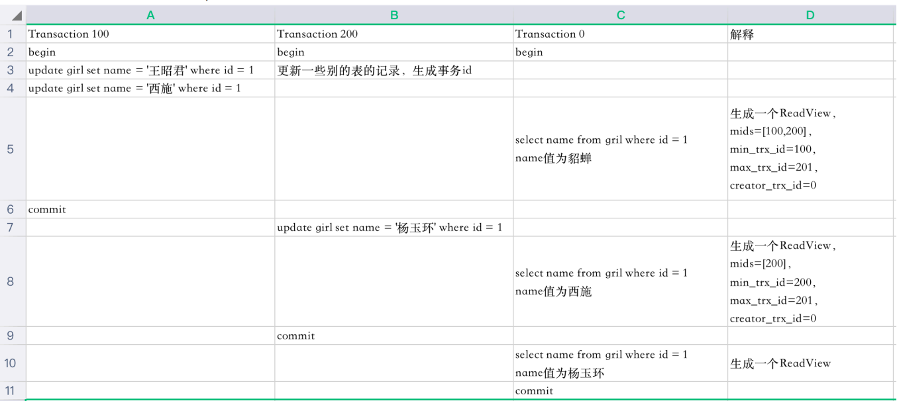
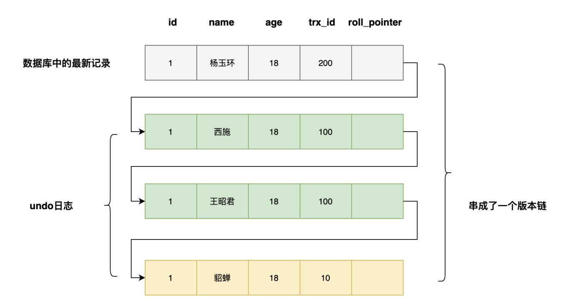

# 在并发执行事务时会发生什么问题呢？

1. **脏读**：一个事务读到另一个事务未提交的更新数据（事务A和B并发执行，B事务执行更新后，A事务查询B事务没有提交的数据，B事务回滚，则A事务得到的数据不是数据库中的真实数据。也就是脏数据，即和数据库中不一致的数据）。
2. **不可重复读**：一是指在一个事务内，多次读同一数据。在这个事务还没有结束时，另外一个事务也访问该同一数据。那么，在第一个事务中的两次读数据之间，由于第二个事务的修改，那么第一个事务两次读到的的数据可能是不一样的。这样在一个事务内两次读到的数据是不一样的，因此称为是不可重复读。
3. **覆盖更新**：这是不可重复读中的特例，一个事务覆盖另一个事务已提交的更新数据（即A事务更新数据，然后B事务更新该数据，A事务查询发现自己更新的数据变了）。
4. **幻读**: 在一个事务中使用相同的 SQL 两次读取，第二次读取到了其他事务新插入的行，或者读取发现数据少了（因为数据被删除了，或者修改了条件导致当前SQL的条件查不到这个数据）。


# 隔离级别

* Serializable (序列化，串行化) : 串行执行 **可避免脏读，不可重复读，幻读的发生。**它是最高的事务隔离级别，同事花费的代价也是很大的，性能很低，一般很少使用。

* Repeatable read (重复读) :一个事务开始读取这条数据，那么别的事务就不能对其进行修改。 可以解决不可重复读和脏读

* Read committed (读已提交): 一个事物要等另一个事务提交之后才能读取 可避免脏读 

* Read uncommitted(读未提交) 

  **mysql 默认是 `REPEATABLE-READ` 重复读**

# 如何查看级别

* 查看当前会话隔离级别

  `select @@tx_isolation;`

* 查看系统当前隔离级别

  `select @@global.tx_isolation;`

* 设置当前会话隔离级别

  ```sql
  set session transaction isolation level read uncommitted; 
  set session transaction isolation level read committed;
  set session transaction isolation level repeatable read;
  set session transaction isolation level serializable;
  ```

* 设置系统当前隔离级别

  ```
  set global  transaction isolation level read uncommitted; 
  set global  transaction isolation level read committed;
  set global  transaction isolation level repeatable read;
  set global  transaction isolation level serializable;
  ```

# mysql中的排他锁

## 表锁

如果条件语句没有命中索引，那么使用**表锁**

## 行锁（记录锁）

条件语句使用的索引只涉及到一条数据那就是**行锁** , **这也叫 记录锁，这个是涉及到主键索引/唯一索引的时候查询条件是 =值操作的时候**


## 命中索引的一个范围内数据的锁

### 临键锁


### 间隙锁


# 四个隔离级别如何实现的

## 须知

**我们的事务ID是在一个事务中的第一个语句执行时生成的**

> 下文中的 read view ，还有快照数据 相关的东西看[MVCC](MVCC.md)
>
> 锁相关：[mysql锁类型](mysql锁类型.md)

## Mysql 的 MVCC 如何实现的

依赖 undo log 一行数据的版本链表 + read view 来完成。详情看下面的 reda view 的判断逻辑

### read view

系统当前的 read view 数据：

**m_ids**：在⽣成ReadView时，当前系统中活跃的事务id列表

**min_trx_id**：在⽣成ReadView时，当前系统中活跃的最⼩的事务id，也就是m_ids中的最⼩值

**max_trx_id**：在⽣成ReadView时，系统应该分配给下⼀个事务的事务id值

**creator_trx_id**：⽣成该ReadView的事务的事务id

> * 当对表中的记录进⾏改动时，执⾏insert，delete，update这些语句时，才会为事务分配唯⼀的事务id，否则⼀个事务的事务id值默认为0。
> * max_trx_id并不是m_ids中的最⼤值，事务id是递增分配的。⽐如现在有事务id为1，2，3这三个事务，之后事务id为3的事务提交了，当有⼀个新的事务⽣成ReadView时，m_ids的值就包括1,2 (因为3已经提交了), min_trx_id的值就是1，max_trx_id的值就是4

可见性判断的伪代码：不可见的 trx_id 都会根据版本链继续使用这个方法查找到可见的为止否则查询直到链的最末端。

```c++
IsVisible(trx_id)
    if (trx_id == creator_trx_id)     // 当前事务
        return true;
    else if (trx_id < min_trx_id)    // ReadView创建时, 事务已提交
        return true;
    else if (trx_id >= max_trx_id)  // ReadView创建时，事务还未被创建
        return false;
    else if (trx_id is in m_ids)  // ReadView创建时，事务正在执行，但未提交,也就是活跃中的事务
        return false
    else                          // ReadView创建时, 事务已提交
        return true;
```


## read uncommitted(读未提交) 

**锁层面**：写数据都会加[排他锁](#mysqsl中的排他锁)，普通select数据是不加锁的（除了serializable 级别以外），但是写写因为都加了锁所以可以避免并发写安全问题

**普通读不加锁，所以读写可以并行，读最新的数据，不管这条记录是不是已提交。不会遍历版本链，少了查找可见的版本的步骤**

**不需要生成 read view. 直接查询 版本链最新数据即可**

## read committed (读已提交) 

**锁层面：** 读写可以并发，写写（加[排他锁](#mysqsl中的排他锁)）互斥。 普通读是没有锁的。

每次读取的时候都生成一个 read view . 这样可以保证能够读取到已经提交的数据



​	**在步骤5的时候,** 得到这样一条版本链表。其实 trx_id = 100 的数据还未提交。

​	

当前 read view : mids=[100,200] , min_trx_id = 100, max_trx_id = 201 ， creator_trx_id = 0;

trx_id = 100 的数据在 mids 中所以都不可见，往链的前面继续查找，可以查到 trx_id = 10 的 name = 貂蝉的数据

**在步骤8的时候**



当前 read view : mids=[200] , min_trx_id = 200, max_trx_id = 201 ， creator_trx_id = 0;

trx_id  = 200 的数据在 mids 中，也就是未提交，不可见，查到 trx_id = 100 . name =  西施的数据。由于这个数据已经提交不在 mids中，并且 < min_trx_id && < max_trx_id 所以是可见的，查到 trx_id = 100 . name =  西施的这条数据

## repeatable read (可重复读)

**锁层面：** 读写可以并发，写写（加[排他锁](#mysqsl中的排他锁)）互斥。 普通读是没有锁的。

**read view :** 第一次读取数据是生成一个 read view , 后续的读不会再生成新的 read view ，由于这个 read view 不会变。自然后续的其他事务对数据的变更他也看不见了。也就保证了数据可以重复读不会变，同时也看不到其他事务插入的新数据（trax_id < max_tra_id）。所以 也可以bi'miabimia你幻读

## serializable 级别

该级别下，会自动将所有普通`select`转化为`select ... lock in share mode`执行（加读的共享锁），即针对同一数据的所有读写都变成互斥的了，可靠性大大提高，并发性大大降低。

