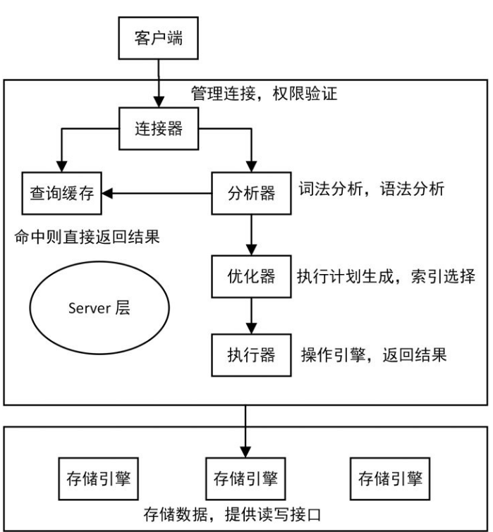
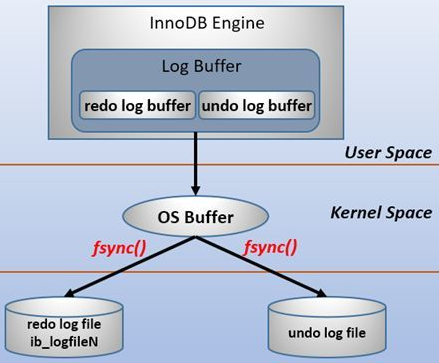
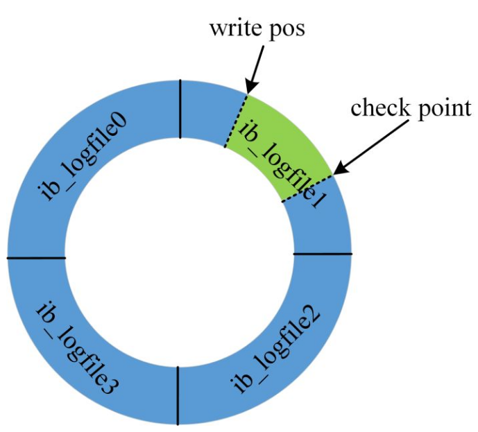

# DML语句执行过程

首先我们看一下sql的大致执行链路，需要强调的是本文的主要介绍的是InnoDB执行引擎的redo log&server层的binlog

在执行引擎侧s：执行查询语句的时候，会根据当前的隔离级别确定是否生成 read view , 然后再确定哪些数据可见

在执行引擎侧:  执行修改语句

1. 先**生成全局递增的唯一的事务id ： A** 
2. 查询数据是否存在，如果不存在则结束流程
   1. 内存中是否存在，如果不存在去磁盘找
3. 数据存在获取当前的数据，并且找到 该数据的 undo log.
4. 修改数据，并将修改的数据加入到 undo log 中 形成更新后的版本链表： A -> 早期版本
   1. 如果数据，回滚即可
5. 记录 redo log 状态为 prepare
   1. 失败：回滚数据
6. 记录binlog
   1. 失败：回滚数据
7. 提交 redo log ，状态修改成 commit

如果其中的第 4步 机器down了，什么都没有影响。启动后回滚 undo log 的数据就好

如果第 5 redo log 写成功/未写成功后机器down了， 由于未提交/不存在对应的 redo log &&binlog。所以回滚undo log即可

如果第 6步 down了

1. binlog 没有写成功：redo log 此时是未提交的状态，回滚数据
2. binlog 写成功了：会提交 redo log 的数据，然后结束，数据写成功

第 7步失败了： binlog 存在，会提交 redo log 的数据，然后结束，数据写成功s

# binlong 日志模块

## 基本概念

binlog是mysql的二进制日志，也是最重要的日志，位于mysql的server层，它记录了所有的DDL和DML语句（除了select语句），以事件形式记录，并且包含了语句执行所消耗的时间

> DDL 数据库定义语言 
>
> ​	主要的命令有create、alter、drop等，ddl主要是用在定义或改变表(table)的结构,数据类型，表之间的连接和约束等初始工作上，他们大多在建表时候使用。
>
> DML 数据操纵语言
>
> ​	主要命令是slect,update,insert,delete,就像它的名字一样，这4条命令是用来对数据库里的数据进行操作的语言

### 格式

binlog的格式也有三种：STATEMENT、ROW、MIXED 。

* STATMENT模式：基于SQL语句的复制(statement-based replication, SBR)，每一条会修改数据的sql语句会记录到binlog中。

  优点：不需要记录每一条SQL语句与每行的数据变化，这样子binlog的日志也会比较少，减少了磁盘IO，提高性能。

  缺点：在某些情况下会导致master-slave中的数据不一致(如sleep()函数， last_insert_id()，以及user-defined functions(udf)等会出现问题)

* ROW模式：基于行的复制(row-based replication, RBR)，不记录每一条SQL语句的上下文信息，仅需记录哪条数据被修改了，修改成了什么样子了。

  优点：不会出现某些特定情况下的存储过程、或function、或trigger的调用和触发无法被正确复制的问题。

  缺点：会产生大量的日志，尤其是alter table的时候会让日志暴涨。

* 混合模式复制(mixed-based replication, MBR)：以上两种模式的混合使用，一般的复制使用STATEMENT模式保存binlog，对于STATEMENT模式无法复制的操作使用ROW模式保存binlog，MySQL会根据执行的SQL语句选择日志保存方式。**推荐**

### 使用场景

* **数据库的主从复制**： 在 master服务器上开启binlog,master会把binlog传递给slaves来达到master-slaves的数据一致性
* **数据恢复**：可以通过 mysqlbinlog 工具来恢复数据
  1. 二进制日志索引文件(文件名后缀为.index)用于记录所有的二进制文件。
  2. 二进制日志文件(文件名后缀为.00000*)记录数据库所有的DDL和DML(除了数据查询语句select)语句事件。

# redo log

## **基本概念**

* **redo log 通常是物理日志，记录的是数据页的物理修改，而不是某一行或某几行修改成怎样怎样，它用来恢复提交后的物理数据页(恢复数据页，且只能恢复到最后一次提交的位置)**
* **redo log包括两部分：一是内存中的日志缓冲(redo log buffer)，该部分日志是易失性的；二是磁盘上的重做日志文件(redo log file)，该部分日志是持久的。**

## 为什么需要 redo log

首先我们来想想，在一次事务中，如果我存在4个DML语句，都会涉及到修改数据，那么如果我每一次修改数据都要立刻持久化到磁盘，意味着需要执行4次IO操作，那么作为一个高性能数据库，大量的调用这样的IO操作，必然会成为性能瓶颈，那么我们就需要解决这样的问题，思路：

1. 首先可以想到将修改的数据缓存起来（先放在内存中）等到一定量之后，调用一次IO批量写到磁盘。

   存在的问题：存放在内存中，只要发生掉电情况（比如系统崩溃），内存中的数据就会丢失，那么数据库的持久性，数据的一致性 就无法保证，怎么解决呢？看第二步

2. 为了保证在系统崩溃或则其他掉电情况发生之后，我们的数据不丢失，那么就引入了**Write-Ahead Logging(预写式日志)**机制，我们先写数据日志，也就是redo log，事务提交我们就将日志持久化到磁盘（这是redo log 中的机制之一，这种机制不会造成数据的任何丢失，但是相比其他机制性能较差，其他机制后续会有介绍，选用的时候需要根据自己系统对数据丢失情况是否能容忍来选择），这样一来减少了IO,同时由于redo log持久化到了磁盘，即使发生掉电状况，我们在重启服务器之后，也能使用redo log恢复数据，保证数据库的持久性，保证数据的一致性。

## 写 redo log的过程

为了确保每次日志都能写入到事务日志文件中，在每次将 log buffer 中的日志写入日志文件的过程中都会调用一次操作系统的fsync操作(即fsync()系统调用)。因为 [MariaDB](https://cloud.tencent.com/product/tdsql?from=10680)/MySQL 是工作在用户空间的，MariaDB/MySQL 的 log buffer 处于用户空间的内存中。要写入到磁盘上的 log file 中(redo:ib_logfileN文件,undo:share tablespace或.ibd文件)，中间还要经过操作系统内核空间的 OS buffer，调用fsync()的作用就是将 OS buffer 中的日志刷到磁盘上的 log file 中。

也就是说，从redo log buffer写日志到磁盘的redo log file中，过程如下：

之所以要经过一层os buffer，是因为 open 日志文件的时候， **open 没有使用 O_DIRECT 标志位**，该标志位意味着绕过操作系统层的 os buffer，IO直写到底层存储设备。不使用该标志位意味着将日志进行缓冲，缓冲到了一定容量，或者显式`fsync()`才会将缓冲中的刷到存储设备。**使用该标志位意味着每次都要发起系统调用。比如写 a b c d e，不使用 o_direct 将只发起 1 次系统调用，使用 o_object 将发起 5 次系统调用。**

> **关于内核缓存区域（Page Cache）:看一看[磁盘IO那些事](..\..\计算机系统\磁盘IO那些事.md)中的Page Cache这一节**

**MySQL 支持用户自定义在 commit 时如何将 log buffer 中的日志刷 log file 中**。这种控制通过变量 `innodb_flush_log_at_trx_commit` 的值来决定。该变量有3种值：0、1、2，默认为 1。但注意，这个变量只是控制 commit 动作是否刷新 log buffer 到磁盘。

- 当设置为 1 的时候，事务每次提交都会将 log buffer 中的日志写入 os buffer 并调用 `fsync()`刷到 log file on disk中。这种方式即使系统崩溃也不会丢失任何数据，但是因为每次提交都写入磁盘，IO 的性能较差。
- 当设置为 0 的时候，事务提交时不会将 log buffer 中日志写入到 os buffer，而是每秒写入 os buffer 并调用`fsync()`写入到 log file on disk 中。也就是说设置为 0 时是(大约)每秒刷新写入到磁盘中，当系统崩溃，会丢失 1 秒钟的数据。
- 当设置为 2 的时候，每次提交都仅写入到 os buffer，然后是每秒调用 fsync() 将 os buffer 中的日志写入到 log file on disk。

在主从复制结构中，要保证事务的持久性和一致性，需要对日志相关变量设置为如下：

- **如果启用了二进制日志binlog，则设置sync_binlog=1，即每提交一次事务同步写到磁盘中。**
- **总是设置innodb_flush_log_at_trx_commit=1，即每提交一次事务都写到磁盘中。**

> sync_binlog=1 ； innodb_flush_log_at_trx_commit=1 确实是最保险的方式，但是性能影响很大，或许在某些，读写分离的架构，写很少的情况下，写库这样做完全没有问题，但是其他情况就需要权衡了
>
> 关于redolog数据丢失问题我们可以看看 https://blog.51cto.com/wangwei007/2487410
>
> 

## redo log buffer 刷盘规则

**prepare 状态得redo log也是会落盘的**

* **发出commit动作时。已经说明过，commit发出后是否刷日志由变量 innodb_flush_log_at_trx_commit 控制。**
* **innodb_flush_log_at_timeout配置代表刷redo log buffer 数据的频率 默认是1秒,也就是每秒刷一次，要注意，这个刷日志频率和commit动作无关.** 
* **当redo log buffer中已经使用的内存超过一半时。**

## 数据页 buffer pool 刷盘规则

* redo log 的 check point

  redo log 磁盘数据采用循环写，文件大小和数量可配置

  

  * write pos指向了日志尾部
  * checkpoint 指向已刷新了数据页的日志的尾部

  图中展示了一组 4 个文件的 redo log 日志 ，那么write pos 到 checkpoint 之间的部分可以用来记录新的redo log的空间（可被覆盖的部分）；checkpoint 到 write pos 之间的redo log等待表示等待刷新数据页(刷脏页)的部分。如果 write pos 和 checkpoint 相遇，说明 redolog 已满，这个时候数据库停止进行数据库更新语句的执行，转而进行刷脏页的动作

# undo log 日志模块

## 基本概念

undo log 是逻辑日志，undo日志用于存放数据修改被修改前的值,他和redo log 一样会先存放到 undo log buffer 中，然后在刷到磁盘（机制和redo 差不多）与redo log不同的是，磁盘上通常不存在单独的undo log文件，所有的undo log均存放在主ibd数据文件中（表空间），mysql5.7开始可以设置 undo log存放到单独的地方。

**undo log 有两个作用：**

* 提供回滚，保证事务的一致性
* 多个行版本控制(MVCC)。

在数据修改的时候，不仅记录了redo，还记录了相对应的undo，如果因为某些原因导致事务失败或回滚了，可以借助该undo进行回滚。

undo log和redo log记录物理日志不一样，它是逻辑日志。**可以认为当delete一条记录时，undo log中会记录一条对应的insert记录，反之亦然，当update一条记录时，它记录一条对应相反的update记录。**当执行 rollback 时，就可以从undo log中的逻辑记录读取到相应的内容并进行回滚。

**另外，undo log也会产生redo log，因为undo log也要实现持久性保护。**

