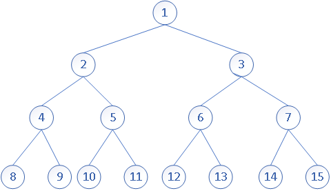
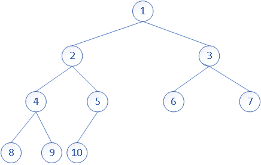
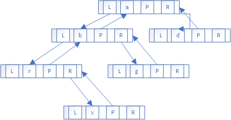

# 申明

内容主要学自我大学的一个数据结构的书《数据结构(C语言版)》

# 树的定义

树（Tree）是n个节点的有限集（集合），在任意一颗非空树中：

* 有且仅有一个根节点 `root`
* n>1时，其余节点可分为m (m>0) 个互不相交的子树


# 树的基本术语

* **度**：一个结点拥有子结点的个数称为它的度
* **叶子（终端结点）**：度为0的结点
* **非终端结点（分支结点）**：度不为0的结点
* **孩子结点**:一个非终端结点拥有子节点，它的子节点就是他的孩子节点
* **双亲结点**：一个非终端结点是它子节点的双亲结点
* **兄弟结点**：具有同一个双亲结点的结点互为兄弟结点
* **树的层次**：将树的跟作为树的第一层，跟的孩子作为第二层,以此类推
* **树的深度(高度)** 数中结点的最大层次称为树的深度（高度），例如上文中的实例图中的树的 高度=4
* **堂兄弟结点**：同一层的结点互为堂兄弟结点

# 二叉树的定义

在了解了上文中树的定义之后，我们来看什么 是二叉树

二叉树：一棵树的每一个结点最多只有两个子结点（子树），并且它的子结点（子树）具有左右之分，其次序不能任意颠倒。

# 二叉树的性质

## 基本性质

这些性质中，简单的性质的推到你们可以自行画图来看，因为真的很简单那，所以我就不做特别说明

在看下面的性质之前我们先看一个二叉树的图，后面你们看性质的时候可以结合这个图来看


（1）在二叉树的第i层最多只有2[^i-1]个结点

（2）深度为k的二叉树，最多只有2[^k]-1个结点

（3）任意一颗二叉树，如果终端结点（叶子）数=n0,度为2的结点=n2 则 n0 = n2+1:

​	假设度数为1的结点数=n1,那么可以得出方程：

​	1. n=n0+n1+n2

​	在看二叉树的分支数，除了根结点`root`以外，其余结点都是有一个分支进入的，假设树的分支总数

​	为B,那么有n=B+1,同时也能知道 B = n1+2*n2 ,那就可以得出方程：

​	2. n =  n1+2n2+1

​	有2式-1式可以得到：

​	3. n0 = n2+1

# 满二叉树

一个深度为k且有2[^k]-1结点的二叉树称为满二叉树，如图：



# **完全二叉树**：

定义和性质

如果对满二叉树的结点进行编号，约定编号从根结点起，自上而下，自左而右。则深度为 k 的，有 n 个结点的二叉树，当且仅当其每一个结点都与深度为 k 的满二叉树中编号从 1 至 n 的结点一一对应时，称之为完全二叉树。

从满二叉树和完全二叉树的定义可以看出，满二叉树是完全二叉树的特殊形态，即如果一棵二叉树是满二叉树，则它必定是完全二叉树。

如果给定一颗有n个结点的完全二叉树，且结点按照层序编号记作i = [0,n]，如图


根据图示及完全二叉树的定义，完全二叉树具有如下两个特点：

（1）叶子结点只可能在层次最大的两层上出现；

（2）对于任一结点，若其右分支的子孙的最大层次为 L,则其左分支的子孙的最大层次必为 L 或 L+1;

（3）具有n个结点的完全二叉树的深度为[log<sub>2</sub>n]+1

（4）其中如果完全二叉树用数组来存储，（如果数组从0位置开始存）那么具有以下性质

（5） 如果对一棵有 n 个结点的完全二叉树的结点按层序编号, 则对任一结点（i 1≤i≤n）有：

​		1. 如果 i=1,结点 i 是二叉树的根; 那么有 i>1, 则其双亲 parent( i )是结点［(i-1)/2］

​		2. 如果 2i>n,则结点 i 无左孩子,否则其左孩子 lchild（i）是结点 2i;

​		3. 如果 2i+1>n,则结点 i 无右孩子,否则其右孩子 rchild（i）是结点 2i+1.

​		4. 从零开始存放的数组中，非叶子节点的最大索引值始终小于等于叶子节点的数量值（根据二叉树的基本性质（3）n0 = n2+1 ，以及完全二叉树的性质（6）知道，非叶子结点树一定小于等于叶子结点数）

（6）完全二叉树中度为 1 的结点只可能出现在第k-1 层，度为0的只会在k-1和k层，且当完全二叉树的结点总数 n 为奇数时，n1=0， 当 n 为偶数时，n1=1 (设完全二叉树中度为 1 的结点总数为 n1)。

证明：

1. 根据完全二叉树的定义及编号约定，设完全二叉树的深度为 k 则在第 k-1 层之前，即 1，2，…，k-2层中每个结点向下一层拥有的分支数均为 2。亦即，1~k-2 层共 2[^k-2]-1 个结点均为度为 2 的分支结点。而第 k 层所有结点均为叶子结点，因此，可断言深度为 k 的完全二叉树中度为 1 的结点只可能出现在第 k-1 层；

2. 当完全二叉树的结点总数 n 为偶数时，亦即该完全二叉树中最后一个结点的编号为 n（位于第 k 层）,根据性质 （5），它必为其双亲的左子。此时，对于编号为 n/2，对于它位于第 k-1 层的双亲结点而言，它之前的所有结点，均向下拥有 2 个分支，度为 2；它之后的所有结点均向下无分支，度为 0。因此，该双亲结点是整棵二叉树中唯一的一个度为 1 的结点，即 n1=1；

3. 当完全二叉树的结点总数 n 为奇数时，同理根据性质 （5），该完全二叉树中编号为 n 的最后一个结点，必为其双亲的右子。此时，对于编号为［n/2］的双亲结点而言，它之前的所有结点，包括该双亲结点本身，均向下拥有 2 个分支，度为 2；它之后的所有结点均向下无分支，度为 0。因此，该完全二叉树中不存在度为 1 的结点，即 n1=0；证明完毕。

有了此结论之后，在对上述问题求解时，只需根据 n 的奇偶性将 n1 的值代入公式 n= n0+ n1+ n2,再根据二叉树的基本性质（3）  n0= n2+1，即可迅速求得 n0 及 n2 的值。 

（7）如果对一棵有 n 个结点的完全二叉树的结点按层序编号, 则对任一结点（i 0≤i≤n-1）有：

​	1. 如果 i=0,结点 i 是二叉树的根; 那么有 i>0, 则其双亲 parent( i )是结点［i/2］

​	2. 如果 2i+1>n-1,则结点 i 无左孩子,否则其左孩子 lchild（i）是结点 2i+1;

​	3. 如果 2i+2>n-1,则结点 i 无右孩子,否则其右孩子 rchild（i）是结点 2i+2.

​	4. 从零开始存放的数组中，非叶子节点的最大索引值始终小于叶子节点的数量值

一个二叉树当且仅当每一个结点都与深度与其相同的满二叉树中的编号相对应时，称为完全二叉树：如图：




这些都是完全二叉树

而这样的就不是完全二叉树了：


# 二叉树的存储

## 顺序存储

使用顺序存储结构（一组地址连续的存储单元）比如数组，我们来看一个完全二叉树的例子：


用数组来存就是

| 1 | 2 | 3 | 4 | 5 | 6 | 7 | 8 | 9 | 10 |

那么一个非完全二叉树怎么存呢？只要将结点和完全二叉树相对照就可以了


| 1 | 2 | 3 | 4 | 5 | 6 | 7 | 8 | 0 | 9 |

**0 表示没有结点**

## 链式存储

L 代表左指针

R 代表右指针

P 代表指向双亲的指针

* 二叉链表：

  

* 三叉链表



# 二叉树的遍历

本节我们会讨论，各种遍历方式，以及递归遍历和非递归遍历

**为什么我们有了递归遍历，还需要知道非递归遍历呢？**

**递归的优点是**：代码简单，代码简洁，易于理解 

**递归的缺点是**：占用的调用栈多，如果遇到数据庞大的情况，很可能导致调用栈无限增长，这样带来的问题一个是处理性能会比非递归慢，一个是大多数高级语言的设计，调用栈都是有深度（数量）限制的，比如java中JVM的虚拟机栈，就是有深度（数量）限制

**这时候你还觉得不需要了解 非递归的实现吗？**

* 首先我们把左子树的跟结点记作 L , 同理右子树记作 R , 双亲节点记作 P

* 然后我们需要遍历的树

  

* 主体代码（用来了解这个遍历算法的整体的结构设计）

  树结点类

  ```java
  public class BinaryLinkedNode {
  
      public static int LEFT = 0;
      String value;
      BinaryLinkedNode left;
      BinaryLinkedNode right;
  
      public BinaryLinkedNode(String v) {
          this.value = v;
      }
      /**
       * @param value 树结点的值
       * @param flag  标记是插入左还是右的标志
       */
      public BinaryLinkedNode insertChildren(String value, int flag) {
          BinaryLinkedNode node = new BinaryLinkedNode(value);
          if (LEFT == flag) {
              this.left = node;
          } else {
              this.right = node;
          }
          return node;
      }
  }
  ```

  测试，以及初始化树的方法定义

  ```java
  public class Demo {
      public static void main(String[] args) {
          BinaryLinkedNode root = init();
          recursionPreOrderTraverse(root);
      }
  		// 初始化我们上图中的树结构
      public static BinaryLinkedNode init() {
          BinaryLinkedNode root =  new BinaryLinkedNode("-");
          BinaryLinkedNode left = root.insertChildren("+", 0);
          left.insertChildren("a", 0);
          BinaryLinkedNode right = left.insertChildren("*", 1);
          right.insertChildren("b", 0);
          right = right.insertChildren("-", 1);
          right.insertChildren("c", 0);
          right.insertChildren("d", 1);
  
          right = root.insertChildren("/", 1);
          right.insertChildren("e", 0);
          right.insertChildren("f", 1);
          return root;
      }
      /**
       * 递归先序遍历
       */
      public static void recursionPreOrderTraverse(BinaryLinkedNode root) {
          if(root!= null) {
              print(root);
              recursionPreOrderTraverse(root.left);
              recursionPreOrderTraverse(root.right);
          }
      }
  
      private static void print(BinaryLinkedNode v) {
          System.out.print(" " + v.value + " ");
      }
  }
  ```

## 先序遍历 = PLR


* 访问根节点
* 先序遍历左子树
* 先序遍历右子树
* 上图的正确结果：` -  +  a  *  b  -  c  d  /  e  f `

### java代码

#### 递归实现

```java
/**
 * 递归先序遍历
 */
public static void recursionPreOrderTraverse(BinaryLinkedNode root) {
    if (root != null) {
        print(root);
        recursionPreOrderTraverse(root.left);
        recursionPreOrderTraverse(root.right);
    }
}
```

#### 非递归实现

* 二叉链表：

  ```java
      /**
       * 非递归先序遍历
       */
      public static void PreOrderTraverse(BinaryLinkedNode root) {
          //二叉链表的结构我们需要利用栈来保存结点，实现非递归先序遍历
          LinkedList<BinaryLinkedNode> stack = new LinkedList<>();
          BinaryLinkedNode p = root;
          while (p != null || !stack.isEmpty()) {
  //            if (p != null) {
  //                print(p);
  //            }
  //            if (p.left != null) {
  //                stack.push(p);//压栈
  //                p = p.left;
  //            } else {
  //                if (!stack.isEmpty()) {
  //                    p = stack.pop();//出栈
  //                }
  //                p = p.right;
  //            }
              while(p != null)
              {
                  print(p);
                  stack.push(p);
                  p = p.left;
              }
              if(!stack.isEmpty())
              {
                  p = stack.pop();
                  p = p.right;
              }
          }
      }
  ```

* 三叉链表（增加一个指向双亲结点的指针）

## 中序遍历 = LPR


- 中序遍历左子树
- 访问根节点
- 中序遍历右子树
- 上图的正确结果：` a  +  b  *  c  -  d  -  e  /  f `

### java代码

#### 递归实现

```java
/**
 * 递归中序遍历
 */
public static void recursionInOrderTraverse(BinaryLinkedNode root) {
    if (root != null) {
        recursionInOrderTraverse(root.left);
        print(root);
        recursionInOrderTraverse(root.right);
    }
}
```

#### 非递归实现

- 二叉链表：

  ```java
  /**
   * 非递归中序遍历
   */
  public static void inOrderTraverse(BinaryLinkedNode root) {
          //二叉链表的结构我们需要利用栈来保存结点，实现非递归中序遍历
          LinkedList<BinaryLinkedNode> stack = new LinkedList<>();
          BinaryLinkedNode p = root;
          while (p != null || !stack.isEmpty()) {
  //  		第一种方式          
  //            if (p != null) {
  //                stack.push(p);//压栈
  //                p = p.left;
  //            }else {
  //                if (!stack.isEmpty()) {
  //                    p = stack.pop();//出栈
  //                }
  //                print(p);
  //                p =  p.right;
  //            }
  //  		第二种方式          
              while(p != null) {
                  stack.push(p);//压栈
                  p = p.left;
              }
              if (!stack.isEmpty()) {
                  p = stack.pop();//出栈
                  print(p);
                  p =  p.right;
              }
          }
      }
  ```

- 三叉链表（增加一个指向双亲结点的指针）：

## 后序遍历 = LRP


- 后序遍历左子树
- 后序遍历右子树
- 访问根节点
- 上图的正确结果：` a  b  c  d  -  *  +  e  f  /  - `

### java代码

#### 递归实现

```java
/**
 * 递归后序遍历
 */
public static void recursionPostOrderTraverse(BinaryLinkedNode root) {
    if (root != null) {
        recursionPostOrderTraverse(root.left);
        recursionPostOrderTraverse(root.right);
        print(root);
    }
}
```

#### 非递归实现

- 二叉链表：

  ```java
  /**
   * 非递归后序遍历
   */
  public static void postOrderTraverse(BinaryLinkedNode root) {
      // 栈先进后出，我将后序遍历的输出结果倒序一个个push到栈中，最后一个个pop出来就可以了
      // 要将一颗大树拆解成一颗颗 parent,left,right 得小树去理解处理，然后我们按照后续遍历得输出顺序得相反顺序，将节点放入栈结构中，比如一个简单得小树 parent,left,right ，输出是left,right，parent,那么我们就要parent，right，left得节点顺序，放进去理解了这一步之后，也就是在处理时，先push(parent)节点，然后处理右子树，再处理左子树，也就是和递归的道理相同，不过由于这里不能使用递归，所以我们就需要用一个栈来记录我们的处理顺序，就如同下面代码中的stack2
      LinkedList<BinaryLinkedNode> stack = new LinkedList<>();
      LinkedList<BinaryLinkedNode> stack2 = new LinkedList<>();
      stack2.push(root);
      while ( !stack2.isEmpty()) {
          //取得当前树 parent
          BinaryLinkedNode parent = stack2.pop();
          if(parent.left!=null){// push(parent.left)
              stack2.push(parent.left);
          }
          if(parent.right!=null){// push(parent.right) 要记住我们的栈的特性，后push的会先出来，这样就意味着下一个循环，先pop出来的是右子树的root,这样右子树就会优先得到处理，也就实现了我们的对每一颗小树都按照 parent,right,left的顺序处理了
              stack2.push(parent.right);
          }
          stack.push(parent);
      }
      while (!stack.isEmpty()){
          print(stack.pop());
      }
  }
  ```

- 三叉链表（增加一个指向双亲结点的指针）：

## 层序遍历


上文树的定义在中我们有说刀树的层次，这里的层序遍历也就好理解了，就是一层一层从左到右，输出。

上图的正确结果：` -  +  /  a  *  e  f  b  -  c  d `

二叉链表：

```java
/**
 * 层序遍历
 */
public static void levelOrderTraverse(BinaryLinkedNode root) {
    // 这里我们使用队列，存储需要输出的结点
    LinkedList<BinaryLinkedNode> queue = new LinkedList<>();
    BinaryLinkedNode p = root;
    queue.add(p);// 第一层入队
    while (!queue.isEmpty()) {
        p = queue.remove();
        print(p);
        if (p.left != null){
            queue.add(p.left);
        }
        if (p.right != null){
            queue.add(p.right);
        }
    }
}
```

