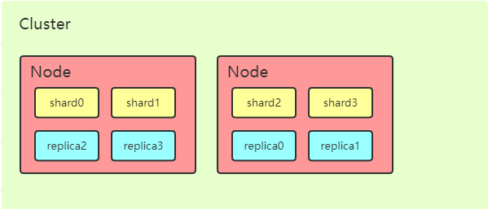

# 介绍

关于为什么使用集群我想大家都知道，要想提高系统的整体性能无外乎购买更强大的机器（也叫做 纵向扩容/垂直扩容）或则数量更多的服务器（水平扩容/横向扩容），但是我们也知道，垂直扩容是有其极限的（这是主要原因），真正的扩容能力来自于水平扩容。也就是增加机器，来分担单机的压力。同时提高系统的稳定性。

`elasticsearch`天生就是分布式的，它知道如何通过管理多节点来提高扩容性和可用性。 这也意味着你的应用无需关注这个问题。并且在设计时尽可能的屏蔽了分布式的复杂性。比如：

* 分配文档到不同的容器 或 *分片* 中，文档可以储存在一个或多个节点中
* 按集群节点来均衡分配这些分片，从而对索引和搜索过程进行负载均衡
* 复制每个分片以支持数据冗余，从而防止硬件故障导致的数据丢失
* 将集群中任一节点的请求路由到存有相关数据的节点
* 集群扩容时无缝整合新节点，重新分配分片以便从离群节点恢复

下文将讲述如何按需配置**集群**、**节点**和**分片**，**并在硬件故障时确保数据安全**。

在[ES基础指引](ES-guide.md)中我们做了`cluster`,`node`,`index`,`type`,`shards`,`replicas`的基本介绍，这里就不再赘述

# 集群，节点，分片，副本间的关系



一个运行中的 Elasticsearch 实例称为一个 节点，而集群是由一个或者多个拥有相同 `cluster.name` 配置的节点组成， 它们共同承担数据和负载的压力。当有节点加入集群中或者从集群中移除节点时，集群将会重新平均分布所有的数据。

当一个节点被选举成为 *主* 节点时， 它将负责管理集群范围内的所有变更，例如增加、删除索引，或者增加、删除节点等。 而主节点并不需要涉及到文档级别的变更和搜索等操作，所以当集群只拥有一个主节点的情况下，即使流量的增加它也不会成为瓶颈。 任何节点都可以成为主节点。我们的示例集群就只有一个节点，所以它同时也成为了主节点。

作为用户，我们可以将请求发送到 *集群中的任何节点* ，包括主节点。 每个节点都知道任意文档所处的位置，并且能够将我们的请求直接转发到存储我们所需文档的节点。 无论我们将请求发送到哪个节点，它都能负责从各个包含我们所需文档的节点收集回数据，并将最终结果返回給客户端。 Elasticsearch 对这一切的管理都是透明的。

# Cluster health

在进行健康检查的时候我们会用到  [`_cat` API](https://www.elastic.co/guide/en/elasticsearch/reference/6.6/cat.html)，在终端（控制台，也可以是Kibana的控制台）中运行如下命令

```js
GET /_cat/health?v
```

响应数据

```
epoch      timestamp cluster       status node.total node.data shards pri relo init 
1550130969 07:56:09  elasticsearch yellow          1         1      0   0    0    0 

unassign pending_tasks max_task_wait_time active_shards_percent
       0             0                  -                 100.0%
```

从上面的响应数据中我们能看到name = elasticsearch 的 cluster 处于 yellow 状态，下面我们就来说 status的类型

- `green` : 一切都很好（集群功能齐全）
- `yellow` : 所有数据都可用，但尚未分配一些副本（群集功能齐全）
- `red` : 某些数据由于某种原因不可用（有主分片没能正常运行）

注意：当群集为红色时，它将继续提供来自可用分片的搜索请求，但您可能需要尽快修复它，因为存在未分配的分片。

