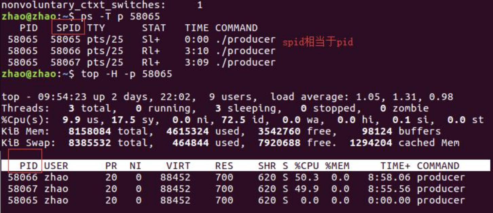

1. 周三早上看一下 类加载，垃圾收集器的东西。

2. 看redis相关的

3. 看 MQ 相关的

4. 看一下 raft

5. [看项目整理](../项目整理/币安风控决策引擎.md)

6. CAP ,BASE **down**

7. java 集合（线程安全，线程不安全的） **down**

8. 二叉树树的遍历  **down** 

9. [B树，B+树，B*树](../数据结构与算法/树/查找树.md)，R树 （R树，如何查询离你最近的酒店:https://www.csdn.net/tags/MtTaEg0sMTA1NjgtYmxvZwO0O0OO0O0O.html  ） **down**

10. [基础排序算法](../数据结构与算法/algorithm/经典排序算法.md) **down**  **明早看**

11. 线上问题定位：

    1. https://mp.weixin.qq.com/s/8YBJn8x7Sf9dai9jNkX6Tg

    2. 线上RT问题：https://mp.weixin.qq.com/s/TnLl2OW9XJLSZihcpgP7VQ

       **可以吹成自己遇到的问题，通过阿里的 Arthas 工具的 trace [类的全限定名 方法名] 确认了不是我们服务内部的问题，然后找到运维同学去确定他们那边是否调整了路由导致的问题，让他们先回滚操作，由于后续在忙业务就没有继续详细了解运维那边具体是做了什么操作导致了问题**

    3. https://mp.weixin.qq.com/s/fA860wCu9PZW3eQTwdbGWQ

12. 学习怎么定位线上 jvm，cpu问题 **down**

    可以使用top 命令查看cpu,内存等使用情况 [top命令详解](https://www.cnblogs.com/mylive/p/15162773.html) + [补充](https://blog.csdn.net/hp_yangpeng/article/details/78511051) + https://www.freesion.com/article/2262328727/

    监控进一步查询 `top -Hp pid` 可以查看进程内的线程的运行情况（动态的监控）

    也可以是使用  `ps -T -p pid`  = ` ps -Tp pid` 命令查询静态的线程信息

    

    

    这是我自己操作的截图

    

    **如果我们使用 top -p pid 进入监控界面之后使用 shift+h 也会进入到  `top -Hp pid` 页面**

    然后这时候我们就可以使用：` jstack [进程的pid] | grep -A 20 [进程中线程的pid的16进制（注意字母小写）]`

    进程id = 1 , 进程中线程的pid的16进制（注意字母小写）：12301 = 300d 

    > 可以直接使用命令： printf '%x\n' 12301 获取10进制转16进制的值
    >
    > 更多linux 进制转换：https://blog.csdn.net/blog_zxb/article/details/106402723

    输入：jstack 1|grep -A 20 300d  命令， **-A 20 是查询最近的20行记录**

    

    **有了上线的这些监控工具之后，我们在出现 cpu负载问题**的时候就可以使用 top , 然后找到cpu占用最高的，然后 ` top -p pid ` -> `shift + h`然后找到进程中 消耗cpu 最多的线程，然后再使用 ` jstack [进程的pid] | grep -A 20 [进程中线程的pid的16进制（注意字母小写）]` 查看调用栈的信息定位到方法 来定位问题

    **如果我们遇到的是OOM问题，FULL GC 问题， YGC 问题，**我们可以通过获取到的 java进程的pid，使用 jmap  这样的命令查询当前的内存使用情况，结合我们配置的jvm 打印的垃圾收集信息就能定位出问题

    * YGC : https://cloud.tencent.com/developer/article/1911986?areaSource=102001.8&traceId=OhSv0kOfpha5s4hyrKLbY

    * YGC : https://blog.csdn.net/qq_21078159/article/details/131806233

    * YGC ：https://mp.weixin.qq.com/s/LRx9tLtx1tficWPvUWUTuQ

      补充一下该文中，在排查的时候忘记看GC日志了，如果看了该日志可以很快的知道在哪些步骤耗时较长，同时结合surviver 区存活对象和之前的对比，会很容易发现问题然后只需要使用jmap查看对象信息，找到根据存活对象查询代码看问题来定位问题

    * https://mp.weixin.qq.com/s/P8s3kuceBNovUP5adXpFCQ

    * https://mp.weixin.qq.com/s/yutHXOi6Xl3-Qn91Pvg9wA

    * https://mp.weixin.qq.com/s/7XGD-Z3wrThv5HyoK3B8AQ

    工具,基础知识问题：

    * [JVM性能监控&故障处理工具](../java/JVM/JVM性能监控&故障处理工具.md)
    * [JVM/垃圾收集算法&收集器](../java/JVM/垃圾收集算法&收集器.md)

13. spring 

    https://github.com/AobingJava/JavaFamily

    1. bean的生命周期

       初始化 bean（使用bean构造器） -> 注入属性 （会遇到循环依赖问题） -> 处理该bean实现的 aware接口逻辑 -> BeanPostProcesser.postProcessBeforeInitialization() -> @PostConstruct标记的方法 ->InitiallizingBean.afterPropertiseSet()  ->  <bean> 配置指定的init-method ->BeanPostProcesser.postProcessAfterInitialization() -> 容器初始化成功之后，bean使用 ->

       容器销毁的时候。调用 @PreDestroy标记的方法 -> DisposableBean.destory() -> <bean> 指定的 destroy-method 方法

       

    2. 循环依赖问题

       循环依赖问题很好理解 B依赖A,A依赖B,甚至更长的循环依赖链条，解决的方式也很简单，在进行简单的初始化（不带参数的构造方法），拿到实例之后，放入一个缓存中simpleBeanMap，在走到设置属性的时候发现设置一个bean,如果判断bean在simpleBeanMap中找不到，那就走B的生成逻辑，然后将B的简单实例放入simpleBeanMap，然后给B设置数据A的时候发现simpleBeanMap中已经有了，就可以直接设置进去了；然后B处理完成，继续走A的设置属性逻辑将B设置设置到A.就完成了循环依赖的数据设置。处理完成的bean最后放到的我们的工厂的最终缓存中**当然这个是有前提的那就是A,B都是单例的。还有就是无法用构造方法完成循环依赖的处理** ，spring的实现和我上面说的是差不多的，不过spring 中由于Bean 的初始化会涉及到很多流程比如AOP，所以代码会复杂很多，但是本质没变，感兴趣可以看看 https://blog.csdn.net/weixin_44129618/article/details/122839774 里面指出了spring 中作为中间缓存的simpleBeanMap是啥，还有图会更容易理解

14. [设计模式 ](../设计模式/设计模式.md) **down** 明早看

11. [sentinel 以及它的滑动窗口算法，限流算法](../分布式/限流降级熔断/sentinel.md) **down**

12. Tcp/Ip , http

13. [cookie ，session ,token](https://www.zhantian9.com/111269.html)·

    https://www.zhantian9.com/111269.html

    1. **cookie** : 早期用来保存用户状态的一个标识，服务端生成发送给浏览器，浏览器把cookie以kv的形式保存到某个目录下的文本文件内，下次请求同一网站时会把该cookie加到请求头里发送给服务器。由于数据是保存在客户端的

       https://blog.csdn.net/u013982161/article/details/55005542

       请求的时候浏览器发现是同一个网站的请求会自动将保存的cookie 带到请求中（**很明显能看出的是 cookie 是区分域名的，所以会有跨域问题**），就有利用该特点实现的 [cookie跨站点伪造攻击(CSRF)](https://blog.csdn.net/nnmmbb/article/details/106137473?spm=1001.2101.3001.6650.1&utm_medium=distribute.pc_relevant.none-task-blog-2%7Edefault%7ECTRLIST%7ERate-1.pc_relevant_paycolumn_v3&depth_1-utm_source=distribute.pc_relevant.none-task-blog-2%7Edefault%7ECTRLIST%7ERate-1.pc_relevant_paycolumn_v3&utm_relevant_index=2)

       Cookie 可以用来保存浏览网站的用户的信息标识，或则其他用户信息（**不建议保存敏感信息：比如手机号，密码等，因为网络中的调用都有可能在传输中被劫持获取的，这也是为什么有https出现的原因, 就算使用https ，cookie 由于是将一些信息存在客户端的还是会有被本地篡改的风险 **）

       **为了降低请求的包的大小，所以对 cookie 有大小限制一半不超过4k**

    2. **session** 和 cookie 不同，**他是在服务端生成，然后信息也保存在服务端，这样就不会有 cookie 的信息量限制4k 的问题，并且这些信息都保存在服务端也不会存在篡改问题，安全性得到了提升**

       不过 session是依赖 cookie 的，因为需要将sesseionId 保存在 cookie中，然后在请求的时候携带web server

       当然除了使用 cookie 保存sessionId之外，也可以使用其他方式（**所以session的使用可以不被客户端禁用cookie影响**）

       1. URL重写，就是把session id直接附加在URL路径的后面。
       2. 还有一种技术叫做**表单隐藏字段**。就是服务器会自动修改表单，添加一个隐藏字段，以便在表单提交时能够把session id传递回服务器

       **session Id 因为也保存在客户端，它也还是有被黑客截获的风险，如果https 那么这个风险基本不存在，因为这还能暴力破解加密数据了**

       **由于session 通常是保存在服务端的内存中，如果用户量很大会给内存造成压力，其次如果是分布式系统，我们还需要将session 信息才用一个集中存储保存起来，避免会话丢失问题（因为就算把请求都路由到一台机器，但是如果这台机器挂了呢？初次之外还有可能造成请求分配不均问题，如果某一些分配到同一台机器的回话请求很频繁，那么这时候负载均衡的效果就很差了）**

    3. **token：**和session 其实类似，不过如果使用token ,我们可以把信息对称加密存放到token中，这样服务端就不需要像session一般存储用户相关信息了，这样可以极大的解约存储

       

       **token 存在和 session 一样的被截获的问题，同理是可以使用https来处理的。**

       

       **token 可以解决跨域问题，当然session id 唯一 ，然后 session 集中存储也是可以解决跨域问题的**

       

       **可以避免CSRF(跨站点伪造攻击问题)**

       

       **token 是无状态的可以在多个服务器间共享，session 集中存储也能做到**

       

       **支持单点登录，我们对session 做一定的改造也就能支持，但是拿就类似token了**

       

       ***易于扩展，在移动端原生请求是没有 cookie 之说的，而 sessionid 依赖于 cookie，sessionid 就不能用 cookie 来传了，如果用 token 的话，由于它是随着 header 的 authoriize 传过来的，也就不存在此问题，换句话说token 天生支持移动平台，可扩展性好***

       

       **基于token可以方便未来扩展实现 Oauth 2.0 协议，支持三方访问自身服务的资源**

       

       缺点：

       - token 太长了：token 是 header, payload 编码后的样式，所以一般要比 sessionId 长很多，很有可能超出 cookie 的大小限制（cookie 一般有大小限制的，如 4kb），如果你在 token 中存储的信息越长，那么 token 本身也会越长，这样的话由于你每次请求都会带上 token，对请求来是个不小的负担
       - 不太安全：网上很多文章说 token 更安全，其实不然，细心的你可能发现了，我们说 token 是存在浏览器的，再细问，存在浏览器的哪里？既然它太长放在 cookie 里可能导致 cookie 超限，那就只好放在 local storage 里，这样会造成安全隐患，因为 local storage 这类的本地存储是可以被 JS 直接读取的，另外由上文也提到，token 一旦生成无法让其失效，必须等到其过期才行，这样的话如果服务端检测到了一个安全威胁，也无法使相关的 token 失效。

       总结一下 token ,session 都不是绝对安全的，如果针对请求响应在传输中被截获的问题，需要使用https来完成

       **如果为了防止黑产编写自动化工具，那么使用token+https 都是无法解决的，我们需要的自己设计一套协议，对请求和响应做校验，比如请求的时候对request,参数加密，然后放在请求头中的一个自定义协议头中，然后再服务端对请求参数加密之后对比数据，客户端需要对加密密钥做混淆避免被黑产很容易的获取到（如果你问为什么不用非对称。因为这两个都是一样的问题，但是对称性能更好）**

    4. **Token 和 Session 的区别**

       token和session其实都是为了身份验证，session一般翻译为会话，而token更多的时候是翻译为令牌；session和token都是有过期时间一说，都需要去管理过期时间；

       - 其实token与session的问题是一种时间与空间的博弈问题，session是空间换时间，而token是时间换空间。两者的选择要看具体情况而定。虽然确实都是“客户端记录，每次访问携带”，但 token 很容易设计为自包含的，也就是说，后端不需要记录什么东西，每次一个无状态请求，每次解密验证，每次当场得出合法 /非法的结论。这一切判断依据，除了固化在 CS 两端的一些逻辑之外，整个信息是自包含的。这才是真正的无状态。而 sessionid ，一般都是一段随机字符串，需要到后端去检索 id 的有效性。万一服务器重启导致内存里的 session 没了呢？万一 redis 服务器挂了呢？

         **当然最好采用token的设计方案，可以方便未来扩展实现 Oauth 2.0 协议，支持三方访问自身服务的资源**

       - **易于扩展，在移动端原生请求是没有 cookie 之说的，session 再app端是没有支持的，如果用 token 的话，由于它是随着 header 的 authoriize 传过来的，也就不存在此问题，换句话说token 天生支持移动平台，可扩展性好**

       - 所谓 Session 认证只是简单的把 User 信息存储到 Session 里，**因为 SessionID 的不可预测性，暂且认为是安全的**。而 Token ，如果指的是 OAuth Token 或类似的机制的话，提供的是 认证 和 授权 ，认证是针对用户，授权是针对 App 。其目的是让某 App 有权利访问某用户的信息。这里的 Token 是唯一的。不可以转移到其它 App上，也不可以转到其它用户上。Session 只提供一种简单的认证，即只要有此 SessionID ，即认为有此 User 的全部权利。是需要严格保密的，这个数据应该只保存在站方，不应该共享给其它网站或者第三方 App。所以简单来说：**如果你的用户数据可能需要和第三方共享，或者允许第三方调用 API 接口，用 Token 。如果永远只是自己的网站，自己的 App，用什么就无所谓了。**

14. [分布式事务](../分布式/分布式事务解决方案.md) 明天看

15. 复习一下AQS相关

16. 准备英文的简单自我介绍以及简单沟通 **down**

17. Oauth2.0 

    1. https://baike.baidu.com/item/OAuth2.0/6788617?fr=aladdin
    2. https://developers.weixin.qq.com/doc/oplatform/Mobile_App/WeChat_Login/Development_Guide.html

18. 凯东发的面试题

    1. 分布式锁 包括redis 锁。 **down**

    2. 线程池，线程池拒绝策略，如果线程池中的线程执行过慢怎么办 **down**

    3. 讲一讲java的GC **down**

    4. 从JVM和操作系统聊一聊java的锁  **down**

    5. redis持久机制 RDB , ROF  **down**

    6. NIO，select poll epoll区别 **down**

    7. 如何实现LRU  **down**

    8. 设计模式   **down**

    9. spring bean 的生命周期

    11. kafka **down**

        1. [高性能机制](../MQ/Kafka.md)

        2. 一个topic突然加入一个消费者，导致其他消费都变慢了，是什么情况？

           [触发了 rebalance。协调期间对性能会有影响](../MQ/Kafka.md) 的consumer group 中有讲到 rebalanc过程

    12. R树，如何查询离你最近的酒店  **down**

    13. [递归构造menu](https://blog.csdn.net/qq_45100361/article/details/112388635)

19. api 和 spi 的区别

    API （Application Programming Interface）

    - 大多数情况下，都是**实现方**来制定接口并完成对接口的不同实现，**调用方**仅仅依赖却无权选择不同实现。

    SPI (Service Provider Interface)

    - 而如果是**调用方**来制定接口，**实现方**来针对接口来实现不同的实现。**调用方**来选择自己需要的实现方。

20. 什么是并发安全？

    看笔记

21. [操作系统调度算法](https://mp.weixin.qq.com/s/B9MVq1617YgtgBtwvhVg-Q)

    1. Cpu 时间片是基于抢占式 + 优先级

22. 弹性扩容，如果突发100倍流量怎么处理（下单的流量需要都接下来）

    需要做更细粒度的分片，比如对单个股票/虚拟币，以这个业务为度就是可以实现分片的，然后分片是一个集群（选主节点出来，从节点只保存数据），然后数据在主节点的内存中进行撮合，撮合成功之后丢入到一个高性能的 内存队列当中 Disruptor 框架 https://zhuanlan.zhihu.com/p/148441085 ，当主节点挂掉的时候，从节点选举出来，作为主节点提供服务

    调用方怎么感知这个主节点的变化呢？调用方 client 调用的时候选择它里面标识为主节点的地址做请求，请求失败他就尝试请求其他从节点。从节点的给到client 当前的集群信息其中包含了主节点的信息，client 更新自己本地的主节点的请求地址等信息，然后向新的主节点发起请求，也就是说调用方一开始是不知道哪台机器是主节点，而是它随机访问一台，被访问的机器告诉client当前的集群的状况，然后只有主节点可以处理业务，从节点直接返回当前的集群状况

    一台机器128G的内存足以处理 10亿级别的交易撮合，所以可以很容易的进行交易的撮合处理，如果需要实现弹性扩容，那么可以一开始进行板块纬度的分片，然后板块中的调用量加大之后 , 怎么做到动态扩容呢？

    可以扩容机器的时候先同步数据但是不作为真实可用的集群，等数据基本同步一致之后，再让新的集群生效，这样用户的请求可以直接切到新的机器，怎么解决撮合的单子可能是多个的问题呢？在持久化存储，在后续的处理中只处理相同orderId的一条数据，先处理先完成，相当于做了幂等

23. BIO , NIO 区别

    1. NIO的多路复用IO基于事件模型的，他可以一次监听多个链接时间（accpt），但是BIO 是一个accpt 需要等待另一个accept 的
    2. 我们可以对selector : service channel 的监听事件做1对多的方式（每个selector 监听100个链接，甚至还能对读写时间做再拆分），然后实现降低线程数的目标，因为cpu在这个场景并不是性能瓶颈，这样做可以一定程度的缩减我们的线程数量，避免服务端的线程数被耗光
    3. 同步IO本质还是阻塞的，因为就算是NIO 它还是需要忙寻等待数据就绪，然后后续的读写数据也都是阻塞的, 这个说的非阻塞只是说不需要登录态IO的链接建立/数据就绪，可以先直接返回，在后续忙寻中去检查
    4. 使用多路复用IO 一次可以监听多个连接的事件意味着他可以见减少很多的系统调用（多个文件描述符只有一次 select 的系统调用 + n 次就绪状态的文件描述符的 read 系统调用） ，BIO 每个连接都是一次就绪的系统调用+read的系统调用

25. cpu 的load 和它的使用率 是什么？**down**

    https://www.toutiao.com/article/7092952217681920549/?app=news_article&timestamp=1651924632&use_new_style=1&req_id=202205071957120101330281550719BA2A&group_id=7092952217681920549&wxshare_count=1&tt_from=weixin&utm_source=weixin&utm_medium=toutiao_android&utm_campaign=client_share&share_token=3a5281cf-313c-4ebb-8220-dd8f5153cd94

26. 什么是吞吐量优先和停顿时间优先？ 

    https://blog.csdn.net/zfx2013/article/details/89575291

    他们关注的目标不同：

    1. 一个是系统给到用户线程更多的cpu运行时间，也就是说这种类型的目标是系统它的垃圾回收总时间占c pu的总时间越少越好

    2. 一个是系统用户线程停顿的时间尽可能短（也就是不关心总停顿时间暂用了cpu多长时间，而是关心的停顿的时间足够短不会影响用户线程的使用，避免造成用户请求的延时增加）

27. 双指针相关的算法题多看看，股票买卖时机的算法题刷一刷，

    

    最大子序和？
    
    ```
    class Solution {
    
        public int maxSubArray(int[] nums) {
            int pre = 0, maxAns = nums[0];
            for (int x : nums) {
                pre = Math.max(pre + x, x);
                maxAns = Math.max(maxAns, pre);
            }
            return maxAns;
        }
        
    }
    ```
    
    

[保障交易峰值过万TPS——某金融企业基于全闪的交易系统架构设计实践](https://blog.51cto.com/u_15127582/2759010)


沟通能力，言简意赅

把项目梳理一遍，上下游
