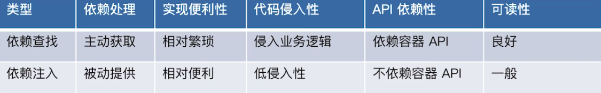
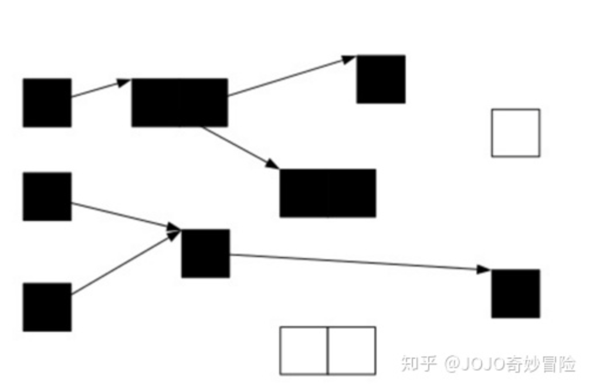
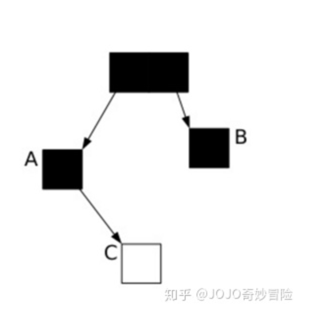
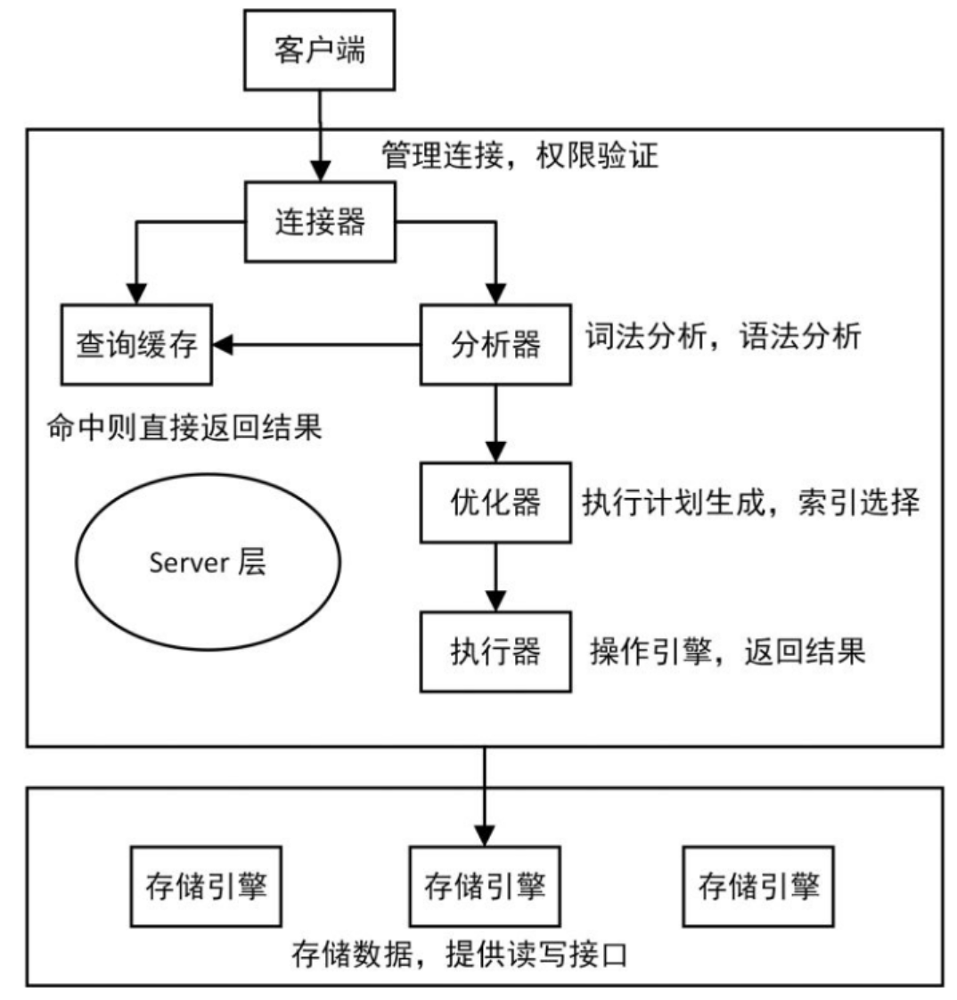
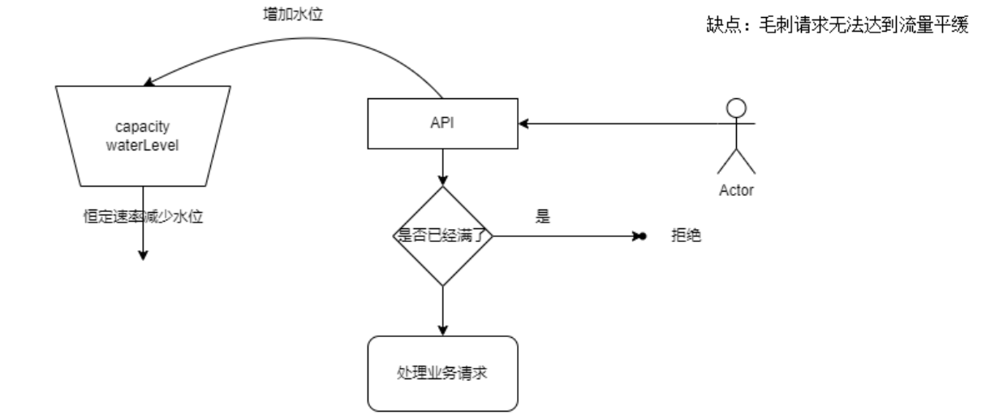
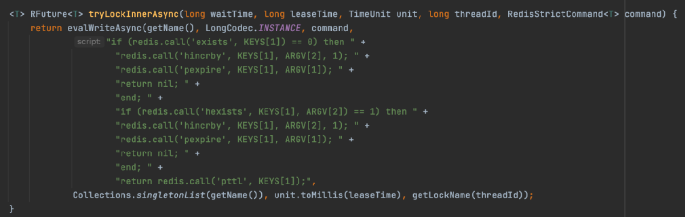

# Spring

## 什么是 spring framework?

spring  是一个被广泛运用的开源的java开发框架，它提供了一个完整的编程或配置的一个现代化的基于java的企业级应用的开发框架

它的核心要素是它提供了一个易用的编程模型，并且它具有很大的弹性（比如我们可以基于配置（XML,properties...）,也可以基于注解等等方式去使用他的IOC功能；在比如它提供了模块化支持，我们需要使用什么功能只需要引入对应依赖就好，比如jdbc,test... , 需要什么功能就可以使用对应的@EnableXXX注解开启对应功能，比如@EnableCaching,@EnableTransactionManagement,@EnableAsync等等），可以帮助你快速开发企业级java应用。

## spring framework有哪些核心模块

spring-context : 事件驱动(比如`ApplicationEvent`)、注解驱动（比如`@ConponentScan`），模块驱动（比如`@EnableCaching`）等 （**其中context模块又是依赖下面的core,beans,aop,expression，来提供这些包提供的功能**）

spring-core：Spring 基础API 模块，如资源管理，泛型处理 等

spring-beans：SpringBean 相关，如依赖查找，依赖注入

spring-aop : SpringAOP 处理，如动态代理，AOP 字节码提升 

spring-expression：Spring 表达式语言模块

## spring framework 的优势和不足？

## 什么是IOC ?

简单地说，IoC 是反转控制，主要有依赖查找 和 依赖注入实现

## 依赖查找和依赖注入的区别？

依赖查找是主动或手动的依赖查找方式（拉的动作），通常需要依赖容器或标准API 实现。而依赖注入则是手动或自动依赖绑定的方式（推的动作），无需依赖特定的容器和 API

 

## Spring 的IoC 容器有什么优势？

* 完成了典型的IoC 管理：依赖查找和依赖注入 
* AOP 抽象 
* 事务抽象 
* 事件机制 7
* SPI 扩展 
* 强大的第三方整合 
  * spring Data
    * jdbc
    * jpa
    * LDAP : [Object-Directory Mapping](https://docs.spring.io/spring-ldap/docs/current/reference/#odm).
    * redis
    * mongoDB
    * 等等
  * jms ： java jms 标准消息服务整个
  * spring messaging ： 为了整个第三方消息服务
  * oxm ： 对象和XMl的映射
  * AOP :
  * 等等
* 易测试性 

  * spring - test

## BeanFactory 与 FactoryBean

### BeanFactory

BeanFactory，以Factory结尾，表示它是一个工厂(接口)， 它负责生产和管理bean的一个工厂。在Spring中，BeanFactory是工厂的顶层接口，也是IOC容器的核心接口，因此BeanFactory中定义了**管理Bean的通用方法**，如 **getBean** 和 **containsBean** 等，它的职责包括：实例化、定位、配置应用程序中的对象及建立这些对象间的依赖。BeanFactory只是个接口，并不是IOC容器的具体实现，所以Spring容器给出了很多种实现，如 **DefaultListableBeanFactory**、**XmlBeanFactory**、**ApplicationContext**等，其中XmlBeanFactory就是常用的一个，该实现将以XML方式描述组成应用的对象及对象间的依赖关系

**他的使用场景：**

1、从Ioc容器中获取Bean(byName or byType)

2、检索Ioc容器中是否包含指定的Bean 

3、判断Bean是否为单例

```
public interface BeanFactory {
	//对FactoryBean的转义定义，因为如果使用bean的名字检索FactoryBean得到的对象是工厂生成的对象，
	//如果需要得到工厂本身，需要转义
	String FACTORY_BEAN_PREFIX = "&";

	//根据bean的名字，获取在IOC容器中得到bean实例
	Object getBean(String name) throws BeansException;

	//根据bean的名字和Class类型来得到bean实例，增加了类型安全验证机制。
	<T> T getBean(String name, @Nullable Class<T> requiredType) throws BeansException;

	Object getBean(String name, Object... args) throws BeansException;

	<T> T getBean(Class<T> requiredType) throws BeansException;

	<T> T getBean(Class<T> requiredType, Object... args) throws BeansException;

	//提供对bean的检索，看看是否在IOC容器有这个名字的bean
	boolean containsBean(String name);

	//根据bean名字得到bean实例，并同时判断这个bean是不是单例
	boolean isSingleton(String name) throws NoSuchBeanDefinitionException;

	boolean isPrototype(String name) throws NoSuchBeanDefinitionException;

	boolean isTypeMatch(String name, ResolvableType typeToMatch) throws NoSuchBeanDefinitionException;

	boolean isTypeMatch(String name, @Nullable Class<?> typeToMatch) throws NoSuchBeanDefinitionException;

	//得到bean实例的Class类型
	@Nullable
	Class<?> getType(String name) throws NoSuchBeanDefinitionException;

	//得到bean的别名，如果根据别名检索，那么其原名也会被检索出来
	String[] getAliases(String name);
}
```


### FactoryBean

https://zhuanlan.zhihu.com/p/278318209

首先FactoryBean是一个Bean，但又不仅仅是一个Bean，这样听起来矛盾，但为啥又这样说呢？其实在Spring中，所有的Bean都是由BeanFactory（也就是IOC容器）来进行管理的。但对FactoryBean而言，**这个FactoryBean不是简单的Bean，而是一个能生产或者修饰对象生成的工厂Bean,它的实现与设计模式中的工厂模式和修饰器模式类似**

### 为什么会有FactoryBean

一般情况下，Spring通过反射机制利用的class属性指定实现类实例化Bean。至于为什么会有FactoryBean？原因有两个：

1、 FactoryBean 通常是用来创建比较复杂的 bean，一般的 bean 直接用 xml 配置即可，但如果一个 bean 的创建过程中涉及到很多其他的 bean 和复杂的逻辑，用 xml 配置比较困难，这时可以考虑用 FactoryBean。**网上查到的，但是这点我不是很认可，因为能够实现编码方式创建bean的方式太多了，生命中期中的 beandefinitionRegister... @bean 等都可以实现**

2、 由于第三方库不能直接注册到spring容器，于是可以实现org.springframework.bean.factory.FactoryBean接口，然后给出自己对象的实例化代码即可。

```
public interface FactoryBean<T> {
	//从工厂中获取bean【这个方法是FactoryBean的核心】
	@Nullable
	T getObject() throws Exception;
	
	//获取Bean工厂创建的对象的类型【注意这个方法主要作用是：该方法返回的类型是在ioc容器中getbean所匹配的类型】
	@Nullable
	Class<?> getObjectType();
	
	//Bean工厂创建的对象是否是单例模式
	default boolean isSingleton() {
		return true;
	}
}
```

很多开源项目在集成 Spring 时都使用到 FactoryBean，比如 MyBatis3 提供 mybatis-spring 项目中的 org.mybatis.spring.SqlSessionFactoryBean：

```xml
<bean id="sqlSessionFactory" class="org.mybatis.spring.SqlSessionFactoryBean">
    <property name="dataSource" ref="dataSource"/>
    <!-- 自动扫描mapping.xml文件 -->
    <property name="mapperLocations" value="classpath:mapper/*.xml"></property>
</bean>
```

## spring 怎么解决的循环依赖

https://zhuanlan.zhihu.com/p/380025464

singletonObjects 一级缓存 ：放创建完成并且初始化完的对象

earlySingletonObjects 二级缓存：放创建完但未初始化完的对象

singletonFactories 三级缓存：放的是创建对象的一个lambda表达式

1. 拿bean的时候先从singletonObjects（⼀级缓存）中获取
2. 如果获取不到，并且对象正在创建中，就从earlySingletonObjects（⼆级缓存）中获取
3. 如果还是获取不到就从singletonFactories（三级缓存）中获取，然后将获取到的对象放到earlySingletonObjects（⼆级缓存）中，并且将bean对应的singletonFactories（三级缓存）清除
4. bean初始化完毕，放到singletonObjects（⼀级缓存）中，将bean对应的earlySingletonObjects（⼆级缓存）清除

## Spring 中使用了哪些设计模式？

- 工厂模式：spring中的BeanFactory就是简单工厂模式的体现，根据传入唯一的标识来获得bean对象；
- 单例模式：作用域 singleton；
- 代理模式：AOP功能的原理就使用代理模式（1、JDK动态代理。2、CGLib字节码生成技术代理。）
- 装饰器模式：依赖注入就需要使用BeanWrapper；
- 观察者模式：spring中Observer模式常用的地方是listener的实现。如ApplicationListener。
- 策略模式：Bean的实例化的时候决定采用何种方式初始化bean实例（反射或者CGLIB动态字节码生成）

## AOP 

面向切面编程, 注重对行为的增强，可以将业务逻辑和需要增强的行为进行分离，提高代码复用性和开发效率。通常用于：

* logging 日志记录
* Performance optimization 性能优化（性能统计）
* Authentication 权限（安全控制）
* Transactions 事务处理
* Error handling 错误处理（异常处理）
* Caching 缓存
* Context passing 内容传递
* Lazy loading 懒加载
* Debugging 调试
* Persistence 持久化
* source pooling 资源池
* synchronization 同步

### AOP得实现原理

下⾯就是Spring AOP的流程

1. 要想启⽤Spring AOP，配置类加上注解@EnableAspectJAutoProxy，会往spring容器注⼊⼀个 BeanPostProcessor即AnnotationAwareAspectJAutoProxyCreator ：通过 EnableAspectJAutoProxy 中的 @Import({AspectJAutoProxyRegistrar.class}) 引入的，AspectJAutoProxyRegistrar 实现了 ImportBeanDefinitionRegistrar ， 这个是spring容器启动前，bean初始化之前的扩展点，他会往容器中注入 AnnotationAwareAspectJAutoProxyCreator 的 beanDefinition, 

2. 在Bean实例化完成后（即调⽤构造函数将对象创建出来）会执⾏AnnotationAwareAspectJAutoProxyCreator#postProcessAfterInitialization（这个⽅法在⽗类AbstractAutoProxyCreator中，AnnotationAwareAspectJAutoProxyCreator并没有重写）

3. 当执⾏完成AbstractAutoProxyCreator#postProcessAfterInitialization这个⽅法会将原⽣对象变成代理代理

   对象，代理对象中写⼊了横切的逻辑 (**实现接口的使用jdk的动态代理，否则使用 cglib的动态代理**)

## Spring 事务怎么实现的/实现原理是？

基于动态代理来实现的，给配置的方法做了事务管理的相关代理。

## Spring 事务的传播行为实现原理

调用过程中通过ThreadLocal 管理事务状态信息。

> try{
> 		w1. 创建数据库链接 connection，修改autocommit = false,设置事务状态信息 TransactionInfo.newTransaction=true，以及其他的事务信息，都会存在 ThreadLocal 中... 
> 		w2. 执行对应的业务逻辑，sql等
>
> ​		如果其中调用了内部一个申明了事务的方法@Transactional 的方法 
> ​		内部方法：{
> ​	 			try{
>
> ​					i1, **判断 threadLocal 中是否有 connection ，如果有证明外层方法有事务，如果没有证明外层没有事务**。判断本方法配					置的事务传播行为:
>
> ​							**第一类 融入外层事务**：**设置事务状态信息 TransactionInfo.newTransaction=false， 记录外部事物的信息，							状态暂存，在内部执行完成之后，需要给外部threadlocal 数据做还原**
>
> ​							1, PROPAGATION_REQUIRED : 如果外层开启了事务，不会创建 connection，融入外层事务；**如果外层没有开启							事务，执行w1的逻辑，但是注意newTransaction=true，生成自己内部的 事务管理相关信息。**
>
> ​							2, PROPAGATION_SUPPORTS : 如果外层开启了事务，不会创建 connection，融入外层事务; 如果外层没有开启事							务，还是以不事务的方式执行
>
> ​							3, PROPAGATION_MANDATORY : 如果外层开启了事务，不会创建 connection，融入外层事务;如果外层没有开启							事务，抛出异常
>
> ​							**第二类 以自己为主事务为主，和外层事务无关**： **记外部事务的信息，状态暂存，在内部执行完成之后，需要给外							部threadlocal 数据做还原**
>
> ​							4, PROPAGATION_REQUIRES_NEW : 不管外部是否开启，都会执行 w1 的逻辑， 设置 newTransaction=true，这							样，内层事务就是一个独立的新事务，和外层事务隔离开。
>
> ​							5, PROPAGATION_NOT_SUPPORTED : 不管外层是否开启事务，都以非事务模式执行逻辑。
>
> ​							6, PROPAGATION_NEVER : 以非事务方式执行, 如果外围方法存在事务，则抛出异常。
>
> ​							**第三类：** 
>
> ​							7, PROPAGATION_NESTED : 如果外围方法存在事务，`Propagation.NESTED`修饰的内部方法属于外部事务的子							事务，外围主事务回滚，子事务一定回滚，而内部子事务可以单独回滚而不影响外围主事务和其他子							事务（前提是单独try-catch这个子事务,让外部的catch 逻辑捕获不到这个异常，且不设置
>
> ​							`TransactionAspectSupport.currentTransactionStatus().setRollbackOnly(); `）<br/>
>
> ​							如果外围方法没有事务，则执行与PROPAGATION_REQUIRED类似的效果。
>
> ​					i2, 执行对应的业务逻辑，sql等
>
> 
>
> ​	 			}catch{
>
> ​					**如果发生异常:** 
>
> ​					**第一类：还原外部事物的 threadlocal 中的事务信息，标记需要回滚，抛出异常，外部执行回滚操作**
>
> ​					**第二类：**
>
> ​					PROPAGATION_REQUIRES_NEW : 内外独立，所以内部单独回滚自己内部的事务,  还原外部事物的 threadlocal 中的					事务信息即可；
>
> ​					PROPAGATION_NOT_SUPPORTED : 内部以非事务方式执行，也就是说这里什么也不许需要做。还原外部事物的 					threadlocal 中的事务信息即可；
>
> ​					PROPAGATION_NEVER : 以非事务方式执行, 如果外围方法存在事务，则抛出异常。也就是说这里什么也不许需要做。外					部也不存在事务，因为如果存在事务在之前就抛出异常给外部了
>
> ​					**第三类**
>
> ​					PROPAGATION_NESTED :  回滚事务，然后将异常向外抛出； 还原外部事物的 threadlocal 中的事务信息（如果外部存					在事务，那么将内部的 conection 给绑定到外部事务信息的内层的事务链接管理列表中。如果外层没有则什么都不					做。）							
>
> ​					return;
>
> ​				 }
>
> ​				**执行完之后：判断 TransactionInfo.newTransaction= true  判断 TransactionAspectSupport.currentTransactionStatus().setRollbackOnly() 如果是 true, 回滚所有事务（当前事务以及内部的 PROPAGATION_NESTED 标记的子事务 ），如果不是 则提交事务。。（第一类融入的。设置这个值未false.也就				是事务的提交会交还给外部事务管理）**
>
> ​				**还原外部事物的 threadlocal 中的事务信息。需要注意的是如果 是 PROPAGATION_NESTED 那么那么将内部的 				conection 给绑定到外部事务信息的内层的事务链接管理列表中, 这样当外层发现异常的时候，可以完成内外所有事务的回				滚**
>
> ​			}
>
> }catch {
>
> 
>
> }
>
> **TransactionInfo.newTransaction= true , 判断 TransactionAspectSupport.currentTransactionStatus().setRollbackOnly() 如果是 true, 回滚所有事务（当前事务以及内部的 PROPAGATION_NESTED 标记的子事务 ），如果不是 则提交事务。**


# Spring Boot

## Spring Boot 的核心注解

核心注解是@SpringBootApplication 由以下三种组成

- @SpringBootConfiguration：组合了 @Configuration 注解，实现配置文件的功能。
- @EnableAutoConfiguration：打开自动配置的功能。
- @ComponentScan：Spring组件扫描。

## Spring Boot 怎么完成自动装配的

1. @SpringBootApplication是复合注解，包含@EnableAutoConfiguration
2. @EnableAutoConfiguration会导⼊AutoConfigurationImportSelector这个类，这个类会利⽤ SpringFactoriesLoader 组件加载jar包⾥⾯ META-INF/spring.factories 配置⽂件⾥⾯填写的配置类，将这些配置类过滤⼀波后，返回全类名

```java
public String[] selectImports(AnnotationMetadata annotationMetadata) {
     // 1. 是否开启⾃动配置，默认开启
     if (!isEnabled(annotationMetadata)) {
     return NO_IMPORTS;
     }
     // 2. 从META-INF/spring-autoconfigure-metadata.properties⽂件中载⼊属性配置，后续过滤⾃动注⼊的类要⽤
     // 在spring-boot-autoconfigure-x.x.RELEASE.jar包中
     AutoConfigurationMetadata autoConfigurationMetadata =
    AutoConfigurationMetadataLoader
     .loadMetadata(this.beanClassLoader);
     // 3. 获取需要⾃动注⼊的类的全类名
     AutoConfigurationEntry autoConfigurationEntry =
    getAutoConfigurationEntry(autoConfigurationMetadata,
     annotationMetadata);
     return StringUtils.toStringArray(autoConfigurationEntry.getConfigurations());
}
```


**@Import 注解会往spring容器中注⼊所需要的Bean ， @Import注解注⼊Bean的⽅式有如下三种**

### @Import注解注⼊Bean的⽅式有如下三种

1. 基于Configuration Class

   ```java
   @Target(ElementType.TYPE)
   @Retention(RetentionPolicy.RUNTIME)
   @Import(HelloWorldConfiguration.class)
   public @interface EnableHelloWorld {
   }
   ```

   ```java
   @Configuration
   public class HelloWorldConfiguration {
    	@Bean
    	public String helloWorld() {
    		return "hello world";
    	}
   }
   ```

   **直接通过@Bean的⽅式将bean注⼊到容器**

2. 基于ImportSelector接⼝ **（import 的类实现了这个接口）**

   ```java
   @Target(ElementType.TYPE)
   @Retention(RetentionPolicy.RUNTIME)
   @Import(HelloWorldImportSelector.class)
   public @interface EnableHelloWorld {
   }
   ```

   ```java
   public class HelloWorldImportSelector implements ImportSelector {
   	@Override
    	public String[] selectImports(AnnotationMetadata importingClassMetadata) {
    		return new String[]{"com.javashitang.HelloWorldConfiguration"};
   	}
   }
   ```

   **通过ImportSelector注解返回，需要注⼊到容器中 bean 的全类名，框架帮你将bean注⼊到容器**

3. 基于 ImportBeanDefinitionRegistrar 接⼝ **（import 的类实现了这个接口）**

   ```java
   @Target(ElementType.TYPE)
   @Retention(RetentionPolicy.RUNTIME)
   @Import(HelloWorldImportBeanDefinitionRegistrar.class)
   public @interface EnableHelloWorld {
   }
   ```

   ```java
   public class HelloWorldImportBeanDefinitionRegistrar implements
   ImportBeanDefinitionRegistrar {
    	@Override
    	public void registerBeanDefinitions(AnnotationMetadata importingClassMetadata,
   	BeanDefinitionRegistry registry) {
    		AnnotatedGenericBeanDefinition beanDefinition = new
   		AnnotatedGenericBeanDefinition(HelloWorldConfiguration.class);
    		BeanDefinitionReaderUtils.registerWithGeneratedName(beanDefinition, registry);// 向容器中注册 bean definition
    	}
   }
   ```

   **⾃⼰构造BeanDefinition，然后将BeanDefinition注⼊到BeanDefinitionRegistry**

## SpringBoot常用starter都有哪些

1. spring-boot-starter-web - Web 和 RESTful 应用程序；
2. spring-boot-starter-test - 单元测试和集成测试；
3. spring-boot-starter-jdbc - 传统的 JDBC；
4. spring-boot-starter-security - 使用 SpringSecurity 进行身份验证和授权；
5. spring-boot-starter-data-jpa - 带有 Hibernate 的 Spring Data JPA；
6. spring-boot-starter-data-rest - 使用 Spring Data REST 公布简单的 REST 服务

## Spring Boot 的核心配置文件

1. Application.yml 一般用来定义单个应用级别的，如果搭配 spring-cloud-config 使用
2. Bootstrap.yml（先加载） 系统级别的一些参数配置，这些参数一般是不变的

## Spring Boot 读取配置文件的原理/怎么读取配置文件？

它是通过事件监听的方式读取配置文件。负责拂去文件的监听器：ConfigFileApplicationListener 它去读取配置文件。细节的话可以看这个类，断点执行。

**详细的过程：**

SpringBoot 在启动的时候会发布一个事件，有一个监听器会监听这样的事件来读取配置文件。

在执行run的时候会执行到一个 prepareEnviroment() 预处理环境信息。在这个方法里面会调用 listeners.enviromentPrepared()

这个方法里面会发布一个ApplicationEnviromentPreparedEvent事件。其中就有 ConfigFileApplicationListener (配置文件按监听器)， 

具体其他的监听器监听可以调试代码打断点细看。

## spring Boot 配置的优先级

**优先级高的覆盖优先级低的配置。其他不相同的配置则形成补充，也就是一个并集的概念。**

1. 当前jar包的相对路径的 config文件夹中的配置（注意是文件夹）**该文件夹和jar包同级也就是同一层**

   比如我可以在这个文件夹中创建一个 application.properties 文件，里面写上配置

   **大概就是这样一个目录层级**

   ```
   -config // 这个就是当前jar包的相对路径的 config文件夹
   	-  application.properties
   -xxx.jar
   ```

   ```
   优先级最高的是我们项目下的resource目录下的config目录中的配置 
   需要确认这个目录的配置 打成jar包后是不是在这个路径下
   ```

2. 上面这个config 文件夹下的任意文件夹中的配置，目录层级

   ```
   -config
   	-  application.properties
   	-  xxxx // 上面这个config 文件夹下的任意文件夹中的配置
   		- ....config.properties
   		- ....config.yalm
   	-  redisConfig // 上面这个config 文件夹下的任意文件夹中的配置
   		- ....config.properties
   		- ....config.yalm
   -xxx.jar
   
   ```

3. 当前jar包相对路径下的配置文件（注意不是文件夹）

   ```
   -config
   	-  application.properties
   	-  xxxx
   		- ....config.properties
   		- ....config.yalm
   	-  redisConfig
   		- ....config.properties
   		- ....config.yalm
   -xxx.jar
   -application.properties // 这个就是当前jar包相对路径下的配置文件
   ```

4. classpath 下的config文件夹 ： 也就是我们项目中的 resource 目录下的 config 文件夹
5. classpath 下的配置文件  也就是我们项目中的 resource 目录下的配置文件

## 为什么Spring Boot jar包可以直接运行？

1. SpringBoot 提供了一个maven 插件用于把程序代码打包成一个可执行的jar包

2. 这个jar 叫做Fat.jar（ jar包当中包含jar 所以就叫fat.jar） **包含了应用所依赖的所有jar包**和**SpringBoot loader 相关的类。** 都存放在 boot-lib 这个目录下。

3. 我们在执行 jave -jar 运行 jar包的时候。JVM规范指定了会去运行 jar中的META-INFO 目录下的manIfset 文件中Main-Class 指定的类。

4.  这个类叫做 org.springfranmework.boot.loader.JarLauncher. 它里面有一个Main方法，调用 launche 方法会创建一个它自定义的 LaunchedURLClassLoader  类加载器去加载 boot-lib 下面所有的依赖 。

   然后 launche 方法中会创建一个新的线程去读取  manIfset 文件中指定的 Start class 指定的类。这个类就是我们项目中所指定的配置了 @SpringBootApplication 的 Application 类的 main函数.

## Spring Boot 内置 tomcat 的启动原理

1. 当我们添加了 spring-boot-starter-web 依赖之后，SpringBoot启动的时候就会有 ServletWebServerFactoryAutoConfiguration

   这是一个servlet 自动容器配置类。它会通过@Import 导入可用的Web容器工厂.（默认 Tomcat）

   

   其中 ServletWebServerFactoryConfiguration 中的EmbeddedTomcat会使用 @ConditionalOnClass({ Servlet.class, Tomcat.class, UpgradeProtocol.class }) 判断是否装载 使用内置的tomcat相关的bean : TomcatServletWebServerFacoty

2. TomcatServletWebServerFacotry会在SpringBoot启动时被使用到。ServletWebServerApplicationContext 会调用一个 onRefresh方法，然后会去获取到被注册到 容器中的 ServletWebServerFactory 会调用它的getWebServer方法，从而启动 tomcat

## SpringBoot 如何优雅停机

spring boot 中有一个配置叫做 server.shutdown 得配置。可以配置为

```
server.shutdown=graceful// 可配置了 graceful(优雅) 和 immediate (立即)
spring.lifecycle.timeout-per-shutdown-phase=20s // 优雅停机可配置宽限期：
spring.main.register-shutdown-hook=true // 如果这个配置是false的话 优雅停机无法生效。因为这个钩子函数中才是实现优雅停机的代码
// 如果我们关闭进程的时候使用的是 kill 一个进程的话是能够触发 shutdown-hook的 ， 如果kill -9 强制停机是无法触发 shutdown-hook 功能的。
```

优雅停机：（不接受新请求）  等待所有未完成请求完成之后再停机。

立即停机（默认值）：（不接受新请求） 不会管你服务未处理完的请求是否完成返回。 

## Spring boot中使用 CORS 解决跨越问题

https://blog.csdn.net/wufaqidong1/article/details/128740498 

# java 线程池

**tomcat的线程池对原有的线程池做了修改**

https://blog.csdn.net/the_one_and_only/article/details/127825542

```java
 public boolean offer(Runnable o) {
      //we can't do any checks
        if (parent==null) {
          return super.offer(o);
        }
        //we are maxed out on threads, simply queue the object
        //核心线程数等于最大线程数时
        if (parent.getPoolSize() == parent.getMaximumPoolSize()) {
          return super.offer(o);
        }
        // 执行以及待执行的任务的个数小于当前线程数
        if (parent.getSubmittedCount()<=(parent.getPoolSize())) {
          return super.offer(o);
        }
        // 这种情况下线程池可以直接消费任务，无需放入任务队列等待，当核心线程数小于最大线程数
        // 时候,直接返回false， 就会走到原有线程创建最大线程数的逻辑。
        if (parent.getPoolSize()<parent.getMaximumPoolSize()) {
          return false;
        }
        //if we reached here, we need to add it to the queue
        return super.offer(o);
    }
```

## submit 和execute的区别

submit 包装出来的 featureTask 类会将线程执行异常吃掉。也就是说线程的异常不会被 线程池Worker捕获。只有在拿到feature调用get方法的时候会 throws 一个异常出来，所以我们在使用get方法的时候需要 try catch 然后记录该异常情况

Worker 执行 run的时候执行 run方法的逻辑代码：


而 feature 的run方法内部将异常吃掉，只有在 get方法调用的时候会走 report方法中构造返回值，这时候如果判断执行出现了异常就会将它捕获的异常throw 出来。

 


# Tomcat

https://blog.csdn.net/myyhtw/article/details/129069586

```
server.tomcat.accept-count = 100 // 默认链接队列长度，在链接满了以后能够缓存创建链接的任务的队列大小 超过则拒绝
server.tomcat.max-connections = 10000 // 默认最大活跃连接数  超过则看 acceot-count 
server.tomcat.max-threads = 200 // 默认最大线程数
server.tomcat.min-spare-threads=10 // 默认最小工作线程数
```

 **tomcat 会拒绝 最大连接数+任务等待队列数以外的请求（拒绝链接也就意味着拒绝请求）**

# Java 锁

## JUC 下面的锁都依赖于 AQS , 那么AQS依赖什么实现的呢？

volatile （保证共享内存可见: 这样就可以定义一个状态字段来管理锁状态） + cas （保证并发修改只有一个能修改成功） + fifo 队列 （管理线程的执行顺序）

比如 ReetrantLock 的公平锁的获取锁的实现，CAS的方式尝试获取锁，如果失败则会被放入FIFO的队列中，同时会在 AQS的代码中自旋尝试（其中可能会被park等待，避免无谓的自旋消耗系统资源。等到他前面的节点获取到锁并且释放锁之后会唤醒它的）。

```java
/**
     * Fair version of tryAcquire.  Don't grant access unless
     * recursive call or no waiters or is first.
     */
    protected final boolean tryAcquire(int acquires) {
        final Thread current = Thread.currentThread();
        int c = getState();
        if (c == 0) {
            // hasQueuedPredecessors 判断锁的等待队列中是否有在等待的线程节点存在，如果有那就直接获取锁失败，会在AQS中被加入到等待队列的尾部，具体的就是AQS的acquire方法，反之，可以尝试使用CAS来修改state，修改成功就获取锁成功，设置该同步器的独占线程为当前线程，失败证明这时候存在竞争，并且当前线程竞争失败了。
            if (!hasQueuedPredecessors() &&
                compareAndSetState(0, acquires)) { //CAS的方式
                setExclusiveOwnerThread(current);
                return true;
            }
        }
        else if (current == getExclusiveOwnerThread()) {// 这部代码实现了支持可重入
            int nextc = c + acquires;
            if (nextc < 0)
                throw new Error("Maximum lock count exceeded");
            setState(nextc);
            return true;
        }
        return false;
    }
```

## synchronized的实现方式

java在编译成字节码时候，在临界区的前后加了 monitorenter 指令（类比 lock方法），在退出/异常退出的时候添加了 monitorexit指令 （类比 unlock() / release() 方法）

## synchronized 偏向锁

### **为什么要引入偏向锁？**

因为经过HotSpot的作者大量的研究发现，大多数时候是不存在锁竞争的，常常是⼀个线程多次获得同⼀个锁，因此如果每次都要竞争锁会增⼤很多没有必要付出的代价，为了降低获取锁的代价，才引⼊的偏向锁。

### **偏向锁原理和升级过程**

当线程1访问代码块并获取锁对象时，会在java对象头和栈帧中记录偏向的锁的threadID，因为**偏向锁不会主动释放锁**，因此以后线程1再次获取锁的时候，需要**比较当前线程的 threadID 和 Java象头中的 threadID是否⼀致**，如果⼀致（还是线程1获取锁对象），则无需使用CAS来加锁、解锁；

如果不⼀致（其他线程，如线程2要竞争锁对象，而偏向锁不会主动释放因此还是存储的线程1的threadID），那么**需要查看Java 对象头中记录的线程 1 是否存活**，如果没有存活，那么锁对象被重置为无锁状态，其它线程（线程2）可以竞争将其设置为偏向锁；

如果存活，那么立刻**查找该线程（线程1）的栈帧信息，如果还是需要继续持有这个锁对象**，那么暂停当前线程1，撤销偏向锁，升级为轻量级锁，如果线程1 不再使用该锁对象，那么将锁对象状态设为无锁状态，重新偏向新的线程

## synchronized 轻量级锁

### 为什么要引入轻量级锁？

**轻量级锁考虑的是竞争锁对象的线程不多，而且线程持有锁的时间也不长的情景**。因为**阻塞线程需要CPU从用户态转到内核态，代价较大，如果刚刚阻塞不久这个锁就被释放了，那这个代价就有点得不偿失了**，因此这个时候就干**脆不阻塞这个线程，让它自旋这等待锁释放**。

### 轻量级锁加锁

java线程在执行同步块之前，JVM会先在当前线程的这一**栈帧中**创建用于**存储锁记录的空间**，并且将对象（锁）的**对象头中的mark word数据**复制到这部分**锁记录空间中**，然后线程尝试使用 CAS将对象头的mark word 中的数据替换为指向锁记录的指针，如果成功，当前线程获取到了锁，如果失败表示其他线程竞争锁，当前线程会尝试使用自旋操作执行CAS尝试获取锁。

1. 如果在自旋尝试过程中获取到了锁（也就是之获得锁的线程执行完成或其他情况，释放了锁）那就执行线程的逻辑，如果多次尝试之后失败（也就是说这里的竞争比较激励），为了避免无用的自旋操作，会将锁升级重量级锁（这时会修改对象的对象头中的锁标志为重量锁标志 `10`）
2. **或者在线程 1执行中, 2在自选等待，这时候又 3 线程过来竞争这个锁对象，这也会导致锁升级** 

## ReentrantLock与synchronized区别

1. ReentrantLock 是java代码层的实现， synchronized JVM层的实现
2. synchronized 之支持非公平锁的实现，ReentrantLock 默认非公平锁，但是也可创建公平锁。
3. ReentrantLock 可以trayLock() 尝试获取锁快速返回（这个其实是 Lock接口规定的）； synchronized 不支持
4. synchronized 不可被中断。ReentrantLock 是有支持响应中断的获取锁的方法的（Lock接口规定的）
5. ReentrantLock可以通过接口获取当前的锁状态。synchronized 没有代码支持获取它的锁状态
6. ReentrantLock 可以创建多个 condition 获得多个等待队列（比如在 ArrayBlockingQueue中的应用）。 synchronized 实现只有一个等待队列

## synchronized 与 volatile 的区别

synchronized 的加锁可以保证临界区的数据全部从内存中读取最新的, volatile 的读也具有相同的内存语义

synchronized 的锁释放可以保证临界区的数据全部写回到内存, volatile 的写也具有相同的内存语义

但是 volatile 不具备让临界区的逻辑执行是有序的。这也就无法避免并发安全问题。

## synchronized 与 lock的区别

在 ReentrantLock与synchronized区别 中有提到

Lock 接口定义了许多synchronized 不存在的功能，比如 

1. tryLock() 非阻塞的尝试获取锁的方法
2. 比如响应中断的 lockkInterruptibly() 方法
3. 再比如 指定超时时间的 尝试获取锁的方法

## 什么是死锁？如何避免死锁

简单来说，死锁问题的产生是由两个或者以上线程并行执行的时候，争夺资源而互相等待造成的。 死锁只有同时满足互斥、持有并等待、不可剥夺、环路等待这四个条件的时候才会发生。 所以要避免死锁问题，**就是要破坏其中一个条件即可，最常用的方法就是使用资源有序分配法来破坏环路等待条件**

## 可重入锁的有什么好处

可以避免死锁, 看下面这个场景，可以看到线程在获取锁A之后 A 还没释放，当前线程在此获取锁A, 由于锁没有被释放获取不到锁，也就执行不下去了。但是锁的释放是需要流程能够继续执行下去才可以了的。这就自己个自己抢锁自己了，形成死锁了。

但是如果 A 是可重入的，这时候 在再次获取锁A的时候判断A锁是当前锁持有的，只需要增加A锁的重入次数即可。需要注意的是可重入解锁也需要根据获取锁的次数对应的调用多次解锁的方法。

```
lock(A)
.....
lock(A)
......
unlock(A)
unlock(A)
```

# ThreadLocal使用注意事项

ThreadLocal如果使用不当会造成如下问题

1. 脏数据
2. 内存泄露

## **脏数据**

线程复用会造成脏数据。由于线程池会复用Thread对象，因此Thread类的成员变量threadLocals也会被复用。如果在线程的run()方法不显示调用remove()清理与线程相关的ThreadLocal信息，并且下⼀个线程不调用 set() 设置初始值，就可能get()到上个线程设置的值

## 内存泄露

```java
// WeakReference<ThreadLocal> 意味着 ThreadLocal会被弱引用持有，任何一次gc都可能回收它（如果它的内存区在这次gc回收的区域）
static class Entry extends WeakReference<ThreadLocal> {
    /** The value associated with this ThreadLocal. */
    Object value;

    Entry(ThreadLocal k, Object v) {
        super(k);
        value = v;
    }
}
```

ThreadLocalMap使用 ThreadLocal 的弱引用作为key，如果⼀个ThreadLocal没有外部强引用来引用它，那么系统GC 的时候，这个ThreadLocal势必会被回收，这样⼀来，ThreadLocalMap中就会出现key为null的Entry，就没有办法访问这些key为null的Entry的value，如果当前线程再迟迟不结束的话，这些key为null的Entry的value就会⼀直存在⼀条强引用链：**Thread Ref -> Thread -> ThreaLocalMap -> Entry -> value**永远无法回收，造成内存泄漏。因为 key是 null了，这时候就算调用 set 也没法重新修改这块内存了。不过 ThreadLocal 的 set, get, remove 方法都有清楚这些 key = null 的数据。不过因为内存已经泄露了。如果调用不及时，还是可能给内存的管理带来麻烦。

**所以最好的方式的，使用完成之后 嗲用 remove 避免这样的问题产生**

# JVM

JVM有2个特别有意思的特性，**语言无关性**和**平台无关性**。

**语言无关性是指**: 实现了Java虚拟机规范的语言对可以在JVM上运行，如 Groovy，和在大数据领域比较火的语言Scala，因为JVM最终运行的是class⽂件，只要最终的class文件复合规范就可以在JVM上运⾏。

**平台无关性是指：**安装在不同平台的JVM会把class文件解释为本地的机器指令，从而实现 Write Once，RunAnywhere

## gc roots

1. 虚拟机栈（栈帧中的本地变量表）中引用的对象
2. 本地方法栈中JNI（Native⽅法）引用的对象
3. 类静态属性引用的对象 
4. 常量引用的对象
5. 被Synchronized锁持有的对象
6. 存在跨代引用的对象 （在年轻代回收中，为了避免扫描所有的内存，所以会标记被old区跨代引用的对象）

## 卡表

**分代收集中在单独做年轻代回收的时候**：我们知道垃圾回收都会做可达性分析。由于可能存在跨代引用（老年代引用年轻代）为了避免扫描老年代的对象，所以才有了这个卡表

这个结构可以类比一个 map 结构：标识年轻代的对象是否存在跨代引用。如果存在则对应的值为1；不存在为0；这样就不需要扫描老年代了；

实现方式是一个写屏障：在做内存引用赋值操作的时候都会都这样一个屏障（类似AOP的一个实现），会插入一个代码，检查这个内存是否是年轻代的，如果是则检查被赋值的对象是不是老年代的如果也是的化，就会将 卡表中对应的这个内存的值设置为1；	

## 三色标记法

不管是我们 G1 ，还是CMS **在并发标记阶段，都是使用的一个叫做三色标记算法来完成的。**

**黑色**:根对象，或者该对象与它的子对象都被扫描

**灰色**:对象本身被扫描,但还没扫描完该对象中的子对象

**白色**:未被扫描对象，扫描完成所有对象之后，最终为白色的为不可达对象，即垃圾对象

当GC开始扫描对象时，按照如下图步骤进行对象的扫描：

**根对象被置为黑色，子对象被置为灰色。**

**继续由灰色遍历,将已扫描了子对象的对象置为黑色。**


遍历了所有可达的对象后，所有可达的对象都变成了黑色。不可达的对象即为白色，需要被清理。



这看起来很美好，但是并发标记阶段应用程序也在运行，那么对象的指针就有可能改变。这样的话，我们就会遇到一个问题：对象丢失问题

我们看下面一种情况，当垃圾收集器扫描到下面情况时：


这时候应用程序执行了以下代码操作：

```
A.c = C 
B.c = null
```

这样，对象的状态图变成如下情形：


这时候垃圾收集器再标记扫描的时候就会下图成这样：



很显然，此时C是白色，被认为是垃圾需要清理掉，显然这是不合理的。那么我们如何保证应用程序在运行的时候，GC标记的对象不丢失呢？

CMS采用的是**增量更新（Incremental update）**，**只要在写屏障（write barrier）里/正常解释执行的代码的引用赋值部分，如果发现有一个白对象的引用被赋值到一个黑对象的字段里，那就把这个白对象变成灰色的。即插入的时候记录下来。**

在G1中，使用的是STAB（snapshot-at-the-beginning **原始快照**）的方式处理的，它其实是在引用被删除的时候的处理逻辑，也就是上文中 B.c = null 这个代码执行的时候会做特殊处理。这也可以简化理解为， ⽆论引用关系删除与否， 都会按照刚刚开始扫描那⼀刻的对象图快照来进行搜索（**也就是A,B会被重新扫描一遍**）

## 聊一下你对GC的理解

GC 是java中帮助我们程序对使用完成后无用的内存的回收的一种功能。通过可达性分析方法可以分析得出哪些内存是任然被使用的，哪些内存未被使用可被回收。在回收的这些内存的时候我们又有标记清除算法，标记整理算法，复制算法，以及分代收集算法等等垃圾收集算法。在JVM中也有很多对应算法的垃圾回收器实现。目前主流的是使用 G1（Grabage First） 垃圾垃圾回收器. 该收集器可以设置一个最大回收时间（STW时间），它会将回收时间控制在这个范围内，如果需要回收的内存过大超出这个时间，它会分多次回收。同时该回收器采用了分代收集加复制算法完成垃圾回收，G1 会将内存区域分成若干Region，这些Region 分别代表了Eden, survivor ,old, humongous 。内存会先分配到Eden的TLAB内存区域，如果如果TLAB（线程的本地分配缓冲区） 无法分配，则会分配到Eden其他区域（这里会有多线程并发的问题，会有一个锁的方式来完成内存分配），如果还是无法完成分配，就会在Old区域进行分配。当然如果一个对象的大小超过 Old区域的一半，则会直接在 Humongous 上分配。如果一个Humongous 内存不够，那么会寻找连续的Humongous分区来分配，**这时候还找不到的会触发Full GC 了。**

> 所以我们要避免在系统中使用到大对象

通常G1 是分为 Young Gc  和 Mix GC. Young GC 主要是对 Eden 和 Survivor 区域进行回收，回收的时候如果Survivor 内存不够存下回收后还存活的对象，那么部分对象会进入到Old. 

MIx GC 主要是是对所有区域的回收。他会在内存占用达到-XX:InitiatingHeapOccupancyPercent（默认45%）时，即，当使用内存占到堆总大小的45%的时候，G1将开始并发标记阶段 + Mixed GC。当全局并发标记结束后，统计出所有可能被回收的垃圾占Heap的比例值，如果超过5%（-XX:G1HeapWastePercent默认值5%），就会触发多轮Mixed GC. G1 会保证每次回收最值得回收的region（能回收更多空间的region）以及保证每次回收的时间控制在配置中的   -XX:MaxGCPauseMills 配置最大停顿时间之内。

**在极端情况下如果这两种回收发生后内存还是不够用，那么会发生full gc**的时候会使用 **serial old GC** 来完成垃圾回收，该回收器是一个单线程的**采用标记整理算法完成**垃圾回收的回收器，回收过程停顿时间会比较长，导致应用长时间无法做出响应。所以我们需要尽量避免触发full gc.


**G1 触发YounGc 的时机**

Eden区的大小范围 = [ -XX:G1NewSizePercent, -XX:G1MaxNewSizePercent ] = [ 整堆5%, 整堆60% ]
在[ 整堆5%, 整堆60% ]的基础上，G1会计算下现在Eden区回收大概要多久时间，如果回收时间远远小于参数-XX:MaxGCPauseMills设定的值（默认200ms），那么增加年轻代的region，继续给新对象存放，不会马上做YoungGC。
G1计算回收时间接近参数-XX:MaxGCPauseMills设定的值，那么就会触发YoungGC。

**Mixed GC触发条件**
1）当达到-XX:InitiatingHeapOccupancyPercent（默认45%）时，即，当使用内存占到堆总大小的45%的时候，G1将开始并发标记阶段 + Mixed GC。
2）当全局并发标记结束后，统计出所有可能被回收的垃圾占Heap的比例值，如果超过5%（-XX:G1HeapWastePercent默认值5%），就会触发多轮Mixed GC


# JMM

结构模型的逻辑关系：


https://blog.csdn.net/qq_44778109/article/details/107699665

# Maven 

## Scope 作用


## Scope 依赖传递关系


# 进程线程之间的关系

1. 一个进程可以有多个线程，但至少有一个线程；而一个线程只能在一个进程的地址空间内活动。
2. 资源分配给进程，同一个进程的所有线程共享该进程所有资源。
3. CPU分配给线程，即真正在处理器运行的是线程。
4. 线程在执行过程中需要协作同步，不同/相同进程的线程间要利用消息通信的办法实现同步。

# CAS

`CAS`compare and swap的缩写，也就是比较再替换的意思，`CAS` 操作要求三个参数：内存地址 V，旧的预期值 O，要修改的新值 N，在更新的时候，需要V这个内存地址的值和当前传递过来的参数O的值相同，才能执行修改操作，**CAS指令是一个CPU层级的原子性操作指令。 在 Intel 处理器中， 其汇编指令为 cmpxchg。**

## CAS可以做什么

有了这个操作我们可以实现无锁并发，用来解决并发编程中的部分并发安全问题,比如java中java.util.concurrent包下面得那些 原子操作类 例如 `AtomicInteger` 

CAS的思想也被我们广泛使用，以及扩展使用，不在只是存在于我们的汇编指令层面，很多涉及到一些并发的场景我们也会做类似的设计，比如不在只是局限于等于某一个值才去修改，可以变成小于 O , 甚至说是某一个数据小于某一个版本怎么做，大于某一个版本怎么处理；比如我们的 MVCC（多版本并发控制） 就是某些数据大于等于某一个版本的可见，小于的不可见，当然我不是很清楚现有CAS还是先有MVCC,不过设计思路上我任务他们很相似

> java中原子类的详细介绍请看 [JUC](JUC.md)的原子类的介绍

## CAS 操作存在的问题

* **AbA问题** ： ABA的问题指的是在CAS更新的过程中，当读取到的值是A，然后准备赋值的时候仍然是A，但是实际上有可能A的值被改成了B，然后又被改回了A，这个CAS更新的漏洞就叫做ABA。只是ABA的问题大部分场景下都不影响并发的最终效果。

  Java中有AtomicStampedReference来解决这个问题，他加入了预期标志和更新后标志两个字段，更新时不光检查值，还要检查当前的标志是否等于预期标志，全部相等的话才会更新。

  https://zhuanlan.zhihu.com/p/110301415

* **自旋循环时间长开销大**：如果使用CAS的时候采用了自旋操作，那么可能会造成性能开销问题：因为每次检查不符合预期的话自旋逻辑都会不断重试，那这个等待的时间可能会很长，CPU开销会很大

* **只能保证一个共享变量的原子操作**

## CAS java 中的函数介绍

CAS(compare and swap)，比较之后交换。这事一个现在处理器都提供的一个命令，在java中由sun.misc.Unsafe 这个工具类，提供一系列的实现（这个类在外部不能直接调用）：

* `final native boolean compareAndSwapObject(Object paramObject, long valueOffset, Object expect, Object update)`
* `final native boolean compareAndSwapObject(Object paramObject, long valueOffset, Object expect, Object update)`
* `final native boolean compareAndSwapObject(Object paramObject, long valueOffset, Object expect, Object update)`

参数都是一样的。这里我们解释一下参数的意义：

* `paramObject`: 需要操作的对象，一般都是当前对象（因为我们使用的都是jdk提供的封装类）。
* `valueOffset`：操作对象中封装的属性的内存偏移量，c++本地函数通过这个偏移量获取当前对象内存地址中具体的这个属性的内存地址
* `expect`：旧的预期的值，如果是这个值，才能修改成功
* `update`：即将更新到的值

## CAS 内部原理

* 使用上面 CAS 方法的程序，如果在多处理器（多cpu）环境运行，就会为其加上 lock 前缀，带有这个前缀的该cas指令在现代的处理器中会使用缓存锁定并且搭配缓存一致性协议来保证这个变量的执行的原子性。
* 该指令的前后的读/写指令会被禁止重排序。
* 执行之后会将该写缓冲区的所有数据刷新到主内存。

# 网络

详解网络以及 tcp id , udp : http://www.52im.net/topic-tcpipvol1.html

## 网络多层模型（五层，七层）

**主要记一些 五层就好了, 其次是我们常见的 tcp/ip , udp 这是传输层的协议, http, https 这是应用层协议 **
**五层协议 （5层）**：物理层、数据链路层、网络层、运输层、 应用层。


1） **物理层：**利用传输介质为数据链路层提供物理连接，实现比特流的透明传输

2）**数据链路层：**通过各种控制协议，将有差错的物理信道变为无差错的、能可靠传输数据帧的数据链路

3）**网络层提供路由和寻址的功能**，使两终端系统能够互连且决定最佳路径，并具有一定的拥塞控制和流量控制的能力。

4）**传输层：**向用户提供可靠的端到端的差错和流量控制，保证报文的正确传输。传输层的作用是向高层屏蔽下层数据通信的细节，即向用户透明地传送报文

5）会话层：任务就是向两个实体的表示层提供建立和使用连接的方法。

6）表示层：它对来自应用层的命令和数据进行解释，对各种语法赋予相应的含义，并按照一定的格式传送给会话层

7）**应用层：**应用层为用户提供的服务和协议有：文件服务、目录服务、文件传输服务（FTP）、远程登录服务（Telnet）、电子邮件服务（E-mail）、打印服务、安全服务、网络管理服务、数据库服务等ss

## [TCP/IP](../web-introduce/tcp-ip.md)

**是一个在传输层的面向链接的可靠的字节流协议,它依赖的是网络层的 IP协议 **

### **三次握手后连接已经建立，但是客户端突然奔溃了怎么办？**

⾸先，从协议设计⻆度来讲，客户端如果出现故障，服务端肯定不能⼀直死等客户端，所以考虑这种情况的存在，TCP 协议中服务端有个计时器，每次收到客户端的响应报⽂都会重置这个计时器，**服务端有个超时时间，通常是2个小时，2个小时没收到客户端的数据，服务端会每隔75秒发送探测报⽂段，连续10次探测报文没响应，认为客户端出现问题，服务器会关闭这个连接**。**⼀般程序设计者不会依赖这个机制，2个小时实在太长，框架里面都会自己做连接的检查，⽆效连接的关闭。当你使用Netty的时候，可以使用IdleStateHandler来定义心跳策略，设置读超时时间和写超时时间，当相应的时间到了还没收到消息，则会触发相应事件，此时你就可以选择关闭这个连接等策略**

## UDP

**是一个简单的面向数据报的传输层协议**

## http & https

**他们都是应用层协议**

### http

#### response code 类别

|      | **类别**         | **原因短语**               |
| ---- | ---------------- | -------------------------- |
| 1XX  | 信息性状态码     | 收到的请求正在处理         |
| 2XX  | 成功状态码       | 请求正常处理完毕           |
| 3XX  | 重定向状态码     | 需要进⾏附加操作已完成请求 |
| 4XX  | 客户端错误状态码 | 服务器⽆法处理请求         |
| 5XX  | 服务器错误状态码 | 服务器处理请求出错         |

##### 2 开头的

| 状态码 | 英文            | 解释                                       |
| ------ | --------------- | ------------------------------------------ |
| 200    | OK              | 表示从客户端发来的请求在服务器端被正确处理 |
| 204    | No content      | 表示请求成功，但响应报⽂不含实体的主体部分 |
| 206    | Partial Content | 进⾏范围请求                               |

##### 3 开头的

| 状态码 | 英文               | 解释                                                  |
| ------ | ------------------ | ----------------------------------------------------- |
| 301    | moved permanently  | 永久性重定向，表示资源已被分配了新的 URL              |
| 302    | found              | 临时性重定向，表示资源临时被分配了新的URL             |
| 303    | see other          | 表示资源存在着另⼀个 URL，应使⽤ GET ⽅法定向获取资源 |
| 304    | not modified       | 表示服务器允许访问资源，但发⽣了请求未满⾜条件的情况  |
| 307    | temporary redirect | 临时重定向，和302含义相同                             |

##### 4 开头的

| 状态码 | 英文         | 解释                                       |
| ------ | ------------ | ------------------------------------------ |
| 400    | bad request  | 请求报文存在语法错误                       |
| 401    | unauthorized | 表示发送的请求需要有通过HTTP认证的认证信息 |
| 403    | forbidden    | 表示对请求资源的访问被服务器拒绝           |
| 404    | not found    | 表示在服务器上没有找到请求的资源           |

##### 5 开头的

| 状态码 | 英文                 | 解释                                                 |
| ------ | -------------------- | ---------------------------------------------------- |
| 500    | internal sever error | 表示服务器在执⾏请求时发⽣了错误                     |
| 503    | service unavailable  | 表明服务器暂时处于超负载或正在停机维护，⽆法处理请求 |
|        |                      |                                                      |

### https 

* Http直接通过明文在浏览器和服务器之间传递消息，容易被监听抓取到通信内容。 
* Https采用对称加密和非对称加密结合的方式来进行通信。 
* **Https不是应用层的新协议，而是Http通信接口用SSL和TLS来加强加密和认证机制。**

在了解它的运作原理之前，我们先看看目前有哪几种加密方式吧

#### 加密方式

##### 对称加密

加密和解密都是同一个密匙。

特点：**算法公开、计算量小、加密速度快、加密效率高。**

缺点安全性低：因为通信双方有一个交换密钥（协调密钥的过程），这一过程就有密钥泄漏的风险

##### 非对称加密

密钥成对出现，分为公钥和私钥，公钥加密需要私钥解密，私钥加密需要公钥解密。

特点：保密性高，它消除了最终用户交换密钥的需要。**私钥不泄漏那么客户端的加密请求就不会被破解泄漏**

缺点：算法强度复杂、安全性依赖于算法与密钥但是由于其算法复杂，而**使得加密解密速度没有对称加密解密的速度快**

#### https 使用的加密方式是

**对称加密和非对称加密结合方式**：使用非对称加密建立链接，以及传递对称加密密钥（加密后的对称加密密钥，只有服务器的非对称加密的私钥，可以解开得到对称加密的密钥，防止该对称加密密钥暴露），然后再使用对称加密通信。**这样能够保证在完成该流程之后的通信的即高效又安全**

1. 浏览器使用Https的URL访问服务器，建立SSL链接。
2. 服务器收到SSL链接，发送非对称加密的公钥A返回给浏览器
3. 浏览器生成随机数，作为对称加密的密钥B
4. 浏览器使用公钥A，对自己生成的密钥B进行加密，得到密钥C
5. 浏览器将密钥C，发送给服务器。
6. 服务器用私钥D对接受的密钥C进行解密，得到对称密钥B。
7. 浏览器和服务器之间可以用密钥B作为对称加密密钥进行通信。

# IO

## linux IO原理和zero copy 技术解析

https://strikefreedom.top/linux-io-and-zero-copy

## select，poll , poll

看这个：

1. https://mp.weixin.qq.com/s/CMWlDywI1zbgJSoeGTBmuw
2. https://blog.csdn.net/weixin_39312465/article/details/86385419
3. https://zhuanlan.zhihu.com/p/272891398

**补一嘴：epoll 使用到了 mmap 来让用户程序和内核共享这个维护 epoll的数据结构的内存，这样就避免了维护在其中的文件描述符 从用户态到内核态的拷贝性能消耗。**

* **select :** 是操作系统提供的系统调用函数，通过它，**我们可以把一个文件描述符的数组发给操作系统， 让操作系统去遍历，确定哪个文件描述符可以读写， 然后告诉我们去处理**

  **不过当 select 函数返回后，用户依然需要遍历刚刚提交给操作系统的 list。操作系统会将准备就绪的文件描述符做上标识，用户层将不会再有无意义的系统调用开销。**

  **select  只能监听 1024 个文件描述符(IO事件会以这个实现)**

* **poll** ： 相比 select 去掉了 1024 个文件描述符的限制

* **epoll :** 

  * 内核中保存一份文件描述符集合，无需用户每次都重新传入(select/poll 就是需要每次都传入)，只需告诉内核修改的部分即可。
  * 内核不再通过轮询的方式找到就绪的文件描述符，而是通过异步 IO 事件唤醒。**减少了内核遍历的时间损耗**
  * 内核仅会将有 IO 事件的文件描述符返回给用户，用户也无需遍历整个文件描述符集合。**减少了用户端自己遍历的时间损耗**

## BIO , NIO 区别

1. BIO 面向流 只能读/写，阻塞IO ;  NIO 面向缓冲区，缓冲区可以实现既可以读又可以写，非阻塞IO

2. BIO 通常使用 Thread-Per-Connection 模式

   也就是一个线程结构客户端的 accept 之后，然后创建一个线程来处理这个链接的后续的读写事件。

   

   后面为了优化管理线程的创建销毁带来的开销，以及管理线程的数量，避免大量创建线程问题，链接的 accept 还是一个线程处理。但是后续的多客户端的读写事件就是使用线程池来承接了。

   

3. 通常使用 Reactor 的开发模式：

   1. Reactor 模式的核心流程

      1. 注册感兴趣的事件
      2. 扫描是否有感兴趣的事件发生
      3. 事件发生后做出相应的反应

   2. Reactor 模式的演进

      1. **单线程 Reactor 模式**

         

         1. Reactor对象通过select监控客户端请求事件，收到事件后通过dispatch分发
         2. 如果是建⽴连接事件，则交给Acceptor通过accept处理连接请求，然后创建⼀个handler对象处理连接完成后的的后续业务处理
         3. 如果是读写事件，则调⽤对应的handler来处理请求。handler会完成 read->业务处理->send整个完整的业务流程

         **优点：**模型简单，整个过程都在⼀个线程中完成

         **缺点：**

         1. 性能问题，只有⼀个线程，⽆法发挥多核CPU的性能。并且当handler在处理请求时，⽆法处理连接请求，容易导致性能瓶颈
         2. 可靠性问题，线程意外终⽌或者死循环，系统不能接收和处理外部消息，造成节点故障

      2. **单Reactor 多线程模式**

         

         1.  Reactor对象通过select监控客户端请求事件，收到事件后通过dispatch分发
         2. 如果是建⽴连接事件，则交给Acceptor通过accept处理连接请求，然后创建⼀个handler对象处理连接完成后的的后续业务处理
         3. 如果是读写事件，则调⽤对应的handler来处理请求
         4. handler只负责读取和响应事件，不做具体的业务处理，读取到数据后，会分发给Worker线程池中的某个线程处理业务，处理完毕后将结果返回给handler
         5. handler收到响应后返回给client

         **总结一下就是**：单线程的 Reactor 对象，处理 IO相关的事件。然后将读写事件相关的handler会把事件交给工作线程去做业务处理，然后拿到工作线程的返回值以后会向数据返回给 client

         **优点** :充分利⽤多核cpu的处理能⼒

         **缺点** Reactor单线程运⾏，处理所有事件的监听和响应，在⾼并发场景容易出现性能瓶颈

   3. **主从Reactor多线程**

      

      **单Reactor 多线程模式** 的缺点是在高并发下这个 单Reactor会成为性能瓶颈。所以将 Reactor分成了两部分

      1. MainReactor ： 只处理 链接事件，交给 Acceptor 处理
      2. SubReactor （可以是多个） ： 处理读写事件
      3. worker thread poll : 工作线程池, 实际执行读写事件的业务逻辑

## AIO 的 Proactor 开发模式

异步IO, 基于事件驱动，所以使用的是 Proactor 模式，只需要将任务提交，比如承接任务的是一个线程池，然后再任务处理完成之后，会通过提交任务的提交方，然后将任务结果给到提交方 （可以使用一个钩子函数，其实这个类似与我们的发布<u>订阅</u>（钩子函数）的开发模式）

## connection time out/ reset

看这个： [TCP/IP](../web-introduce/tcp-ip.md#在三次握手过程中可能产生的问题- 队列溢出（syns queue和 accept queue）)

## connection timeout/ connection refused / read time out

https://zhuanlan.zhihu.com/p/479930014

## RST 异常（connection rest / connection rest by peer ）


# 关系数据库

## 为什么不要使用 select * 

1. 无用字段会增加网络带宽的消耗
2. 而且一些场景如果你走的不是主键索引，并且你只是用到非主键索引上的字段，这时候使用select * 可能产生回表或者会走全表扫描

## 分库分表

https://mp.weixin.qq.com/s?__biz=MzU0OTE4MzYzMw==&mid=2247547792&idx=2&sn=91a10823ceab0cb9db26e22783343deb&chksm=fbb1b26eccc63b784879f90540c8ab1731e635b30e5f4fd41de67f87a4fe055473039206f09d&scene=27

分片算法选择

1. hash 取模 
   1. 优点： 数据分布更均匀，可以保证避免热点数据问题. 
   2. 缺点：需要扩表的数据会涉及到对很多表的数据的迁移
2. 一致性hash 
   1. 优点: 在hash取模的基础上，减少了需要迁移数据的表数量
   2. 缺点： 实现会较为复杂
3. range 
   1. 优点： 扩容会比较简单，只需要正常增加即可。
   2. 缺点：因为我们的数据大多是后面的数据是新用户的/新数据 访问会更频繁，所以这个会造成热点问题。前面的库/表的请求会很少很少。无法利用多库多表的性能优势
4. range 之后 再 hash 取模 ： 库使用 range方案。然后库内的分表采取hash 取模方案
   1. 优点： 扩表也会较为方标，新增一个库里面分配对应数量的表即可，一定程度的避免了热点问题，不过没有完全避免，避免的不多，因为一开始 range了，这一步就是最大的问题，他只是给 range后的数据做了 hash均匀一下访问。然后如果大量的请求都在 其他 range , 那么range之间的流量还是不均匀的

## 分库分表问题之— 如果遇到根据某一个id分辨，但是需要用另一个字段来查询的时候

1. 建立该字段与id的索引表，根据该字段分表
2. 基因法 : https://blog.csdn.net/liuming690452074/article/details/126495361 
   问题，如果后续数据量增加，需要扩展表的时候，这个方法就很难做处理了

## Mysql 中的锁

### 共享锁

**又叫做读锁。可以实现 读写,写读，读读并发**

加锁方式：

```
select * from users where id = 1 lock in share mode;
```

释放方式：

```
rollback/commit;
```

**普通select 是不加锁的**

### mysql中的排他锁

#### 表锁

如果条件语句没有命中索引，那么使用**表锁**

#### 行锁（记录锁）

条件语句使用的索引只涉及到一条数据那就是**行锁** , **这也叫 记录锁，这个是涉及到主键索引/唯一索引的时候查询条件是 =值操作的时候**


#### 命中索引的一个范围内数据的锁

##### 临键锁


##### 间隙锁


# 

## Mysql中怎么确定一个列的区分度，然后判断是否使用作为索引字段

更新会变更 B+ 树，更新频繁的字段建立索引会大大降低数据库性能。

“性别”这种区分度不⼤的属性，建立索引是没有什么意义的，不能有效过滤数据，性能与全表扫描类似。

**⼀般区分度在80%以上的时候就可以建立索引，区分度可以使用 count(distinct(列名))/count(*) 来计算**

## Mysql 的 MVCC 如何实现的

依赖 undo log 一行数据的版本链表 + read view 来完成。详情看下面的 reda view 的判断逻辑

### read view

系统当前的 read view 数据：

**m_ids**：在⽣成ReadView时，当前系统中活跃的事务id列表

**min_trx_id**：在⽣成ReadView时，当前系统中活跃的最⼩的事务id，也就是m_ids中的最⼩值

**max_trx_id**：在⽣成ReadView时，系统应该分配给下⼀个事务的事务id值

**creator_trx_id**：⽣成该ReadView的事务的事务id

> * 当对表中的记录进⾏改动时，执⾏insert，delete，update这些语句时，才会为事务分配唯⼀的事务id，否则⼀个事务的事务id值默认为0。
> * max_trx_id 并不是m_ids中的最⼤值，事务id是递增分配的。⽐如现在有事务id为1，2，3这三个事务，之后事务id为3的事务提交了，当有⼀个新的事务⽣成ReadView时，m_ids的值就包括1,2 (因为3已经提交了), min_trx_id的值就是1，max_trx_id的值就是4

可见性判断的伪代码：不可见的 trx_id 都会根据版本链继续使用这个方法查找到可见的为止否则查询直到链的最末端。

```c++
IsVisible(trx_id)
    if (trx_id == creator_trx_id)     // 当前事务
        return true;
    else if (trx_id < min_trx_id)    // ReadView创建时, 事务已提交
        return true;
    else if (trx_id >= max_trx_id)  // ReadView创建时，事务还未被创建
        return false;
    else if (trx_id is in m_ids)  // ReadView创建时，事务正在执行，但未提交,也就是活跃中的事务
        return false
    else                          // ReadView创建时, 事务已提交
        return true;
```

### mysql 中各中隔离级别怎么实现的

#### read uncommitted(读未提交) 

**锁层面**：写数据都会加[排他锁](#mysqsl中的排他锁)，普通select数据是不加锁的（除了serializable 级别以外），但是写写因为都加了锁所以可以避免并发写安全问题

**普通读不加锁，所以读写可以并行，读最新的数据，不管这条记录是不是已提交。不会遍历版本链，少了查找可见的版本的步骤**

**不需要生成 read view. 直接查询 版本链最新数据即可**

#### read committed (读已提交) 

**锁层面：** 读写可以并发，写写（加[排他锁](#mysqsl中的排他锁)）互斥。 普通读是没有锁的。

每次读取的时候都生成一个 read view . 这样可以保证能够读取到已经提交的数据


​	**在步骤5的时候,** 得到这样一条版本链表。其实 trx_id = 100 的数据还未提交。

​	

当前 read view : mids=[100,200] , min_trx_id = 100, max_trx_id = 201 ， creator_trx_id = 0;

trx_id = 100 的数据在 mids 中所以都不可见，往链的前面继续查找，可以查到 trx_id = 10 的 name = 貂蝉的数据

**在步骤8的时候**


当前 read view : mids=[200] , min_trx_id = 200, max_trx_id = 201 ， creator_trx_id = 0;

trx_id  = 200 的数据在 mids 中，也就是未提交，不可见，查到 trx_id = 100 . name =  西施的数据。由于这个数据已经提交不在 mids中，并且 < min_trx_id && < max_trx_id 所以是可见的，查到 trx_id = 100 . name =  西施的这条数据

#### repeatable read (可重复读)

**锁层面：** 读写可以并发，写写（加[排他锁](#mysqsl中的排他锁)）互斥。 普通读是没有锁的。

**read view :** 第一次读取数据是生成一个 read view , 后续的读不会再生成新的 read view ，由于这个 read view 不会变。自然后续的其他事务对数据的变更他也看不见了。也就保证了数据可以重复读不会变，同时也看不到其他事务插入的新数据（trax_id < max_tra_id）。所以 也可以bi'miabimia你幻读

#### serializable 级别

该级别下，会自动将所有普通`select`转化为`select ... lock in share mode`执行（加读的共享锁），即针对同一数据的所有读写都变成互斥的了，可靠性大大提高，并发性大大降低。

## Mysql DML语句的执行过程

大致的执行链路：



在执行引擎侧：执行查询语句的时候，会根据当前的隔离级别确定是否生成 read view , 然后再确定哪些数据可见

在执行引擎侧:  执行修改语句

1. 先**生成全局递增的唯一的事务id ： A** 
2. 查询数据是否存在，如果不存在则结束流程
   1. 内存中是否存在，如果不存在去磁盘找
3. 数据存在获取当前的数据，并且找到 该数据的 undo log.
4. 修改数据，并将修改的数据加入到 undo log 中 形成更新后的版本链表： A -> 早期版本
   1. 如果数据，回滚即可
5. 记录 redo log 状态为 prepare
   1. 失败：回滚数据
6. 记录binlog
   1. 失败：回滚数据
7. 提交 redo log ，状态修改成 commit

如果其中的第 4步 机器down了，什么都没有影响。启动后回滚 undo log 的数据就好

如果第 5 redo log 写成功/未写成功后机器down了， 由于未提交/不存在对应的 redo log &&binlog。所以回滚undo log即可

如果第 6步 down了

1. binlog 没有写成功：redo log 此时是未提交的状态，回滚数据
2. binlog 写成功了：会提交 redo log 的数据，然后结束，数据写成功

第 7步失败了： binlog 存在，会提交 redo log 的数据，然后结束，数据写成功

### sql的执行流程中涉及到的各种log文件的作用以及所属关系图

**redo log** 用来恢复数据，前提是 binlog 已经完成提交

**undo log** 是一个逻辑日志。是一个数据版本链，用于事务回滚以及 MVCC

**binlog** 会用于数据同步，存在三种模式 （**这个日志是在数据库的服务层，不是再引擎层中操作的**）

1. rows模式类似 redis rdb 直接存数据）
2. STATMENT模式 (类似 redis 的AOF模式 记录修改语句)
3. 混合模式 （类似 redis 的 rdb+aof 的混合模式）


## MySql  为什么使用 B+

1. B+ 能显著的减少 IO次数，提高效率： **由于非叶子节点不存储数据，所以他们能存更多数据，也就可以让整棵树更加的矮。**
2. 查询效率更加稳定：数据都存在叶子上
3. 能提高范围查询的查询效率，叶子节点同时存在 pre和 next指针，不管是从小到大，还是从大到小的查询都能很好的完成查找。而B树这种只能做中序遍历。

## B树和B+树的区别？为什么使用B+树？

* B+树的**中间节点存的是索引，不存储数据，数据都保存在叶子节点中**，而B树的所有节点都能存放数据。**所以B+树磁盘读写的代价比B树低，因为中间节点不放数据，所以相同的磁盘块能存放更多的节点，一次性读入内存的节点数量也就越多，所以IO读写次数就降低了。**
* B+树的叶子节点位于同一层，数据也都位于叶子节点中，所以每次查找都是从根节点找到叶子节点，效率很稳定。而B树在查到关键字后就停止查找了，效率不够稳定。
* B+树的叶子节点还按照大小，通过链表有序的串联在一起，在进行遍历查询时，只需要遍历这个链表即可，而且还支持范围查询，查到范围的开始节点，然后往后遍历即可实现。而B树没有这样的链表，只能通过中序遍历来查找数据，不支持范围查询。

## MySQL为什么要用B+树存储索引？而不用平衡二叉树（红黑树）、Hash索引(散列表)、B树、跳表？

* Hash索引(散列表)：如果只查询单个值的话，hash 索引的效率非常高，时间复杂度为O(1)。但是 hash 索引有几个问题：**1）不支持范围查询；2）不支持索引值的排序操作；3）不支持联合索引的最左匹配规则。**

  **hash的这些特点也导致在有这些需求的场景下不适合使用它**

* 平衡二叉树（红黑树）：查询性能也好，时间复杂度O(logn)，中序遍历可以得到一个从小到大有序的数据序列，但不支持区间查找。而且由于是二叉树，当数据量很大时树的层数就会很高，从树的根结点向下寻找的过程，每读1个节点，都相当于一次IO操作，因此他的I/O操作会比B+树多的多。

* B树索引：见上面B树和B+树的区别↑。

* 跳表：是一种链表加多层索引的结构，时间复杂度O(logn)，支持区间查找，而B+树是一种多叉树，可以让每个节点大小等于操作系统每次读取页的大小，从而使读取节点时只需要进行一次IO即可。而且同数量级的数据，跳表索引的高度会比 B+ 树的高，导致 IO 读取次数多，影响查询性能。

## 1000万数据，mysql的 B+树有多高

**MySQL 中 B+ 树的一个节点大小为“1页”，也就是16k 。之所以设置为一页，是因为对于大部分业务，一页就足够了：**

* 首先InnoDB的B+树中，非叶子节点存的是key + 指针；叶子节点存的是数据行。

* 对于叶子节点，如果一行数据大小为1k，那么一页就能存16条数据；

* 对于非叶子节点，如果key使用的是bigint，则为8字节，指针在mysql中为6字节，一共是14字节，则16k能存放 16 * 1024 / 14 = 1170 个索引指针。

  于是可以算出，对于一颗高度为2的B+树，根节点存储索引指针节点，那么它有1170个叶子节点存储数据，每个叶子节点可以存储16条数据，一共 1170 x 16 = 18720 条数据。

  而对于高度为3的B+树，就可以存放 1170 x 1170 x 16 = 21902400 条数据（两千多万条数据），也就是对于两千多万条的数据，我们只需要高度为3的B+树就可以完成，

  通过主键查询只需要3次IO操作就能查到对应数据。所以在 InnoDB 中B+树高度一般为3层时，就能满足千万级的数据存储

## 表的主键需要注意什么？B+ 数据使用需要注意什么

使用递增的主键会比较好，因为这样写入再叶子节点的写会可以避免，页的分裂。它将会顺序往后写。性能会高很多。

打个比方：如果一个页存 四条数据。 我们插入顺序是 3，8，9，10 前面四个数据此时再一个页A中。这时候来了一个4. 

那么会造成A的分裂。4这条数据需要插入到 3, 8 之间，这个需要遍历找到位置，其次， 10移动出来放到新的页中。

但是如我们完全按照递增的写入 ， 1，2，3，4，5，6，7，8。 我们先 写了 1，2，3，4 占满了一页。然后写5的时候只需要新开一页直接存放进去，不需要分裂页。而且再同一个页中的插入过程也是直接追加，不需要再页中查找插入位置。

## Mysql 主从架构问题

### 为什么要使用  MySql 主从

1. 单机的能够承受的链接是有限的。tps. qps 是有限的，如果遇到一些活动，或者流量比较高，单机扛不住。可以使用主从可以做读写分离。
2. 我们的业务场景是读多写少的场景。一主多从也可以提高我们能够承受的查询流量。降低主库压力
3. 主库如果down机，从库还可以顶上来。避免单点问题

### 主节点故障怎么处理

https://www.yzktw.com.cn/post/956403.html

### 怎么完成主从同步的

通过 binLog , 从库异步的增量式拉取主库的binlog日志。然后写道relay log中。然后会有一个线程去 relay log中的数据拉取数据做一个回放操作, 完成数据同步。

### 同步过程中如何保证binlog 执行后数据是一致的

这块记得不太清楚了，好像是需要设置一个 rows 格式。可以避免一个语句因为在主从机器上使用了不同索引导致最后执行结果不一致问题。**这块我记得不是很清楚了**

**通常好像是混合模式，优点类似 redis 的 rdb+aof的结合的模式。**

### 主从延迟问题

1. 如果是**网络延迟**的话。尽量部署再同一机房，局域网, 使用更大的带宽。
2. **从库压力过大，导致同步延迟**：可以采用一主多从分散读请求。或者增加redis 缓存 等操作环节读的压力
3. **从库过多，这样也可能导致某些节点同步会延迟**。这个得看我们得实际的网络性能比如带宽是多少。机器的网卡能力等。来评估多少台机器比较合适，一般肯定是少一些比较好。3-5台。
4. 大事务

## mysql 的查询优化

mysql 的性能优化主要分为四个部分 (其实这几个步骤也可以在其他场景类比)

1. 硬件操作系统层面 （这部分主要是我们的DBA 同学处理）

   - 从硬件层面来说影响我们mysql主要是

     - CPU,可用内存大小

     - 磁盘读写速度 （IOPS）

       当cpu,内存带宽，连接数不是瓶颈，且表结构，sql 都没有问题的时候，磁盘读写性能成为了瓶颈那么我们是需要调整架构的（读写分离，分库分表）

     - 网络带宽

       **在cpu,内存，iops , 连接数等不是性能瓶颈的时候我们就需要看是不是网络带宽不够**

     > **IOPS（Input/Output Operations Per Second）是一个用于计算机存储设备（如硬盘（HDD）、固态硬盘（SSD）或存储区域网络（SAN））性能测试的量测方式，**可以视为是每秒的读写次数。和其他性能测试一样，存储设备制造商提出的IOPS不保证就是实际应用下的性能。
     >
     > 一般会测试：顺序读写的iops ,和随机读写的iops

   - 操作系统层面

     - 应用文件句柄数
     - 操作系统的网络配置
     - 等

2. 架构设计层面

   - 保证高可用（主从集群）:避免单点故障

   - 读写分离：提高tps, 读可以是多个，比如PlorDB 就是一个读写分离架构，他的写节点只有一个，读节点可以水平扩展

     当表结构（索引），sql 都不是性能瓶颈，机器的连接数调整到当前机器能支撑的最大链接处理，此时cpu负载已经很高80-90%的时候，可以考虑采用读写分离架构，将读写流量分离，读机器可以水平扩展，做最终一致性

   - 分表：机器的网络IO, 磁盘IO，cpu，内存，带宽且表结构，sql 都不是性能瓶颈的时候，由于我们的单表数据量过大导致的查询&写入慢可以采用分表策略，从而提升单表的查询和写入性能

   - 垂直分库，水平分库 :服务器写流量的IO，cpu等成为瓶颈的时候，我们可以根据具体的业务场景选择是采用垂直拆分还是水平拆分

   - 针对热点数据，可以引入性能更为强劲的数据库，比如redis ，在查询的上层做一层缓存，从而降低我们的BD的压力以及提高查询性能

     > 高并发场景下缓存的引入会给我们带来一些新的挑战：[高并发场景下的缓存问题](https://github.com/Alan-Jun/Daily-notes/cache/高并发场景下的缓存问题.md)

3. Mysql 程序配置层面（需要根据实际情况配置）

   my.cnf 配置

   - 最大连接数配置 ：如果在机器的IO,CPU 内存等没有成为瓶颈的时候，但是由于最打连接数不够实用导致性能过慢，可以调整它，反之亦然
   - binlog 日志（开启）：通常在负责写的那个数据库开启
   - 查询缓存大小配置：查询加速,mysql会缓存部分查询数据

   同时我们需要关注配置的

   1. 作用域

      1. 会话级别： 随着回话销毁而销毁

      2. 全局范围：对于已经存在的会话无法生效 （重启clinet服务就能生效了，现在的服务发布运维工程师基于k8s，docker做出来的发布工具，在发布的时候会很平滑）

         > 相关的配置建议配置在配置文件中，不然可能在重启服务的时候导致配置失效

   2. 是否支持热加载（配置的修改是否需要重启服务）

4. [sql 执行优化](SQL 优化) ：

   1. 慢sql定位：可以通过满查询日志以及慢查询日志分析工具找到对应的慢sql 列表
   2. 进行执行计划分析：使用 explain sql 查看执行计划，重点关注 type,key,rows,filted...

5. 了解mysql的锁机制，避免使用到表锁

第3，4，5都需要我们对MySql有一个较为深入的了解

# api 和 spi 的区别

API （Application Programming Interface）

- 大多数情况下，都是**实现方**来制定接口并完成对接口的不同实现，**调用方**仅仅依赖却无权选择不同实现。

SPI (Service Provider Interface)

- 而如果是**调用方**来制定接口，**实现方**来针对接口来实现不同的实现。**调用方**来选择自己需要的实现方。

# Redis

## Redis RDB 和AOF 的适用场景

**不管是 RDB 还是 AOF 都是为了机器down机后为了恢复数据使用的**, **除此之外在主从数据同步中也会使用到**

> **下文中提到的 rdb和aof各自的缺点。其实在redis后续版本使用 rdb+aof 的模式中不存在了，模式结合了两则的优点。**
>
> **数据以 rdb+ 追加部分的aof数据存储，这样不管是数据恢复还是数据的安全可靠都有保证。**
>
> **rdb中记录日志的 offset即可，每当rdb变更的时候，就可以使用新的rdb的 offset 来更新 aof的数据将该 offset之前的日志清理掉**
>
> **RDB 首先你也没办法说是将频率调整的很高。这样对资源的浪费也会很多，因为每次同步都是全量重新复制。如果采用增量的方式性能不一定好。因为需要先查找到原有文件中的数据的位置，然后变更。原有数据是以二进制格式存在的，需要先拉到内存中解析完成在处理。**
>
> **增量同步的方式 AOF是最简单高效的，只需要不断追加写变更数据相关的命令即可。这样也能很好的利用page cache 对磁盘读写的性能优化(就算是现在的固态硬盘，顺序读写的能力也是比随机读写能力强很多的)。**

### RDB

在指定的时间间隔内将内存中的数据快照写入到磁盘: fork 一个子进程先将数据集写入到一个临时文件，然后再替换之前的问题（文件数据使用二进制压缩存储）

**RDB持久化的优势：**

1. 空间效率高：RDB文件是Redis数据的二进制表示，相比于AOF文件，其占用的磁盘空间更小。这有助于节省存储空间成本。
2. 恢复数据集比 AOF 快：打个比方数据 key : A v : 10 ， 经过三次修改，再RDB中存储的就是 k:A v:10 ， 而再 aof中是三条命令。恢复数据的时候 rdb直接恢复数据， 而aof需要依次执行三条命令完成数据恢复。

**RDB持久化的劣势势：**

1. RDB无法保证数据的绝对安全，有时候就是1s也会有很大的数据丢失。很容易造成数据一致性问题

**RDB持久化的应用场景：**

1. 对数据的可靠性，安全性要求较低的场景
2. 数据迁移。

### AOF

会记录服务接收到写命令，并且将这些命令追加到目标的文件中持久化到磁盘（因为使用的是追加写，所以写入效率也很高。可以使用同步的方式写这个命令）

**AOF持久化的优势：**

1. 可靠性高：AOF相对RDB更加安全，一般不会有数据的丢失或者很少，官方推荐同时开启AOF和RDB。

**AOF持久化的劣势：**

1. AOF恢复数据的速度相对于RDB较慢；
2. 存储的是一个文本文件，并且记录了所有写命令，到了后期文件会比较大，传输困难。

**AOF持久化的应用场景：**

1. 数据可靠性要求高：AOF持久化可以提供更精确和实时的数据恢复，适用于对数据可靠性要求较高的场景，如金融、电商等行业。

2. 数据持久化频率要求高：AOF持久化写入操作日志时，可以调整同步频率，适用于对数据实时性要求较高的场景，如实时统计、在线游戏等

## redis 大key问题

https://zhuanlan.zhihu.com/p/592166846

## redis 热key

1. 使用本地缓存缓解压力

2. 对这些 hot key 做分片。让其分散到多台机器上。比如做对key增加前/后缀让其在hash后分散到更多的机器上

   通过一个比较好的散列算法计算得到一个hash,然后使用该hash值作为key.

## [redis 锁](#基于redis的分布式锁)

## Redis 集群模式 slot 怎么分配的

这个分配需要一个中心化的东西来分配，运维在一台机器上一个脚本做的。然后给集群中的节点分配好槽位

Redis 集群中内置了 16384 个**哈希槽**，当需要在 Redis 集群中放置一个 key-value时，redis 先对 key（有效值）使用 crc16 算法算出一个结果，然后把结果对 16384 求余数，这样每个 key 都会对应一个编号在 0-16383 之间的哈希槽，redis 会根据节点数量大致均等的将哈希槽映射到不同的节点。

哈希槽的优点：
1、可以方便的添加或移除节点。
2、当需要增加节点时，只需要把其他节点的某些哈希槽挪到新节点就可以；
3、当需要移除节点时，只需要把移除节点上的哈希槽挪到其他节点就行了；
在这一点上，我们以后新增或移除节点的时候不用先停掉所有的 redis 服务。

> **客户端本地也会缓存slot表，并根据每次的重定向信息来更新这个表。**
>
> 实际应用中，可以在客户端缓存 Slot 与 Redis 节点的映射关系，当接收到 MOVED 响应时修改缓存中的映射关系。如此，基于保存的映射关系，请求时会直接发送到正确的节点上，从而减少一次交互，提升效率。
>
> **由于没有中心化组件存储，因此 redis cluster 使用gossip在集群间同步路由表和集群拓扑信息，在经过一段时间后，理想情况下及群众给每个节点都掌握了整个集群的路由信息**

## redis如何实现延时队列？

**方案一：**

使用sortedset，想要执行时间的时间戳作为score，消息内容作为key调用zadd来生产消息，消费者用zrangebyscore指令获取N秒之前的数据轮询进行处理。

1. 比如 当前是 2023-09-11 17:52 30s 要延时5s,  score = 2023-09-11 17:52 35s 存入 sortedset. 然后调用 zrangebyscore zset (currentTime currentTime+5s  查询0到当前时间+5s内的数据，加上 WITHSCORES 条件 这样可以获取到我们的 score数据用于时间的对比。最好再加上 limit 条件，避免因为一个故障导致一段时间没有消费，导致的该命令查询的数据过大，导致比较大的延时以及占用过大的带宽等问题,其实可以使用 luna 脚本，因为返回的数据是排好序的，所以我们可以从前往后筛选出可使用的数据，计数获得 coount 然后再调用  ZPOPMIN key [count] 就可以获取这些数据并移除这些数据，然后客户端拿到这个数据消费即可。因为 luna 脚本是原子的。并且 redis单线程，这样可以避免分布式场景下多台机器同时消费导致的重复问题。

   **这种实现方式避免会增加redis的一定的性能消耗。**

2. 还有一个方式不用 luna脚本，加锁，在获取到数据并且处理完成之后，执行 ZPOPMIN key [count] 移除 set中这些元素，然后释放锁. 这个实现方式需要在为消费完成 数据前，不断的给锁续期保证锁不会应为这个问题而失效。其实性能不一定能比 luna脚本好。

   这里不加锁如果采用幂等的方式处理消息会有问题，因为我们还有一个删除的动作，那么你没法确定他应该多少数据

3. 分布式的每台机器都 pop 一些数据在自己的内存中，自旋检查知道可以执行的时候处理任务，处理完之后在继续 pop.

   优点：不会存在没有必要的 redis 检查耗时。

   缺点：机器会又一定自旋等待直到任务可执行的损耗，其次机器宕机会丢失这批数据

4. 单台机器处理任务。那就不存在需要同步多台机器的问题了。

   按照方案2来做机器，需要加锁。

5. **通过对数据做分片，也就是对拆分成 key1,key2,key3..... 这样的结构(类似 一个个的队列)。**

   然后发送消息的时候根据这个结构将数据分到不同的key上。然后发送端同时需要监听一个key的结构数据的变更 channel / 使用 zk. 这样在 key有增加的时候，能够感知到这个的变化。

   然后消费端：我们首先需要选出一个 leader, 然后由leader 来分配这些队列。然后通过 zk 通知所有关注这个分配的consumer.

   然后consumer 根据自己分配到的队列 按照 方案4的方法消费数据。

   怎么选出这个leader呢？

   所有consumer在启动的时候

   1. 注册监听一个 consumerUpdate 的节点的子节点（临时节点）的创建/删除等事件 Event1。
   2. 监听 consumerRebalance 修改/创建事件 Event2
   3. 同时需要在 consumerUpdate 创建自己所属的子节点。

   当监听到这个事件Event1的时候, 所有 consumer 都能触发 Event1 ，然后在一个 consumerLeader 节点下，创建有序节点。谁是有序节点中最小的那就是leader. 选出leader之后 leader开始做 rebalance.

   leader 从consumerUpdate 下获取所有的 consumer节点，然后获取所有的 队列，然后去分配。分配完成之后。将结果存放到

   consumerRebalance 节点下，consumer Event2触发，获取分配后的结果。然后消费数据处理。

   当有 consumer 掉线后。会再次触发 Event1 选出最小的节点做 leader. leader 根据 consumerUpdate 原来的分配结果再次做 rebalence.， 修改 consumerUpdate 触发 Event2。消费完自己已经拿到的消息，然后再根据自己新分配的节点决定应该拉哪些队列的数据。 有新的cosumer节点进入同样的触发之前的流程

方案二：

可以直接使用 [redis stream](https://www.runoob.com/redis/redis-stream.html)  redis 5.0 开始支持的。他本身就是redis 提供的MQ模型，不支持延迟消息，但是支持ack. 使用后的消息删除等 ， 由于需要实现延迟队列，需要在消息的vlaue中增加过期时间，这样在消费（XREVRANGE 命令）的时候拉去到数据检查是否到期，如果到期直接处理，使用命令将消息标记为已处理，日过未到期丢弃任务，消费消息逻辑继续忙寻

> 而 Redis Stream 提供了消息的持久化和主备复制功能，可以让任何客户端访问任何时刻的数据，并且能记住每一个客户端的访问位置，还能保证消息不丢失。

## redis 各个数据类型的使用场景

https://blog.csdn.net/wdj_yyds/article/details/125435008

### string

1. redis 锁。
2. 缓存
3. 计数器
4. 限流
5. 分布式数据共享

### List

双向链表，既可以做链表又可以当作栈来使用

应用场景：

1. 关注列表，粉丝列表等（不一定要缓存全部，缓存部分即可，超过的可以在查询db）

2. 消息队列 （[sort set 类型的话可以做延迟队列](#redis如何实现延时队列？)）

3. 取最新N个数据的操作：记录前N个最新登陆的用户Id列表，超出的范围可以从数据库中获得(通常这类业务场景，需要查询很远的位置的数据是一个非常低频的动作，不会对 db造成多大的影响，同时我们还可以对DB访问做**限流/熔断 进一步保证db的安全**)。**或则其他不存在删除场景下都可以使用这个结构** 

   **如果真的有大key问题,  我们还需要将数据拆分成 key0, key1....,这种形势，比如5000个id , 拆分成10段，每一段500个。数据优先存放key0. key0满了之后存放key1,以此类推。**

### set

Redis set对外提供的功能与list类似是一个列表的功能，特殊之处在于set是可以自动排重的，当你需要存储一个列表数据，又不希望出现重复数据时，set是一个很好的选择，并且set提供了判断某个成员是否在一个set集合内的重要接口，这个也是list所不能提供的。

set中的元素是没有顺序的。所以添加，删除，查找的复杂度都是O(1)。

set 还提供了和其他 set 求 交集，并集，差集等操作。

**部分应用场景：**

1. 抽奖

   随机获取元素：spop myset

2. 商品标签

3. 点赞,(签到，like等)：我们以微博举例子，假设这条微博的ID是t1001，用户ID是u6001，

   用dianzan:t1001来维护t1001这条微博的所有点赞用户。

   点赞了这条微博：sadd dianzan:t1001 u6001

   取消点赞：srem dianzan:t1001 u6001

   是否点赞：sismember dianzan:t1001 u6001

   点赞的所有用户：smembers dianzan:t1001

   点赞数：scard dianzan:t1001

3. 商品筛选

   华为P40上线了，支持民族品牌，加到各个标签中去。

   sadd brand:huawei p40

   sadd os:android p40

   sadd screensize:6.0-6.24 p40

   买的时候筛选，牌子是华为，操作系统是安卓，屏幕大小在6.0-6.24之间的，取交集：

   sinter brand:huawei os:android screensize:6.0-6.24

### sort Set

和 set类似，不过会对成员使用 socre进行排序。

1. 带权重的消息队列（比如延时队列，他的权重是时间）

2. 排行榜

   1. `ZINCRBY key increment member` key中存在增加他的 score 值+1； key中不存在则添加一个member ， score = increment ；key不存在曾华 key 以及成员 member, score =increment。

      ```
      ZINCRBY key 3 uid1
      给 uid1 的 score + 3
      ```

### hash

存储对象：


这样也便于集中管理，划分的粒度不同，可以按照实际场景，key 的过期时间，灵活度考虑选取哪一种存储方式。

Hash用来存储多个无序的键值对，最大存储数量2^32-1（40亿左右）。

**优点：**

1. 把所有相关的值聚集到一个Key中，节省内存空间
2. 只使用一个Key，减少Key冲突
3. 当需要批量获取值的时候，只需要使用一个命令，减少内存/IO/CPU的消耗

**缺点：**

1. Field不能单独设置过期时间
2. 需要考虑数据量分布的问题（field非常多的时候，无法分布到多个节点），容易出现大key问题，这就需要做拆分了。

**String 能做的 hash也都能做**

**补充场景 ：** 

1. 购物车：key：用户id；field：商品id；value：商品数量；
   1. +1：hincr；
   2. -1：hdecr；
   3. 删除：hincrby key field -1；
   4. 全选：hgetall；
   5. 商品数：hlen；

### BitMap

### Hyperloglog

Hyperloglog 提供了一种不太精确的基数统计方法，用来统计一个集合中不重复的元素个数，比如统计网站的UV，或者应用的日活、月活，存在一定的误差。

### Geo

现在有这样一个需求，获取半径1公里以内的门店，那么我们就要把门店的经纬度存起来，如果存在数据库的话，一个字段存经度，一个字段存维度，**计算距离**比较复杂。现在我们通过 Redis 的 Geo 存储十分方便。

```
# 存经纬度
geoadd location 121.445	31.213 shanghai
# 取经纬度
geopos location shanghai
```

### BloomFilter

布隆过滤器，用来再一些场景判断一个数据是否有可能已经存在：布隆过滤器判定某个元素存在，小概率会误判；布隆过滤器判定某个元素在集合中不存在，则这个元素一定不存在。

**应用场景 : 防止缓存击穿**


# MQ

## 什么是消息队列（谈谈你对MQ的理解）

主要是作为分布式应用之间实现异步通信的一种方式。可以帮我们实现业务解耦；流量削峰（缓冲）；异步处理部分业务。

MQ主要由三个部分组成：

1. 消息生产者 ： 主要用来创建发送我们的业务消息
2. 消息的服务端broker： 主要负责消息存储，投递，以及一些附加的功能（比如 RocketMQ的延迟队列，事务消息）
3. 消费者：消费消息的一端。主要负责拉取/接收服务端投递过来的消息。

## 涉及到要严格按照顺序执行的问题

1. 首先消息生产端，需要严格的按照顺序发送。
2. broker 端需要是一个 FIFO的队列。(比如 rocketMQ 的 queue, Kafka 的partition)
3. 消费端只能单线程消费
4. 如果要性能就分片到多个队列，但是必须要保证同类的需要顺序的消息被分片到同一个分片

## 消息可靠性任何保证

* **生产端：**

  1. 需要保证消息一定发送，需要有失败重试。

  2. 保证1的前提下，需要写日志/其他持久存储的方式，防止机器down机导致消息发送失败，保证机器重启后能够重新发送该消息

  3. 保证1，2的前提下：其次，最强的一致，还需要保证消息写入之后，直接调用磁盘的刷新接口保证数据落到磁盘。

  **每一个等级可靠性都会提升，但是相应的性能会不断下降**

* **broker 端：**

  1. 保证单点消息写入成功后返回成功
  2. 需要避免单点问题：比如 kafak是 ISR 队列（队列中是多机器），如果只有一台机器那么无法保证， RocketMQ 中提供了同步双写来保证可靠性， kafak 中有一额ISR队列
  3. 其次，最强的一致，还需要保证消息写入之后，直接调用磁盘的刷新接口保证数据落到磁盘。

  **每一个等级可靠性都会提升，但是相应的性能会不断下降**

* **消费端**：**首先 取消自动提交**

  * 如果是逐条消费：消费一条提交一条，失败就返回ack失败，等待重新消费
  * 如果是批量消费：
    * 全部消费完成之后批量提交ack
    * 如果其中有失败的
      * 将这类消息再发送回MQ/ 落地持久化存储然后再开发逻辑处理这类数据

## 为什么类似 rocket ,kafak 这样的消息中间件都没有实现 push呢？

rocket和 kafka 类似，push模式实质也是 client 拉取数据，为什么呢？

1. **由broker决定消息推送的速率，对于不同消费速率的consumer就不太好处理了。而且如果 push的速率大于 consumer的消费能力，可能导致consumer的崩溃。**
2. **Pull模式的另外一个好处是consumer可以自主决定是否批量的从broker拉取数据。Push模式必须在不知道下游consumer消费能力和消费策略的情况下决定是立即推送每条消息还是缓存之后批量推送。如果为了避免consumer崩溃而采用较低的推送速率，将可能导致一次只推送较少的消息而造成浪费。**
3. **Pull有个缺点是，如果broker没有可供消费的消息，将导致consumer不断在循环中轮询，直到新消息到t达。 不过这个可以通过一些策略避免，比如没有数据了，默认休息多长时间再尝试获取；或者让 broker告诉客户端。**
4. **其次如果让 broker端来实现 push,也会增加 broker的性能损耗。不如交给 clinet去做，broker 可以将更多的资源给到消息存储，消息可靠性保障等等其他能力上**

## [RocketMQ](../MQ/RocketMq.md#架构设计)

### rocketMQ 如果保证消息的顺序消费

1. queue 只能绑定到一个 consumer

2. 避免rebalance的时候导致的重复消费问题：使用锁，在获取消息前需要先获取锁，获取锁之后才能获取数据，消费这批数据完成之后释放，本质上在条件1下，这个就一个消费者自己获取数据消费数据不存在竞争，但是 rebalance 的时候会触发 queue的重新分配，比如：目前有  q1,q2,q3 三个queue， 有 c1,c2 两个 consumer. 一开始的分配时 q1,q2 -> c1, q3 -> c2. 但是现在新增了一个 consumer: c3. 触发了 rebalance , q2 -> c3. 这时候锁就有作用了，因为 c1 获取的数据 1，2，3 还在消费中，还没有释放锁，所以 c3 这时候不能拉取 q2 中的数据,也就不会存在重复消费。等c1 消费完成之后，会时释放锁，同时 c1 也直到自己没有持有 q2 了，也就不会继续去获取q2中的数据，这时候 c3 就能正常继续消费了。

   极端情况，这时候 c1 挂了（当然概率极低）。 消息没消费完，c3 可能重复消费。所以一些必须要实现幂等的场景我们还是需要对消息消费实现幂等的，（消息重复还有可能就是 发送端重复发送，消费端 ack失败等等原因）

### 事务消息

https://www.cnblogs.com/lifan12589/p/14597995.html

```java
/1.发送事务消息
    public static void main(String[] args) throws Exception {

        TransactionMQProducer producer = new TransactionMQProducer("TransactionGroup");

        producer.setNamesrvAddr("127.0.0.1:9876");

        producer.setTransactionListener(new TransactionListener() {
            public LocalTransactionState executeLocalTransaction(Message message, Object o) {

                System.out.println("==e xecuteLocalTransaction==");
                System.out.println("message-body : "+message.getBody());
                System.out.println("message-TransactionId : "+message.getTransactionId());

                try {

                    //业务

                }catch (Exception e){

                    //回滚消息，broker端会删除半消息
                    return LocalTransactionState.ROLLBACK_MESSAGE;
                }
                //执行事务成功，确认提交
                return LocalTransactionState.COMMIT_MESSAGE;
            }

            public LocalTransactionState checkLocalTransaction(MessageExt messageExt) {

                System.out.println("==c heckLocalTransaction==");
                System.out.println("message-body : "+new String(messageExt.getBody()));
                System.out.println("message-TransactionId : "+messageExt.getTransactionId());

                //暂时为未知状态，等待broker回查
                //return LocalTransactionState.UNKNOW;
                //回滚消息，broker端会删除半消息
                //return LocalTransactionState.ROLLBACK_MESSAGE;

                //执行事务成功，确认提交
                return LocalTransactionState.COMMIT_MESSAGE;
            }
        });

        producer.start();
        TransactionSendResult sendResult = producer.sendMessageInTransaction(new Message
                ("TransactionTopic", "事务消息！".getBytes()), null);

        System.out.println("sendResult : "+sendResult);
        producer.shutdown();
        System.out.println("生产者下线！");

    }
```

### RocketMq 的 queue 也是可以存储在不同的 broker上的。具备水平扩展的能力

## Kafka

### kafka 生产者的核心参数

https://developer.aliyun.com/article/942452

### Kafak 消费者的核心参数

https://www.51cto.com/article/668599.html

### kafka 如何保证消息的顺序消费

类比一下 [rocketMQ 如果保证消息的顺序消费](#rocketMQ 如果保证消息的顺序消费) kafak 中 partition 和 queue 是类似的。**不过kafak目前是否有类似 rocket 一样的 锁的功能还不清楚。获取就是不保证这种场景，让业务方自己处理幂等，因为如果业务需要幂等的话这个能力自然需要存在。**

### Kafka 的topic的partition在被消费时候的分配策略

https://blog.csdn.net/qq_43163317/article/details/121450555

1. **RoundRobin** : 将partition当做最小分配单位，将所有topic的partition都看作一个整体。然后为消费者轮询分配partition。当然得到此结果的前提是Consumer Group种的消费者订阅信息是一致的，如果订阅信息不一致，得到的结果也不均匀

   **消费者订阅信息是一致**

   

   **消费者订阅信息不一致**

   

2. **Range(默认策略)** ： Range策略是面向Topic分配的，也就是 topic中的 partion 单独处理的，不是看作一个整体
   

   topic足够多、且分区数量不能被平均分配时，会出现消费过载的情景

   

3. **Sticky** :  0.11版本引入了Sticky分区分配策略

   1. 分区的分配要尽可能的均匀，分配给消费者的主题分区数最多相差一个；
   2. 分区的分配尽可能的与上次分配的保持相同。
   3. 当两者发生冲突时，第一个目标优先于第二个目标。以RoundRobin的不均衡为例

### Kafak 数据怎么拉取的

https://blog.csdn.net/tzc_xyh/article/details/130671016

## kafak 怎么发现一个consumer 不可用

1. 客户端下线自己通知
2. 如果客户端down机,可以通过心跳来感知，如果未收到心跳，且发现超过 session.timeout.ms : 10s 

## [Kafak rebanace](../MQ/Kafka.md#rebalance 的触发条件)

**rebalenace 的详细过程**

**然后 kafka 2.4 版本中 新增了 Incremental Cooperative Rebalance 协议** 

**详情：https://cloud.tencent.com/developer/article/1832883**

> GroupCoordinator 中还维护了分区和consumer group 的消费关系。记录了consumer消费的offset （cunsumer 一次poll() 消费之后需要提交数据给到 GroupCoordinator ）

# RestFull 

**本质：**用URL定位资源，用HTTP动词（GET,POST,DELETE,DETC）描述操作。

**特点：** RESTful是一种软件架构风格、设计风格，而不是标准，只是提供了一组设计原则和约束条件。**它主要用于客户端和服务器交互类的软件。** 基于这个风格设计的软件可以更简洁，更有层次，更易于实现缓存等机制。

**设计原则和约束条件：**

1. 网络上的所有事物都可以被抽象为资源(resource)；
2. 每一个资源都有唯一的资源标识(resource identifier)，对资源的操作不会改变这些标识；
3. 所有的操作都是无状态的。
   凡事满足这些约束条件和原则的应用程序或设计就是 RESTful。

**通俗解释：**服务器上每一种资源，比如一个文件，一张图片，一部电影，都有对应的唯一的url地址（URI：统一资源标识符），如果我们的客户端需要对服务器上的这个资源进行操作，就需要通过http协议（GET、POST、PUT、PATCH、DELETE）执行相应的动作来操作它，比如进行获取，更新，删除。

更多详情 ： https://blog.csdn.net/weixin_38633659/article/details/94205719

# ES 

倒排索引

https://blog.csdn.net/weixin_42128977/article/details/127705236

# 大数据相关

## Map Reduce

## Storm

## Spark

## Flink

https://zhuanlan.zhihu.com/p/96105903?from_voters_page=truehttps://zhuanlan.zhihu.com/p/96105903?from_voters_page=true

# 分布式服务治理相关

## 服务注册发现

### Eurake

AP : 典型的AP 系统，允许分区容错，所有节点都可用（client和它的网络没问题的前提下），最终一致性


- Eureka Server：提供服务注册和发现，多个Eureka Server之间会同步数据（异步同步），做到状态一致（最终一致性）

- Service Provider：服务提供方，将自身服务注册到Eureka Server(某一台机器)上，从而使服务消费方能够找到。

  * **renew( 服务续约)** : Service Provider 需要定期向 euraka server 端发送 renew 请求完成续约（告诉euraka server 它还活着）

    > 每次续约的时长默认是90s
    >
    > 注意：服务注册如果InstanceInfo不存在则加入，存在则更新；而服务预约( renew )只是进行更新，如果InstanceInfo不存在直接返回false。

  * cancel (服务下线) : 一般在Service Provider shutdown的时候调用，用来把自身的服务从Eureka Server中删除，以防客户端调用不存在的服务，eureka server从本地”删除“（设置为删除状态）之后会同步给其他peer

  * 服务失效剔除 : 

    Eureka Server中有一个EvictionTask，用于检查服务是否失效。

    Eviction（失效服务剔除）用来定期（默认为每60秒）在Eureka Server检测失效的服务，检测标准就是超过一定时间没有Renew的服务。

    默认失效时间为90秒，也就是如果有服务超过90秒没有向Eureka Server发起Renew请求的话，就会被当做失效服务剔除掉。

    > 务剔除#evict方法中有很多限制，都是为了保证Eureka Server的可用性：
    >
    > 比如**自我保护机制** : 自我保护是一种应对网络异常的安全保护措施。它的架构哲学是宁可同时保留所有微服务(健康的、不健康的微服务都会保留)，也不盲目注销任何可能健康的微服务。
    >
    > 在定期检查剔除无效服务的时候，如果当服务的实例数量低于某个预设值（默认85%，可配置），那么会开启这个机制（认为这时候可能产生了什么网络问题，导致大量服务实例不可用）。 这时候认为可能是因为和 euraka 发生了网络分区，实例本身可能还是健康的（保证可用性、分区容错性）： 
    >
    > 1. 在这个机制下euraka server 会屏蔽掉一些失效的服务实例(不会删除)。但任然会对这些实例进行检测 

- Service Consumer：服务消费方，从Eureka获取注册服务列表，从而能够消费服务

> https://zhuanlan.zhihu.com/p/138542807?utm_id=0

### ZooKeeper

ZK 都说是 CP系统，不过从选举机制来说确实是一个偏向中心化的CP系统（因为需要一个主节点 leader）. 但是在数据同步的时候，写相关的操作会**广播(zk保证一定完成这个广播)**给所有 follower ,但是只需半数成功即可完成提交（广播提案结果：**zk保证一定完成这个广播**）。所以又不是一个强一致的系统。更好的称呼应该是 BASE 系统吧。一致性较强，但是不是要求强一致（所有节点都要同步成功才行）。

关于数据一致性的内容更多: https://zhuanlan.zhihu.com/p/143012915

### nacos

AP + CP

### Consul

## 负载均衡

主要介绍一下负载均衡的算法。因为很多微服务组件都具有这样的功能

* 机器的服务能力相同（硬件，响应等都相同）
  * [轮询(Round Robin)](#轮询(Round Robin))
  * [随机算法(Random)](#随机算法(Random))
* 机器的服务能力不同
  * [加权轮询(Weighted Round Robbin)](#加权轮询(Weighted Round Robbin))
  * [加权随机法](#加权随机法)
* 根据机器的实际处理能力（**自适应的负载均衡算法**）
  * [最短响应优先 + 加权随机](#最短响应优先 + 加权随机) : 统计服务器的一个时间窗口的平均耗时，耗时越短的越优先调用
  * [最少活跃优先 + 加权随机 ](#最少活跃优先+ 加权随机) : 使慢的提供者收到更少请求，因为越慢的提供者的调用前后计数差 (请求数-响应数) 会越大；相对的，处理能力越强的节点，处理更多的请求。
  * [最少连接数](#最少连接数)
* 有些场景希望同一个用户/客户端请求命中相同的机器
  * [源地址哈希法(IP Hash)](#源地址哈希法(IP Hash))

### 随机算法(Random)

把请求随机发送到服务器上。 和轮询算法类似，该算法比较适合服务器性能差不多的场景。

### 轮询(Round Robin)

轮询算法把每个请求轮流发送到每个服务器上。

### 加权轮询(Weighted Round Robbin)

加权轮询是在轮询的基础上，根据服务器的性能差异，为服务器赋予一定的权值，性能高的服务器分配更高的权值。

```java

package com.test.mvp.schedulealgothrim;
 
import com.google.common.collect.SortedMultiset;
import com.google.common.collect.TreeMultiset;
import org.springframework.util.CollectionUtils;
 
import java.io.Serializable;
import java.util.ArrayList;
import java.util.Map;
import java.util.Set;
import java.util.TreeMap;
import java.util.concurrent.atomic.AtomicInteger;
 
class Server implements Serializable {
    private static final long serialVersionUID = 7246747589293111189L;
 
    private String server;
    private Integer weight;
    private String description;
 
    public Server(String server, String description, Integer weight) {
        this.server = server;
        this.description = description;
        this.weight = weight;
    }
 
    public String getDescription() {
        return description;
    }
 
    public void setDescription(String description) {
        this.description = description;
    }
 
 
    public String getServer() {
        return server;
    }
 
    public void setServer(String server) {
        this.server = server;
    }
 
    public Integer getWeight() {
        return weight;
    }
 
    public void setWeight(Integer weight) {
        this.weight = weight;
    }
}
 
class ServerManager {
    public static Map<String, Server> serverMap = new TreeMap<>();
 
    static {
        serverMap.put("192.168.1.1", new Server("192.168.1.1", "第1台server", 1));
        serverMap.put("192.168.1.2", new Server("192.168.1.2", "第2台server", 2));
        serverMap.put("192.168.1.3", new Server("192.168.1.3", "第3台server", 3));
        serverMap.put("192.168.1.4", new Server("192.168.1.4", "第4台server", 4));
    }
}
 
class WeightRoundRobin {
    private static AtomicInteger indexAtomic = new AtomicInteger(0);
    // volatile 保证每次读取的时候数据都是最新的。因为这边会利用 copy on write 的方式完成 服务变（新增/减少服务，服务的权重变更的 服务轮询列表的变更）
    private static volatile ArrayList<String> middleServerList; 
 
    public static void computeMiddleServerList() {
        ArrayList<String> serverList = new ArrayList<>();
        Set<String> serverSet = ServerManager.serverMap.keySet();
        for (String server : serverSet) {
            Integer weight = ServerManager.serverMap.get(server).getWeight();
            for (int i = 0; i < weight; i++) {
                serverList.add(server);
            }
        }
        middleServerList = serverList;
    }
 
    public static String getServer() {
        if (CollectionUtils.isEmpty(middleServerList)) {
            computeMiddleServerList();
            System.out.println("compute Middle Server List");
        }
        if (indexAtomic.get() >= middleServerList.size()) {
            indexAtomic.set(0);
        }
        return middleServerList.get(indexAtomic.getAndIncrement());
    }
    /**
    	变更处需要加锁，同时 middleServerList 需要使用 volatile 保证内存可见性；
     */
    public static synchronized void putServer(String ip,String desc,int weight) {
        Server server = ServerManager.serverMap.get(ip);
        boolean hasUpdate = false;
        if(server == null){
            server = new Server(ip, desc, weight);
            hasUpdate =  true;    
        }else {
            if(server.getWeight != weight){
            	server.setWeight(weight);
                hasUpdate =  true; 
            }
        }
        if(hasUpdate){
            computeMiddleServerList();
        }
    }
}

```

### 加权随机法

与加权轮询法一样，加权随机法也根据后端机器的配置，系统的负载分配不同的权重。不同的是，它是按照权重随机请求后端服务器，而非顺序。

大致得到思路是这样子的 ：


为了让时间复杂度变成O(1) 我们上面的方法是使用一个100的数组根据所占用的流量比例来维护一个到server的索引，这样方便使用100以内的随机数 直接再则个数组中找到 server. 但是如果是0.1%呢？这种使用100的数组就无法表示了，所以可能需要涉及到数组扩容到1000，然后按照1/1000，就能有一个位置来表示这个比例了。

还有一种方法可以节约这个内存。就是0.x% 属于 100数组的0号位置，然后这个位置里面存储一个100的数组，0.x% 在这个数组中就变成了 x%, 也就可以做到索引了。

这样其他第一层的比例如果都不带小数点的 x% 比例，那么他们就不需要做二层扩容。这样可以减少需要扩充的容量。优化内存的使用。

### 最短响应优先 + 加权随机

- **加权最短响应优先**，在最近一个滑动窗口中，响应时间越短，越优先调用。相同响应时间的进行加权随机。
- 使得响应时间越快的提供者，处理更多的请求。
- **缺点：**可能会造成流量过于集中于高性能节点的问题。

这里的响应时间 = **某个提供者在窗口时间内的平均响应时间，dubbo的窗口时间默认是 30s。**

**算法实现：**每个时间窗口完成后，根据每个服务器的处理能力，对服务列表重新进行权重分配，然后再下个时间窗口就可以使用这个权重完成[加权随机](#加权随机法)的流量分配了。然后不断这个过程。

> 比如一个窗口结束的时候，取得最大平均耗时100ms作为基准权重为1，然后其他的权重都根据它来计算。比如另一个平均耗时是50ms. 
>
> 那么这个的权重就是 = 100-50+1（基准） = 51；

### 最少活跃优先+ 加权随机

- **加权最少活跃调用优先**，活跃数越低，越优先调用，相同活跃数的进行加权随机。

  **活跃数指调用前后计数差（针对特定提供者：请求发送数 - 响应返回数），表示特定提供者的任务堆积量，活跃数越低，代表该提供者处理能力越强。**

- 使慢的提供者收到更少请求，因为越慢的提供者的调用前后计数差会越大；相对的，处理能力越强的节点，处理更多的请求。

**这个和 [最短响应优先 + 加权随机](#最短响应优先 + 加权随机) 算法类似，也需要一个时间窗口，不过计算权重的策略变成了根据  活跃数来确定权重，活跃数越高所暂用的权重越小。有了权重之后使用 [加权随机](#加权随机法) 来完成流量分配即可 **

> 比如一个窗口结束的时候，取得最大的活跃数100作为基准权重为1，然后其他的权重都根据它来计算。比如另一个活跃数是50. 
>
> 那么这个的权重就是 = 100-50+1（基准） = 51； 

### 最少连接数

1. 统计每个服务器的当前处理的连接数（请求数），请求树越少的越优先分配请求

算法实现思路：需要一个服务排序列表容器，每次优先取列表第一个服务的处理请求，取出来处理的时候连接数+1.处理完成连接数-1. 然后这个列表容器要能实现自动排序。

### 源地址哈希法(IP Hash) / 一致性hash

源地址哈希通过对**客户端IP计算哈希值之后/其他条件的hash**，**再对服务器数量取模得到目标服务器的序号.**

可以保证同-IP的客户端的请求会转发到同一台服务器上，**用来实现会话粘滞(Sticky Session)**

**问题：服务器机器数量变更的时候会有大量client的请求锁请求的机器会发生变更**

**解决方案：使用一致性hash算法，让这个变更变成部分 client的请求机器发生变更**

## 熔断限流

### 限流算法

#### 计数器算法(固定窗口算法)

计数器算法是我们限流算法中最简单也是最容易实现的算法。比如我们要限制1分钟内调用不超过1000次，我们可以这样设计，定义2个变量，一个是访问次数count，一个是记录访问次数计算的开始时间startTime，如果记录时间和当前时间比较大于1分钟，则重新计时(startTime = currentTime)，如果在一分钟以内，我们把访问次数加一(count++)。

上代码：

```java
private volatile long startTime;
private volatile int count;
private static final long duringTime = 60 * 1000L ;
private static final int limit = 1000L ;

public boolean canExecute(){
  long currentTime = System.currentTimeMills();
  if(currentTime - startTime >= duringTime){ // 超过窗口了，需要重新计数
      count = 0; // 重新计数
      startTime = currentTime; // 修改窗口的左边界
      reture true;// 可以访问
  }
  count++;
  if(count > limit){ // 超过限制
    return false;
  }
  return true;
}
```

**它的缺点：**

1. 简单易于实现确实很不错，不过也存在着一个明显的缺点：“时间零界点”问题，比如在 0-58秒的时候都没有收到请求，然后到了59秒的时候来了500个请求，然后下一个一分钟的开始的一秒又来了501个请求，这种场景就明显不符合我们一分钟内限流1000的要求了，因为这种情况很可能导致我们的系统崩溃（我们限流的设置是为了保护系统的处理能力是在它的承载范围之内）

2. 流量尖刺问题： 比如1s 100的限流，有可能就最初的10ms就达到100了，后面的请求会全部被拦截，也就是**流量突刺现象**

   [滑动窗口算法](#滑动窗口算法)将一个大的窗口，比如这里的1s, 分成多个小窗口，比如5个（一个小窗口200ms), 每个小窗口可以有20的访问，可以解决问题2：流量突刺问题，其次也可以解决 上面描述的问题1：不符合限流的要求的问题

#### 滑动窗口算法

滑动窗口算法将一个大的窗口，比如这里的1s, 分成多个小窗口，比如5个（一个小窗口200ms), 每个小窗口可以有20的访问;

可以解决**计数器算法的缺点2**：流量突刺问题，其次也可以解决**计数器算法的缺点1**：不符合限流的要求的问题

**缺点: ** 无法达到流量平缓，虽然消除了一定的流量突刺问题，但是小窗口内还是存在小突刺问题，流量并没有平缓。这就有了[漏桶算法](#漏桶算法)

滑动窗口算法的全称叫做滑动时间窗口算法，它是为了解决[计数器算法](#计数器算法)的临界值的问题出现的，比如：在TCP的网络通信协议中就是用到了该算法思想来解决网络拥堵问题。

滑动时间窗口算法在计数器算法的基础上做了优化，他将计数的区间分成了多个小窗口，每次大窗口向后滑动一个小窗口，并且保证大窗口内的流量不超出阈值

一个讲解该算法的博客文章：https://www.cnblogs.com/huansky/p/13488234.html

代码可以参考 sentinel 的窗口实现方案，该方案还兼顾了并发场景的数据统计核心代码是LeapArray，他是一个环形的滑动窗口，内存使用率较高，代码阅读入口 StatisticSlot ->查看其中一个统计方法即可： node.addPassRequest(count) 

```java
@Override
public void addPassRequest(int count) {
    super.addPassRequest(count);
    this.clusterNode.addPassRequest(count);
}
```

```java
@Override
public void addPassRequest(int count) {
    rollingCounterInSecond.addPass(count);
    rollingCounterInMinute.addPass(count);
}
```

然后就会进入到 ArrayMetric 的 addPass 方法

```java
@Override
public void addSuccess(int count) {
    WindowWrap<MetricBucket> wrap = data.currentWindow();
    wrap.value().addSuccess(count);
}
```

统计的核心就是 ArrayMetric 以及 WindowWrap

WindowWrap有几个参数：

* windowLengthInMs 拆分的小窗口时间长度
* sampleCount 小窗口的数量
* intervalInMs 滑动窗口的总长（单位ms）
* intervalInSecond 滑动窗口的总长（单位s）

几个核心方法实现了窗口的滑动，同时由于巧妙的环形设计，统计窗口中的计数只需要将所有小窗口的值加起来即可获取到窗口时间内的总值，这时候就可以直接判断是否应该拦截请求了，如果可以通过，就可以使用下面的方法来给当前时间对应的窗口叠加一次新的计数

* currentWindow 方法：用于在放行条件下选取最新的小窗口增加计数，同时窗口的滑动逻辑也在其中

* [calculateTimeIdx](#calculateTimeIdx(LeapArray)) 方法：用于currentWindow内部逻辑中帮助计算当前时间的窗口索引位置

* [calculateWindowStart](#calculateWindowStart) 方案： 用于在 currentWindow 内部逻辑中帮助计算当前时间对应的窗口的 startTime

  **calculateTimeIdx 计算到的位置的开始时间如果和 calculateWindowStart 不相等，那么证明需要滑动了，也就是更新当前索引位置的 start time 和 情况当前小窗口的计数。**

  **至于请求是否会被拦截，那就使用所有小窗口的计数总和+当前请求的的数量和 limit做对比，如果大于 limit 则拦截。反之放行** 

```java
public WindowWrap<T> currentWindow(long timeMillis) {
    if (timeMillis < 0) {
        return null;
    }
	// 计算当前时间对应的窗口索引,方法解释在下文中有
    int idx = calculateTimeIdx(timeMillis);
    // 计算当前时间对应的窗口的startTime
    long windowStart = calculateWindowStart(timeMillis);
    while (true) {
        // 获取到该idx 索引位置的小窗口
        WindowWrap<T> old = array.get(idx);
        // 如果该窗口未初始化，初始化该小窗口
        if (old == null) {
            /*
             *     B0       B1      B2    NULL      B4
             * ||_______|_______|_______|_______|_______||___
             * 200     400     600     800     1000    1200  timestamp
             *                             ^
             *                          time=888
             *            bucket is empty, so create new and update
             *
             * If the old bucket is absent, then we create a new bucket at {@code windowStart},
             * then try to update circular array via a CAS operation. Only one thread can
             * succeed to update, while other threads yield its time slice.
             */
            WindowWrap<T> window = new WindowWrap<T>(windowLengthInMs, windowStart, newEmptyBucket(timeMillis));
            // cas 的方式将其添加到循环数组中
            if (array.compareAndSet(idx, null, window)) {
                // Successfully updated, return the created bucket.
                return window;
            } else {
                // Contention failed, the thread will yield its time slice to wait for bucket available.
                // 如果因为此时发生了并发竞争，放弃cpu资源等待while 循环逻辑下一次重新执行
                Thread.yield();
            }
        } else if (windowStart == old.windowStart()) {

            /*
             *     B0       B1      B2     B3      B4
             * ||_______|_______|_______|_______|_______||___
             * 200     400     600     800     1000    1200  timestamp
             *                             ^
             *                          time=888
             *            startTime of Bucket 3: 800, so it's up-to-date
             *
             * If current {@code windowStart} is equal to the start timestamp of old bucket,
             * that means the time is within the bucket, so directly return the bucket.
             */
             // 如果索引位置的小窗口已初始化，并且starttime 和 当前时间计算得到的相等，那么说明当前时间输入该小窗口的范围内所以可以直接使用该小窗口
            return old;
        } else if (windowStart > old.windowStart()) {
            /*
             *   (old)
             *             B0       B1      B2    NULL      B4
             * |_______||_______|_______|_______|_______|_______||___
             * ...    1200     1400    1600    1800    2000    2200  timestamp
             *                              ^
             *                           time=1676
             *          startTime of Bucket 2: 400, deprecated, should be reset
             *
             * If the start timestamp of old bucket is behind provided time, that means
             * the bucket is deprecated. We have to reset the bucket to current {@code windowStart}.
             * Note that the reset and clean-up operations are hard to be atomic,
             * so we need a update lock to guarantee the correctness of bucket update.
             *
             * The update lock is conditional (tiny scope) and will take effect only when
             * bucket is deprecated, so in most cases it won't lead to performance loss.
             */
             // 如果索引位置的小窗口已初始化，但是 old.starttime 小于当前时间计算得到的startTime，说明当前时间对应的窗口应该更新了（也就是窗口应该滑动了）
            if (updateLock.tryLock()) {
                try {
                    // Successfully get the update lock, now we reset the bucket.
                    return resetWindowTo(old, windowStart);
                } finally {
                    updateLock.unlock();
                }
            } else {
                // Contention failed, the thread will yield its time slice to wait for bucket available.
                Thread.yield();
            }
        } else if (windowStart < old.windowStart()) {
            // Should not go through here, as the provided time is already behind.
            // 这种场景比本不可能出现，应该时间不可能向前走，除非获取当前时间的工具出错了（操作系统提供的）
            return new WindowWrap<T>(windowLengthInMs, windowStart, newEmptyBucket(timeMillis));
        }
    }
}


```

##### calculateTimeIdx(LeapArray)

```java
// 计算当前时间对应的窗口索引
private int calculateTimeIdx(/*@Valid*/ long timeMillis) {
	/*
	*     B0       B1      B2    NULL      B4
	* ||_______|_______|_______|_______|_______||___
	* 200     400     600     800     1000    1200  timestamp
	*/
  // 假如我们窗口总大小是 600ms,分了三个小窗口 windowLengthInMs = 200ms
  // 0 / 200 = 0
  // 100 / 200 = 0
  // 101 / 200 = 0
  // 200 / 200 = 1
  // 399 / 200 = 1
  // 400 / 200 = 2
  // 600 / 200 = 3 , 3 % 3 = 0 ,也就是需要放在0这个位置，此时滑动窗口也就滑动了
  long timeId = timeMillis / windowLengthInMs;
  // Calculate current index so we can map the timestamp to the leap array.
  return (int)(timeId % array.length());
}
```

##### calculateWindowStart

```java
// 计算当前时间对应的窗口的startTime
protected long calculateWindowStart(/*@Valid*/ long timeMillis) {
  /**
     * 如何知道一个小窗口的startTimeMillis呢 ？假如我们窗口总大小是 600ms,分了三个小窗口    
     * windowLengthInMs = 200ms ， 我们可以先枚举一些例子：
   	 * timeMillis=0 ； = 0 - 0 % 200 = 0 ，  它应该是放在 0 - 200 这个窗口中的
	 * timeMillis=111 ； = 111 - 111 % 200 = 0 ， 他也是放在 0 - 200 这个窗口中的
	 * timeMillis=200 ； = 200 - 200 % 200 = 200 ， 他也是放在 200 - 400 这个窗口中的
 	 * timeMillis=600 ； = 600 - 600 % 200 = 600 ， 他也是放在 600 - 800 这个窗口中的
 	 * 规律已经很明显了，但是我们一般不回算 endTime, 因为这是一个循环数组，它真实的情况应该可能是下面这样 
 	 * 的:
 	 *      B0       B1      B2    NULL      B4
	 *  |_______|_______|_______|_______|_______|
	 * 1200     400     600     800     1000    
	 */
  return timeMillis - timeMillis % windowLengthInMs;
}
```

该算法还有一种实现方式，本质思想是转换概念，将原本问题的通过确定时间范围去进行次数限制。转换成先确定次数大小，然后再来进行时间限制。这种方式由于需要记录每一次请求的time 实现起来会更费内存一些，而上面一种实现方式消耗更多的是拆分的窗口数量的内存

[滑动窗口算法（另一种实现方式）](滑动窗口算法.md)

#### 漏桶算法

算法思想：当有请求到来时先放到木桶中，worker以固定的速度从木桶中取出请求进行相应。如果木桶已经满了，直接返回请求频率超限的错误码或者页面。

**漏桶算法能够强行限制数据的传输速率（流量整形），能够达成流量平缓处理，缺点就是不能处理突发流量，会被强制限速。对有些业务场景的请求响应的使用体验会有影响**。

> **其实就是把滑动窗口的窗口分割到足够小：也就是得到一个请求需要消耗多少ms的这样的小窗口，其实这个得到的这个值也就是速率了。**

**适用场景：**

**流量最均匀的限流方式，一般用于流量“整形”，例如保护数据库的限流。先把对数据库的访问加入到木桶中，worker再以db能够承受的qps从木桶中取出请求，去访问数据库。不太适合电商抢购和微博出现热点事件等场景的限流（这种场景会有突发流量）。**


实现方式也比较简单，将流量存放到一个有限制任务队列中，然后用一个线程已固定速率获取任务，然后调用，如果怕这里阻塞，可以将这个任务丢给线程池。

另一种实现方式：我们定义了一个漏桶，其中定义桶容量、水流出速度、当前水量、时间，通过水量与容量的差来看看是否继续加水（也就是流量是否还可以继续进来），如果小于总容量，则请求可以继续进来，如果大于则请求无法进来了。**注意桶的桶的水量必须初始化为桶的容量。不然这种方式没法实现匀速消费处理。** **不过这种写法会有一个问题,：**

**因为就是水满了之后将所有流量直接决绝 ，如果一开始就初始化水量 = 容量，那么前期会有大量请求被拒绝。这就是两种方案的取舍了。**

```java
package org.example.limit;

public class LeakyLimit {


    /**
     * 最大容量
     */
    private final long capacity;
    /**
     * 出水速率,单位s
     */
    private final long rate;
    /**
     * 当前水量
     */
    private long water;
    /**
     * 上一次出水的时间
     */
    private long lastMinusTime = System.currentTimeMillis();

    public LeakyLimit(int capacity, int rate) {
        this.capacity = capacity;
        this.rate = rate;
        /**
         * 注意桶的桶的水量必须初始化为桶的容量。不然这种方式没法实现匀速消费处理。
         * 可以模拟一下如果这个初始化不是 = capacity， 而是0，
         * 那么 tryAcquire 方法，瞬间就能支持capacity个流量，然后再产生限制效果，一点点出水，给其他请求带来机会
         */
        this.water = capacity;
    }

    public boolean tryAcquire() {
        long now = System.currentTimeMillis();
        water = Math.max(0, water - ((now - lastMinusTime) / 1000) * rate);
        lastMinusTime = now;
        if (water + 1 < capacity) {// 桶还没满
            water++;
            return true;
        }
        return false; // 桶满了
    }

}

```

#### 令牌桶算法

和漏桶算法不同，令牌桶是为了在限制数据的**平均传输速率**的同时**还允许某种程度的突发流量**而设计的


1. ⼀直放令牌，如果令牌桶达到上限则丢弃令牌，假设每秒放10个
2. 可以应对⼀定程度的流量激增，如此时令牌桶有100个令牌，突然发⽣200次调⽤，则此时最开始的100次请求可以正常调⽤，后续的请求才会以10个/s的速率来调⽤

##### 通过计算时间差的方式计算存在的令牌数

处理这种方式还可以使用时间的方式计算里面存入的令牌

```go
type TokenBucket struct {
   rate         int64 //固定的token放入速率, r/s
   capacity     int64 //桶的容量
   tokens       int64 //桶中当前token数量
   lastTokenSec int64 //上次向桶中放令牌的时间的时间戳，单位为秒

   lock sync.Mutex
}

func (bucket *TokenBucket) Take() bool {
   bucket.lock.Lock()
   defer bucket.lock.Unlock()

   now := time.Now().Unix()
   // 剩余令牌 + 这段时间能够存放进入的令牌数 （ now - lastTiem）* 生成令牌的速率
   bucket.tokens = bucket.tokens + (now-bucket.lastTokenSec)*bucket.rate 
   if bucket.tokens > bucket.capacity { // 保证添加的令牌没有超过限制
      bucket.tokens = bucket.capacity
   }
   bucket.lastTokenSec = now; // 更进一次更新令牌数的时间
   if bucket.tokens > 0 {
      // 还有令牌，领取令牌
      bucket.tokens--;
      return true;
   } else {
      // 没有令牌,则拒绝
      return false;
   }
}

func (bucket *TokenBucket) Init(rate, cap int64) {
   bucket.rate = rate
   bucket.capacity = cap
   bucket.tokens = 0
   bucket.lastTokenSec = time.Now().Unix()
}
```

##### sentinel的漏桶算法的代码（也是通过计算时间来达成），sentinel支持的实现支持一定的等待时

```java
/*
 * Copyright 1999-2018 Alibaba Group Holding Ltd.
 *
 * Licensed under the Apache License, Version 2.0 (the "License");
 * you may not use this file except in compliance with the License.
 * You may obtain a copy of the License at
 *
 *      http://www.apache.org/licenses/LICENSE-2.0
 *
 * Unless required by applicable law or agreed to in writing, software
 * distributed under the License is distributed on an "AS IS" BASIS,
 * WITHOUT WARRANTIES OR CONDITIONS OF ANY KIND, either express or implied.
 * See the License for the specific language governing permissions and
 * limitations under the License.
 */
package com.alibaba.csp.sentinel.slots.block.flow.controller;

import java.util.concurrent.atomic.AtomicLong;

import com.alibaba.csp.sentinel.slots.block.flow.TrafficShapingController;

import com.alibaba.csp.sentinel.util.TimeUtil;
import com.alibaba.csp.sentinel.node.Node;

/**
 * @author jialiang.linjl
 */
public class RateLimiterController implements TrafficShapingController {

    private final int maxQueueingTimeMs;
    private final double count;

    private final AtomicLong latestPassedTime = new AtomicLong(-1);

    public RateLimiterController(int timeOut, double count) {
        this.maxQueueingTimeMs = timeOut;
        this.count = count;
    }

    @Override
    public boolean canPass(Node node, int acquireCount) {
        return canPass(node, acquireCount, false);
    }

    @Override
    public boolean canPass(Node node, int acquireCount, boolean prioritized) {
        // Pass when acquire count is less or equal than 0.
        if (acquireCount <= 0) {
            return true;
        }
        // Reject when count is less or equal than 0.
        // Otherwise,the costTime will be max of long and waitTime will overflow in some cases.
        if (count <= 0) {
            return false;
        }

        long currentTime = TimeUtil.currentTimeMillis();
        // Calculate the interval between every two requests.
      	// count 是qps , 1s 能生成 count个令牌，* 1000 是把单位换算成ms 
      	// acquireCount 个请求需要消耗多少ms，acquireCount/count 拿到占比，再*1000ms 就能获取到需要消耗的时间
        long costTime = Math.round(1.0 * (acquireCount) / count * 1000);

        // Expected pass time of this request.
      	// 得到上一次发放令牌的时间+当前请求数需要的令牌所需花费的时间
        long expectedTime = costTime + latestPassedTime.get();
        // currentTime 如果大于 expectedTime 说明可以能够产生这么多令牌，可以放行，窗口内的平均速率是满足 count定义的qps限制的
        if (expectedTime <= currentTime) {
            // Contention may exist here, but it's okay.
            latestPassedTime.set(currentTime); // 更新最近一次获取令牌的时间，latestPassedTime 这个是一个 atomic变量保证多线程下的可见性
            return true;
        } else {
            // Calculate the time to wait.
          // 反之计算需要等待多少时间才能获取到足够的令牌
            long waitTime = costTime + latestPassedTime.get() - TimeUtil.currentTimeMillis();
          // 对比是否超过了定义的最大等待时间
            if (waitTime > maxQueueingTimeMs) {
                return false;
            } else {
                long oldTime = latestPassedTime.addAndGet(costTime);
                try {
                    waitTime = oldTime - TimeUtil.currentTimeMillis();
                    if (waitTime > maxQueueingTimeMs) {
                        latestPassedTime.addAndGet(-costTime);
                        return false;
                    }
                    // in race condition waitTime may <= 0
                    if (waitTime > 0) {
                        Thread.sleep(waitTime);
                    }
                    return true;
                } catch (InterruptedException e) {
                }
            }
        }
        return false;
    }

}
```

##### 借助线程




## 配置中心

### apollo 

## 监控工具& 日志中心

CAT, Kibana....

ELK 系统 : **Elasticsearch , Logstash, Kibana**

1. logstash 采集日志
2. Elasticsearch ： 存储采集到的日志
3. Kibana 追踪查询日志的平台

# 分布式场景中会遇到的其他问题

## 数据分片算法

### hash取余

优点:   数据分布更加的散列，能够避免热点数据问题

缺点：节点数变更可能导致原来做好分片的数据，大量需要迁移

### range

在新增节点的时候可以避免数据迁移，缺点是存在热点数据问题，导致很多range分片，负载很低机器资源都被浪费掉

### 一致性hash

hash有的优点它都有，并且相比普通 hash 取余的方式，一致性hash能够有效的避免，节点变更中的大量数据迁移问题

https://zhuanlan.zhihu.com/p/129049724?utm_id=0


### hash slot(槽)

## 分布式中的 CAP, BASE

### CAP

https://cloud.tencent.com/developer/article/1860632

分布式系统不可能同时满足一致性（C：Consistency）、可用性（A：Availability , 任何时候的读/写都要能成功）和分区容忍性（P：Partition Tolerance），最多只能同时满足其中两项。

CAP 本身基于状态，基于瞬态，是一个描述性的理论，它并不解决工程问题。

由于 CAP 是学术理论，并不是工程理论，它会舍弃很多现实世界的问题。比如网络的时长，比如节点内部的处理速度不一致，比如节点间存储方式和速度的不一致。**它说的一致性就是客户端是否能拿到最新数据，它说的可用性就是允许客户端拿不到最新数据**。而这些东西被工程师们的过多脑补，导致了文章和文章说法不一样，解析不一样，阐述背景不一样。

#### **权衡**

在分布式系统中，分区容忍性必不可少，因为需要总是假设网络是不可靠的。因此，CAP 理论实际上是要在可用性和一致性之间做权衡。

可用性和一致性往往是冲突的，很难使它们同时满足。在多个节点之间进行数据同步时，

- 为了保证一致性（CP），不能访问未同步完成的节点，也就失去了部分可用性；
- 为了保证可用性（AP），允许读取所有节点的数据，但是数据可能不一致。

### BASE

BASE 是基本可用（Basically Available）、软状态（Soft State）和最终一致性（Eventually Consistent）三个短语的缩写。

BASE 理论是对 CAP 中一致性和可用性权衡的结果，它的核心思想是：即使无法做到强一致性，但每个应用都可以根据自身业务特点，采用适当的方式来使系统达到最终一致性。

#### 基本可用

指分布式系统在出现故障的时候，保证核心可用，允许损失部分可用性。

例如

* 电商在做促销时，为了保证购物系统的稳定性，部分消费者可能会被引导到一个降级的页面。
* 如果正常的查询时100ms,但是由于系统出现了一些问题，耗时到了1000ms

#### 软状态

指允许系统中的数据存在中间状态，并认为该中间状态不会影响系统整体可用性，即允许系统不同节点的数据副本之间进行同步的过程存在时延。

#### 最终一致性

最终一致性强调的是系统中所有的数据副本，在经过一段时间的同步后，最终能达到一致的状态。

ACID 要求强一致性，通常运用在传统的数据库系统上。而 BASE 要求最终一致性，通过牺牲强一致性来达到可用性，通常运用在大型分布式系统中。

在实际的分布式场景中，不同业务单元和组件对一致性的要求是不同的，因此 ACID 和 BASE 往往会结合在一起使用。

## 分布式锁

**任何的分布式锁/其他锁，都只能实现并发安全性，但是不能保证临界区的原子性，有原子性的需求需要自己在临界区中实现对应的业务，以及回滚等操作。**

### 基于redis的分布式锁

基于 redission 工具类中的锁实现（https://blog.csdn.net/qq_43842093/article/details/131340426），比如红锁（避免 redis 主从切换导致的锁失效问题），或普通锁（支持看门狗/不支持）。它解决了下面这些问题

1. **redis 如何保证加锁的原子性**，因为 redis是单线程执行的。所以只要确保使用单一命令(setNx key不存在才能设置成功。不然就是加锁失败) / lua脚本完成操作即可确保原子性
2. **获取锁的服务down机问题**：因为设置了锁超时事件，所以这个问题不会导致死锁
3. **锁的临界区业务执行耗时超过锁的超时事件问题**：看门狗策略，会不断

我们来看一下 redission  具体的实现代码： **看完后你也能知道为什么没有使用。 setNX 来做，因为setNX 不方便实现锁的重入**

**不过如果只是做一个 不支持重入的排他锁的话，SetNX 是可以实现的。**

> **redission 没有使用 setNX 来完成加锁，它使用的是 lua 脚本完成的加锁的**
>
> 
>
> 参数分别是 , **锁的唯一 key 也就是我们锁的名称** , 超时时间（默认30s）, 设置这个锁的线程id构造的lockName
>
> 
>
> **这个key 也就是 这个代码中的 myLock.**
>
> **lua脚本中是使用的 redis的 hash结构来完成加锁，锁重入等操作的。详细流程**
>
> 1. 首先使用 exists  判断 key 是否存在，如果不存在那么进入第一个if逻辑。使用 hincrby  key  threadId 1 设置锁，然后再设置 lockName 的超时时间 （设置超时时间是因为避免 枷锁的机器down 机，导致死锁）
> 2. 脚本中的 第二个if 那就是实现锁重入的代码：
>    1. 首先判断这个 key，threadId 是否已存在，如果已存在那么锁计数+1.然后再刷新一下 key 的过期时间
> 3. 我们可以看到这个脚本最后的返回值是这个 key 的过期时间.  也就是说判断加锁成功的方式是这个返回值 = nil , 加锁失败返回值是所得过期时间.
>
> **释放锁**
>
> **主动释放锁，因为在加锁的时候设置了 threadId ，也可以避免其他线程释放了自己的锁**
>
> 
>
> key , 监听解锁消息的 channel Name,  解锁的消息， 锁过期时间， threadId
>
> 1. 先判断锁是否已经释放了，如果释放了什么也不做，结束 **判断的时候是使用了 threadid的，所以可以确保释放锁的是加锁的线程**
>
> 2. 如果没有释放，那么将锁的值 -1. 然后看如果 -1 之后的值还>0， 说明只是重入锁释放了一次，还未完全解锁, 同时还会给锁续期。 **返回 0，说明还未完全释放锁**
>
>    如果<=0 , 删除这个 key （释放锁），并且发送一个 channel 通知，通知的消息是一个解锁的消息  , **返回1 表示：删除锁成功。**
>
>    如果当前线程不存在锁，那么返回 nil 表示什么也没做（也相当于释放了锁，幂等操作）。
>
> **注意  **
>
> 1. **锁如何释放的？,如何避免其他线程释放了自己的锁**
>    1. **如果加锁的时候设置了超时时间，那么不会又看门狗。如果代码中没有释放锁的操作，那么时间到了会释放锁**
>    2. **如果没有设置超时时，这是时候会有看门狗。那么代码中如果没有释放锁的操作，那么会造成死锁**
> 2. **redission 还会给设置一个看门狗，下面问题的第3点。** ， 看门狗续时的 lua脚本，传递 loclName. 过期时间，threadId 作为参数，完成续时。
>
> 

### 基于数据库唯一索引实现分布式锁

加锁就是 insert 唯一索引的数据，释放锁就是删除这条数据。这样其他线程在发现写入数据失败的时候也就知道 加锁失败了。

这也可以用来实现 tryLock ,  如果要实现阻塞式的 lock() ， 加锁失败自旋尝试就好。重试的时候做一定的间隔。tryLock(key ,timeout ) 也能够实现。

基于数据库排他锁实现分布式锁 的方式就没办法 实现 tryLock， tryLock(key ,timeout ); 它只能是 阻塞式的。

### 基于数据库排他锁实现分布式锁

使用 select * from table  where column = key **for update**  这样的排他锁，因为它会加行锁，在事务没有提交以前其他线程会被阻塞，直到锁被释放。这里需要注意的是，需要将自动提交设置未 false.

public class DBdistributedLock {

```java
private DataSource dataSource;

private static final String cmd = "select * from lock where uid = 1 for update";

public DBdistributedLock(DataSource ds) {
    this.dataSource = ds;
}

public static interface CallBack{
    public void doAction();
}
public void lock(CallBack callBack)  {
    Connection conn = null;
    PreparedStatement stmt = null;
    ResultSet rs = null;

    try {
        //try get lock
        System.out.println(Thread.currentThread().getName() + " begin try lock");
        conn = dataSource.getConnection();
        conn.setAutoCommit(false);
        stmt = conn.prepareStatement(cmd);
        rs = stmt.executeQuery();
      
        //do business thing
        callBack.doAction(); // 这里是业务逻辑
        
        //release lock
        conn.commit(); // 业务逻辑执行完成之后释放锁。
        System.out.println(Thread.currentThread().getName() + " release lock");

    } catch (SQLException e) {
        e.printStackTrace();

    } finally {
        
        if (null != conn) {
            try {
                conn.close();
            } catch (SQLException e) {
                e.printStackTrace();
            }
        }

    }
}
```

使用方式：

```java
final DBdistributedLock bdistributedLock = new DBdistributedLock(dataSource);
bdistributedLock.lock(new CallBack() {
                        
                        @Override
                        public void doAction() {
                            System.out.println(Thread.currentThread().getName() + "beging do somthing");
                            try {
                                Thread.sleep(2000);
                            } catch (InterruptedException e) {
                                // TODO Auto-generated catch block
                                e.printStackTrace();
                            }
                            System.out.println(Thread.currentThread().getName() + "end do somthing");

                        }
```

### zookeeper 实现分布式锁

首先我们先来看看使用zk实现分布式锁的原理，在zk中是使用文件目录的格式存放节点内容，其中节点类型分为：

- 持久节点（PERSISTENT ）：节点创建后，一直存在，直到主动删除了该节点。
- 临时节点（EPHEMERAL）：生命周期和客户端会话绑定，一旦客户端会话失效，这个节点就会自动删除。
- 序列节点（SEQUENTIAL ）：多个线程创建同一个顺序节点时候，每个线程会得到一个带有编号的节点，节点编号是递增不重复的

分布式锁实现：

- 创建临时顺序节点,比如/root/node，假设返回结果为nodeId。
- 获取/root下所有孩子节点，用自己创建的nodeId的序号与所有子节点比较，看看自己是不是编号最小的。如果是最小的则就相当于获取到了锁，如果自己不是最小的，则从所有子节点里面获取比自己次小的一个节点，然后设置监听该节点的事件，然后挂起当前线程。
- 当最小编号的线程获取锁，处理完业务后删除自己对应的nodeId，删除后会激活比自己大一号的节点的线程从阻塞变为运行态，被激活的线程应该就是当前node序列号最小的了，然后就会获取到锁。

**其实这就是一个严格的FIFO的且阻塞式的排他的公平的分布式锁**

```java
public class ZookeeperDistributedLock {
    public final static Joiner j = Joiner.on("|").useForNull("");

    //zk客户端
    private ZooKeeper zk;
    //zk是一个目录结构，root为最外层目录
    private String root = "/locks";
    //锁的名称
    private String lockName;
    //当前线程创建的序列node
    private ThreadLocal<String> nodeId = new ThreadLocal<>();
    //用来同步等待zkclient链接到了服务端
    private CountDownLatch connectedSignal = new CountDownLatch(1);
    private final static int sessionTimeout = 3000;
    private final static byte[] data= new byte[0];

    public ZookeeperDistributedLock(String config, String lockName) {
        this.lockName = lockName;

        try {
            zk = new ZooKeeper(config, sessionTimeout, new Watcher() {

                @Override
                public void process(WatchedEvent event) {
                    // 建立连接
                    if (event.getState() == KeeperState.SyncConnected) {
                        connectedSignal.countDown();
                    }
                }

            });
            
            connectedSignal.await();
            Stat stat = zk.exists(root, false);
            if (null == stat) {
                // 创建根节点
                zk.create(root, data, ZooDefs.Ids.OPEN_ACL_UNSAFE, CreateMode.PERSISTENT);
            }
        } catch (Exception e) {
            throw new RuntimeException(e);
        }
    }

    class LockWatcher implements Watcher {
        private CountDownLatch latch = null;

        public LockWatcher(CountDownLatch latch) {
            this.latch = latch;
        }

        @Override
        public void process(WatchedEvent event) {

            if (event.getType() == Event.EventType.NodeDeleted)
                latch.countDown();
        }
    }

    public void lock() {
        try {
            // 创建临时子节点
            String myNode = zk.create(root + "/" + lockName , data, ZooDefs.Ids.OPEN_ACL_UNSAFE,
                    CreateMode.EPHEMERAL_SEQUENTIAL);

            System.out.println(j.join(Thread.currentThread().getName() + myNode, "created"));

            // 取出所有子节点
            List<String> subNodes = zk.getChildren(root, false);
            TreeSet<String> sortedNodes = new TreeSet<>();
            for(String node :subNodes) {
                sortedNodes.add(root +"/" +node);
            }
            
            String smallNode = sortedNodes.first();
            String preNode = sortedNodes.lower(myNode);

            if (myNode.equals( smallNode)) {
                // 如果是最小的节点,则表示取得锁
                System.out.println(j.join(Thread.currentThread().getName(), myNode, "get lock"));
                this.nodeId.set(myNode);
                return;
            }

            CountDownLatch latch = new CountDownLatch(1);
            Stat stat = zk.exists(preNode, new LockWatcher(latch));// 同时注册监听。
            // 判断比自己小一个数的节点是否存在,如果不存在则无需等待锁,同时注册监听
            if (stat != null) {
                System.out.println(j.join(Thread.currentThread().getName(), myNode,
                        " waiting for " + root + "/" + preNode + " released lock"));

                latch.await();// 等待，这里应该一直等待其他线程释放锁， 它前面的节点处理完成之后释放锁/down机后，watch中  会释放 CountDownLatch 的锁，这里就能解开，然后获取到锁。
                nodeId.set(myNode);
                latch = null;
            }
        } catch (Exception e) {
            throw new RuntimeException(e);
        }

    }

    public void unlock() {
        try {
            System.out.println(j.join(Thread.currentThread().getName(), nodeId.get(), "unlock "));
            if (null != nodeId) {
                zk.delete(nodeId.get(), -1);
            }
            nodeId.remove();
        } catch (InterruptedException e) {
            e.printStackTrace();
        } catch (KeeperException e) {
            e.printStackTrace();
        }
    }

}
```


## 分布式Id

### 什么是分布式id

在分布式系统中用来标识数据的唯一ID

在我们业务数据量不大的时候，单库单表完全可以支撑现有业务，数据再大一点搞个MySQL主从同步读写分离也能对付。

但随着数据日渐增长，主从同步也扛不住了，就需要对数据库进行分库分表，但分库分表后需要有一个唯一ID来标识一条数据，数据库的自增ID显然不能满足需求；特别一点的如订单、优惠券也都需要有`唯一ID`做标识。此时一个能够生成`全局唯一ID`的系统是非常必要的。那么这个`全局唯一ID`就叫`分布式ID`。

### 那么分布式ID需要满足那些条件？

- 全局唯一：必须保证ID是全局性唯一的，基本要求
- 高性能：高可用低延时，ID生成响应要块，否则反倒会成为业务瓶颈
- 高可用：100%的可用性是骗人的，但是也要无限接近于100%的可用性
- 好接入：要秉着拿来即用的设计原则，在系统设计和实现上要尽可能的简单
- 趋势递增：最好趋势递增，这个要求就得看具体业务场景了，一般不严格要求

### 有哪些方案生成分布式ID

- UUID
- 数据库自增ID
- 数据库多主模式
- 号段模式
- Redis
- 雪花算法（SnowFlake）
- 滴滴出品（TinyID）
- 百度 （Uidgenerator）
- 美团（Leaf）


#### UUID

在Java的世界里，想要得到一个具有唯一性的ID，首先被想到可能就是`UUID`，毕竟它有着全球唯一的特性。那么`UUID`可以做`分布式ID`吗？**答案是可以的，但是并不推荐！**

```java
public static void main(String[] args) { 
       String uuid = UUID.randomUUID().toString().replaceAll("-","");
       System.out.println(uuid);
 }
```

`UUID`的生成简单到只有一行代码，输出结果 `c2b8c2b9e46c47e3b30dca3b0d447718`，但UUID却并不适用于实际的业务需求。像用作订单号`UUID`这样的字符串没有丝毫的意义，看不出和订单相关的有用信息；而对于数据库来说用作业务`主键ID`，它不仅是太长还是字符串，存储性能差查询也很耗时，所以不推荐用作`分布式ID`。

**优点：**

- 生成足够简单，本地生成无网络消耗，具有唯一性

**缺点：**

- 无序的字符串，不具备趋势自增特性
- 没有具体的业务含义
- 长度过长16 字节128位，36位长度的字符串，存储以及查询对MySQL的性能消耗较大，MySQL官方明确建议主键要尽量越短越好，作为数据库主键 `UUID` 的无序性会导致数据位置频繁变动，严重影响性能。

#### 数据库自增ID

基于数据库的`auto_increment`自增ID完全可以充当`分布式ID`，具体实现：需要一个单独的MySQL实例用来生成ID，建表结构如下：

```sql
CREATE DATABASE `SEQ_ID`;
CREATE TABLE SEQID.SEQUENCE_ID (
    id bigint(20) unsigned NOT NULL auto_increment, 
    value char(10) NOT NULL default '',
    PRIMARY KEY (id),
) ENGINE=MyISAM;
insert into SEQUENCE_ID(value)  VALUES ('values');
```

当我们需要一个ID的时候，向表中插入一条记录返回`主键ID`，但这种方式有一个比较致命的缺点，访问量激增时MySQL本身就是系统的瓶颈，用它来实现分布式服务风险比较大，不推荐！

**优点：**

- 实现简单，ID单调自增，数值类型查询速度快

**缺点：**

- DB单点存在宕机风险；
- 无法扛住高并发场景

#### 数据库多主模式

前边说了单点数据库方式不可取，那对上边的方式做一些高可用优化，换成主从模式集群。害怕一个主节点挂掉没法用，那就做双主模式集群，也就是两个Mysql实例都能单独的生产自增ID。

那这样还会有个问题，两个MySQL实例的自增ID都从1开始，**会生成重复的ID怎么办？**

**解决方案**：设置`起始值`和`自增步长`

MySQL_1 配置：

```javascript
set @@auto_increment_offset = 1;     -- 起始值
set @@auto_increment_increment = 2;  -- 步长
```

MySQL_2 配置：

```javascript
set @@auto_increment_offset = 2;     -- 起始值
set @@auto_increment_increment = 2;  -- 步长
```

这样两个MySQL实例的自增ID分别就是：

> 1、3、5、7、9
> 2、4、6、8、10

那如果集群后的性能还是扛不住高并发咋办？就要进行MySQL扩容增加节点，这是一个比较麻烦的事。


从上图可以看出，水平扩展的数据库集群，有利于解决数据库单点压力的问题，同时为了ID生成特性，将自增步长按照机器数量来设置。

增加第三台`MySQL`实例需要人工修改一、二两台`MySQL实例`的起始值和步长，把`第三台机器的ID`起始生成位置设定在比现有`最大自增ID`的位置远一些，但必须在一、二两台`MySQL实例`ID还没有增长到`第三台MySQL实例`的`起始ID`值的时候，否则`自增ID`就要出现重复了，**必要时可能还需要停机修改**。

**优点：**

- 解决DB单点问题

**缺点：**

- 不利于后续扩容，而且实际上单个数据库自身压力还是大，依旧无法满足高并发场景。

#### 号段模式

号段模式是当下分布式ID生成器的主流实现方式之一，号段模式可以理解为从数据库批量的获取自增ID，每次从数据库取出一个号段范围，例如 (1,1000] 代表1000个ID，具体的业务服务将本号段，生成1~1000的自增ID并加载到内存。表结构如下：

```sql
CREATE TABLE id_generator (
  id int(10) NOT NULL,
  max_id bigint(20) NOT NULL COMMENT '当前最大id',
  step int(20) NOT NULL COMMENT '号段的布长',
  biz_type    int(20) NOT NULL COMMENT '业务类型',
  version int(20) NOT NULL COMMENT '版本号',
  PRIMARY KEY (`id`)
) 
```

biz_type ：代表不同业务类型

max_id ：当前最大的可用id

step ：代表号段的长度

version ：是一个乐观锁，每次都更新version，保证并发时数据的正确性

| id   | biz_type | max_id | step | version |
| ---- | -------- | ------ | ---- | ------- |
| 1    | 101      | 1000   | 2000 | 0       |

等这批号段ID用完，再次向数据库申请新号段，对`max_id`字段做一次`update`操作，`update max_id= max_id + step`，update成功则说明新号段获取成功，新的号段范围是`(max_id ,max_id +step]`。

```javascript
update id_generator set max_id = #{max_id+step}, version = version + 1 where version = # {version} and biz_type = XXX
```

由于多业务端可能同时操作，所以采用版本号`version`乐观锁方式更新，这种`分布式ID`生成方式不强依赖于数据库，不会频繁的访问数据库，对数据库的压力小很多。这样多台服务器都可以在自己的内存中缓存id,性能会强很多

缺点：

1. 机器掉电等等情况会导致内存中的未使用id丢失，造成一定的id浪费，这个问题在雪花算法中也存在丢一些可用ID的问题

2. 最大的问题是引入了外部依赖，如果id耗尽但是DB挂了或者其他问题导致连不上DB那么这台机器这个功能就完全死掉了，因为我们一般是多台机器在运行，

   少量机器出问题，我们可以通过监控及时发现，扩容...手段解决，所以这个问题也不算大，

   **怕的是一些所有机器都连不上了，所以可以设计一个心跳机制在不需要获取号段的时候也去尝试select做心跳检查，通过一个指标来做告警，提**前发现问题

#### Redis

`Redis`也同样可以实现，原理就是利用`redis`的 `incr`命令实现ID的原子性自增。

```javascript
127.0.0.1:6379> set seq_id 1     // 初始化自增ID为1
OK
127.0.0.1:6379> incr seq_id      // 增加1，并返回递增后的数值
(integer) 2
```

用`redis`实现需要注意一点，要考虑到redis持久化的问题。`redis`有两种持久化方式`RDB`和`AOF`

- `RDB`会定时打一个快照进行持久化，假如连续自增但`redis`没及时持久化，而这会Redis挂掉了，重启Redis后会出现ID重复的情况。
- `AOF`会对每条写命令进行持久化，即使`Redis`挂掉了也不会出现ID重复的情况，但由于incr命令的特殊性，会导致`Redis`重启恢复的数据时间过长。

#### 雪花算法（SnowFlake）

缺点：**如果机器时钟回拨可能导致id重复； 每台机器的时钟不可能完全同步有时候会出现不是全局递增的情况。**

雪花算法（Snowflake）是twitter公司内部分布式项目采用的ID生成算法，开源后广受国内大厂的好评，在该算法影响下各大公司相继开发出各具特色的分布式生成器。


`Snowflake`生成的是Long类型的ID，一个Long类型占8个字节，每个字节占8比特，也就是说一个Long类型占64个比特。

Snowflake ID组成结构：`正数位`（占1比特）+ `时间戳`（占41比特）+ `机器ID`（占5比特）+ `数据中心`（占5比特）+ `自增值`（占12比特），总共64比特组成的一个Long类型。

- 第一个bit位（1bit）：Java中long的最高位是符号位代表正负，正数是0，负数是1，一般生成ID都为正数，所以默认为0。
- 时间戳部分（41bit）：毫秒级的时间，**不建议存当前时间戳，而是用（当前时间戳 - 固定开始时间戳）的差值，可以使产生的ID从更小的值开始**；41位的时间戳可以使用69年，(1L << 41) / (1000L *60* 60 *24* 365) = 69年
- 工作机器id（10bit）：也被叫做`workId`，这个可以灵活配置，机房或者机器号组合都可以。
- 序列号部分（12bit），自增值支持同一毫秒内同一个节点可以生成4096个ID

根据这个算法的逻辑，只需要将这个算法用Java语言实现出来，封装为一个工具方法，那么各个业务应用可以直接使用该工具方法来获取分布式ID，只需保证每个业务应用有自己的工作机器id即可，而不需要单独去搭建一个获取分布式ID的应用。

**Java版本的`Snowflake`算法实现：**

负数的二进制码=先取正数的源码再求得反码+1得补码

先取1的原码：00000000 00000000 00000000 00000001，得反码： 11111111 11111111 11111111 11111110，最后得补码： 11111111 11111111 11111111 11111111，即-1在计算机里用二进制表示结果。

```javascript
/**
 * Twitter的SnowFlake算法,使用SnowFlake算法生成一个整数，然后转化为62进制变成一个短地址URL
 *
 * https://github.com/beyondfengyu/SnowFlake
 */
public class SnowFlakeShortUrl {

    /**
     * 起始的时间戳
     */
    private final static long START_TIMESTAMP = 1480166465631L;

    /**
     * 每一部分占用的位数
     */
    private final static long SEQUENCE_BIT = 12;   //序列号占用的位数
    private final static long MACHINE_BIT = 5;     //机器标识占用的位数
    private final static long DATA_CENTER_BIT = 5; //数据中心占用的位数

    /**
     * 每一部分的最大值
     */
    private final static long MAX_SEQUENCE = -1L ^ (-1L << SEQUENCE_BIT);
    private final static long MAX_MACHINE_NUM = -1L ^ (-1L << MACHINE_BIT);
    private final static long MAX_DATA_CENTER_NUM = -1L ^ (-1L << DATA_CENTER_BIT);

    /**
     * 每一部分向左的位移
     */
    private final static long MACHINE_LEFT = SEQUENCE_BIT;
    private final static long DATA_CENTER_LEFT = SEQUENCE_BIT + MACHINE_BIT;
    private final static long TIMESTAMP_LEFT = DATA_CENTER_LEFT + DATA_CENTER_BIT;

    private long dataCenterId;  //数据中心
    private long machineId;     //机器标识
    private long sequence = 0L; //序列号
    private long lastTimeStamp = -1L;  //上一次时间戳

    private long getNextMill() {
        long mill = getNewTimeStamp();
        while (mill <= lastTimeStamp) {
            mill = getNewTimeStamp();
        }
        return mill;
    }

    private long getNewTimeStamp() {
        return System.currentTimeMillis();
    }

    /**
     * 根据指定的数据中心ID和机器标志ID生成指定的序列号
     *
     * @param dataCenterId 数据中心ID
     * @param machineId    机器标志ID
     */
    public SnowFlakeShortUrl(long dataCenterId, long machineId) {
        if (dataCenterId > MAX_DATA_CENTER_NUM || dataCenterId < 0) {
            throw new IllegalArgumentException("DtaCenterId can't be greater than MAX_DATA_CENTER_NUM or less than 0！");
        }
        if (machineId > MAX_MACHINE_NUM || machineId < 0) {
            throw new IllegalArgumentException("MachineId can't be greater than MAX_MACHINE_NUM or less than 0！");
        }
        this.dataCenterId = dataCenterId;
        this.machineId = machineId;
    }

    /**
     * 产生下一个ID
     *
     * @return
     */
    public synchronized long nextId() {
        long currTimeStamp = getNewTimeStamp();
        if (currTimeStamp < lastTimeStamp) {
            throw new RuntimeException("Clock moved backwards.  Refusing to generate id");
        }

        if (currTimeStamp == lastTimeStamp) {
            //相同毫秒内，序列号自增
            sequence = (sequence + 1) & MAX_SEQUENCE;
            //同一毫秒的序列数已经达到最大
            if (sequence == 0L) {
                currTimeStamp = getNextMill();
            }
        } else {
            //不同毫秒内，序列号置为0
            sequence = 0L;
        }

        lastTimeStamp = currTimeStamp;

        return (currTimeStamp - START_TIMESTAMP) << TIMESTAMP_LEFT //时间戳部分
                | (dataCenterId << DATA_CENTER_LEFT)      //数据中心部分
                | (machineId << MACHINE_LEFT)             //机器标识部分
                | sequence;                             //序列号部分
    }
    
    public static void main(String[] args) {
        SnowFlakeShortUrl snowFlake = new SnowFlakeShortUrl(2, 3);

        for (int i = 0; i < (1 << 4); i++) {
            //10进制
            System.out.println(snowFlake.nextId());
        }
    }
}
```

#### 美团（Leaf）

`Leaf`由美团开发，github地址：[https://github.com/Meituan-Di...](https://link.segmentfault.com/?enc=Ga7SgaLqXusr8Hh3HNb4cw%3D%3D.VcR35uWUuz5KS0uM6dZJ25Apnz6ozzD%2B2cvOybZ1NfpDfjzZbvk%2FhrGukAXhEIiN)

`Leaf`同时支持号段模式和`snowflake`算法模式，可以切换使用。

#### 滴滴出品（TinyID）

`Tinyid`由滴滴开发，Github地址：[https://github.com/didi/tinyid](https://link.segmentfault.com/?enc=URtiSNKV3U2HxQ217EM0ow%3D%3D.QCdtkWXra9g9l%2BP3x82DVtBTIV2V8GLjthABm6C3lyA%3D)。

`Tinyid`是基于号段模式原理实现的 , 与`Leaf`的号段模式如出一辙，每个服务获取一个号段:

（1000,2000]、（2000,3000]、（3000,4000]


#### 百度 （Uidgenerator）

`uid-generator`是由百度技术部开发，项目GitHub地址 [https://github.com/baidu/uid-...](https://link.segmentfault.com/?enc=kEeiNMvl3T%2FCmOs4%2BxtLzg%3D%3D.B72ErujO3rT1XfNxE4Dw4yuZQAzQ9R41juSv37Q9IhGFT05bGduvVN4aANjwfA5b)

`uid-generator`是基于`Snowflake`算法实现的，与原始的`snowflake`算法不同在于，`uid-generator`支持`自定义时间戳`、`工作机器ID`和 `序列号` 等各部分的位数，而且`uid-generator`中采用用户自定义`workId`的生成策略。

`uid-generator`需要与数据库配合使用，需要新增一个`WORKER_NODE`表。当应用启动时会向数据库表中去插入一条数据，插入成功后返回的自增ID就是该机器的`workId`数据由host，port组成。

**对于`uid-generator` ID组成结构**：

`workId`，占用了22个bit位，时间占用了28个bit位，序列号占用了13个bit位，需要注意的是，和原始的`snowflake`不太一样，时间的单位是秒，而不是毫秒，`workId`也不一样，而且同一应用每次重启就会消费一个`workId`。

> 参考文献
> [https://github.com/baidu/uid-...](

## 数据一致性问题

### 分布式事务

**核心结构：下面的各种模式都依赖这种结构，只是 RM 所在不同罢了，比如 XA协议，的 RM是交给存储资源实现的（在关系数据中就是这个数据库内部做实现）， 而 TCC 模式等是将RM 放到了业务服务中做管理**


#### 两阶段提交协议

两个阶段是指：第一阶段：准备阶段(投票阶段)和第二阶段：提交阶段（执行阶段）

https://zhuanlan.zhihu.com/p/565715654

#### 三阶段提交协议

https://baijiahao.baidu.com/s?id=1711892150916363977&wfr=spider&for=pc

#### SEATA中间件中的 AT模式

https://seata.io/zh-cn/docs/overview/what-is-seata.html#AT%20%E6%A8%A1%E5%BC%8F

- 基于支持本地 ACID 事务的关系型数据库。
- Java 应用，通过 JDBC 访问数据库。

* 优点：
  * 对代码无侵入
* 缺点
  * 需要基于支持本地 ACID 事务的关系型数据库。

#### TCC 事务补偿

https://seata.io/zh-cn/docs/overview/what-is-seata.html#TCC%20%E6%A8%A1%E5%BC%8F

* 优点：
  * 有无本地事务控制都可以支持，所以其使用面更广一些
* 缺点
  * 该模式对代码的嵌入性高，要求每个业务需要写三种步骤（try, comfirm, cancel）的操作。（实现复杂）
  * 数据一致性控制几乎完全由开发者控制，对业务开发难度更高。

#### 本地消息表

本地事务写消息表（发送中，发送成功），定时job扫描消息表，所有发送中的消息都需要发送到MQ中，然后修改消息表的状态。发送成功的消息不需要再次发送。

其他业务消费这个消息，（消费方一定不能丢,需要依赖MQ的 ACK 逻辑作为保证) 完成事务的最终一致性处理， 因为可能存在重复消息，所以消费方需要**实现幂等**；

#### RocketMQ事务消息

不需要自己在做本地消息表，因为这个消息是和事务绑定的，并且提供了会查机制。就算机器down了，也可以通过会查机制保证能够提交消息。或者回滚消息。保证消息和数据库事务是一致的。然后后面的消费流程和 本地消费表的实现方式一样。

### 缓存一致性

主要是 缓存和DB数据之间的一致性问题 : 延迟双删除。


**并发的读写线程**

发生故障的问题是: 先读取了老数据。写线程更新数据然后将cache删除了，这时候老数据会被设置进缓存中，导致数据不一致。所以我们需要确保后续还有一个删除**也就是延双删的处理方式**

**如果延迟之后的这次删除操作失败，那么只能依赖 缓存的 ttl来处理这个问题。保证最终一致性了。当然我们可以加上一些机制。比如redis删除失败后重试。重试失败之后告警等等**

### [一些一致性协议介绍](../分布式/一致性协议.md)

AP 协议: 

* gossip 
* 广播  
* client 链接所有 server 都更新数据
* .....

CP 协议：

* Raft 协议
* paxso
* zap (zookeeper中使用的对 paxso的改造)
* .....

# 缓存使用中会遇到的一些问题

## [缓存一致性问题](#缓存一致性)

## 缓存击穿/穿透/雪崩等问题

### 缓存穿透

* 什么是**缓存穿透**？解决方案？

  答：**查询一个数据库和缓存中都完全不存在的值，穿透了我们缓存和db**，同时这种不存在的数据在db的查询中性能也是极低的，通常是外部的黑客攻击造成的，会将你的db完全打死

  解决方案：

  1. 对这样的数据做空缓存 (不常用，黑客攻击你，光使用这个是没用的)

     解决方案：

     1. **这就需要下面的过滤器的方案**
     2. **除此之外和使用DCL(双重检查+锁)来实现控制并发，如果被攻击的时候就算他来了也得先去排队，获取到锁的去查一次db发现没有，给做一个空缓存加到缓存中，释放锁，其他线程这时候来再查一次缓存发现有数据了直接返回**

  2. 对请求进行过滤  

     * 普通过滤器

       某些业务场景，比如机票查询，需要用到出发城市到达城市，如果你传一个不存在的城市，这就会造成缓存穿透，然后我们当前的场景，中国总共才600多个城市，有机场的更是没有多少，由于数据量少，过滤逻辑简单那么我们就可以简单的使用城市的code来做一个map简单过滤器。map中查询不到的就直接返回

     * bitmap/roaringBitmap  

       > [bitmap&roaringBitMap](../algorithm/bitmap&roaringBitMap.md)

     * 布隆过滤器

       https://zhuanlan.zhihu.com/p/43263751

       https://cloud.tencent.com/developer/article/1136056

  **大流量的场景记住一定要对访问db的查询处做限流降级，因为db出问题，可能会影响到使用该DB的很多业务场景，造成大量业务场景的故障，影响面太大。**

### 缓存击穿 	

**缓存击穿是指当缓存中某个热点数据过期了**，在该热点数据重新载入缓存之前，有大量的查询请求穿过缓存，直接查询数据库。这种情况会导致数据库压力瞬间骤增，造成大量请求阻塞，甚至直接挂掉。

可以采用 [突发性的热点数据缓存重建问题](#突发性的热点数据缓存重建问题) 相同的方式  DCL (double check lock)

### 缓存雪崩

什么是**缓存雪崩**？解决方案？

答：**大量热点数据集中失效**

**解决方案：**

​	**系统第一次启动的时候做缓存预热**

1. **在设置缓存时间的时候使用一个较大的离散随机数，保证缓存尽量不在一个时间失效。**
2. 定时更新策略
3. 双层缓存策略C1为短期，C2为长期

**大流量的场景记住一定要对访问db的查询处做限流降级，因为db出问题，可能会影响到使用该DB的很多业务场景，造成大量业务场景的故障，影响面太大。**

### 突发性的热点数据缓存重建问题

在一些电商场景中，可能一个不怎么火的商品突然因为一个媒体事件/人们主播的直播间推荐突然就热了，这时候如果网站一下涌入大量的用户来查询这时候问题就出现了，冷数据是没有缓存的，这时候并发的都会请求到d b,这就可能造成严重的系统问题

这种问题怎么处理呢？

1. 如果是直播间推荐的场景还可以和主动预热（推广活动是可以提前预知的）

2. 不是上面这种可以提前预知的场景（作为一个电商系统这种场景必须考虑），可以使用在查询db的时候使用商品的唯一key使用分布式锁（因为是针对相同商品查询锁，并且获取到数据放入缓存之后后续查询都是走缓存，所以不会影响什么性能），同时借鉴单例模式的DCL（double check lock） 的方式来完成，伪代码

   ```java
   // 第一次查询缓存
   cache = getCache(key);
   if(cache != null){
      return cache;
   }
   //使用redis实现分布式锁，获取锁
   if(redisLock.acquire（key,timeOut)){
   	// 第二次获取缓存
       cache = getCache(key);
   	if(cache != null){
   	   return cache;
   	}
   	// 查询db
   	date = DateDao.getdate(key);
   	return date;
   }
   return null;
   
   ```

## 缓存淘汰算法

### FIFO

first in first out (也就是**先进先出**队列)，这是最简单，最公平的一种模式，达到上限后，队列前面的淘汰掉

### LRU

The Least Recently Used，**最近最久未使用**算法,该算法在很多分布式系统中都有使用（redis,memcached）

LRU算法的思想是：**一个数据在最近一段时间没有被访问到，那么可以认为在将来它被访问的可能性也很小。因此，当空间满时，最久没有访问的数据最先被置换（淘汰）**。

该算法的实现 可以参考java中LinkedHashMap[详见这篇文章的LinkedHashMap这一节](../java/java集合/Java集合框架.md#LinkedHashMap)的来理解

**本质上就是一个 hash + 双向链表（方便锁元素的移动）的方式来实现的**

```java
public class LRUCache extends HashMap<K,V>{
    
    private static int capacity
    
    LinkedHashMap.Entry<K,V> head;

    LinkedHashMap.Entry<K,V> tail;
    
    public LinkedHashMap(int capacity) {
        super(capacity);
        capacity = capacity;
    }
    
    /**
     *  定义自己的 Node实体，因为需要在hash的基础上再使用一个链表来管理元素的访问顺序
     */
    static class Entry<K,V> extends HashMap.Node<K,V> {
        Entry<K,V> before, after;
        
        Entry(int hash, K key, V value, Node<K,V> next) {
            super(hash, key, value, next);
        }
    }
    /**
     * 需要创建新节点的时候
     */
    Node<K,V> newNode(int hash, K key, V value, Node<K,V> e) {
        LRUCache.Entry<K,V> p =
            new LRUCache.Entry<>(hash, key, value, e);
        linkNodeLast(p);// 将新节点加入到链表尾部
        return p;
    }
    
    private void linkNodeLast(LRUCache.Entry<K,V> p) {
        LinkedHashMap.Entry<K,V> last = tail;
        tail = p;
        if (last == null)
            head = p;
        else {
            p.before = last;
            last.after = p;
        }
    }
    /**
    	缓存中已存在的数据再次被访问到，需要更新它再 LRUcache链表中的位置
     */
    void afterNodeAccess(Node<K,V> e) { // move node to last
        LinkedHashMap.Entry<K,V> last;
        if (accessOrder && (last = tail) != e) { 
            LinkedHashMap.Entry<K,V> p =
                (LinkedHashMap.Entry<K,V>)e, b = p.before, a = p.after;
            p.after = null;// 断开它原有的链
            if (b == null)// p节点是head节点
                head = a;// head 后移
            else
                b.after = a;// 它原来的前面的节点指向它的下一个节点
            
            if (a != null)
                a.before = b; // 指向它的前面的几点
            else
                last = b;// p是 tail节点。last前移动
            if (last == null)
                head = p;
            else { // 将p 放到链表尾部
                p.before = last;
                last.after = p;
            }
            tail = p; // tail 设置为p
        }
    }
    // 输入插入之后检查是否需要移动
    void afterNodeInsertion(boolean evict) { // possibly remove eldest
        LinkedHashMap.Entry<K,V> first;
        // 如果当前存储的数据大于 容量了那么需要淘汰数据
        if (size() > capacity && evict && (first = head) != null ) {
            K key = first.key;
            removeNode(hash(key), key, null, false, true); // hashMap中有对应的实现，会先移除这个节点在 hash map中的关联关系，然后调用 afterNodeRemoval 接口，我们就处理在我们内部的关系的移除
        }
    }
    
    void afterNodeRemoval(Node<K,V> e) { // unlink
        LinkedHashMap.Entry<K,V> p =
            (LinkedHashMap.Entry<K,V>)e, b = p.before, a = p.after;
        p.before = p.after = null;
        if (b == null)
            head = a;
        else
            b.after = a;
        if (a == null)
            tail = b;
        else
            a.before = b;
    }
    
}
```

### LFU

Least Frequently Used ，最近最少使用算法

LFU算法的思想是：**如果一个数据在最近一段时间很少被访问到，那么可以认为在将来它被访问的可能性也很小。因此，当空间满时，最小频率访问的数据最先被淘汰**。

算法 ：

* hash表 + 有序链表的结构

  * hash表 : 用来快速找到对应的数据节点 （cache 查询数据肯定要高效）

  * 有序双向链表： 用于排序，以及方便淘汰数据
    * 如果是从小到达的排序，那么需要淘汰数据的时候从头被淘汰即可
    * 一个被访问过的数据他的权重加1，然后向后找到自己的在链表中位置即可
  * 优点：在数据访问符合正态分布时，相比于LRU算法，LFU算法的缓存命中率会高一些。
  * 缺点：
    * LFU的复杂度要比LRU更高一些。
    * 需要维护数据的访问频次，每次访问都需要更新。
    * 早期的数据相比于后期的数据更容易被缓存下来，导致后期的数据（新加入的缓存）很难被缓存。比如：是当缓存满了之后，新来的数据由于访问次数少，很容易被删除掉

* hash 表（快速访问数据） +  访问次数的数组表（数据根据访问此时存放在以 访问次数为 数组的index 用来快速定位 value的位置， value: 双端链表的数据结构中） +双端链表 。

  * hash表 : 用来快速找到对应的数据节点 （cache 查询数据肯定要高效）
  * 访问次数的数组表：数据根据访问此时存放在以 访问次数为数组的 index 用来快速定位 value的位置， value: 双端链表的数据结构中
  * 双端链表 : 他是访问次数的hash表的 value值。

  **相比上一个算法多了一个 访问次数的hash表 可以优化数据移动的时间复杂度，缺点就是增加了空间复杂度, 不过 LFU算法的缺点还是没有解决**

**LFU算法优化**

* 更加紧凑的数据结构，避免维护访问频次的高消耗。
* 避免早期的热点数据一直占据缓存，即LFU算法也需有一些访问时间模式的特性。
  * 可以在排序的时候先根据访问，如果访问次数相同那么使用 时间来排序最近访问的放在更后面。
* 消除缓存末端的抖动。

> https://juejin.cn/post/6844904053000912903

# 怎么定位线上问题

## RT 耗时过长 问题

线上RT问题：https://mp.weixin.qq.com/s/TnLl2OW9XJLSZihcpgP7VQ

**通过阿里的 Arthas 工具的 trace [类的全限定名 方法名] 确认了不是我们服务内部的问题，然后找到运维同学去确定他们那边是否调整了路由导致的问题，让他们先回滚操作，由于后续在忙业务就没有继续详细了解运维那边具体是做了什么操作导致了问题**

如果发现耗时过长但是不是中间链路某一个服务内部处理的问题（cpu负载太高，内存问题，或者网络带宽问题），那么就要考虑网络问题。可以先定位是不是 TCP的 accept queue 溢出问题，如果不是就要看是否是 syncs queue 溢出问题。（IO的缓冲区积压问题属于CPU负载问题，处理不过来）IO的问题可以看本文的 IO 章节的的 [connection time out/ reset](#connection time out/ reset) 或者 [connection timeout/ connection refused / read time out](#connection timeout/ connection refused / read time out)

> **除此之外可能还需要排查在 tpc四次挥手阶段可能发生的问题 :**
>
> 当服务器保持了⼤量的**TIME_WAIT**和**CLOSE_WAIT**状态的连接，就需要格外注意⼀下，主动关闭的一方会经过**TIME_WAIT**阶段，被动关闭的一方会经过**CLOSE_WAIT**阶段
>
> **因为在Linux中进程每打开⼀个⽂件（linux下⼀切皆⽂件，包括socket），都会消耗⼀点的内存资源，所以Linux在多个位置都限制了可打开文件描述符的数量，包括系统级，用户级，进程级。**
>
> 系统级：当前系统可打开的最⼤数量，通过fs.file-max参数可修改
>
> ⽤户级：指定⽤户可打开的最⼤数量，修改/etc/security/limits.conf
>
> 进程级：单个进程可打开的最⼤数量，通过fs.nr_open参数可修改
>
> ⼀旦文件描述符达到上限，新的请求就无法被处理了，接着就是⼤量**Too Many Open Files异常**

## 怎么定位线上 jvm，cpu问题

### cpu 问题

可以使用top 命令查看cpu,内存等使用情况 [top命令详解](https://www.cnblogs.com/mylive/p/15162773.html) + [补充](https://blog.csdn.net/hp_yangpeng/article/details/78511051) + https://www.freesion.com/article/2262328727/

监控进一步查询 `top -Hp pid` 可以查看进程内的线程的运行情况（动态的监控）

也可以是使用  `ps -T -p pid`  = ` ps -Tp pid` 命令查询静态的线程信息

**如果我们使用 top -p pid 进入监控界面之后使用 shift+h 也会进入到  `top -Hp pid` 页面**


然后这时候我们就可以使用：` jstack [进程的pid的16进制] | grep -A 20 [进程中线程的pid的16进制（注意字母小写）]`

进程id = 1 , 进程中线程的pid的16进制（注意字母小写）：12301 = 300d 

> 可以直接使用命令： printf '%x\n' 12301 获取10进制转16进制的值
>
> 更多linux 进制转换：https://blog.csdn.net/blog_zxb/article/details/106402723

输入：jstack 1|grep -A 20 300d  命令， **-A 20 是查询最近的20行记录**


### OOM问题

**拿到  dump文件 然后使用可视化工具排查比如 ： JConsole ，VisualVM ，jvisualvm**


**如果我们遇到的是OOM问题，FULL GC 问题， YGC 问题，**我们可以通过获取到的 java进程的pid，使用 jmap  这样的命令查询当前的内存使用情况，结合我们配置的jvm 打印的垃圾收集信息就能定位出问题

* YGC : https://cloud.tencent.com/developer/article/1911986?areaSource=102001.8&traceId=OhSv0kOfpha5s4hyrKLbY

* YGC : https://blog.csdn.net/qq_21078159/article/details/131806233

* YGC ：https://mp.weixin.qq.com/s/LRx9tLtx1tficWPvUWUTuQ

  补充一下该文中，在排查的时候忘记看GC日志了，如果看了该日志可以很快的知道在哪些步骤耗时较长，同时结合surviver 区存活对象和之前的对比，会很容易发现问题然后只需要使用jmap查看对象信息，找到根据存活对象查询代码看问题来定位问题

* https://mp.weixin.qq.com/s/P8s3kuceBNovUP5adXpFCQ

* https://mp.weixin.qq.com/s/yutHXOi6Xl3-Qn91Pvg9wA

* https://mp.weixin.qq.com/s/7XGD-Z3wrThv5HyoK3B8AQ

工具,基础知识问题：

* [JVM性能监控&故障处理工具](../java/JVM/JVM性能监控&故障处理工具.md)
* [JVM/垃圾收集算法&收集器](../java/JVM/垃圾收集算法&收集器.md)

# 秒杀系统

1. 前端请求限流 : 如果直接被后端拦截则直接返回失败重试。如果到后端的队列中了, 则定时刷新请求后端判断是否非陪到token

2. 后端请求限流

   1. 风控，防爬.....

   2. 检查redis 库存是否够,不够就拦截请求（当库存不够之后还可以将这个数据直接做到 local cache中/ 或则 nginx 的 localcache中，避免继续给 redis造成请求压力 ）

      > redis 单机只能做到 8w - 10w 做的有读写流量，所需还需要对 库存&限流队列等做分片。然后再访问redis的时候做一个负载均衡
      >
      > 比如将key  分到10个hash slot . 可以构造出 key1,key2.... key10 是个key. 放到服务器的本地缓存中，**然后使用一个 atomicLong  递增，然后对10取余做一个轮询负载。**
      >
      > **这一步也将我们下单的后续流程解耦了，缩短该阶段的流程长度。缩短耗时可以让我们的服务器的链接尽快释放而不是被一个请求占用过多时间**

   3. 当库存使用 redis做一个队列限流, 当达到库存限制，后续流量（虽然我们会使用队列限流。但是这个只是对后续下单做限流，前面的请求校验库存等的瞬时流量还是会很大。单机的 redis是支撑不住的）

      **这一步和第2步一样，需要对key做分片**

      

      **因为再前置这里做了限流，后续下单的流程的流量很小。所以不需要做额外的措施**

   4. 消费我们的任务队列，生成token

      1. 这里需要注意从队列中获取到数据之后，先生成 token 然后扣减 redis 库存，再删除队列任务。这样可以避免超卖。
   
   5. 前端定时检查是否获取到 token (秒杀资格)
   
   6. 如果有资格后续结算. 如果一个token一直没有被使用，过期后就归还库存。

**除了上文第二部的操作之后，我们还可以再 负载均衡的反向代理层，直接检查redis库存（可以使用这个技术NginxResty）。如果为0 直接拦截请，返回失败即可**

# Im系统

反垃圾 （antispam）怎么做：

* IM消息送达保证机制（可靠性投递）：
  1. http://www.52im.net/thread-294-1-1.html ： 在线消息
  2. http://www.52im.net/thread-594-1-1.html ： 离线消息

* IM 消息的时序性和一致性 ： http://www.52im.net/thread-714-1-1.html

  

群消息：接收方收消息 http://www.52im.net/thread-1616-1-1.html

群消息的已读回执：http://www.52im.net/thread-1611-1-1.html

* 关于已读回执数据是否删除这一点主要看方案：

  1. 如果是在群消息发出后，直接写扩散的方式（这个操作必须是同步的）将所有成员的回执消息写入到 msg_ack 表中，等到已读回执以后直接删除（物理删除），这个是可以的。这样客户端轮询拉取消息的已读回执信息只需要告诉他未读的数据即可。

     优点：可以降低DB需要存储的数据量

     缺点：发送消息的时候，因为需要写扩散这个回执数据，会导致需要执行更多操作。性能会相对低

     **这个方案还需要注意一点，如果群里所有人都已读，那么会导致db中没有这个记录的数据。会导致sql的全表扫描，所以可以存储一条数据：本人的已读回执数据。保证不走全表扫描，这条消息最后特殊处理一下即可**

  2. 群消息发出以后不写 msg_ack 数据，已读数据过来以后我们在写对应的群成员的已读回执数据。这样客户端轮询拉取消息的已读回执信息只需要告诉他已读的数据即可。

     优点：刚好弥补了方案1的缺点

     缺点：同时需要db存储的数据也更多，可能会涉及到将一些很早之前的数据存放到归档低配置的库中。来拉取历史消息的时候还需要读归档库查询这个数据。

  **方案1可能会更好。**	

聊天室： https://zhuanlan.zhihu.com/p/653672900

# 点赞取消点赞功能设计

https://www.jianshu.com/p/487dbbb2f1da

**点赞/取消点赞功能在上文链接基础上特别说明：**

这里面其实还有一个问题就是，热门的帖子的数据量很大的问题。那么需要将这个数据按照 点赞用户的维度做分库分表。单个用户的点赞的数据是不会又那么多的。这样我们在一个用户是否点赞/取消点赞功能的时候就可以使用 userid + 帖子id快速索引到数据:

1. 虽然这个请求是通过消息队列中做到能够限流以及平滑处理，但是这个设计能够保证处理的时候速度加快:加快我们对数据的消费处理速度;
2. 其次是能够保证数据的散列性更好，因为如果分表中涉及到了帖子id那么就会有很面西安的数据倾斜问题。
3. 取消点赞功能因为有队列做流量限制，可以直接操作db,不用再redis中做处理。如果有需要看帖子对应的点赞用户数据，可以将数据同步到 ES. 按照事件排序即可。 

**点赞数量统计**

1. 通过点赞/取消点赞功能完成之后发送的事件来完成最终一致性的处理。保证最后点赞和取消点赞的数量是最终一致的
2. 用户在点赞的时候需要在他的客户端将计数先+1

# 微服务

**srpingcloud 和 double 调用都是长链接。**

# 高性能队列——Disruptor

https://tech.meituan.com/2016/11/18/disruptor.html


# 编码题

## 算法题目

代码随想录： https://programmercarl.com/0332.%E9%87%8D%E6%96%B0%E5%AE%89%E6%8E%92%E8%A1%8C%E7%A8%8B.html#%E7%AE%97%E6%B3%95%E5%85%AC%E5%BC%80%E8%AF%BE

leetcode : https://leetcode.cn/problems/climbing-stairs/?envType=study-plan-v2&envId=top-100-liked

## 顺序打印 A B C  

### 使用 lock

```java
package org.example.abc;

import java.util.concurrent.locks.Lock;
import java.util.concurrent.locks.ReentrantLock;

public class ABC_Lock {

    static class ThreadBase extends Thread {
        private static Lock lock = new ReentrantLock();// 通过Lock锁来保证线程的访问的互斥
        private static int state = 0;// 通过state的值来确定是否打印
        int baseSize;
        int matchStatus;
        String printStr;
        boolean ifPrintLn = false;

        public ThreadBase(int baseSize, int matchStatus, String printStr) {
            this.baseSize = baseSize;
            this.matchStatus = matchStatus;
            this.printStr = printStr;
        }

        public ThreadBase(int baseSize, int matchStatus, String printStr, boolean ifPrintLn) {
            this.baseSize = baseSize;
            this.matchStatus = matchStatus;
            this.printStr = printStr;
            this.ifPrintLn = ifPrintLn;
        }

        @Override
        public void run() {
            for (int i = 0; i < 10; ) {
                try {
                    lock.lock();
                    if (state % baseSize == matchStatus) {// 多线程并发，不能用if，必须用循环测试等待条件，避免虚假唤醒
                        System.out.print(printStr);
                        if (ifPrintLn) {
                            System.out.println();
                        }
                        state++;
                        i++;
                    }
                } finally {
                    lock.unlock();// unlock()操作必须放在finally块中
                }
            }
        }
    }

    public static void main(String[] args) {
//        String[] strings = {"A", "B", "C", "D", "E"};
        String[] strings = {"A", "B", "C"};
        int baseSize = strings.length;
        for (int i = 0; i < strings.length; i++) {
            if (i == baseSize - 1) {
                new ThreadBase(baseSize, i, strings[i], true).start();
            } else {
                new ThreadBase(baseSize, i, strings[i]).start();
            }
        }
    }

}

```

### 使用信号量 Semaphore

```java
package org.example.abc;

import java.util.concurrent.Semaphore;

public class ABC_Semaphore {

    // 以A开始的信号量,初始信号量数量为1
    private static Semaphore A = new Semaphore(1);
    // B、C信号量,A完成后开始,初始信号数量为0
    private static Semaphore B = new Semaphore(0);
    private static Semaphore C = new Semaphore(0);

    static class ThreadA extends Thread {
        @Override
        public void run() {
            try {
                for (int i = 0; i < 10; i++) {
                    A.acquire();// A获取信号执行,A信号量减1,当A为0时将无法继续获得该信号量
                    System.out.print("A");
                    B.release();// B释放信号，B信号量加1（初始为0），此时可以获取B信号量
                }
            } catch (InterruptedException e) {
                e.printStackTrace();
            }
        }
    }

    static class ThreadB extends Thread {
        @Override
        public void run() {
            try {
                for (int i = 0; i < 10; i++) {
                    B.acquire();
                    System.out.print("B");
                    C.release();
                }
            } catch (InterruptedException e) {
                e.printStackTrace();
            }
        }
    }

    static class ThreadC extends Thread {
        @Override
        public void run() {
            try {
                for (int i = 0; i < 10; i++) {
                    C.acquire();
                    System.out.println("C");
                    A.release();
                }
            } catch (InterruptedException e) {
                e.printStackTrace();
            }
        }
    }

    public static void main(String[] args) throws InterruptedException {
        new ThreadA().start();
        new ThreadB().start();
        new ThreadC().start();
    }


}
```

## 二叉树的下一个节点

https://www.nowcoder.com/practice/9023a0c988684a53960365b889ceaf5e?tpId=13&tqId=11210&tPage=1&rp=1&ru=/ta/coding-interviews&qru=/ta/coding-interviews/question-ranking&from=cyc_github

题目:

给定一个二叉树其中的一个结点，请找出中序遍历顺序的下一个结点并且返回。注意，树中的结点不仅包含左右子结点，同时包含指向父结点的next指针。下图为一棵有9个节点的二叉树。树中从父节点指向子节点的指针用实线表示，从子节点指向父节点的用虚线表示

输入：

```
{8,6,10,5,7,9,11},8
```

返回值：

```
9
```

输入：

```
{8,6,10,5,7,9,11},6
```

返回值：

```
7
```

输入：

```
{1,2,#,#,3,#,4},4
```

返回值：

```
1
```

```java
import java.util.*;
/*
public class TreeLinkNode {
    int val;
    TreeLinkNode left = null;
    TreeLinkNode right = null;
    TreeLinkNode next = null;

    TreeLinkNode(int val) {
        this.val = val;
    }
}
*/
public class Solution {
    public TreeLinkNode GetNext(TreeLinkNode pNode) {
        /**中序遍历查找目标值和目标值中序遍历的下一个节点
            因为本题给的是二叉树中的其中一个节点(这个节点不一定是root)，但是 next指向的是它的父节点
            所以我们可以通过这个next找到这个root节点
        */
        TreeLinkNode root = pNode;
        while(root.next!=null) root = root.next;

        LinkedList<TreeLinkNode> stack = new LinkedList<TreeLinkNode>();
        TreeLinkNode  p = root;
        boolean findNodeInInoder = false;
        List<TreeLinkNode> result = new ArrayList<>();
        while (!stack.isEmpty() || p != null) {
            while (p != null) {
                stack.push(p);
                p = p.left;
            }
            if (!stack.isEmpty()) {
                p = stack.pop();
                if (p == pNode) {
                    findNodeInInoder = true;
                } else if (findNodeInInoder) {
                    result.add(p);
                }
                p = p.right;
            }
        }
        if(result.size()==0) return null;
        TreeLinkNode pre = result.get(0);
        for (int i = 1; i < result.size(); i++) {
            TreeLinkNode c = result.get(i);
            pre.next = c;
            pre = c;
        }
        return result.get(0);
    }
}

```

## 反转链表

```java
/**
 * Definition for singly-linked list.
 * public class ListNode {
 *     int val;
 *     ListNode next;
 *     ListNode() {}
 *     ListNode(int val) { this.val = val; }
 *     ListNode(int val, ListNode next) { this.val = val; this.next = next; }
 * }
 */
class Solution {
    public ListNode reverseList(ListNode head) {
        ListNode pre = null;
        while(head != null){
            ListNode node= head;
            head = head.next;
            node.next = pre;
            pre = node;
        }
        return pre;
    }
}
```

## 最大子序和

```java
class Solution {

    public int maxSubArray(int[] nums) {
        int pre = 0, maxAns = nums[0];
        for (int x : nums) {
            pre = Math.max(pre + x, x);
            maxAns = Math.max(maxAns, pre);
        }
        return maxAns;
    }
}
```

# 排序算法看看

# 工作机会

## shopee

https://careers.seamoney.com/job-detail?id=J00267605&source_from=1&channel=10001

https://careers.shopee.sg/job-detail/J00273480/1?channel=10001
