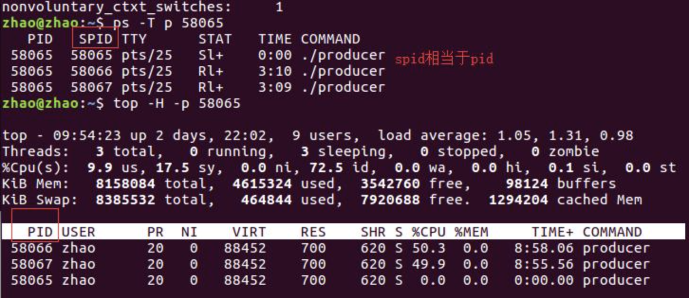
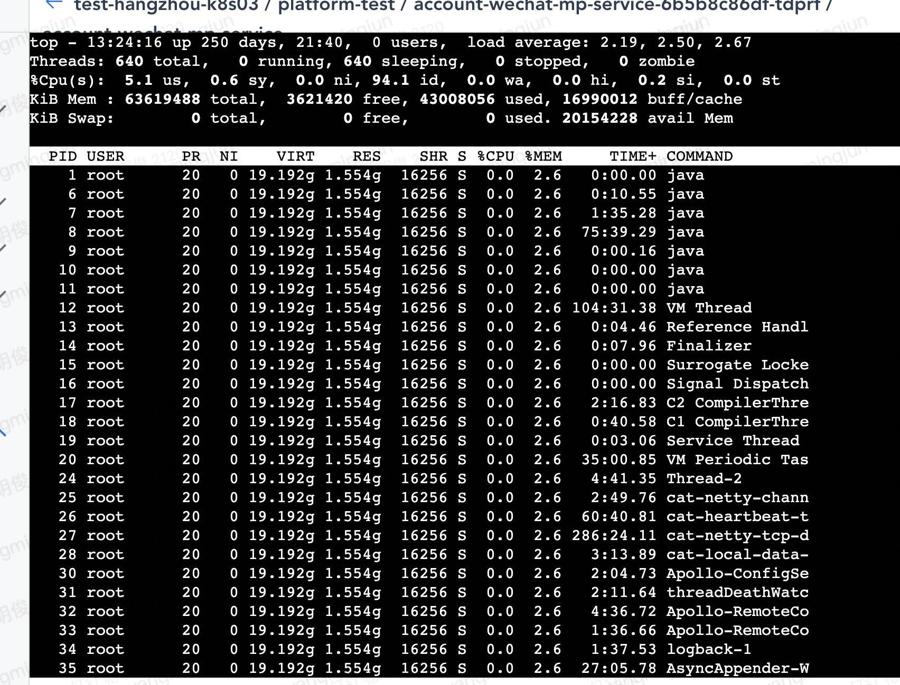
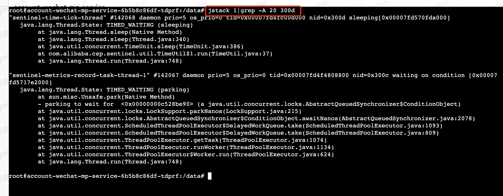
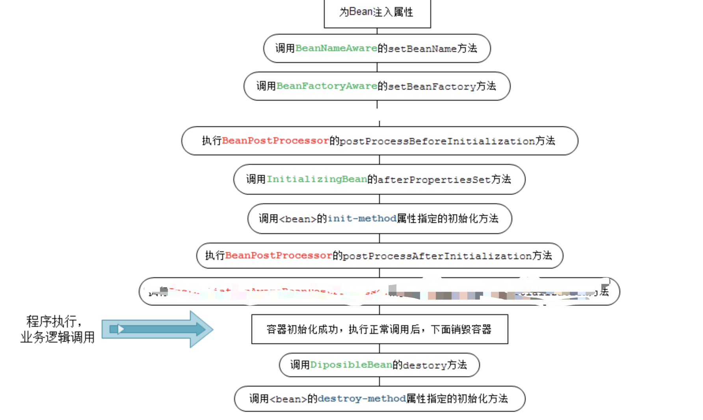

# 消息队列 推拉模型比较

**推模型（Push方式）**  由消息中间件主动的将消息推送给消费者； 

**拉模型（Pull方式）**  由消费者主动向中间件拉取消息； 

 两种模式各有优势，Push方式可以尽快的将消息发送给消费者； Push方式的坏处是，如果一个消费者处理消息的能力很弱，而消息中间件不停的向其发送消息，则会导致消费者系统负载升高：引发CPU飙升 或 OOM等问题；  

Pull方式的好处在于可以进一步，消费能力有消费者控制，可以做到按需消费

# 三个线程A,B,C，轮流输出ABC，顺序不可打乱，各十次。

* 第一种方式

  采用自旋等待

  ```java
  static void mothed1() {
          PrintA printA = new PrintA();
          PrintB printB = new PrintB();
          PrintC printC = new PrintC();
          // 输出A 要得到 C 的允许
          printA.setPreMessage(printC);
          // 输出B 要得到 A 的允许
          printB.setPreMessage(printA);
          // 输出C 要得到 B 的允许
          printC.setPreMessage(printB);
          // 设置C 允许 A 输出
          printC.setFlag(true);
          printA.start();
          printB.start();
          printC.start();
      }
  
  /**
   * used template method 
   * 使用了模板方法模式
   */
  abstract class PrintMessage extends Thread {
      volatile boolean flag = false;
      PrintMessage preMessage;
      static int printNum = 10;
      abstract protected void printMessage();
  
      @Override
      public void run() {
          for (int i = 0; i < printNum; i++) {
              while (this.flag || !preMessage.flag) {
              }// 这个while 用来阻塞线程
              printMessage();
              preMessage.flag = false;//修改他前一个为没有输出
              this.flag = true;//这个表示它输出过一次了
          }
      }
  
      void setFlag(boolean flag) {
          this.flag = flag;
      }
  
      void setPreMessage(PrintMessage printMessage) {
          this.printMessage = printMessage;
      }
  }
  /**
   * 输出A的线程
   */
  class PrintA extends PrintMessage {
      @Override
      protected void printMessage() {
          System.out.print("A");
      }
  }
  /**
   * 输出B的线程
   */
  class PrintB extends PrintMessage {
      protected void printMessage() {
          System.out.print("B");
      }
  }
  
  /**
   * 输出C的线程
   */
  class PrintC extends PrintMessage {
      @Override
      protected void printMessage() {
          System.out.print("C");
      }
  }
  ```

# Paxos 协议

​	从前面的例子不难看出，Paxos 协议的过程类似于“占坑”，哪个 value 把超过半数的“坑”
（Acceptor）占住了，哪个 value 就得到批准了。 

这个过程也类似于单机系统并行系统的加锁过程。假如有这么单机系统：系统内有 5 个锁，有
多个线程执行，每个线程需要获得 5 个锁中的任意 3 个才能执行后续操作，操作完成后释放占用的
锁。我们知道，上述单机系统中一定会发生“死锁”。例如，3 个线程并发，第一个线程获得 2 个锁，
第二个线程获得 2 个锁，第三个线程获得 1 个锁。此时任何一个线程都无法获得 3 个锁，也不会主
动释放自己占用的锁，从而造成系统死锁。 

​	但在 Paxos 协议过程中，虽然也存在着并发竞争，但是不会出现上述死锁。这是因为，Paxos 协议
引入了轮数的概念，高轮数的 paxos 提案可以抢占低轮数的 paxos 提案。从而避免了死锁的发生。
然而这种设计却引入了“活锁”的可能，即 Proposer 相互不断以更高的轮数提出议案，使得每轮 Paxos
过程都无法最终完成，从而无法批准任何一个 value。 

# 需要看的面试题

1. CAP ,BASE **down**

2. java 集合（线程安全，线程不安全的） **down**

3. 二叉树树的遍历  **down**

4. [B树，B+树，B*树](../数据结构与算法/树/查找树.md)，R树 （R树，如何查询离你最近的酒店:https://www.csdn.net/tags/MtTaEg0sMTA1NjgtYmxvZwO0O0OO0O0O.html  ） **down**

5. [基础排序算法](../数据结构与算法/algorithm/经典排序算法.md) **down**

6. 学习怎么定位线上 jvm，cpu问题 **down**

   可以使用top 命令查看cpu,内存等使用情况 [top命令详解](https://www.cnblogs.com/mylive/p/15162773.html) + [补充](https://blog.csdn.net/hp_yangpeng/article/details/78511051) + https://www.freesion.com/article/2262328727/

   监控进一步查询线程 `top -Hp pid` 可以查看进程内的线程的运行情况（动态的监控）

   也可以是使用  `ps -T -p pid`  = ` ps -Tp pid` 命令查询静态的线程信息

   

   

   这是我自己操作的截图

   

   **如果我们使用 top -p pid 进入监控界面之后使用 shift+h 也会进入到  `top -Hp pid` 页面**

   然后这时候我们就可以使用：` jstack [进程的pid] | grep -A 20 [进程中线程的pid的16进制（注意字母小写）]`

   进程id = 1 , 进程中线程的pid的16进制（注意字母小写）：12301 = 300d

   输入：jstack 1|grep -A 20 300d  命令， **-A 20 是查询最近的20行记录**

   

   **有了上线的这些监控工具之后，我们在出现 cpu负载问题**的时候就可以使用 top , 然后找到cpu占用最高的，然后 ` top -p pid ` -> `shift + h`然后找到进程中 消耗cpu 最多的线程，然后再使用 ` jstack [进程的pid] | grep -A 20 [进程中线程的pid的16进制（注意字母小写）]` 查看调用栈的信息定位到方法 来定位问题

   **如果我们遇到的是OOM问题，FULL GC 问题， YGC 问题，**我们可以通过这获取到java进程的pid，这样我们就可以使用 jmap  相关命令查询当前的内存使用情况

   * https://mp.weixin.qq.com/s/LRx9tLtx1tficWPvUWUTuQ

     补充一下该文中，在排查的时候忘记看GC日志了，如果看了该日志可以很快的知道在哪些步骤耗时较长，同时结合surviver 区存活对象和之前的对比，会很容易发现因该区使用jmap查看对象信息，找到根据存活查询代码看问题

   * https://mp.weixin.qq.com/s/P8s3kuceBNovUP5adXpFCQ

   * https://mp.weixin.qq.com/s/yutHXOi6Xl3-Qn91Pvg9wA

   * https://mp.weixin.qq.com/s/7XGD-Z3wrThv5HyoK3B8AQ

   工具,基础知识问题：

   * [JVM性能监控&故障处理工具](../java/JVM/JVM性能监控&故障处理工具.md)
   * [JVM/垃圾收集算法&收集器](../java/JVM/垃圾收集算法&收集器.md)

7. spring 

   https://github.com/AobingJava/JavaFamily

   1. bean的生命周期

      初始化 bean（使用bean构造器） -> 注入属性 （会遇到循环依赖问题） -> 处理 aware -> BeanPostProcesser.postProcessBeforeInitialization() -> @PostConstruct标记的方法 ->InitiallizingBean.afterPropertiseSet()  ->  <bean> 配置指定的init-method ->BeanPostProcesser.postProcessAfterInitialization() -> 容器初始化成功之后，bean使用 ->

      容器销毁的时候。调用 @PreDestroy标记的方法 -> DisposableBean.destory() -> <bean> 指定的 destroy-method 方法

      

   2. 循环依赖问题

      循环依赖问题很好理解 B依赖A,A依赖B,甚至更长的循环依赖链条，解决的方式也很简单，在进行简单的初始化（不带参数的构造方法），拿到实例之后，放入一个缓存中simpleBeanMap，在走到设置属性的时候发现设置一个bean,如果判断bean在simpleBeanMap中找不到，那就走B的生成逻辑，然后将B的简单实例放入simpleBeanMap，然后给B设置数据A的时候发现simpleBeanMap中已经有了，就可以直接设置进去了；然后B处理完成，继续走A的设置属性逻辑将B设置设置到A.就完成了循环依赖的数据设置。**当然这个是有前提的那就是A,B都是单例的。还有就是无法用构造方法完成循环依赖的处理** ，spring的实现和我上面说的是差不多的，不过spring 中由于Bean 的初始化会涉及到很多流程比如AOP，所以代码会复杂很多，但是本质没变，感兴趣可以看看 https://blog.csdn.net/weixin_44129618/article/details/122839774 里面指出了spring 中作为中间缓存的simpleBeanMap是啥，还有图会更容易理解

8. [设计模式 ](../设计模式/设计模式.md) **down**

9. mysql查询优化 

10. [sentinel 以及它的滑动窗口算法，限流算法](../分布式/限流降级熔断/sentinel.md) **down**

11. Tcp/Ip , http

11. [cookie ，session ,token](https://blog.csdn.net/weixin_43726471/article/details/121735148)

11. [分布式事务](../分布式/分布式事务解决方案.md)

11. 复习一下AQS相关

11. 准备英文的简单自我介绍以及简单沟通 **down**

16. Oauth2.0 

    1. https://baike.baidu.com/item/OAuth2.0/6788617?fr=aladdin
    2. https://developers.weixin.qq.com/doc/oplatform/Mobile_App/WeChat_Login/Development_Guide.html

17. 凯东发的面试题

    1. 分布式锁 包括redis 锁。 **down**

    2. 线程池，线程池拒绝策略，如果线程池中的线程执行过慢怎么办 **down**

    3. 讲一讲java的GC **down**

    4. 从JVM和操作系统聊一聊java的锁  **down**

    5. redis持久机制 RDB , ROF  **down**

    6. NIO，select poll epoll区别 **down**

    7. 如何实现LRU  **down**

    8. 设计模式   **down**

    9. spring bean的生命周期

    10. mysql查询优化

    11. kafka **down**

        1. [高性能机制](../MQ/Kafka.md)

        2. 一个topic突然加入一个消费者，导致其他消费都变慢了，是什么情况？

           [触发了 rebalance。协调期间对性能会有影响](../MQ/Kafka.md) 的consumer group 中有讲到 rebalanc过程

    12. R树，如何查询离你最近的酒店  **down**

    13. [递归构造menu](https://blog.csdn.net/qq_45100361/article/details/112388635)

