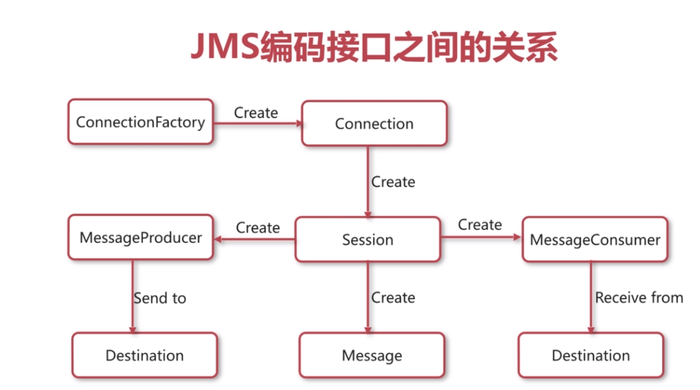
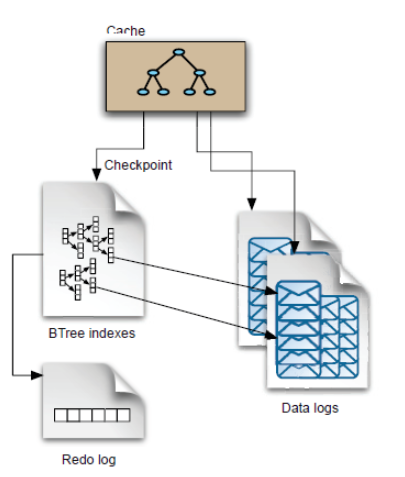
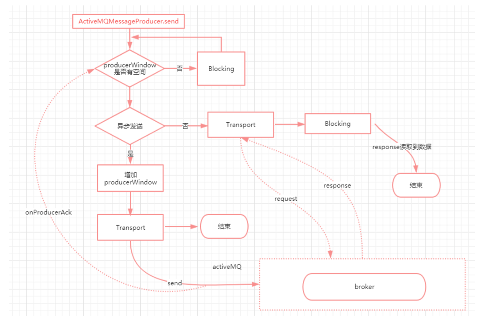
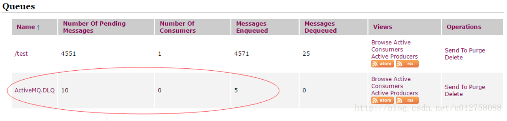

# 申明

本文内容很多都是从网络上找的资料然后我整理或引用的

# 1. JMS

## 1. 规范

目前的记录还不完整，但是基本使用足够了

**JMS它是一个API 规范**

### 1.1 连接

通过 `ConnectionFactory`创建`Connection(连接)`

### 1.2 会话

通过`Connection`创建`Session（会话）`

### 1.3 消息生产者，消息消费者，消息

通过 `Session`创建 `Messageproducer`（消息生产者），`MessageConsumer`（消息消费者），`Message`（消息）

`Messageproducer`负责生产发送消息

`MessageConsumer` 接收消费消息

整个结构如下图所示


### 1.4 持久化消息和非持久化消息

JMS中对非持久化消息和持久化消息的称呼分别是：`NON_PERSISTENT Message`和`PERSISTENT Meaage`。它们指的是消息在任何一种“发送-接受”模式下（“订阅-发布”模式和“负载均衡模式”），是否进行持久化存储。 

* 非持久化消息：**NON_PERSISTENT Message**指的是只存储在JMS服务节点的内存区域，不会存储在某种持久化介质上（后面我们要介绍到AcitveMQ可支持的持久化介质有：KahaBD、AMQ和关系型数据）。在极限情况下，JMS服务节点的内存区域不够使用了，也只会采用某种辅助方案进行转存（例如ActiveMQ会使用磁盘上的一个“临时存储区域”进行暂存）。**一旦JMS服务节点宕机了，这些NON_PERSISTENT Message就会丢失**。
* 持久化消息：**PERSISTENT Meaage **指的是 **这些消息不受JMS服务端异常状态的影响，JMS服务端会使用某种持久化存储方案保存这些消息(例如ActiveMQ中可以选择的持久化存储方案就包括：KahaDB、AMQ和关系型数据库)，直到JMS服务端认为这些PERSISTENT Meaage被消费端成功处理。**

## 1.2 queue模式和topic模式

- 队列(负载均衡)模式：队列里中的消息只能消费一次,并且是被消费者平均消费的
  - 持久化消息：**在任何时候只要它没有被确认**，那么这个消息都会一直**重发或则存储起来**直到被正确的消费掉。
  - 非持久化消息：消息没有因为什么原因丢失，那么和持久化消息一样的处理。
  - 如果所有消息都要处理请使用持久化
- 主题(订阅发布)模式：订阅了主题的消费者会收到主题内所有消息，消费者订阅主题之前的主题消息它是收不到的
  - 持久化订阅：在订阅之后，如果消费者出故障了，那么重启之后是可以重新拿到这段时间的消息，进行处理的，（带来的问题是可能存在大量消息堆积，这时候需要处理的任务就会很繁重）
  - 非持久化订阅：没有上面的持久化订阅的消息恢复能力

总结：如果所有的消息都要签收，那么使用持久化的方式

## 1.3 消息队列 推/拉 模型比较

**推模型（Push方式）**  由消息中间件主动的将消息推送给消费者； 

**拉模型（Pull方式）**  由消费者主动向中间件拉取消息；  

两种模式各有优势，Push方式可以尽快的将消息发送给消费者；而Pull方式的好处在于可以进一步的解除消费者对于消息中间件的依赖，通过后台任务去定期的访问消息队列中的消息。  Push方式的坏处是，如果一个消费者处理消息的能力很弱，而消息中间件不停的向其发送消息，则会导致消费者缓冲溢出；  Pull方法需要引进一个单独的服务进程，加大消耗的资源。  


# 2. ActiveMQ

他是一个严格按照 JMS 这个API 规范开发的一个消息中间件,同时实现了 AMQP 协议, MQTT协议 Openwire协议 Stomp协议等

## 2.0 queue和topic在ActiveMQ的实现

- 队列(负载均衡)模式 ：

　　存储采用先进先出队列（FIFO），一个消息只能被一个消费者消费，当消息被确认消费之后才会被删除。

- 主题(订阅发布)模式：

　　每个订阅者获取的消息实际是消息的一个副本，只有一个消息副本会被存储，MQ 提供了一个指针来指向消息存储并且分发消息副本到订阅者，消息直到所有的持久化订阅者都被接收才能被删除。

## 2.1 会话

### 2.1.1 会话创建

`Session session = connection.createSession(Boolean.TRUE, Session.AUTO_ACKNOWLEDGE);`

**第一个参数指 是否在事务中 进行处理，第二个参数是 应答方式**

### 2.1.2 会话类型

* 事务型会话：通过连接创建会话的时候指定

  事务性会话 如果不 commit 的话 是不会有效的，比如：

  * 发送（生产）端不commit :  发送的消息无法应用到 ActiveMQ 的服务上的，也就是这条消息无效，消费端也根本就拿不到这条消息
  * 消费端不commit :  由于消息在这种模式如果设置的是需要手动commit 确认消息的应答方式的话，所以如果没有commit那么也就是说这条消息没有被正确使用，需要重试（重新处理）

  **注意:使用事务形势会话必须显示的调用 commit这样的方法 **

* 非事务型会话:会有自动提交

  `connection.createSession(Boolean.FALSE, Session.AUTO_ACKNOWLEDGE);`

### 2.1.3 应答（确认）方式

-  `Session.AUTO_ACKNOWLEDGE`: **自动确认** 也就不需要commit 这样的方法调用了 ， 这一点在发送端和消费段效果是类似的
-  `Session.DUPS_OK_ACKNOWLEDGE`：**自动批量确认**，会造成消息的重复使用，使用这种方式的时候你需要确定你的业务不必在乎这种情况的发生（比如是幂等的处理）
-  `Session.CLIENT_ACKNOWLEDGE` :   **客户端确认**   
-  `Session.SESSION_TRANSACTED` : **事务提交并确认**

这些在ActiveMQ 中都有定义，也有对应的方法进行设置

需要注意的是 如果是事务性会话 ：

- 发送（生产）端不commit（确认） :  发送的消息无法应用到 ActiveMQ 的服务上的，也就是这条消息无效，消费端也根本就拿不到这条消息
- 消费端不commit （确认）:  由于消息在这种模式如果设置的是需要手动commit 确认消息的应答方式的话，所以如果没有commit那么也就是说这条消息没有被正确使用，需要重试（重新处理）

## 2.2 消息

### 2.2.1 消息的构成

- 消息头
- 消息体
- 消息属性

### 2.2.2 消息体的数据类型

- text
- map
- bytes
- stream
- object

### 2.2.3 持久化消息和非持久化消息

#### 2.2.3.1 持久化消息

* 消息的持久化存储使用的文件存储（通过持久化介质存在磁盘上存储）

* **消息的持久化是为了**保证在服务器故障的时候**消息的不丢失/可恢复**，是一种**消息的可靠性**设计

* ActiveMQ 发送持久化消息的API

  `MessageProducer producer = session.createProducer(destination);`

  `producer.setDeliveryMode(DeliveryMode.PERSISTENT);`

#### 2.2.3.2 非持久化消息

* 存储在内存当中，当配置的可使用内存不足时，会使用临时文件的方式存储

* 消息易丢失，服务重启肯定丢失

* ActiveMQ 发送非持久化消息的API

  MessageProducer producer = session.createProducer(destination);

  `producer.setDeliveryMode(DeliveryMode.NON_PERSISTENT);`

### 2.2.4 持续订阅和非持续订阅

持续订阅和非持续订阅，**是针对Topic(订阅-发布)模式的细分处理策略**，在JMS规范中的标准称呼是：Durable-Subscribers和Non-Durable Subscribers。

* Durable-Subscribers是指在“订阅-发布”模式下，即使标记为Durable-Subscribers的订阅者下线了（可能是因为订阅者宕机，也可能是因为这个订阅者故意下线），“订阅-发布”模式的Topic队列也要保存这些消息（视消息不同的持久化策略影响，保存机制不一样），直到下次这个被标记为Durable-Subscribers的订阅者重新上线，并正确处理这条消息为止。换句话说，**标记为Durable-Subscribers的订阅者是否能获得某条消息，和它是否曾经下线没有任何关系。**(**还是需要这个消费者订阅这个topic之后，也就是说新上线的消费者是不能拿到之前的消息的**)
* Non-Durable Subscribers是指在“订阅-发布”模式下，“订阅-发布”模式的Topic队列不用为这些已经下线的订阅者保留消息。当后者**将消息按照既定的广播规则发送给当前在线的订阅者后，消息就可以被标记为“处理完成”。**

### 2.2.5 消息的存储方式

ActiveMQ支持可插拔式消息存储,以利用不同的消息存储介质

#### 2.2.5.1 消息的存储介质:

- KahaDB  5.4 默认使用
- AMQ        
- JDBC        
- memory 内存 （**非持久化介质**）
- LevelDB (弃用了，已不再维护更新)

现在暂时只介绍第一种KahaDB，别的需要的时候查资料

#### 2.2.5.2 通常情况下

- 非持久化消息存储在内存或磁盘（内存不够用的时候使用临时文件的方式）具体的机制下面的空间容量配置会有介绍
- 持久化消息存在文件中（磁盘上）

####  2.2.5.3 消息的存储空间容量配置

**ActiveMQ的内核是Java编写的**，也就是说如果服务端没有Java运行环境ActiveMQ是无法运行的。ActiveMQ启动时，**启动脚本使用wrapper包装器来启动JVM**。JVM相关的配置信息在启动目录的`apache-activemq-5.15.5\bin\win64\wrapper.conf`配置文件中。可以通过改变其中的配置项，设置JVM的初始内存大小和最大内存大小（当然还可以进行其他和JVM有关的设置，例如开启debug模式），如下：

```properties
[root@bogon linux-x86-64]# pwd
/usr/local/src/apache-activemq-5.13.2/bin/linux-x86-64
[root@bogon linux-x86-64]# ls
activemq  libwrapper.so  wrapper  wrapper.conf
[root@bogon linux-x86-64]# vim wrapper.conf

......

# Initial Java Heap Size (in MB)
wrapper.java.initmemory=100

# Maximum Java Heap Size (in MB)
wrapper.java.maxmemory=1024

.....
```

以上配置项设置JVM的初始内存大小为100MB，设置JVM的最大内存大小为1024MB。如果您在更改后使用console参数启动ActiveMQ，那么会看到当前ActiveMQ的JVM设置发生了变化

在conf/activemq.xml 配置文件中配置`<broker>`标签的子标签

```xml
  <systemUsage>
    <systemUsage>
        <!-- 这个参数指的是 非持久化消息使用的堆内存最大只能是70%的堆内存 -->
        <memoryUsage>
            <memoryUsage percentOfJvmHeap="70" />
        </memoryUsage>
        <!-- 这个参数指的是 持久化消息在磁盘的可用空间-->
        <storeUsage>
            <storeUsage limit="100 gb"/>
        </storeUsage>
        <!-- 对于非持久化消息来说,当消息达到 memoryUsage内存限制的时候，
         会将消息持久化到磁盘上临时存储-->
        <tempUsage>
            <tempUsage limit="50 gb"/>
        </tempUsage>
    </systemUsage>
</systemUsage>
```
#### 2.2.5.4 KahaDB 存储方式

KahaDB 是从 ActiveMQ **5.4 开始默认的持久化插件**。KahaDb 恢复时间远远小于其前身 AMQ 并且使用更少的数据文件，所以可以完全代替 AMQ，kahaDB 的持久化机制同样是基于日志文件，索引和缓存。 

##### **2.2.5.4.1 KahaDB 主要特性**

- 日志形式存储消息；
- 消息索引以 B-Tree 结构存储，可以快速更新；
- 完全支持 JMS 事务；
- 支持多种恢复机制；

##### **2.2.5.4.2 使用场景** 

- 高吞吐量的应用程序 
- 存储大数据量的消息 

##### 2.2.5.4.3 配置方式

在conf/activemq.xml 配置文件中配置`<broker>`标签的子标签，这也是activeMQ 5.4 以后的默认配置

```xml
<persistenceAdapter>
     <kahaDB directory="${activemq.data}/kahadb"/>
</persistenceAdapter>
```

##### 2.2.5.4.4 KahaDB 内部存储结构



- **Data logs**：存放完整的每条消息(包括事务、目的地、id、优先级、具体内容等)和producerSequenceIdTracker(用来验证每个消息生成者发送的消息是否重复的数据结构)。它随着消息数量的增多，如每32M一个文件，文件名按照数字进行编号，如db-1.log、db-2.log、db-3.log … 

  - 对应文件：apache-activemq-5.15.5\data\kahadb\db-n.log

  **这个消息数据的写入使用的顺序写，也就是在磁盘上的顺序写入，相对来说性能就比较高**

- **Cache**：从上图可以看出，我们的消息，消息索引一开始都是在 这个Cache（内存）中。

  消息：当有活动消费者时，用于临时存储，消息会被发送给消费者，如果消息及时被确认，这不需写入到磁盘

- **Btree indexes（消息索引**）：用于引用消息日志（message id），**它存储在内存中，这样能快速定位到**。**内存中没有被处理的消息索引会以一定的周期（或者一定的数量规模）为依据，同步到Metadata Store中（存在这个db.data文件中)，避免大量消息未发送时，消息索引占用过多内存空间。** 

  **消息同步（checkpoint）依据，可以在ActiveMQ的主配置文件中进行设置** 

  - 对应文件：apache-activemq-5.15.5\data\kahadb\db.data

- **Redo log**：用于在非正常关机情况下,维护索引完整性(数据恢复)。

  - 对应文件：apache-activemq-5.15.5\data\kahadb\db.redo

##### 2.2.5.4.5 KahaDB中所有的配置选项

以下表格为读者示例了KahaDB中所有的配置选项和其含义（加“*”部分是笔者认为重要的配置选项）

| property name               | default value | Comments                                                     |
| --------------------------- | ------------- | ------------------------------------------------------------ |
| *directory                  | activemq-data | 消息文件和日志的存储目录                                     |
| *indexWriteBatchSize        | 1000          | 当Metadata cache区域和Metadata store区域不同的索引数量达到这个值后，Metadata cache将会发起checkpoint同步 |
| *indexCacheSize             | 10000         | 内存中，索引的页大小。超过这个大小Metadata cache将会发起checkpoint同步 |
| *enableIndexWriteAsync      | false         | 索引是否异步写到消息文件中，将以不要设置为true               |
| *journalMaxFileLength       | 32mb          | 一个消息文件的大小                                           |
| *enableJournalDiskSyncs     | true          | 如果为true，保证使用同步写入的方式持久化消息到journal文件中  |
| *cleanupInterval            | 30000         | 清除（清除或归档）不再使用的db-*.log文件的时间周期（毫秒）。 |
| *checkpointInterval         | 5000          | 写入索引信息到metadata store中的时间周期（毫秒）             |
| ignoreMissingJournalfiles   | false         | 是否忽略丢失的journal文件。如果为false，当丢失了journal文件时，broker启动时会抛异常并关闭 |
| checkForCorruptJournalFiles | false         | 检查消息文件是否损坏，true，检查发现损坏会尝试修复           |
| checksumJournalFiles        | false         | 产生一个checksum，以便能够检测journal文件是否损坏。          |

**5.4版本之后有效的属性：**

| property name                    | default value | Comments                                                     |
| -------------------------------- | ------------- | ------------------------------------------------------------ |
| *archiveDataLogs                 | false         | 当为true时，归档的消息文件被移到directoryArchive,而不是直接删除 |
| *directoryArchive                | null          | 存储被归档的消息文件目录                                     |
| databaseLockedWaitDelay          | 10000         | 在使用负载时，等待获得文件锁的延迟时间，单位ms               |
| maxAsyncJobs                     | 10000         | 等待写入journal文件的任务队列的最大数量。应该大于或等于最大并发producer的数量。配合并行存储转发属性使用。 |
| concurrentStoreAndDispatchTopics | false         | 如果为true，转发消息的时候同时提交事务                       |
| concurrentStoreAndDispatchQueues | true          | 如果为true，转发Topic消息的时候同时存储消息的message store中 |

**5.6版本之后有效的属性：**

| property name         | default value | Comments                            |
| --------------------- | ------------- | ----------------------------------- |
| archiveCorruptedIndex | false         | 是否归档错误的索引到Archive文件夹下 |

**5.10版本之后有效的属性：**

| property name  | default value | Comments                                                     |
| -------------- | ------------- | ------------------------------------------------------------ |
| IndexDirectory |               | 单独设置KahaDB中，db.data文件的存储位置。如果不进行设置，db.data文件的存储位置还是将以directory属性设置的值为准 |

### 2.2.6 消息的发送方式

##### 2.2.6.1 同步发送和异步发送

* 同步（sync）：发送者发送一条消息会阻塞，直到 activeMQ 服务的 broker 反馈一个确认消息给发送者，表示消息已经被broker处理。
  * 优点：提供了消息的安全性保障
  * 缺点：由于是阻塞的方式所以会影响发送端的发送性能
  * 建议：绝对不允许消息丢失的时候使用
  * **注意**：**同步发送在实现上使用的还是异步，不过他使用了阻塞来获取服务的响应结果，实现了同步**

* 异步(async)：和同步发送正好相反，发送者不需要阻塞等待broker的反馈
  * 优点：性能相对较高
  * 缺点：可能出现消息丢失的情况
  * 建议：在允许消息丢失的情况下使用

* 发送异步消息的设置方法
  * 在URL中带上参数：`ConnectionFactory connectionFactory = new ActiveMQConnectionFactory("tcp://192.168.93.1:61616?jms.useAsyncSend=true";`
  * 使用连接工厂类的方法设置：`((ActiveMQConnectionFactory)connectionFactory).setUseAsyncSend(true);`
  * 使用ActiveMQConnection类的方法设置：`((ActiveMQConnection)connection).setUseAsyncSend(true);`

* 发送同步消息的方法设置方式

  * 在URL中带上参数：`ConnectionFactory connectionFactory = new ActiveMQConnectionFactory("tcp://192.168.93.1:61616?jms.alwaysSyncSend=true";`
  * 使用连接工厂类的方法设置：`((ActiveMQConnectionFactory)connectionFactory).setAlwaysSyncSend(true);`
  * 使用ActiveMQConnection类的方法设置：`((ActiveMQConnection)connection).setAlwaysSyncSend(true);`


##### 2.2.6.2 异步发送分析

同步异步数据流转图：



##### 2.2.6.3 producerWindow

producerWindow**针对异步发送**消息时，控制其允许的能够积压的消息的累计大小（一个阈值），这些消息没有得到broker的ack。在得到ack之后会减去相应的消息size，释放producerWindow。  

producerWindow的大小设置有2种方式：

```java
ConnectionFactory connectionFactory = new ActiveMQConnectionFactory(brokerUrl);
((ActiveMQConnectionFactory) connectionFactory).setProducerWindowSize(1048576);
```

```java
String brokerUrl = "tcp://localhost:61616?" + 
                   "jms.producerWindowSize=1048576" ;
ConnectionFactory connectionFactory = new ActiveMQConnectionFactory(brokerUrl)
```

### 2.2.7 消息的默认发送策略

* **持久化消息在非事务模式下是同步发送的**
* **非持久化消息都是异步发送的**
* **开启事务的情况下，消息都是异步发送**

### 2.2.8 消息的获取方式

在消费端调用方法：

* `consumer.receive()` ：阻塞式（同步）的获取消息
* `consumer.setMessageListener(messageListener)`：注册监听（异步）的方式获取消息

注意：同一个session （会话）只能使用一个方式，它们是互斥的。

## 2.3 生产者策略

### 2.3.1 发送NON_PERSISTENT Message

我们知道**发送NON_PERSISTENT Message时，消息发送方默认使用异步方式**：即是说消息发送后发送方不会等待NON_PERSISTENT Message在服务端的任何回执。**那么问题来了**：如果这时服务端已经出现了消息堆积，并且堆积程度已经达到“无法再接收新消息”的极限情况了，那么消息发送方如何知晓并采取相应的策略呢？

实际上所谓的异步发送也并非绝对的异步，消息发送者会在发送一定大小的消息后等待服务端进行回执（**这个配置只是针对使用异步方式进行发送消息的情况**）：

```java
// 1. 
// 以下语句设置消息发送者在累计发送 1048576 byte大小的消息后（可能是一条消息也可能是多条消息）
// 等待服务端进行回执,以便确定之前发送的消息是否被正确处理
// 确定服务器端是否产生了过量的消息堆积，需要减慢消息生产端的生产速度
 ((ActiveMQConnectionFactory) connectionFactory).setProducerWindowSize(1048576);
// 2. 在brokerUrl中设置: "tcp://localhost:61616?jms.producerWindowSize=1048576",
// 这种设置将会对所有的 producer生效。
ConnectionFactory connectionFactory = new ActiveMQConnectionFactory("tcp://192.168.93.1:61616?jms.producerWindowSize=1048576");

// 3. 在destinationUri中设置: "test-queue?producer.windowSize=1048576",此参数只会对使用此Destination实例的producer失效，将会覆盖brokerUrl中的producerWindowSize值。
Destination destination = session.createTopic("test-queue?producer.windowSize=1048576");
```

如果您使用的是异步发送方式，那么必须通过以上代码指明回执点。

### 2.3.2 发送PERSISTENT Message

如果您不特意指定消息的发送类型，那么消息生产者默认发送PERSISTENT Meaage。这样的消息发送到ActiveMQ服务端后将被进行持久化存储，并且消息发送者默认等待ActiveMQ服务端对这条消息处理情况的回执。

**以上这个过程非常耗时**，ActiveMQ服务端不但要接受消息，在内存中完成存储，**并且按照ActiveMQ服务端设置的持久化存储方案对消息进行存储**（**主要的处理时间耗费在这里**）。为了提高ActiveMQ在接受PERSISTENT Meaage时的性能，ActiveMQ允许开发人员遵从JMS API中的设置方式，为消息发送端在发送PERSISTENT Meaage时提供异步方式 。

一旦您进行了这样的设置，就需要设置回执窗口：

```java
// 1. 
// 以下语句设置消息发送者在累计发送 1048576 byte大小的消息后（可能是一条消息也可能是多条消息）
// 等待服务端进行回执,以便确定之前发送的消息是否被正确处理
// 确定服务器端是否产生了过量的消息堆积，需要减慢消息生产端的生产速度
 ((ActiveMQConnectionFactory) connectionFactory).setProducerWindowSize(1048576);
// 2. 在brokerUrl中设置: "tcp://localhost:61616?jms.producerWindowSize=1048576",
// 这种设置将会对所有的 producer生效。
ConnectionFactory connectionFactory = new ActiveMQConnectionFactory("tcp://192.168.93.1:61616?jms.producerWindowSize=1048576");

// 3. 在destinationUri中设置: "test-queue?producer.windowSize=1048576",此参数只会对使用此Destination实例的producer失效，将会覆盖brokerUrl中的producerWindowSize值。
Destination destination = session.createTopic("test-queue?producer.windowSize=1048576");
```


### 2.3.3 生产者策略：事务

JMS规范中支持带事务的消息，也就是说您可以启动一个事务（并由消息发送者的连接会话设置一个事务号Transaction ID），然后在事务中发送多条消息。这个事务提交前这些消息都不会进入队列（无论是Queue还是Topic）。

**不进入队列，并不代表JMS不会在事务提交前将消息发送给ActiveMQ服务端**。 实际上这些消息都会发送给服务端，服务端发现这是一条带有Transaction ID的消息，就会将先把这条消息放置在“transaction store”区域中（并且带有redo日志，这样保证在收到rollback指令后能进行取消操作），等待这个Transaction ID被rollback或者commit。

一旦这个Transaction ID被commit，ActiveMQ才会依据自身设置的 PERSISTENT Meaage处理规则或者NON_PERSISTENT Meaage 处理规则，将Transaction ID对应的message进行入队操作（无论是Queue还是Topic）。以下代码示例了如何在生产者端使用事务发送消息：

```java
......
//进行连接
connection = connectionFactory.createQueueConnection();
connection.start();

//建立会话（设置一个带有事务特性的会话）
session = connection.createSession(true, Session.AUTO_ACKNOWLEDGE);
//建立queue（当然如果有了就不会重复建立）
Queue sendQueue = session.createQueue("/test");
//建立消息发送者对象
MessageProducer sender = session.createProducer(sendQueue);

//发送（JMS是支持事务的）
for(int index = 0 ; index < 10 ; index++) {
    TextMessage outMessage = session.createTextMessage();
    outMessage.setText("这是发送的消息内容-------------------" + index);
    // 无论是NON_PERSISTENT message还是PERSISTENT message
    // 都要在commit后才能真正的入队
    if(index % 2 == 0) {
        sender.setDeliveryMode(DeliveryMode.NON_PERSISTENT);
    } else {
        sender.setDeliveryMode(DeliveryMode.PERSISTENT);
    }

    // 没有commit的消息，也是要先发送给服务端的
    sender.send(outMessage);
}

session.commit();

```

以上代码中，在“connection.createSession”这个方法中一共有两个参数（这句代码在上文中已经出现过多次）。第一个布尔型参数很好理解，就是标示这个连接会话是否启动事务；第二个整型参数标示了消息消费者的“应答模型”，我们会在下文中进行详细介绍。

### 2.3.4 生产者策略：ProducerFlowControl

生产流控制，是ActiveMQ消息生产者端最为重要的性能策略，**它主要设定了在ActiveMQ服务节点在产生消息堆积，并超过限制大小的情况下，如何进行消息生产者端的限流**。

具体来说，如果以上情况在ActiveMQ出现，那么当生产者端再次接受ActiveMQ的消息回执时，ActiveMQ就会让消息生产者进入等待状态或者在发送者端直接抛出JMSException。当然您也可以配置ActiveMQ不进行ProducerFlowControl，如果您对自己ActiveMQ服务端的底层性能和消费者端的性能足够自信的话。

在ActiveMQ的主配置文件activemq.xml中，关于ProducerFlowControl策略的控制标签是“destinationPolicy”和它的子标签。请看如下配置示例：

```xml
<destinationPolicy>
  <policyMap>
    <policyEntries>
      <policyEntry topic=">" producerFlowControl="false"/>
    </policyEntries>
  </policyMap>
</destinationPolicy>
```

以上示例配置所有的Topic模式的队列不进行producerFlowControl策略控制。当然还可以为队列配置启用producerFlowControl策略：

```xml
<policyEntry queue=">" producerFlowControl="true" memoryLimit="200mb">

</policyEntry>
```

以上配置项表示为ActiveMQ中的所有Queue模式的队列启用producerFlowControl策略，并且限制每个Queue信息的**最大内存存储限制**（memoryLimit）为200MB；这里指的**最多使用200MB的内存区域，而不是说Queue中消息的总大小为200MB**。例如，在ActiveMQ 5.X+ 版本中NON_PERSISTENT Message会被转出到 temp store区域，所以有可能您观察到的现象是，无论怎样堆积NON_PERSISTENT Message消息，Queue的使用内存始终无法达到200MB。

```xml
<policyEntry queue=">" producerFlowControl="true" memoryLimit="200mb">
      <pendingQueuePolicy>
          <vmQueueCursor/>
      </pendingQueuePolicy>
</policyEntry>
```

以上配置表示只使用内存存储Queue中的所有消息，特别是NON_PERSISTENT Message只存储在内存中，不使用temp store区域进行转储。在官方文档中，有关于policyEntry标签的所有配置选项都有完整说明：<http://activemq.apache.org/per-destination-policies.html>。

## 2.4 消费者策略

### 2.4.1 消费者策略：Dispatch Async

讨论完了消息生产者的关键性能点，我们再将目光转向消息消费者（接收者端）；就像本小节开始时描述的那样，**比起消息生产者来说消息消费者的性能更能影响ActiveMQ系统的整体性能**，因为要成功完成一条消息的处理，它的工作要远远多于消息生产者。

首先，在**默认情况下ActiveMQ服务端采用异步方式向客户端推送消息**。也就是说ActiveMQ服务端在向某个消费者会话推送消息后，不会等待消费者的响应信息，直到消费者处理完消息后，主动向服务端返回处理结果。如果您对自己的消费者性能足够满意，也可以将这个过程设置为“同步”：

```java
// 设置为同步
connectionFactory.setDispatchAsync(false);
```

### 2.4.2 消费者策略：prefetchSize

消费者关键策略中，需要重点讨论的是消费者“预取数量”——prefetchSize。可以想象，如果消费者端的工作策略是按照某个周期（例如1秒），主动到服务器端一条一条请求新的消息，那么消费者的工作效率一定是极低的；所以**ActiveMQ系统中，默认的策略是ActiveMQ服务端一旦有消息，就主动按照设置的规则推送给当前活动的消费者**。其中每次推送都有一定的数量限制，这个限制值就是prefetchSize。

**注意**：

* **使用了prefetchSize 的话 必须开启优化ACK 进行批量提交 optimizeAcknowledge ，因为如果不这样的话，流程中的数据确认还是逐条确认的，这样就是一个假的批量**
* **但是非必要情况下，请不要设置prefetchSize=1，因为这样就是一条一条的取数据；也不要设置为prefetchSize=0，因为这将导致关闭服务器端的推送(PUSH)机制，改为客户端主动请求（PULL）。**

#### 2.4.2.1开启ACK优化 进行批量提交（确认） optimizeAcknowledg

**提示：更详细的请看下面2.4.4.2的工作方式和性能的介绍**

设置optimizeAcknowledge打开就有必要设置他的超时提交时间`optimizeAcknowledgeTimeOut`了

什么时候批量提交（确认）呢？

* 待提交消息数量达到 `prefetchSize*0.65` 的时候
* 达到这个`optimizeAcknowledgeTimeOut`指定的超时时间

```java
String brokerUrl = "tcp://localhost:61616?" + 
                   "jms.optimizeAcknowledge=true" + 
                   "&jms.optimizeAcknowledgeTimeOut=30000"; 
ConnectionFactory connectionFactory = new ActiveMQConnectionFactory(brokerUrl);
```

```java
 ConnectionFactory connectionFactory = new ActiveMQConnectionFactory(ACTIVEMQ_URL);
((ActiveMQConnectionFactory) connectionFactory).setOptimizeAcknowledge(true);
((ActiveMQConnectionFactory) connectionFactory).setOptimizeAcknowledgeTimeOut(30000);
```


**注意**：

* **开启ACK优化,只有当消费者端使用AUTO_ACKNOWLEDGE方式时才会起效**

#### 2.4.2.2 ActiveMQ默认的一些prefetchSize配置

针对Queue工作模型的队列和Topic工作模型的队列，ActiveMQ有不同的默认“预取数量”；针对NON_PERSISTENT Message和PERSISTENT Message，ActiveMQ也有不同的默认“预取数量”：

- `PERSISTENT Message—Queue`：`prefetchSize=1000`
- `NON_PERSISTENT Message—Queue`：`prefetchSize=1000`
- `PERSISTENT Message—Topic`：`prefetchSize=100`
- `NON_PERSISTENT Message—Topic`：`prefetchSize=32766`

ActiveMQ中设置的各种默认预取数量一般情况下不需要进行改变。如果您使用默认的异步方式从服务器端推送消息到消费者端，且您对消费者端的性能有足够的信心，可以加大预取数量的限制。

#### 2.4.2.3 设置prefetchSize的几种方式

* 创建连接工厂的时候设置

  * 可以通过ActiveMQPrefetchPolicy策略对象更改预取数量：

    ```java
    // 预取策略对象
    ActiveMQPrefetchPolicy prefetchPolicy = connectionFactory.getPrefetchPolicy();
    // 设置Queue的预取数量为50
    prefetchPolicy.setQueuePrefetch(50);
    connectionFactory.setPrefetchPolicy(prefetchPolicy);
    //进行连接
    connection = connectionFactory.createQueueConnection();
    connection.start();
    ```

  * 也可以通过Properties属性更改（当然还可以加入其他属性）预取数量：

    ```java
    Properties props = new Properties();
    props.setProperty("prefetchPolicy.queuePrefetch", "1000");
    props.setProperty("prefetchPolicy.topicPrefetch", "1000");
    //设置属性
    connectionFactory.setProperties(props);
    //进行连接
    connection = connectionFactory.createQueueConnection();
    connection.start();
    ```

* 可以在创建目标的时候进行设置

```java
Destination destination = session.createTopic("test-queue?consumer.prefetchSize=100");
Destination destination = session.createQueue("test-queue?consumer.prefetchSize=100");
```

#### 2.4.2.4 总结

**优点**：在消费者消费能力足够的情况下，开启上面的两种设置之后能够带来的好处：

* 做到批量获取
* 做到批量提交
* 这样就可以减少网络通信的开销

**缺点**：如果消费者的消费能力不足的时候，会造成别的消费者获取不到消息，做不到负载，这时候可以适当调整各个消费端的prefetchSize数值

### 2.4.3 消费者策略：事务和死信

#### 2.4.3.1 消费者端事务

JMS规范除了为消息生产者端提供事务支持以外，还为消费服务端准备了事务的支持。您可以通过在消费者端操作事务的commit和rollback方法，向服务器告知一组消息是否处理完成。**采用事务的意义在于，一组消息要么被全部处理并确认成功，要么全部被回滚并重新处理。**

```java
......
//建立会话（采用commit方式确认一批消息处理完毕）
session = connection.createSession(true, Session.SESSION_TRANSACTED);
//建立Queue（当然如果有了就不会重复建立）
sendQueue = session.createQueue("/test");
//建立消息发送者对象
MessageConsumer consumer = session.createConsumer(sendQueue);
consumer.setMessageListener(new MyMessageListener(session));

......

class MyMessageListener implements MessageListener {
    private int number = 0;

    /**
     * 会话
     */
    private Session session;

    public MyMessageListener(Session session) {
        this.session = session;
    }

    @Override
    public void onMessage(Message message) {
        // 打印这条消息
        System.out.println("Message = " + message);
        // 如果条件成立，就向服务器确认这批消息处理成功
        // 服务器将从队列中删除这些消息
        if(number++ % 3 == 0) {
            try {
                this.session.commit();
            } catch (JMSException e) {
                e.printStackTrace(System.out);
            }
        }
    }
}
```

以上代码演示的是消费者通过事务commit的方式，向服务器确认一批消息正常处理完成的方式。请注意代码示例中的`session = connection.createSession(true, Session.SESSION_TRANSACTED);`语句。**第一个参数表示连接会话启用事务支持；第二个参数表示使用commit或者rollback的方式进行向服务器应答。**

这是调用commit的情况，那么如果调用rollback方法又会发生什么情况呢？调用rollback方法时，在rollback之前已处理过的消息（注意，并不是所有预取的消息）将重新发送一次到消费者端（发送给同一个连接会话）。并且消息中redeliveryCounter（重发计数器）属性将会加1。请看如下所示的代码片段和运行结果：

```java
@Override
public void onMessage(Message message) {
    // 打印这条消息
    System.out.println("Message = " + message);
    // rollback这条消息
    this.session.rollback();
}
```

以上代码片段中，我们不停的回滚正在处理的这条消息，通过打印出来的信息可以看到，这条消息被不停的重发：

```java
Message = ActiveMQTextMessage {...... redeliveryCounter = 0, text = 这是发送的消息内容-------------------20}
Message = ActiveMQTextMessage {...... redeliveryCounter = 1, text = 这是发送的消息内容-------------------20}
Message = ActiveMQTextMessage {...... redeliveryCounter = 2, text = 这是发送的消息内容-------------------20}
Message = ActiveMQTextMessage {...... redeliveryCounter = 3, text = 这是发送的消息内容-------------------20}
Message = ActiveMQTextMessage {...... redeliveryCounter = 4, text = 这是发送的消息内容-------------------20}
```

可以看到同一条记录被重复的处理，并且其中的redeliveryCounter属性不断累加。

#### 2.4.3.2 重发和死信队列

但是消息处理失败后，不断的重发消息肯定不是一个最好的处理办法：如果一条消息被不断的处理失败，那么最可能的情况就是这条消息承载的业务内容本身就有问题。那么无论重发多少次，这条消息还是会处理失败。

为了解决这个问题，ActiveMQ中引入了“死信队列”（Dead Letter Queue）的概念。即一条消息再被重发了多次后（**默认为重发6次redeliveryCounter==6**），将会被ActiveMQ移入“死信队列”。开发人员可以在这个Queue中查看处理出错的消息，进行人工干预。



**默认情况下“死信队列”只接受PERSISTENT Message，如果NON_PERSISTENT Message超过了重发上限，将直接被删除。以下配置信息可以让NON_PERSISTENT Message在超过重发上限后，也移入“死信队列”**：

```xml
<policyEntry queue=">">  
    <deadLetterStrategy>  
        <sharedDeadLetterStrategy processNonPersistent="true" />  
    </deadLetterStrategy>  
</policyEntry>
```

**另外，上文提到的默认重发次数redeliveryCounter的上限也是可以进行设置的，为了保证消息异常情况下尽可能小的影响消费者端的处理效率，实际工作中建议将这个上限值设置为3。原因上文已经说过，如果消息本身的业务内容就存在问题，那么重发多少次也没有用**。

```java
RedeliveryPolicy redeliveryPolicy = connectionFactory.getRedeliveryPolicy();
// 设置最大重发次数
redeliveryPolicy.setMaximumRedeliveries(3);
```

实际上ActiveMQ的重发机制还有包括以下提到的rollback方式在内的多种方式：

- 在支持事务的消费者连接会话中调用rollback方法；
- 在支持事务的消费者连接会话中，使用commit方法明确告知服务器端消息已处理成功前，会话连接就终止了（最可能是异常终止）；
- 在需要使用消息的`CLIENT_ACKNOWLEDGE`客户端确认应答的方式，在明确告知服务器端消息已处理成功(调用acknowledge这个方法)前，会话连接就终止了（最可能是异常终止）。
- 使用`CLIENT_ACKNOWLEDGE`签收模式，并且调用了`Session.recover()`方法。 

但是以上几种重发机制有一些小小的差异，**主要体现在 `redeliveryCounter` 属性的作用区域**。简而言之，第一和第四种方法redeliveryCounter属性的作用区域是本次连接会话，而后两种`redeliveryCounter`属性的作用区域是在整个ActiveMQ系统范围。

### 2.4.4 消费者策略：ACK

消费者端，除了可以使用事务方式来告知ActiveMQ服务端一批消息已经成功处理外，还可以通过JMS规范中定义的acknowledge模式来实现同样功能。**事实上acknowledge模式更为常用。**

#### 2.4.4.1 基本使用

如果选择使用acknowledge模式，那么你至少有4种方式使用它，且这四种方式的性能区别很大：

- AUTO_ACKNOWLEDGE方式：这种方式下，当消费者端通过receive方法或者MessageListener监听方式从服务端得到消息后（无论是pul方式还是push方式），消费者连接会话会自动认为消费者端对消息的处理是成功的。但请注意，这种方式下消费者端不一定是向服务端一条一条发送ACK消息；
- CLIENT_ACKNOWLEDGE方式：这种方式下，当消费者端通过receive方法或者MessageListener监听方式从服务端得到消息后（无论是pul方式还是push方式），必须显示调用消息中的acknowledge方法。如果不这样做，ActiveMQ服务器端将不会认为这条消息处理成功：

```java
public void onMessage(Message message) {
    //====================
    //这里进行您的业务处理
    //====================
    try {
        // 显示调用ack方法
        message.acknowledge();
    } catch (JMSException e) {
        e.printStackTrace();
    }
}
```

- DUPS_OK_ACKNOWLEDGE方式：自动批量确认方式。消费者端会按照一定的策略向服务器端间隔发送一个ack标示，表示某一批消息已经处理完成。DUPS_OK_ACKNOWLEDGE方式和 AUTO_ACKNOWLEDGE方式在某些情况下是一致的，这个在后文会讲到；

#### 2.4.4.2 工作方式和性能

笔者建议首先考虑使用AUTO_ACKNOWLEDGE方式确认消息，如果您这样做，那么一定请使用optimizeACK优化选项，并且重新设置prefetchSize数量为一个较小值（因为1000条的默认值在这样的情况下就显得比较大了）：

```java
//ack优化选项（实际上默认情况下是开启的）
connectionFactory.setOptimizeAcknowledge(true);
//ack信息最大发送周期(毫秒)
connectionFactory.setOptimizeAcknowledgeTimeOut(5000);
connection = connectionFactory.createQueueConnection();
connection.start();
```

**`AUTO_ACKNOWLEDGE`** 方式的根本意义是“**延迟确认**”，消费者端在处理消息后暂时不会发送ACK标示，而是把它缓存在连接会话的一个pending 区域，等到这些消息的条数达到一定的值（或者等待时间超过设置的值），再通过一个ACK指令告知服务端这一批消息已经处理完成；**而optimizeACK选项（指明AUTO_ACKNOWLEDGE采用“延迟确认”方式）只有当消费者端使用AUTO_ACKNOWLEDGE方式时才会起效：**

“延迟确认”的数量阀值：prefetch * 0.65 
“延迟确认”的时间阀值：> optimizeAcknowledgeTimeOut

`**DUPS_OK_ACKNOWLEDGE**`方式也是一种“**延迟确认**”策略，**如果目标队列是Queue模式，那么它的工作策略与`AUTO_ACKNOWLEDGE`方式是一样的**。**如果这时prefetchSize =1 或者没有开启optimizeACK，也会逐条消息发送ACK标示**；如果目标队列是Topic模式，那么无论 optimizeACK 是否开启，都会在消费的消息个数>=prefetch * 0.5时，批量确认这些消息。

## 队列模式的demo

### 生产者发送消息

```java
package stu.queue;

import org.apache.activemq.ActiveMQConnectionFactory;

import javax.jms.*;

/**
 * @author N_J
 */
public class JMSProducer {
    private static final String brokerUrl = "tcp://192.168.93.1:61616";
    private static final String QUEUE_NAME = "myQueue";

    public static void main(String[] args) {
        // 这里的JMS规范和jdbc规范类似 不同厂商有自己的实现
        // 这里使用的是 ActiveMQ
        // 1. 获取连接工厂
        ConnectionFactory connectionFactory = new ActiveMQConnectionFactory(brokerUrl);
        // 2. 创建连接
        Connection connection = null;
        try {
            connection = connectionFactory.createConnection();
            // 3. 启动连接
            connection.start();
            // 4. 创建会话 这个方法规定了两个参数
            // 第一个参数 指的是否在事务中去处理
            // 第二个参数 指的连接的应答模式
            Session session = connection.createSession(Boolean.TRUE, Session.AUTO_ACKNOWLEDGE);
            // 5. 创建一个目标（队列）
            Destination destination = session.createQueue(QUEUE_NAME);
            // 6. 创建一个生产者
            MessageProducer producer = session.createProducer(destination);
            // 7.创建一个TEST消息
            TextMessage hello_world_ = session.createTextMessage("hello world ");
            // 发送消息
            producer.send(hello_world_);
            // 因为创建的会是事务性的所以需要手动提交会话 和数据库的事务一样的道理
            session.commit();
            //关闭会话
            session.close();
        } catch (JMSException e) {
            e.printStackTrace();
        } finally {
            if (connection != null) {
                try {
                    connection.close();
                } catch (JMSException e) {
                    e.printStackTrace();
                }
            }
        }
    }
}
```

### 消费者消费消息

#### 阻塞式(同步)的消费消息

```java
package stu.queue;

import org.apache.activemq.ActiveMQConnectionFactory;

import javax.jms.*;

/**
 * @author N_J
 */
public class JMSConsumer {
    private static final String brokerUrl = "tcp://192.168.93.1:61616";
    private static final String QUEUE_NAME = "myQueue";

    public static void main(String[] args) {
        // 这里的JMS规范和jdbc规范类似 不同厂商有自己的实现
        // 这里使用的是 ActiveMQ
        // 1. 获取连接工厂
        ConnectionFactory connectionFactory = new ActiveMQConnectionFactory(brokerUrl);
        // 2. 创建连接
        Connection connection = null;
        try {
            connection = connectionFactory.createConnection();
            // 3. 启动连接
            connection.start();
            // 4. 创建会话 这个方法规定了两个参数
            // 第一个参数 指的是否在事务中去处理
            // 第二个参数 指的连接的应答模式
            Session session = connection.createSession(Boolean.TRUE, Session.AUTO_ACKNOWLEDGE);
            // 5. 创建一个目标（队列）
            Destination destination = session.createQueue(QUEUE_NAME);
            // 6. 创建一个消费者
            MessageConsumer consumer = session.createConsumer(destination);
            // 7. 阻塞方式的 接收消息
            TextMessage hello_world_ = (TextMessage)consumer.receive();
            System.out.println(hello_world_.getText());
            // 提交会话
            session.commit();
            //关闭会话
            session.close();
        } catch (JMSException e) {
            e.printStackTrace();
        } finally {
            if (connection != null) {
                try {
                    connection.close();
                } catch (JMSException e) {
                    e.printStackTrace();
                }
            }
        }
    }
}
```

#### 非阻塞式(异步)消费消息

```java
package stu.queue;

import org.apache.activemq.ActiveMQConnectionFactory;

import javax.jms.*;

/**
 * @author N_J
 */
public class JMSConsumerByListener {
    private static final String BROKER_URL = "tcp://192.168.93.1:61616";
    private static final String QUEUE_NAME = "myQueue";

    public static void main(String[] args) {
        // 这里的JMS规范和jdbc规范类似 不同厂商有自己的实现
        // 这里使用的是 ActiveMQ
        // 1. 获取连接工厂
        ConnectionFactory connectionFactory = new ActiveMQConnectionFactory(BROKER_URL);
        // 2. 创建连接
        Connection connection = null;
        try {
            connection = connectionFactory.createConnection();
            // 3. 启动连接
            connection.start();
            // 4. 创建会话 这个方法规定了两个参数
            // 第一个参数 指的是否在事务中去处理
            // 第二个参数 指的连接的应答模式
            Session session = connection.createSession(Boolean.TRUE, Session.AUTO_ACKNOWLEDGE);
            // 5. 创建一个目标（队列）
            Destination destination = session.createQueue(QUEUE_NAME);
            // 6. 创建一个消费者
            MessageConsumer consumer = session.createConsumer(destination);
            // 7. 非阻塞方式的 接收消息 使用消费者创建一个监听
            consumer.setMessageListener(new MessageListener() {
                @Override
                public void onMessage(Message message) {
                    try {
                        // 输出消息的值
                        System.out.println(((TextMessage)message).getText());
                    } catch (JMSException e) {
                        e.printStackTrace();
                    }
                }
            });
            // 阻塞主线程，然后使用消息生产者发送大量消息，观察控制台的输出，同时可以多次运行这个main 函             // 数，这样可以启动多个消费者，可以验证队列模式，消费者是怎么样消费的
            Thread.sleep(Integer.MAX_VALUE);
            // 提交会话
            session.commit();
            //关闭会话
            session.close();
        } catch (JMSException | InterruptedException e) {
            e.printStackTrace();
        } finally {
            if (connection != null) {
                try {
                    connection.close();
                } catch (JMSException e) {
                    e.printStackTrace();
                }
            }
        }
    }
}
```

## 主题模式Demo

和队列模式的代码差别不大

**注意1**：这里需要先运行消费者去订阅这个主题，然后在运行生产者给这个主题发送消息

**因为**：这种使用方式如果不先去订阅的话，那么在他订阅之前发送的消息都收不到

**注意2**：下面的demo 的方式不是持久化订阅，也就是说如果这里先订阅，然后能接收到从订阅开始发送的消息，但是这个订阅的进程中断了，由于不是持久化订阅。那么当它重启之后，中间那个时间段的消息是收不到的。造成了消息丢失，解决的方式请看下面的**持久化消息的**demo code 。


### 消费者订阅主题获取消息

#### 阻塞式

```java
package stu.topic;

import org.apache.activemq.ActiveMQConnectionFactory;

import javax.jms.*;

/**
 * @author N_J
 */
public class JMSConsumer {
    private static final String BROKER_URL = "tcp://192.168.93.1:61616";
    private static final String TOPIC_NAME = "myTopic";

    public static void main(String[] args) {
        // 这里的JMS规范和jdbc规范类似 不同厂商有自己的实现
        // 这里使用的是 ActiveMQ
        // 1. 获取连接工厂
        ConnectionFactory connectionFactory = new ActiveMQConnectionFactory(BROKER_URL);
        // 2. 创建连接
        Connection connection = null;
        try {
            connection = connectionFactory.createConnection();
            // 3. 启动连接
            connection.start();
            // 4. 创建会话 这个方法规定了两个参数
            // 第一个参数 指的是否在事务中去处理
            // 第二个参数 指的连接的应答模式
            Session session = connection.createSession(Boolean.TRUE, Session.AUTO_ACKNOWLEDGE);
            // 5. 创建一个目标（队列）
            Destination destination = session.createTopic(TOPIC_NAME);
            // 6. 创建一个消费者
            MessageConsumer consumer = session.createConsumer(destination);
            // 7. 阻塞方式的 接收消息
            TextMessage hello_world_ = (TextMessage)consumer.receive();
            System.out.println(hello_world_.getText());
            // 提交会话
            session.commit();
            //关闭会话
            session.close();
        } catch (JMSException e) {
            e.printStackTrace();
        } finally {
            if (connection != null) {
                try {
                    connection.close();
                } catch (JMSException e) {
                    e.printStackTrace();
                }
            }
        }
    }
}


```


#### 非阻塞式

```java
package stu.topic;

import org.apache.activemq.ActiveMQConnectionFactory;

import javax.jms.*;

/**
 * @author N_J
 */
public class JMSConsumerByListener {
    private static final String BROKER_URL = "tcp://192.168.93.1:61616";
    private static final String TOPIC_NAME = "myTopic";

    public static void main(String[] args) {
        // 这里的JMS规范和jdbc规范类似 不同厂商有自己的实现
        // 这里使用的是 ActiveMQ
        // 1. 获取连接工厂
        ConnectionFactory connectionFactory = new ActiveMQConnectionFactory(BROKER_URL);
        // 2. 创建连接
        Connection connection = null;
        try {
            connection = connectionFactory.createConnection();
            // 3. 启动连接
            connection.start();
            // 4. 创建会话 这个方法规定了两个参数
            // 第一个参数 指的是否在事务中去处理
            // 第二个参数 指的连接的应答模式
            Session session = connection.createSession(Boolean.TRUE, Session.AUTO_ACKNOWLEDGE);
            // 5. 创建一个目标（队列）
            Destination destination = session.createTopic(TOPIC_NAME);
            // 6. 创建一个消费者
            MessageConsumer consumer = session.createConsumer(destination);
            // 7. 非阻塞方式的 接收消息 使用消费者创建一个监听
            MessageListener messageListener = new MessageListener() {
                @Override
                public void onMessage(Message message) {
                    try {
                        // 输出消息的值
                        System.out.println(((TextMessage) message).getText());
                    } catch (JMSException e) {
                        e.printStackTrace();
                    }
                }
            };
            consumer.setMessageListener(messageListener);
            // 阻塞主线程，然后使用消息生产者发送大量消息，观察控制台的输出，同时可以多次运行这个main 函             // 数，这样可以启动多个消费则，可以验证队列模式，消费者是怎么样消费的
            Thread.sleep(Integer.MAX_VALUE);
            // 提交会话
            session.commit();
            //关闭会话
            session.close();
        } catch (JMSException | InterruptedException e) {
            e.printStackTrace();
        } finally {
            if (connection != null) {
                try {
                    connection.close();
                } catch (JMSException e) {
                    e.printStackTrace();
                }
            }
        }
    }
}
```

### 生产者给主题发送消息

```java
package stu.topic;

import org.apache.activemq.ActiveMQConnectionFactory;

import javax.jms.*;

/**
 * @author N_J
 */
public class JMSProducer {
    private static final String BROKER_URL = "tcp://192.168.93.1:61616";
    private static final String TOPIC_NAME = "myTopic";

    public static void main(String[] args) {
        // 这里的JMS规范和jdbc规范类似 不同厂商有自己的实现
        // 这里使用的是 ActiveMQ
        // 1. 获取连接工厂
        ConnectionFactory connectionFactory = new ActiveMQConnectionFactory(BROKER_URL);
        // 2. 创建连接
        Connection connection = null;
        try {
            connection = connectionFactory.createConnection();
            // 3. 启动连接
            connection.start();
            // 4. 创建会话 这个方法规定了两个参数
            // 第一个参数 指的是否在事务中去处理
            // 第二个参数 指的连接的应答模式
            Session session = connection.createSession(Boolean.TRUE, Session.AUTO_ACKNOWLEDGE);
            // 5. 创建一个目标（主题）
            Destination destination = session.createTopic(TOPIC_NAME);
            // 6. 创建一个生产者
            MessageProducer producer = session.createProducer(destination);
            // 7.创建一个TEST消息
            // 发送消息
            for (int i = 0; i < 100 ; i++) {
                TextMessage hello_world = session.createTextMessage("hello world "+i);
                producer.send(hello_world);
            }
            // 因为创建的会是事务性的所以需要手动提交会话 和数据库的事务一样的道理
            session.commit();
            //关闭会话
            session.close();
        } catch (JMSException e) {
            e.printStackTrace();
        } finally {
            if (connection != null) {
                try {
                    connection.close();
                } catch (JMSException e) {
                    e.printStackTrace();
                }
            }
        }
    }
}
```

## 持久化消息demo

首先需要修改的就是订阅的代码，其次是发送端也要做成持久化的。

也就是需要设置发送的消息为持久消息(**防止消息丢失**) 

需要调用`setDeliveryMode(....)`一个方法设置持久消息

这个方法在发送端（消息生产端）和订阅端（消息消费端）都有这个方法

```java
MessageProducer producer = session.createProducer(destination);
// 拿到 生产者之后 调用这个方法
producer.setDeliveryMode(DeliveryMode.PERSISTENT);
```

### 订阅端

```java
package stu.topic;

import org.apache.activemq.ActiveMQConnectionFactory;

import javax.jms.*;

/**
 * @author N_J
 */
public class JMSPersistenceConsumerByListener {
    private static final String BROKER_URL = "tcp://192.168.93.1:61616";
    private static final String TOPIC_NAME = "myTopic";
    private static final String CLIENT_ID = "Alan.J";

    public static void main(String[] args) {
        // 这里的JMS规范和jdbc规范类似 不同厂商有自己的实现
        // 这里使用的是 ActiveMQ
        // 1. 获取连接工厂
        ConnectionFactory connectionFactory = new ActiveMQConnectionFactory(BROKER_URL);
        // 2. 创建连接
        Connection connection = null;
        try {
            connection = connectionFactory.createConnection();
            // 持久化订阅 1. 为连接指定用户id 如果activeMq 服务中存在，在创建消费者的时候可以指定定位时使用，如果不存在则会创建
            connection.setClientID(CLIENT_ID);
            // 3. 启动连接
            connection.start();
            // 4. 创建会话 这个方法规定了两个参数
            // 第一个参数 指的是否在事务中去处理
            // 第二个参数 指的连接的应答模式
            Session session = connection.createSession(Boolean.TRUE, Session.AUTO_ACKNOWLEDGE);
            // 5. 创建一个目标（队列）持久化订阅 2. 拿到这个订阅的主题 topic
            Topic destination = session.createTopic(TOPIC_NAME);
            // 6. 创建一个消费者 持久化订阅 3. 使用会话去拿到这个订阅的 消费者
            MessageConsumer consumer = session.createDurableSubscriber(destination,CLIENT_ID);
            // 7. 非阻塞方式的 接收消息 使用消费者创建一个监听
            MessageListener messageListener = new MessageListener() {
                @Override
                public void onMessage(Message message) {
                    try {
                        // 输出消息的值
                        System.out.println(((TextMessage) message).getText());
                    } catch (JMSException e) {
                        e.printStackTrace();
                    }
                }
            };
            consumer.setMessageListener(messageListener);
            // 阻塞主线程，然后使用消息生产者发送大量消息，观察控制台的输出，同时可以多次运行这个main 函数，这样可以启动多个消费则，
            // 可以验证队列模式，消费者是怎么样消费的
            Thread.sleep(Integer.MAX_VALUE);
            // 提交会话
            session.commit();
            //关闭会话
            session.close();
        } catch (JMSException | InterruptedException e) {
            e.printStackTrace();
        } finally {
            if (connection != null) {
                try {
                    connection.close();
                } catch (JMSException e) {
                    e.printStackTrace();
                }
            }
        }
    }
}
```

### 发送端 

由于默认情况下就是发送的持久消息，所以发送端不需要做任何修改

```java
package stu.topic;

import org.apache.activemq.ActiveMQConnectionFactory;

import javax.jms.*;

/**
 * @author N_J
 */
public class JMSProducerPersistenceMessage {
    private static final String BROKER_URL = "tcp://192.168.93.1:61616";
    private static final String TOPIC_NAME = "myTopic";

    public static void main(String[] args) {
        // 这里的JMS规范和jdbc规范类似 不同厂商有自己的实现
        // 这里使用的是 ActiveMQ
        // 1. 获取连接工厂
        ConnectionFactory connectionFactory = new ActiveMQConnectionFactory(BROKER_URL);
        // 2. 创建连接
        Connection connection = null;
        try {
            connection = connectionFactory.createConnection();
            // 3. 启动连接
            connection.start();
            // 4. 创建会话 这个方法规定了两个参数
            // 第一个参数 指的是否在事务中去处理
            // 第二个参数 指的连接的应答模式
            Session session = connection.createSession(Boolean.TRUE, Session.AUTO_ACKNOWLEDGE);
            // 5. 创建一个目标（主题）
            Destination destination = session.createTopic(TOPIC_NAME);
            // 6. 创建一个生产者
            MessageProducer producer = session.createProducer(destination);
            // 7.创建TEST消息
            // 发送消息
            for (int i = 0; i < 100 ; i++) {
                TextMessage hello_world = session.createTextMessage("hello world "+i);
                producer.send(hello_world);
            }
            // 因为创建的会是事务性的所以需要手动提交会话 和数据库的事务一样的道理
            session.commit();
            //关闭会话
            session.close();
        } catch (JMSException e) {
            e.printStackTrace();
        } finally {
            if (connection != null) {
                try {
                    connection.close();
                } catch (JMSException e) {
                    e.printStackTrace();
                }
            }
        }
    }
}
```