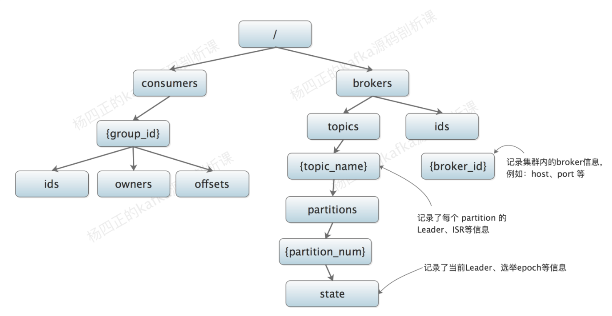
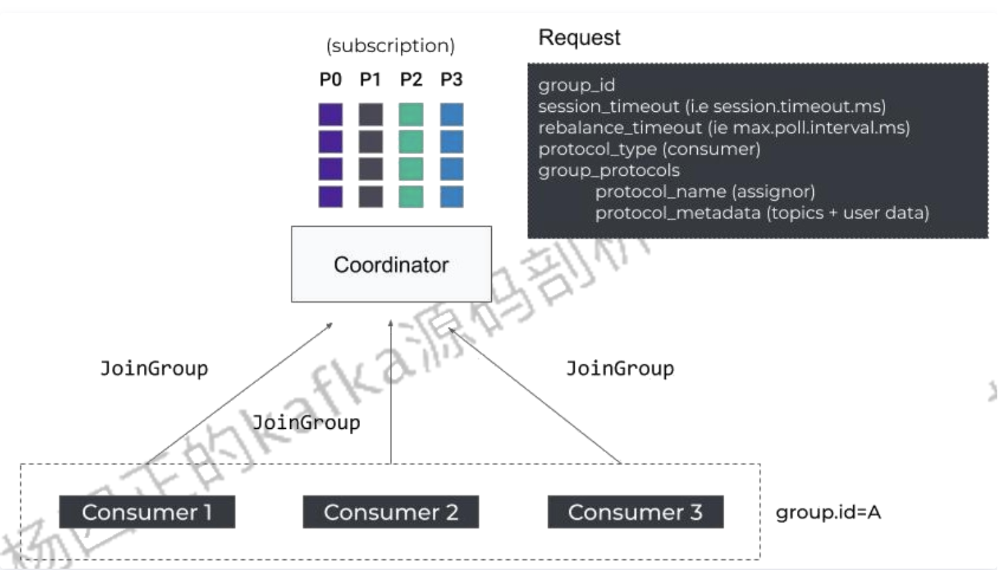
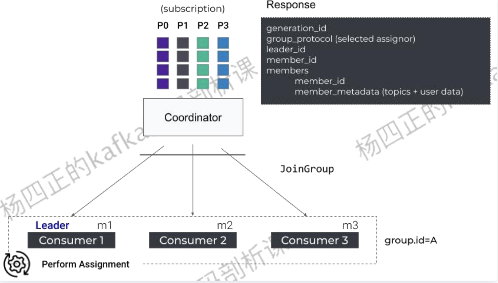
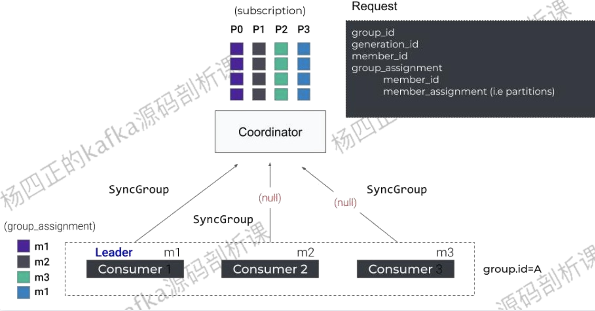
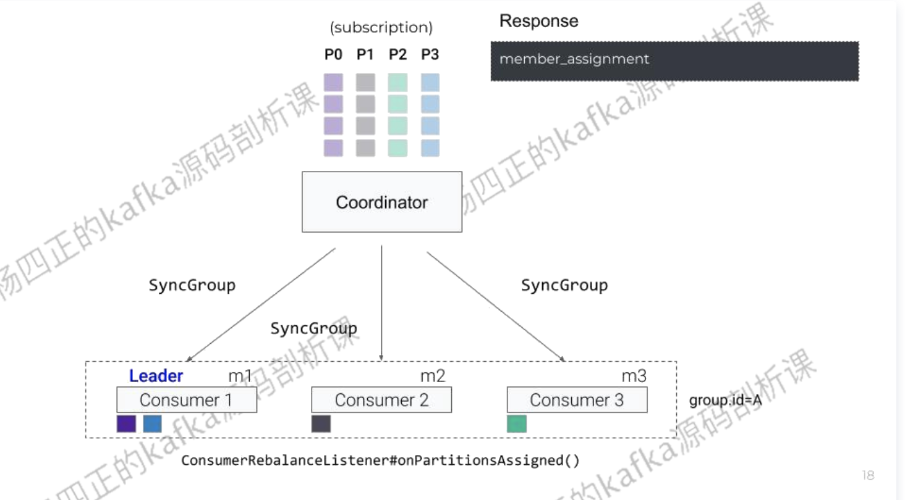
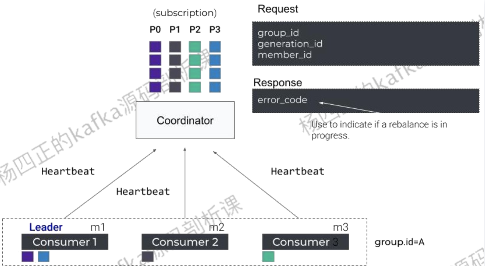
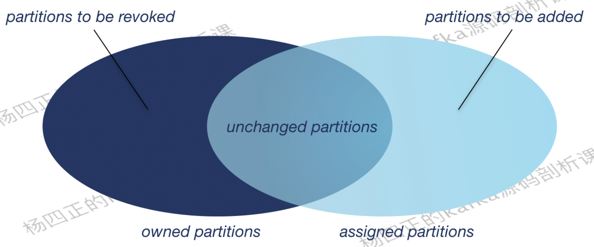

# 快速入门

本文内容来自《Apache kfka 源码刨析》，以及网络上的博客，有引用的博客我都会贴链接，感谢你们的分享帮助我们能够更快的阅读源码

> 网络上的博客：
>
> * https://cloud.tencent.com/developer/article/1821020
> * https://mp.weixin.qq.com/s/sFUvgaQUXSA8b4hshhbwOQ

# 简介

Apache Kafka 是一种分布式的，基于发布/订阅的消息系统，由Scala编写而成的，它具备快速，可扩展，可持久化的特点，Kafka有着下面这些特性，让其受到越来越到的开发人员的青睐

* 近乎实时性的消息处理能力。即使面对海量消息也能高效的存储以及查询消息（后面会解释是怎么设计实现的），Kakfka 将消息保存在磁盘中，在其设计中并不惧怕磁盘操作。他会以顺序读写的方式访问持久化到磁盘（可以利用到操作系统的Page cache 功能加速磁盘的读写）从而避免的读写磁盘导致的性能瓶颈
* Kafka 支持批量的读写消息，并且会对消息进行批量压缩，提高了网络利用率
* Kafka支持分区（partition）消息，保证分区中的消息是有序的，而分区之间可以并发操作，这样提高了Kafka的并发能力
* 并且分区（partition）是支持在线水平扩展的
* Kafka支持为每个分区（partition）创建多个副本，其中有一个partition会被选举为leader，负责读写，其他的follower 副本只负责和leader进行数据同步，并且Kafka会将这些follower均匀分布到集群的不同broker上，实现性能最大化以及提高数据的容灾能力

# Kafka的应用场景：

* 作为应用系统的消息中间件，实现消息的订阅/发布（解耦合）
* Kafka 也可用作系统总线，将其接入多个子系统，子系统会将产生的数据发送到Kafka，之后流转到墓地系统中
* Kafka还可以作为日志收集中心，多个系统产生的日志统一收集到Kafka中，然后由数据分析平台进行统一处理，日志会被Kafka持久化道磁盘，所以同时支持实时和离线数据处理
* 持久化中心，只要保证及时消费即可

# Kafka中的一些核心概念

## 消息

消息是Kafka中最基本的数据单元，消息由一串字节组成，主要是由key和value构成，key和value都是byte 数组，key 主要用于路由选择partition， 比如我们要使用顺序消息特性的时候，就需要对这个key做特殊处理，同一个key 的消息就会落到相同的partition中，就保证了消息的顺序。为了提高网络利用率，Kafka的生产者的消息是批量发送到broker的，并且会在发送之前对消息进行压缩

message 的默认大小限制是：1M
相关参数可以看Kafka的文档 https://kafka.apache.org/documentation/#brokerconfigs

## Topic & partition & log

topic 是用于存储消息的逻辑概念，可以看作一个消息集合，每个topic可以有多个生产者向其中push消息，也可以有任意多个消费者消费其中的消息。

topic可以被分成多个partition（每个topic至少有一个partition），同一个topic下面的不同partition的消息是不同的，每个消息被添加到partition中: 消息在被追加到分区日志文件的时候都会分配一个特定的偏移量(offset)，Kafka也通过offset保证消息的顺序性，offset的顺序性不垮分区，所以Kafka只保证同一个partition中的 消息是有序的

> Ps : partition 的选择是在 provider 发送端做的，发送端的client 中维护了服务端的源信息（topic -> partition (leader  , follower）以及他们对应的ip,port..... 等信息,在发送消息的时候会

**partition是Kafka水平扩展的基础，我们可以通过增加服务器（broker）并且在上面分配partition增加Kafka的并行处理能力**

partition在逻辑上对应了一个log，当生产者的消息写入到Kafka的partition的时候，实际上是写入到了partition对应的log中，log是一个逻辑概念，对应到磁盘上的一个文件夹，log由多个segment组成：每个segment对应了一个索引文件（稀疏索引），为了避免出现超大文件，每个日志文件的大小是有限制的(1G )，当超过限制后会创建新的segment，Kafka采用的是顺序I/O，所以只会向最新的segment追加数据，这样可以很好的利用操作系统的[page cache](https://zhuanlan.zhihu.com/p/68071761) 能力，[加速磁盘的读写从而避免的读写磁盘导致的性能瓶颈](https://blog.csdn.net/qian_348840260/article/details/108830550).

> **partition日志会存储在 <topic_name>_<partitionId> 目录下，然后再是会按照每个文件1G的大小分segment，每个segment做了一个稀疏索引文件**
>
> ps: page cache 中的一个页的大小一般是4k/8k，page cache 会有很多页

消息在broker 端也会涉及到消息压缩，目前支持的压缩方式有

zstd, lz4, snappy, gzip，不过配置的话是可以配置：

：uncompressed（不压缩）, zstd, lz4, snappy, gzip, producer（使用和生产者相同的压缩方式）

#### partition leader 崩溃恢复

崩溃broker（controler）会重新在ISR集合中选取leader https://blog.csdn.net/pengweismile/article/details/118072015

具体的做法是，Kafka在zk 有一个brokers的 Znode controller 会watch这个节点的变化，broker 在其中创建的都是临时节点，一旦断开心跳节点消失，watch 会通知到controler ，然后controller 会查到该挂掉的broker中有哪些partition是leader，然后会对这些partition做leader的重新选举，选举的方式很简单，直接在ISR集合（这个集合的数据变动也是有元数据做管理的）中找一个可用的节点即可，ISR集合中的节点维护的都是Kafka承诺可靠并完成消息commit的，在崩溃中丢失的非HW的消息会在client中通过callback获取到发送失败的消息，同样的HW后的数据对consumer也是不可见的

> ISR 同步是默认使用的同步方式
> 关于 ISR , HW 请阅读[AR,ISR,OSR,HW,LEO](#AR,ISR,OSR,HW,LEO)

## provider

* Send() 方法发送消息 实际上是放在了 Kafka client 中的 RecordAccumulator中等待后续批量发送

* flush 方法，刷新操作，等待RecordAccumulator中所有消息发送完成，在此期间会阻塞调用该方法的线程

* partitionsFor(Sting topic) 获取到topic对应的服务端的集群信息，该信息会定期刷新

* close : 关闭此producer对象，主要用来修改close标识，修改之后等待RecordAccumulator中所有消息清空，关闭sender线程 （reactor 单线程模式）

生产者的消息发送处理除了批量发送之外，还进行的了数据压缩，目前支持 gzip,snappy,lz4

partition的 sharding  也是在发送端控制的，如果有顺序性的要求需要指定sharding策略

### 发送顺序消息的时候怎么保证sharding 尽量均匀

1. 我们知道如果我们简单的使用类似 订单id来做分区控制，还是可以的，但是有的场景如果我们使用的是用户id,这个就会存在热点问题，有的用户操作频繁，如果这些用户的数据简单的通过uid取分区就回导致某一些分区的数据量要大很多，怎么解决呢？在分区的时候增加一些新的业务字段作为条件参与分区的选择
2. 选择一个散列性好的hash算法

## consumer

根据下文consumer group 中提到的 topic 的partition 和 consumer消费的关系，如果我们要在保证顺序性的条件下，充分利用机器资源，可以使用线程池，每一个线程单独做一个 consumer ，这样可以利用到单机的多核资源；

如果没有顺序要求，还可以设置成单机多consumer 多消费线程的两个线程池的模型


### **顺序消费怎么保证性能的前提去处理消费失败问题**

顺序消费中我们遇到消费某一条消息失败问题怎么处理，保证我们的消费性能不会被影响，然后导致消息积压或者实时性降低问题？

我这边的一种方式是，对于有顺序的消费场景，可以让这个顺序场景的几个消息的处理有序，比如一阶段落数据1，二阶段处理的时候查询一阶段有没有完成，如果没有完成就直接失败，同理如果第三阶段

这样处理失败的阶段直接重新发回kafka，让后续重试，这样可以不阻碍流程；或者记录下这些消息，然后使用定时任务去做补偿。

### 非顺序消费怎么保证性能的前提去处理消费失败问题

**非顺序消费**其实也类似，不过非顺序消费场景性能可以做到更快，因为可以异步多线程去消费多个消息。最后做一次offset的提交，这会遇到的问题是什么呢？比如你消费100条在多线程中处理。中间有失败的怎么处理呢？可以采用刚才顺序消费中的方式失败发回kafak或者找个地方存起来使用定时任务去做补偿。

**如果业务允许消息丢失，那么就不需要采取先落日志的策略，同时broker端也不必采取 ISR的ack可靠性策略**

https://www.cnblogs.com/buttercup/p/14208062.html

https://blog.csdn.net/weixin_42131628/article/details/113580928

## Consumer group

kafka 中多个consumer可以组成一个 consumer group ，一个consumer只能属于一个consumer group；同一个partition下的消息只会被相同的 consumer group 下的一个consumer 消费；不同consumer group间互不干扰，意味着如果希望实现“广播”消费，可以将每一个consumer放入一个独立的consumer group

consumer group 除了提供了 “独占”和“广播”模式的消息处理之外，它还可以实现消费者的水平扩展和故障转移

topic中的 partition 不管是”独占“还是“广播”，partition 都是唯一对应到一个consumer的，也就是说如果partition 和consumer数量刚好相等那就是1:1，如果 partition的数量大于consumer的数量那就会根据Kafka提供的负载均衡方法来分成分配，那就会出现多个partition对应到一个consumer ，但是不会出现一个partition被多个consumer消费的情况。这是Kafka保证消息有序的设计。


> kafka 中comsumer 负载partion 的策略有三种，通常选择粘性策略
>
> **Range**
>
> 这个是默认的策略。大概意思就是对消费者进行排序，排序越靠前的能够分配到更多的分区。
>
> 比如有3个分区，消费者A排序更靠前，所以能够分配到P0\P1两个分区，消费者B就只能分配到一个P2。
>
> 如果是4个分区的话，那么他们会刚好都是分配到2个。
>
> 
>
> 但是这个分配策略会有点小问题，他是根据主题进行分配，所以如果消费者组订阅了多个主题，那就有可能导致分区分配不均衡。
>
> 比如下图中两个主题的P0\P1都被分配给了A，这样A有4个分区，而B只有2个，如果这样的主题数量越多，那么不均衡就越严重。
>
> 
>
> **RoundRobin**
>
> 也就是我们常说的轮询了，这个就比较简单了，不画图你也能很容易理解。
>
> 这个会根据所有的partition进行轮询分配，不会出现Range那种主题越多可能导致分区分配不均衡的问题。
>
> P0->A，P1->B，P1->A。。。以此类推
>
> 
>
> **Sticky**
>
> 这个从字面看来意思就是粘性策略，大概是这个意思。主要考虑的是在分配均衡的前提下，让分区的分配更小的改动。
>
> 比如之前P0\P1分配给消费者A，那么下一次尽量还是分配给A。
>
> 这样的好处就是连接可以复用，要消费消息总是要和broker去连接的，如果能够保持上一次分配的分区的话，那么就不用频繁的销毁创建连接了。

### rebalance



当topic 下面consumer的数量发生变化的时候会触发，partition的 rebalance , 实现的方式是:每个consumer group 在 broker 会有一个唯一 GroupCoordinator一一对应（选举出来的），它是Kafka用于管理consumer group的组件，GroupCoordinator 会在zookeeper 维护consumer的元数据（有多少consumer，partition负载后的结果等）在每一次consumer加入或退出的时候，GroupCoordinator 会在完成负载均衡之后修改zookeeper的信息：负载是在客户端完成的，最终由GroupCoordinator来和zookeeper交互。为什么不让每个 consumer客户端和zookeeper交互的？因为可能发生 "羊群效应" / [“脑裂问题”](https://blog.csdn.net/zxylwj/article/details/103608916) （因为consumer链接到的是不同zookeeper结点，但是这时候发生了脑裂问题。读取到的数据长时间不一致就会导致负载均衡出现问题）

所以使用了中心化的 GroupCoordinator 来负责处理，同时GroupCoordinator只是维护分区的负载相关信息以及对consumer进行负载均衡分配：GroupCoordinator 会从可用的consumer中选一个做个 group leader（这个操作只会在唯一的 leader broker 上完成），然后获取当前配置的分区策略，最后将这些信息response给consumer，consumer收到消息确定自己是leader (只有是leader的consumer才能获取到所有信息)然后该consumer根据获取到的分区策略进行分区分配

> 1. 每个 consumer group 在服务端只会有唯一的一个 GroupCoordinator，
> 2. 当前 consumer 准备加入 consumer group 或 GroupCoordinator发生故障转移时，consumer 并不知道GroupCoordinator 的 host 和 port，所以 consumer 会向 Kafka 集群中的任一 broker 节点发送 FindCoordinatorRequest 请求，收到请求的 broker 节点会返回 ConsumerMetadataResponse 响应，其中就包含了负责管理该 Consumer Group 的 GroupCoordinator 的地址。
> 2.  接下来，consumer 会连接到 GroupCoordinator 节点，并周期性的发送心跳请求。GroupCoordinator 会通过心跳消费确定 consumer 是否正常在线，长时间收不到一个心跳信息时，GroupCoordinator 会认为 consumer 宕机了，就会为该 consumer group 触发新一轮的 Rebalance 操作。一个新的consumer的加入也会触发rebalance
> 2. 在 consumer 收到中带有 IllegalGeneration 异常的心跳响应时，就表明 GroupCoordinator 发起了 Rebalance 操作。此时 consumer 会向 GroupCoordinator 发送 JoinGroupRequest ，向 GroupCoordinator 表明自己要加入指定的Consumer Group。
> 2. groupCoordinator 等待一个 consumer group 中全部 consumer 都发送了 JoinGroupRequest 请求之后，就会结合Zookeeper 中的 partition 的元数据，进行 partition 的分配。
> 2.  GroupCoordinator 在分配完 partition 之后，会将 partition 与 consumer 之间的映射关系写入到 Zookeeper 中保存，同时还会将分配结果通过 JoinGroupResponse 返回给 consumer。
> 2. consumer 根据 JoinGroupResponse 响应中的分配结果消费对应的 partition，同时会定时发送HeartbeatRequest 请求表明自己在线。如果后续出现 **consumer 加入或下线**、**broker 上下线**、**partition 增加等状况**时，GroupCoordinator 返回的 HeartbeatResponse 会包含 IllegalGeneration 异常，接下来就会进入步骤3。
>
> 上述方案看起来已经比较完美的了，但是有个问题是 rebalance 的策略是在 GroupCoordinator 中实现的，扩展性上多多少少有点问题，当我们要使用新 rebalance 策略时，需要修改 GroupCoordinator 
>
> 所以有了改进：将rebalance这个动作交给了选举出来的 consumer leader  ，Kafka 0.9版本进行了改进
>
> 该版本的 rebalance 协议将 JoinGroupRequest 的处理过程拆分成了两个阶段，分别是 Join Group 阶段和 Synchronizing Group State 阶段。
>
> 1. 当 consumer 通过 FindCoordinatorRequest 查找到其 Consumer Group 对应的 GroupCoordinator 之后，就会进入 Join Group 阶段。
> 2. Consumer 先向 GroupCoordinator 发送 JoinGroupRequest 请求，其中包含 consumer 的相关信息
>
> 
>
> 3. GroupCoordinator 收到 JoinGroupRequest 后会暂存该 consumer 信息，然后等待全部 consumer 的 JoinGroupRequest 请求。JoinGroup Request 中的 `session.timeout.ms` 和 `rebalance_timeout_ms`（ `max.poll.interval.ms`）是就是用来告诉 GroupCoordinator 等待多久的。
>
> 4. GroupCoordinator 会根据全部 consumer 的 JoinGroupRequest 请求来确定 Consumer Group 中可用的 consumer，从中选取一个 consumer 成为 Group Leader，同时还会决定 partition 分配策略（这样就可以做到中心化可配置），最后会将这些信息封装成JoinGroupResponse 返回给 Group Leader Consumer
>
> 5. 每个 consumer 都会收到 JoinGroupResponse 响应，但是只有 Group Leader 收到的 JoinGroupResponse 响应中封装的所有 consumer 信息以及 Group Leader 信息。当其中一个 consumer 确定了自己的 Group Leader后，会根据 consumer 信息、kafka 集群元数据以及 partition 分配策略计算 partition 的分片结果。其他非 Group Leader consumer 收到 JoinResponse 为空响应，也就不会进行任何操作，只是原地等待。
>
>    
>
> 6. 接下来，所有 consumer 进入 Synchronizing Group State 阶段，所有 consumer 会向 GroupCoordinator 发送 SyncGroupRequest。其中，Group Leader Consumer 的 SyncGroupRequest 请求包含了 partition 分配结果，普通 consumer 的 SyncGroupRequest 为空请求。
>
>    
>
> 7. GroupCoordinator 接下来会将 partition 分配结果封装成 SyncGroupResponse 返回给所有 consumer。
>
>    
>
>  8. consumer 收到 SyncGroupResponse 后进行解析，就可以明确 partition 与 consumer 的映射关系。当然，后续 consumer 还是会与 GroupCoordinator 保持定期的心跳。触发 rebalance 的条件也是心跳响应中包含 IllegalGeneration 异常。
>
>     
>
> 但是这次改造还是有问题，因为在rebalance 的过程中，消费者们这时候不能消费任何 partition（这也是为什么在触发rebalance后消费变慢的原因）
>
> 为了解决上述问题，kafka 在 2.3 版本中引入了 Static Membership 协议来减少rebalance的发生
>
> - 在 consumer 端增加 `group.instance.id` 配置（`group.instance.id` 是 consumer 的唯一标识）。如果 consumer 启动的时候明确指定了 `group.instance.id` 配置值，consumer 会在 JoinGroup Request 中携带该值，表示该 consumer 为 static member。 为了保证 `group.instance.id` 的唯一性，我们可以考虑使用 hostname、ip 等。
> - 在 GroupCoordinator 端会记录 group.instance.id → member.id 的映射关系，以及已有的 partition 分配关系。当 GroupCoordinator 收到已知 group.instance.id 的 consumer 的 JoinGroup Request 时，不会进行 rebalance，而是将其原来对应的 partition 分配给它。
>
> Static Membership 协议可以让 consumer group 只在下面的 4 种情况下进行 rebalance：
>
> - 有新 consumer 加入 consumer group 时。
> - Group Leader 重新加入 Group 时。
> - consumer 下线时间超过阈值（ `session.timeout.ms`），也就是说在consumer下线时间没有超过阈值的时候，那部分partition会暂时没有消费者消费
> - GroupCoordinator 收到 static member 的 LeaveGroup Request 时。
>
> 这样的话，在使用 Static Membership 协议的场景下，只要在 consumer 重新部署的时候，不发送 LeaveGroup Request 且在 `session.timeout.ms` 时长内重启成功，就不会触发 rebalance。
>
> 在 kafka 2.4 版本中，为了进一步减少 rebalance 带来的 `Stop The World`，提出了 `Incremental Cooperative Rebalance(增量合作再平衡)` 协议。其核心思想就是将一次全局的 rebalance，改成多次小规模 rebalance，最终收敛到 rebalance 的状态。该协议是：
>
> - consumer 比较新旧两个 partition 分配结果，只停止消费被回收的 partition，对于两次都分配给自己的 partition，consumer 根本没有必要停止消费，这也就解决了 `Stop The World` 的问题。
>
> - 通过多轮的局部 rebalance 来最终实现全局的 rebalance。下面会通过示例说明每轮 rebalance 都做了什么。
>
>   
>
>   上图就展示了一个 consumer 在一次 rebalance 中比较操作： `owned partitions`和 `assigned partitions` 分别是该 consumer 在 rebalance 前后要处理的 partition 集合，其中，consumer 在整个 rebalance 过程中无需停止对 `unchanged partitions` 集合中 partition 的消费。
>
> 介绍完 Incremental Cooperative Rebalance 协议的核心思想之后，我们通过示例来说明 Incremental Cooperative Rebalance 协议的工作原理。
>
> 
>

**rebalenace 的详细过程**

**然后 kafka 2.4 版本中 新增了 Incremental Cooperative Rebalance 协议** 

**详情：https://cloud.tencent.com/developer/article/1832883**

> GroupCoordinator 中还维护了分区和consumer group 的消费关系。记录了consumer消费的offset （cunsumer 一次poll() 消费之后需要提交数据给到 GroupCoordinator ）

### rebalance 的触发条件

- `ConsumerGroup(消费组)`里的`Consumer(消费者)`发生变更(主动加入、主动离开、崩溃)，

  - 崩溃不一定就是指 consumer进程"挂掉"、 consumer进程所在的机器宕机、长时间GC、网络延迟，

    ```
    kafka0.10.1之前的版本，会在轮询消息或者提交偏移量时发送心跳 现在大家使用的版本都是有独立线程来发送心跳的。
    
    heartbeat.interval.ms : 3s
    
    The expected time between heartbeats to the consumer coordinator when using Kafka's group management facilities. Heartbeats are used to ensure that the consumer's session stays active and to facilitate rebalancing when new consumers join or leave the group. The value must be set lower than <code>session.timeout.ms</code>, but typically should be set no higher than 1/3 of that value. It can be adjusted even lower to control the expected time for normal rebalances.
    
    Kafka 的消费组管理的时候消费者协调器的心跳之间的预期时间。 心跳用于确保消费者的会话保持活动状态，并在新消费者加入或离开组时促进重新平衡。 该值必须设置为低于 <code>session.timeout.ms</code>，但通常不应设置为高于该值的 1/3。 它可以调整得更低，以控制正常重新平衡的预期时间。
    
    
    session.timeout.ms : 10s
    
    The timeout used to detect consumer failures when using Kafka's group management facility. The consumer sends periodic heartbeats to indicate its liveness to the broker. If no heartbeats are received by the broker before the expiration of this session timeout, then the broker will remove this consumer from the group and initiate a rebalance. Note that the value must be in the allowable range as configured in the broker configuration by <code>group.min.session.timeout.ms</code> and <code>group.max.session.timeout.ms</code>.
    
    Kafka 的消费组管理的时候用于检测消费者故障的超时。 消费者定期发送心跳以向代理指示其活跃度。 如果在此会话超时到期之前代理没有收到心跳，则代理将从组中删除此消费者并启动rebalance。 请注意，该值必须在代理配置中由 <code>group.min.session.timeout.ms</code> 和 <code>group.max.session.timeout.ms</code> 配置的允许范围内 .表示 consumer 向 broker 发送心跳的超时时间。例如 session.timeout.ms = 180000 表示在最长 180 秒内 broker 没收到 consumer 的心跳，那么 broker 就认为该 consumer 死亡了，会启动 rebalance。
    
    
    
    
    ```
    
  - 当 consumer无法在指定的时间内完成消息的处理，那么coordinator就认为该 consumer已经崩溃，从而引发新一轮 rebalance

    ```
    在 java 的consumer client代码中有 这样一个配置 
    
    max.poll.interval.ms : 30s
    
    The maximum delay between invocations of poll() when using consumer group management. This places an upper bound on the amount of time that the consumer can be idle before fetching more records. If poll() is not called before expiration of this timeout, then the consumer is considered failed and the group will rebalance in order to reassign the partitions to another member.
    
    意思是：消费组管理的时候，两次调用 poll() 之间的最大延迟。 这为消费者在获取更多记录之前可以空闲的时间设置了上限。 **如果在此超时到期之前未调用 poll()，则消费者被视为失败并且组将重新平衡以将分区重新分配给另一个成员。**
    ```
  
    

- 订阅`topic(主题)`的`partition(分区)`数量发生变更,比如使用命令行脚本增加了订阅 topic 的分区数

- 订阅`topic(主题)`的数量发生变更(比如使用正则表达式的方式订阅),当匹配正则表达式的新topic被创建时则会触发 rebalance。


## Retention Policy & Log compaction

对 kafka 有一定了解的同学可能知道，无论 message 是否已经被 consumer 消费，kafka 都会长时间保留 message 信息，这种设计是为了方便 consumer 回退到某个 offset，并重新开始消费。

但是，kafka 毕竟不是[数据库](https://cloud.tencent.com/solution/database?from=10680)，不应该一直保存历史 message，尤其是那些已经确定不会再使用的历史 message。我们可以通过修改 kafka 的 retention policy 配置（保留策略）来实现周期性清理历史 message 的效果。

kafka 默认提供了有两种 retention policy：

1. 根据 message 保留的时间进行清理的策略，其具体含义是：当一条 message 在 kafka 集群中保存的时间超过了指定阈值，就可以被后台线程清理掉
2. 根据 topic 占用磁盘大小进行清理的策略，其具体含义是：当 topic 的 log 大小大于一个阈值之后，则可以开始由后台线程删除最旧的 message。

kafka 的 retention policy 可以针对全部 topic 进行配置，还可以针对某个 topic 进行特殊的配置。 

除了 retention policy 之外，kafka 还提供了 log compaction（日志压缩）来减少磁盘占用量。我们知道 message 由 key 和 value 两部分构成， 如果一个 key 值对应的 value 值不断被更新，且 consumer 只关心最新的 value 值，那么我们就可以开启 log compaction 功能来压缩日志，核心原理是：

kafka 会启动一个后台压缩线程，定期将 key 相同的 message 进行合并，只保留最新的 value 值。

下图展示了一次 log compaction 的工作过程：


# Kafka 的可靠性保障

## AR,ISR,OSR,HW,LEO

leader 副本负责维护和跟踪 ISR 集合中所有 follower 副本的滞后状态， 当 follower 副本落后 太多或失效时， leader副本会把它从ISR集合中剔除。 如果OSR集合中有follower副本“追上’“了 leader副本，那么 leader副本会把它从 OSR集合转移至 ISR集合。 默认情况下， 当 leader副本发生故障时，只有在 ISR集合中的副本才有资格被选举为新的 leader， 而在 OSR集合中的副本则没有任何机会(不过这个原则也可以通过修改相应的参数配置来改变) 。

ISR 与 HW 和 LEO 也有紧密的关系 。 HW 是 High Watermark 的缩写，俗称高水位，它标识 了一个特定的消息偏移量(offset)，消费者只能拉取到这个 offset之前的消息。

如图 1-4 所示，它代表一个日志文件，这个日志文件中有 9 条消息，第一条消息的 offset (LogStartOffset)为 0，最后一条消息的 offset为 8, offset为 9 的消息用虚线框表示，代表下 一条待写入 的消息 。日志文件的 HW 为 6，表示消费者只能拉取到 offset 在 0 至 5 之间的消息， 而 offset 为 6 的消息对消 费者而言是不可见 的 。


LEO 是 Log End Offset 的缩写，它标识当前日志文件中下一条待写入消息 的 offset，图 1-4 中offset为9的位置即为当前日志文件的LEO, LEO的大小相当于当前日志分区中最后一条消 息的 offset值加 l**。分区 ISR集合中的每个副本都会维护自身的 LEO，而ISR集合中最小的LEO即为分区的 HW** ，对消费者而言只能消费 HW 之前的消息。

一个简单的示 例来进行相关的说明 。 如图 1-5 所示，假设某个分区的 ISR 集合中有 3 个副本，即一个 leader副本和 2 个 follower 副本，此时分区的 LEO 和 HW 都为 3。 会被先存入 leader 副本，如图 1-6 所示 。


在消息写入 leader 副本之后， follower 副本会发送拉取请求来拉取消息 3 和消息 4 以进行消息同步。

在同步过程中，不同的 follow 副本的同步效率也不尽相同。如图 1-7 所示， 在某一时刻 follower1完全跟上了 leader 副本而 follower2 只同步了消息 3，如此 leader 副本的 LEO 为 5, follower1的 LEO 为 5, follower2 的 LEO 为 4， 那么当前分区的 HW 取最小值 4，此时消费者可以消费到 offset为 0至 3 之间的消息。


写入消息(情形的如图 1-8 所示 ，所有的副本都成功 写入 了消息 3 和消息 4，整个分区的 HW 和 LEO 都变为 5，因此消费者可以消费到 offset为 4 的消息了 。


由此可见， Kafka 的复制机制既不是完全的同步复制，也不是单纯的异步复制。事实上， 同步复制要求所有能工作的 folower 副本都复制完，这条消息才会被确认为已成功提交，这种复制方式极大地影响了性能。而在异步复制方式下， follower 副本异步地从 leader 副本中复制数据，数据只要被 leader 副本写入就被认为已经成功提交。在这种情况下，如果 follower 副本都还没有复制完而落后于 leader 副本，突然 leader 副本着机，则会造成数据丢失。 Kafka 使用的这种 ISR 的方式则有效地权衡了数据消息的可靠性和性能之间的关系。


## 发送端

消息发送的时候可以采取

1. 发送并忘记，直接调用发送send方法，不管结果，虽然可以开启自动重试，但是肯定会有消息丢失的可能
2. 同步发送，同步发送返回Future对象，我们可以知道发送结果，然后进行处理
3. 异步发送，发送消息，同时指定一个回调函数，根据结果进行相应的处理

## 服务端

acks 参数配置：

1. 0：producer 不等待 broker 的 ack，这一操作提供了一个最低的延迟，broker 一接收到还没有写入磁盘就已经返回，当 broker 故障时有可能丢失数据；
2. 1：producer 等待 broker 的 ack，partition 的 leader 落盘成功后返回 ack，不管follower是否同步成功。如果在 follower 同步成功之前 leader 故障，那么将会丢失数据
3. -1（all）：producer 等待 broker 的 ack，partition 的 leader 和 follower （ISR里的follower，不是全部的follower）全部落盘成功后才返回 ack。但是如果在 follower 同步完成后，broker 发送 ack 之前，leader 发生故障，那么会造成数据重复 （这个功能需要partition具有多副本，如果只有一台机器，其实和1是一样的）

page cache 写入，因为通常是不会采用同步刷盘的，所以存在丢失的风险（**存在副本的情况下不可能都丢，所以我们通常需要最少2个副本，并且最好部署在不同的物理机上**），其实就算采用同步刷盘也有丢失风险，因为page cache 刷的数据是写到硬盘的一个自带的缓冲区中，并不是说直接刷到硬盘中

**采用ISR ack 策略，同时配置至少写入到一个副本才算成功**

## 消费端

消费者丢失的可能就比较简单，关闭自动提交位移即可，改为业务处理成功手动提交。

因为重平衡发生的时候，消费者会去读取上一次提交的偏移量，自动提交默认是每5秒一次，发生故障的时候这很容易导致重复消费。

`enable.auto.commit=false`，设置为手动提交。还没有提交前。机器挂了也可能重复消费，但是不会丢失消息，其中有两种提交方式

* 同步提交：可靠性提升，缺点会导致消费性能下降
  * 消费一条提交一条
  * 批量消费并提交多条
  * .....

* 异步提交：不保证一定提交，问题也不大，最多就是重复消费消息的问题

还有一个参数我们可能也需要考虑进去的：

`auto.offset.reset=earliest`，这个参数代表没有偏移量可以提交或者broker上不存在偏移量的时候，消费者如何处理。`earliest`代表从分区的开始位置读取，可能会重复读取消息，但是不会丢失，消费方一般我们肯定要自己保证幂等，另外一种`latest`表示从分区末尾读取，那就会有概率丢失消息。

综合这几个参数设置，我们就能保证消息不会丢失，保证了可靠性。

# 压缩

关于压缩，除了在生产者消费者介绍中的描述到的之外，总结下来就是

**Producer 端压缩、Broker 端保持、Consumer 端解压缩(会根据压缩的消息中的标识确定使用什么方法解压)。**

https://blog.csdn.net/qq_41049126/article/details/111247370

# 序列化

kakfa 可以指定对 key , value 所使用的序列化方法 ,需要注意的是 provider，consumer 要配置相同的序列化算法，不然会导致无法解析

默认的是：org.apache.kafka.common.serialization.StringSerializer

```
key.serializer:org.apache.kafka.common.serialization.StringSerializer
value.serializer:org.apache.kafka.common.serialization.StringSerializer
```

# 线程模型

## 客户端

客户端由于并发连接数较小，数据量较小，所以使用的是IO线程模型：Reactor 的单线程模式

其中selector 是用 org.apache.kafka.common.network.Selector , 在该类中采用组合的方式，包装了NIO的selector

 

链接服务器的核心方法：

```java
public void connect(String id, InetSocketAddress address, int sendBufferSize, int receiveBufferSize) throws IOException {
    this.ensureNotRegistered(id);
    SocketChannel socketChannel = SocketChannel.open();

    try {
        this.configureSocketChannel(socketChannel, sendBufferSize, receiveBufferSize);
        boolean connected = this.doConnect(socketChannel, address);
        SelectionKey key = this.registerChannel(id, socketChannel, 8);
        if (connected) {
            this.log.debug("Immediately connected to node {}", id);
            this.immediatelyConnectedKeys.add(key);
            key.interestOps(0);
        }

    } catch (RuntimeException | IOException var8) {
        socketChannel.close();
        throw var8;
    }
}

private SelectionKey registerChannel(String id, SocketChannel socketChannel, int interestedOps) throws IOException {
        SelectionKey key = socketChannel.register(this.nioSelector, interestedOps);
        KafkaChannel channel = this.buildAndAttachKafkaChannel(socketChannel, id, key);
        this.channels.put(id, channel);
        return key;
    }
```


## 服务端

IO线程模型：Reactor 主从多线程的模式


默认只有一个Acceptor， 也就是我们的 mainReactor, 也可以配置多个

|                             |                                                              |                               |
| --------------------------- | ------------------------------------------------------------ | ----------------------------- |
| listeners                   | 监听器配置,可以配置多个,配置了几个就会创建几个Acceptor       | listeners = PLAINTEXT://:9092 |
| num.network.threads         | 单个Acceptor创建Processor处理器的线程个数（处理链接之后的读写IO事件/ 控制命令） | 3                             |
| socket.send.buffer.bytes    | SocketServer的 SO_SNDBUF 缓冲区。如果值为 -1，将使用操作系统默认值。 | 102400 (100 kibibytes)        |
| socket.receive.buffer.bytes | SocketServer sockets 的SO_RCVBUF 缓冲区，如果值为 -1，将使用操作系统默认值 | 102400 (100 kibibytes)        |

Processor 线程类（ 也就是我们的 subReactor）：这是处理单个TCP 连接上所有请求的处理线程。每个Acceptor 实例创建若干个（num.network.threads）Processor 线程。Processor 线程负责将接收到的 SocketChannel(SocketChannel通道用于传输数据。), 注册读写事件,当数据传送过来的时候,会立即读取Request数据,通过解析之后, 然后将其添加到 RequestChannel 的 requestQueue 队列上，同时还负责将 Response 返还给 Request 发送方。然后工作线程池会去 requestQueue 中取任务执行

Kafka会采用简单的负载均衡方式找到注册连接数最少的selector，让不同的连接在不同的selector上面注册I/0事件 

> 线程池IO模型：https://www.cnblogs.com/colin-xun/p/11422594.html
>
> Kafka的服务端的IO比较详细的解释： https://blog.csdn.net/devcloud/article/details/123914181
>
> 补充一点：虽然Kafka引入了控制面（ControllerPlane）和数据面（DataPlane），将数据请求和控制命令请求做了隔离, 同时也做了线程的隔离（早期的kafka 是没有做这个隔离的，会导致如果多个consumer 来消费之前的数据（将处理读写的线程占满了），这时候page cache 很可能无法命中，就会去查询磁盘，如果磁盘出现了瓶颈，这时候就会阻碍到 控制命令的处理，比如心跳检测，导致心跳检查标记它宕机，从而触发重平衡，导致消费组无法消费，并且容易造成雪崩，该**集群中所有消费组全部不可消费**，其影响可想而知。 ）
>
> 但是默认情况下, ControllerPlane是没有设置的,也就是Controller相关的请求还是走的DataPlane。 想要隔离的话必须设置control.plane.listener.name .
>
> * 必须配置control.plane.listener.name
> * 控制器面板的RequestChannel中的requestQueue不是由queued.max.requests控制的,而是写死的 20. 因为控制类请求不会有那么大的并发
> * 跟DataPlane相关隔离,互不影响。但是连接限流ConnectionQuotas是共享的,限流的时候,两个是算在一起的
> * 控制类面板只有一个Acceptor和一个Processor,这个跟数据面板的区别是 DataPlane的Processor可以有多个。

# Kafka为什么快？

1. [线程模型](#线程模型)

    **provider,broker , consumer 都有使用到**

2. 序列化，反序列化 **provider,broker , consumer 都有使用到**

3. 消息批量压缩后发送，提高了网络利用率

   目前支持 zstd, lz4, snappy, gzip

   **zstd** 是后面加进来的一种方式（2016 Facebook 开源的新无损压缩算法优点是压缩率和压缩/解压缩性能都很突出。）

4. broker端也会有消息压缩

   目前支持 zstd, lz4, snappy, gzip，因为需要解压数据

   服务端的配置是可以配置：

   ：uncompressed（不压缩）, zstd, lz4, snappy, gzip, producer（使用和生产者相同的压缩方式）

5. 消息消费也是一批一批消息的拉取的

   > ps: Kafka 不会把一批消息再还原成多条消息，再一条一条地处理，这样太慢了。Kafka 这块儿处理的非常聪明，每批消息都会被当做一个“批消息”来处理。也就是说，在 Broker 整个处理流程中，无论是写入磁盘、从磁盘读出来、还是复制到其他副本这些流程中，批消息都不会被解开，一直是作为一条“批消息”来进行处理的。

6. IO使用顺序IO利用操作系统的 PageCache , 同时使用mmap 减少了一次 用户态数据到内核数据的拷贝 **broker使用到**

7. 在保证消息可靠性的前提下，提供了一个高性能的数据同步方案 ： ISR(In Sync replica) ， HighWatermark ,Log End Offset 设计 **broker使用到**

8. 不提供push 到consumer的能力，简化了设计，降低了这一块的性能损耗，而是将消息消费完全交给 consumer pull, consumer 可以根据offset 自己选择从哪里开始消费

9. partition 支持在线水平扩展，以提高并发能力

# 压缩算法比较

https://blog.csdn.net/shockang/article/details/116424217

# Kafka 的日志断如何读写的

https://mp.weixin.qq.com/s/68XX9qnEvDTCOw8gYLNBxQ

实际的**通过索引**查找消息过程是先通过offset找到索引所在的文件，然后在**<u>稀疏索引</u>通过二分法**找到离目标最近的索引offset，再顺序遍历消息文件找到目标文件。这波操作时间复杂度为`O(log2n)+O(m)`,n是索引文件里索引的个数，m为稀疏程度。
