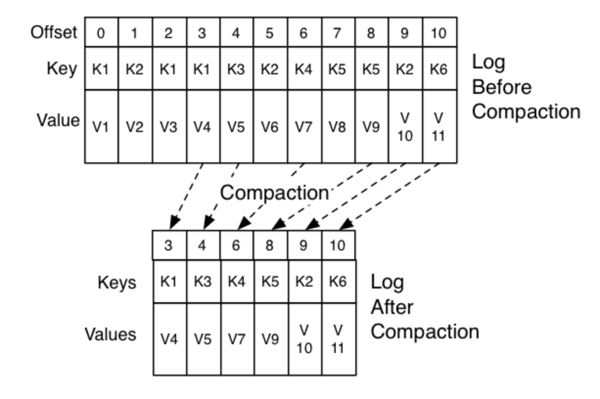

# 快速入门

本文内容来自《Apache kfka 源码刨析》

# 简介

Apache Kafka 是一种分布式的，基于发布/订阅的消息系统，由Scala编写而成的，它具备快速，可扩展，可持久化的特点，Kafka有着下面这些特性，让其受到越来越到的开发人员的青睐

* 近乎实时性的消息处理能力。即使面对海量消息也能高效的存储以及查询消息（后面会解释是怎么设计实现的），Kakfka 将消息包存在磁盘中，在其设计中并不惧怕磁盘操作。他会以顺序读写的方式访问池磁盘（可以利用到操作系统的Page cache 功能加速磁盘的读写）从而避免的读写磁盘导致的性能瓶颈
* Kafka 支持批量的读写消息，并且会对消息进行批量压缩，提高了网络利用率
* Kafka支持分区（partition）消息，保证分区中的消息是有序的，而分区之间可以并发操作，这样提高了Kafka的并发能力
* 并且分区（partition）是支持在线水平扩展的
* Kafka支持为每个分区（partition）创建多个副本，其中有一个partition会被选举为leader，负责读写，其他的follower 副本只负责和leader进行数据同步，并且Kafka会将这些follower均匀分布到集群的不同broker上，实现性能最大化以及提高数据的容灾能力

# Kafka的应用场景：

* 作为应用系统的消息中间件，实现消息的订阅/发布（解耦合）
* Kafka 也可用作系统总线，将其接入多个子系统，子系统会将产生的数据发送到Kafka，之后流转到墓地系统中
* Kafka还可以作为日志手机中心，多个系统产生的日志统一收集到Kafka中，然后由数据分析平台进行统一处理，日志会被Kafka持久化道磁盘，所以同时支持实时和离线数据处理

# Kafka中的一些核心概念

## 消息

消息是Kafka中最基本的数据单元，消息由一串子节住组成，主要是由key和value构成，key和value都是byte 数组，key 主要用于路由选择partition， 比如我们要使用顺序消息特性的时候，就需要对这个key做特殊处理，同一个key 的消息就会落到相同的partition中，就保证了消息的顺序。为了提高网络利用率，Kafka的生产者的消息是批量发送到broker的，并且会在发送之前对消息进行压缩

message 的默认大小限制是：1M
相关参数可以看Kafka的文档 https://kafka.apache.org/documentation/#brokerconfigs

## Topic & partition & log

topic 是用于存储消息的逻辑概念，可以看作一个消息集合，每个topic可以有多个生产者向其中push消息，也可以有任意多个消费者消费其中的消息。

topic可以被分成多个partition（每个topic至少有一个partition），同一个topic下面的不同partition的消息是不同的，每个消息被添加到partition中都会分配到一个offset，Kafka也通过offset保证消息的顺序性，offset的顺序性不垮分区，所以Kafka只保证同一个partition中的 消息是有序的(

> Ps : partition 的选择是在 provider 发送端做的，发送端的clinet 中维护了服务端的源信息（topic -> partition (leader  , follower）以及他们对应的ip,port..... 等信息,在发送消息的时候会

partition是Kafka水平扩展的基础，我们可以通过增加服务器（broker）并且在上面分配partition增加Kafka的并行处理能力

partition在逻辑上对应了一个log，当生产者的消息写入到Kafka的partition的时候，实际上是写入到了partition对应的log中，log是一个逻辑概念，对应到磁盘上的一个文件夹，log由多个segment组成：每个segment对应了一个索引文件（稀疏索引），为了避免出现超大文件，每个日志文件的大小是有限制的(1G )，当超过限制后会创建新的segment，Kafka采用的是顺序I/O，所以只会向最新的segment追加数据，这样可以很好的利用操作系统的[page cache](https://zhuanlan.zhihu.com/p/68071761) 能力，[加速磁盘的读写从而避免的读写磁盘导致的性能瓶颈](https://blog.csdn.net/qian_348840260/article/details/108830550).

> ps: page cache 中的一个页的大小一般是4k/8k

消息在broker 端 也会涉及到消息压缩，目前支持的压缩方式有

zstd, lz4, snappy, gzip，不过配置的话是可以配置：

：uncompressed（不压缩）, zstd, lz4, snappy, gzip, producer（使用和生产者相同的压缩方式）

## provider

* Send() 方法发送消息 实际上是放在了 Kafka client 中的 RecordAccumulator中等待后续批量发送

* flush 方法，刷新操作，等待RecordAccumulator中所有消息发送完成，在此期间会阻塞调用该方法的线程

* partitionsFor(Sting topic) 获取到topic对应的服务端的集群信息，该信息会定期刷新

* close : 关闭此producer对象，主要用来修改close标识，修改之后等待RecordAccumulator中所有消息清空，关闭sender线程 （reactor 单线程模式）

生产者的消息发送处理是批量发送之外，还进行的数据压缩，目前支持 gzip,snappy,lz4

## consumer


## Consumer group

kafka 中多个consumer可以组成一个 consumer group ，一个consumer只能属于一个consumer group；同一个下的消息只会被 相同的 consumer group 下一个consumer 消费；不同consumer group间互不干扰，意味着如果希望实现“广播”消费，可以将每一个consumer放入一个独立的consumer group


# 数据持久化



# 扩展与容灾

# 顺序保证

# 缓冲&峰值处理能力

# 异步通信

# 压缩

关于压缩，除了在生产者消费者介绍中的描述到的之外，总结下来就是

**Producer 端压缩、Broker 端保持、Consumer 端解压缩。**

https://blog.csdn.net/qq_41049126/article/details/111247370

# 序列化

kakfa 可以指定对 key , value 锁使用的序列化方法 ,需要注意的是 provider，consumer 要配置相同的序列化算法，不然会导致无法解析

默认的是：org.apache.kafka.common.serialization.Serde

# 线程模型

## 客户端

客户端由于并发连接数较小，数据量较小，所以使用的是IO线程模型：Reactor 的单线程模式

其中selector 是用 org.apache.kafka.common.network.Selector , 在该类中采用组合的方式，包装了NIO的selector

 

链接服务器的核心方法：

```java
public void connect(String id, InetSocketAddress address, int sendBufferSize, int receiveBufferSize) throws IOException {
    this.ensureNotRegistered(id);
    SocketChannel socketChannel = SocketChannel.open();

    try {
        this.configureSocketChannel(socketChannel, sendBufferSize, receiveBufferSize);
        boolean connected = this.doConnect(socketChannel, address);
        SelectionKey key = this.registerChannel(id, socketChannel, 8);
        if (connected) {
            this.log.debug("Immediately connected to node {}", id);
            this.immediatelyConnectedKeys.add(key);
            key.interestOps(0);
        }

    } catch (RuntimeException | IOException var8) {
        socketChannel.close();
        throw var8;
    }
}

private SelectionKey registerChannel(String id, SocketChannel socketChannel, int interestedOps) throws IOException {
        SelectionKey key = socketChannel.register(this.nioSelector, interestedOps);
        KafkaChannel channel = this.buildAndAttachKafkaChannel(socketChannel, id, key);
        this.channels.put(id, channel);
        return key;
    }
```


## 服务端

IO线程模型：Reactor 主从多线程的模式


默认只有一个Acceptor， 也就是我们的 mainReactor, 也可以配置多个

|                             |                                                              |                               |
| --------------------------- | ------------------------------------------------------------ | ----------------------------- |
| isteners                    | 监听器配置,可以配置多个,配置了几个就会创建几个Acceptor       | listeners = PLAINTEXT://:9092 |
| num.network.threads         | 单个Acceptor创建Processor处理器的线程个数（处理链接之后的读写IO事件/ 控制命令） | 3                             |
| socket.send.buffer.bytes    | SocketServer的 SO_SNDBUF 缓冲区。如果值为 -1，将使用操作系统默认值。 | 102400 (100 kibibytes)        |
| socket.receive.buffer.bytes | SocketServer sockets 的SO_RCVBUF 缓冲区，如果值为 -1，将使用操作系统默认值 | 102400 (100 kibibytes)        |

Processor 线程类（ 也就是我们的 subReactor）：这是处理单个TCP 连接上所有请求的处理线程。每个Acceptor 实例创建若干个（num.network.threads）Processor 线程。Processor 线程负责将接收到的 SocketChannel(SocketChannel通道用于传输数据。), 注册读写事件,当数据传送过来的时候,会立即读取Request数据,通过解析之后, 然后将其添加到 RequestChannel 的 requestQueue 队列上，同时还负责将 Response 返还给 Request 发送方。

Kafka会采用简单的负载均衡方式找到注册连接数最少的selector，让不同的连接在不同的selector上面注册I/0事件 

> 线程池IO模型：https://www.cnblogs.com/colin-xun/p/11422594.html
>
> Kafka的服务端的IO比较详细的解释： https://blog.csdn.net/devcloud/article/details/123914181
>
> 补充一点：虽然Kafka引入了控制面（ControllerPlane）和数据面（DataPlane），将数据请求和控制命令请求做了隔离, 同时也做了线程的隔离（早期的kafka 是没有做这个隔离的，会导致如果多个consumer 来消费之前的数据（将处理读写的线程占满了），这时候page cache 很可能无法命中，就会去查询磁盘，如果磁盘出现了瓶颈，这时候就会阻碍到 控制命令的处理，比如心跳检测，导致心跳检查标记它宕机，从而触发重平衡，导致消费组无法消费，并且容易造成雪崩，该**集群中所有消费组全部不可消费**，其影响可想而知。 ）
>
> 但是默认情况下, ControllerPlane是没有设置的,也就是Controller相关的请求还是走的DataPlane。 想要隔离的话必须设置control.plane.listener.name .
>
> * 必须配置control.plane.listener.name
> * 控制器面板的RequestChannel中的requestQueue不是由queued.max.requests控制的,而是写死的 20. 因为控制类请求不会有那么大的并发
> * 跟DataPlane相关隔离,互不影响。但是连接限流ConnectionQuotas是共享的,限流的时候,两个是算在一起的
> * 控制类面板只有一个Acceptor和一个Processor,这个跟数据面板的区别是 DataPlane的Processor可以有多个。

# Kafka为什么快？

1. [线程模型](#线程模型)

    **provider,broker , consumer 都有使用到**

2. 序列化，反序列化 **provider,broker , consumer 都有使用到**

3. 消息批量压缩后发送，提高了网络利用率

   目前支持 zstd, lz4, snappy, gzip

   **zstd** 是后面加进来的一种方式（2016 Facebook 开源的新无损压缩算法优点是压缩率和压缩/解压缩性能都很突出。）

4. broker端也会有消息压缩

   目前支持 zstd, lz4, snappy, gzip

   服务端的配置是可以配置：

   ：uncompressed（不压缩）, zstd, lz4, snappy, gzip, producer（使用和生产者相同的压缩方式）

5. 消息消费也是一批一批消息的拉取的

   > ps: Kafka 不会把一批消息再还原成多条消息，再一条一条地处理，这样太慢了。Kafka 这块儿处理的非常聪明，每批消息都会被当做一个“批消息”来处理。也就是说，在 Broker 整个处理流程中，无论是写入磁盘、从磁盘读出来、还是复制到其他副本这些流程中，批消息都不会被解开，一直是作为一条“批消息”来进行处理的。

6. IO使用顺序IO利用操作系统的 PageCache , 同时使用mmap 减少了一次 用户态数据到内核数据的拷贝 **broker使用到**

7. 在保证消息可靠性的前提下，提供了一个高性能的数据同步方案 ： ISR ， Hw ,LEO 设计 **broker使用到**

8. 不提供push 到consumer的能力，简化了设计，降低了这一块的性能损耗，而是将消息消费完全交给 consumer pull, consumer 可以根据offset 自己选择从哪里开始消费

9. partition 支持在线水平扩展，以提高并发能力

# 压缩算法比较

https://blog.csdn.net/shockang/article/details/116424217

