## Apache RocketMQ开发者指南

文章来自 GitHub https://github.com/apache/rocketmq/tree/master/docs/cn

# 概念和特性

## 概念

### 消息模型（Message Model）

RocketMQ主要由 Producer、Broker、Consumer 三部分组成，其中Producer 负责生产消息，Consumer 负责消费消息，Broker 负责存储消息。Broker 在实际部署过程中对应一台服务器，每个 Broker 可以存储多个Topic的消息，每个Topic的消息也可以分片存储于不同的 Broker。Message Queue 用于存储消息的物理地址，每个Topic中的消息地址存储于多个 Message Queue 中。ConsumerGroup 由多个Consumer 实例构成。

### 消息生产者（Producer）

负责生产消息，一般由业务系统负责生产消息。一个消息生产者会把业务应用系统里产生的消息发送到broker服务器。RocketMQ提供多种发送方式，同步发送、异步发送、顺序发送、单向发送（one way）。同步和异步方式均需要Broker返回确认信息，单向发送不需要。

### 消息消费者（Consumer）

负责消费消息，一般是后台系统负责异步消费。一个消息消费者会从Broker服务器拉取消息、并将其提供给应用程序。从用户应用的角度而言提供了两种消费形式：拉取式消费、推动式消费。

### 主题（Topic）

表示一类消息的集合，每个主题包含若干条消息，每条消息只能属于一个主题，是RocketMQ进行消息订阅的基本单位。

### 代理服务器（Broker Server）

消息中转角色，负责存储消息、转发消息。代理服务器在RocketMQ系统中负责接收从生产者发送来的消息并存储、同时为消费者的拉取请求作准备。代理服务器也存储消息相关的元数据，包括消费者组、消费进度偏移和主题和队列消息等。

### 名字服务（Name Server）

名称服务充当路由消息的提供者。生产者或消费者能够通过名字服务查找各主题相应的Broker IP列表。多个Namesrv实例组成集群，但相互独立，没有信息交换。

### 拉取式消费（Pull Consumer）

Consumer消费的一种类型，应用通常主动调用Consumer的拉消息方法从Broker服务器拉消息、主动权由应用控制。一旦获取了批量消息，应用就会启动消费过程。

### 推动式消费（Push Consumer）

Consumer消费的一种类型，该模式下Broker收到数据后会主动推送给消费端，该消费模式一般实时性较高。

### 生产者组（Producer Group）

同一类Producer的集合，这类Producer发送同一类消息且发送逻辑一致。如果发送的是事务消息且原始生产者在发送之后崩溃，则Broker服务器会联系同一生产者组的其他生产者实例以提交或回溯消费。

### 消费者组（Consumer Group）

同一类Consumer的集合，这类Consumer通常消费同一类消息且消费逻辑一致。消费者组使得在消息消费方面，实现负载均衡和容错的目标变得非常容易。要注意的是，消费者组的消费者实例必须订阅完全相同的Topic。RocketMQ 支持两种消息模式：集群消费（Clustering）和广播消费（Broadcasting）。

### 集群消费（Clustering）

集群消费模式下,相同Consumer Group的每个Consumer实例平均分摊消息。

### 广播消费（Broadcasting）

广播消费模式下，相同Consumer Group的每个Consumer实例都接收全量的消息。

### 普通顺序消息（Normal Ordered Message）

普通顺序消费模式下，消费者通过同一个消息队列（ Topic 分区，称作 Message Queue） 收到的消息是有顺序的，不同消息队列收到的消息则可能是无顺序的。

### 严格顺序消息（Strictly Ordered Message）

严格顺序消息模式下，消费者收到的所有消息均是有顺序的。

### 消息（Message）

消息系统所传输信息的物理载体，生产和消费数据的最小单位，每条消息必须属于一个主题。RocketMQ中每个消息拥有唯一的Message ID，且可以携带具有业务标识的Key。系统提供了通过Message ID和Key查询消息的功能。

### 标签（Tag）

为消息设置的标志，用于同一主题下区分不同类型的消息。来自同一业务单元的消息，可以根据不同业务目的在同一主题下设置不同标签。标签能够有效地保持代码的清晰度和连贯性，并优化RocketMQ提供的查询系统。消费者可以根据Tag实现对不同子主题的不同消费逻辑，实现更好的扩展性。

## 特性

## 订阅与发布

消息的发布是指某个生产者向某个topic发送消息；消息的订阅是指某个消费者关注了某个topic中带有某些tag的消息，进而从该topic消费数据。

## 2 消息顺序

消息有序指的是一类消息消费时，能按照发送的顺序来消费。例如：一个订单产生了三条消息分别是订单创建、订单付款、订单完成。消费时要按照这个顺序消费才能有意义，但是同时订单之间是可以并行消费的。RocketMQ可以严格的保证消息有序。

顺序消息分为全局顺序消息与分区顺序消息，全局顺序是指某个Topic下的所有消息都要保证顺序；部分顺序消息只要保证每一组消息被顺序消费即可。

- 全局顺序 对于指定的一个 Topic，所有消息按照严格的先入先出（FIFO）的顺序进行发布和消费。 适用场景：性能要求不高，所有的消息严格按照 FIFO 原则进行消息发布和消费的场景
- 分区顺序 对于指定的一个 Topic，所有消息根据 sharding key 进行区块分区。 同一个分区内的消息按照严格的 FIFO 顺序进行发布和消费。 Sharding key 是顺序消息中用来区分不同分区的关键字段，和普通消息的 Key 是完全不同的概念。 适用场景：性能要求高，以 sharding key 作为分区字段，在同一个区块中严格的按照 FIFO 原则进行消息发布和消费的场景。

### 消息过滤

RocketMQ的消费者可以根据Tag进行消息过滤，也支持自定义属性过滤。消息过滤目前是在Broker端实现的，优点是减少了对于Consumer无用消息的网络传输，缺点是增加了Broker的负担、而且实现相对复杂。

### 消息可靠性

RocketMQ支持消息的高可靠，影响消息可靠性的几种情况：

1. Broker非正常关闭
2. Broker异常Crash
3. OS Crash
4. 机器掉电，但是能立即恢复供电情况
5. 机器无法开机（可能是cpu、主板、内存等关键设备损坏）
6. 磁盘设备损坏

1)、2)、3)、4) 四种情况都属于硬件资源可立即恢复情况，RocketMQ在这四种情况下能保证消息不丢，或者丢失少量数据（依赖刷盘方式是同步还是异步）。

5)、6)属于单点故障，且无法恢复，一旦发生，在此单点上的消息全部丢失。RocketMQ在这两种情况下，通过异步复制，可保证99%的消息不丢，但是仍然会有极少量的消息可能丢失。通过同步双写技术可以完全避免单点，同步双写势必会影响性能，适合对消息可靠性要求极高的场合，例如与Money相关的应用。注：RocketMQ从3.0版本开始支持同步双写。

### 至少一次

至少一次(At least Once)指每个消息必须投递一次。Consumer先Pull消息到本地，消费完成后，才向服务器返回ack，如果没有消费一定不会ack消息，所以RocketMQ可以很好的支持此特性。

### 回溯消费

回溯消费是指Consumer已经消费成功的消息，由于业务上需求需要重新消费，要支持此功能，Broker在向Consumer投递成功消息后，消息仍然需要保留。并且重新消费一般是按照时间维度，例如由于Consumer系统故障，恢复后需要重新消费1小时前的数据，那么Broker要提供一种机制，可以按照时间维度来回退消费进度。RocketMQ支持按照时间回溯消费，时间维度精确到毫秒。

### 事务消息

RocketMQ事务消息（Transactional Message）是指应用本地事务和发送消息操作可以被定义到全局事务中，要么同时成功，要么同时失败。RocketMQ的事务消息提供类似 X/Open XA 的分布事务功能，通过事务消息能达到分布式事务的最终一致。

> https://blog.csdn.net/qq_36654870/article/details/107079525
>
> https://www.jianshu.com/p/0ccb6f094226

### 定时消息

定时消息（延迟队列）是指消息发送到broker后，不会立即被消费，等待特定时间投递给真正的topic。 broker有配置项messageDelayLevel，默认值为“1s 5s 10s 30s 1m 2m 3m 4m 5m 6m 7m 8m 9m 10m 20m 30m 1h 2h”，18个level。可以配置自定义messageDelayLevel。注意，messageDelayLevel是broker的属性，不属于某个topic。发消息时，设置delayLevel等级即可：msg.setDelayLevel(level)。level有以下三种情况：

- level == 0，消息为非延迟消息
- 1<=level<=maxLevel，消息延迟特定时间，例如level==1，延迟1s
- level > maxLevel，则level== maxLevel，例如level==20，延迟2h

定时消息会暂存在名为SCHEDULE_TOPIC_XXXX的topic中，并根据delayTimeLevel存入特定的queue，queueId = delayTimeLevel – 1，即一个queue只存相同延迟的消息，保证具有相同发送延迟的消息能够顺序消费。broker会调度地消费SCHEDULE_TOPIC_XXXX，将消息写入真实的topic。

需要注意的是，定时消息会在第一次写入和调度写入真实topic时都会计数，因此发送数量、tps都会变高。

### 消息重试

Consumer消费消息失败后，要提供一种重试机制，令消息再消费一次。Consumer消费消息失败通常可以认为有以下几种情况：

- 由于消息本身的原因，例如反序列化失败，消息数据本身无法处理（例如话费充值，当前消息的手机号被注销，无法充值）等。这种错误通常需要跳过这条消息，再消费其它消息，而这条失败的消息即使立刻重试消费，99%也不成功，所以最好提供一种定时重试机制，即过10秒后再重试。
- 由于依赖的下游应用服务不可用，例如db连接不可用，外系统网络不可达等。遇到这种错误，即使跳过当前失败的消息，消费其他消息同样也会报错。这种情况建议应用sleep 30s，再消费下一条消息，这样可以减轻Broker重试消息的压力。

RocketMQ会为每个消费组都设置一个Topic名称为“%RETRY%+consumerGroup”的重试队列（这里需要注意的是，这个Topic的重试队列是针对消费组，而不是针对每个Topic设置的），用于暂时保存因为各种异常而导致Consumer端无法消费的消息。考虑到异常恢复起来需要一些时间，会为重试队列设置多个重试级别，每个重试级别都有与之对应的重新投递延时，重试次数越多投递延时就越大。RocketMQ对于重试消息的处理是先保存至Topic名称为“SCHEDULE_TOPIC_XXXX”的延迟队列中，后台定时任务按照对应的时间进行Delay后重新保存至“%RETRY%+consumerGroup”的重试队列中。

### 消息重投

生产者在发送消息时，同步消息失败会重投，异步消息有重试，oneway没有任何保证。消息重投保证消息尽可能发送成功、不丢失，但可能会造成消息重复，消息重复在RocketMQ中是无法避免的问题。消息重复在一般情况下不会发生，当出现消息量大、网络抖动，消息重复就会是大概率事件。另外，生产者主动重发、consumer负载变化也会导致重复消息。如下方法可以设置消息重试策略：

- retryTimesWhenSendFailed:同步发送失败重投次数，默认为2，因此生产者会最多尝试发送retryTimesWhenSendFailed + 1次。不会选择上次失败的broker，尝试向其他broker发送，最大程度保证消息不丢。超过重投次数，抛出异常，由客户端保证消息不丢。当出现RemotingException、MQClientException和部分MQBrokerException时会重投。
- retryTimesWhenSendAsyncFailed:异步发送失败重试次数，异步重试不会选择其他broker，仅在同一个broker上做重试，不保证消息不丢。
- retryAnotherBrokerWhenNotStoreOK:消息刷盘（主或备）超时或slave不可用（返回状态非SEND_OK），是否尝试发送到其他broker，默认false。十分重要消息可以开启。

### 流量控制

生产者流控，因为broker处理能力达到瓶颈；消费者流控，因为消费能力达到瓶颈。

生产者流控：

- commitLog文件被锁时间超过osPageCacheBusyTimeOutMills时，参数默认为1000ms，返回流控。
- 如果开启transientStorePoolEnable == true，且broker为异步刷盘的主机，且transientStorePool中资源不足，拒绝当前send请求，返回流控。
- broker每隔10ms检查send请求队列头部请求的等待时间，如果超过waitTimeMillsInSendQueue，默认200ms，拒绝当前send请求，返回流控。
- broker通过拒绝send 请求方式实现流量控制。

注意，生产者流控，不会尝试消息重投。

消费者流控：

- 消费者本地缓存消息数超过pullThresholdForQueue时，默认1000。
- 消费者本地缓存消息大小超过pullThresholdSizeForQueue时，默认100MB。
- 消费者本地缓存消息跨度超过consumeConcurrentlyMaxSpan时，默认2000。

消费者流控的结果是降低拉取频率。

### 死信队列

死信队列用于处理无法被正常消费的消息。当一条消息初次消费失败，消息队列会自动进行消息重试；达到最大重试次数后，若消费依然失败，则表明消费者在正常情况下无法正确地消费该消息，此时，消息队列 不会立刻将消息丢弃，而是将其发送到该消费者对应的特殊队列中。

RocketMQ将这种正常情况下无法被消费的消息称为死信消息（Dead-Letter Message），将存储死信消息的特殊队列称为死信队列（Dead-Letter Queue）。在RocketMQ中，可以通过使用console控制台对死信队列中的消息进行重发来使得消费者实例再次进行消费。

# 架构设计

## 架构

### 技术架构

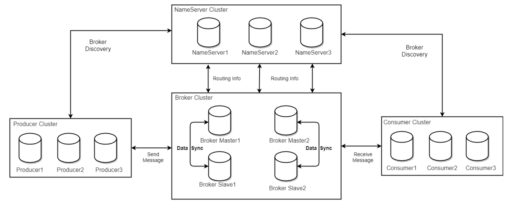

RocketMQ架构上主要分为四部分，如上图所示:

- Producer：消息发布的角色，支持分布式集群方式部署。Producer通过MQ的负载均衡模块选择相应的Broker集群队列进行消息投递，投递的过程支持快速失败并且低延迟。
- Consumer：消息消费的角色，支持分布式集群方式部署。支持以push推，pull拉两种模式对消息进行消费。同时也支持集群方式和广播方式的消费，它提供实时消息订阅机制，可以满足大多数用户的需求。
- NameServer：NameServer是一个非常简单的Topic路由注册中心，其角色类似Dubbo中的zookeeper，支持Broker的动态注册与发现。主要包括两个功能：Broker管理，NameServer接受Broker集群的注册信息并且保存下来作为路由信息的基本数据。然后提供心跳检测机制，检查Broker是否还存活；路由信息管理，每个NameServer将保存关于Broker集群的整个路由信息和用于客户端查询的队列信息。然后Producer和Conumser通过NameServer就可以知道整个Broker集群的路由信息，从而进行消息的投递和消费。NameServer通常也是集群的方式部署，各实例间相互不进行信息通讯。Broker是向每一台NameServer注册自己的路由信息，所以每一个NameServer实例上面都保存一份完整的路由信息。当某个NameServer因某种原因下线了，Broker仍然可以向其它NameServer同步其路由信息，Producer和Consumer仍然可以动态感知Broker的路由的信息。
- BrokerServer：Broker主要负责消息的存储、投递和查询以及服务高可用保证，为了实现这些功能，Broker包含了以下几个重要子模块。
  1. Remoting Module：整个Broker的实体，负责处理来自Client端的请求。
  2. Client Manager：负责管理客户端(Producer/Consumer)和维护Consumer的Topic订阅信息。
  3. Store Service：提供方便简单的API接口处理消息存储到物理硬盘和查询功能。
  4. HA Service：高可用服务，提供Master Broker 和 Slave Broker之间的数据同步功能。
  5. Index Service：根据特定的Message key对投递到Broker的消息进行索引服务，以提供消息的快速查询。

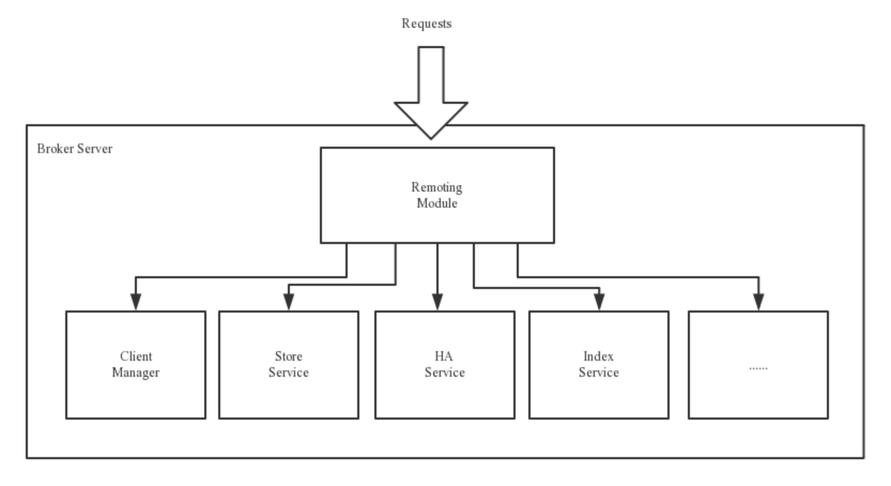

### 部署架构

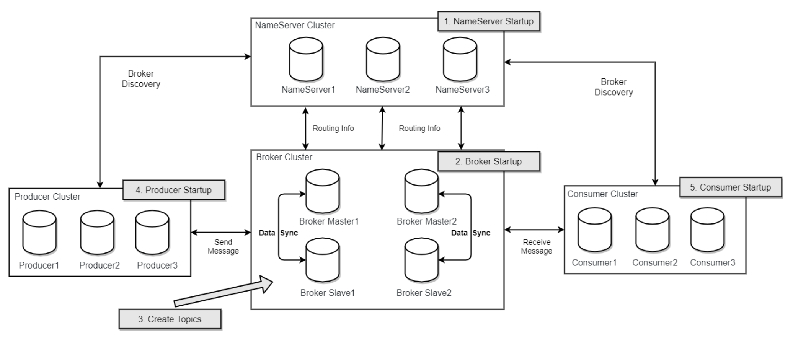

**RocketMQ 网络部署特点**

- NameServer是一个几乎无状态节点，可集群部署，节点之间无任何信息同步。
- Broker部署相对复杂，Broker分为Master与Slave，一个Master可以对应多个Slave，但是一个Slave只能对应一个Master，Master与Slave 的对应关系通过指定相同的BrokerName，不同的BrokerId 来定义，BrokerId为0表示Master，非0表示Slave。Master也可以部署多个。每个Broker与NameServer集群中的所有节点建立长连接，定时注册Topic信息到所有NameServer。 注意：当前RocketMQ版本在部署架构上支持一Master多Slave，但只有BrokerId=1的从服务器才会参与消息的读负载。
- Producer与NameServer集群中的其中一个节点（随机选择）建立长连接，定期从NameServer获取Topic路由信息，并向提供Topic 服务的Master建立长连接，且定时向Master发送心跳。Producer完全无状态，可集群部署。
- Consumer与NameServer集群中的其中一个节点（随机选择）建立长连接，定期从NameServer获取Topic路由信息，并向提供Topic服务的Master、Slave建立长连接，且定时向Master、Slave发送心跳。Consumer既可以从Master订阅消息，也可以从Slave订阅消息，消费者在向Master拉取消息时，Master服务器会根据拉取偏移量与最大偏移量的距离（判断是否读老消息，产生读I/O），以及从服务器是否可读等因素建议下一次是从Master还是Slave拉取。

结合部署架构图，描述集群工作流程：

- 启动NameServer，NameServer起来后监听端口，等待Broker、Producer、Consumer连上来，相当于一个路由控制中心。
- Broker启动，跟所有的NameServer保持长连接，定时发送心跳包。心跳包中包含当前Broker信息(IP+端口等)以及存储所有Topic信息。注册成功后，NameServer集群中就有Topic跟Broker的映射关系。
- 收发消息前，先创建Topic，创建Topic时需要指定该Topic要存储在哪些Broker上，也可以在发送消息时自动创建Topic。
- Producer发送消息，启动时先跟NameServer集群中的其中一台建立长连接，并从NameServer中获取当前发送的Topic存在哪些Broker上，轮询从队列列表中选择一个队列，然后与队列所在的Broker建立长连接从而向Broker发消息。
- Consumer跟Producer类似，跟其中一台NameServer建立长连接，获取当前订阅Topic存在哪些Broker上，然后直接跟Broker建立连接通道，开始消费消息。

## 设计

### 消息存储

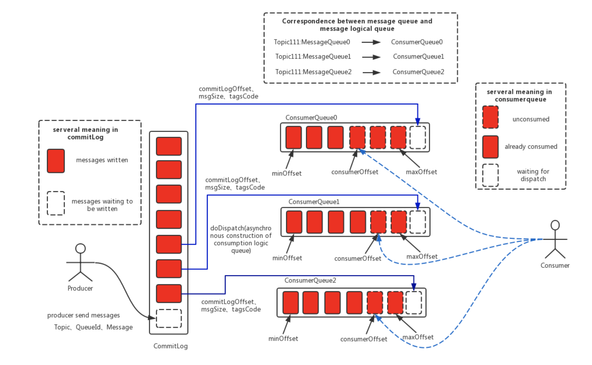

消息存储是RocketMQ中最为复杂和最为重要的一部分，本节将分别从RocketMQ的消息存储整体架构、**PageCache**与**Mmap内存映射**以及**RocketMQ中两种不同的刷盘方式**三方面来分别展开叙述。

#### 消息存储整体架构

消息存储架构图中主要有下面三个跟消息存储相关的文件构成。

(1) CommitLog：消息主体以及元数据的存储主体，存储Producer端写入的消息主体内容,消息内容不是定长的。单个文件大小默认1G, 文件名长度为20位，左边补零，剩余为起始偏移量，比如00000000000000000000代表了第一个文件，起始偏移量为0，文件大小为1G=1073741824；当第一个文件写满了，第二个文件为00000000001073741824，起始偏移量为1073741824，以此类推。消息主要是顺序写入日志文件，当文件满了，写入下一个文件；

(2) ConsumeQueue：消息消费队列，引入的目的主要是提高消息消费的性能，由于RocketMQ是基于主题topic的订阅模式，消息消费是针对主题进行的，如果要遍历commitlog文件中根据topic检索消息是非常低效的。Consumer即可根据ConsumeQueue来查找待消费的消息。其中，ConsumeQueue（逻辑消费队列）作为消费消息的索引，保存了指定Topic下的队列消息在CommitLog中的起始物理偏移量offset，消息大小size和消息Tag的HashCode值。consumequeue文件可以看成是基于topic的commitlog索引文件，故consumequeue文件夹的组织方式如下：topic/queue/file三层组织结构，具体存储路径为：$HOME/store/consumequeue/{topic}/{queueId}/{fileName}。同样consumequeue文件采取定长设计，每一个条目共20个字节，分别为8字节的commitlog物理偏移量、4字节的消息长度、8字节tag hashcode，单个文件由30W个条目组成，可以像数组一样随机访问每一个条目，每个ConsumeQueue文件大小约5.72M；

(3) IndexFile：IndexFile（索引文件）提供了一种可以通过key或时间区间来查询消息的方法。Index文件的存储位置是：$HOME \store\index${fileName}，文件名fileName是以创建时的时间戳命名的，固定的单个IndexFile文件大小约为400M，一个IndexFile可以保存 2000W个索引，IndexFile的底层存储设计为在文件系统中实现HashMap结构，故rocketmq的索引文件其底层实现为hash索引。

在上面的RocketMQ的消息存储整体架构图中可以看出，RocketMQ采用的是混合型的存储结构，即为Broker单个实例下所有的队列共用一个日志数据文件（**即为CommitLog**）来存储。

RocketMQ的混合型存储结构(**多个Topic的消息实体内容都存储于一个CommitLog中**)针对Producer和Consumer分别采用了数据和索引部分相分离的存储结构.

Producer发送消息至Broker端，然后Broker端使用同步或者异步的方式对消息刷盘持久化，保存至CommitLog中。只要消息被刷盘持久化至磁盘文件CommitLog中，那么Producer发送的消息就不会丢失。

正因为如此，Consumer也就肯定有机会去消费这条消息。当无法拉取到消息后，可以等下一次消息拉取，同时服务端也支持长轮询模式，如果一个消息拉取请求未拉取到消息，Broker允许等待30s的时间，只要这段时间内有新消息到达，将直接返回给消费端。这里，RocketMQ的具体做法是，使用Broker端的后台服务线程—ReputMessageService不停地分发请求并异步构建ConsumeQueue（逻辑消费队列）和IndexFile（索引文件）数据。

#### 页缓存与内存映射

页缓存（PageCache)是OS对文件的缓存，用于加速对文件的读写。一般来说，程序对文件进行顺序读写的速度几乎接近于内存的读写速度，主要原因就是由于OS使用PageCache机制对读写访问操作进行了性能优化，将一部分的内存用作PageCache。对于数据的写入，OS会先写入至Cache内，随后通过异步的方式由pdflush内核线程将Cache内的数据刷盘至物理磁盘上。对于数据的读取，如果一次读取文件时出现未命中PageCache的情况，OS从物理磁盘上访问读取文件的同时，会顺序对其他相邻块的数据文件进行预读取。

在RocketMQ中，ConsumeQueue逻辑消费队列存储的数据较少，并且是顺序读取，在page cache机制的预读取作用下，Consume Queue文件的读性能几乎接近读内存，即使在有消息堆积情况下也不会影响性能。而对于CommitLog消息存储的日志数据文件来说，读取消息内容时候会产生较多的随机访问读取，严重影响性能。如果选择合适的系统IO调度算法，比如设置调度算法为“Deadline”（此时块存储采用SSD的话），随机读的性能也会有所提升。

另外，RocketMQ主要通过MappedByteBuffer对文件进行读写操作。其中，利用了NIO中的FileChannel模型将磁盘上的物理文件直接映射到用户态的内存地址中（这种Mmap的方式减少了传统IO将磁盘文件数据在操作系统内核地址空间的缓冲区和用户应用程序地址空间的缓冲区之间来回进行拷贝的性能开销），将对文件的操作转化为直接对内存地址进行操作，从而极大地提高了文件的读写效率（正因为需要使用内存映射机制，故RocketMQ的文件存储都使用定长结构来存储，方便一次将整个文件映射至内存）。

#### 消息刷盘

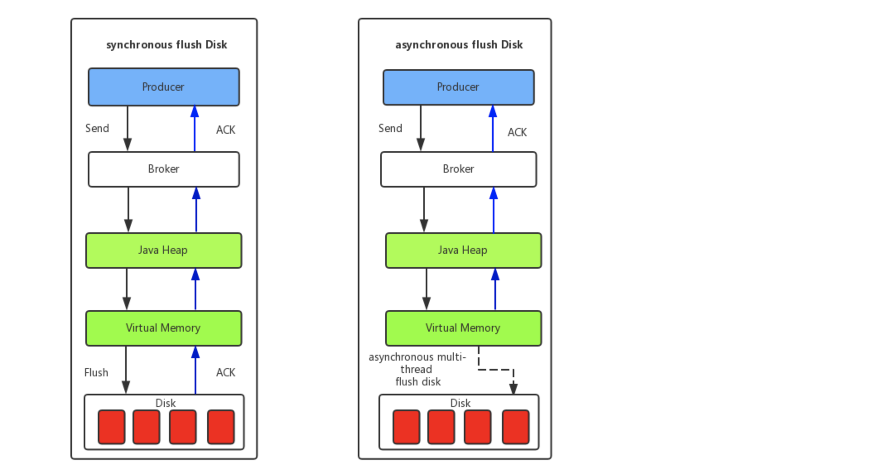

(1) 同步刷盘：如上图所示，只有在消息真正持久化至磁盘后RocketMQ的Broker端才会真正返回给Producer端一个成功的ACK响应。**同步刷盘对MQ消息可靠性来说是一种不错的保障，但是性能上会有较大影响，一般适用于金融业务应用该模式较多。**

(2) 异步刷盘：能够充分利用OS的PageCache的优势，只要消息写入PageCache即可将成功的ACK返回给Producer端。消息刷盘采用后台异步线程提交的方式进行，降低了读写延迟，提高了MQ的性能和吞吐量。

### 通信机制

RocketMQ消息队列集群主要包括NameServer、Broker(Master/Slave)、Producer、Consumer4个角色，基本通讯流程如下：

(1) Broker启动后需要完成一次将自己注册至NameServer的操作；随后每隔30s时间定时向NameServer上报Topic路由信息。

(2) 消息生产者Producer作为客户端发送消息时候，需要根据消息的Topic从本地缓存的TopicPublishInfoTable获取路由信息。如果没有则更新路由信息会从NameServer上重新拉取，同时Producer会默认每隔30s向NameServer拉取一次路由信息。

(3) 消息生产者Producer根据2）中获取的路由信息选择一个队列（MessageQueue）进行消息发送；Broker作为消息的接收者接收消息并落盘存储。

(4) 消息消费者Consumer根据2）中获取的路由信息，并再完成客户端的负载均衡后，选择其中的某一个或者某几个消息队列来拉取消息并进行消费。

从上面1）~3）中可以看出在消息生产者, Broker和NameServer之间都会发生通信（这里只说了MQ的部分通信），因此如何设计一个良好的网络通信模块在MQ中至关重要，它将决定RocketMQ集群整体的消息传输能力与最终的性能。

rocketmq-remoting 模块是 RocketMQ消息队列中负责网络通信的模块，它几乎被其他所有需要网络通信的模块（诸如rocketmq-client、rocketmq-broker、rocketmq-namesrv）所依赖和引用。为了实现客户端与服务器之间高效的数据请求与接收，RocketMQ消息队列自定义了通信协议并在Netty的基础之上扩展了通信模块。

#### Remoting通信类结构

#### 协议设计与编解码

在Client和Server之间完成一次消息发送时，需要对发送的消息进行一个协议约定，因此就有必要自定义RocketMQ的消息协议。同时，为了高效地在网络中传输消息和对收到的消息读取，就需要对消息进行编解码。在RocketMQ中，RemotingCommand这个类在消息传输过程中对所有数据内容的封装，不但包含了所有的数据结构，还包含了编码解码操作。

| Header字段 | 类型                    | Request说明                                                  | Response说明                             |
| ---------- | ----------------------- | ------------------------------------------------------------ | ---------------------------------------- |
| code       | int                     | 请求操作码，应答方根据不同的请求码进行不同的业务处理         | 应答响应码。0表示成功，非0则表示各种错误 |
| language   | LanguageCode            | 请求方实现的语言                                             | 应答方实现的语言                         |
| version    | int                     | 请求方程序的版本                                             | 应答方程序的版本                         |
| opaque     | int                     | 相当于requestId，在同一个连接上的不同请求标识码，与响应消息中的相对应 | 应答不做修改直接返回                     |
| flag       | int                     | 区分是普通RPC还是onewayRPC的标志                             | 区分是普通RPC还是onewayRPC的标志         |
| remark     | String                  | 传输自定义文本信息                                           | 传输自定义文本信息                       |
| extFields  | HashMap<String, String> | 请求自定义扩展信息                                           | 响应自定义扩展信息                       |

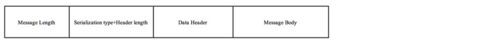

可见传输内容主要可以分为以下4部分：

(1) 消息长度：总长度，四个字节存储，占用一个int类型；

(2) 序列化类型&消息头长度：同样占用一个int类型，第一个字节表示序列化类型，后面三个字节表示消息头长度；

(3) 消息头数据：经过序列化后的消息头数据；

(4) 消息主体数据：消息主体的二进制字节数据内容；

#### 消息的通信方式和流程

在RocketMQ消息队列中支持通信的方式主要有同步(sync)、异步(async)、单向(oneway) 三种。其中“单向”通信模式相对简单，一般用在发送心跳包场景下，无需关注其Response。这里，主要介绍RocketMQ的异步通信流程。

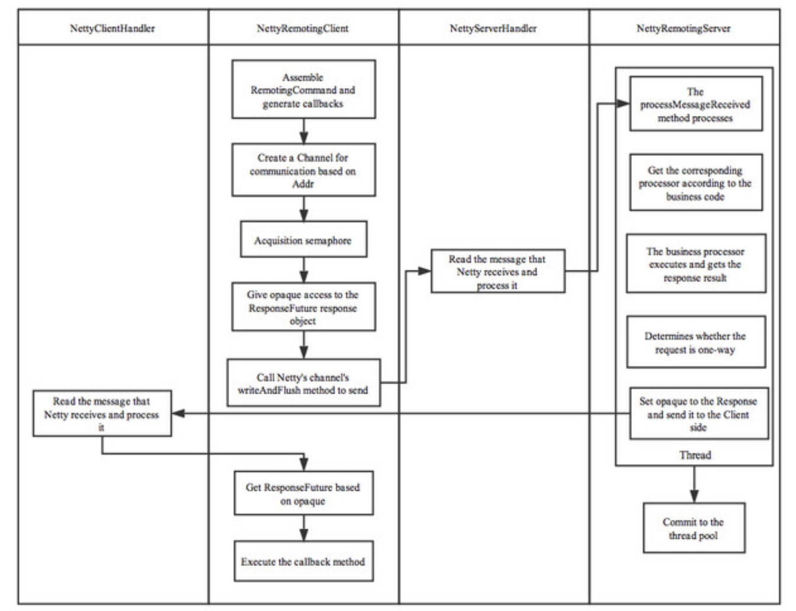

#### Reactor多线程设计

RocketMQ的RPC通信采用Netty组件作为底层通信库，同样也遵循了Reactor多线程模型，同时又在这之上做了一些扩展和优化。

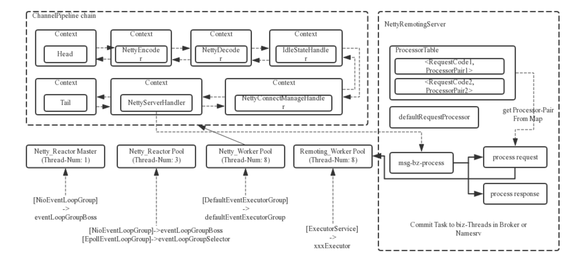

| 线程数 | 线程名                         | 线程具体说明                                                 |
| ------ | ------------------------------ | ------------------------------------------------------------ |
| 1      | NettyBoss_%d                   | Reactor 主线程，  负责监听 TCP网络连接请求，建立好连接，创建SocketChannel，并注册到selector上 （[RocketMQ的源码中会自动根据OS的类型选择NIO和Epoll](https://wenku.baidu.com/view/a17ce4ffd25abe23482fb4daa58da0116d171f72.html)，也可以通过参数配置） |
| N      | NettyServerEPOLLSelector_%d_%d | Reactor 线程池 ,  监听真正的网络数据。拿到网络数据后，再丢给Worker线程池 |
| M1     | NettyServerCodecThread_%d      | Worker线程池  处理真正执行业务逻辑之前需要进行的SSL验证、编解码、空闲检查、网络连接管理等操作 |
| M2     | RemotingExecutorThread_%d      | 业务processor处理线程池  根据 RomotingCommand 的业务请求码code去processorTable这个本地缓存变量中找到对应的 processor，然后封装成task任务后，提交给对应的业务processor处理线程池来执行 |

上面的框图中可以大致了解RocketMQ中NettyRemotingServer的Reactor 多线程模型。

从入口到业务逻辑的几个步骤中线程池一直再增加，这跟每一步逻辑复杂性相关，越复杂，需要的并发通道越宽。

### 消息过滤

RocketMQ分布式消息队列的消息过滤方式有别于其它MQ中间件，是在Consumer端订阅消息时再做消息过滤的。RocketMQ这么做是在于其Producer端写入消息和Consumer端订阅消息采用分离存储的机制来实现的，Consumer端订阅消息是需要通过ConsumeQueue这个消息消费的逻辑队列拿到一个索引，然后再从CommitLog里面读取真正的消息实体内容，所以说到底也是还绕不开其存储结构。其ConsumeQueue的存储结构如下，可以看到其中有8个字节存储的Message Tag的哈希值，基于Tag的消息过滤正是基于这个字段值的。

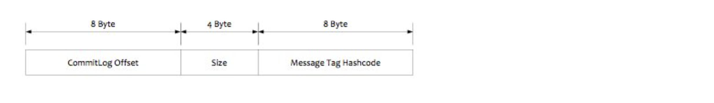

主要支持如下2种的过滤方式 

1. Tag过滤方式：Consumer端在订阅消息时除了指定Topic还可以指定TAG，如果一个消息有多个TAG，可以用||分隔。其中，Consumer端会将这个订阅请求构建成一个 SubscriptionData，发送一个Pull消息的请求给Broker端。Broker端从RocketMQ的文件存储层—Store读取数据之前，会用这些数据先构建一个MessageFilter，然后传给Store。Store从 ConsumeQueue读取到一条记录后，会用它记录的消息tag hash值去做过滤，由于在服务端只是根据hashcode进行判断，无法精确对tag原始字符串进行过滤，故在消息消费端拉取到消息后，还需要对消息的原始tag字符串进行比对，如果不同，则丢弃该消息，不进行消息消费。
2. SQL92的过滤方式：这种方式的大致做法和上面的Tag过滤方式一样，只是在Store层的具体过滤过程不太一样，真正的 SQL expression 的构建和执行由rocketmq-filter模块负责的。每次过滤都去执行SQL表达式会影响效率，所以RocketMQ使用了BloomFilter（布隆过滤器）避免了每次都去执行。SQL92的表达式上下文为消息的属性。

### 负载均衡

RocketMQ中的负载均衡都在Client端完成，具体来说的话，主要可以分为Producer端发送消息时候的负载均衡和Consumer端订阅消息的负载均衡。

#### Producer的负载均衡

Producer端在发送消息的时候，会先根据Topic找到指定的TopicPublishInfo，在获取了TopicPublishInfo路由信息后，RocketMQ的客户端在默认方式下selectOneMessageQueue()方法会从TopicPublishInfo中的messageQueueList中选择一个队列（MessageQueue）进行发送消息。具体的容错策略均在MQFaultStrategy这个类中定义。这里有一个sendLatencyFaultEnable开关变量，如果开启，在随机递增取模的基础上，再过滤掉not available的Broker代理。所谓的"latencyFaultTolerance"，是指对之前失败的，按一定的时间做退避。例如，如果上次请求的latency（延迟）超过550ms，就退避3000ms；超过1000L，就退避6000L；如果链接关闭了，采用随机递增取模的方式选择一个队列（MessageQueue）来发送消息，latencyFaultTolerance机制是实现消息发送高可用的核心关键所在。

#### Consumer的负载均衡

在RocketMQ中，Consumer端的两种消费模式（Push/Pull）都是基于拉模式来获取消息的，**而在Push模式只是对pull模式的一种封装，其本质实现为消息拉取线程在从服务器拉取到一批消息后，然后提交到消息消费线程池后，又“马不停蹄”的继续向服务器再次尝试拉取消息。如果未拉取到消息，则延迟一下又继续拉取。**在两种基于拉模式的消费方式（Push/Pull）中，均需要Consumer端知道从Broker端的哪一个消息队列中去获取消息。因此，有必要在Consumer端来做负载均衡，即Broker端中多个MessageQueue分配给同一个ConsumerGroup中的哪些Consumer消费。

1、Consumer端的心跳包发送

在Consumer启动后，它就会通过定时任务不断地向RocketMQ集群中的所有Broker实例发送心跳包（其中包含了，消息消费分组名称、订阅关系集合、消息通信模式和客户端id的值等信息）。Broker端在收到Consumer的心跳消息后，会将它维护在ConsumerManager的本地缓存变量—consumerTable，同时并将封装后的客户端网络通道信息保存在本地缓存变量—channelInfoTable中，为之后做Consumer端的负载均衡提供可以依据的元数据信息。

2、Consumer端实现负载均衡的核心类—RebalanceImpl

在Consumer实例的启动流程中的启动MQClientInstance实例部分，会完成负载均衡服务线程—RebalanceService的启动（每隔20s执行一次）。通过查看源码可以发现，RebalanceService线程的run()方法最终调用的是RebalanceImpl类的rebalanceByTopic()方法，该方法是实现Consumer端负载均衡的核心。这里，rebalanceByTopic()方法会根据消费者通信类型为“广播模式”还是“集群模式”做不同的逻辑处理。这里主要来看下集群模式下的主要处理流程：

(1) 从rebalanceImpl实例的本地缓存变量—topicSubscribeInfoTable中，获取该Topic主题下的消息消费队列集合（mqSet）；

(2) 根据topic和consumerGroup为参数调用mQClientFactory.findConsumerIdList()方法向Broker端发送获取该消费组下消费者Id列表的RPC通信请求（Broker端基于前面Consumer端上报的心跳包数据而构建的consumerTable做出响应返回，业务请求码：GET_CONSUMER_LIST_BY_GROUP）；

(3) 先对Topic下的**消息消费队列、消费者Id排序**，然后用消息队列分配策略算法（默认为：消息队列的平均分配算法），计算出待拉取的消息队列。这里的平均分配算法，类似于分页的算法，将所有MessageQueue排好序类似于记录，将所有消费端Consumer排好序类似页数，并求出每一页需要包含的平均size和每个页面记录的范围range，最后遍历整个range而计算出当前Consumer端应该分配到的记录（这里即为：MessageQueue）。

> ps: consumer 在broker 中有一个有序的consumer id

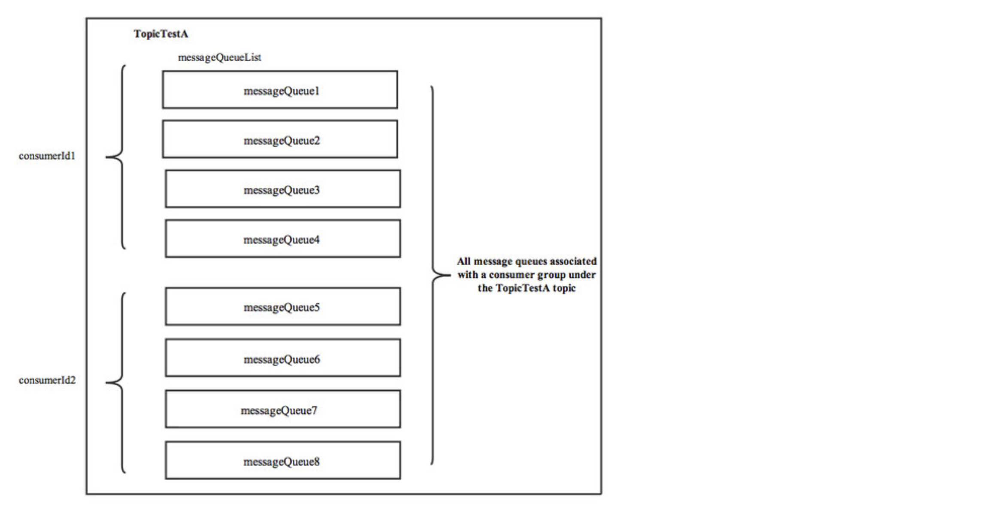

(4) 然后，调用updateProcessQueueTableInRebalance()方法，具体的做法是，先将分配到的消息队列集合（mqSet）与processQueueTable做一个过滤比对。

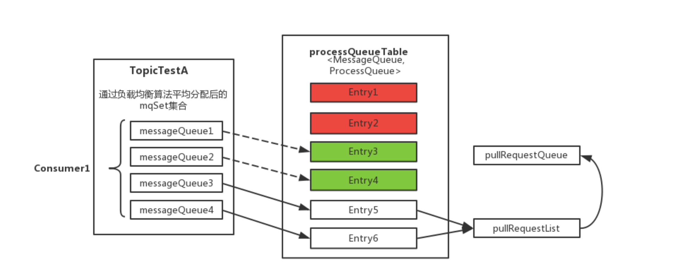

- 上图中processQueueTable标注的红色部分，表示与分配到的消息队列集合mqSet互不包含。将这些队列设置Dropped属性为true，然后查看这些队列是否可以移除出processQueueTable缓存变量，这里具体执行removeUnnecessaryMessageQueue()方法，即每隔1s 查看是否可以获取当前消费处理队列的锁，拿到的话返回true。如果等待1s后，仍然拿不到当前消费处理队列的锁则返回false。如果返回true，**则从processQueueTable缓存变量中移除对应的Entry；**
- 上图中processQueueTable的绿色部分，表示与分配到的消息队列集合mqSet的交集。判断该ProcessQueue是否已经过期了，在Pull模式的不用管，如果是Push模式的，设置Dropped属性为true，并且调用removeUnnecessaryMessageQueue()方法，像上面一样尝试移除Entry；

最后，为过滤后的消息队列集合（mqSet）中的每个MessageQueue创建一个ProcessQueue对象并存入RebalanceImpl的processQueueTable队列中（其中调用RebalanceImpl实例的computePullFromWhere(MessageQueue mq)方法获取该MessageQueue对象的下一个进度消费值offset，随后填充至接下来要创建的pullRequest对象属性中），并创建拉取请求对象—pullRequest添加到拉取列表—pullRequestList中，最后执行dispatchPullRequest()方法，将Pull消息的请求对象PullRequest依次放入PullMessageService服务线程的阻塞队列pullRequestQueue中，待该服务线程取出后向Broker端发起Pull消息的请求。其中，可以重点对比下，RebalancePushImpl和RebalancePullImpl两个实现类的dispatchPullRequest()方法不同，RebalancePullImpl类里面的该方法为空，这样子也就回答了上一篇中最后的那道思考题了。

消息消费队列在同一消费组不同消费者之间的负载均衡，**其核心设计理念是在一个消息消费队列在同一时间只允许被同一消费组内的一个消费者消费，一个消息消费者能同时消费多个消息队列。**

> 这一点和kafka的partition的分配是类似的，所以也有同样的问题，如果消费则多于 consumer queue 那么多余的消费者不回消费任何消息
>
> rocket mq 和 Kafka 一样存在 consumer 的rebalance 问题，在这个时候他们的消费都会变慢

#### rebalance 危害

1. 考虑在只有Consumer 1的情况下，其负责消费所有5个队列；在新增Consumer 2，触发Rebalance时，需要分配2个队列给其消费。那么Consumer 1就需要停止这2个队列的消费，等到这两个队列分配给Consumer 2后，这两个队列才能继续被消费。
2. 消费重复/重复消费问题

这是kafka , rocket 都有的问题

### 事务消息

Apache RocketMQ在4.3.0版中已经支持分布式事务消息，这里RocketMQ采用了2PC的思想来实现了提交事务消息，同时增加一个补偿逻辑来处理二阶段超时或者失败的消息，如下图所示。

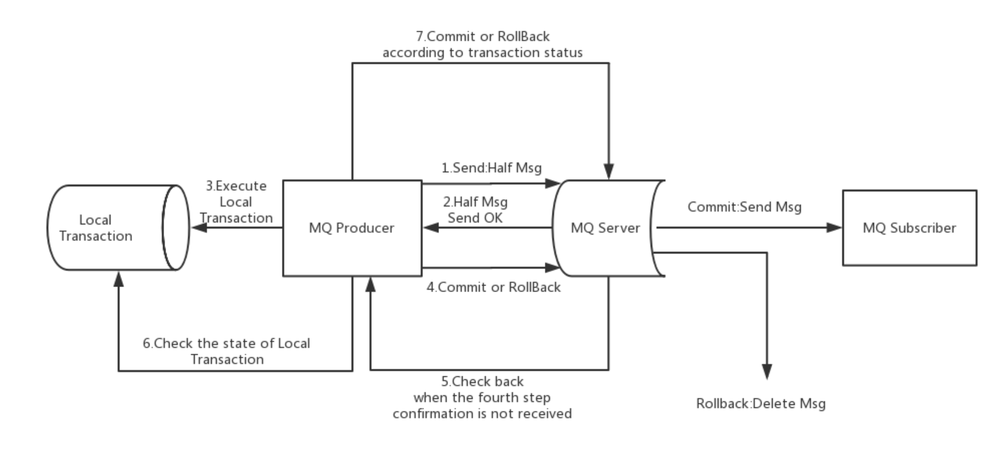

#### RocketMQ事务消息流程概要

上图说明了事务消息的大致方案，其中分为两个流程：正常事务消息的发送及提交、事务消息的补偿流程。

1.事务消息发送及提交：

(1) 发送消息（half消息）。

(2) 服务端响应消息写入结果。

(3) 根据发送结果执行本地事务（如果写入失败，此时half消息对业务不可见，本地逻辑不执行）。

(4) 根据本地事务状态执行Commit或者Rollback（Commit操作生成消息索引，消息对消费者可见）

2.补偿流程：

(1) 对没有Commit/Rollback的事务消息（pending状态的消息），从服务端发起一次“回查”

(2) Producer收到回查消息，检查回查消息对应的本地事务的状态

(3) 根据本地事务状态，重新Commit或者Rollback

其中，补偿阶段用于解决消息Commit或者Rollback发生超时或者失败的情况。

#### RocketMQ事务消息设计

1.事务消息在一阶段对用户不可见

在RocketMQ事务消息的主要流程中，一阶段的消息如何对用户不可见。其中，事务消息相对普通消息最大的特点就是一阶段发送的消息对用户是不可见的。那么，如何做到写入消息但是对用户不可见呢？RocketMQ事务消息的做法是：如果消息是half消息，将备份原消息的主题与消息消费队列，然后改变主题为RMQ_SYS_TRANS_HALF_TOPIC。由于消费组未订阅该主题，故消费端无法消费half类型的消息，然后RocketMQ会开启一个定时任务，从Topic为RMQ_SYS_TRANS_HALF_TOPIC中拉取消息进行消费，根据生产者组获取一个服务提供者发送回查事务状态请求，根据事务状态来决定是提交或回滚消息。

在RocketMQ中，消息在服务端的存储结构如下，每条消息都会有对应的索引信息，Consumer通过ConsumeQueue这个二级索引来读取消息实体内容，其流程如下：

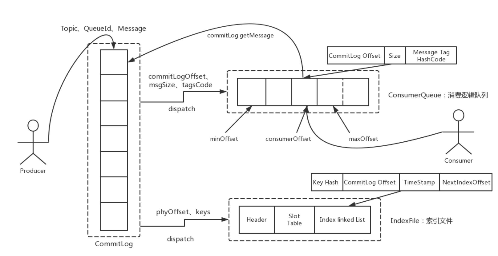

RocketMQ的具体实现策略是：写入的如果事务消息，对消息的Topic和Queue等属性进行替换，同时将原来的Topic和Queue信息存储到消息的属性中，正因为消息主题被替换，故消息并不会转发到该原主题的消息消费队列，消费者无法感知消息的存在，不会消费。其实改变消息主题是RocketMQ的常用“套路”，回想一下延时消息的实现机制。

2.Commit和Rollback操作以及Op消息的引入

在完成一阶段写入一条对用户不可见的消息后，二阶段如果是Commit操作，则需要让消息对用户可见；如果是Rollback则需要撤销一阶段的消息。先说Rollback的情况。对于Rollback，本身一阶段的消息对用户是不可见的，其实不需要真正撤销消息（实际上RocketMQ也无法去真正的删除一条消息，因为是顺序写文件的）。但是区别于这条消息没有确定状态（Pending状态，事务悬而未决），需要一个操作来标识这条消息的最终状态。RocketMQ事务消息方案中引入了Op消息的概念，用Op消息标识事务消息已经确定的状态（Commit或者Rollback）。如果一条事务消息没有对应的Op消息，说明这个事务的状态还无法确定（可能是二阶段失败了）。引入Op消息后，事务消息无论是Commit或者Rollback都会记录一个Op操作。Commit相对于Rollback只是在写入Op消息前创建Half消息的索引。

3.Op消息的存储和对应关系

RocketMQ将Op消息写入到全局一个特定的Topic中通过源码中的方法—TransactionalMessageUtil.buildOpTopic()；这个Topic是一个内部的Topic（像Half消息的Topic一样），不会被用户消费。Op消息的内容为对应的Half消息的存储的Offset，这样通过Op消息能索引到Half消息进行后续的回查操作。

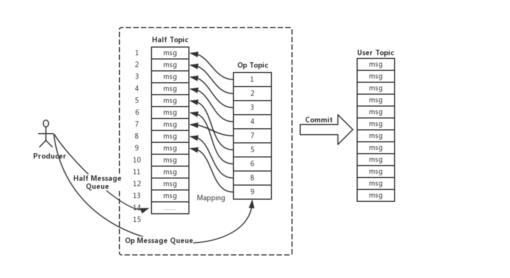

4.Half消息的索引构建

在执行二阶段Commit操作时，需要构建出Half消息的索引。一阶段的Half消息由于是写到一个特殊的Topic，所以二阶段构建索引时需要读取出Half消息，并将Topic和Queue替换成真正的目标的Topic和Queue，之后通过一次普通消息的写入操作来生成一条对用户可见的消息。所以RocketMQ事务消息二阶段其实是利用了一阶段存储的消息的内容，在二阶段时恢复出一条完整的普通消息，然后走一遍消息写入流程。

5.如何处理二阶段失败的消息？

如果在RocketMQ事务消息的二阶段过程中失败了，例如在做Commit操作时，出现网络问题导致Commit失败，那么需要通过一定的策略使这条消息最终被Commit。RocketMQ采用了一种补偿机制，称为“回查”。Broker端对未确定状态的消息发起回查，将消息发送到对应的Producer端（同一个Group的Producer），由Producer根据消息来检查本地事务的状态，进而执行Commit或者Rollback。Broker端通过对比Half消息和Op消息进行事务消息的回查并且推进CheckPoint（记录那些事务消息的状态是确定的）。

值得注意的是，rocketmq并不会无休止的的信息事务状态回查，默认回查15次，如果15次回查还是无法得知事务状态，rocketmq默认回滚该消息。

### 消息查询

RocketMQ支持按照下面两种维度（“按照Message Id查询消息”、“按照Message Key查询消息”）进行消息查询。

#### 按照MessageId查询消息

RocketMQ中的MessageId的长度总共有16字节，其中包含了消息存储主机地址（IP地址和端口），消息Commit Log offset。“按照MessageId查询消息”在RocketMQ中具体做法是：Client端从MessageId中解析出Broker的地址（IP地址和端口）和Commit Log的偏移地址后封装成一个RPC请求后通过Remoting通信层发送（业务请求码：VIEW_MESSAGE_BY_ID）。Broker端走的是QueryMessageProcessor，读取消息的过程用其中的 commitLog offset 和 size 去 commitLog 中找到真正的记录并解析成一个完整的消息返回。

#### 按照Message Key查询消息

“按照Message Key查询消息”，主要是基于RocketMQ的IndexFile索引文件来实现的。RocketMQ的索引文件逻辑结构，类似JDK中HashMap的实现。索引文件的具体结构如下：

IndexFile索引文件为用户提供通过“按照Message Key查询消息”的消息索引查询服务，IndexFile文件的存储位置是：$HOME\store\index${fileName}，文件名fileName是以创建时的时间戳命名的，文件大小是固定的，等于40+500W*4+2000W*20= 420000040个字节大小。如果消息的properties中设置了UNIQ_KEY这个属性，就用 topic + “#” + UNIQ_KEY的value作为 key 来做写入操作。如果消息设置了KEYS属性（多个KEY以空格分隔），也会用 topic + “#” + KEY 来做索引。

其中的索引数据包含了Key Hash/CommitLog Offset/Timestamp/NextIndex offset 这四个字段，一共20 Byte。NextIndex offset 即前面读出来的 slotValue，如果有 hash冲突，就可以用这个字段将所有冲突的索引用链表的方式串起来了。Timestamp记录的是消息storeTimestamp之间的差，并不是一个绝对的时间。整个Index File的结构如图，40 Byte 的Header用于保存一些总的统计信息，4*500W的 Slot Table并不保存真正的索引数据，而是保存每个槽位对应的单向链表的头。20*2000W 是真正的索引数据，即一个 Index File 可以保存 2000W个索引。

“按照Message Key查询消息”的方式，RocketMQ的具体做法是，主要通过Broker端的QueryMessageProcessor业务处理器来查询，读取消息的过程就是用topic和key找到IndexFile索引文件中的一条记录，根据其中的commitLog offset从CommitLog文件中读取消息的实体内容。

