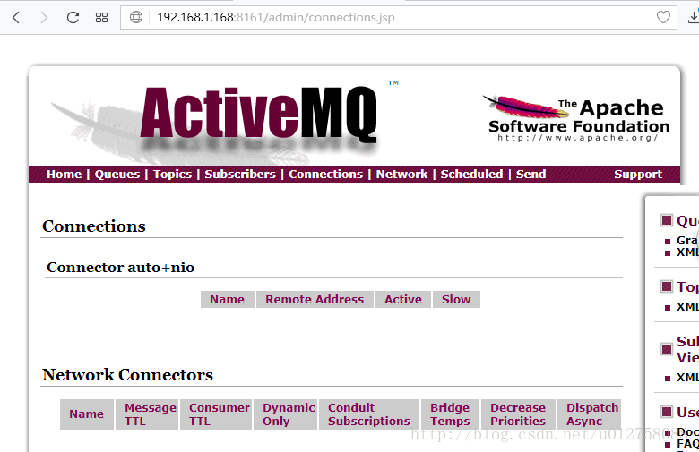
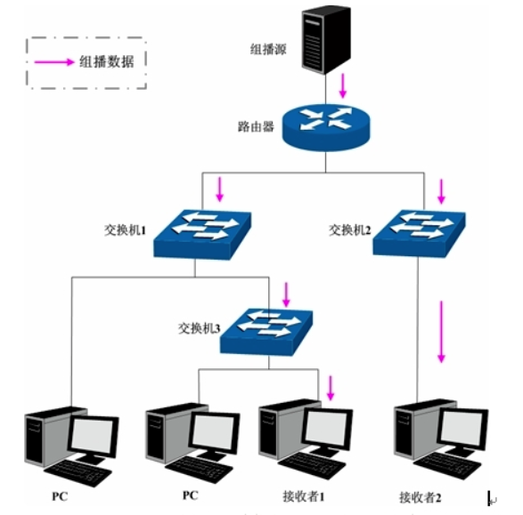
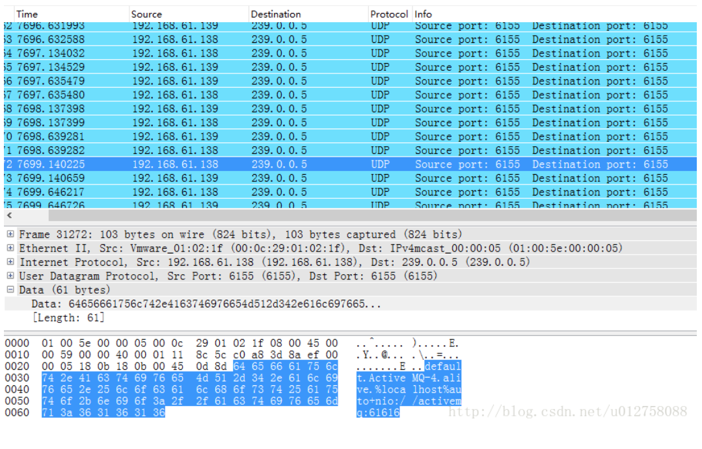
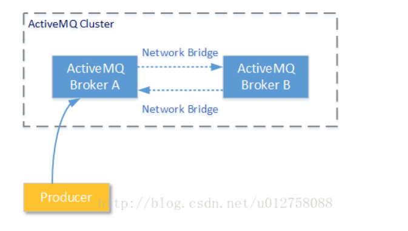
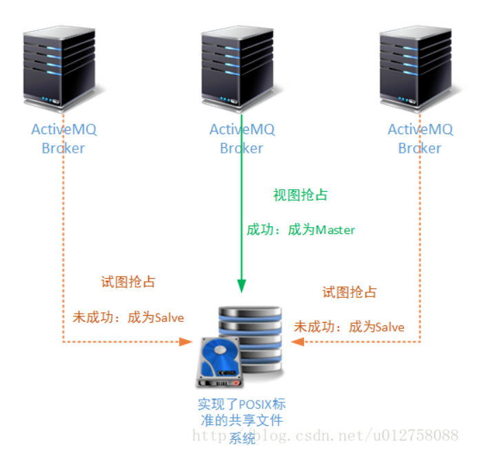
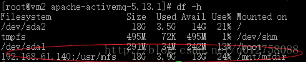
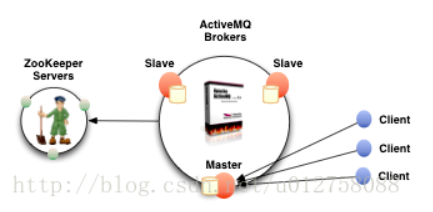
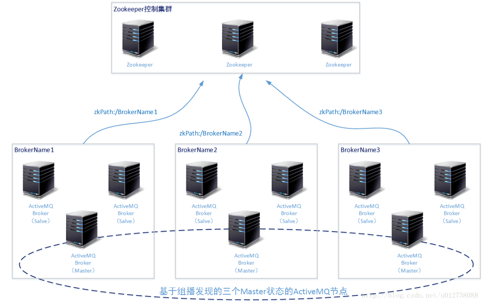

# 	优化的基础思想

系统的性能层次包括：

* 代码级性能
* 规则性能
* 存储性能
* 网络性能
* 以及多节点协同方法（集群方案）

所以我们优化ActiveMQ的中心思路也是这样的：首先优化ActiveMQ单个节点的性能，然后在配置ActiveMQ的集群。下面我们就按照这个思路，一步步介绍和ActiveMQ性能有关的那些事。

在**默认情况**下ActiveMQ的网络信息传递方式**基于网络IO模型中的BIO**方式。那么为了提高ActiveMQ单节点的工作性能，我们首先**应该为每一个独立的MQ服务节点配置更高效的网络IO模型**（比如NIO）。

另外我们还需要为ActiveMQ考虑一种存储方案，**让它能高效的完成“持久化”消息的存储操作（也包括对“非持久化”消息的临时存储）**。

另外，我们还知道了，使用集群方案能够增加整个软件的性能和稳定性，所以在完成单节点优化以后，我们还需**要提供某种集群方案将多个ActiveMQ组合起来，让它们协同工作**（一定是协同工作，单纯的安装多个ActiveMQ节点而不进行协同，是没法提高性能和稳定性的）。

# 1. 网络配置优化

## 1.1 基本连接配置

ActiveMQ支持多种消息协议，包括AMQP协议 MQTT协议 Openwire协议 Stomp协议等。在ActiveMQ的官方网站上，列出了目前ActiveMQ中支持的所有消息协议，它们是：AMQP MQTT OpenWire REST Stomp XMPP；

**不同的协议需要设置不同的网络监听端口**，这个相关设置在ActiveMQ安装目录的`./conf/conf/activemq.xml`主配置文件中。主配置文件采用XML格式进行描述，其中的“transportConnectors”标记描述了各种协议的网络监听端口，示例如下：

```xml
[root@bogon conf]# pwd
/usr/local/src/apache-activemq-5.13.2/conf
[root@bogon conf]# vim activemq.xml

        <!--
            The transport connectors expose ActiveMQ over a given protocol to
            clients and other brokers. For more information, see:

            http://activemq.apache.org/configuring-transports.html
        -->
        <transportConnectors>
            <!-- DOS protection, limit concurrent connections to 1000 and frame size to 100MB -->
            <transportConnector name="openwire" uri="tcp://0.0.0.0:61616?maximumConnections=1000&amp;wireFormat.maxFrameSize=104857600"/>
            <transportConnector name="amqp" uri="amqp://0.0.0.0:5672?maximumConnections=1000&amp;wireFormat.maxFrameSize=104857600"/>
            <transportConnector name="stomp" uri="stomp://0.0.0.0:61613?maximumConnections=1000&amp;wireFormat.maxFrameSize=104857600"/>
            <transportConnector name="mqtt" uri="mqtt://0.0.0.0:1883?maximumConnections=1000&amp;wireFormat.maxFrameSize=104857600"/>
            <transportConnector name="ws" uri="ws://0.0.0.0:61614?maximumConnections=1000&amp;wireFormat.maxFrameSize=104857600"/>
        </transportConnectors>123456789101112131415161718
```

以上配置了openwire协议的接入端口号为本机所有IP设备的61616（0.0.0.0代表本机所有IP设备）；配置amqp协议的接入端口号为本机所有IP设备的5672；配置stomp协议的接入端口号为本机所有IP设备的61613，等等。**这里注意以下几个事实**：

- 每一个`transportConnector`标记的name属性和uri属性都必须填写，name属性的值可以随便填写，它将作为一个`Connector`元素，显示在ActiveMQ管理界面的`Connections`栏目中；
- 每一个`transportConnector`标记的uri元素，都有固定写法：uri头是指定的协议名称，例如amqp mqtt stomp等。然后是HOST/IP域名，指定端口监听所在的路由信息；**请不要使用localhost或者127.0.0.1这样的回环地址，否则无法通过网络连接到ActiveMQ**；接下来是端口信息，**指定的端口不能重复**，否则会产生冲突；
- URI参数部分，每一种协议都有一些特定的参数，读者可参考ActiveMQ官网中，关于“协议”部分的介绍：<http://activemq.apache.org/protocols.html>。但是有些参数却是各种协议都可共用的，例如以上实例中使用的`maximumConnections`属性，代表这个端口支持的最大连接数量；`wireFormat.maxFrameSize`属相代表支持协议的“一个完整消息”的最大数据量（单位为byte）；您可以在ActiveMQ官网中对wire formats的参数描述中，找到这些默认属性：<http://activemq.apache.org/configuring-wire-formats.html>；
- URI参数部分，各协议可共用的参数还包括“基本连接特性”相关的参数，这些参数说明可参见官网：<http://activemq.apache.org/connection-configuration-uri.html> 中的详细说明。另外如果您使用的是TCP协议，您还可以在URI参数部分加入TCP相关的属性描述，参见官网 <http://activemq.apache.org/tcp-transport-reference.html> 中的详细说明
- “transportConnector”标记中，除了必须填写的“name”属性和“uri”属性以外还有一些可选择的属性，例如：enableStatusMonitor updateClusterClients。详细的属性介绍可参考官方文档 <http://activemq.apache.org/configuring-transports.html> 中 “Server side options”部分章节的介绍。在后续的文章中，我们将陆续使用到其中的一些设置项。

## 2 特别说明

- 在上文给出的配置信息中，您可以发现我们在描述各种消息协议时，URI描述信息的头部都的是采用协议名称：例如，描述amqp协议的监听端口时，采用的URI描述格式为“amqp://……”；描述Stomp协议的监听端口时，采用的URI描述格式为“stomp://……”。唯独在进行openwire协议描述时，URI头却采用的“tcp://…..”。这是因为ActiveMQ中默认的消息协议就是openwire：

> OpenWire is binary protocol designed for working with Message Oriented Middleware. It is the native wire format of ActiveMQ.
>
> OpenWire is our cross language Wire Protocol to allow native access to ActiveMQ from a number of different languages and platforms. The Java OpenWire transport is the default transport in ActiveMQ 4.x or later.

- 介绍AMQP协议时提到，ActiveMQ完整支持AMQP协议。但是读者会发现ActiveMQ中并没有存在Exchange这样的结构。这是怎么回事呢？实际上在国际标准组织 (ISO) 和国际电工委员会 (IEC) 制定的AMQP Version 1.0 规范文档中（《OASIS Advanced Message Queueing Protocol (AMQP) Version 1.0》），**并没有说AMQP 消息必须经过Exchange规则才能够到达队列，也没有规定Exchange 必须要实现某种规则的路由。所以在支持AMQP协议时，是否需要有Exchange这样的路由处理规则，完全取决于AMQP的消息中间件软件厂商自己的决定**。下面一段代码是使用JMS API连接ActiveMQ的AMQP端口，发送AMQP消息的示例：

```java
import javax.jms.Connection;
import javax.jms.Destination;
import javax.jms.MessageProducer;
import javax.jms.Session;
import javax.jms.TextMessage;

import org.apache.qpid.amqp_1_0.jms.impl.ConnectionFactoryImpl;

public class JMSProducer {
    public static void main(String[] args) throws Throwable {
        // 注意，JMS-AMQP使用的是Apache QPID的实现。如果您需要运行这段代码，请导入QPID的客户端
        /*
         * <dependency>
         *  <groupId>org.apache.qpid</groupId>
         *  <artifactId>qpid-amqp-1-0-client-jms</artifactId>
         *  <version>0.32</version>
         * </dependency>
         * */
        ConnectionFactoryImpl factory = ConnectionFactoryImpl.createFromURL("amqp://192.168.1.168:5672");
        Connection connection = factory.createQueueConnection();
        connection.start();

        // 建立会话，连接到叫做/test的Queue上
        Session session = connection.createSession(false, Session.AUTO_ACKNOWLEDGE);
        Destination queue = session.createQueue("/test");
        MessageProducer messageProducer = session.createProducer(queue);

        // 开始发送消息
        TextMessage outMessage = session.createTextMessage();
        outMessage.setText("23456656457567456");
        messageProducer.send(outMessage);

        //关闭
        messageProducer.close();
        connection.close();
    }
}
```

## 3 网络配置优化

那么各位读者您是否觉得上一小节那样的连接端口配置太过冗长，不好进行管理？确实是这样，并且实际工作中我们也只会使用几种固定的协议。所以**ActiveMQ在Version 5.13.0+ 版本后，将OpenWire, STOMP, AMQP, MQTT这四种主要协议的端口监听进行了合并，并使用auto关键字进行表示**。也就是说，ActiveMQ将监听这一个端口的消息状态，并自动匹配合适的协议格式。配置如下：

```xml
<transportConnectors>
    <transportConnector name="auto" uri="auto://0.0.0.0:61617?maximumConnections=1000" />
</transportConnectors>123
```

以上的URI配置信息中，可以使用所有通用的Connection Configuration Wire Formats Configuring Server side options和TCP Transport Configuration配置项。但是这种优化只是让ActiveMQ的连接管理变得简洁了，并没有提升单个节点的处理性能。

**如果您不特别指定ActiveMQ的网络监听端口，那么这些端口都将使用BIO网络IO模型**。所以为了首先提高单节点的网络吞吐性能，我们需要明确指定Active的网络IO模型，如下所示：

```xml
<transportConnectors>  
    <transportConnector name="nio" uri="nio://0.0.0.0:61618?maximumConnections=1000"/>  
</transportConnectors> 123
```

请注意，URI格式头以”nio”开头，表示这个端口使用以TCP协议为基础的NIO网络IO模型。但是这样的设置方式，只能使这个端口支持Openwire协议。那么我们怎么既让这个端口支持NIO网络IO模型，又让它支持多个协议呢？**ActiveMQ的服务端设置**，**允许开发人员使用“+”符号来为端口设置多种特性**，如下：

```xml
<transportConnector name="stomp+nio" uri="stomp+nio://0.0.0.0:61613?transport.transformer=jms"/>
// 表示这个端口使用NIO模型支持Stomp协议

<transportConnector name="amqp+ssl" uri="amqp+ssl://localhost:5671"/>
// 表示这个端口支持amqp和ssl密文传输
```

所以如果我们既需要某一个端口支持NIO网络IO模型，又需要它支持多个协议，那么可以进行如下的配置：

```xml
<transportConnector name="auto+nio" uri="auto+nio://0.0.0.0:61608?maximumConnections=1000" />
```

另外，**如果是为了生产环境进行的配置，那么您至少应该还要配置这个端口支持的最大连接数量 设置每一条消息的最大传输值 设置NIO使用的线程池最大工作线程数量**（当然您已经知道了这些设置的文档所在位置，所以您可以根据自己的情况进行设置属性的增减）：

```xml
<transportConnector name="auto+nio" uri="auto+nio://0.0.0.0:61608?maximumConnections=1000&wireFormat.maxFrameSize=104857600&org.apache.activemq.transport.nio.SelectorManager.corePoolSize=20&org.apache.activemq.transport.nio.SelectorManager.maximumPoolSize=50" />
```

以下附图是改变网络连接设置后，ActiveMQ管理控制台中Connections页面显示的内容。注意ws协议的端口是额外保留的配置——因为auto模式中的协议不支持ws：

# 2. ActiveMQ集群方案(上)

## **多节点方案**

**集群方案主要为了解决系统架构中的两个关键问题：高可用和高可靠性。ActiveMQ服务的高可靠性是指，在ActiveMQ服务性能不变 数据不丢失的前提下，确保当系统灾难出现时ActiveMQ能够持续提供消息服务，高可靠性方案最终目的是减少整个ActiveMQ停止服务的时间。**

**ActiveMQ服务的高性能是指，在保证ActiveMQ服务持续稳定性 数据不丢失的前提下，确保ActiveMQ集群能够在单位时间内吞吐更高数量的消息 确保ActiveMQ集群处理单条消息的时间更短 确保ActiveMQ集群能够容纳更多的客户端稳定连接。**

下面我们分别介绍如何通过多个ActiveMQ服务节点集群方式，分别提供热备方案和高性能方案。最后我们讨论如何将两种方案结合在一起，最终形成在生成环境下使用的推荐方案。

## **ActiveMQ高性能方案**

ActiveMQ的多节点集群方案，主要有**动态集群和静态集群两种方案**。所谓动态集群就是指，**同时提供消息服务的ActiveMQ节点数量 位置（IP和端口）是不确定的**，**当某一个节点启动后，会通过网络组播的方式向其他节点发送通知（同时接受其他节点的组播信息）**。**当网络中其他节点收到组播通知后，就会向这个节点发起连接，最终将新的节点加入ActiveMQ集群**；所谓静态集群是指**同时提供消息服务的多个节点的位置（IP和端口）是确定的**，每个节点不需要通过广播的方式发现目标节点，只需要在启动时按照给定的位置进行连接。

## 2.1 基于组播（multicast）的节点发现

在使用动态集群配置时，当某个ActiveMQ服务节点启动后并不知道整个网络中还存在哪些其他的服务节点。所以ActiveMQ集群需要规定一种节点与节点间的发现机制，以保证能够解决上述问题。**ActiveMQ集群中，使用“组播”原理进行其他节点的发现。**

**组播（multicast）基于UDP协议**，它是指在一个可连通的网络中，某一个数据报发送源 向 一组数据报接收目标进行操作的过程。在这个过程中，数据报发送者只需要向这个组播地址（一个D类IP）发送一个数据报，那么加入这个组播地址的所有接收者都可以收到这个数据报。**组播实现了网络中单点到多点的高效数据传送，能够节约大量网络带宽，降低网络负载。**



### 2.1.1 D类IP

在IP协议中，规定的D类IP地址为组播地址。**224.0.0.0~239.255.255.255**  **这个范围内的IP都是D类IP地址**，其中有一些IP段是保留的有特殊含义的：

- **224.0.0.0～224.0.0.255：这个D类IP地址段为保留地址，不建议您在开发过程中使用，因为可能产生冲突**。例如224.0.0.5这个组播地址专供OSPF协议（是一种路由策略协议，用于找到最优路径）使用的组播地址；224.0.0.18这个组播地址专供VRRP协议使用（VRRP协议是虚拟路由器冗余协议）；
- **224.0.1.0～224.0.1.255：这个D类IP地址为公用组播地址，用于在整个Internet网络上进行组播。除非您有顶级DNS的控制/改写权限，否则不建议在局域网内使用这个组播地址断；**
- **239.0.0.0～239.255.255.255：这个D类IP地址段为推荐在局域网内使用的组播地址段。**注意，如果要在局域网内使用组播功能，需要局域网中的交换机/路由器支持组播功能。幸运的是，目前市面上只要不是太过低端的交换机/路由器，都支持组播功能（组播功能所使用的主要协议为IGMP协议，关于IGMP协议的细节就不再进行深入了）。

下面我们使用java语言，编写一个局域网内的组播发送和接受过程。以便让各位读者对基于组播的节点发现操作有一个直观的理解。虽然ActiveMQ中关于节点发现的过程，要比以下的示例复杂得多，但是基本原理是不会改变的。

### 2.1.2 JAVA实现的组播的简单demo

**组播数据报发送者：**

```java
import java.net.DatagramPacket;
import java.net.InetAddress;
import java.net.MulticastSocket;
import java.util.Date;

public class SendMulticast {
    public static void main(String[] args) throws Throwable {
        // 组播地址
        InetAddress group = InetAddress.getByName("239.0.0.5");
        // 组播端口，同时也是UDP 数据报的发送端口
        int port = 19999;
        MulticastSocket mss = null;  

        // 创建一个用于发送/接收的MulticastSocket组播套接字对象
        mss = new MulticastSocket(port);
        // 创建要发送的组播信息和UDP数据报
        // 携带的数据内容，就是这个activeMQ服务节点用来提供Network Connectors的TCP/IP地址和端口等信息
        String message = "我是一个活动的activeMQ服务节点（节点编号:yyyyyyy），我的可用tcp信息为：XXXXXXXXXX : ";  
        byte[] buffer2 = message.getBytes(); 
        DatagramPacket dp = new DatagramPacket(buffer2, buffer2.length, group, port);
        // 使用组播套接字joinGroup(),将其加入到一个组播
        mss.joinGroup(group);

        // 开始按照一定的周期向加入到224.0.0.5组播地址的其他ActiveMQ服务节点进行广播
        Thread thread = Thread.currentThread();
        while (!thread.isInterrupted()) {
            // 使用组播套接字的send()方法，将组播数据包对象放入其中，发送组播数据包
            mss.send(dp);
            System.out.println(new Date() + "发起组播：" + message);
            synchronized (SendMulticast.class) {
                SendMulticast.class.wait(5000);
            }
        }

        mss.close();
    }
}
```

**组播数据报接收者：**

```java
import java.net.DatagramPacket;
import java.net.InetAddress;
import java.net.MulticastSocket;

/**
 * 测试接收组播信息
 */
public class AcceptMulticast {
    public static void main(String[] args) throws Throwable {
        // 建立组播套接字，并加入分组
        MulticastSocket multicastSocket = new MulticastSocket(19999);
        // 注意，组播地址和端口必须和发送者的一直，才能加入正确的组
        InetAddress ad = InetAddress.getByName("239.0.0.5");
        multicastSocket.joinGroup(ad);

        // 准备接收可能的组播信号
        byte[] datas = new byte[2048];
        DatagramPacket data = new DatagramPacket(datas, 2048, ad, 19999);
        Thread thread = Thread.currentThread();

        // 开始接收组播信息，并打印出来
        System.out.println(".....开始接收组播信息.....");
        while (!thread.isInterrupted()) {
            multicastSocket.receive(data);
            int leng = data.getLength();
            System.out.println(new String(data.getData(), 0, leng, "UTF-8"));
        }

        multicastSocket.close();
    }
}
```

## 2.2 桥接Network Bridges

为了实现ActiveMQ集群的横向扩展要求和高稳定性要求，ActiveMQ集群提供了Network Bridges功能。通过Network Bridges功能，技术人员可以将多个ActiveMQ服务节点连接起来。并让它们通过配置好的策略作为一个整体对外提供服务。

这样的服务策略主要包括两种：主/从模式和负载均衡模式。对于第一种策略我们会在后文进行讨论。**本节我们要重点讨论的是基于Network Bridges的负载均衡模式。**

**需要注意的是**：**桥接之后，如果从节点A 消费 节点B的消息，相当于把B 的消息都传了一份给A,同时B上面的这些消息会被标记为已消费，也就是说，通过b节点再次消费是无法消费被传给A的那部分消息的**

## 2.3 动态Network Connectors

既然已经讲述了ActiveMQ中的动态节点发现原理和ActiveMQ Network Bridges的概念，那么关于ActiveMQ怎样配置集群的方式就是非常简单的问题了。我们先来讨论如何进行基于组播发现的ActiveMQ负载均衡模式的配置——动态网络连接Network Connectors；再来讨论基于固定地址的负载均衡模式配置——静态网络连接Network Connectors。

要配置基于组播发现的ActiveMQ负载均衡模式，其过程非常简单。开发人员只需要在每一个ActiveMQ服务节点的主配置文件中（activemq.xml），添加/更改 以下配置信息即可：

```xml
......
<transportConnectors>
    <!-- 在transportConnector中增加discoveryUri属性，表示这个transportConnector是要通过组播告知其它节点的：使用这个transportConnector位置连接我 -->
    <transportConnector name="auto" uri="auto+nio://0.0.0.0:61616?maximumConnections=1000&amp;wireFormat.maxFrameSize=104857600&amp;org.apache.activemq.transport.nio.SelectorManager.corePoolSize=20&amp;org.apache.activemq.transport.nio.SelectorManager.maximumPoolSize=50&amp;consumer.prefetchSize=5" discoveryUri="multicast://239.0.0.5" />
</transportConnectors>

......

<!-- 关键的networkConnector标签， uri属性标示为组播发现-->
<networkConnectors>
    <networkConnector uri="multicast://239.0.0.5" duplex="false"/>
</networkConnectors>

......
```

### 2.3.1 networkConnector标签

如果使用ActiveMQ的组播发现功能，请在networkConnector标签的uri属性中添加如下格式的信息：

```properties
multicast://[组播地址][:端口]
```

例如，您可以按照如下方式使用ActiveMQ默认的组播地址来发现网络种其他ActiveMQ服务节点：

```properties
#ActiveMQ集群默认的组播地址（239.255.2.3）：
multicast://default
```

也可以按照如下方式，指定一个组播地址——这在高安全级别的网络中很有用，因为可能其他的组播地址已经被管理员禁用。注意组播地址只能是D类IP地址段：

```properties
#使用组播地址239.0.0.5
multicast://239.0.0.5
```

以下是通过抓包软件获得的的组播UDP报文：



从上图中我们可以获得几个关键信息：

- 192.168.61.138和192.168.61.139这两个IP地址分别按照一定的周期（1秒一次），**向组播地址239.0.0.5发送UDP数据报。以便让在这个组播地址的其它服务节点能够感知自己的存在；**
- 另外，**以上UDP数据报文使用的端口是6155。您也可以更改这个端口信息通过类似如下的方式：**

```properties
#使用组播地址239.0.0.5:19999
multicast://239.0.0.5:19999
```

- 每个UDP数据报中，包含的主要信息包括本节点ActiveMQ的版本信息，以及连接到自己所需要使用的host名字 协议名和端口信息。类似如下：

```properties
default.ActiveMQ-4.ailve%localhost%auto+nio://activemq:61616
```

### 2.3.2 transportConnector标签的关联设置

任何一个ActiveMQ服务节点A，要连接到另外的ActiveMQ服务节点，都需要使用当前节点A已经公布的transportConnector连接端口，例如以下配置中，能够供其它服务节点进行连接的就只有三个transportConnector连接中的任意一个：

```xml
......
<transportConnectors>
    <!-- 其它ActiveMQ服务节点，只能使用以下三个连接协议和端口进行连接 -->
    <!-- DOS protection, limit concurrent connections to 1000 and frame size to 100MB -->
    <transportConnector name="tcp" uri="tcp://0.0.0.0:61614?maximumConnections=1000&amp;wireFormat.maxFrameSize=104857600"/>
    <transportConnector name="nio" uri="nio://0.0.0.0:61618?maximumConnections=1000" />
    <transportConnector name="auto" uri="auto://0.0.0.0:61617?maximumConnections=1000" />   
</transportConnectors>
......
```

**那么要将哪一个连接方式通过UDP数据报向其他ActiveMQ节点进行公布，就需要在transportConnector标签上使用discoveryUri属性进行标识**，如下所示：

```xml
......
<transportConnectors>
    ......
    <transportConnector name="ws" uri="ws://0.0.0.0:61614?maximumConnections=1000&amp;wireFormat.maxFrameSize=104857600"/>
    <transportConnector name="auto" uri="auto+nio://0.0.0.0:61616?maximumConnections=1000&amp;wireFormat.maxFrameSize=104857600" discoveryUri="multicast://239.0.0.5" />
</transportConnectors>

......
<networkConnectors>
    <networkConnector uri="multicast://239.0.0.5"/>
</networkConnectors>
......
```

### 2.3.3 其他注意事项

- 关于防火墙：请记得关闭您Linux服务器上对需要公布的IP和端口的限制；
- 关于hosts路由信息：由于基于组播的动态发现机制，能够找到的是目标ActiveMQ服务节点的机器名，而不是直接找到的IP。所以请设置当前服务节点的hosts文件，以便当前ActiveMQ节点能够通过hosts文件中的IP路由关系，得到机器名与IP的映射：

```properties
# hosts文件
......
192.168.61.139          activemq1
192.168.61.138          activemq2
......
```

- 关于哪些协议能够被用于进行Network Bridges连接：根据笔者以往的使用经验，**只有tcp头的uri格式（openwire协议）能够被用于Network Bridges连接**；当然您可以使用auto头，因为其兼容openwire协议；另外，您还可以指定为附加nio头。

## 2.4 静态Network Connectors

相比于基于组播发现方式的动态Network Connectors而言，虽然静态Network Connectors没有那样灵活的横向扩展性，但是却可以适用于网络环境受严格管理的情况。例如：管理员关闭了交换机/路由器的组播功能 端口受到严格管控等等。

配置静态Network Connectors的ActiveMQ集群的方式也很简单，只需要更改networkConnectors标签中的配置即可，而无需关联改动transportConnectors标签。但是配置静态Network Connectors的ActiveMQ集群时，需要注意非常关键的细节：**每一个节点都要配置其他所有节点的连接位置**。

为了演示配置过程，我们假设ActiveMQ集群由两个节点构成，分别是activemq1：192.168.61.138 和 activemq2：192.168.61.139。那么配置情况如下所示：

**192.168.61.138：需要配置activemq2的位置信息以便进行连接：**

```xml
......
<transportConnectors>
    <transportConnector name="auto" uri="auto+nio://0.0.0.0:61616?maximumConnections=1000&amp;wireFormat.maxFrameSize=104857600&amp;consumer.prefetchSize=5"/>
</transportConnectors>
......

<!-- 请注意，一定需要192.168.61.139(activemq2)提供了这样的连接协议和端口 -->
<networkConnectors>
    <networkConnector uri="static:(auto+nio://192.168.61.139:61616)"/>
</networkConnectors>
......
```

**192.168.61.139：需要配置activemq1的位置信息以便进行连接：**

```xml
......
<transportConnectors>
    <transportConnector name="auto" uri="auto+nio://0.0.0.0:61616?maximumConnections=1000&amp;wireFormat.maxFrameSize=104857600&amp;consumer.prefetchSize=5"/>
</transportConnectors>

......
<!-- 请注意，一定需要192.168.61.138(activemq1)提供了这样的连接协议和端口 -->
<networkConnectors>
   <networkConnector uri="static:(auto+nio://192.168.61.138:61616)"/>
</networkConnectors>
......
```

同理，如果您的ActiveMQ集群规划中有三个ActiveMQ服务节点，那么任何一个节点都应该配置其它两个服务节点的连接方式。在配置格式中使用“,”符号进行分割：

```xml
......
<networkConnectors>
    <networkConnector uri="static:(tcp://host1:61616,tcp://host2:61616,tcp://..)"/>
</networkConnectors>
......
```

## 2.5 networkConnector 其他配置属性

下表列举了在networkConnector标签中还可以使用的属性以及其意义。**请特别注意其中的duplex属性。如果只从字面意义理解该属性，则被称为“双工模式”；如果该属性为true，当这个节点使用Network Bridge连接到其它目标节点后，将强制目标也建立Network Bridge进行反向连接**。其目的在于让消息既能发送到目标节点，又可以通过目标节点接受消息，但实际上大多数情况下是没有必要的，因为目标节点一般都会自行建立连接到本节点。所以，该duplex属性的默认值为false。

| 属性名称                            | 默认值 | 属性意义                                                     |
| ----------------------------------- | ------ | ------------------------------------------------------------ |
| name                                | bridge | 名称                                                         |
| dynamicOnly                         | false  | 如果为true, 持久订阅被激活时才创建对应的网路持久订阅。       |
| decreaseNetworkConsumerPriority     | false  | 如果为true，网络的消费者优先级降低为-5。如果为false，则默认跟本地消费者一样为0. |
| excludedDestinations                | empty  | 不通过网络转发的destination                                  |
| dynamicallyIncludedDestinations     | empty  | 通过网络转发的destinations，注意空列表代表所有的都转发。     |
| staticallyIncludedDestinations      | empty  | 匹配的都将通过网络转发-即使没有对应的消费者，如果为默认的“empty”，那么说明所有都要被转发 |
| duplex                              | false  | 已经进行详细介绍的“双工”属性。                               |
| prefetchSize                        | 1000   | 设置网络消费者的prefetch size参数。如果设置成0，那么就像之前文章介绍过的那样：消费者会自己轮询消息。显然这是不被允许的。 |
| suppressDuplicateQueueSubscriptions | false  | 如果为true, 重复的订阅关系一产生即被阻止（V5.3+ 的版本中可以使用）。 |
| bridgeTempDestinations              | true   | 是否广播advisory messages来创建临时destination。             |
| alwaysSyncSend                      | false  | 如果为true，非持久化消息也将使用request/reply方式代替oneway方式发送到远程broker（V5.6+ 的版本中可以使用）。 |
| staticBridge                        | false  | 如果为true，只有staticallyIncludedDestinations中配置的destination可以被处理（V5.6+ 的版本中可以使用）。 |

以下这些属性，只能在静态Network Connectors模式下使用：

| 属性名称              | 默认值 | 属性意义                                                     |
| --------------------- | ------ | ------------------------------------------------------------ |
| initialReconnectDelay | 1000   | 重连之前等待的时间(ms) (如果useExponentialBackOff为false)    |
| useExponentialBackOff | true   | 如果该属性为true，那么在每次重连失败到下次重连之前，都会增大等待时间 |
| maxReconnectDelay     | 30000  | 重连之前等待的最大时间(ms)                                   |
| backOffMultiplier     | 2      | 增大等待时间的系数                                           |

请注意这些属性，并不是networkConnector标签的属性，而是在uri属性中进行设置的，例如：

```
uri="static:(tcp://host1:61616,tcp://host2:61616)?maxReconnectDelay=5000&useExponentialBackOff=false"
```


# 3. ActiveMQ集群方案（下）

## 3.1 ActiveMQ高性能方案的不足

那么有的读者可能会问，既然ActiveMQ的高性能方案中多个节点同时工作，在某个节点异常的情况下也不会影响其他节点的工作。这样看来，ActiveMQ的高性能方案已经避免了单点故障，那么我们为什么还需要讨论ActiveMQ的高可用方案呢？

为了回答这个问题，我们先回过头来看看ActiveMQ高性能方案的一些不足。假设如下的场景：ActiveMQ A和AcitveMQ B两个服务节点已建立了Network Bridge；并且Producer1 连接在ActiveMQ A上，按照一定周期发送消息（队列名：Queue/testC）；但是当前并没有任何消费者Consumer连接在任何ActiveMQ服务节点上接收消息。整个场景如下图所示：



在发送了若干消息后，我们查看两个节点ActiveMQ服务节点的消息情况，发现ActiveMQ A并没有把队列Queue/test  C中的消息同步到ActiveMQ B。原来**AcitveMQ Network Bridge的工作原则是：只在服务节点间传输需要传输的消息**，这样做的原因是为了尽量减少AcitveMQ集群网络中不必要的数据流量。在我们实验的这种情况下并**没有任何消费者在任何ActiveMQ服务节点上监听/订阅队列Queue/testC中的消息，所以消息并不会进行同步。**

那么这样的工作机制带来的问题是，**当没有任何消费者在任何服务节点订阅ActiveMQ A中队列的消息时，一旦ActiveMQ A由于各种异常退出，后来的消费者就再也收不到消息，直到ActiveMQ A恢复工作**。所以我们需要一种高可用方案，让某一个服务节点能够7 * 24小时的稳定提供消息服务。

## 3.2  ActiveMQ 热备方案

### 3.2.1 基于共享文件系统的热备方案

#### 3.2.1.1 方案介绍

基于共享文件系统的热备方案可以说是ActiveMQ消息中间件中最早出现的一种热备方案。它的工作原理很简单：让若干个ActiveMQ服务节点，共享一个文件系统。当某一个ActiveMQ服务抢占到了这个文件系统的操作权限，就给文件系统的操作区域加锁；其它服务节点一旦发现这个文件系统已经被加锁（并且锁不属于本进程），就会自动进入Salve模式。

ActiveMQ早期的文件存储方案、KahaDB存储方案、LevelDB存储方案都支持这个工作模式。当某个ActiveMQ节点获取了文件系统的操作权限后，首先做的事情就是从文件系统中恢复内存索引结构：KahaDB恢复BTree结构；LevelDB恢复memTable结构。



因为本专题讲解的技术体系都是工作在Linux操作系统上，所以为多个ActiveMQ提供共享文件系统方案的第三方文件系统都必须支持POSIX协议，这样Linux操作系统才能实现远程挂载。

幸运的是，这样的第三方系统多不胜举，例如：基于网络文件存储的NFS、NAS；基于对象存储的分布式文件系统Ceph、MFS、Swift（不是ios的编程语言）、GlusterFS（高版本）；以及ActiveMQ官方推荐的网络块存储方案：SAN（就是成本有点高）。

为了讲解简单，我们以下的讲解采用NFS实现文件系统的共享。NFS技术比较成熟，在很多业务领域都有使用案例。如果您的业务生产环境还没有达到滴滴、大众点评、美团那样对文件存储性能上的要求，也可以将NFS用于生产环境。

#### 3.2.1.2 实例参考

下面我们来演示两个ActiveMQ节点建立在NFS网络文件存储上的 Master/Salve 方案。关于怎么安装NFS软件就不进行介绍了，毕竟本部分内容的核心还是消息服务中间件，不清楚NFS安装的读者可以自行百度/Google。

以下是我们演示环境中的IP位置和功能：

| IP位置         | 作用                       |
| -------------- | -------------------------- |
| 192.168.61.140 | NFS文件服务                |
| 192.168.61.139 | 独立的 ActiveMQ 节点       |
| 192.168.61.138 | 另一个独立的 ActiveMQ 节点 |

**1）首先为两个ActiveMQ节点挂载NFS服务：**

```properties
-- 在140上设置的NFS共享路径为/usr/nfs 挂载到139和138的/mnt/mfdir/路径下
-- 139和138上记得要安装nfs-utils的客户端模块
mount 192.168.61.140:/usr/nfs /mnt/mfdir/
```

挂载后，可以通过df命令查询挂载在后的结果：

从上图中可以看到，192.168.61.140上提供的NFS共享目录通过mount命令挂载成为了138和139两个物理机上的本地磁盘路径。

**2）然后更改138和139上ActiveMQ的主配置文件，主要目的是将使用的KahaDB/LevelDB的主路径设置为在共享文件系统的相同位置：**

```xml
......
<persistenceAdapter>
    <!--
    这里使用KahaDB，工作路径设置在共享路径的kahaDB文件夹下
    138和139都设置为相同的工作路径
    -->
    <kahaDB directory="/mnt/mfdir/kahaDB"/>
</persistenceAdapter>
......
```

**3）然后同时启动138和139上的ActiveMQ服务节点。这时我们可以看到某个节点出现以下的提示信息（记得是通过console模式进行观察）：**

```con
......
jvm 1    |  INFO | Using Persistence Adapter: KahaDBPersistenceAdapter[/mnt/mfdir/kahaDB]
jvm 1    |  INFO | Database /mnt/mfdir/kahaDB/lock is locked by another server. This broker is now in slave mode waiting a lock to be acquired
......
```

在本文的演示环境中，出现以上提示的是工作在139上的ActiveMQ服务节点。这说明这个节点发现主工作路径已经被其他ActiveMQ服务节点锁定了，所以自动进入了Slave状态。另外这还说明，另外运行在138物理机上的ActiveMQ服务抢占到了主目录的操作权。

接下来我们将工作在138上的ActiveMQ服务节点停止工作，这时139上的ActiveMQ Slave服务节点自动切换为Master状态：

```
......
jvm 1    |  INFO | KahaDB is version 6
jvm 1    |  INFO | Recovering from the journal @1:47632
jvm 1    |  INFO | Recovery replayed 53 operations from the journal in 0.083 seconds.
jvm 1    |  INFO | PListStore:[/usr/apache-activemq-5.13.1/bin/linux-x86-64/../../data/activemq2/tmp_storage] started
jvm 1    |  INFO | Apache ActiveMQ 5.13.1 (activemq2, ID:vm2-46561-1461220298816-0:1) is starting
......
```

从以上的提示可以看到，139上的ActiveMQ节点在自己的内存区域恢复了KahaDB的索引信息，并切换为Master状态继续工作。需要注意的是，在139上的ActiveMQ节点切换为Master状态后，**就算之前138上的ActiveMQ节点重新恢复工作，后者也不会再获得主目录的操作权限，只能进入Salve状态。**

### 3.2.2 基于共享关系型数据库的热备方案

基于关系型数据库的热备方案它的工作原理实际上和基于共享文件系统的热备方案相似：

- 首先使用关系型数据库作为ActiveMQ的持久化存储方案时，在指定的数据库中会有三张数据表：activemq_acks，activemq_lock，activemq_msgs（有的情况下您生成的数据表名会是大写的，这是因为数据库自身设置的原因）；
- 其中“activemq_lock”这张数据表记录了当前对数据库拥有操作权限的ActiveMQ服务的ID信息、Name信息。各个ActiveMQ服务节点从这张数据表识别当前哪一个节点是Master状态；
- 当需要搭建热备方案时，两个或者更多的ActiveMQ服务节点共享同一个数据服务。首先抢占到数据库服务的ActiveMQ节点，会将数据库中“activemq_lock”数据表的Master状态标记为自己，这样其它ActiveMQ服务节点就会进入Salve状态。

之前讲述了如何进行ActiveMQ服务的数据库存储方案的配置，这里就不再进行赘述。只需要将每个ActiveMQ服务节点的数据库连接设置成相同的位置，即可完成该热备方案的配置工作。

为了便于各位读者进行这种方案的配置实践，这里给出了关键的配置信息：实际上真的很简单，一定要首先确保您的数据库是可用的，并且每一个ActiveMQ节点都这样配置：

```xml
......
<broker xmlns="http://activemq.apache.org/schema/core">
    ......
    <persistenceAdapter>
        <!-- 设置使用的数据源 -->
        <jdbcPersistenceAdapter dataSource="#mysql-ds"/>
    </persistenceAdapter>
    ......
</broker>
......

<!-- 一定要确保数据库可用，且在ActiveMQ的lib目录中有必要的jar文件 -->
<bean id="mysql-ds" class="org.apache.commons.dbcp.BasicDataSource" destroy-method="close">
    <property name="driverClassName" value="com.mysql.jdbc.Driver"/>
    <property name="url" value="jdbc:mysql://您的mysql连接url信息?relaxAutoCommit=true"/>
    <property name="username" value="activemq"/>
    <property name="password" value="activemq"/>
    <property name="poolPreparedStatements" value="true"/>
</bean>
```

### 3.2.3 LevelDB + Zookeeper的热备方案

从ActiveMQ V5.9.0+ 版本开始，ActiveMQ为使用者提供了一种新的Master/Salve热备方案。这个方案中，我们可以让每个节点都有自己独立的LevelDB数据库（不是像1小节那样共享LevelDB的工作目录），并且使用Zookeeper集群控制多个ActiveMQ节点的工作状态，完成Master/Salve状态的切换。工作模式如下图所示（摘自官网）：



在这种新的工作模式下，Master节点和各个Salve节点通过Zookeeper进行工作状态同步，即使某个Salve节点新加入也没有问题。下面我们一起来看看如何使用LevelDB + Zookeeper的热备方案。下表中是我们将要使用的IP位置和相关位置的工作任务：

| IP位置         | 作用                       |
| -------------- | -------------------------- |
| 192.168.61.140 | 单节点状态的zookeeper服务  |
| 192.168.61.139 | 独立的 ActiveMQ 节点       |
| 192.168.61.138 | 另一个独立的 ActiveMQ 节点 |

在这里的演示实例中我们使用单节点的ZK工作状态（但是正式生产环境中，建议至少有三个zookeeper节点）。

**1）首先更改139和138上工作的ActiveMQ服务节点，让它们使用独立的LevelDB，并且都连接到zookeeper服务。**

```xml
......
<!--
注意无论是master节点还是salve节点，它们的brokerName属性都必须一致
否则activeMQ集群就算连接到了zookeeper，也不会把他们当成一个Master/Salve组
-->
<broker xmlns="http://activemq.apache.org/schema/core"  brokerName="activemq" dataDirectory="${activemq.data}">
    ......
    <persistenceAdapter>
        <replicatedLevelDB
                directory="/usr/apache-activemq-5.13.1/data/levelDB"
                replicas="1"
                bind="tcp://0.0.0.0:61615"
                zkAddress="192.168.61.140:2181"
                zkPath="/activemq/leveldb"/>
    </persistenceAdapter>
    ......
</broker>
......
```

我们介绍一下以上配置段落所使用的一些重要属性。通过LevelDB + Zookeeper组建的热备方案中肯定会有一个ActiveMQ节点充当Master节点，至于有多少个Salve节点就可以根据读者所在团队、项目、需求等因素来综合考虑了。**这些Master节点和Salve节点的主配置文件中设置的brokerName属性必须一致，否则activeMQ集群就算连接到了zookeeper，也不会把他们当成一个Master/Salve组。**

**directory**属性是LevelDB的基本设置，表示当前该节点使用的LevelDB所在的主工作目录，由于每个节点都有其独立运行的LevelDB，所以各个节点的directory属性设置的目录路径可以不一样。但是根据对正式环境的管理经验，建议还是将每个节点的directory属性设置成相同的目录路径，方便进行管理。

对于**replicas**属性，官方给出的解释如下：

> The number of nodes that will exist in the cluster. At least (replicas/2)+1 nodes must be online to avoid service outage.（default：3）

这里的“number of nodes”包括了Master节点和Salve节点的总和。换句话说，如果您的集群中一共有3个ActiveMQ节点，且只允许最多有一个节点出现故障。那么这里的值可以设置为2（当然设置为3也行，因为整型计算中 3 / 2 + 1 = 2）。但如果您将replicas属性设置为4，就代表不允许3个节点的任何一个节点出错，因为：(4 / 2) + 1 = 3，也就是说3个节点是本集群能够允许的最小节点数。

一旦zookeeper发现当前集群中可工作的ActiveMQ节点数小于所谓的“At least (replicas/2)+1 nodes”，在ActiveMQ Master节点的日志中就会给出提示：“Not enough cluster members connected to elect a master.”，**然后整个集群都会停止工作，直到有新的节点连入，并达到所规定的“At least (replicas/2)+1 nodes”数量。**

**bind**属性指明了当本节点成为一个Master节点后，通过哪一个通讯位置进行和其它Salve节点的消息复制操作。**注意这里配置的监听地址和端口不能在transportConnectors标签中进行重复配置，否则节点在启动时会报错。**

> When this node becomes a master, it will bind the configured address and port to service the replication protocol. Using dynamic ports is also supported.

**zkAddress**属性指明了连接的zookeeper服务节点所在的位置。在以上实例中由于我们只有一个zookeeper服务节点，所以只配置了一个位置。如果您有多个zookeeper服务节点，那么请依次配置这些zookeeper服务节点的位置，并以“,”进行分隔：

```
zkAddress="zoo1.example.org:2181,zoo2.example.org:2181,zoo3.example.org:2181"1
```

由于zookeeper服务使用树形结构描述数据信息，zkPath属性就是设置整个ActiveMQ 主/备方案集群在zookeeper存储数据信息的根路径的位置。当然这个属性有一个默认值“/default”，所以您也可以不进行设置。

- 在完成138和139两个节点的ActiveMQ服务配置后，我们同时启动这两个节点（注意，为了观察ActiveMQ的日志请使用console模式启动）。在其中一个节点上，可能会出现以下日志信息：

```
......
jvm 1    |  INFO | Opening socket connection to server 192.168.61.140/192.168.61.140:2181
jvm 1    |  INFO | Socket connection established to 192.168.61.140/192.168.61.140:2181, initiating session
jvm 1    |  INFO | Session establishment complete on server 192.168.61.140/192.168.61.140:2181, sessionid = 0x1543b74a86e0002, negotiated timeout = 4000
jvm 1    |  INFO | Not enough cluster members have reported their update positions yet.
jvm 1    |  INFO | Promoted to master
jvm 1    |  INFO | Using the pure java LevelDB implementation.
jvm 1    |  INFO | Apache ActiveMQ 5.13.1 (activemq, ID:vm2-45190-1461288559820-0:1) is starting
jvm 1    |  INFO | Master started: tcp://activemq2:61615
......
```

　　从以上的日志可以看到，这个节点连接上了zookeeper，并且分析了当前zookeeper上已连接的其它节点状态后（实际上这个时候，还没有其它节点进行连接），将自己“提升为Master”状态。在另外一个AcitveMQ的节点日志中，读者可以发现另一种形式的日志提示，类似如下：

```
......
jvm 1    |  INFO | Opening socket connection to server 192.168.61.140/192.168.61.140:2181
jvm 1    |  INFO | Socket connection established to 192.168.61.140/192.168.61.140:2181, initiating session
jvm 1    |  INFO | Session establishment complete on server 192.168.61.140/192.168.61.140:2181, sessionid = 0x1543b74a86e0005, negotiated timeout = 4000
jvm 1    |  INFO | Slave started
......123456
```

　　从日志中可以看到，这个节点成为了一个Slave状态的节点。

- 接下来我们尝试停止当前Master节点的工作，并且观察当前Salve节点的状态变化。注意，如上文所述，replicas属性的值一定要进行正确的设置：如果当Master节点停止后，当前还处于活动状态的节点总和小于“(replicas/2)+1”，那么整个集群都会停止工作！

```
......
jvm 1    |  INFO | Not enough cluster members have reported their update positio ns yet.
jvm 1    |  INFO | Slave stopped
jvm 1    |  INFO | Not enough cluster members have reported their update positio ns yet.
jvm 1    |  INFO | Promoted to master
jvm 1    |  INFO | Using the pure java LevelDB implementation.
jvm 1    | Replaying recovery log: 5.364780% done (956,822/17,835,250 bytes) @ 1 03,128.23 kb/s, 0 secs remaining.
jvm 1    | Replaying recovery log: 9.159451% done (1,633,611/17,835,250 bytes) @  655.68 kb/s, 24 secs remaining.
jvm 1    | Replaying recovery log: 23.544615% done (4,199,241/17,835,250 bytes)  @ 2,257.21 kb/s, 6 secs remaining.
jvm 1    | Replaying recovery log: 89.545681% done (15,970,696/17,835,250 bytes)  @ 11,484.08 kb/s, 0 secs remaining.
jvm 1    | Replaying recovery log: 100% done
jvm 1    |  INFO | Master started: tcp://activemq1:61615
......
```

　　从以上的日志片段可以看到，Salve节点接替了之前Master节点的工作状态，并恢复之前已同步的LevelDB文件到本节点的本地内存中，继续进行工作。

　　我们在这篇文章做的演示只有两个ActiveMQ服务节点和一个Zookeeper服务节点，主要是为了向读者介绍ActiveMQ下 LevelDB + Zookeeper的高可用方案的配置和切换过程，说明ActiveMQ高可用方案的重要性。实际生产环境下，这样的节点数量配置会显得很单薄，特别是zookeeper服务节点只有一个的情况下是不能保证整个集群稳定工作的。**正式环境下， 建议至少使用三个zookeeper服务节点和三个ActiveMQ服务节点，并将replicas属性设置为2。**

### 3.2.4 ActiveMQ客户端的故障转移

以上三种热备方案，都已向各位读者介绍。细心的读者会发现一个问题，因为我们没有使用类似Keepalived那样的第三方软件支持浮动IP。那么无论以上三种热备方案的哪一种，虽然服务端可以无缝切换提供连续的服务，但是对于客户端来说连接服务器的IP都会发生变化。也就是说客户端都会因为连接异常脱离正常工作状态。

为了解决这个问题，AcitveMQ的客户端连接提供了配套的解决办法：连接故障转移。开发人员可以预先设置多个可能进行连接的IP位置（这些位置不一定同时都是可用的），ActiveMQ的客户端会从这些连接位置选择其中一个进行连接，当连接失败时自动切换到另一个位置连接。使用方式类似如下：

```java
......
//这样的设置，即使在发送/接收消息的过程中出现问题，客户端连接也会进行自动切换
ActiveMQConnectionFactory connectionFactory = new ActiveMQConnectionFactory("failover:(tcp://192.168.61.138:61616,tcp://192.168.61.139:61616)");
......
```

这样的连接设置下，客户端的连接就可以随服务端活动节点的切换完成相应的转换。

### 3.2.5 形成生产环境方案

ActiveMQ中主要的高性能、高可用方案到此就为各位读者介绍完了。可以看到在ActiveMQ单个节点性能配置已优化的前提下，ActiveMQ集群的高性能方案可能会出现节点失效消息服务停止的情况；而ActiveMQ集群的高可用性方案中，由于一次只有一个节点是Master状态可以提供消息服务外，其他Salve节点都不能提供服务，所以并不能提高整个ActiveMQ集群的性能。

因为两种方案都有其限制因素，所以在实际工作中将ActiveMQ应用到生产环境时，除非您的业务环境有特殊要求的情况，**一般建议将ActiveMQ的高性能方案和高可用方案进行结合**。以下向各位读者提供一种ActiveMQ高性能和高可用性结合的方案：

- 将9个ActiveMQ节点分为三组（brokerName1、brokerName2、brokerName3），每组都有三个ActiveMQ服务节点。另外准备三个节点的zookeeper服务集群，所有三个组九个ActiveMQ服务都共享这三个zookeeper服务节点（只是每组ActiveMQ所设置的zkPath属性不一样）;
- 将每组的三个ActiveMQ服务节点做LevelDB + Zookeeper的热备方案（且设置replicas=2）。保证每组只有一个节点在一个时间内为Master状态。这样整个集群中的九个ActiveMQ服务节点就同时会有三个ActiveMQ服务节点处于Master状态；
- 将整个集群中所有ActiveMQ服务节点的高性能方案设置为“组播发现”，并都采用一个相同的组播地址（可以采用默认的组播地址）。这样三个处于Master状态的ActiveMQ服务节点就会形成一个高性能方案（处于Salve状态的节点不会发出组播消息）。整个设计结构如下图所示：

