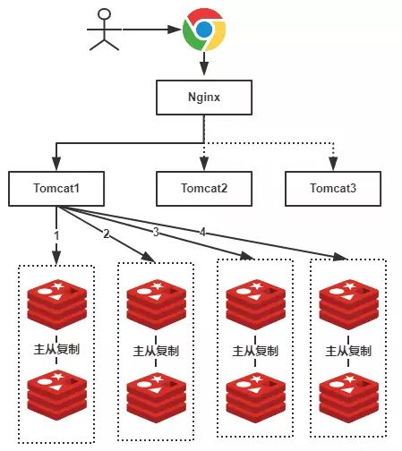
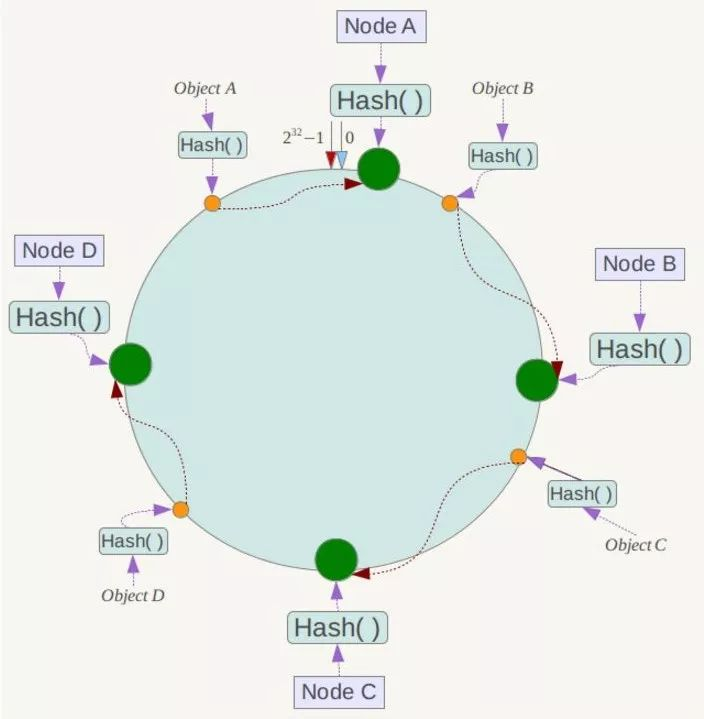

## **一、Redis集群的使用**

我们在使用Redis的时候，为了保证Redis的高可用，提高Redis的读写性能，最简单的方式我们会做主从复制，组成Master-Master或者Master-Slave的形式，或者搭建Redis集群，进行数据的读写分离，类似于数据库的主从复制和读写分离。如下所示：

同样类似于数据库，当单表数据大于500W的时候需要对其进行分库分表，当数据量很大的时候（标准可能不一样，要看Redis服务器容量）我们同样可以对Redis进行类似的操作，就是分库分表。

假设，我们有一个社交网站，需要使用Redis存储图片资源，存储的格式为键值对，key值为图片名称，value为该图片所在文件服务器的路径，我们需要根据文件名查找该文件所在文件服务器上的路径，数据量大概有2000W左右，按照我们约定的规则进行分库，规则就是随机分配，我们可以部署8台缓存服务器，每台服务器大概含有500W条数据，并且进行主从复制，示意图如下：

由于规则是随机的，所有我们的一条数据都有可能存储在任何一组Redis中，例如上图我们用户查找一张名称为”a.png”的图片，由于规则是随机的，我们不确定具体是在哪一个Redis服务器上的，因此我们需要进行1、2、3、4，4次查询才能够查询到（也就是遍历了所有的Redis服务器），这显然不是我们想要的结果，有了解过的小伙伴可能会想到，随机的规则不行，可以使用类似于数据库中的分库分表规则：按照Hash值、取模、按照类别、按照某一个字段值等等常见的规则就可以出来了！好，按照我们的主题，我们就使用Hash的方式。

## **二、为Redis集群使用Hash**

可想而知，如果我们使用Hash的方式，每一张图片在进行分库的时候都可以定位到特定的服务器，示意图如下：

上图中，假设我们查找的是”a.png”，由于有4台服务器（排除从库），因此公式为`hash(a.png) % 4 = 2` ，可知定位到了第2号服务器，这样的话就不会遍历所有的服务器，大大提升了性能！

## **三、使用Hash的问题**

上述的方式虽然提升了性能，我们不再需要对整个Redis服务器进行遍历！但是，使用上述Hash算法进行缓存时，会出现一些缺陷，主要体现在服务器数量变动的时候，所有缓存的位置都要发生改变！

试想一下，如果4台缓存服务器已经不能满足我们的缓存需求，那么我们应该怎么做呢？很简单，多增加几台缓存服务器不就行了！假设：我们增加了一台缓存服务器，那么缓存服务器的数量就由4台变成了5台。那么原本`hash(a.png) % 4 = 2` 的公式就变成了`hash(a.png) % 5 = ？` ， 可想而知这个结果肯定不是2的，这种情况带来的结果就是当服务器数量变动时，所有缓存的位置都要发生改变！换句话说，当服务器数量发生改变时，所有缓存在一定时间内是失效的，当应用无法从缓存中获取数据时，则会向后端数据库请求数据（还记得上一篇的《[缓存雪崩](https://link.zhihu.com/?target=http%3A//mp.weixin.qq.com/s%3F__biz%3DMzI1NDQ3MjQxNA%3D%3D%26mid%3D2247485464%26idx%3D1%26sn%3D8d690fc6f878aadf75977aa7e76cfd08%26chksm%3De9c5f1a9deb278bf512d8b40c30240d0168cdf2cf02142ee913bc11ec39637ca380a4dad524b%26scene%3D21%23wechat_redirect)》吗？）！

同样的，假设4台缓存中突然有一台缓存服务器出现了故障，无法进行缓存，那么我们则需要将故障机器移除，但是如果移除了一台缓存服务器，那么缓存服务器数量从4台变为3台，也是会出现上述的问题！

所以，我们应该想办法不让这种情况发生，但是由于上述Hash算法本身的缘故，使用取模法进行缓存时，这种情况是无法避免的，为了解决这些问题，Hash一致性算法（一致性Hash算法）诞生了！

## **四、一致性Hash算法的神秘面纱**

一致性Hash算法也是使用取模的方法，只是，刚才描述的取模法是对服务器的数量进行取模，而一致性Hash算法是对2^32取模，什么意思呢？简单来说，一致性Hash算法将整个哈希值空间组织成一个虚拟的圆环，如假设某哈希函数H的值空间为0-2^32-1（即哈希值是一个32位无符号整形），整个哈希环如下：

整个空间按顺时针方向组织，圆环的正上方的点代表0，0点右侧的第一个点代表1，以此类推，2、3、4、5、6……直到2^32-1，也就是说0点左侧的第一个点代表2^32-1， 0和2^32-1在零点中方向重合，我们把这个由2^32个点组成的圆环称为Hash环。

下一步将各个服务器使用Hash进行一个哈希，具体可以选择服务器的IP或主机名作为关键字进行哈希，这样每台机器就能确定其在哈希环上的位置，这里假设将上文中四台服务器使用IP地址哈希后在环空间的位置如下：

接下来使用如下算法定位数据访问到相应服务器：将数据key使用相同的函数Hash计算出哈希值，并确定此数据在环上的位置，从此位置沿环顺时针“行走”，第一台遇到的服务器就是其应该定位到的服务器！

例如我们有Object A、Object B、Object C、Object D四个数据对象，经过哈希计算后，在环空间上的位置如下：

根据一致性Hash算法，数据A会被定为到Node A上，B被定为到Node B上，C被定为到Node C上，D被定为到Node D上。

## **五、一致性Hash算法的容错性和可扩展性**

现假设Node C不幸宕机，可以看到此时对象A、B、D不会受到影响，只有C对象被重定位到Node D。一般的，在一致性Hash算法中，如果一台服务器不可用，则受影响的数据仅仅是此服务器到其环空间中前一台服务器（即沿着逆时针方向行走遇到的第一台服务器）之间数据，其它不会受到影响，如下所示：

下面考虑另外一种情况，如果在系统中增加一台服务器Node X，如下图所示：

此时对象Object A、B、D不受影响，只有对象C需要重定位到新的Node X ！一般的，在一致性Hash算法中，如果增加一台服务器，则受影响的数据仅仅是新服务器到其环空间中前一台服务器（即沿着逆时针方向行走遇到的第一台服务器）之间数据，其它数据也不会受到影响。

综上所述，一致性Hash算法对于节点的增减都只需重定位环空间中的一小部分数据，具有较好的容错性和可扩展性。

## **六、Hash环的数据倾斜问题**

一致性Hash算法在服务节点太少时，容易因为节点分部不均匀而造成数据倾斜（被缓存的对象大部分集中缓存在某一台服务器上）问题，例如系统中只有两台服务器，其环分布如下：

此时必然造成大量数据集中到Node A上，而只有极少量会定位到Node B上。为了解决这种数据倾斜问题，一致性Hash算法引入了虚拟节点机制，即对每一个服务节点计算多个哈希，每个计算结果位置都放置一个此服务节点，称为虚拟节点。具体做法可以在服务器IP或主机名的后面增加编号来实现。

例如上面的情况，可以为每台服务器计算三个虚拟节点，于是可以分别计算 “Node A#1”、“Node A#2”、“Node A#3”、“Node B#1”、“Node B#2”、“Node B#3”的哈希值，于是形成六个虚拟节点：

同时数据定位算法不变，只是多了一步虚拟节点到实际节点的映射，例如定位到“Node A#1”、“Node A#2”、“Node A#3”三个虚拟节点的数据均定位到Node A上。这样就解决了服务节点少时数据倾斜的问题。在实际应用中，通常将虚拟节点数设置为32甚至更大，因此即使很少的服务节点也能做到相对均匀的数据分布。

## **七、总结**

上文中，我们一步步分析了什么是一致性Hash算法，主要是考虑到分布式系统每个节点都有可能失效，并且新的节点很可能动态的增加进来的情况，如何保证当系统的节点数目发生变化的时候，我们的系统仍然能够对外提供良好的服务，这是值得考虑的！