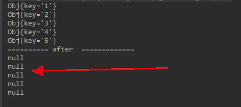
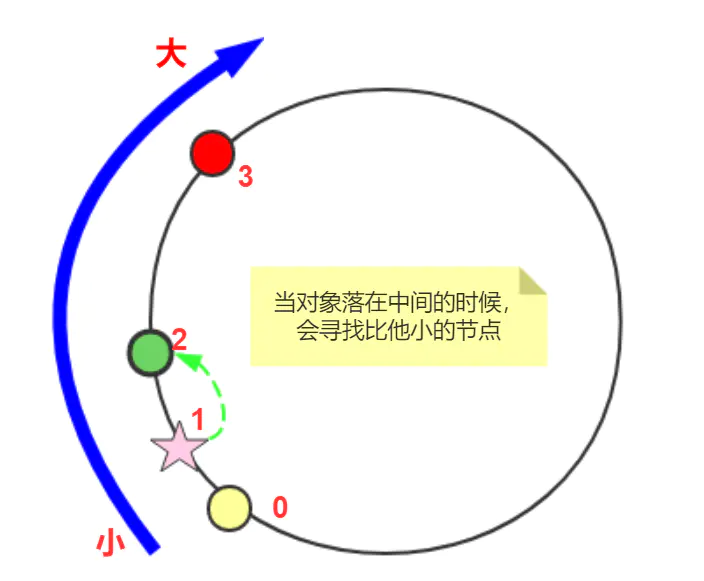
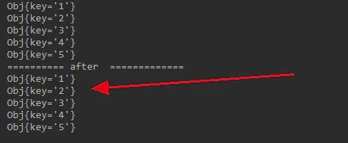

## 普通 hash 的结果

先看看普通 hash 怎么做。

首先，需要缓存节点对象，缓存中的存储对象，还有一个缓存节点集合，用于保存有效的缓存节点。

1. 实际存储对象，很简单的一个类，只需要获取他的 hash 值就好：

```java
  static class Obj {
    String key;
    Obj(String key) {
      this.key = key;
    }
    @Override
    public int hashCode() {
      return key.hashCode();
    }
    @Override
    public String toString() {
      return "Obj{" +
          "key='" + key + '\'' +
          '}';
    }
  }
```

1. 缓存节点对象，用于存储实际对象：

```java
  static class Node {

    Map<Integer, Obj> node = new HashMap<>();
    String name;

    Node(String name) {
      this.name = name;
    }

    public void putObj(Obj obj) {
      node.put(obj.hashCode(), obj);
    }

    Obj getObj(Obj obj) {
      return node.get(obj.hashCode());java
    }

    @Override
    public int hashCode() {
      return name.hashCode();
    }
  }
```

也很简单，内部使用了一个 map 保存节点。

1. 缓存节点集合，用于保存有效的缓存节点：

```java
 static class NodeArray {

    Node[] nodes = new Node[1024];
    int size = 0;

    public void addNode(Node node) {
      nodes[size++] = node;
    }

    Obj get(Obj obj) {
      int index = obj.hashCode() % size;
      return nodes[index].getObj(obj);
    }

    void put(Obj obj) {
      int index = obj.hashCode() % size;
      nodes[index].putObj(obj);
    }
  }
```

内部一个数组，取数据时，通过取余机器数量获取缓存节点，再从节点中取出数据。

1. 测试：当增减节点时，还能不能找到原有数据：

```java
 /**
   * 验证普通 hash 对于增减节点，原有会不会出现移动。
   */
  public static void main(String[] args) {

    NodeArray nodeArray = new NodeArray();

    Node[] nodes = {
        new Node("Node--> 1"),
        new Node("Node--> 2"),
        new Node("Node--> 3")
    };

    for (Node node : nodes) {
      nodeArray.addNode(node);
    }

    Obj[] objs = {
        new Obj("1"),
        new Obj("2"),
        new Obj("3"),
        new Obj("4"),
        new Obj("5")
    };

    for (Obj obj : objs) {
      nodeArray.put(obj);
    }

    validate(nodeArray, objs);
  }

  private static void validate(NodeArray nodeArray, Obj[] objs) {
    for (Obj obj : objs) {
      System.out.println(nodeArray.get(obj));
    }

    nodeArray.addNode(new Node("anything1"));
    nodeArray.addNode(new Node("anything2"));

    System.out.println("========== after  =============");

    for (Obj obj : objs) {
      System.out.println(nodeArray.get(obj));
    }
  }
```

测试步骤如下：

1. 向集合中添加 3 个节点。
2. 向 `集群` 中添加 5 个对象，这 5 个对象会根据 hash 值散列到不同的节点中。
3. 打印 `未增减前` 的数据。
4. 打印 `增加 2 个节点` 后数据，看看还能不能访问到数据。

结果：





一个都访问不到了。这就是普通的取余的缺点，在增减机器的情况下，这种结果无法接收。

再看看一致性 hash 如何解决。

## 一致性 Hash 的结果

关键的地方来了。

缓存节点对象和实际保存对象不用更改，改的是什么？

改的是保存对象的方式和取出对象的方式，也就是不使用对机器进行取余的算法。

新的 NodeArray 对象如下：

```java
static class NodeArray {

/** 按照 键 排序*/
TreeMap<Integer, Node> nodes = new TreeMap<>();

void addNode(Node node) {
  nodes.put(node.hashCode(), node);
}

void put(Obj obj) {
  int objHashcode = obj.hashCode();
  Node node = nodes.get(objHashcode);
  if (node != null) {
    node.putObj(obj);
    return;
  }

  // 找到比给定 key 大的集合
  SortedMap<Integer, Node> tailMap = nodes.tailMap(objHashcode);
  // 找到最小的节点
  int nodeHashcode = tailMap.isEmpty() ? nodes.firstKey() : tailMap.firstKey();
  nodes.get(nodeHashcode).putObj(obj);

}

Obj get(Obj obj) {
  Node node = nodes.get(obj.hashCode());
  if (node != null) {
    return node.getObj(obj);
  }

  // 找到比给定 key 大的集合
  SortedMap<Integer, Node> tailMap = nodes.tailMap(obj.hashCode());
  // 找到最小的节点
  int nodeHashcode = tailMap.isEmpty() ? nodes.firstKey() : tailMap.firstKey();
  return nodes.get(nodeHashcode).getObj(obj);
}
}

```

该类和之前的类的不同之处在于：

1. 内部没有使用数组，而是使用了有序 Map。
2. put 方法中，对象如果没有落到缓存节点上，就找比他小的节点且离他最近的。这里我们使用了 TreeMap 的 tailMap 方法，具体 API 可以看文档。
3. get 方法中，和 put 步骤相同，否则是取不到对象的。

具体寻找节点的方式如图：





相同的测试用例，执行结果如下：





找到了之前所有的节点。解决了普通 hash 的问题。

## 总结

代码比较简单，主要是通过 JDK 自带的 TreeMap 实现的寻找临近节点。当然，我们这里也只是测试了添加，关于修改还没有测试，但思路是一样的。这里只是做一个抛砖引玉。

>
> 
> 作者：莫那·鲁道
> 链接：https://juejin.im/post/5abf8f3851882555731c42d1
> 来源：掘金
> 著作权归作者所有。商业转载请联系作者获得授权，非商业转载请注明出处。