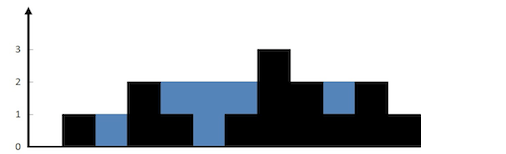

给定 n 个非负整数表示每个宽度为 1 的柱子的高度图，计算按此排列的柱子，下雨之后能接多少雨水。

 

上面是由数组 [0,1,0,2,1,0,1,3,2,1,2,1] 表示的高度图，在这种情况下，可以接 6 个单位的雨水（蓝色部分表示雨水）。 感谢 Marcos 贡献此图。

示例:

输入: [0,1,0,2,1,0,1,3,2,1,2,1]
输出: 6

> 来源：力扣（LeetCode）
> 链接：https://leetcode-cn.com/problems/trapping-rain-water
> 著作权归领扣网络所有。商业转载请联系官方授权，非商业转载请注明出处。

```java
package com.ymj.algorithm;

import java.util.Stack;

public class Rain {

    public static void main(String[] args) {
//        int[] ints = {2, 1, 0, 2, 1, 0, 1, 3, 2, 1, 2, 1};
        int[] ints = {0,1,0,2,1,0,1,3,2,1,2,1};
        System.out.println(trapThree(ints));
    }

    /**
     * 暴力法
     * i位置能蓄多少水，这个我们需要看他左右的最小高度minMax，如果比他高那么它才能蓄水，能蓄水多少=minMax-i.height
     */
    public int trapOne(int[] height) {
        int sum = 0;
        int length = height.length;
        // 数组的左右两端是不需要处理的，因为没法形成低洼地蓄水
        for (int i = 1; i < length - 1; i++) {
            int lMax = 0, rMax = 0;
            for (int j = i; j >= 0; j--) {
                lMax = Math.max(lMax, height[j]);
            }
            for (int j = i; j < length; j++) {
                rMax = Math.max(rMax, height[j]);
            }
            sum += Math.min(lMax, rMax) - height[i];
        }
        return sum;
    }

    /**
     * 在暴力法的基础上，我们需要提前记录下，i这个位置的left max, 和 right max
     * 这让可以让时间复杂度 编程O(n) , 空间换时间
     */
    public int trapTwo(int[] height) {
        if (height.length == 0) return 0;
        int sum = 0;
        int length = height.length;
        int[] leftMax = new int[length];
        int[] rightMax = new int[length];
        leftMax[0] = height[0];
        for (int i = 1; i < length; i++) {
            leftMax[i] = Math.max(height[i], leftMax[i - 1]);
        }
        rightMax[length - 1] = height[length - 1];
        for (int i = length - 2; i >= 0; i--) {
            rightMax[i] = Math.max(height[i], rightMax[i + 1]);
        }
        for (int i = 1; i < length - 1; i++) {
            sum += Math.min(leftMax[i], rightMax[i]) - height[i];
        }
        return sum;
    }

    /**
     * 使用双指针
     * 每次先比较左右两边谁比较高，如果右边比较高，那么左边能蓄水说少，需要left位置的 height[left] < left_max ,否则不能蓄水，同时需要更新这个left_max
     * 反之 right 位置的 height[right] < right_max 否则也无法蓄水，同时需要更新这个right_max
     */
    public static int trapThree(int[] height) {
        int left = 0, right = height.length - 1;
        int ans = 0;
        int left_max = 0, right_max = 0;
        while (left < right) {
            if (height[left] < height[right]) {
                if (height[left] >= left_max) {
                    left_max = height[left];
                } else {
                    ans += (left_max - height[left]);
                }
                ++left;
            } else {
                if (height[right] >= right_max) {
                    right_max = height[right];
                } else {
                    ans += (right_max - height[right]);
                }
                --right;
            }
        }
        return ans;
    }


    /**
     * 使用栈来存储条形块的索引下标。
     * 当栈非空且 height[current]>height[st.peek()]开始在查看，这个位置的前后是否能形成一个低洼地
     * distance = current - st.peek() - 1; // 计算储水长度
     * bounded_height = Math.min(height[current], height[st.peek()]) - height[top]; 计算储水高度
     */
    public static int trapFour(int[] height) {
        int ans = 0, current = 0;
        Stack<Integer> st = new Stack<>();
        while (current < height.length) {
            while (!st.empty() && height[current] > height[st.peek()]) {
                int top = st.peek();
                st.pop();
                if (st.empty())
                    break;
                int distance = current - st.peek() - 1;
                int bounded_height = Math.min(height[current], height[st.peek()]) - height[top];
                ans += distance * bounded_height;
            }
            st.push(current++);
        }
        return ans;
    }


}
```