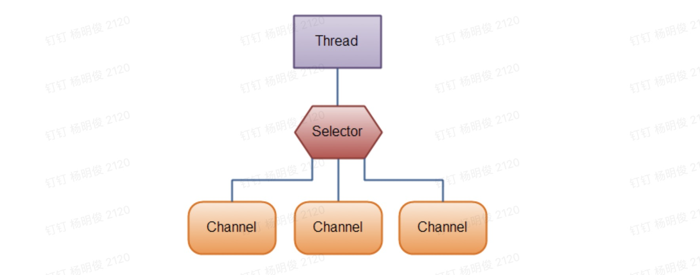

## Java NIO系列教程（一） Java NIO 概述

[原文链接](http://tutorials.jenkov.com/java-nio/overview.html)   **作者：**Jakob Jenkov   **译者：**airu   **校对：**丁一

转载自[并发编程网 – ifeve.com](https://ifeve.com/)**本文链接地址:** [Java NIO系列教程（一） Java NIO 概述](https://ifeve.com/overview/)

Java NIO 由以下几个核心部分组成：

- Channels
- Buffers
- Selectors

虽然Java NIO 中除此之外还有很多类和组件，但在我看来，Channel，Buffer 和 Selector 构成了核心的API。其它组件，如Pipe和FileLock，只不过是与三个核心组件共同使用的工具类。因此，在概述中我将集中在这三个组件上。其它组件会在单独的章节中讲到。

### Channel 和 Buffer

基本上，所有的 IO 在NIO 中都从一个Channel 开始。Channel 有点像流。 数据可以从Channel读到Buffer中，也可以从Buffer 写到Channel中。这里有个图示：

Channel和Buffer有好几种类型。下面是JAVA NIO中的一些主要Channel的实现：

- FileChannel
- DatagramChannel
- SocketChannel
- ServerSocketChannel

正如你所看到的，这些通道涵盖了UDP 和 TCP 网络IO，以及文件IO。

与这些类一起的有一些有趣的接口，但为简单起见，我尽量在概述中不提到它们。本教程其它章节与它们相关的地方我会进行解释。

以下是Java NIO里关键的Buffer实现：

- ByteBuffer
- CharBuffer
- DoubleBuffer
- FloatBuffer
- IntBuffer
- LongBuffer
- ShortBuffer

这些Buffer覆盖了你能通过IO发送的基本数据类型：byte, short, int, long, float, double 和 char。

Java NIO 还有个 MappedByteBuffer，用于表示内存映射文件， 我也不打算在概述中说明。

### Selector

Selector允许单线程处理多个 Channel。如果你的应用打开了多个连接（通道），但每个连接的流量都很低，使用Selector就会很方便。例如，在一个聊天服务器中。

这是在一个单线程中使用一个Selector处理3个Channel的图示：

要使用Selector，得向Selector注册Channel，然后调用它的select()方法。这个方法会一直阻塞到某个注册的通道有事件就绪。一旦这个方法返回，线程就可以处理这些事件，事件的例子有如新连接进来，数据接收等。