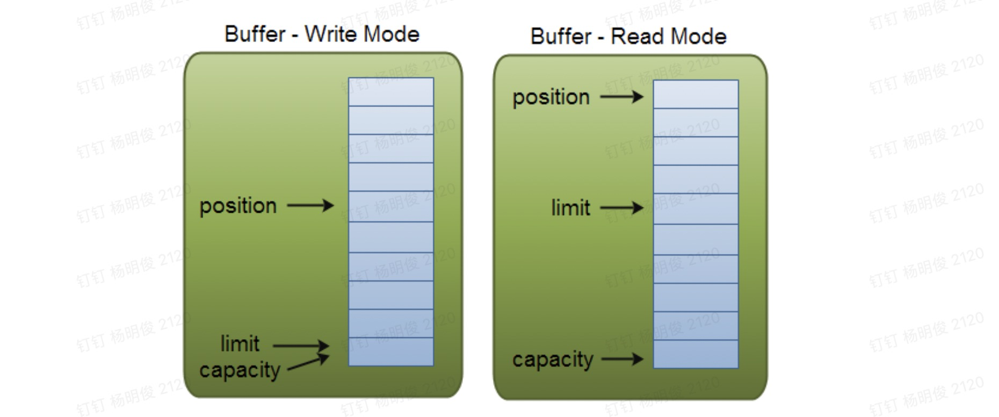

## Java NIO系列教程（三） Buffer

[原文链接](http://tutorials.jenkov.com/java-nio/buffers.html)   **作者：**Jakob Jenkov   **译者：**airu   **校对：**丁一

转载自[并发编程网 – ifeve.com](https://ifeve.com/)**本文链接地址:** [Java NIO系列教程（三） Buffer](https://ifeve.com/buffers/)


Java NIO中的Buffer用于和NIO通道进行交互。如你所知，数据是从通道读入缓冲区，从缓冲区写入到通道中的。

缓冲区本质上是一块可以写入数据，然后可以从中读取数据的内存。这块内存被包装成NIO Buffer对象，并提供了一组方法，用来方便的访问该块内存。

下面是NIO Buffer相关的话题列表：

1. [Buffer的基本用法](#Buffer的基本用法)
2. [Buffer的capacity,position和limit](#Buffer的capacity,position和limit)
3. [Buffer的类型](#Buffer的类型)
4. [Buffer的分配](#Buffer的分配)
5. [向Buffer中写数据](#向Buffer中写数据)
6. [flip()方法](#flip()方法)
7. [从Buffer中读取数据](#从Buffer中读取数据)
8. [clear()与compact()方法](#clear()与compact()方法)
9. [mark()与reset()方法](#mark()与reset()方法)
10. [equals()与compareTo()方法](#equals()与compareTo()方法)


### Buffer的基本用法

使用Buffer读写数据一般遵循以下四个步骤：

1. 写入数据到Buffer
2. 调用`flip()`方法
3. 从Buffer中读取数据
4. 调用`clear()`方法或者`compact()`方法

当向buffer写入数据时，buffer会记录下写了多少数据。一旦要读取数据，需要通过flip()方法将Buffer从写模式切换到读模式。在读模式下，可以读取之前写入到buffer的所有数据。

一旦读完了所有的数据，就需要清空缓冲区，让它可以再次被写入。有两种方式能清空缓冲区：调用clear()或compact()方法。clear()方法会清空整个缓冲区。compact()方法只会清除已经读过的数据。任何未读的数据都被移到缓冲区的起始处，新写入的数据将放到缓冲区未读数据的后面。

下面是一个使用Buffer的例子：

```
RandomAccessFile aFile = new RandomAccessFile("data/nio-data.txt", "rw");
FileChannel inChannel = aFile.getChannel();

//create buffer with capacity of 48 bytes
ByteBuffer buf = ByteBuffer.allocate(48);

int bytesRead = inChannel.read(buf); //read into buffer.
while (bytesRead != -1) {

  buf.flip();  //make buffer ready for read

  while(buf.hasRemaining()){
      System.out.print((char) buf.get()); // read 1 byte at a time
  }

  buf.clear(); //make buffer ready for writing
  bytesRead = inChannel.read(buf);
}
aFile.close();
```

### Buffer的capacity,position和limit

缓冲区本质上是一块可以写入数据，然后可以从中读取数据的内存。这块内存被包装成NIO Buffer对象，并提供了一组方法，用来方便的访问该块内存。

为了理解Buffer的工作原理，需要熟悉它的三个属性：

- capacity
- position
- limit

position和limit的含义取决于Buffer处在读模式还是写模式。不管Buffer处在什么模式，capacity的含义总是一样的。

这里有一个关于capacity，position和limit在读写模式中的说明，详细的解释在插图后面。



#### capacity

作为一个内存块，Buffer有一个固定的大小值，也叫“capacity”.你只能往里写capacity个byte、long，char等类型。一旦Buffer满了，需要将其清空（通过读数据或者清除数据）才能继续写数据往里写数据。

#### position

当你写数据到Buffer中时，position表示当前的位置。初始的position值为0.当一个byte、long等数据写到Buffer后， position会向前移动到下一个可插入数据的Buffer单元。position最大可为capacity – 1.

当读取数据时，也是从某个特定位置读。当将Buffer从写模式切换到读模式，position会被重置为0. 当从Buffer的position处读取数据时，position向前移动到下一个可读的位置。

#### limit

在写模式下，Buffer的limit表示你最多能往Buffer里写多少数据。 写模式下，limit等于Buffer的capacity。

当切换Buffer到读模式时， limit表示你最多能读到多少数据。因此，当切换Buffer到读模式时，limit会被设置成写模式下的position值。换句话说，你能读到之前写入的所有数据（limit被设置成已写数据的数量，这个值在写模式下就是position）

### Buffer的类型

Java NIO 有以下Buffer类型

- ByteBuffer
- MappedByteBuffer
- CharBuffer
- DoubleBuffer
- FloatBuffer
- IntBuffer
- LongBuffer
- ShortBuffer

p<>
如你所见，这些Buffer类型代表了不同的数据类型。换句话说，就是可以通过char，short，int，long，float 或 double类型来操作缓冲区中的字节。

MappedByteBuffer 有些特别，在涉及它的专门章节中再讲。

### Buffer的分配

要想获得一个Buffer对象首先要进行分配。 每一个Buffer类都有一个allocate方法。下面是一个分配48字节capacity的ByteBuffer的例子。

```
ByteBuffer buf = ByteBuffer.allocate(48);
```

这是分配一个可存储1024个字符的CharBuffer：

```
CharBuffer buf = CharBuffer.allocate(1024);
```

### 向Buffer中写数据

写数据到Buffer有两种方式：

- 从Channel写到Buffer。
- 通过Buffer的put()方法写到Buffer里。

从Channel写到Buffer的例子

```
int bytesRead = inChannel.read(buf);  //read into buffer.
```

通过put方法写Buffer的例子：

```
buf.put(127);
```

put方法有很多版本，允许你以不同的方式把数据写入到Buffer中。例如， 写到一个指定的位置，或者把一个字节数组写入到Buffer。 更多Buffer实现的细节参考JavaDoc。

#### flip()方法

flip方法将Buffer从写模式切换到读模式。调用flip()方法会将position设回0，并将limit设置成之前position的值。

换句话说，position现在用于标记读的位置，limit表示之前写进了多少个byte、char等 —— 现在能读取多少个byte、char等。

### 从Buffer中读取数据

从Buffer中读取数据有两种方式：

1. 从Buffer读取数据到Channel。
2. 使用get()方法从Buffer中读取数据。

从Buffer读取数据到Channel的例子：

```
//read from buffer into channel.
int bytesWritten = inChannel.write(buf);
```

使用get()方法从Buffer中读取数据的例子

```
byte aByte = buf.get();
```

get方法有很多版本，允许你以不同的方式从Buffer中读取数据。例如，从指定position读取，或者从Buffer中读取数据到字节数组。更多Buffer实现的细节参考JavaDoc。

### rewind()方法

Buffer.rewind()将position设回0，所以你可以重读Buffer中的所有数据。limit保持不变，仍然表示能从Buffer中读取多少个元素（byte、char等）。

### clear()与compact()方法

一旦读完Buffer中的数据，需要让Buffer准备好再次被写入。可以通过clear()或compact()方法来完成。

如果调用的是clear()方法，position将被设回0，limit被设置成 capacity的值。换句话说，Buffer 被清空了。Buffer中的数据并未清除，只是这些标记告诉我们可以从哪里开始往Buffer里写数据。

如果Buffer中有一些未读的数据，调用clear()方法，数据将“被遗忘”，意味着不再有任何标记会告诉你哪些数据被读过，哪些还没有。

如果Buffer中仍有未读的数据，且后续还需要这些数据，但是此时想要先先写些数据，那么使用compact()方法。

compact()方法将所有未读的数据拷贝到Buffer起始处。然后将position设到最后一个未读元素正后面。limit属性依然像clear()方法一样，设置成capacity。现在Buffer准备好写数据了，但是不会覆盖未读的数据。

### mark()与reset()方法

通过调用Buffer.mark()方法，可以标记Buffer中的一个特定position。之后可以通过调用Buffer.reset()方法恢复到这个position。例如：

```
buffer.mark();

//call buffer.get() a couple of times, e.g. during parsing.

buffer.reset();  //set position back to mark.
```

### equals()与compareTo()方法

可以使用equals()和compareTo()方法两个Buffer。

#### equals()

当满足下列条件时，表示两个Buffer相等：

1. 有相同的类型（byte、char、int等）。
2. Buffer中剩余的byte、char等的个数相等。
3. Buffer中所有剩余的byte、char等都相同。

如你所见，equals只是比较Buffer的一部分，不是每一个在它里面的元素都比较。实际上，它只比较Buffer中的剩余元素。

#### compareTo()方法

compareTo()方法比较两个Buffer的剩余元素(byte、char等)， 如果满足下列条件，则认为一个Buffer“小于”另一个Buffer：

1. 第一个不相等的元素小于另一个Buffer中对应的元素 。
2. 所有元素都相等，但第一个Buffer比另一个先耗尽(第一个Buffer的元素个数比另一个少)。

*（译注：剩余元素是从 position到limit之间的元素）*