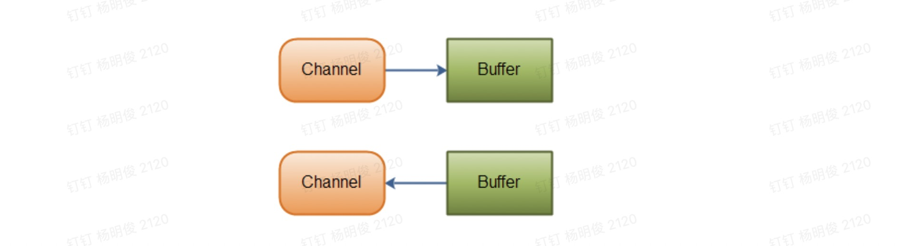

## Java NIO系列教程（二） Channel

[原文链接](http://tutorials.jenkov.com/java-nio/channels.html)   **作者：**Jakob Jenkov   **译者：**airu   **校对：**丁一

转载自[并发编程网 – ifeve.com](https://ifeve.com/)**本文链接地址:** [Java NIO系列教程（二） Channel](https://ifeve.com/channels/)


Java NIO的Channel类似流，但又有些不同：

Channel 用于字节缓冲区和通道另一侧的实体（文件/socket...）进行数据传输

- 既可以从通道中读取数据，又可以写数据到通道。但流的读写通常是单向的。
- 通道可以异步地读写。
- 通道中的数据总是要先读到一个Buffer，或者总是要从一个Buffer中写入。

正如上面所说，从通道读取数据到缓冲区，从缓冲区写入数据到通道。如下图所示：




### Channel的实现

这些是Java NIO中最重要的通道的实现：

- FileChannel 从文件中读写数据。
- DatagramChannel 能通过UDP读写网络中的数据。
- SocketChannel 能通过TCP读写网络中的数据。
- ServerSocketChannel 可以监听新进来的TCP连接，像Web服务器那样。对每一个新进来的连接都会创建一个SocketChannel。

### 基本的 Channel 示例

```java
RandomAccessFile aFile = new RandomAccessFile("data/nio-data.txt", "rw");
FileChannel inChannel = aFile.getChannel();

ByteBuffer buf = ByteBuffer.allocate(48);

int bytesRead = inChannel.read(buf);
while (bytesRead != -1) {
	System.out.println("Read " + bytesRead);
	buf.flip();

    while(buf.hasRemaining()){
        System.out.print((char) buf.get());
    }

	buf.clear();
	bytesRead = inChannel.read(buf);
}
aFile.close();
```

下面是一个使用FileChannel读取数据到Buffer中的示例：注意 buf.flip() 的调用，首先读取数据到Buffer，然后反转Buffer,接着再从Buffer中读取数据。下一节会深入讲解Buffer的更多细节。