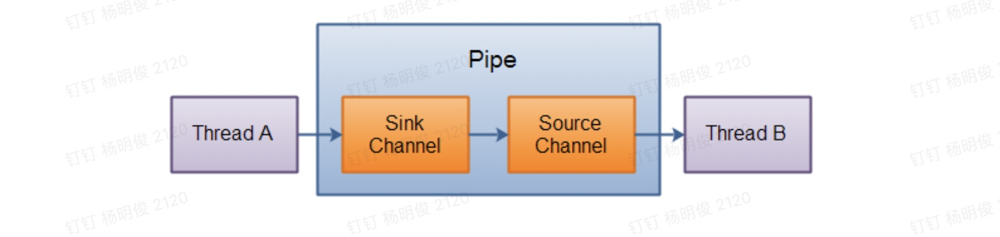

## Java NIO系列教程（十一） Pipe

[原文链接](http://tutorials.jenkov.com/java-nio/pipe.html)   **作者：**Jakob Jenkov   **译者：**黄忠    **校对：**丁一

转载自[并发编程网 – ifeve.com](https://ifeve.com/)**本文链接地址:** [Java NIO系列教程（十一） Pipe](https://ifeve.com/pipe/)


Java NIO 管道是2个线程之间的单向数据连接。`Pipe`有一个source通道和一个sink通道。数据会被写到sink通道，从source通道读取。

这里是Pipe原理的图示：



### 创建管道

通过`Pipe.open()`方法打开管道。例如：

```
Pipe pipe = Pipe.open();
```

### 向管道写数据

要向管道写数据，需要访问sink通道。像这样：

```
Pipe.SinkChannel sinkChannel = pipe.sink();
```

通过调用SinkChannel的`write()`方法，将数据写入`SinkChannel`,像这样：

```
String newData = "New String to write to file..." + System.currentTimeMillis();
ByteBuffer buf = ByteBuffer.allocate(48);
buf.clear();
buf.put(newData.getBytes());

buf.flip();

while(buf.hasRemaining()) {
    sinkChannel.write(buf);
}
```

### 从管道读取数据

从读取管道的数据，需要访问source通道，像这样：

```
Pipe.SourceChannel sourceChannel = pipe.source();
```

调用source通道的`read()`方法来读取数据，像这样：

```
ByteBuffer buf = ByteBuffer.allocate(48);

int bytesRead = sourceChannel.read(buf);
```

`read()`方法返回的int值会告诉我们多少字节被读进了缓冲区。

