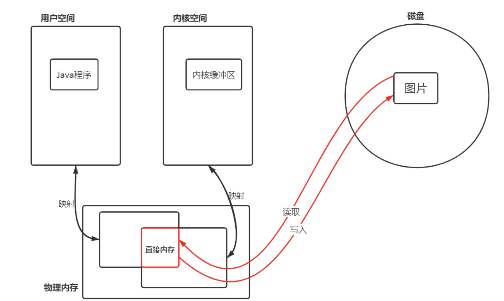

[Linux IO 原理和 Zero-copy 技术全面揭秘](../../../操作系统学习/Linux IO 原理和 Zero-copy 技术全面揭秘.md)

# linux 的socket 缓冲区

**每个 socket 被创建后，都会分配两个缓冲区，输入缓冲区和输出缓冲区**。

# 操作系统的的缓冲区.....中存的是什么数据？

字节数据（存的的0，1......）

# 操作系统提供的IO读写方法做了什么

write()/send() 并不立即向网络中传输数据，而是先将数据写入缓冲区中，再由TCP协议将数据从缓冲区发送到目标机器。一旦将数据写入到缓冲区，函数就可以成功返回，不管它们有没有到达目标机器，也不管它们何时被发送到网络，这些都是TCP协议负责的事情。

TCP协议独立于 write()/send() 函数，数据有可能刚被写入缓冲区就发送到网络，也可能在缓冲区中不断积压，多次写入的数据被一次性发送到网络，这取决于当时的网络情况、当前线程是否空闲等诸多因素，不由程序员控制。

read()/recv() 函数也是如此，也从输入缓冲区中读取数据，而不是直接从网络中读取。

这些I/O缓冲区特性可整理如下：

- I/O缓冲区在每个TCP套接字中单独存在；
- I/O缓冲区在创建套接字时自动生成；
- 即使关闭套接字也会继续传送输出缓冲区中遗留的数据；
- 关闭套接字将丢失输入缓冲区中的数据。

输入输出缓冲区的默认大小一般都是 8K，可以通过 getsockopt() 函数获取：

```c
unsigned optVal;
int optLen = sizeof(int);
getsockopt(servSock, SOL_SOCKET, SO_SNDBUF, (char*)&optVal, &optLen);
printf("Buffer length: %d\n", optVal);
```

> ————————————————
> 版权声明：本文为CSDN博主「Ideal Dragon」的原创文章，遵循CC 4.0 BY-SA版权协议，转载请附上原文出处链接及本声明。
> 原文链接：https://blog.csdn.net/qq_22121229/article/details/103132948

# 为什么 java中定义的 channel 的数据只能和 buffer 交互？

在操作系统内核中，socket等IO的数据是放在操作系统为其分配的缓冲区中的，java channel使用缓冲区应该也是基于此，这样可以和内核的buffer一对一进行数据块的传输

# 为什么本地文件IO没有非阻塞模式？

个人臆测：可能现代的磁盘没有这个能力做到查找扇区成功之后再通知就绪了只能查找到扇区直接读，查找到扇区直接写

# [零拷贝](零拷贝之mmap和sendFile.md)

只有file和其他套接字或文件间的IO可以使用零拷贝，应用场景：比如我们有一份处理好的文件数据，不需要在做业务处理就可以直接使用的数据，就可以通过这个方式直接将数据传给socket套接字通道，这样就避免了内核态到用户态用户态到内核态的切换

NIO中使用的是FileChannel的 transferTo(),transferFrom()方法来实现的

还有一种是需要对文件中的数据做处理后再传给socket的场景，会使用到mmap

# java nio 的buffer 使用的内存是 JVM的还是操作系统内核的 还是 其他直接内存

有两种：

1. （`ByteBuffer.allocate();`）使用JVM的内存，目的是能够和操作系统内核缓冲区做更换（一个缓冲区大小的量，而不是一个个字节的读取）的数据交换

2. 直接字节缓冲区 （ByteBuffer）：是通过 `ByteBuffer.allocateDirect() `创建的

   它使用的内存操作系统的内存。创建的成本更高，但是它和操作系统的数据传输会更快更直接，其他方式创建的缓冲区都是在JVM中创建的非直接字节缓冲区，**再和操作系统交互的时候会创建一个临时直接字节缓冲区**（直接分配的方式省略了这一步，当我们要写缓冲区很大的时候这个的性能会更好）
   
   **那么这个直接内存是内核态还是用户态呢？**
   
   在这之前我们要了解一个事情：java中的堆，是java进程在运行时管理的一块内存，这块内存之外的内存以及不被内核和其他进程使用的内存就是直接内存，他是属于用户态的，**我们通常的IO操作它其实是从jvm堆到直接内存再到内核内存，反过来也是**；我呢在调用ByteBuffer.allocateDirect()创建的其实就是一个直接内存，这样在使用的时候就可以减少一次内存拷贝，提升性能，但是如果这个使用不当也是会造成直接内存的内存溢出问题的，而ByteBuffer.allocate();在使用的时候只有在传输数据的时候才会去创建一个临时的直接内存缓冲区，用完就回即使回收掉。
   
   https://www.zhihu.com/question/376317973
   
   


