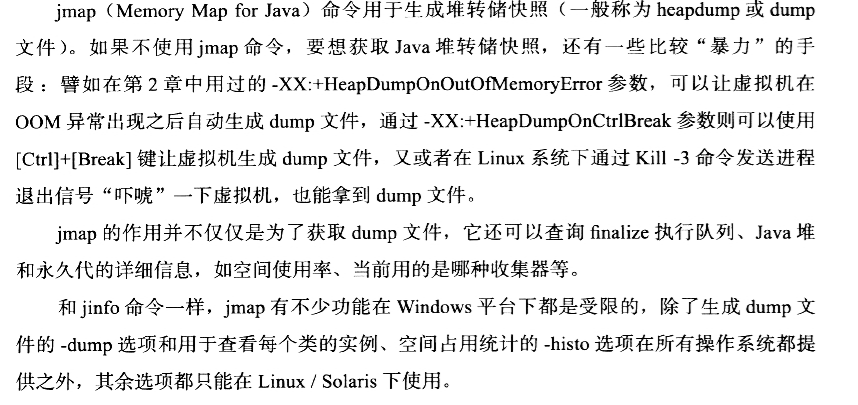
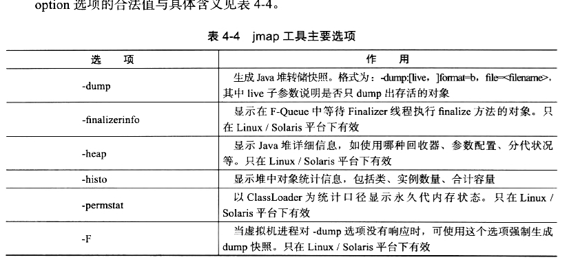
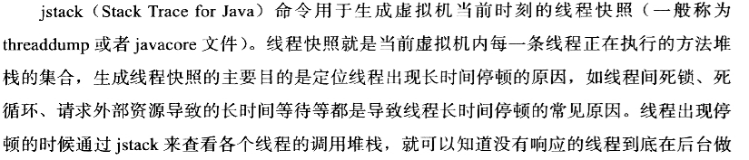

# 文本化工具整体介绍	

| 名称                                  | 功能                                                         |
| ------------------------------------- | ------------------------------------------------------------ |
| [jps](#jps：虚拟机进程状况监控工具)   | JVM Process  Status Tool （JVM 进程状态工具）, 显示系统中所有HotSpot虚拟机进程 |
| [jstat](#jstat ：GC统计信息监控工具)  | JVM Statistics Monitoring Tool, 用于收集HotSpot虚拟机各方面运行数据 |
| [jinfo](#jinfo：JVM配置信息管理工具)  | Configuration Info for Java , 显示虚拟机配置信息             |
| [jmap](#jmap：java内存映射工具)       | Memory Map for Java , 生成虚拟机的内存转储快照（headdump文件，用于分析JVM内存使用状况） |
| [jhat](#jhat：虚拟机转储快照分析工具) | JVM heap Dump Browser 用于分析 headdump 文件，他会建立一个HTTP/HTML 服务器，让用户可以在浏览器上查询分析结果 |
| [jstack](#jstack：java堆栈跟踪工具)   | Stack Trace for Java 显示虚拟机栈的线程快照信息              |

## jps：虚拟机进程状况监控工具

他的功能和Linux系统的ps命令类似：**可以列出正在运行的虚拟机进程，并显示虚拟机执行主类（Main Class,main() 函数所在的类）名称以及这些进程的本地虚拟机唯一ID (Local Virtual Machine Identifier , LVMID),索然功能比较单一但它的使用频率相当高，因为其他的JDK工具都需要使用它查出来的LVMID来确定要监控的的虚拟机进程；**

对于我们的本地的虚拟机进程来说，LVMID 和 PID( process Identifier )是一致的，但如果同时启动了多个虚拟机进程，无法根据进程名称定位的时候，就可以使用 jps 命令显示主类的这个功能才能区分了

命令格式：

```
jps [options] [hostid]
```

jps 可以通过RMI协议来查询开启了RMI服务的远程虚拟机进程的状态

hostid 位RMI注册表中注册的主机名，jps的options 常见的有

| option | 功能                                                   |
| ------ | ------------------------------------------------------ |
| -q     | 只输出LVMID 省略主类的名称                             |
| -m     | 输出虚拟机进程启动时传递给主类main()函数的参数         |
| -l     | 输出主类的全名，如果进程执行的是jar包，输出jar包的全名 |
| -v     | 输出虚拟机启动时候的JVM参数                            |

## jstat ：GC统计信息监控工具

虚拟机统计信息监控工具，用于收集HotSpot虚拟机各方面运行数据

**它可以显示本地或远程虚拟机进程中的类装载，内存，垃圾收集，JIT编译等运行数据，在没有GUI图形界面的时候，它将是运行期定位虚拟机性能问题的首选工具**

```
 jstat [option vmid [ interval[s|ms] [count] ] ]
```

vmid设lvimd的区别，再本地的时候他们是一样的，但是如果再远程的情况下

= vimd@hostname:[port....]/[servername] , 例如

```
jstat -gcutil 18883@10.202.37.75:1099 1000 1000
vimd = 18883 ; hostname = 10.202.37.75 ; port = 1099 1000 1000 (三个端口)
```

我们通过 `jstat -options` 可以查看它的所有支持的参数

```
[root@iZgtrmozhir1gjZ /]# jstat -options
-class
-compiler
-gc
-gccapacity
-gccause
-gcmetacapacity
-gcnew
-gcnewcapacity
-gcold
-gcoldcapacity
-gcutil
-printcompilation
```

### **各参数适用详细介绍：**

1、`jstat –class <pid>` : 显示加载class的数量，及所占空间等信息。

| 列名     | 意义                     |
| -------- | ------------------------ |
| Loaded   | 装载的类的数量           |
| Bytes    | 装载类所占用的字节数     |
| Unloaded | 卸载类的数量             |
| Bytes    | 卸载类的字节数           |
| Time     | 装载和卸载类所花费的时间 |

2、`jstat -compiler <pid>`显示VM实时编译的数量等信息。

| 列名         | 意义                               |
| ------------ | ---------------------------------- |
| Compiled     | 编译任务执行数量                   |
| Failed       | 编译任务执行失败数量               |
| Invalid      | 编译任务执行无效数量               |
| Time         | 编译任务消耗时间                   |
| FailedType   | 最后一个编译失败任务的类型         |
| FailedMethod | 最后一个编译失败任务所在的类及方法 |

3、`jstat -gc <pid>`: 可以显示gc的信息，查看gc的次数，及时间。

| 列名         | 意义                               |
| ------------ | ---------------------------------- |
|S0C	|年轻代中第一个survivor 的容量 (字节)|
|S1C	|年轻代中第二个survivor 的容量 (字节)|
|S0U	|年轻代中第一个survivor 目前已使用空间 (字节)|
|S1U	|年轻代中第二个survivor 目前已使用空间 (字节)|
|EC	|年轻代中Eden 的容量 (字节)|
|EU	|年轻代中Eden 目前已使用空间 (字节)|
|OC	|Old代的容量 (字节)|
|OU	|Old代目前已使用空间 (字节)|
|PC	|Perm(持久代)的容量 (字节)|
|PU	|Perm(持久代)目前已使用空间 (字节)|
|YGC	|从应用程序启动到采样时年轻代中gc次数|
|YGCT	|从应用程序启动到采样时年轻代中gc所用时间(s)|
|FGC	|从应用程序启动到采样时old代gc次数(全gc)|
|FGCT	|从应用程序启动到采样时old代gc所用时间(s)(全gc)|
|GCT	|从应用程序启动到采样时gc用的总时间(s)|

4、`jstat -gccapacity <pid>`:和-gc差不多，但是更关注java堆各个区域使用到的最大，最小空间

| 列名  | 意义                                    |
| ----- | --------------------------------------- |
| NGCMN | 年轻代使用到的最小容量                  |
| NGCMX | 年轻代使用到的最大容量                  |
| NGC   | 年轻代中当前使用到的容量 (字节)         |
| S0C   | 年轻代中第一个survivor 的容量 (字节)    |
| S1C   | 年轻代中第二个survivor 的容量 (字节)    |
| EC    | 年轻代中Eden的容量 (字节)               |
| OGCMN | old代使用到的最小容量                   |
| OGCMX | old代使用到的最大容量(字节)             |
| OGC   | old代的当前使用到的容量 (字节)          |
| OC    | Old代的总容量 (字节)                    |
| YGC   | 从应用程序启动到采样时年轻代中gc次数    |
| FGC   | 从应用程序启动到采样时old代(全gc)gc次数 |
5、`jstat -gcutil <pid>`:统计gc 占比信息 

`jstat -gccause <pid>` 和gcutil相同，但是会额外输出一次gc产生的原因

| 列名 | 意义                                            |
| ---- | ----------------------------------------------- |
| S0   | 年轻代中第一个survivor 已使用的占当前容量百分比 |
| S1   | 年轻代中第二个survivor 已使用的占当前容量百分比 |
| E    | 年轻代中Eden 已使用的占当前容量百分比           |
| O    | old代已使用的占当前容量百分比                   |
| P    | perm代已使用的占当前容量百分比                  |
| YGC  | 从应用程序启动到采样时年轻代中gc次数            |
| YGCT | 从应用程序启动到采样时年轻代中gc所用时间(s)     |
| FGC  | 从应用程序启动到采样时old代(全gc)gc次数         |
| FGCT | 从应用程序启动到采样时old代(全gc)gc所用时间(s)  |
| GCT  | 从应用程序启动到采样时gc用的总时间(s)           |

6、`jstat -gcnew <pid>`:年轻代的GC信息。

| 列名 | 意义                                         |
| ---- | -------------------------------------------- |
| S0C  | 年轻代中第一个survivor 的容量 (字节)         |
| S1C  | 年轻代中第二个survivor 的容量 (字节)         |
| S0U  | 年轻代中第一个survivor 目前已使用空间 (字节) |
| S1U  | 年轻代中第二个survivor 目前已使用空间 (字节) |
| TT   | 持有次数限制                                 |
| MTT  | 最大持有次数限制                             |
| EC   | 年轻代中Eden 的容量 (字节)                   |
| EU   | 年轻代中Eden 目前已使用空间 (字节)           |
| YGC  | 从应用程序启动到采样时年轻代中gc次数         |
| YGCT | 从应用程序启动到采样时年轻代中gc所用时间(s)  |

7、`jstat -gcnewcapacity <pid>`: 年轻代对象的信息及其占用量。

| 列名  | 意义                                           |
| ----- | ---------------------------------------------- |
| NGCMN | 年轻代使用到的最小容量                         |
| NGCMX | 年轻代使用到的最大容量 (字节)                  |
| NGC   | 年轻代中当前使用到的容量 (字节)                |
| S0CMX | 年轻代中第一个survivor 使用到的最大容量 (字节) |
| S0C   | 年轻代中第一个survivor 的容量 (字节)           |
| S1CMX | 年轻代中第二个survivor 使用到的最大容量 (字节) |
| S1C   | 年轻代中第二个survivor 的容量 (字节)           |
| ECMX  | 年轻代中Eden使用到的最大容量 (字节)            |
| EC    | 年轻代中Eden 的容量 (字节)                     |
| YGC   | 从应用程序启动到采样时年轻代中gc次数           |
| FGC   | 从应用程序启动到采样时old代(全gc)gc次数        |

8、`jstat -gcold <pid>`：old代对象的信息。

| 列名 | 意义                                           |
| ---- | ---------------------------------------------- |
| PC   | Perm(持久代)的容量 (字节)                      |
| PU   | Perm(持久代)目前已使用空间 (字节)              |
| OC   | Old代的容量 (字节)                             |
| OU   | Old代目前已使用空间 (字节)                     |
| YGC  | 从应用程序启动到采样时年轻代中gc次数           |
| FGC  | 从应用程序启动到采样时old代(全gc)gc次数        |
| FGCT | 从应用程序启动到采样时old代(全gc)gc所用时间(s) |
| GCT  | 从应用程序启动到采样时gc用的总时间(s)          |

9、`jstat -gcoldcapacity` <pid>: old代对象的信息及其占用量。

| 列名  | 意义                                           |
| ----- | ---------------------------------------------- |
| OGCMN | old代使用到使用到的最小容量(字节)              |
| OGCMX | old代使用到使用到的最大容量(字节)              |
| OGC   | old代当前使用到的容量 (字节)                   |
| OC    | Old代的容量 (字节)                             |
| YGC   | 从应用程序启动到采样时年轻代中gc次数           |
| FGC   | 从应用程序启动到采样时old代(全gc)gc次数        |
| FGCT  | 从应用程序启动到采样时old代(全gc)gc所用时间(s) |
| GCT   | 从应用程序启动到采样时gc用的总时间(s)          |

10、`jstat -gcpermcapacity <pid>`: perm对象的信息及其占用量。

| 列名  | 意义                                           |
| ----- | ---------------------------------------------- |
| PGCMN | perm代使用到的最小容量 (字节)                  |
| PGCMX | perm代使用到的最大容量 (字节)                  |
| PGC   | perm代当前使用到的容量 (字节)                  |
| PC    | Perm(持久代)的容量 (字节)                      |
| YGC   | 从应用程序启动到采样时年轻代中gc次数           |
| FGC   | 从应用程序启动到采样时old代(全gc)gc次数        |
| FGCT  | 从应用程序启动到采样时old代(全gc)gc所用时间(s) |
| GCT   | 从应用程序启动到采样时gc用的总时间(s)          |

11、`jstat -printcompilation <pid>`：当前VM执行的信息。

| 列名     | 意义                                                         |
| -------- | ------------------------------------------------------------ |
| Compiled | 编译任务的数目                                               |
| Size     | 方法生成的字节码的大小                                       |
| Type     | 编译类型                                                     |
| Method   | 类名和方法名用来标识编译的方法。类名使用/做为一个命名空间分隔符。方法名是给定类中的方法。上述格式是由-XX:+PrintComplation选项进行设置的 |

## jinfo：JVM配置信息管理工具

**jinfo的作用是实时查看和调整虚拟机各项参数。**

```
C:\Users\evan>jinfo -help
Usage:
    jinfo [option] <pid>
        (to connect to running process)
    jinfo [option] <executable <core>
        (to connect to a core file)
    jinfo [option] [server_id@]<remote server IP or hostname>
        (to connect to remote debug server)

where <option> is one of:
    -flag <name>         to print the value of the named VM flag
    -flag [+|-]<name>    to enable or disable the named VM flag
    -flag <name>=<value> to set the named VM flag to the given value
    -flags               to print VM flags
    -sysprops            to print Java system properties
    <no option>          to print both of the above
    -h | -help           to print this help message
```

### 参数说明

* pid  对应jvm的进程id
* executable core 产生core dump文件
* [server-id@]remote server IP or  hostname  远程的ip或者hostname，server-id标记服务的唯一性id

### option

- no option   输出全部的参数和系统属性
- -flag  name  输出对应名称的参数
- -flag [+|-]name  开启或者关闭对应名称的参数
- -flag name=value  设定对应名称的参数
- -flags  输出全部的参数
- -sysprops  输出系统属性

> 关于jinfo 的信息 https://www.jianshu.com/p/8d8aef212b25

## jmap：java内存映射工具

 

 

> https://www.cnblogs.com/sxdcgaq8080/p/11089664.html

## jhat：虚拟机转储快照分析工具

由于这个的功能比较简陋就不介绍了，后文会有更好的工具，比如VisualVM,以及专业用于分析dump文件的 IBM HeapAnalyzer ,

Eclipse Memory Analyzer 等工具。

## jstack：java堆栈跟踪工具

 

 

> 使用案例 ： https://www.jianshu.com/p/8d5782bc596e

```
jstack [option] <pid>
```

| option | 功能                                                         |
| ------ | ------------------------------------------------------------ |
| -F     | 放正常输出信息不响应时，强制输出堆栈信息                     |
| -l     | 长列表. 打印关于锁的附加信息,例如属于java.util.concurrent的ownable synchronizers列表，会使得JVM停顿得长久得多（可能会差很多倍，比如普通的jstack可能几毫秒和一次GC没区别，加了-l 就是近一秒的时间），-l 一般情况不建议使用 |
| -m     | 打印java和native c/c++ 框架的所有栈信息.可以打印JVM的堆栈,显示上Native的栈帧，一般应用排查不需要使用 |
|        |                                                              |

# 可视化工具

可视化工具相当于上面哪些文本工具的可视化功能的集合

| 名称                  | 功能                                             |
| --------------------- | ------------------------------------------------ |
| [JConsole](#JConsole) | java 监视&管理控制台                             |
| [VisualVM](#VisualVM) | 多合一故障处理工具（官方推荐使用的最强大的工具） |

 