# 前置知识

## 性能基础

大多数情况下对 Java 程序进行调优, 主要关注两个目标之一: 响应速度(responsiveness) 或s吞吐量(throughput). 下面的教程中我们将讲述这些概念.

### 响应能力(Responsiveness)

响应能力就是程序或系统对一个请求的响应有多迅速. 比如:

- 程序UI响应速度有多灵敏
- 网站页面响应有多快
- 数据库查询有多快

对响应速度要求很高的系统, 较大的停顿时间(large pause times) 是不可接受的. 重点是在非常短的时间周期内快速响应.

### 吞吐量(Throughput)

吞吐量关注在一个特定时间段内应用系统的最大工作量。衡量吞吐量的指标/示例包括:

- 给定时间内完成的事务数.
- 每小时批处理系统能完成的作业(jobs)数量.
- 每小时能完成多少次数据库查询

在吞吐量方面优化的系统, 停顿时间长(High pause times)也是可以接受的。由于高吞吐量应用运行时间长,所以此时更关心的是如何尽可能快地完成整个任务，而不考虑快速响应。

**了解了这些可以帮助我们认识到后文中不同的垃圾收集器它们的设计目标**

# java中的垃圾收集

在java中，程序员是不需要显示的去释放一个对象的内存的，而是由虚拟机自行执行。在JVM中，有一个垃圾回收线程，它是低优先级的，在正常情况下是不会执行的，只有在虚拟机空闲或者当前堆内存不足时，才会触发执行

# 标记对象可回收的方法

**引用计数法**：记录一个对象的的被引用的次数n，n!=0 就不会被标记 （循环引用问题无法解决）

**使用可达性分析算法**：判定对象的引用链是否可达来决定对象是否可以被回收，其中使用规定的gc root中的对象作为根，不在这些根的引用链上的对象就是需要回收的（可以解决循环依赖问题）

gc root有哪些:

1. 虚拟机栈（栈帧中的本地变量表）中引用的对象。
2. 类静态属性引用的对象。
3. 常量引用的对象。
4. 本地方法栈中 JNI（Native方法）引用的对象

# Garbage Collection algorithm

* Mark-Sweep 标记清除算法

  主要分为两个阶段：

  1. 标记阶段：通过可达性分析将可清理的对象标记出来
  2. 清除阶段：清理第一步标记的对象的内存

  优点：易于理解实现简单

  缺点：会有内存碎片

  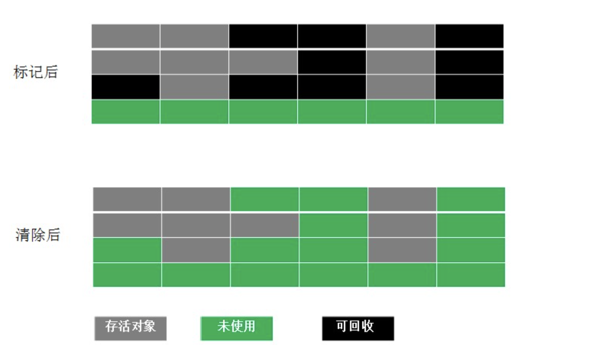

* Copying 复制删除算法

  为了解决 mark-sweep 的内存碎片问题，Copying算法就被提了出来。它将可用内存按容量划分为大小相等的两块，每次只使用其中的一块。当这一块的内存用完了，就将还存活着的对象复制到另外一块上面，然后再把已使用的内存空间一次清理掉，这样一来就不容易出现内存碎片的问题。主要有三个阶段

  * 标记阶段：通过可达性分析将可清理的对象标记出来
  * 内存复制：将为被标记的对象复制到另一个空间中（顺序存储）
  * 内存清除：清理当前内存空间

  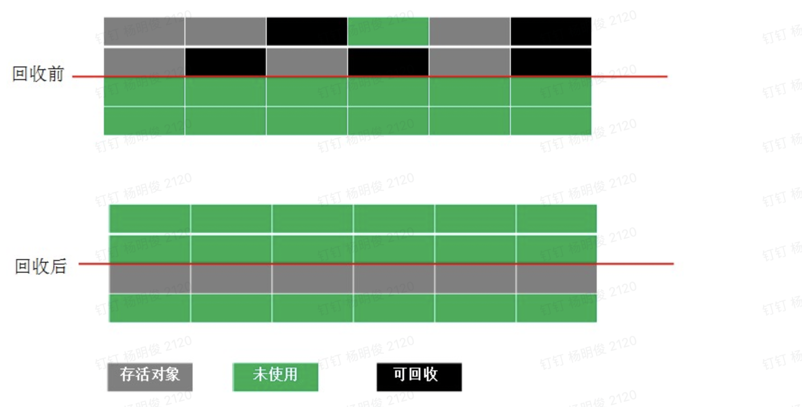

  优点：相比 mark-sweep 该算法解决了内存碎片问题

  缺点：空间利用率低，只能使用完整内存的一半

* Mark-Compact 标记整理算法

  为了解决 Copying 的内存利用率问题

  * 标记阶段：通过可达性分析将可清理的对象标记出来
  * 整理阶段：将未被标记的对象向一端移动避免内存碎片问题
  * 清除阶段：清理被标记的对象

  优点：内存利用率高，不存在内存碎片

  缺点：从效率上对比要低于，mark-sweep 和 copying  ， 因为在它收集期间需要STW（暂停用户程序）

  相比mark-sweep还会再多一个 移动对象的时候需要调整引用该对象的对象的引用地址操作  

  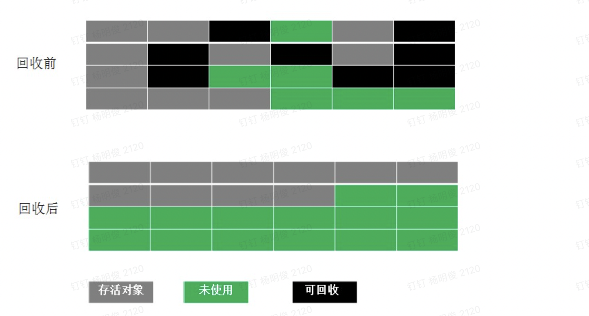

* Generational Collection 分代收集

  根据对象的存活周期将内存划分为若干不同区域。一般情况下分为年轻代和老年代，老年代的特点是每次垃圾收集时只有少量对象需要被回收，而新生代的特点是每次垃圾回收时都有大量的对象需要被回收，那么就可以根据不同代的特点采取最适合的收集算法。

  目前大部分年轻代都采用 复制删除算法 ： 因为JVM的维护者们发现不需要将内存按照1:1的来划分导致可用内存降低的问题，因为年轻代中每次回收能存活下来的对象最多也就10%，也就是9:1（可用内存和每次回收会剩余内存的比例） ，最后使用了8:1:1 （eden:Survivor1:Survivor2）的比例设计了年轻代的复制删除算法 ，内存分配的时候使用 eden和其中的一个Survivor空间(叫作Survivor)，在垃圾收集的时候，将为被标记的对象移动到空闲的Survivor中（当前Survivor叫做SurvivorC），然后清理掉之前被使用的空间，后续在eden和SurvivorC中分配内存，这样循环往复

  

# Garbage Collector

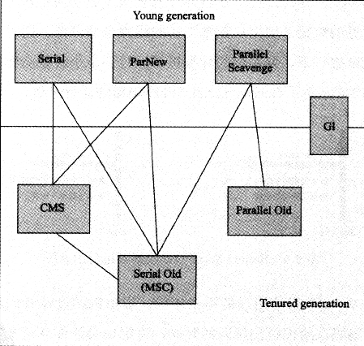

## Serial (Young Area Collector)

单线程收集器，收集时候必须暂停其他所有线程，直到它运行结束（Stop The World）

**垃圾收集算法: Copying**

## Serial Old 

Serial 的老年代版本，

*  主要是给Client 模式使用
* 如果在Server模式下 在JDK1.5  版本之前用来配合 Parallel scavenge 收集器使用
* 作为 CMS 收集器的后备预案（CMS 采用的 Mark-Sweep,会产生内存碎片，导致某些情况下会无法为大对象分配内存（因为没有这样一个大的连续的内存了），这时候就会触发 Serial Old 收集器）

**垃圾收集算法：Mark-Compact（会 Stop The World ）**

## ParNew (Young Area Collector)

就是Serial 的多线程版本，除了用多线程进行收集之外，别的和serial都一样的。

这个收集器是 使用CMS收集器 `-XX:+UseConcMarkSweepGC` 时候的新生代默认收集器

**垃圾收集算法: Copying**

## parallel Scavenge  (Young Area Collector)

和ParNew一样作为一个并行收集器，他的特点是，它的关注点是尽可能缩短垃圾收集时用户线程的停顿时间，它提供了一个可控的吞吐量：运行用户代码时间/运行用户代码时间+垃圾收集时间，如果虚拟机运行了100分钟，垃圾收集1分钟，那么 吞吐量就是 99%。

* 停顿时间越短，越适合需要与用户交互的程序，良好的响应速度能提升用户体验

* 高吞吐量可以更高效的利用CPU时间，尽快完成程序运算任务，适合在后台运算而不需要太多交互的程序。

那么它作为一个高吞吐的收集器,很明显适合作为一个后台运算系统使用

**垃圾收集算法: Copying**

**参数配置**：

| 参数                       | 作用                                                         |
| -------------------------- | ------------------------------------------------------------ |
| -XX:MaxGCPauseMillis       | **参数允许一个大于0的毫秒数，收集器将会尽可能保证收集时间不超过这个值**，但并不是说把这个值设置得越小越好，因为GC停顿时间缩短是以牺牲吞吐量和新生代空间换来的，系统将新生代调小，比如200M 肯定比300M收集快吧，这样时间上是快了，但是次数多了，吞吐量就下降了。 |
| -XX:GCTimeRatio            | 允许一(0,100)的值，设置用户程序运行时间占总时间的比例，默认99也就是说99/（99+1) = 99% ，那么允许的最大垃圾收集时间就是1%的系统运行时间；如果设置19那就是 19/（19+1）= 95% ， 那么最大允许的垃圾收集时间就是5%的系统运行时间 |
| -XX:+UseAdaptiveSizePolicy | 这个开关参数打开之后，就不需要设置。新生代大小（-Xmn），Eden与Survivor比例，晋升老年代对象年龄（-XX:PretenureSizeThreshold）等细节参数了。虚拟机会根据系统运行情况收集性能监控信息，动态调整这些参数以提供最适合的停顿时间和最大吞吐量。这时候只需要设置堆的大小，-XX:MaxGCPauseMillis，-XX:GCTimeRatio 参数给虚拟机设立一个目标就好了 |

## parallel Old

parallel Scavenge 的老年代版本 ， 作为一个使用多线程。JDK1.6开始提供， 有了他 parallel Scavenge + parallel Old 的组合就是一个名副其实的**吞吐量优先**的组合收集器了，在注重吞吐量以及CPU资源敏感的场合，适合在后台运算，又不需要太多交互的任务。可以优先考虑这样一个组合。

## **Eden区是如何加速内存分配的？**

HotSpot虚拟机使用了两种技术来加快内存分配。分别是bump-the-pointer和TLAB（Thread Local Allocation Buffers）。

**由于Eden区是连续的，因此bump-the-pointer在对象创建时，只需要检查最后一个对象后面是否有足够的内存即可，从而加快内存分配速度。** **很明显这个能力是目前新生代对象分配的通用优化策略**

**TLAB技术是对于多线程而言的，在Eden中为每个线程分配一块区域，减少内存分配时的锁冲突，加快内存分配速度，提升吞吐量。 G1的对象分配策略中有解释这个功能，很明显这个能力是目前新生代对象分配的通用优化策略**

## CMS (Concurrent Mark Sweep)

### 简介

老年代收集器，采用Mark-Sweep 算法， 它是一种以获取最短停顿时间为目标的收集器，适用于重视服务响应速度，希望系统停顿时间短，能给用户带来较好体验的系统，比如互联网网站，B/S系统等。

相较于前面的几个收集器来说，它的运作过程相对复杂一些：

1. 初始标记  （会 Stop The World ）

   标记 GC root  能直接关联到的对象

2. 并发标记  

3. 重新标记

4. 并发清除

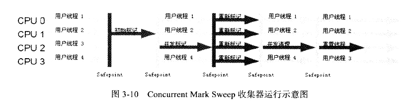

**优点：并发收集，低停顿。**

**缺点：**

* 在并发阶段，它会占用部分线程（也就是CPU资源），而导致应用程序变慢，总吞吐量就会降低。它默认启用的回收线程数是（CPU数量+3）/4，也就是说CPU数量>=4的时候并发收集，会至少使用25%的CPU资源，如果CPU数量下降的的话，CMS暂用的CPU资源会上身，反而会大大降低系统性能，所以CPU数量小于4的时候是不太好的。

* 浮动垃圾，浮动垃圾是由于在并发收集的时候，用户程序还在运行所以会产生的新垃圾，那么就意味着我们在并发收集期间需要给用户预留内存，1.6开始 CMS启动收集的阈值时92%（也就是会预留8%的空间给用户线程），这个值是可配置的 （-XX:CMSInitiatingOccupancyFraction）。如果收集时预留的内存无发满足用户线程的使用，就会出现一次Concurrent Mode Failure, 这时会启用 临时预案 Serial Old  收集器，这时候收集停顿时间就长了，所以 -XX:CMSInitiatingOccupancyFraction 要根据实际情况做配置，不能配置太大，因为预留空间太小，反而会导致性能下降

* 内存碎片，为了并发快速收集所以使用了 Mark Sweep 算法，必然就会导致内存碎片。内存碎片过多之后，会给大内存分配带来影响，这时候就不得不触发full gc了。为了解决Full GC 问题， CMS提供了内存整理机制，但是执行这个动作就不能并发收集了，开启这个功能的配置-XX:+UseCMSCompactAtFullCollection 默认是开启的。

  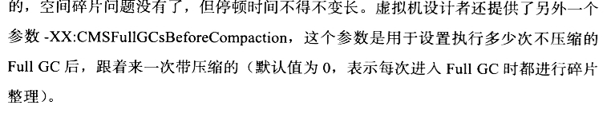

### FGC又是什么时候触发的

下面4种情况，对象会进入到老年代中：

- YGC时，To Survivor区不足以存放存活的对象，对象会直接进入到老年代。
- 经过多次YGC后，如果存活对象的年龄达到了设定阈值，则会晋升到老年代中。
- 动态年龄判定规则，To Survivor区中相同年龄的对象，如果其大小之和占到了 To Survivor区一半以上的空间，那么大于此年龄的对象会直接进入老年代，而不需要达到默认的分代年龄。
- 大对象：**由-XX:PretenureSizeThreshold启动参数控制，若对象大小大于此值，就会绕过新生代, 直接在老年代中分配。（这个值默认是0.也就是都现在Eden去尝试分配）**

当晋升到老年代的对象大于了老年代的剩余空间时，就会触发FGC（Major GC），FGC处理的区域同时包括新生代和老年代。除此之外，还有以下4种情况也会触发FGC：

- 老年代的内存使用率达到了一定阈值（可通过参数调整），直接触发FGC。
- 空间分配担保：在YGC之前，会先检查老年代最大可用的连续空间是否大于新生代所有对象的总空间。如果小于，说明YGC是不安全的，则会查看参数 HandlePromotionFailure 是否被设置成了允许担保失败，如果不允许则直接触发Full GC；如果允许，那么会进一步检查老年代最大可用的连续空间是否大于历次晋升到老年代对象的平均大小，如果小于也会触发 Full GC。
- Metaspace（元空间）在空间不足时会进行扩容，当扩容到了-XX:MetaspaceSize 参数的指定值时，也会触发FGC。
- System.gc() 或者Runtime.gc() 被显式调用时，触发FGC。


## G1 (Garbage First)

> 本来参考的文章
>
> https://blog.csdn.net/hellozhxy/article/details/80144419
>
> https://blog.csdn.net/yunxing323/article/details/108763499
>
> https://www.zhihu.com/topic/20840572/hot
>
> https://zhuanlan.zhihu.com/p/22591838
>
> http://jiankunking.com/java-jvm-gc-g1-notes.html

### 简介

G1 (Garbage-First)是一款面向服务器的垃圾收集器,主要针对配备多颗处理器及大容量内存的机器. 以极高概率满足GC停顿时间要求的同时,还具备高吞吐量性能特征. 在Oracle JDK 7 update 4 及以上版本中得到完全支持, 专为以下应用程序设计:

- 可以像CMS收集器一样,GC操作与应用的线程一起并发执行
- 紧凑的空闲内存区间且没有很长的GC停顿时间.
- 需要可一预测的GC暂停耗时.
- 不想牺牲太多吞吐量性能.
- 启动后不需要请求更大的Java堆.
- 相比CMS ,G1消除了潜在的内存碎片问题

G1的长期目标是取代CMS(Concurrent Mark-Sweep Collector, 并发标记-清除). 因为特性的不同使G1成为比CMS更好的解决方案. 一个区别是,G1是一款压缩型的收集器.G1通过有效的压缩完全避免了对细微空闲内存空间的分配，而且还消除了潜在的内存碎片问题。除压缩以外，G1的垃圾收集停顿也比CMS容易估计，也允许用户自定义所希望的停顿参数(pause targets)

上一代的垃圾收集器(串行serial, 并行parallel, 以及CMS)都把堆内存划分为固定大小的三个部分: 年轻代(young generation), 年老代(old generation), 以及持久代(permanent generation).

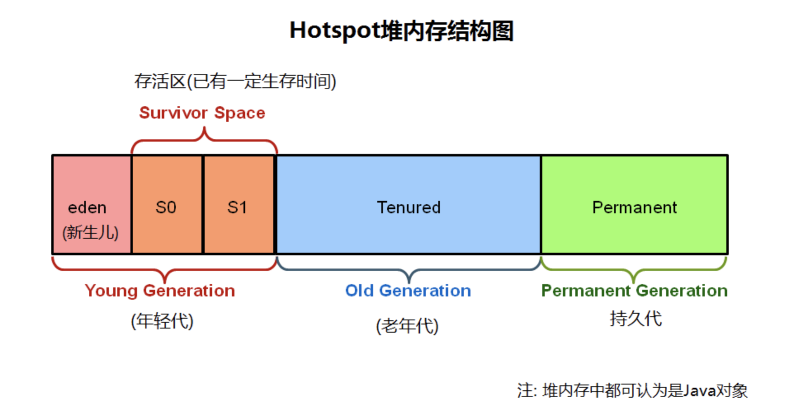


G1采用了完全不同的设计策略将堆划分为若干个区域（Region），虽然它任然属于分代收集器。Region的大小是相同的

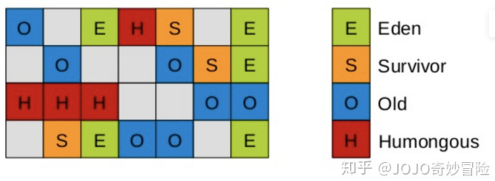

这些区域的一部分包含新生代（的垃圾收集依然采用暂停所有应用线程的方式，将存活对象拷贝到老年代或者Survivor空间）。老年代也分成很多区域，G1收集器通过将对象从一个区域复制到另外一个区域，完成了清理工作。这就意味着，在正常的处理过程中，G1完成了堆的压缩（至少是部分堆的压缩），这样也就不会有cms内存碎片问题的存在了。**年轻代和老年代的内存比大致是6:4**

在G1中，还有一种特殊的区域，**叫Humongous区域。 如果一个对象占用的空间超过了Region容量50%以上，G1收集器就认为这是一个巨型对象。这些巨型对象，默认直接会被分配在年老代，但是如果它是一个短期存在的巨型对象，就会对垃圾收集器造成负面影响。为了解决这个问题，G1划分了一个Humongous区，它用来专门存放巨型对象。如果一个H区装不下一个巨型对象，那么G1会寻找连续的H分区来存储。为了能找到连续的H区，有时候不得不启动Full GC。**

G1执行垃圾回收的处理方式与CMS相似. G1在全局标记阶段(global marking phase)并发执行, 以确定堆内存中哪些对象是存活的。**标记阶段完成后,G1就可以知道哪些heap区回收后empty空间最大（垃圾最多的分区）。它会首先回收这些区,通常会得到大量的自由空间. 这也是为什么这种垃圾收集方法叫做Garbage-First(垃圾优先)的原因**。顾名思义, G1将精力集中放在可能布满可收回对象的区域, 可回收对象(reclaimable objects)也就是所谓的垃圾. G1使用暂停预测模型(pause prediction model)来达到用户定义的目标暂停时间,并根据目标暂停时间来选择此次进行垃圾回收的heap区域数量.

需要强调的是, G1并不是一款实时垃圾收集器(real-time collector). 能以极高的概率在设定的目标暂停时间内完成,但不保证绝对在这个时间内完成。 基于以前收集的各种监控数据, G1会根据用户指定的目标时间来预估能回收多少个heap区. 因此,收集器有一个相当精确的heap区耗时计算模型,并根据该模型来确定在给定时间内去回收哪些heap区.

注意 G1分为两个阶段: 并发阶段(concurrent, 与应用线程一起运行, 如: 细化 refinement、标记 marking、清理 cleanup) 和 并行阶段(parallel, 多线程执行, 如: 停止所有JVM线程, stop the world). 而 FullGC(完整垃圾收集)仍然是单线程的, 但如果进行适当的调优,则应用程序应该能够避免 full GC。

### 垃圾回收中涉及到的一些概念

#### CSet

**Cset** ：他是一组可被回收的分区的集合，Cset中存活（标记不可回收的对象），在GC过程中会被移动到另一个可用分区，下文中的GC会有图示说明

#### 卡表（Card Table）

卡表（Card Table）。一个Card Table将一个分区在逻辑上划分为固定大小的连续区域，每个区域称之为卡。卡通常较小，介于128到512字节之间。Card Table通常为字节数组，由Card的索引（即数组下标）来标识每个分区的空间地址。**也就是说 Card Table是我们 Region的一个索引**

默认情况下，每个卡都未被引用。当一个地址空间被引用时，这个地址空间对应的数组索引的值被标记为脏被引用，这个操作通常是我们在做引用赋值操作的时候做的，

这个动作对应解释执行时很容易办到的，Java 虚拟机需要截获每个引用型实例变量的写操作，并作出对应的写标识位操作。**但是对于即时编译的代码来说就不好进行处理了，这时就引入了写屏障（write barrier）来进行处理，所谓的写屏障，就是在时编译器生成的机器码中，进行引用型实例变量赋值时插入额外的逻辑，写屏障需要尽可能地保持简洁，所以最终会把编译成一条指令：**

```
if (CARD_TABLE [this address >> 9] != DIRTY) 
 CARD_TABLE [this address >> 9] = DIRTY;
```

这里右移 9 位相当于除以 512，Java 虚拟机便是通过这种方式来从地址映射到卡表中的索引的。
虽然这种机制会带来一些性能的开销，但是对于提高Minor gc的吞吐率来说，这点开销是值得的

此外在G1中当前对象所在分区的RSet也将这个数组下标记录下来。一般情况下，这个RSet其实是一个Hash Table，Key是别的Region的起始地址（指向一个分区），Value是一个集合，里面的元素是Card Table的Index（指向分区中的被外部引用的对象的地址）。那么对应的操作就是：判断引用赋值操作的对象所在分区B，如果不是当前分区，在当前对象的Rset中存放一个key=B的起始地址，value = [B分区的引用在它的card table中index，其他分区..的cart table的index .....]

总结：card table 中存的是一个区域的对象是否有对外引用（脏页），Rset 存储的是 

card table 是在G1 之前分代收集的时候就存在的一个概念，比如CMS 在收集的时候由于只存在两个区域，年轻代和老年代，所以他是使用老年代的 card table 判断是否存在对新生代的脏页，来[避免全堆扫描](#为什么需要避免全堆扫描？)从而进行年轻代的收集的(**将这部分对象加入到年轻代收集的gc root中**)

#### RSet

**Rset**: 每一个 region 都有一个自己的Rset, 它用来记录分区中的被外部分区引用的对象的关系，在垃圾过程中会使与判断对象是否可回收（不需要扫描整个堆来找到谁引用了当前分区中的对象），它是用于G1在做垃圾回收的时候[避免全堆扫描](#为什么需要避免全堆扫描？)使用的（将 Rset 中被标记有外部引用的加入到本次年轻代收集的Gc Root中）

#### 为什么需要避免全堆扫描？

因为我们在扫描 gc root(虚拟机栈，静态字段，常量) 之后可以将这部分不可回收的对象找出来，但是，由于我们的G1存在只收集年轻代的场景，这时候如果这个年轻代中的对象A被一个老年代的对象B引用了，但是这时候老年代不做回收。那边很明显A这个对象是不能回收的，如果被回收就被影响到老年代中的对象B的使用

#### **三色标记法**

s不管是我们 G1 ，还是CNS 在并发标记阶段，都是使用的一个叫做三色标记算法来完成的。

**黑色**:根对象，或者该对象与它的子对象都被扫描

**灰色**:对象本身被扫描,但还没扫描完该对象中的子对象

**白色**:未被扫描对象，扫描完成所有对象之后，最终为白色的为不可达对象，即垃圾对象

当GC开始扫描对象时，按照如下图步骤进行对象的扫描：

**根对象被置为黑色，子对象被置为灰色。**

**继续由灰色遍历,将已扫描了子对象的对象置为黑色。**

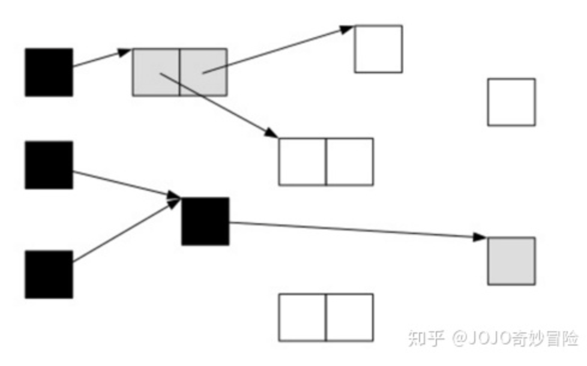

遍历了所有可达的对象后，所有可达的对象都变成了黑色。不可达的对象即为白色，需要被清理。

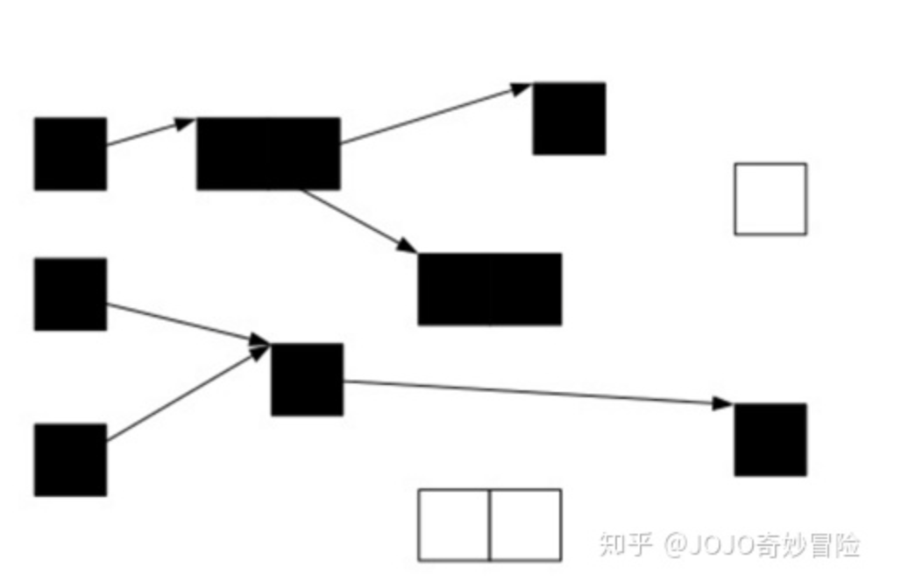

这看起来很美好，但是并发标记阶段应用程序也在运行，那么对象的指针就有可能改变。这样的话，我们就会遇到一个问题：对象丢失问题

我们看下面一种情况，当垃圾收集器扫描到下面情况时：

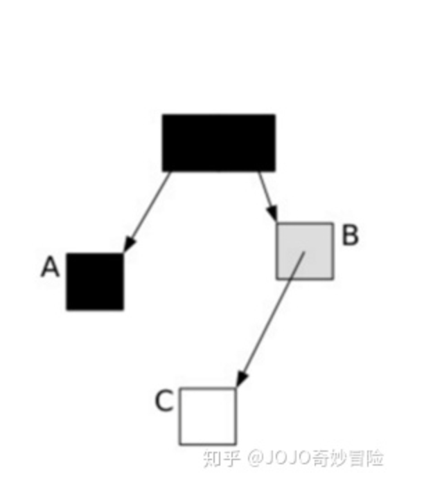

这时候应用程序执行了以下代码操作：

A.c=C 

B.c=null

这样，对象的状态图变成如下情形：

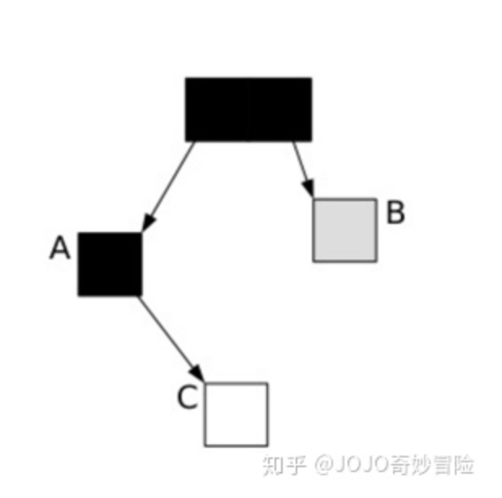


这时候垃圾收集器再标记扫描的时候就会下图成这样：

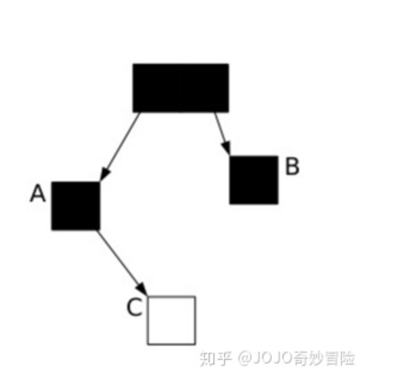

很显然，此时C是白色，被认为是垃圾需要清理掉，显然这是不合理的。那么我们如何保证应用程序在运行的时候，GC标记的对象不丢失呢？

CMS采用的是增量更新（Incremental update），只要在写屏障（write barrier）里/正常解释执行的代码的引用赋值部分，如果发现有一个白对象的引用被赋值到一个黑对象的字段里，那就把这个白对象变成灰色的。即插入的时候记录下来。

在G1中，使用的是STAB（snapshot-at-the-beginning）的方式处理的，相比CMS它可以降低最终标记阶段的处理时间，帮组快速完成标记之后，判断哪些区域在可STW的时间内是最应该被收集的（能够回收较多空间的）

#### SATB（snapshot-at-the-beginning）

字面理解他是一个在开始GC前记录存活对象的快照记录，在实际的并发标记过程中会有下面的情况会存在漏标

1. 如果一个白对象是刚被new出来的
2. 如果灰对象到白对象的引用被替换/删除了那么这个白对象也会漏标

SATB 算法：中存在了Region 包含了 5 个指针，分别是 **bottom、previous TAMS、next TAMS、top 和 end**，其中 previous TAMS、next TAMS 是前后两次发生并发标记时的位置，全称 **top-at-mark-start**。

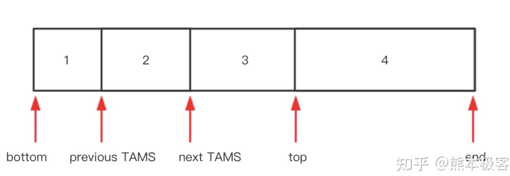

[next TAMS,top] 之间就是存放的就是新生的对象，这样解决了问题1

其次：在并发标记的时候引用被改变的对象，会在在write barrier里把所有旧的引用所指向的对象都变成非白的，这样就解决了问题2

当然这样做是有代价的，如果被替换的白对象就是要被收集的垃圾，这次的标记会让它躲过GC，这就是float garbage。因为SATB的做法精度比较低，所以造成的float garbage也会比较多。

### G1对象分配策略

对象分配直接关系到我们内存使用效率，垃圾回收效率，程序运行效率，G1提供了三种分配策略

* TLAB(Thread Local Allocation Buffer)线程本地分配缓冲区

  它的目的为了使对象尽可能快的分配出来。如果对象在一个共享的空间中分配，那么我们就需要采用一些同步机制来管理这些空间内的空闲空间。

  **所以在分配线程对象的时候在Eden空间中分配了该线程私有的一个固定大小的内存区域（TLAB）** **该分配TLAB空间的操作是需要做同步处理的（使用了CAS来并行分配）**

  **分配对象时，线程之间不再需要进行任何的同步。这也可以看出来这是针对的线程间不共享的数据的内存分配**

* 堆区 （Eden ，Old）: 对TLAB空间中无法分配的对象，JVM 会尝试在Eden空间中进行分配。如果Eden空间无法容纳该对象，就只能在老年代中进行分配空间。 

* Humongous :  如果一个对象占用的空间超过了Region容量50%以上，G1收集器就认为这是一个巨型对象。这些巨型对象，默认直接会被分配在年老代，但是如果它是一个短期存在的巨型对象，就会对垃圾收集器造成负面影响。为了解决这个问题，G1划分了一个Humongous区，它用来专门存放巨型对象。如果一个H区装不下一个巨型对象，那么G1会寻找连续的H分区来存储。为了能找到连续的H区，有时候不得不启动Full GC。

> ​	更多TLAB的内容：https://wenku.baidu.com/view/f899cc10084c2e3f5727a5e9856a561252d321fd.html

### G1 的GC过程

G1提供了两种GC模式，Young GC和Mixed GC，两种都是Stop The World(STW)的。下面我们将分别介绍一下这2种模式。

- Young GC：选定所有年轻代里的Region。通过控制年轻代的region个数，即年轻代内存大小，来控制young GC的时间开销。
- Mixed GC：选定所有年轻代里的Region，外加根据 global concurrent marking 统计得出收集收益高的若干老年代Region。在用户指定的开销目标范围内尽可能选择收益高的老年代Region。

Mixed GC不是full GC，它只能回收部分老年代的Region,如果mixed GC实在无法跟上程序分配内存的速度，导致老年代填满无法继续进行Mixed GC，就会使用serial old GC（full GC）来收集整个GC heap。所以我们可以知道，G1是不提供full GC的。

#### Young GC

**G1 Young GC**主要是对Eden区和Survivor区域进行处理，触发条件是**不能在 Eden Region 分配新的对象**。在这种情况下，Eden空间的数据移动到Survivor空间中，如果Survivor空间不够，Eden空间的部分数据会直接晋升到年老代空间。最终Eden空间的数据为空，GC停止工作，应用线程继续执行。**从下图能很明显看出来是怎噩梦操作的也能看出使用的是<u>复制算法</u>** 

当然在GC的过程中它会会计算出 Eden大小和 survivor 大小,给下一次年轻代GC使用. 清单统计信息(Accounting)保存了用来辅助计算size. 诸如暂停时间目标之类的东西也会纳入考虑.

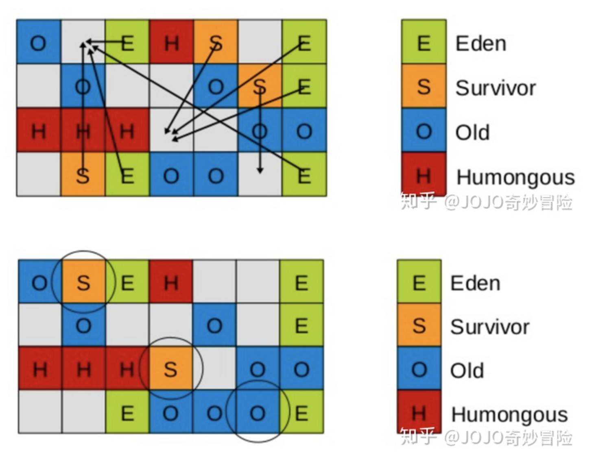

上文描述的比较简单，接下来我们思考一个问题，如果仅仅GC 新生代对象，我们如何找到所有的根对象呢？ 老年代的所有对象都是根么？那这样扫描下来会耗费大量的时间。于是，G1引进了RSet的概念。它的全称是Remembered Set，作用是跟踪指向某个heap区内的对象引用。**每个 Region 维护一个 RSet** **相关概念在上文中有可以回去再看一遍**

Young GC 阶段： 

* 阶段1：根扫描

​	静态和本地对象被扫描

* 阶段2：更新RSet

​	处理dirty card队列更新RSet

* 阶段3：处理RSet

​	检测从年轻代指向年老代的对象

* 阶段4：对象拷贝

​	拷贝存活的对象到survivor/old区域

* 阶段5：处理引用队列

​	软引用，弱引用，虚引用处理

#### **G1 Mix GC**  

这个阶段也叫做 Concurrent Marking Cycle Phases 

官方的总结说明文档中的描述：

- 可以同时回收年轻代和老年代。

  **会收集年轻代的所有region和老年代的部分region**

- 在标记阶段是并发执行(没有STW),

- 重新标记阶段比CMS效率更高。

GC步骤：

* 全局并发标记（global concurrent marking）

  在G1 GC中，它主要是为Mixed GC提供标记服务的，并不是一次GC过程的一个必须环节。global concurrent marking的执行过程分为下面的步骤：

  1. 初始标记（initial mark，STW）

     在G1中, 这次标记附加在(piggybacked on)一次正常的年轻代GC中（也就是说初始标记是young gc 帮忙做的）. 标记可能有引用指向老年代对象的survivor区(根regions).

  2. 并发标记（Concurrent Marking）

     G1 GC 在整个堆中查找可访问的（存活的）对象。该阶段与应用程序同时运行，并且收集各个 Region 的存活对象信息。可以被 STW 年轻代垃圾回收中断

  3. 最终标记（Remark，STW）

     完成堆内存中存活对象的标记. 使用一个叫做 snapshot-at-the-beginning(SATB, 起始快照)的算法, 该算法比CMS所使用的算法要快速的多.

  4. 清除垃圾（Cleanup，STW）

     如果有整个region都没有存活对象，直接回收整个 region，查处 Rset, 将该region加入到 free list（可供分配的region 集合） 中

* 拷贝存活对象（Evacuation, STW）

  把一部分 Region 里的活对象并行拷贝到空 Region，然后回收原本的 Region。Evacuation 阶段可以自由选择任意多个Region 来构成收集集合 Collection Set 即 **CSet**。

  > ps: 只在年轻代发生时日志会记录为 `[GC pause (young)]`. 如果在年轻代和老年代一起执行则会被日志记录为 `[GC Pause (mixed)]`.

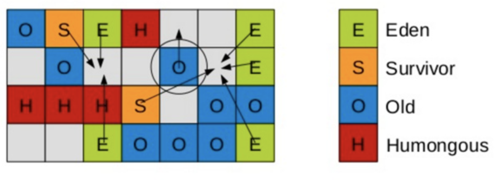

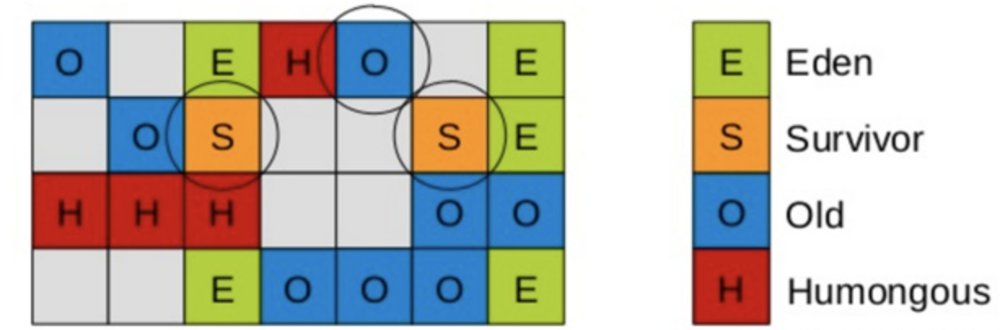


#### 哪些情况会触发 Full GC , 怎么调优

> https://blog.csdn.net/lovejj1994/article/details/109620239
>
> https://blog.csdn.net/hellozhxy/article/details/95224639

**当 mixed gc 的收集速度赶不上对象申请的速度的时候就会触发 full gc**

比如 evacuation failure 类似CMS的晋升失效，堆空间的垃圾太多导致无法完成Region 之间的拷贝，于是不得不退化成Full gc

> ps: CMS晋升失效：指的是在CMS的young gc回收时达到晋升年龄的对象需要移动到老年代，但是这时候老年代空间不足以容纳它们，就会退化成full gc
>
> 在G1中是在混合GC时候回收后，没有更多的Regiog作为老年代使用，然后堆空间也无法扩展的时候，就会发生full gc

| 参数                                  | 含义                                                         | 描述                                                         |
| ------------------------------------- | ------------------------------------------------------------ | ------------------------------------------------------------ |
| -XX:+UseG1GC                          | 启用G1                                                       |                                                              |
| -Xmx                                  | 指定堆区的最大内存                                           |                                                              |
| -Xms                                  | 指定堆区的最小内存                                           |                                                              |
| -Xmn                                  | 指定年轻代的大小                                             | 使用G1的时候最好不要只盯这个值，因为他会导致G1没法根据我们需要的暂停时间去做region优化，因为年轻代大小被限制了<br />**也不要设置老年代的大小，问题和设置新生代大小是一样的** |
| -XX:G1NewSizePercent                  | 新生代占堆的最小比例                                         | 默认值：5%                                                   |
| -XX:G1MaxNewSizePercent               | 新生代占堆的最大比例                                         | 默认值：60%                                                  |
| -XX:G1HeapRegionSize=n                | 设置G1的Region的大小，它默认=(Xms + Xmx ) /2 / 2048 , 不大于32M，不小于1M，且为2的指数 | 尽量不要去调整他，因为它会限制G1对Region的动态调整           |
| -XX:ParallelGCThreads                 |                                                              | STW期间，并行GC线程数                                        |
| -XX:ConcGCThreads                     | -XX:ParallelGCThreads/4                                      | 并发标记阶段，并行执行的线程数                               |
| -XX:PretenureSizeThreshold            | 大对象晋升老年代阈值，默认Region的一半                       | 大于此值的对象直接在老年代分配，这么做是为了预防新生代存在大量大对象，很容易被撑满 |
| -XX:MaxTenuringThreshold              | 新生代晋升老年代阈值，默认15                                 | 晋升到老年代对象的年龄，每个对象在坚持过一次MinorGC后，年龄就增加1，当超过这个参数值时，就进入老年代 |
|                                       |                                                              |                                                              |
| -XX:MaxDirectMemorySize               | 直接内存大小                                                 | 直接内存非常重要，很多IO处理都需要直接内存参与，直接内存不被jvm管理，所以就不存在GC时内存地址的移动问题，直接内存会作为堆内存和内核之间的中转站 |
| -XX:MaxGCPauseMillis=200              | 设置最大GC停顿时间(GC pause time)指标(target). 这是一个软性指标(soft goal), JVM 会尽力去达成这个目标. 所以有时候这个目标并不能达成. 默认值为 200 毫秒. | 这个参数不是越小越好，太小了会导致每次手机的垃圾变少，触发full gc的可能增加,这参数也是需要根据实际情况去逐渐调整的 |
| -XX:InitiatingHeapOccupancyPercent=45 | 意思是当整个堆占用超过某个百分比时，就会触发并发GC周期（Concurrent Marking Cycle Phases），这个百分比默认是45% | 如果你的项目没有大的cpu负载压力，可以适当降低这个值，带来的好处就是提前开始Concurrent Marking Cycle Phases ，进一步来说，回收年轻代 and 老年代 也会提前开始，这样有利于防止年轻代晋升老年代失败(老年代容量不足)而触发Full GC<br/>但是如果如果你的系统本身没有上诉的情况然而你调低了这个值那么gc次数增加反而会降低你的系统吞吐量，所以最好是一开始不要设置这个值，根据实际的观察情况去调整 |
| -XX:G1HeapWastePercent                | 触发Mixed GC的可回收空间百分比，默认=5%                      | 在global concurrent marking结束之后，我们可以知道old gen regions中有多少空间要被回收，在每次YGC之后和再次发生Mixed GC之前，会检查垃圾占比是否达到此参数，只有达到了，下次才会发生Mixed GC<br />触发global concurrent marking后YGC已经执行完成，剩下的就是看老年代占用的内存大小是否操作这个值了，超过就进行后的的 |
| -XX:G1MixedGCCountTarget              | 一次global concurrent marking之后，最多执行Mixed GC的次数<br />默认值8 | 一次 mixed gc 一定会带有YGC,但是在标记之后不一定执行老年代的处理会被限制 |
| -XX:G1MixedGCLiveThresholdPercent     | 将要被MixGC的Region中存活的对象占比，默认：85%               | old generation region中的存活对象的占比，只有小于此参数，才会被选入CSet |
| -XX:G1OldCSetRegionThresholdPercent   | Mixed GC每次回收Region的数量                                 | 一次Mixed GC中能被选入CSet的最多old generation region数量比列 |

https://blog.csdn.net/qq_27529917/article/details/86664677

#### G1的回收器日志分析

##### gc 日志配置

| 命令                           | 含义                                     |                                                              |
| ------------------------------ | ---------------------------------------- | ------------------------------------------------------------ |
| -verbose:gc                    | 等价于 -XX:+PrintGC， 设置日志级别 fine. | -XX:+PrintGC 是非文档版本<br />-verbose:gc 稳定版本          |
| -XX:+PrintGCDetails            | 设置日志级别为finer                      | 使用此选项会显示一下信息：<br />1. 每个阶段的 Average, Min, 以及 Max 时间.<br />2. 根扫描(Root Scan), RSet 更新(同时处理缓冲区信息), RSet扫描(Scan), 对象拷贝(Object Copy), 终止(Termination, 包括尝试次数).<br />3. 还显示 “other” 执行时间, 比如选择 CSet, 引用处理(reference processing), 引用排队(reference enqueuing) 以及释放(freeing) CSet等.<br />4. 显示 Eden, Survivors 以及总的 Heap 占用信息(occupancies). |
| -XX:+PrintGCDateStamps         | 在每条记录前加上日期时间.                | 2012-05-02T11:16:32.057+0200: [GC pause (young) 46M->35M(1332M), 0.0317225 secs] |
| -XX:+PrintReferenceGC          | GC处理Reference的耗时-                   | 2022-04-13T19:14:37.954-0800: [GC pause (G1 Humongous Allocation) (young) (initial-mark)2022-04-13T19:14:37.957-0800: [SoftReference, 0 refs, 0.0000331 secs]2022-04-13T19:14:37.957-0800: [WeakReference, 5 refs, 0.0000117 secs]2022-04-13T19:14:37.957-0800: [FinalReference, 51 refs, 0.0000507 secs]2022-04-13T19:14:37.957-0800: [PhantomReference, 0 refs, 0 refs, 0.0000165 secs]2022-04-13T19:14:37.957-0800: [JNI Weak Reference, 0.0000129 secs], 0.0035537 secs]<br/>   [Parallel Time: 1.9 ms, GC Workers: 8]<br />.......................... |
| -Xloggc                        | 指定gc日志输出到什么目录的文件中         | 例如：-Xloggc:/data/logs/gc.log                              |
| -XX:+OmitStackTraceInFastThrow | jvm 默认开启的                           | 当打印同样错误日志到一定次数就会被jvm默认优化掉。<br/>我们在实际使用中肯定是不希望无法看到异常栈信息的，因为我们需要它定位问题，所以可以配置成-XX:-OmitStackTraceInFastThrow 来关闭它 |
| -XX:G1LogLevel=finest          | 指定日志级别                             |                                                              |


##### 设置日志细节(Log Detail)

(1) -verbosegc (等价于 -XX:+PrintGC) 设置日志级别为 好 fine.

日志输出示例

```clojure
[GC pause (G1 Humongous Allocation) (young) (initial-mark) 24M- >21M(64M), 0.2349730 secs]

[GC pause (G1 Evacuation Pause) (mixed) 66M->21M(236M), 0.1625268 secs]    
```

(2) -XX:+PrintGCDetails 日志输出示例

```clojure
[Ext Root Scanning (ms): Avg: 1.7 Min: 0.0 Max: 3.7 Diff: 3.7]


[Eden: 818M(818M)->0B(714M) Survivors: 0B->104M Heap: 836M(4096M)->409M(4096M)]
```

(3) -XX:+UnlockExperimentalVMOptions -XX:G1LogLevel=finest 设置日志级别为最好 finest. 和 finer 级别类似, 包含每个 worker 线程信息.

```csharp
[Ext Root Scanning (ms): 2.1 2.4 2.0 0.0


           Avg: 1.6 Min: 0.0 Max: 2.4 Diff: 2.3]


       [Update RS (ms):  0.4  0.2  0.4  0.0


           Avg: 0.2 Min: 0.0 Max: 0.4 Diff: 0.4]


           [Processed Buffers : 5 1 10 0


           Sum: 16, Avg: 4, Min: 0, Max: 10, Diff: 10]
```

##### Determining Time

有两个参数决定了GC日志中打印的时间显示形式.

(1) -XX:+PrintGCTimeStamps - 显示从JVM启动时算起的运行时间.

日志输出示例

```css
1.729: [GC pause (young) 46M->35M(1332M), 0.0310029 secs]
```

(2) -XX:+PrintGCDateStamps - 在每条记录前加上日期时间.

日志输出示例

```css
2012-05-02T11:16:32.057+0200: [GC pause (young) 46M->35M(1332M), 0.0317225 secs]
```

##### 日志查看

https://blog.csdn.net/weixin_33905756/article/details/92698567?ops_request_misc=%257B%2522request%255Fid%2522%253A%2522164958090416781683955895%2522%252C%2522scm%2522%253A%252220140713.130102334.pc%255Fall.%2522%257D&request_id=164958090416781683955895&biz_id=0&utm_medium=distribute.pc_search_result.none-task-blog-2~all~first_rank_ecpm_v1~rank_v31_ecpm-1-92698567.142

在日志中看到 G1 Humongous Allocation 表示是有大对象（超过region 50% 的对象）的频繁分配


# 对象晋升

https://blog.csdn.net/qq_27184497/article/details/117828331

## 担保机制

CMS 的 eden 放不下了就会直接在老年代存放

[G1对象分配策略](#G1对象分配策略)

## 大对象直接进入老年代

比如G1 -XX:PretenureSizeThreshold 的这个值默认是 region/2 的对象会直接在老年代/H区分配[G1对象分配策略](#G1对象分配策略)

CMS XX:PretenureSizeThreshold 这个参数默认是0.也就是不启用这个功能

## 对象年龄判断

年轻代中的对象没存活一次年龄+1， 默认如果超过15，那么就会讲对象晋升到老年代

## 动态年龄判断

动态对象年龄判定。当 Survivor 空间中相同年龄所有对象的大小总和大于 Survivor 空间的一半，年龄大于或等于该年龄的对象就可以直接进入老年代，而不需要达到默认的分代年龄。

# 怎么实现STW

STW(stop world ) 要求所有线程都暂停，那么怎么实现该功能呢？ jvm中引入了安全点的概念safe point 

jvm 会在下面这些地方插入 safe point ，在需要stw的时候当代码执行到这些位置就会检查safe point

* 循环的末尾 (防止大循环的时候一直不进入safepoint，而其他线程在等待它进入safepoint)

* 方法返回前

* 调用方法的call之后

* 抛出异常的位置

怎么实现线程的停止的呢？答案是：基于锁实现的，jvm的垃圾收集是使用的VMThread来做的，当有GC请求时，所有进入到safepoint的Java线程会在一个Thread_Lock锁阻塞(这个锁现在由VM持有)，直到当JVM操作完成后，VM释放Thread_Lock，阻塞的Java线程才能继续运行。

> VMThread会一直等待直到VMOperationQueue中有操作请求出现，比如GC请求。而VMThread要开始工作必须要等到所有的Java线程进入到safepoint。**JVM维护了一个数据结构，记录了所有的线程，所以它可以快速检查所有线程的状态**。

# 安全点

https://blog.csdn.net/z69183787/article/details/81103214


只需要下面这样一个简单的设置：

-XX:+UseG1GC -Xmx32g -XX:MaxGCPauseMillis=200

其中-XX:+UseG1GC为开启G1垃圾收集器，-Xmx32g 设计堆内存的最大内存为32G，-XX:MaxGCPauseMillis=200设置GC的最大暂停时间为200ms。如果我们需要调优，在内存大小一定的情况下，我们只需要修改最大暂停时间即可。

当然我们还可以设置 -Xms2G 堆的最小内存

java8 取消了永久代，随之而来的是我们的 **meta space 空间** 它解决了永久代大小仔运行中固定不可变，容易出现OOM的问题，meta space 的参数配置

| 参数                      | 作用                                                         |
| ------------------------- | ------------------------------------------------------------ |
| -XX:MetaspaceSize         | **配置初始化的Metaspace大小，控制Metaspace发生GC的阈值**。GC后，动态增加或者降低MetaspaceSize，默认情况下，这个值大小根据不同的平台在12M到20M之间浮动 |
| -XX:MaxMetaspaceSize      | **限制Metaspace增长上限，防止因为某些情况导致Metaspace无限使用本地内存，影响到其他程序**，默认为4096M |
| -XX:MinMetaspaceFreeRatio | **当进行过Metaspace GC之后，会计算当前Metaspace的空闲空间比，如果空闲比小于这个参数，那么虚拟机   *增长*   Metaspace的大小**，默认为40，即40% |
| -XX:MaxMetaspaceFreeRatio | **当进行过Metaspace GC之后，会计算当前Metaspace的空闲空间比，如果空闲比大于这个参数，那么虚拟机会   *释放*    部分Metaspace空间**，默认为70，即70% |
| -XX:MetaspaceExpanison    | **Metaspace增长时的最大幅度，默认值为5M**                    |
| -XX:MinMetaspaceExpanison | **Metaspace增长时的最小幅度**，默认为330KB                   |

