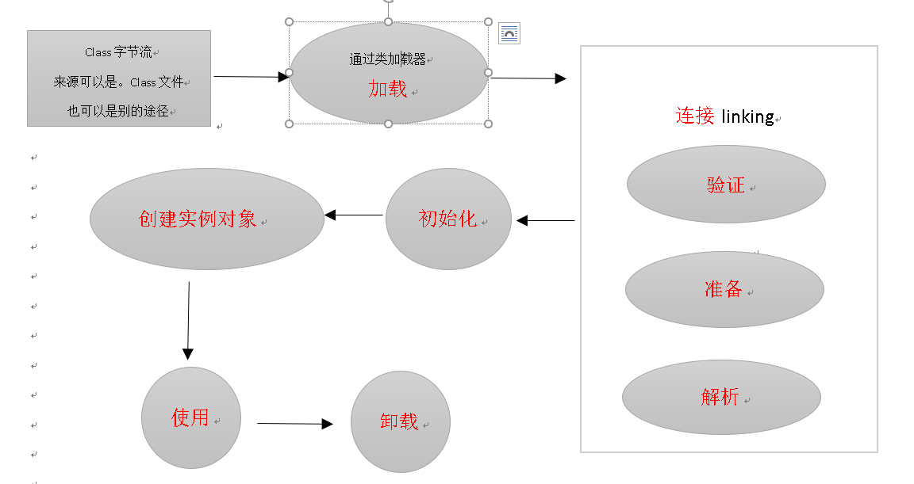
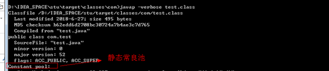
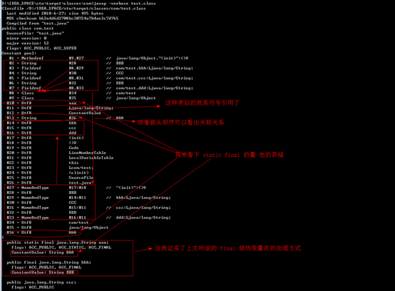
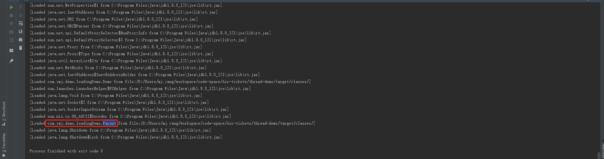
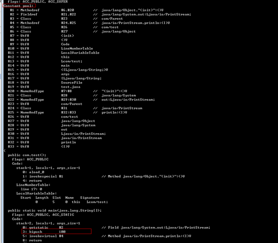
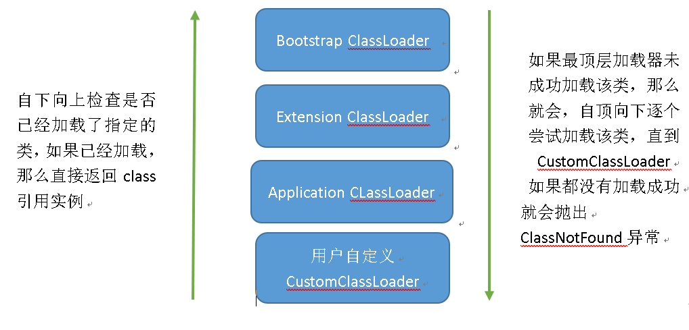
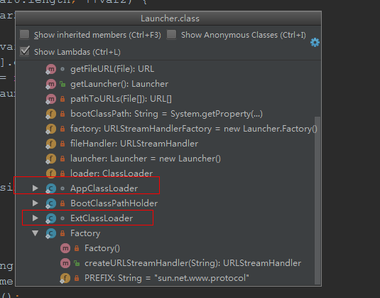
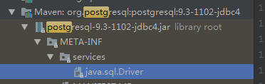
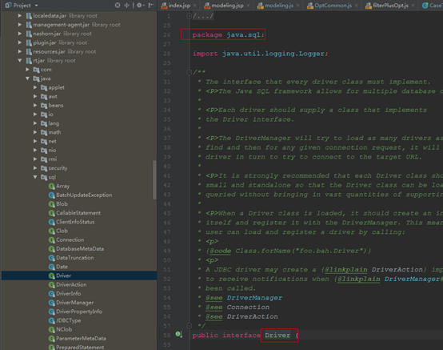
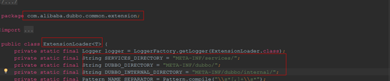

# 申明

本文很多的内容都是作者通过阅读《深入理解Java虚拟机JVM高级特性与最佳实践(周志明)》这本书学习到的。如果需要关于类加载更加详细的细节信息，请自行去阅读JVM 相关书籍

# JVM类加载以及SPI

## 类的生命周期：


**说明：只有加载阶段用户可以通过自定义类加载器参与，别的阶段都是虚拟机自己主导的**

**加载->验证->准备->初始化->卸载** 这五个阶段是确定的。顺序也是确定的，但是**解析阶段**就不是这样的了。某些情况下可以在初始化之后进行 ，这是为了支持java语言的运行时绑定

**加载阶段什么时候开始java虚拟机规范并没有做强制要求，交给了虚拟机的具体实现来自由把控（不同的虚拟机实现可能不同）**

**初始化阶段，虚拟机规范做了严格的规定，有且只有五种情况必须立即对类进行初始化，（加载，验证，准备自然要在这之前），有的虚拟机可能就会将加载放在类第一次初始化的时候，先检查类是否加载了，没有的话去尝试加载，验证，准备**


## 1.加载

* 加载阶段什么时候开始java虚拟机规范并没有做强制要求，交给了虚拟机的具体实现来自由把控（不同的虚拟机实现可能不同）
* 通过类的全限定名获取描述此类的二进制字节流（获取方式任意—这是一个开放式规范 比如：动态代理，网络传输，zip包中读取比如jar,war.....。从数据库中读取……,由其他文件生成（例如Jjsp应用，由jsp生成））
* 将字节流所代表的静态存储结构保存为方法区的运行时数据结构（1.8以后存在meta space,1.7 开始 类的静态量以及 常量 都存在 java heap 区）
* 在java heap 创建一个这个类的java.lang.Class 对象,作为访问 方法区（1.8 meta space ）的入口

**说明：后面的所有加载操作我都统称loading**

## 2.验证

- 格式验证：验证字节流是否是符合class文件格式规范，是否能被当前虚拟机处理
  - 是否以魔数0xCAFEBABE开头（这个是jvm 验证的一个标准 ）
  - 主次版本号是否在当前虚拟机的处理范围（1.7的代码，你用1.6 jvm 编译肯定编译不了，这个就是验证这类版本号的）
  - 常量池的常量中是否有不被支持的常量类型（检查常量的tag标志）
  - Class文件中各部分及文件本身是否有被删除或附加其他信息
  - ……….

- 元数据验证：对字节码描述信息进行语意解析，以保证其描述的信息符合java语言规范要求
  - 这个类是否有父类（除了Object所有类又应该有父类）
  - 这个类是否继承了不允许被继承的类（比如final 修饰的类就不能被继承）
  - 如果这个类不是abstract 类，是否实现了父类或接口中要求实现的方法
  - ……..

  **提示：所有类最终父类都是Object**

- 字节码验证：这是最复杂的一个阶段，主要进行数据流和控制流分析。该阶段将会对类的方法体进行分析，以保证被校验类的方法在运行时不会做出危害虚拟机安全的行为
  - 保证方法体中的类型转换是有效的，比如把一个父类赋值给子类，或则把一个类赋值给一个毫无关系的类，这样的操作就是不合法的
  - 保证任意时刻操作数栈的数据类型与指令代码序列都能配合工作，而不会出现像：在操作数栈放一个int数据，使用时却按照long来加载进入局部变量表中
  - ……

- 符号引用验证：这个阶段的校验发生在虚拟机将符号引用转换为直接引用的时候（也就是在[解析](#_%E8%A7%A3%E6%9E%90)阶段的时候）
  - 符号引用中通过字符串描述的全限定名是否能找到对应的类
  - 在指定类中是否存在符合方法的符号的字段描述符以及简单的名称描述的方法和字段
  - 引用中的类、字段、方法的访问性（public,private…）是否能被当前类访问

## 3.准备

* 该阶段为类变量（static 修饰的）在heap 区 分配并设置初始值。
* 对象引用默认为null , boolean 默认 false , int = 0 ,float = 0.0f….

------

```
 private static int n = 100; 
```

准备阶段完成后 n = 0 , 而不是 100 ， 在**初始化阶段** 才会把 100 赋值给n

特殊情况：

```
private static final int n = 100;
```

常量值（final 修饰的值） 编译之后会存在class 文件的**静态常良池**中。此时生成了一个constantValue。

在准备阶段会根据这个值给n赋值       



* 注意 ： 实例变量 在对象实例化的时候分配

## 4.解析

解析阶段是虚拟机将常量池内的符号引用替换为直接引用的过程。

- 符号引用：简单理解 就是一个字符串，比如引用一个类，java.lang.String,

这就是一个符号引用。

详细的解释如图：

  1.  首先存在这样一个类：

```java
public class test {

    public static final String aaa = "AAA";

    public final String bbb = "BBB";

    public String ccc = "CCC";

    public static  String ddd = "DDD";

}
```

2.  反编译以后：  



-  直接引用：指针或者内存偏移量地址。引用的对象一定在内存中已经加载

## 5.初始化阶段

​         在准备阶段变量已经被赋过一次系统要求的初始值。初始化阶段程序员会通过程序的主管计划去初始化变量以及其他资源。（**Class对象在这个阶段之前就生成了**）

- 执行类构造器`<clinit>`
  - 编译器收集类所有的变量的赋值动作和静态语句块（static{} 块）中的语句合并产生的，收集顺序是根据语句在源文件的出现顺序决定的，静态语句块只能访问定义在它之前的变量，定义在它之后的变量它能够赋值，但是不能访问
  - 它不是类的构造方法，他也不需要显示的调用父类的构造器，虚拟机会保证执行他之前，父类的<clinit>已经执行完成
  - 如果一个类没有对变量的赋值操作，没有静态语句快，那这个类就不会有<clinit>

- `<clinit>` 的执行是线程安全的，多个线程要求初始化同一个类，只有一个线程能执行别的都会阻塞等待

- 初始化场景：

  虚拟机规定了**有且只有**5种情况必须对类进行**初始化(**1.7,1.8 ,  1.9 之后的我不太懂)

  - 执行new , getstatic , putstatic 以及invokestatic指令的时候
  
    - new ，实例化类
    - getstatic  访问 static 字段
    - putstatic  修改static 字段
    - invokestatic 调用static 方法
  
  - 使用reflect对类反射调用的时候
  
    - 使用反射获取 Class 实例的时候
  
  - 初始化一个类的时候，发现父类没有初始化，这时候会先初始化父类
  
  - 启动虚拟机时需要初始化包含main 方法的类
  
  - 当时用 JDK 1.7 的动态语言支持时，如果一个 java.lang.invoke.Methodhandle实例最后的解析结果是 
  
    `REF_getStatic`，`REF_petStatic`,`REF_invokeStatic` 的方法句柄，且这些方法句柄所对应的类没有初始化过，则会触发初始化


**被动引用例子**

- 子类访问父类的static 字段，只会触发父类的初始化，而不会初始化子类

  但是HotSpot 虚拟机有执行子类的**loading**操作(有兴趣的可以配置一下jvm

  (-verbose:class)参数，看一下输出的**loading**信息

```java
class Parent {

    static int i = 10;

    static {

        System.out.println("初始化 parent ");

    }

}

class Children extends parent {

    static {

        System.out.println("初始化 children ");

    }

}

public class test {

    public static void main(String[] args) {

        System.out.println(Children.i);

    }

}
```

​	输出结果：可以很明显的看到  对 parent 的类加载动作，还有初始化动作 以及 Children的类的类加载操作

```
......
[Loaded com.ymj.demo.loadingDemo.Parent from file:/D:/Users/mj.yang/workspace/code-space/Air-tickets/thread-demo/target/classes/]
[Loaded com.ymj.demo.loadingDemo.Children from file:/D:/Users/mj.yang/workspace/code-space/Air-tickets/thread-demo/target/classes/]
初始化 Parent 
10
[Loaded java.lang.Shutdown from C:\Program Files\Java\jdk1.8.0_121\jre\lib\rt.jar]
[Loaded java.lang.Shutdown$Lock from C:\Program Files\Java\jdk1.8.0_121\jre\lib\rt.jar]
```

- 定义对象数组不会触发对象的初始化  但是会有加载动作

```java
public static void main(String[] args) {

    Parent[] parents = new Parent[10];

}
```

​	输出结果：类被加载了                                                             



​	

- 常量在编译后会存入调用类的常良池中，本质上并没有直接的引用关系

```java
 class Parent {

    static final int B = 100;

    static {

        System.out.println("初始化 Parent ");

    }

}

public class test {

    public static void main(String[] args) {

        System.out.println(Parent.B);

    }

}
```

输出结果：这也证明了Parent 类没有初始化，在HotSpot中甚至都没有loading

```
100
```

​	下面我们看一下反编译test.class出来的东西，从下图可以看到编译后的情况，直接将100这个值放在了test.class 文件的常量池中                                      
	

- 通过类名.class获取Class 对象，不会触发类的初始化，但是会有loading 

```java
 public class test {

    public static void main(String[] args) throws ClassNotFoundException {

        Class clazz =  Parent.class;

        System.out.println(clazz);

    }

}
```

​	输出结果：从输出的类加载信息 也可以看出 是先触发了loading 动作

```
[Loaded com.Parent from file:/D:/IDEA_SPACE/stu/target/classes/]

class com.Parent
```

- Class.forName获取Class 对象是否会有初始化操作。

```java
 public class test {

    public static void main(String[] args) throws ClassNotFoundException {

        Class<?> aClass = Class.forName("com.Parent");

        System.out.println(aClass);

    }

}
```

​	输出结果：很明显从输出信息就能看出 这种方式是有初始化动作的

```
[Loaded com.Parent from file:/D:/IDEA_SPACE/stu/target/classes/]

初始化 Parent

class com.Parent
```

​	看一下源码：第二个参数forname0这个方法的第二个参数为true，也就是说加载之后进行初始化操作

```java
@CallerSensitive

public static Class<?> forName(String className)

            throws ClassNotFoundException {

    Class<?> caller = Reflection.getCallerClass();

    return forName0(className, true, ClassLoader.getClassLoader(caller), caller);

}
```

​	下面这种方式不会触发初始化

```java
Class<?> aClass = Class.forName("com.Parent", false, Parent.class.getClassLoader());
```

- 通过ClassLoader的loadClass 方法，也不会触发初始化这个动作

```java
 public class test {


    public static void main(String[] args) throws ClassNotFoundException, IllegalAccessException, InstantiationException {

        Class<?> aClass = new ClassLoader(){}.loadClass("com.Parent");

        System.out.println(aClass);

    }

}
```

## 双亲委派模型

### 加载机制

上面的加载阶段的第一步，通过类的全限定名获取描述此类的二进制字节流。这个动作，就是对用户开放的一个动作,在这个阶段java 平台开发者 可以自定义自己的类加载器，方法是有很多种。

这里说一下 双亲委派模型 以及下面的SPI 规范的一种方式

- 首先 从java 虚拟机角度来说分为两种类加载器：

  - 启动类加载器（Bootstrap ClassPoader）这个类加载器由C++实现，虚拟机的一部分
  - 其他所有的由java实现的类加载器

- 从java 开发人员的角度来看 类加载器分得更细一些，大多数时候我们会使用到系统提供的三种类加载器：

  - 启动类加载器（Bootstrap ClassLoader）他负责加载<JAVA_HOME>/lib 目录中的，或则被-Xbootclasspath参数所指定的路径中被虚拟机识别的的jar（比如rt.jar,名字不符合的即使放在lib 也不会被加载的） 到虚拟机的内存中。

    说明：启动类加载器无法被java程序直接引用

  - 扩展类加载器（Extension ClassLoader）这个由`sun.misc.Launcher$ExtClassLoader `实现，它负责加载 <JAVA_HOME>/lib/ext下面的jar 。或则被java.ext.dirs 系统变量所指定的路径中的所有类库

  - 应用类加载器（Application CLassLoader）由这个`sun.misc.Launcher$AppssLoader`实现，这个**类的实例**是ClassLoader.getSystemClassLoader()的返回值，所以也叫它系统类加载器，他负责加载`classpath `下面的所有类，如果程序中没有自定义的类加载器，一般就是使用的这个类加载器了
  
- 模型图：



- 双亲委派的作用是什么呢？

**保证类任意类加载环境的唯一性**，比如java.lang.String 类 你可以再定义一个lava.lang.String 这样的类，但是加载的时候不会被加载，并且会抛出异常。

需要注意的是除了 Bootstrap ClassLoader 之外别的类加载器都应该有自己的父类加载器，这些类加载器的**父子关系不是以继承关系实现的，都是使用组合关系实现。**



从上图su.msic.Launcher类中也可已看出他们两并不是继承的关系而是组合的关系

- ExtClassLoader 和 AppClassLoader 都是定义在sun.msic.Launcher 里面的static 内部 我们来看一下这两个类的初始化过程

```java
public class Launcher {

    private static URLStreamHandlerFactory factory = new Launcher.Factory();

    private static Launcher launcher = new Launcher();

    private static String bootClassPath = System.getProperty("sun.boot.class.path");

    private ClassLoader loader;

    private static URLStreamHandler fileHandler;


    public static Launcher getLauncher() {

        return launcher;

    }

    public Launcher() {
    
       Launcher.ExtClassLoader var1;

        try {
        //初始化 ExtClassLoader

            var1 = Launcher.ExtClassLoader.getExtClassLoader();

        } catch (IOException var10) {

            throw new InternalError("Could not create extension class loader", var10);

        }

        try {
                    // 初始化 AppClassLoader

            this.loader = Launcher.AppClassLoader.getAppClassLoader(var1);

        } catch (IOException var9) {

            throw new InternalError("Could not create application class loader", var9);

        }
            //设置线程上下文类加载器为 AppClassLoader

        Thread.currentThread().setContextClassLoader(this.loader);

             …    }       

				// ClassLoader.getSystemClassLoader() 最后调用到的就是这个类的下面这个方法，返回的是 AppClassLoader 实例 ，是单例的

 public ClassLoader getClassLoader() {
            return this.loader;
       }

static class ExtClassLoader extends URLClassLoader {

    public static Launcher.ExtClassLoader getExtClassLoader() throws IOException {

        final File[] var0 = getExtDirs();


        try {

          // 初始化 ExtClassLoader 实例

            return (Launcher.ExtClassLoader)AccessController.doPrivileged(new PrivilegedExceptionAction<Launcher.ExtClassLoader>() {

                public Launcher.ExtClassLoader run() throws IOException {

                    int var1 = var0.length;

                    for(int var2 = 0; var2 < var1; ++var2) {

                        MetaIndex.registerDirectory(var0[var2]);

                    }

                    return new Launcher.ExtClassLoader(var0);

                }

            });

        } catch (PrivilegedActionException var2) {

            throw (IOException)var2.getException();

        }

    }


    public ExtClassLoader(File[] var1) throws IOException {

        super(getExtURLs(var1), (ClassLoader)null, Launcher.factory);

        SharedSecrets.getJavaNetAccess().getURLClassPath(this).initLookupCache(this);

    }


    private static File[] getExtDirs() {

        String var0 = System.getProperty("java.ext.dirs");

        File[] var1;

        //为了减少篇幅部分代码省略

        return var1;

    }

    //为了减少篇幅部分代码省略

}

 static class AppClassLoader extends URLClassLoader {
    final URLClassPath ucp = SharedSecrets.getJavaNetAccess().getURLClassPath(this);
    public static ClassLoader getAppClassLoader(final ClassLoader var0) throws IOException {
       

final String var1 = System.getProperty("java.class.path");
        final File[] var2 = var1 == null ? new File[0] : Launcher.getClassPath(var1);

           // 初始化 AppClassLoader 实例
        return (ClassLoader)AccessController.doPrivileged(new        PrivilegedAction<Launcher.AppClassLoader>() {
            public Launcher.AppClassLoader run() {
                URL[] var1x = var1 == null ? new URL[0] : Launcher.pathToURLs(var2);
                return new Launcher.AppClassLoader(var1x, var0);
            }
        });
    }      
```

### 自定义类加载器

先看一下 ClassLoader 的`loadClass`源码

```java
protected Class<?> loadClass(String name, boolean resolve)
        throws ClassNotFoundException
    {
        synchronized (getClassLoadingLock(name)) { // 类加载需要做同步处理，只加载一次
            // First, check if the class has already been loaded 检查该类是否已被加载过了，加载过了就直接返回 class
            Class<?> c = findLoadedClass(name);
            if (c == null) {
                long t0 = System.nanoTime();
                try {
                    // 先通过父加载器加载
                    if (parent != null) {
                        c = parent.loadClass(name, false);
                    } else {
                        // Bootstrap ClassLoader 中去加载
                        c = findBootstrapClassOrNull(name);
                    }
                } catch (ClassNotFoundException e) {
                    // ClassNotFoundException thrown if class not found
                    // from the non-null parent class loader
                }
				// 上面的加载没找到，这时候才轮到自身的加载过程
                if (c == null) {
                    // If still not found, then invoke findClass in order
                    // to find the class.
                    long t1 = System.nanoTime();
                    c = findClass(name);

                    // this is the defining class loader; record the stats
                    sun.misc.PerfCounter.getParentDelegationTime().addTime(t1 - t0);
                    sun.misc.PerfCounter.getFindClassTime().addElapsedTimeFrom(t1);
                    sun.misc.PerfCounter.getFindClasses().increment();
                }
            }
            if (resolve) {
                resolveClass(c);
            }
            return c;
        }
    }
```


```java
public class ClassLoaderDemo {

    public Class definedMyslefClassLoader() throws ClassNotFoundException {
        //  这个就是自定义的累加载器，实际开发中请单独定义一个类

    ClassLoader classLoader = new ClassLoader() {

        @Override

        protected Class<?> findClass(String name) throws ClassNotFoundException {

            String fileName = name.substring(name.lastIndexOf(".")+1)+".class";

            InputStream resourceAsStream = getClass().getResourceAsStream(fileName);
			if (resourceAsStream == null) {
                    return super.loadClass(name);
            }
            byte [] b = new byte[0];
            try {
                b = new byte[resourceAsStream.available()];
                resourceAsStream.read(b);
				return defineClass(name,b,0,b.length);
            } catch (IOException e) {

                e.printStackTrace();

            }
			return super.loadClass(name);  
        }

    };

    return classLoader.loadClass(ClassLoaderDemo.class.getName());

}
```

### 为什么需要双亲委派

**因为这样的机制，可以保证同一个全限定名下的类只会被同一加载器加载一次，保证了该类在JVM中的唯一性，避免出现像判断两个类是否是同一类时失败，等等意想不到的情况，同时也是为了安全考虑，这样做可以保护像是，`java.lang.Object`这样一些基础类不被恶意篡改**

列 ： `java.lang.Object` 就仅会被 Bootstap ClassLoader 加载一次，也就仅有这一个

## SPI （service provider interface）

因为在某些情况下父类加载器需要委托子类加载器去加载class文件。受到加载范围的限制，父类加载器无法加载到需要的文件，以Driver接口为例，由于Driver接口定义在jdk当中的，而其实现由各个数据库的服务商来提供，比如mysql的就写了`MySQL Connector`，那么问题就来了，DriverManager（也由jdk提供）要加载各种实现了Driver接口的实现类，然后进行管理，但是DriverManager由启动类加载器加载，只能加载JAVA_HOME的lib下文件，而其实现是由服务商提供的，由系统类加载器加载，这个时候就需要启动类加载器来委托子类来加载Driver实现，从而破坏了双亲委派，这里仅仅是举了破坏双亲委派的其中一个情况。

为了证明我所说的，我准备了pgsql 驱动包的截图 :                              



以及java.sql.Driver接口的路径截图



很明显了吧，Driver类是在rt.jar 中定义的service 接口，不同的数据库厂商，会有他们对应的实现，而这些实现的感知就是通过jdk 定义的SPI 机制，这是一种定义规范。

针对这样的问题，那么我们肯定要去解决它，所以SPI 出现了。jdk 中提供了一个 ServiceLoader<T> 的一个类加载器（这个类加载器的源码很简单这里就不细说了，有兴趣的可以自己去看看） 来实现这种服务发现 ，你只需要根据他的规定在 根目录（Classpath）创建一个META-INF/service目录。然后在下面创建一个以接口全路径命名的文件，在里面写上你的实现类的全限定名就可以了
如果是多个实现，那就分行写（一行写一个实现的全路径名）

​         还有一个SPI的典型事例 要说一下 Alibaba 的dubbo 框架，dubbo 框架里面的扩展实现都是基于SPI（dubbo 自定义的一种SPI 规范）来实现的

​         Dubbo 的SPI 规范 定义了classpath下的三个路径

META-INF/service/；META-INF/dubbo/; META-INF/dubbo/internal/

​         这些扩展类的加载交给了 dubbo 中定义的 ExtensionLoader类来负责加载

        

友情提示：Alibaba 的dubbo  现在交给apache 维护了

