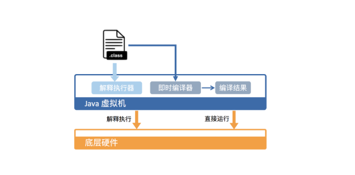

# 虚拟机怎么执行java 字节码的

从硬件视角来看，Java 字节码无法直接执行。因此，Java 虚拟机需要将字节码翻译成机器码。

在 HotSpot 里面，上述翻译过程有两种形式：

* 第一种是解释执行，即逐条将字节码翻译成机器码并执行；
* 第二种是即时编译（Just-In-Time compilation，JIT），即将一个方法中包含的所有字节码编译成机器码后再执行。

  

前者的优势在于无需等待编译，而后者的优势在于实际运行速度更快。**HotSpot 默认采用混合模式，综合了解释执行和即时编译两者的优点。它会先解释执行字节码，而后将其中反复执行的热点代码，以方法为单位进行即时编译。**

# java 在编译时间和生成代码的执行效率之间的取舍

HotSpot 采用了多种技术来提升启动性能以及峰值性能，刚刚提到的即时编译便是其中最重要的技术之一。

即时编译建立在程序符合二八定律的假设上，也就是百分之二十的代码占据了百分之八十的计算资源。

对于占据大部分的不常用的代码，我们无需耗费时间将其编译成机器码，而是采取解释执行的方式运行；另一方面，对于仅占据小部分的热点代码，我们则可以将其编译成机器码，以达到理想的运行速度。

理论上讲，即时编译后的 Java 程序的执行效率，是可能超过 C++ 程序的。这是因为与静态编译相比，即时编译拥有程序的运行时信息，并且能够根据这个信息做出相应的优化。

举个例子，我们知道虚方法是用来实现面向对象语言多态性的。对于一个虚方法调用，尽管它有很多个目标方法，但在实际运行过程中它可能只调用其中的一个。

这个信息便可以被即时编译器所利用，来规避虚方法调用的开销，从而达到比静态编译的 C++ 程序更高的性能。

**为了满足不同用户场景的需要，HotSpot 内置了多个即时编译器：C1、C2 和 Graal。Graal 是 Java 10 正式引入的实验性即时编译器，**

之所以引入多个即时编译器，是为了在编译时间和生成代码的执行效率之间进行取舍。

C1 又叫做 Client 编译器，面向的是对启动性能有要求的客户端 GUI 程序，采用的优化手段相对简单，因此编译时间较短。

C2 又叫做 Server 编译器，面向的是对峰值性能有要求的服务器端程序，采用的优化手段相对复杂，因此编译时间较长，但同时生成代码的执行效率较高。

从 Java 7 开始，HotSpot 默认采用分层编译的方式：热点方法首先会被 C1 编译，而后热点方法中的热点会进一步被 C2 编译。

为了不干扰应用的正常运行，HotSpot 的即时编译是放在额外的编译线程中进行的。HotSpot 会根据 CPU 的数量设置编译线程的数目，并且按 1:2 的比例配置给 C1 及 C2 编译器。

在计算资源充足的情况下，字节码的解释执行和即时编译可同时进行。编译完成后的机器码会在下次调用该方法时启用，以替换原本的解释执行。