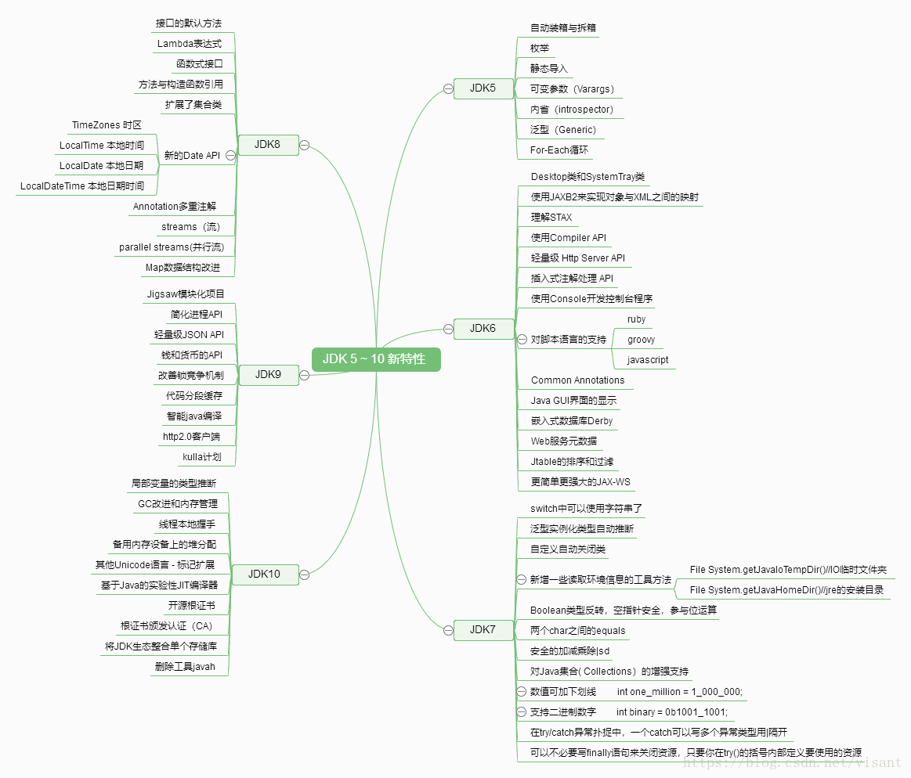

# 1. java 5-10 特性总览

要了解一门语言，最好的方式就是要能从基础的版本进行了解，升级的过程，以及升级的新特性，这样才能循序渐进的学好一门语言。




# 2. JDK5 新特性

## 3.2 自动装箱与拆箱： 

自动装箱的过程：每当需要一种类型的对象时，这种基本类型就自动地封装到与它相同类型的包装类中。

自动拆箱的过程：每当需要一个值时，被包装对象中的值就被自动地提取出来，没必要再去调用intValue()和doubleValue()方法。

自动装箱，只需将该值赋给一个类型包装器引用，java会自动创建一个对象。

自动拆箱，只需将该对象值赋给一个基本类型即可。

java——类的包装器

类型包装器有：Double,Float,Long,Integer,Short,Character和Boolean

## 2.2 枚举

把集合里的对象元素一个一个提取出来。枚举类型使代码更具可读性，理解清晰，易于维护。枚举类型是强类型的，从而保证了系统安全性。而以类的静态字段实现的类似替代模型，不具有枚举的简单性和类型安全性。

简单的用法：JavaEnum简单的用法一般用于代表一组常用常量，可用来代表一类相同类型的常量值。

复杂用法：Java为枚举类型提供了一些内置的方法，同事枚举常量还可以有自己的方法。可以很方便的遍历枚举对象。

## 2.3 静态导入

通过使用 import static，就可以不用指定 Constants 类名而直接使用静态成员，包括静态方法。

import xxxx 和 import static xxxx的区别是前者一般导入的是类文件如import java.util.Scanner；后者一般是导入静态的方法，import static java.lang.System.out。

## 2.4 可变参数（Varargs）

可变参数的简单语法格式为：

methodName([argumentList], dataType… argumentName);

## 2.5 beans ( 内省（Introspector）)

内省是Java语言对Bean类属性、事件的一种缺省处理方法。例如类A中有属性name,那我们可以通过getName,setName来得到其值或者设置新的值。通过getName/setName来访问name属性，这就是默认的规则。**Java中提供了一套API用来访问某个属性的getter /setter方法，通过这些API可以使你不需要了解这个规则（但你最好还是要搞清楚），这些API存放于包java.beans中。**

一 般的做法是通过类Introspector来获取某个对象的BeanInfo信息，然后通过BeanInfo来获取属性的描述器 （PropertyDescriptor），通过这个属性描述器就可以获取某个属性对应的getter/setter方法，然后我们就可以通过反射机制来调用这些方法。

## 2.6 泛型(Generic)

C++ 通过模板技术可以指定集合的元素类型，而Java在1.5之前一直没有相对应的功能。一个集合可以放任何类型的对象，相应地从集合里面拿对象的时候我们也不得不对他们进行强制得类型转换。引入了泛型，它允许指定集合里元素的类型，这样你可以得到强类型在编译时刻进行类型检查的好处。

## 2.7 For-Each循环

For-Each循环得加入简化了集合的遍历。假设我们要遍历一个集合对其中的元素进行一些处理。

## 2.8 XML 处理

**SAX** 也是基于事件处理xml文档，但却是用推模式解析，解析器解析完整个xml文档后，才产生解析事件，然后推给程序去处理这些事件；

**DOM** 采用的方式是将整个xml文档映射到一颗内存树，这样就可以很容易地得到父节点和子结点以及兄弟节点的数据，但如果文档很大，将会严重影响性能。

## 2.9 Instrumentation

https://www.jianshu.com/p/61752c985031

## 2.10 JUC

# 3. JDK6 新特性

## 3.1 Desktop类和SystemTray类

在JDK6中 ,AWT新增加了两个类:Desktop和SystemTray。

前者可以用来打开系统默认浏览器浏览指定的URL,打开系统默认邮件客户端给指定的邮箱发邮件,用默认应用程序打开或编辑文件(比如,用记事本打开以txt为后缀名的文件),用系统默认的打印机打印文档;

后者可以用来在系统托盘区创建一个托盘程序.

## 3.2 使用JAXB2来实现对象与XML之间的映射

JAXB是Java Architecture for XML Binding的缩写，可以将一个Java对象转变成为XML格式，反之亦然。

我们把对象与关系数据库之间的映射称为ORM, 其实也可以把对象与XML之间的映射称为OXM(Object XML Mapping). 

原来JAXB是Java EE的一部分，在JDK6中，SUN将其放到了Java SE中，这也是SUN的一贯做法。

JDK6中自带的这个JAXB版本是2.0, 比起1.0(JSR 31)来，JAXB2(JSR 222)用JDK5的新特性Annotation来标识要作绑定的类和属性等，这就极大简化了开发的工作量。

实际上，在Java EE 5.0中，EJB和Web Services也通过Annotation来简化开发工作。另外,JAXB2在底层是用StAX(JSR 173)来处理XML文档。除了JAXB之外，我们还可以通过XMLBeans和Castor等来实现同样的功能。

## 3.3 XML 处理 ——StAX 

StAX(JSR 173)是JDK6.0中除了DOM和SAX之外的又一种处理XML文档的API。

StAX 的来历 ：在JAXP1.3(JSR 206)有两种处理XML文档的方法:DOM(Document Object Model)和SAX(Simple API for XML).

由 于JDK6.0中的JAXB2(JSR 222)和JAX-WS 2.0(JSR 224)都会用到StAX，所以Sun决定把StAX加入到JAXP家族当中来，并将JAXP的版本升级到1.4(JAXP1.4是JAXP1.3的维护版本). JDK6里面JAXP的版本就是1.4. 。

**StAX**是The Streaming API for XML的缩写，一种利用拉模式解析(pull-parsing)XML文档的API 。StAX通过提供一种基于事件迭代器(Iterator)的API让程序员去控制xml文档解析过程,程序遍历这个事件迭代器去处理每一个解析事件，解析事件可以看做是程序拉出来的，也就是程序促使解析器产生一个解析事件，然后处理该事件，之后又促使解析器产生下一个解析事件，如此循环直到碰到文档结束符；

**SAX** 也是基于事件处理xml文档，但却是用推模式解析，解析器解析完整个xml文档后，才产生解析事件，然后推给程序去处理这些事件；

**DOM** 采用的方式是将整个xml文档映射到一颗内存树，这样就可以很容易地得到父节点和子结点以及兄弟节点的数据，但如果文档很大，将会严重影响性能。

## 3.4 使用Compiler API

现在我们可以用JDK6 的Compiler API(JSR 199)去动态编译Java源文件，Compiler API结合反射功能就可以实现动态的产生Java代码并编译执行这些代码，有点动态语言的特征。

这个特性对于某些需要用到动态编译的应用程序相当有用，比如 JSP Web Server，当我们手动修改JSP后，是不希望需要重启Web Server才可以看到效果的，这时候我们就可以用 Compiler API 来实现动态编译JSP文件，当然，现在的 JSP Web Server 也是支持JSP热部署的，现在的JSP Web Server通过在运行期间通过Runtime.exec或ProcessBuilder来调用 javac 来编译代码，这种方式需要我们产生另一个进程去做编译工作，不够优雅而且容易使代码依赖与特定的操作系统；**Compiler API通过一套易用的标准的API提供了更加丰富的方式去做动态编译,而且是跨平台的。**

## 3.5 轻量级Http Server API

JDK6 提供了一个简单的Http Server API,据此我们可以构建自己的嵌入式 Http Server,它支持 Http 和 Https 协议,提供了 HTTP1.1 的部分实现，没有被实现的那部分可以通过扩展已有的 Http Server API 来实现,程序员必须自己实现 HttpHandler 接口, HttpServer 会调用 HttpHandler 实现类的回调方法来处理客户端请求,在 这里,我们把一个 Http 请求和它的响应称为一个交换,包装成 HttpExchange 类, HttpServer 负责将 HttpExchange 传给 HttpHandler 实现类的回调方法.

## 3.6 插入式注解处理API(Pluggable Annotation Processing API)

插入式注解处理API(JSR 269)提供一套标准API来处理Annotations(JSR 175)

实 际上JSR 269不仅仅用来处理Annotation,我觉得更强大的功能是它建立了Java 语言本身的一个模型,它把 method, package, constructor, type, variable, enum, annotation等Java语言元素映射为Types和Elements(两者有什么区别?), 从而将Java语言的语义映射成为对象, 我们可以利用JSR 269提供的API来构建一个功能丰富的元编程(metaprogramming)环境.

JSR 269用Annotation Processor在编译期间而不是运行期间处理Annotation, Annotation Processor相当于编译器的一个插件,所以称为插入式注解处理.如果Annotation Processor处理Annotation时(执行process方法)产生了新的Java代码,编译器会再调用一次Annotation Processor,如果第二次处理还有新代码产生,就会接着调用Annotation Processor,直到没有新代码产生为止.每执行一次process()方法被称为一个”round”,这样整个Annotation processing过程可以看作是一个round的序列.

JSR 269主要被设计成为针对Tools或者容器的API. 举个例子,我们想建立一套基于Annotation的单元测试框架(如TestNG),在测试类里面用Annotation来标识测试期间需要执行的测试方法

## 3.7 用Console开发控制台程序

JDK6 中提供了java.io.Console 类专用来访问基于字符的控制台设备. 你的程序如果要与Windows下的cmd或者Linux下的Terminal交互,就可以用Console类代劳. 但我们不总是能得到可用的Console, 一个JVM是否有可用的Console依赖于底层平台和JVM如何被调用. 如果JVM是在交互式命令行(比如Windows的cmd)中启动的,并且输入输出没有重定向到另外的地方,那么就可以得到一个可用的Console实例.

## 3.8 对脚本语言的支持如: ruby, groovy, javascript

## 3.9 Common Annotations

Common annotations原本是Java EE 5.0(JSR 244)规范的一部分，现在SUN把它的一部分放到了Java SE 6.0中.

随 着Annotation元数据功能(JSR 175)加入到Java SE 5.0里面，很多Java 技术(比如EJB,Web Services)都会用Annotation部分代替XML文件来配置运行参数（或者说是支持声明式编程,如EJB的声明式事务）, 如果这些技术为通用目的都单独定义了自己的Annotations,显然有点重复建设, 所以,为其他相关的Java技术定义一套公共的Annotation是有价值的，可以避免重复建设的同时，也保证Java SE和Java EE 各种技术的一致性.

> 详情可以看 [annotaion](util/annotation.md)

# 4. JDK 7 新特性

## 4.1 switch中可以使用字符串

```java
String s = "test";
switch (s) {
 case "test" :
  System.out.println("test");
 case "test1" :
  System.out.println("test1");
 break ;
 default :
  System.out.println("break");
 break ;
}
```

## 4.2 泛型实例化类型自动推断

”<>”的运用 ： List tempList = new ArrayList<>(); 

```java
public class JDK7GenericTest {
    public static void main(String[] args) {
        // Pre-JDK 7
        List<String> lst1 = new ArrayList<String>();
        // JDK 7 supports limited type inference for generic instance creation
        List<String> lst2 = new ArrayList<>();
        lst1.add("Mon");
        lst1.add("Tue");
        lst2.add("Wed");
        lst2.add("Thu");
        for (String item : lst1) {
            System.out.println(item);
        }
        for (String item : lst2) {
            System.out.println(item);
        }
    }
}
```

## 4.3 try-with-resources 

语法demo

```java
byte[] b = new byte[1024];

try (FileInputStream fis = new FileInputStream("my.txt")) {
    int data = fis.read();
    while (data != -1) {
        data = fis.read(b);
    }
    throw new RuntimeException();
}
```

jdk7 api中的接口，（不过注释太长，删掉了close()方法的一部分注释）

```java
/**

 * A resource that must be closed when it is no longer needed.
   *
 * @author Josh Bloch
 * @since 1.7
 */
public interface AutoCloseable {
    /**
    * Closes this resource, relinquishing any underlying resources.
    * This method is invoked automatically on objects managed by the
    * {@code try}-with-resources statement.
    *
    */
    void close() throws Exception;
}
```

只要实现该接口，在该类对象销毁时自动调用close方法，你可以在close方法关闭你想关闭的资源，例子如下

```java
class TryClose implements AutoCloseable {
 	@Override
 	public void close() throw Exception {
  		System.out.println(" Custom close method …close resources ");
 	}
}
//请看jdk自带类BufferedReader如何实现close方法（当然还有很多类似类型的类）
public void close() throws IOException {
    synchronized (lock) {
        if (in == null)
            return;
        in.close();
        in = null;
        cb = null;
    }
}
```

close方法在try-with-resources语句中会被自动调用，用于自动释放资源。

## 4.4 新增一些取环境信息的工具方法

```cpp
File System.getJavaIoTempDir() // IO临时文件夹

File System.getJavaHomeDir() // JRE的安装目录

File System.getUserHomeDir() // 当前用户目录

File System.getUserDir() // 启动java进程时所在的目录

.......
```

## 4.5 Boolean类型反转，空指针安全，参与位运算

```java
Boolean Booleans.negate(Boolean booleanObj)

True => False , False => True, Null => Null

boolean Booleans.and(boolean[] array)

boolean Booleans.or(boolean[] array)

boolean Booleans.xor(boolean[] array)

boolean Booleans.and(Boolean[] array)

boolean Booleans.or(Boolean[] array)

boolean Booleans.xor(Boolean[] array)
```

## 4.6 两个char间的equals

```java
boolean Character.equalsIgnoreCase(char ch1, char ch2)
```

## 4.7 安全的加减乘除

```java
int Math.safeToInt(long value)

int Math.safeNegate(int value)// 取负数

long Math.safeSubtract(long value1, int value2)

long Math.safeSubtract(long value1, long value2)

int Math.safeMultiply(int value1, int value2)

long Math.safeMultiply(long value1, int value2)

long Math.safeMultiply(long value1, long value2)

long Math.safeNegate(long value)

int Math.safeAdd(int value1, int value2)

long Math.safeAdd(long value1, int value2)

long Math.safeAdd(long value1, long value2)

int Math.safeSubtract(int value1, int value2)
```

## 4.8 数值可加下划线

例如：int one_million = 1_000_000;

## 4.9 支持二进制文字

例如：int binary = 0b1001_1001;

## 4.10 简化了可变参数方法的调用

当程序员试图使用一个不可具体化的可变参数并调用一个varargs （可变）方法时，编辑器会生成一个“非安全操作”的警告。

## 4.11 在try catch异常扑捉中，一个catch可以写多个异常类型，用”|”隔开**

```java
try {
   ......
} catch(ClassNotFoundException|SQLException ex) {
   ex.printStackTrace();
}
```

## 4.12 Fork-Jion

# 5. JAVA 8 新特性

## 5..1 接口的默认方法

Java 8允许我们给接口添加一个非抽象的方法实现，只需要使用 default关键字即可，这个特征又叫做扩展方法，示例如下：

```java
interface Formula {
    double calculate(int a);
    default double sqrt(int a) {
        return Math.sqrt(a);
    }
}
```

上面接口在拥有calculate方法之外同时还定义了sqrt方法，实现了Formula接口的子类只需要实现一个calculate方法，默认方法sqrt将在子类上可以直接使用。

```java
Formula formula = new Formula() {
    @Override
    public double calculate(int a) {
        return sqrt(a * 100);
    }
};
formula.calculate(100);     // 100.0
formula.sqrt(16);           // 4.012345678
```

文中的接口被实现为一个匿名类的实例，该代码非常容易理解，6行代码实现了计算 sqrt(a * 100)。在下一节中，我们将会看到实现单方法接口的更简单的做法。

## 5.2 Lambda 表达式

[lambda](util/java的lambda.md)

## 5.3 函数式接口

Lambda 表达式是如何在java的类型系统中表示的呢？每一个lambda表达式都对应一个类型，通常是接口类型。而“函数式接口”是指仅仅只包含一个抽象方法的 接口，每一个该类型的lambda表达式都会被匹配到这个抽象方法。因为 默认方法 不算抽象方法，所以你也可以给你的函数式接口添加默认方法。

我们可以将lambda表达式当作任意只包含一个抽象方法的接口类型，确保你的接口一定达到这个要求，你只需要给你的接口添加 @FunctionalInterface 注解，编译器如果发现你标注了这个注解的接口有多于一个抽象方法的时候会报错的。

```java
@FunctionalInterface
interface Converter<F, T> {
    T convert(F from);
}
Converter<String, Integer> converter = (from) -> Integer.valueOf(from);
Integer converted = converter.convert("123");
System.out.println(converted);    // 1231234567
```

需要注意如果@FunctionalInterface没有指定，上面的代码也是对的。

## 5.4 方法与构造函数引用

```java
Converter<String, Integer> converter = Integer::valueOf;
Integer converted = converter.convert("123");
System.out.println(converted);   // 123123
```

Java 8 允许你使用 :: 关键字来传递方法或者构造函数引用，上面的代码展示了如何引用一个静态方法，我们也可以引用一个对象的方法

```java
converter = something::startsWith;
String converted = converter.convert("Java");
System.out.println(converted);    // "J"123
```

接下来看看构造函数是如何使用::关键字来引用的，首先我们定义一个包含多个构造函数的简单类：


```java
class Person {
    String firstName;
    String lastName;
    Person() {}
	
    Person(String firstName, String lastName) {
    	this.firstName = firstName;
	    this.lastName = lastName;
	}
}
```
接下来我们指定一个用来创建Person对象的对象工厂接口：

```java
interface PersonFactory<P extends Person> {
    P create(String firstName, String lastName);
}
```

这里我们使用构造函数引用来将他们关联起来，而不是实现一个完整的工厂

```java
PersonFactory<Person> personFactory = Person::new;
Person person = personFactory.create("Peter", "Parker");
```

我们只需要使用 Person::new 来获取Person类构造函数的引用，Java编译器会自动根据PersonFactory.create方法的签名来选择合适的构造函数。

## 5.5 Lambda 作用域

在lambda表达式中访问外层作用域和老版本的匿名对象中的方式很相似。你可以直接访问标记了final的外层局部变量，或者实例的字段以及静态变量。

## 5.6 访问局部变量

我们可以直接在lambda表达式中访问外层的局部变量：

```java
int num = 1;//这里的num必须不可被后面的代码修改（即隐性的具有final的语义）
Converter<Integer, String> stringConverter =
        (from) -> String.valueOf(from + num);
stringConverter.convert(2);     // 31234
```

## 5.7 访问对象字段与静态变量

和本地变量不同的是，lambda内部对于实例的字段以及静态变量是即可读又可写。该行为和匿名对象是一致的

```java
class Lambda4 {
    static int outerStaticNum;
    int outerNum;
    void testScopes() {
        Converter<Integer, String> stringConverter1 = (from) -> {
            outerNum = 23;
            return String.valueOf(from);
        };

        Converter<Integer, String> stringConverter2 = (from) -> {
            outerStaticNum = 72;
            return String.valueOf(from);
        };
    }
}
```

## 5.8 Date API

Java 8 在包java.time下包含了一组全新的时间日期API。新的日期API和开源的Joda-Time库差不多，但又不完全一样，下面的例子展示了这组新API里最重要的一些部分： 

> [data&time](util/data&time.md)

### LocalTime 本地时间

## 5.9  可重复Annotations

> 详情可以看 [annotaion](util/annotation.md)

# 6. JDK 9 新特性

1：modularity System 模块化系统

Modularity提供了类似于OSGI框架的功能，模块之间存在相互的依赖关系，可以导出一个公共的API，并且隐藏实现的细节，Java提供该功能的主要的动机在于，减少内存的开销，在JVM启动的时候，至少会有30～60MB的内存加载，主要原因是JVM需要加载rt.jar，不管其中的类是否被classloader加载，第一步整个jar都会被JVM加载到内存当中去，模块化可以根据模块的需要加载程序运行需要的class。

在引入了模块系统之后，JDK 被重新组织成 94 个模块。Java 应用可以通过新增的 jlink 工具，创建出只包含所依赖的 JDK 模块的自定义运行时镜像。这样可以极大的减少 Java 运行时环境的大小。使得JDK可以在更小的设备中使用。采用模块化系统的应用程序只需要这些应用程序所需的那部分JDK模块，而非是整个JDK框架了。

2：HTTP/2

JDK9之前提供HttpURLConnection API来实现Http访问功能，但是这个类基本很少使用，一般都会选择Apache的Http Client，此次在Java 9的版本中引入了一个新的包：java.net.http，里面提供了对Http访问很好的支持，不仅支持Http1.1而且还支持HTTP2（什么是HTTP2？请参见HTTP2的时代来了…），以及WebSocket，据说性能特别好。

3：JShell

用过Python的童鞋都知道，Python 中的读取-求值-打印循环（ Read-Evaluation-Print Loop ）很方便。它的目的在于以即时结果和反馈的形式。

java9引入了jshell这个交互性工具，让Java也可以像脚本语言一样来运行，可以从控制台启动 jshell ，在 jshell 中直接输入表达式并查看其执行结果。当需要测试一个方法的运行效果，或是快速的对表达式进行求值时，jshell 都非常实用。

除了表达式之外，还可以创建 Java 类和方法。jshell 也有基本的代码完成功能。我们在教人们如何编写 Java 的过程中，不再需要解释 “public static void main（String [] args）” 这句废话。

4：不可变集合工厂方法 
Java 9增加了List.of()、Set.of()、Map.of()和Map.ofEntries()等工厂方法来创建不可变集合。


    List strs = List.of("Hello", "World");
    List strs List.of(1, 2, 3);
    Set strs = Set.of("Hello", "World");
    Set ints = Set.of(1, 2, 3);
    Map maps = Map.of("Hello", 1, "World", 2);12345

除了更短和更好阅读之外，这些方法也可以避免您选择特定的集合实现。在创建后，继续添加元素到这些集合会导致 “UnsupportedOperationException” 。

5：私有接口方法

Java 8 为我们提供了接口的默认方法和静态方法，接口也可以包含行为，而不仅仅是方法定义。 
默认方法和静态方法可以共享接口中的私有方法，因此避免了代码冗余，这也使代码更加清晰。如果私有方法是静态的，那这个方法就属于这个接口的。并且没有静态的私有方法只能被在接口中的实例调用。


interface InterfaceWithPrivateMethods {
    private static String staticPrivate() {
        return "static private";
    }
    private String instancePrivate() {
        return "instance private";
    }
    default void check() {    
        String result = staticPrivate();
        InterfaceWithPrivateMethods pvt = new InterfaceWithPrivateMethods() {
            // anonymous class 匿名类
        };
        result = pvt.instancePrivate();
    }
}123456789101112131415

6：HTML5风格的Java帮助文档

Java 8之前的版本生成的Java帮助文档是在HTML 4中。在Java 9中，Javadoc 的输出现在符合兼容 HTML5 标准。现在HTML 4是默认的输出标记语言，但是在之后发布的JDK中，HTML 5将会是默认的输出标记语言。

Java帮助文档还是由三个框架组成的结构构成，这是不会变的，并且以HTML 5输出的Java帮助文档也保持相同的结构。每个 Javadoc 页面都包含有关 JDK 模块类或接口来源的信息。

7：多版本兼容 JAR

当一个新版本的 Java 出现的时候，你的库用户要花费很长时间才会切换到这个新的版本。这就意味着库要去向后兼容你想要支持的最老的 Java 版本 (许多情况下就是 Java 6 或者 7)。这实际上意味着未来的很长一段时间，你都不能在库中运用 Java 9 所提供的新特性。幸运的是，多版本兼容 JAR 功能能让你创建仅在特定版本的 Java 环境中运行库程序时选择使用的 class 版本：

multirelease.jar 
├── META-INF 
│   └── versions 
│       └── 9 
│           └── multirelease 
│               └── Helper.class 
├── multirelease 
├── Helper.class 
└── Main.class

在上述场景中， multirelease.jar 可以在 Java 9 中使用, 不过 Helper 这个类使用的不是顶层的 multirelease.Helper 这个 class, 而是处在“META-INF/versions/9”下面的这个。这是特别为 Java 9 准备的 class 版本，可以运用 Java 9 所提供的特性和库。同时，在早期的 Java 诸版本中使用这个 JAR 也是能运行的，因为较老版本的 Java 只会看到顶层的这个 Helper 类。

8：统一 JVM 日志

Java 9 中 ，JVM 有了统一的日志记录系统，可以使用新的命令行选项-Xlog 来控制 JVM 上 所有组件的日志记录。该日志记录系统可以设置输出的日志消息的标签、级别、修饰符和输出目标等。

9：垃圾收集机制

Java 9 移除了在 Java 8 中 被废弃的垃圾回收器配置组合，同时把G1设为默认的垃圾回收器实现。替代了之前默认使用的Parallel GC，对于这个改变，evens的评论是酱紫的：这项变更是很重要的，因为相对于Parallel来说，G1会在应用线程上做更多的事情，而Parallel几乎没有在应用线程上做任何事情，它基本上完全依赖GC线程完成所有的内存管理。这意味着切换到G1将会为应用线程带来额外的工作，从而直接影响到应用的性能

10：I/O 流新特性 
 java.io.InputStream 中增加了新的方法来读取和复制 InputStream 中包含的数据。 
    readAllBytes：读取 InputStream 中的所有剩余字节。 
    readNBytes： 从 InputStream 中读取指定数量的字节到数组中。 
    transferTo：读取 InputStream 中的全部字节并写入到指定的 OutputStream 中 。


# 7. JDK 10新特性

1：局部变量的类型推断 
2：GC改进和内存管理 
3：线程本地握手 
4：备用内存设备上的堆分配 
5：其他Unicode语言 - 标记扩展 
6：基于Java的实验性JIT编译器 
7：开源根证书 
8：根证书颁发认证（CA） 
9：将JDK生态整合单个存储库 
10：删除工具javah

> ————————————————
> 版权声明：本文为CSDN博主「visant」的原创文章，遵循CC 4.0 BY-SA版权协议，转载请附上原文出处链接及本声明。
> 原文链接：https://blog.csdn.net/visant/java/article/details/79778967
>
> 