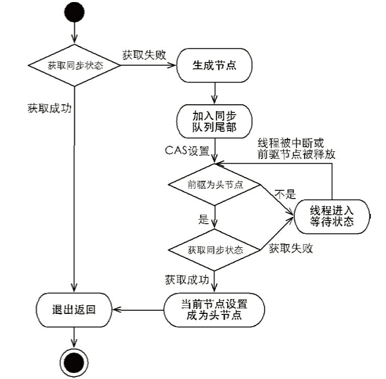
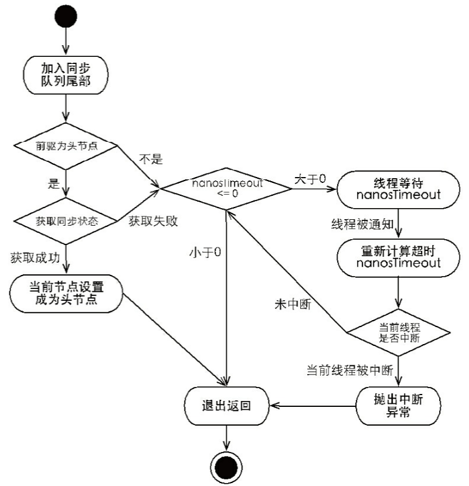

# introduction

AbstractQueuedLongSynchronizer **队列同步器**，是**用来构建锁或者其他同步组件的基础框架**，

* **它使用了一个volatile int成员变量表示同步状态(管理同步状态)**
* **通过内置的`FIFO`队列来完成对发生了资源"竞争"的线程的排队工作**

同步器的主要使用方式是继承，子类通过继承同步器并实现它的抽象方法来管理同步状态，在抽象方法的实现过程中免不了要对同步状态进行更改，这时就需要使用同步器提供的3 个方法（getState()、setState(int newState)和compareAndSetState(int expect,int update)）来进行操作，因为它们能够保证状态的改变是安全的。子类推荐被定义为自定义同步组件的静态内部类，同步器自身没有实现任何同步接口，它仅仅是定义了若干同步状态获取和释放的方法，来供自定义同步组件使用，同步器既可以支持独占式地获取同步状态，也可以支持共享式地获取同步态，这样就可以方便实现不同类型的同步组件（ReentrantLock、ReentrantReadWriteLock和CountDownLatch等）

同步器是实现锁（也可以是任意同步组件）的关键，在锁的实现中聚合同步器，利用同步器实现锁的语义。可以这样理解二者之间的关系：锁是面向使用者的，它定义了使用者与锁交互的接口（比如可以允许两个线程并行访问），隐藏了实现细节；同步器面向的是锁的实现者，它简化了锁的实现方式，屏蔽了同步状态管理、线程的排队、等待与唤醒等底层操作。锁和同步器很好地隔离了使用者和实现者所需关注的领域。

# 队列同步器的接口与示例

**同步器的设计是基于模板方法模式的，也就是说，使用者需要继承同步器并重写指定的方法，随后将同步器组合在自定义同步组件的实现当中，并调用同步器提供的模板方法，而这些模板方法将会调用使用者重写的方法。重写同步器指定的方法时，需要使用同步器提供的如下3个方法来访问或修改同步状态。**

* getState()：获取当前同步状态。
* setState(int newState)：设置当前同步状态。

* compareAndSetState(int expect,int update)：使用CAS非方式设置当前状态，该方法能够保证状态
  设置的原子性。

## 同步器提供的模板方法

> 下文中说的关于方法响应中断的线程状态相关知识可以看 [并发编程中的重要概念](../并发编程中的重要概念.md) 8.6 线程中断 这一节

| 方法名                                                       | 描述                                                         | 源码index                                                 |
| ------------------------------------------------------------ | ------------------------------------------------------------ | --------------------------------------------------------- |
| public final void **acquire**(int arg)                       | 阻塞的独占式获取同步状态，如果当前线程获取同步状态成功，则由该方法返回，否则，将会进入同步队列等待，该方法将会调用重写的**tryAcquire** | [acquire](#acquire)                                       |
| public final void **acquireInterruptibly**(int arg)          | 与**acquire**相同，不过该方法响应中断，线程在同步队列中等待时被中断了，则该方法会抛出**InterruptedException**异常 | [acquireInterruptibly](#acquireInterruptibly)             |
| public final boolean **tryAcquireNanos**(int arg, long nanosTimeout) | 在**acquireInterruptibly**的基础上增加了超时限制，**如果在超时限制范围内未获取到同步状态那么返回**false,获取到返回true | [tryAcquireNanos](#tryAcquireNanos)                       |
| public final boolean **release**(int arg)                    | 独占式的释放同步状态，该方法释放同步状态之后会将同步队列中第一个节点唤醒 **调用tryRelease** | [release](#release)                                       |
|                                                              |                                                              |                                                           |
| public final void **acquireShared**(int arg)                 | 共享式获取同步状态，如果当前线程未获取到同步状态，将会进入同步队列等待，与独占式的区别在同一时刻可以有多个线程获取到同步状态，**调用重写的tryAcquireShared方法** | [acquireShared](#acquireShared)                           |
| public final void **acquireSharedInterruptibly**(int arg)    | 和**acquireShared**相同，不过该方法响应中断                  | [acquireSharedInterruptibly](#acquireSharedInterruptibly) |
| public final boolean **tryAcquireSharedNanos**(int arg, long nanosTimeout) | 在**acquireSharedInterruptibly**方法基础上增加超时限制       | [tryAcquireSharedNanos](#tryAcquireSharedNanos)           |
| public final boolean **releaseShared**(int arg)              | 共享式释放同步状态                                           | [releaseShared](#releaseShared)                           |
| public final Collection<Thread> **getQueuedThreads**()       | 获取等待在同步队列上的线程                                   | [getQueuedThreads](#getQueuedThreads)                     |

## 需要做具体实现的方法

| 方法名                                          | 描述                                                         |
| ----------------------------------------------- | ------------------------------------------------------------ |
| protected boolean **tryAcquire**(int arg)       | 独占式获取同步状态，实现该方法需要查询当前状态并判断同步状态是否符合预期，然后再进行CAS设置同步状态。**true：成功：false:失败** |
| protected boolean **tryRelease**(int arg)       | 独占式释放同步状态，等待获取同步状态的线程有机会获取同步状态了**true：成功：false:失败** |
|                                                 |                                                              |
| protected long **tryAcquireShared**(int arg)    | 共享式获取同步状态，返回大于等于0的值，表示获取成功，反之，获取失败。<br />**负数表示失败；0表示成功，但没有剩余可用资源；正数表示成功，且有剩余资源** |
| protected boolean **tryReleaseShared**(int arg) | 共享式释放同步状态。<br/>**如果释放后允许唤醒后续等待结点返回true，否则返回false。** |
| protected boolean **isHeldExclusively**()       | 当前同步器是否在独占模式下被线程占用（一般该方法表示是否被当前线程所独占） |

## AQS中一些重要概念和common方法

### 队列节点类型

- **SHARED** 共享式
- **EXCLUSIVE** 独占式

### 队列节点的waitStatus

- **CANCELLED**(1)：表示当前结点已取消调度。当timeout或被中断（响应中断的情况下），会变更为此状态，进入该状态后的结点将不会再变化。
- **SIGNAL**(-1)：表示后继结点需要在当前节点获取到同步状态之后 执行unpark唤醒；后继节点被 park的时候也是需要前驱节点被设置成这个状态作为条件；park是为了节省自旋等待消耗资源
- **CONDITION**(-2)：表示结点等待在Condition上，当其他线程调用了Condition的signal()方法后，CONDITION状态的结点将**从等待队列转移到同步队列中**，等待获取同步锁。
- **PROPAGATE**(-3)：共享模式下，前继结点不仅会唤醒其后继结点，同时也可能会唤醒后继的后继结点。
- **0**：新结点入队时的默认状态。

### addWaiter

```java
/**
 * 将节点加入到队列尾部
 */
private Node addWaiter(Node mode) {
    Node node = new Node(Thread.currentThread(), mode);
    // Try the fast path of enq; backup to full enq on failure
    //尝试使用最快速的方式放到队尾。
    Node pred = tail;
    if (pred != null) {
        node.prev = pred;
        if (compareAndSetTail(pred, node)) {
            pred.next = node;
            return node;
        }
    }
    // 上一步失败则通过enq入队。该方法会使用自旋的方式直到节点入队成功
    enq(node);
    return node;
}
/**
 * 该方法会使用自旋的方式直到节点入队成功
 **/
private Node enq(final Node node) {
        for (;;) {
            Node t = tail;
            if (t == null) { // Must initialize
                if (compareAndSetHead(new Node()))
                    tail = head;
            } else {
                node.prev = t;
                if (compareAndSetTail(t, node)) {
                    t.next = node;
                    return t;
                }
            }
        }
    }
```

### shouldParkAfterFailedAcquire

```java

 private static boolean shouldParkAfterFailedAcquire(Node pred, Node node) {
     int ws = pred.waitStatus;
     if (ws == Node.SIGNAL)
         /*
          * This node has already set status asking a release
          * to signal it, so it can safely park.
          * 如果已经告诉前驱节点获取到同步状态之后他会通知自己unpark，那当前的节点就可以park休息了（目
          * 的是为了不占用cpu资源）
          */
         return true;
     if (ws > 0) {
         /*
          * Predecessor was cancelled. Skip over predecessors and
          * indicate retry.  
          * 如果前驱放弃了(timeout or 中断了 or 获取锁的时候发生异常 )，那就一直往前找，直到找到最近一个正常等待的节点，并排在它的后边等待。
          */
         do {
             node.prev = pred = pred.prev;
         } while (pred.waitStatus > 0);
         pred.next = node;
     } else {
         /*
          * waitStatus must be 0 or PROPAGATE.  Indicate that we
          * need a signal, but don't park yet.  Caller will need to
          * retry to make sure it cannot acquire before parking.
          * 前驱节点是 0 or PROPAGATE 状态，当前节点可以修改它的状态为SIGNAL，这样前驱节点就会在获取
          * 同步状态后通知自己 unpark, 当前节点也会在下一次循环中走到这个方法时候被park，从而减少无用
          * 的自旋带来的CPU性能损耗
          * 
          */
         compareAndSetWaitStatus(pred, ws, Node.SIGNAL);
     }
        return false;
}
```

## acquire

```java
public final void acquire(int arg) {
    // tryAcquire 独占式获取同步状态 
    // 失败就执行  addWaiter(Node.EXCLUSIVE) 添加一个独占式节点进入等待队列尾部，然后执行acquireQueued 直到获取到同步状态，才返回，并且线程在等待过程中如果被中断过，那么会执行 selfInterrupt方法，安全中断当前线程
    if (!tryAcquire(arg) &&
        acquireQueued(addWaiter(Node.EXCLUSIVE), arg))
        selfInterrupt();
}
// 在这里面执行同步等待获取状态的逻辑 
final boolean acquireQueued(final Node node, int arg) {
        boolean failed = true;
        try {
            boolean interrupted = false;
            for (;;) {
                // 上文中我们说过 AQS使用的时内置的FIFO队列管理线程排队工作，所以这里就是利用这样的特性来执行一个尝试获取锁的动作,只有在前一个结点是head的时候，才意味着排队排到当前线程了
                final Node p = node.predecessor();
                if (p == head && tryAcquire(arg)) {
                    // 获取成功，当前节点自然就是head节点了
                    setHead(node);
                    p.next = null; // help GC
                    failed = false;
                    return interrupted;
                }
                // 通过 shouldParkAfterFailedAcquire 判断前驱节点的状态是，它获取到同步状态后会通知后继节点unpark的时候，当前节点也就可以通过parkAndCheckInterrupt方法使用LockSupport.park(this);将线程阻塞，这样可以避免无用的自旋消耗CPU资源，在parkAndCheckInterrupt中还会检查当前线程是否被中断过，只要发生就会使用 interrupted=true 记录下来，作用是在之后如果获取到锁了，会调用线程的中断方法，安全中断该线程（也就是 selfInterrupt这个方法）
                if (shouldParkAfterFailedAcquire(p, node) &&
                    parkAndCheckInterrupt())
                    interrupted = true;
            }
        } finally {
            if (failed)
                cancelAcquire(node);
        }
    }

```

## acquireInterruptibly

```java
public final void acquireInterruptibly(int arg)
            throws InterruptedException {
    	// 响应中断
        if (Thread.interrupted())
            throw new InterruptedException();
        if (!tryAcquire(arg))
            doAcquireInterruptibly(arg);
}
// 同 acquireQueued 基本相同的逻辑，就是响应中断罢了
private void doAcquireInterruptibly(int arg)
        throws InterruptedException {
        final Node node = addWaiter(Node.EXCLUSIVE);
        boolean failed = true;
        try {
            for (;;) {
                final Node p = node.predecessor();
                if (p == head && tryAcquire(arg)) {
                    setHead(node);
                    p.next = null; // help GC
                    failed = false;
                    return;
                }
                if (shouldParkAfterFailedAcquire(p, node) &&
                    parkAndCheckInterrupt())
                    throw new InterruptedException();
            }
        } finally {
            if (failed)
                cancelAcquire(node);
        }
    }
    
```

## tryAcquireNanos

```java
public final boolean tryAcquireNanos(int arg, long nanosTimeout)
            throws InterruptedException {
        if (Thread.interrupted())
            throw new InterruptedException();
        return tryAcquire(arg) ||
            doAcquireNanos(arg, nanosTimeout);    
}
/**
 * 在doAcquireInterruptibly的基础上增加了超时限制，如果在超时限制范围内未获取到同步状态那么返回   
 * false,获取到返回true
 */
private boolean doAcquireNanos(int arg, long nanosTimeout)
            throws InterruptedException {
        if (nanosTimeout <= 0L)
            return false;
        final long deadline = System.nanoTime() + nanosTimeout;
        final Node node = addWaiter(Node.EXCLUSIVE);
        boolean failed = true;
        try {
            for (;;) {
                final Node p = node.predecessor();
                if (p == head && tryAcquire(arg)) {
                    setHead(node);
                    p.next = null; // help GC
                    failed = false;
                    return true;
                }
                nanosTimeout = deadline - System.nanoTime();
                if (nanosTimeout <= 0L)
                    return false;
               // 超时时间nanosTimeout只有大于1ms的时候才会有可能调用park,低于这个的没有park的必要
                if (shouldParkAfterFailedAcquire(p, node) &&
                    nanosTimeout > spinForTimeoutThreshold)
                    LockSupport.parkNanos(this, nanosTimeout);
                if (Thread.interrupted())
                    throw new InterruptedException();
            }
        } finally {
            if (failed)
                cancelAcquire(node);
        }
}
```

## release

```java
public final boolean release(int arg) {
        if (tryRelease(arg)) {
            Node h = head;//找到头结点
            if (h != null && h.waitStatus != 0)
				//唤醒等待队列里的下一个线程
                unparkSuccessor(h);
            return true;
        }
        return false;
}

private void unparkSuccessor(Node node) {
        /*
         * If status is negative (i.e., possibly needing signal) try
         * to clear in anticipation of signalling.  It is OK if this
         * fails or if status is changed by waiting thread.
         */
        int ws = node.waitStatus;
        if (ws < 0)
            compareAndSetWaitStatus(node, ws, 0);
	    //找到下一个需要唤醒的结点s
        Node s = node.next;
        if (s == null || s.waitStatus > 0) { //有的同学会问为啥存在s==null，独占式的不存在这样的问题，但是共享锁是多个线程在执行，这个节点的线程在释放锁走到这一步了，某一个线程在这个时候获取到锁了，讲head指向了自己，那么就会存在 s == null 的情况了
            s = null;
            for (Node t = tail; t != null && t != node; t = t.prev) // 从后向前找。为什么从后向前查找？ 因为s==null的情况没办法从前往后查找
                if (t.waitStatus <= 0)// <=0的结点，都是还有效的结点。无效节点会在 shouldParkAfterFailedAcquire 方法中被丢弃的
                    s = t;
        }
        if (s != null)
            LockSupport.unpark(s.thread);// huan
    }
```

## acquireShared

```java
public final void acquireShared(int arg) {
    	// 尝试共享式的获取同步状态，失败这执行doAcquireShared等待直到获取到同步状态为止
        if (tryAcquireShared(arg) < 0)
            doAcquireShared(arg);
}

private void doAcquireShared(int arg) {
    	// 将节点加入到等待队列末尾
        final Node node = addWaiter(Node.SHARED);
        boolean failed = true; //是否失败
        try {
            boolean interrupted = false;
            for (;;) {
                final Node p = node.predecessor();
                // 等待队列是FIFO队列，所以如果快轮到当前节点了，那么它前一个节点一定要是head
                if (p == head) {
                    int r = tryAcquireShared(arg); 
                    if (r >= 0) { // 获取同步状态成功
                        //将head指向自己，还有剩余资源可以再唤醒之后的线程
                        setHeadAndPropagate(node, r);
                        p.next = null; // help GC
                        if (interrupted)
                            selfInterrupt();// 安全中断线程
                        failed = false;// 设置成功标识
                        return;
                    }
                }
                // 和上文独占式的获取一样的逻辑
                if (shouldParkAfterFailedAcquire(p, node) &&
                    parkAndCheckInterrupt())
                    interrupted = true;
            }
        } finally {
            if (failed)
                cancelAcquire(node);
        }
    }

private void setHeadAndPropagate(Node node, long propagate) {
        Node h = head; // Record old head for check below
        setHead(node); //head指向自己
    	//如果还有剩余量，继续唤醒下一个后继节点
        if (propagate > 0 || h == null || h.waitStatus < 0 ||
            (h = head) == null || h.waitStatus < 0) {
            Node s = node.next;
            // 并且该节点的后继节点也是共享型节点
            if (s == null || s.isShared())
                // 唤醒它的后继节点线程
                doReleaseShared();
        }
}

private void doReleaseShared() {
    for (;;) {
        Node h = head;
        if (h != null && h != tail) {
            int ws = h.waitStatus;
            if (ws == Node.SIGNAL) {
                if (!compareAndSetWaitStatus(h, Node.SIGNAL, 0))
                    continue;            // loop to recheck cases
                unparkSuccessor(h);//唤醒后继
            }
            else if (ws == 0 &&
                 !compareAndSetWaitStatus(h, 0, Node.PROPAGATE))
                continue;                // loop on failed CAS
        }
        if (h == head)// head没有变化的时候循环中止，这里有点辅助唤醒的意味，提升可以更快唤醒共享线程
            break;
    }
}

private void unparkSuccessor(Node node) {
        /*
         * If status is negative (i.e., possibly needing signal) try
         * to clear in anticipation of signalling.  It is OK if this
         * fails or if status is changed by waiting thread.
         */
        int ws = node.waitStatus;
        if (ws < 0)
            compareAndSetWaitStatus(node, ws, 0);
	    //找到下一个需要唤醒的结点s
        Node s = node.next;
        if (s == null || s.waitStatus > 0) { //有的同学会问为啥存在s==null，独占式的不存在这样的问题，但是共享锁是多个线程在执行，这个节点的线程在释放锁走到这一步了，某一个线程在这个时候获取到锁了，讲head指向了自己，那么就会存在 s == null 的情况了
            s = null;
            for (Node t = tail; t != null && t != node; t = t.prev) // 从后向前找。为什么从后向前查找？ 因为s==null的情况没办法从前往后查找
                if (t.waitStatus <= 0)// <=0的结点，都是还有效的结点。无效节点会在 shouldParkAfterFailedAcquire 方法中被丢弃的
                    s = t;
        }
        if (s != null)
            LockSupport.unpark(s.thread);// huan
    }

```

## acquireSharedInterruptibly

```java
/**
 * 逻辑和acquireShared一样。新增了响应中断的逻辑
 */
public final void acquireSharedInterruptibly(int arg)
            throws InterruptedException {
        if (Thread.interrupted())
            throw new InterruptedException();
        if (tryAcquireShared(arg) < 0)
            doAcquireSharedInterruptibly(arg);
}
private void doAcquireSharedInterruptibly(int arg)
        throws InterruptedException {
        final Node node = addWaiter(Node.SHARED);
        boolean failed = true;
        try {
            for (;;) {
                final Node p = node.predecessor();
                if (p == head) {
                    int r = tryAcquireShared(arg);
                    if (r >= 0) {
                        setHeadAndPropagate(node, r);
                        p.next = null; // help GC
                        failed = false;
                        return;
                    }
                }
                if (shouldParkAfterFailedAcquire(p, node) &&
                    parkAndCheckInterrupt())
                    throw new InterruptedException();
            }
        } finally {
            if (failed)
                cancelAcquire(node);
        }
    }
```

## tryAcquireSharedNanos

```java
/**
 *  逻辑和acquireShared一样。新增了响应中断的逻辑。以及超时机制
 */
public final boolean tryAcquireSharedNanos(int arg, long nanosTimeout)
            throws InterruptedException {
        if (Thread.interrupted())
            throw new InterruptedException();
        return tryAcquireShared(arg) >= 0 ||
            doAcquireSharedNanos(arg, nanosTimeout);
}

private boolean doAcquireSharedNanos(int arg, long nanosTimeout)
            throws InterruptedException {
        if (nanosTimeout <= 0L)
            return false;
        final long deadline = System.nanoTime() + nanosTimeout;
        final Node node = addWaiter(Node.SHARED);
        boolean failed = true;
        try {
            for (;;) {
                final Node p = node.predecessor();
                if (p == head) {
                    int r = tryAcquireShared(arg);
                    if (r >= 0) {
                        setHeadAndPropagate(node, r);
                        p.next = null; // help GC
                        failed = false;
                        return true;
                    }
                }
                nanosTimeout = deadline - System.nanoTime();
                if (nanosTimeout <= 0L)
                    return false;
                if (shouldParkAfterFailedAcquire(p, node) &&
                    nanosTimeout > spinForTimeoutThreshold)//spinForTimeoutThreshold = 1000L; 也就是说如果超时等待时间小于1ms的话就不需要 park 线程了
                    LockSupport.parkNanos(this, nanosTimeout);
                if (Thread.interrupted())
                    throw new InterruptedException();
            }
        } finally {
            if (failed)
                cancelAcquire(node);
        }
}

```

## releaseShared

```java
public final boolean releaseShared(int arg) {
    	//尝试释放资源
        if (tryReleaseShared(arg)) {
            //唤醒后继结点
            doReleaseShared();
            return true;
        }
        return false;
}

private void doReleaseShared() {
    for (;;) {
        Node h = head;
        if (h != null && h != tail) {
            int ws = h.waitStatus;
            if (ws == Node.SIGNAL) {
                if (!compareAndSetWaitStatus(h, Node.SIGNAL, 0))
                    continue;            // loop to recheck cases
                unparkSuccessor(h);//唤醒后继
            }
            else if (ws == 0 &&
                 !compareAndSetWaitStatus(h, 0, Node.PROPAGATE))
                continue;                // loop on failed CAS
        }
        if (h == head)// head没有变化的时候循环中止，这里有点辅助唤醒的意味，提升可以更快唤醒共享线程
            break;
    }
}

private void unparkSuccessor(Node node) {
        /*
         * If status is negative (i.e., possibly needing signal) try
         * to clear in anticipation of signalling.  It is OK if this
         * fails or if status is changed by waiting thread.
         */
        int ws = node.waitStatus;
        if (ws < 0)
            compareAndSetWaitStatus(node, ws, 0);
	    //找到下一个需要唤醒的结点s
        Node s = node.next;
        if (s == null || s.waitStatus > 0) { //有的同学会问为啥存在s==null，独占式的不存在这样的问题，但是共享锁是多个线程在执行，这个节点的线程在释放锁走到这一步了，某一个线程在这个时候获取到锁了，讲head指向了自己，那么就会存在 s == null 的情况了
            s = null;
            for (Node t = tail; t != null && t != node; t = t.prev) // 从后向前找。为什么从后向前查找？ 因为s==null的情况没办法从前往后查找
                if (t.waitStatus <= 0)// <=0的结点，都是还有效的结点。无效节点会在 shouldParkAfterFailedAcquire 方法中被丢弃的
                    s = t;
        }
        if (s != null)
            LockSupport.unpark(s.thread);// huan
    }
```

## getQueuedThreads

```java
/**
 * 返回一个包含可能正在等待获取锁的线程的集合。
 *
 */
public final Collection<Thread> getQueuedThreads() {
        ArrayList<Thread> list = new ArrayList<Thread>();
        for (Node p = tail; p != null; p = p.prev) {
            Thread t = p.thread;
            if (t != null)
                list.add(t);
        }
        return list;
}
```

# 总结

## 独占式获取



## 独占式超时获取



## 共享式获取

和独占式的流程如差不了多少，只是共享锁只是支持在做唤醒时能唤醒更多的等待节点

## 共享式超时获取

和独占式的流程如差不了多少，只是共享锁只是支持在做唤醒时能唤醒更多的等待节点