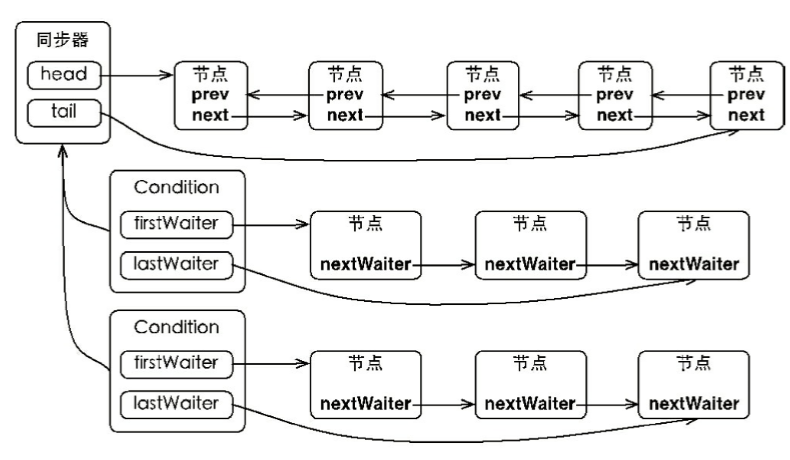

# JUC 介绍

整体结构图


从图中我们可以很明显的了解到，JUC的整个实现的基础是VAS+volatile的读写功能来实现的。

有关于CAS，volatile的详解请看：

> [CAS](CAS.md)
>
> [并发编程中的重要概念](并发编程中的重要概念.md) 介绍了volatile
>
> [一文解决内存屏障](一文解决内存屏障.md) 介绍了volatile 相关更详细的补充说明

# 原子变量类

## 分类

基本类型：

* AtomicBoolean 
* AtomicInteger
* AtomicLong
* AtomicIntegerFieldUpdater
* AtomicLongFieldUpdater

[1.8 新增的几个 处理类](Atomic/1.8新增.md)

* LongAdder 高并发情况下比AtomicLong的表现要好，但是不能完全替代AtomicLong，具体的看[为什么要引入LongAdder](Atomic/1.8新增.md )
* LongAccumulator
* DoubleAdder
* DoubleAccumulator

reference: 

* [AtomicReference](Atomic/AtomicReference.md)
* [AtomicIntegerFieldUpdater](Atomic/AtomicIntegerFieldUpdater.md)
* [AtomicStampedReference](Atomic/AtomicStampedReference.md)
* [AtomicMarkableReference](Atomic/AtomicMarkableReference.md)

数组：

* AtomicIntegerArray 
* AtomicLongArray
* AtomicReferenceArray

## lazySet

**我们很多原子类中都有 lazySet这样的方法，lazy 就是在不需要让共享变量的修改立刻让其他线程可见的时候，以设置普通变量的方式来修改该变量，以减少不必要的内存屏障，从而提高程序执行的效率**

## 实现原理

这些类的实现在 java.util.concurrent.atomic包下。

我们java中并发下实现原子操作可以使用 **锁** 或 **通过循环CAS来实现原子操作（自旋）**,而我们的原子变量类都是使用的CAS。

举例我们来看看基本类型的原子变量AtomicLong的源代码，主要的字段：value字段，和valueOffset字段。下面源码中有注释

```java
public class AtomicLong extends Number implements java.io.Serializable {
    private static final long serialVersionUID = 1927816293512124184L;

    // setup to use Unsafe.compareAndSwapLong for updates
    private static final Unsafe unsafe = Unsafe.getUnsafe();
    // 这个值是我们数据在内存中的偏移量，查询值得时候通过这个找到内存中保存的value得值
    private static final long valueOffset;

    /**
     * Records whether the underlying JVM supports lockless
     * compareAndSwap for longs. While the Unsafe.compareAndSwapLong
     * method works in either case, some constructions should be
     * handled at Java level to avoid locking user-visible locks.
     */
    static final boolean VM_SUPPORTS_LONG_CAS = VMSupportsCS8();

    /**
     * Returns whether underlying JVM supports lockless CompareAndSet
     * for longs. Called only once and cached in VM_SUPPORTS_LONG_CAS.
     */
    private static native boolean VMSupportsCS8();

    static {
        try {
            valueOffset = unsafe.objectFieldOffset
                (AtomicLong.class.getDeclaredField("value"));
        } catch (Exception ex) { throw new Error(ex); }
    }
	// 使用volatile存储我们的实际的值，保证了数据的可见性
    private volatile long value;

    /**
     * Creates a new AtomicLong with the given initial value.
     *
     * @param initialValue the initial value
     */
    public AtomicLong(long initialValue) {
        value = initialValue;
    }

    /**
     * Creates a new AtomicLong with initial value {@code 0}.
     */
    public AtomicLong() {
    }
    // 剩下的省略掉
}
```

然后我们再来看看一个修改数据得方法具体的实现，别的放大都大同小异就不做过多说明

```java
 /**
     * Atomically increments by one the current value.
     *
     * @return the previous value
     */
    public final long getAndIncrement() {
        return unsafe.getAndAddLong(this, valueOffset, 1L);
    }
```

```java
 public final long getAndAddLong(Object var1, long var2, long var4) {
        long var6;
        do {
            // 通过实例得引用var1 + 偏移量var2 获取现在得值，这样获取到的是内存中最新的值，是满足可见性的
            var6 = this.getLongVolatile(var1, var2);
            // 然后这里在进行cas操作来实现变量的数据更新 var6 旧值，var6 + var4新值
        } while(!this.compareAndSwapLong(var1, var2, var6, var6 + var4));
        return var6;
    }
```

# Locks(锁)

## Lock接口

首先我们看一下java中Lock接口的定义:

| 接口                                                         | 描述                                                         |
| ------------------------------------------------------------ | ------------------------------------------------------------ |
| void lock()                                                  | 调用该方法阻塞式获取锁，当锁获得后从该方法返回继续执行，如果为获取要一直等到获取到为止 **对应AQS的acquire/acquireShared方法** |
| void lockInterruptibly() throws InterruptedException         | 获取过程和lock方法基本相同，不过新增了可响应线程中断的功能。**对应AQS的acquireInterruptibly/acquireSharedInterruptibly方法** |
| boolean tryLock()                                            | 非阻塞获取锁，该方法立即返回，获取到锁就是true,反之false     |
| boolean tryLock(long time, TimeUnit unit) throws InterruptedException; | 在超时时间内获取锁,该方法在下面三种情况返回：<br />1.超时时间内获取到锁返回`true`<br/>2.超时时间结束未获取到锁返回`false`<br/>3.超时时间内线程被中断，返回false<br/>**调用AQS的tryAcquireNanos/tryAcquireSharedNanos方法** |
| void unlock();                                               | 释放锁 **调用AQS的release/releaseShared方法**                |
| Condition newCondition();                                    | 获取等待通知（相当于wiat()/）,该组件与当前锁绑定，当前线程只有获得了锁，才能使用和该锁绑定的这个组件await()&signal()方法，功能和 wait() , notify(),notifyAll() 相同，不过Condition提供了比他们更多的功能 |

**Lock接口的实现基本都是通过聚合了一个同步器(AbstractQueuedSynchronizer)的子类来完成线程访问控制的。**

## Condition接口

### 接口介绍

| 接口                                                         | 描述                                                         |
| ------------------------------------------------------------ | ------------------------------------------------------------ |
| [void await() throws InterruptedException;](#await())        | 使当前线程进入wait状态，直到被通知signal()/signalAll()/中断，其中被signal，唤醒之后，要直到获取到该Condition关联的锁，才能从该方法返回 |
| void awaitUninterruptibly();                                 | 和await方法类似，不过不响应中断                              |
| [long awaitNanos(long nanosTimeout) throws InterruptedException;](#awaitNanos) | 和await方法类似增加了超时机制                                |
| boolean await(long time, TimeUnit unit) throws InterruptedException; | 和await方法类似增加了超时机制                                |
| boolean awaitUntil(Date deadline) throws InterruptedException; | 和await方法类似增加了超时机制（一直到某个时间）              |
| void signal();                                               | 相当于notify()                                               |
| void signalAll();                                            | 相当于notifyAll()                                            |

> 关于 wait() , notify(),notifyAll()  可以看[并发编程中的重要概念](../并发编程中的重要概念.md)13.2 节内容
>
> [Lock源码](Lock源码.md)
>
> [Condition源码](Condition源码.md)
>
> 抛出该 InterruptedException 的方法，如果那个线程的中断状态被设置过，这个异常的处理机制中会重置该线程的中断状态。也就是interrupted的值会被重置

### 结构图



### object和JUC的Lock的监视器模型对比

| object       | juc                                                     |
| ------------ | ------------------------------------------------------- |
| 一个同步队列 | 一个同步队列                                            |
| 一个等待队列 | 多个等待队列（因为可以newCondition()产生多个Condition） |

### await()

```java
 public final void await() throws InterruptedException {
            if (Thread.interrupted())
                throw new InterruptedException();
		     // 添加到等待队列尾部
            Node node = addConditionWaiter();
     		// 释放锁
            int savedState = fullyRelease(node);
            int interruptMode = 0;
            while (!isOnSyncQueue(node)) {
                // 进入等待状态，等待唤醒
                LockSupport.park(this);
                if ((interruptMode = checkInterruptWhileWaiting(node)) != 0)
                    break;
            }
            if (acquireQueued(node, savedState) && interruptMode != THROW_IE)
                interruptMode = REINTERRUPT;
            if (node.nextWaiter != null) // clean up if cancelled
                unlinkCancelledWaiters();
            if (interruptMode != 0)
                reportInterruptAfterWait(interruptMode);
        }
```

### awaitNanos

```java
public final long awaitNanos(long nanosTimeout)
        throws InterruptedException {
    if (Thread.interrupted())// 响应中断
        throw new InterruptedException();
    // 添加到等待队列尾部
    Node node = addConditionWaiter();
    long savedState = fullyRelease(node);
    final long deadline = System.nanoTime() + nanosTimeout;
    int interruptMode = 0;
    while (!isOnSyncQueue(node)) {
        if (nanosTimeout <= 0L) {
            transferAfterCancelledWait(node);
            break;
        }
        if (nanosTimeout >= spinForTimeoutThreshold)
            LockSupport.parkNanos(this, nanosTimeout);
        if ((interruptMode = checkInterruptWhileWaiting(node)) != 0)
            break;
        nanosTimeout = deadline - System.nanoTime();
    }
    if (acquireQueued(node, savedState) && interruptMode != THROW_IE)
        interruptMode = REINTERRUPT;
    if (node.nextWaiter != null)
        unlinkCancelledWaiters();
    if (interruptMode != 0)
        reportInterruptAfterWait(interruptMode);
    return deadline - System.nanoTime();
}
```

### signal()

```java
public final void signal() {
    // 检查当前显示是获取锁的线程
    if (!isHeldExclusively())
        throw new IllegalMonitorStateException();
    Node first = firstWaiter;
    if (first != null)
        doSignal(first);// 唤醒condition的等待队列中的第一个线程
}

private void doSignal(Node first) {
    do {
        if ( (firstWaiter = first.nextWaiter) == null)
            lastWaiter = null;
        first.nextWaiter = null;
    } while (!transferForSignal(first) &&
             (first = firstWaiter) != null);
}

final boolean transferForSignal(Node node) {
    /*
     * If cannot change waitStatus, the node has been cancelled.
     */
    // 首先将该节点condition节点修改成AQS的同步队列中的节点类型
    if (!compareAndSetWaitStatus(node, Node.CONDITION, 0))
        return false;

    /*
     * Splice onto queue and try to set waitStatus of predecessor to
     * indicate that thread is (probably) waiting. If cancelled or
     * attempt to set waitStatus fails, wake up to resync (in which
     * case the waitStatus can be transiently and harmlessly wrong).
     */
    // 将节点加入到 同步队列的尾部，返回值p 是前置节点
    Node p = enq(node);
    int ws = p.waitStatus;
    // 如果它的前置节点不是 SIGNAL 状态的，那么需要使用CAS尝试修改成这样的，因为当前节点需要前置节点通知唤醒，如果失败，那就直接唤醒当前线程节点
    if (ws > 0 || !compareAndSetWaitStatus(p, ws, Node.SIGNAL))
        LockSupport.unpark(node.thread);
    return true;
}

```

### signalAll()

```java
public final void signalAll() {
    if (!isHeldExclusively())
        throw new IllegalMonitorStateException();
    Node first = firstWaiter;
    if (first != null)
        doSignalAll(first);
}

private void doSignalAll(Node first) {
    lastWaiter = firstWaiter = null;
    do {
        Node next = first.nextWaiter;
        first.nextWaiter = null;
        transferForSignal(first);
        first = next;
    } while (first != null);
}
```

## LockSupport

在将AQS之前我们先来了解一下 LockSupport 工具 。在JUC中当我们需要阻塞或唤醒一个线程的时候，都会使用到LockSupport工具来完成相关工作，它定义一组公共的static方法，来实现最基本的线程阻塞和唤醒功能。

| 方法名                                      | 描述                                                         |
| ------------------------------------------- | ------------------------------------------------------------ |
| public static void park()                   | 阻塞当前线程，只有调用**upark**方法或者当前线程被中断，才能从park方法处返回 |
| public static void parkNanos(long nanos)    | 在**park**基础上增加了超时机制                               |
| public static void parkUntil(long deadline) | 阻塞当前线程直到deadline时间（是1970年到deadline的毫秒数）   |
| public static void unpark(Thread thread)    | 唤醒处于阻塞状态的线程                                       |

## AQS(AbstractQueuedLongSynchronizer)

[AQS](AQS.md)

## ReentrantLock

是一个可重入的独占式同步锁，可以替代synchronized来使用，既然是锁，那么它当然要实现Lock接口中的各种类型接口了。下面我们回分析这些接口怎么用它内置的同步器来实现的

**ReentrantLock支持公平锁和非公平锁这两种同步器**  

### 使用方式

```java
package com.example.concurrent.testall;

import java.util.concurrent.TimeUnit;
import java.util.concurrent.locks.ReentrantLock;

public class ReentrantLockTest {
    public static ReentrantLock nonFairLock = new ReentrantLock();//参数默认false，不公平锁
    private ReentrantLock lock = new ReentrantLock(true); //公平锁

    /**
     * 使用场景:(1)比如一个定时任务,第一次定时任务未完成,重复发起了第二次,直接返回flase;
     * (2)用在界面交互时点击执行较长时间请求操作时，防止多次点击导致后台重复执行
     */

    public static void tryLockTest() {
        if (nonFairLock.tryLock()) {
            //如果已经被lock，则立即返回false不会等待，
            //达到忽略操作的效果 ,当执行1000线程时，有些未获得对象锁的线程，会自动跳过
            try {
                //操作
                System.out.println("aaaa" + Thread.currentThread().getName());
            } finally {
                nonFairLock.unlock();
            }


        }
    }

    /**
     * 使用场景:(1)同步操作 类似于synchronized  如果被其它资源锁定，会在此等待锁释放，达到暂停的效果
     * ReentrantLock存在公平锁与非公平锁  而且synchronized都是公平的
     */
    public static void lockTest() {
        try {
            nonFairLock.lock(); //如果被其它资源锁定，会在此等待锁释放，达到暂停的效果
            //操作
            System.out.println("aaaa" + Thread.currentThread().getName());


        } finally {
            nonFairLock.unlock();
        }
    }


    /**
     * 使用场景:(1)如果发现该操作正在执行,等待一段时间，如果规定时间未得到锁,放弃。防止资源处理不当，线程队列溢出
     */
    public static void trylockTimeTest() {
        try {
            if (nonFairLock.tryLock(5, TimeUnit.SECONDS)) {  //如果已经被lock，尝试等待5s，看是否可以获得锁，如果5s后仍然无法获得锁则返回false继续执行
                try {
                    //操作
                    System.out.println("aaaa" + Thread.currentThread().getName());
                    //等待10S则只有一个可以访问
                    Thread.sleep(10000);
                } finally {
                    nonFairLock.unlock();
                }
            }
        } catch (InterruptedException e) {
            e.printStackTrace(); //当前线程被中断时(interrupt)，会抛InterruptedException
        }


    }

    /**
     * 使用场景:(1)中断正在进行的操作立刻释放锁继续下一操作.比如 取消正在同步运行的操作，来防止不正常操作长时间占用造成的阻塞
     */
    public static void lockInterruptTest() {
        try {
            nonFairLock.lockInterruptibly();
            //操作
            System.out.println("aaaa" + Thread.currentThread().getName());
        } catch (InterruptedException e) {
            e.printStackTrace();
        } finally {
            nonFairLock.unlock();
        }
    }

    public static void main(String[] args) {
        //同时启动1000个线程，去进行i++计算，看看实际结果
        for (int i = 0; i < 10; i++) {
         Thread a =    new Thread(new Runnable() {
                @Override
                public void run() {
                    ReentrantLockTest.lockInterruptTest();
                }
            });
         a.start();
        }
        // 调用线程的 interrupt();  中断线程
    }
}
```

### 基础源码

**从代码可以看出默认非公平模式**

```java
public ReentrantLock() {
        sync = new NonfairSync();
}
public ReentrantLock(boolean fair) {
        sync = fair ? new FairSync() : new NonfairSync();
}
```

**同步器基类**

```java
/**
 * ReentrantLock 中的组合的同步器的基类，会存在FairSync，和 NonfairSync 两个实现类
 */
abstract static class Sync extends AbstractQueuedSynchronizer {
    private static final long serialVersionUID = -5179523762034025860L;

    /**
	 * FairSync，和 NonfairSync 两个实现类 会实现这个方法
     */
    abstract void lock();

    /**
     * 非公平锁的获取锁的实现
     */
    final boolean nonfairTryAcquire(int acquires) {
        final Thread current = Thread.currentThread();
        int c = getState();
        if (c == 0) {// 判断当前锁是否已被某线程获取
            if (compareAndSetState(0, acquires)) {
                setExclusiveOwnerThread(current);
                return true;
            }
        }
        else if (current == getExclusiveOwnerThread()) {// 如果获取到该锁的是当前线程，执行可重入逻辑
            int nextc = c + acquires; 
            if (nextc < 0) // overflow
                throw new Error("Maximum lock count exceeded");
            setState(nextc);
            return true;
        }
        return false;
    }
	/**
	 * 独占式：释放锁
	 */
    protected final boolean tryRelease(int releases) {
        int c = getState() - releases;
        if (Thread.currentThread() != getExclusiveOwnerThread())
            throw new IllegalMonitorStateException();
        boolean free = false;
        if (c == 0) {
            free = true;
            setExclusiveOwnerThread(null);// 将锁当前的独占锁置为 null
        }
        setState(c);
        return free;
    }
	// 是否是当前线程独占了该锁
    protected final boolean isHeldExclusively() {
        return getExclusiveOwnerThread() == Thread.currentThread();
    }
	
    final ConditionObject newCondition() {
        return new ConditionObject();
    }

    // Methods relayed from outer class

    final Thread getOwner() {
        return getState() == 0 ? null : getExclusiveOwnerThread();
    }

    final int getHoldCount() {
        return isHeldExclusively() ? getState() : 0;
    }

    final boolean isLocked() {
        return getState() != 0;
    }

    /**
     * Reconstitutes the instance from a stream (that is, deserializes it).
     */
    private void readObject(java.io.ObjectInputStream s)
        throws java.io.IOException, ClassNotFoundException {
        s.defaultReadObject();
        setState(0); // reset to unlocked state
    }
}
```

### 公平锁FairSync

```java
static final class FairSync extends Sync {
    private static final long serialVersionUID = -3000897897090466540L;

    final void lock() {
        // AQS定义的独占式获取同步状态的模板方法
        acquire(1);
    }

    /**
     * Fair version of tryAcquire.  Don't grant access unless
     * recursive call or no waiters or is first.
     */
    protected final boolean tryAcquire(int acquires) {
        final Thread current = Thread.currentThread();
        int c = getState();
        if (c == 0) {
            // hasQueuedPredecessors 判断锁的等待队列中是否有在等待的线程节点存在，如果有那就直接获取锁失败，会在AQS中被加入到等待队列的尾部，具体的就是AQS的acquire方法，反之，可以尝试使用CAS来修改state，修改成功就获取锁成功，设置该同步器的独占线程为当前线程，失败证明这时候存在竞争，并且当前线程竞争失败了。
            if (!hasQueuedPredecessors() &&
                compareAndSetState(0, acquires)) {
                setExclusiveOwnerThread(current);
                return true;
            }
        }
        else if (current == getExclusiveOwnerThread()) {// 这部代码实现了支持可重入
            int nextc = c + acquires;
            if (nextc < 0)
                throw new Error("Maximum lock count exceeded");
            setState(nextc);
            return true;
        }
        return false;
    }
}
```

### 非公平锁NonFairSync

```java
static final class NonfairSync extends Sync {
    private static final long serialVersionUID = 7316153563782823691L;
    
    final void lock() {
        // 这里也体现了非公平性获取的特性，不管该同步器的等待队列中是否存在正在等待的节点，直接尝试获取
        if (compareAndSetState(0, 1))
            setExclusiveOwnerThread(Thread.currentThread());
        else
            acquire(1);
    }
	/**
	 * acquire是AQS的独占式获取同步锁的模板方法
	 */
    protected final boolean tryAcquire(int acquires) {
        return nonfairTryAcquire(acquires);
    }
}
```

### ReentrantLock对Lock的实现

这里我这要说一trylocka方法，因为别的接口实现，都是和AQS定义的那些对应的模板方法相对应的，没有什么说明的必要

* **tryLock** 

  ```java
  public boolean tryLock() {
      return sync.nonfairTryAcquire(1);// 由于该接口是非阻塞获取锁，需要立即返回，获取到锁就是true,反之false 所以这里采取了直接使用非公平的方式来实现，大大的减少了被阻塞的可能，更加符合这个接口的定义
  }
  ```

### fair&NoFiar对比

* 非公平锁在使用时，由于使用的是抢占模式（谁抢到是谁的），这样就会避免公平性锁的问题，**能更充分的利用cpu**,**以及减少线程上下文切换带来的cpu损耗**，不过也会带来问题：**会导致线程饥饿现象**
* 公平模式，基于同步器的FIFO队列，在同步器（使用FIFO队列）中会转到等待状态，直到他的前驱节点唤醒它，这个唤醒到线程运行存在着较大延迟，带来了更多的线程上下文切换**导致对cpu的利用不够充足，以及上下文切换带来的性能损耗，也就是说会牺牲系统的吞吐量**

## ReadWriteLock 

实现类 ReentrantReadWriteLock 

## 使用例子

```java
public class Cache {    	
    static Map<String, Object> map = new HashMap<String, Object>();    
    static ReentrantReadWriteLock rwl = new ReentrantReadWriteLock();    
    static Lock r = rwl.readLock();    
    static Lock w = rwl.writeLock();    
    // 获取一个key对应的value    
    public static final Object get(String key) {            
        r.lock();            
        try {                    
            return map.get(key);            
        } finally {                    
            r.unlock();            
        }    
    }    
    // 设置key对应的value，并返回旧的value    
    public static final Object put(String key, Object value) {
        w.lock();            
        try {                    
            return map.put(key, value);            
        } finally {                    
            w.unlock();            
        }    
    }
    // 清空所有的内容    
    public static final void clear() {           
        w.lock();           
        try {                  
            map.clear();          
        } finally {                 
            w.unlock();           
        }    
    } 
}
```

### 读写锁中的互斥关系

* 读写互斥

* 写写互斥 

### 公平锁和非公平锁的同步器

初始化：默认使用非公平锁

```java
public ReentrantReadWriteLock() {
    this(false);
}

public ReentrantReadWriteLock(boolean fair) {
    sync = fair ? new FairSync() : new NonfairSync();
    readerLock = new ReadLock(this);
    writerLock = new WriteLock(this);
}
```

```java
/**
 * Nonfair version of Sync
 */
static final class NonfairSync extends Sync {
    private static final long serialVersionUID = -8159625535654395037L;
    final boolean writerShouldBlock() {
        return false; // 非公平模式下，写锁总是抢占模式
    }
    final boolean readerShouldBlock() {
        // 非公平模式下，读锁需要等待的情况只有，这时候等待的节点中首节点是一个独占式的写锁节点
        return apparentlyFirstQueuedIsExclusive();
    }
}

/**
 * Fair version of Sync
 * 公平模式下，就和 reentrantlock里面的公平模式下的方法一样了，只要等待队列中存在节点，那么就需要按照 
 * 先后顺序来，这样才能保证公平
 */
static final class FairSync extends Sync {
    private static final long serialVersionUID = -2274990926593161451L;
    final boolean writerShouldBlock() {
        return hasQueuedPredecessors();
    }
    final boolean readerShouldBlock() {
        return hasQueuedPredecessors();
    }
}
```

### 读写锁的基类同步器

```java
abstract static class Sync extends AbstractQueuedSynchronizer {
    private static final long serialVersionUID = 6317671515068378041L;

    /*
     * Read vs write count extraction constants and functions.
     * Lock state is logically divided into two unsigned shorts:
     * The lower one representing the exclusive (writer) lock hold count,
     * and the upper the shared (reader) hold count.
     */
	
    static final int SHARED_SHIFT   = 16;
    // 2^16 :shared 单位，共享锁的技术单位。占用同步状态字段state的高于16位的位，记录共享锁的被获取的数量，使用sharedCount方法获取共享锁的被获取的数量
    static final int SHARED_UNIT    = (1 << SHARED_SHIFT);
    // 2^16-1 :最大数量 锁计数器读锁/写锁分别的最大持有锁数，写锁就是重入次数限制，读锁就是获取锁的相乘数量+重入次数的总数限制
    static final int MAX_COUNT      = (1 << SHARED_SHIFT) - 1;
    // 2^16-1 :低16位做为写锁的计数，由于写锁是独占锁，所以计数的目的是记录重入次数，使用exclusiveCount方法获取该数值
    static final int EXCLUSIVE_MASK = (1 << SHARED_SHIFT) - 1;

    /** 返回当前共享锁的被获取过的次数  */
    static int sharedCount(int c)    { return c >>> SHARED_SHIFT; }
    /** 返回当前获取到写锁的线程的重入次数 */
    static int exclusiveCount(int c) { return c & EXCLUSIVE_MASK; }

    /**
     * 用来做每一个线程的读锁重入次数计数器,使用ThreadLocalHoldCounter这个ThreadLocal的子类维护， 
     */
    static final class HoldCounter {
        int count = 0;
        // Use id, not reference, to avoid garbage retention
        final long tid = getThreadId(Thread.currentThread());
    }

    
    static final class ThreadLocalHoldCounter
        extends ThreadLocal<HoldCounter> {
        public HoldCounter initialValue() {
            return new HoldCounter();
        }
    }
  
    private transient ThreadLocalHoldCounter readHolds;
	
    private transient HoldCounter cachedHoldCounter;

   	// 第一个read线程
    private transient Thread firstReader = null;
    private transient int firstReaderHoldCount;

    Sync() {
        readHolds = new ThreadLocalHoldCounter();
        setState(getState()); // ensures visibility of readHolds，使用volatile的读写保证上面的 readHolds 的可见性
    }

    /*
     * Acquires and releases use the same code for fair and
     * nonfair locks, but differ in whether/how they allow barging
     * when queues are non-empty.
     * 获取和释放对fair和nonfair锁使用相同的代码，但在队列为非空时它们是否/如何允许bargging方面有所
     * 不同。
     */
    /**
     * 读锁的时候，公平锁，非公平锁的实现区别就在这里
     */
    abstract boolean readerShouldBlock();

    /**
     * 写锁的时候，公平锁，非公平锁的实现区别就在这里
     */
    abstract boolean writerShouldBlock();

	/**
	 * 写锁的独占式加锁方式就在这了
	 */
    protected final boolean tryAcquire(int acquires) {
        Thread current = Thread.currentThread();
        int c = getState();
        int w = exclusiveCount(c);
        if (c != 0) {
            // (Note: if c != 0 and w == 0 then shared count != 0)
            // c !=0 and w == 0 此时没有写锁 那么就是有读锁，读写互斥，很显然线程应该进入同步队列
            // c !=0 and w != 0 此时是写锁 current != getExclusiveOwnerThread() 但是不是当前线程持有，就直接返回false
            if (w == 0 || current != getExclusiveOwnerThread())
                return false;
            //重入 超过最大锁计数 抛出异常
            if (w + exclusiveCount(acquires) > MAX_COUNT)
                throw new Error("Maximum lock count exceeded");
            // Reentrant acquire 可重入
            setState(c + acquires);
            return true;
        }
        // writerShouldBlock 决定了当前是公平还是非公平，由初始化时选择的模式决定，和ReemrantLock 是一样的
        if (writerShouldBlock() ||
            !compareAndSetState(c, c + acquires))
            return false;
        setExclusiveOwnerThread(current);// 设置独占线程
        return true;
    }
    
    /**
	 * 写锁的释放，使用该方法，因为对应的是独占式模式
	 *
	 */
    protected final boolean tryRelease(int releases) {
        // 首先判断释放锁的线程是不是该锁当前的独占线程，只有当前的独占线程（获取到所得线程）才能释放
        // 锁
        if (!isHeldExclusively())
            throw new IllegalMonitorStateException();
        int nextc = getState() - releases;
        boolean free = exclusiveCount(nextc) == 0;
        if (free)
            setExclusiveOwnerThread(null);
        setState(nextc);
        return free;
    }
    /**
	 * 共享式：读锁的获取
	 */ 
    protected final int tryAcquireShared(int unused) {
        Thread current = Thread.currentThread();
        int c = getState();
        // 此时 exclusiveCount(c) != 0 存在写锁，且持有锁的线程不是当前线程
        if (exclusiveCount(c) != 0 &&
            getExclusiveOwnerThread() != current)
            return -1;
        int r = sharedCount(c);// 获取当前被获取的读锁的数量(获取到的线程数的重入计数的总和）
        // readerShouldBlock 有初始化的时候选择的公平/非公平模式决定，判断方法和ReemrantLock相同
        // 并且获得锁的线程数量不能超过 MAX_COUNT 这个值也就是共享锁的最大共享次数，而不是最大贡献线程数，应为重入也会计算在内
        if (!readerShouldBlock() &&
            r < MAX_COUNT &&
            compareAndSetState(c, c + SHARED_UNIT)) {
            if (r == 0) {
                firstReader = current;// 记录当前并发下这是第一个获取读锁的线程
                firstReaderHoldCount = 1;// 记录该线程的重入次数
            } else if (firstReader == current) {
                firstReaderHoldCount++; //为firstReader 的重入计数
            } else {
                HoldCounter rh = cachedHoldCounter;
                if (rh == null || rh.tid != getThreadId(current))
                    // 缓存当前尝试获取锁的线程的重入计数器
                    cachedHoldCounter = rh = readHolds.get();
                else if (rh.count == 0)
                    readHolds.set(rh);
                rh.count++;// 增加重入计数
            }
            return 1;
        }
        return fullTryAcquireShared(current);
    }
    
    /**
     * Full version of acquire for reads, that handles CAS misses
     * and reentrant reads not dealt with in tryAcquireShared.
     * 用于处理CAS未命中和tryAcquireShared中未处理的可重入读取的完整版本的 acquire for reads
     */
    final int fullTryAcquireShared(Thread current) {
        /*
         * This code is in part redundant with that in
         * tryAcquireShared but is simpler overall by not
         * complicating tryAcquireShared with interactions between
         * retries and lazily reading hold counts.
         */
        HoldCounter rh = null;
        for (;;) {
            int c = getState();
             // 此时 exclusiveCount(c) != 0 存在写锁
            if (exclusiveCount(c) != 0) {
                // 持有锁的线程不是当前线程
                if (getExclusiveOwnerThread() != current)
                    return -1;
                // else we hold the exclusive lock; blocking here
                // would cause deadlock.
            } else if (readerShouldBlock()) {// 如果此时应该进入等待队列 
                // Make sure we're not acquiring read lock reentrantly
                // 这里的所有代码都是为了在这样的情况下确保我们没有以可重入方式获取读锁
                if (firstReader == current) {
                    // assert firstReaderHoldCount > 0;
                } else {
                    if (rh == null) {
                        rh = cachedHoldCounter;
                        if (rh == null || rh.tid != getThreadId(current)) {
                            rh = readHolds.get();
                            if (rh.count == 0)
                                readHolds.remove();
                        }
                    }
                    if (rh.count == 0)
                        return -1;
                }
            }
            if (sharedCount(c) == MAX_COUNT)
                throw new Error("Maximum lock count exceeded");
            if (compareAndSetState(c, c + SHARED_UNIT)) {// 获取锁成功
                if (sharedCount(c) == 0) {
                    firstReader = current;// 记录当前并发下这是第一个获取读锁的线程
                    firstReaderHoldCount = 1;// 记录该线程的重入次数
                } else if (firstReader == current) {
                    firstReaderHoldCount++;//为firstReader的重入计数
                } else {
                    if (rh == null)
                        rh = cachedHoldCounter;
                    if (rh == null || rh.tid != getThreadId(current))
                        rh = readHolds.get();
                    else if (rh.count == 0)
                        readHolds.set(rh);
                    rh.count++;// 增加重入计数
                    cachedHoldCounter = rh; // 缓存当前尝试获取锁的线程的重入计数器
                }
                return 1;
            }
        }
    }
    
	/**
	 * 共享式：读锁的释放
	 */
    protected final boolean tryReleaseShared(int unused) {
        Thread current = Thread.currentThread();
        if (firstReader == current) {
            // assert firstReaderHoldCount > 0;
            if (firstReaderHoldCount == 1)
                firstReader = null;
            else
                firstReaderHoldCount--;
        } else {
            // 获取当前线程的重入计数器
            HoldCounter rh = cachedHoldCounter;
            if (rh == null || rh.tid != getThreadId(current))
                rh = readHolds.get();
            int count = rh.count;//当前线程的重入次数
            if (count <= 1) {
                readHolds.remove();// 如果为重入，直接删除该重入计数器
                if (count <= 0)
                    throw unmatchedUnlockException();
            }
            --rh.count;// 较少重入计数
        }
        // 这里才是释放锁的逻辑
        for (;;) {
            int c = getState();
            int nextc = c - SHARED_UNIT;
            if (compareAndSetState(c, nextc))
                // Releasing the read lock has no effect on readers,
                // but it may allow waiting writers to proceed if
                // both read and write locks are now free.
                return nextc == 0;
        }
    }

    private IllegalMonitorStateException unmatchedUnlockException() {
        return new IllegalMonitorStateException(
            "attempt to unlock read lock, not locked by current thread");
    }

    /**
     * 这是写锁为了实现Lock接口的tryLock方法提供的，关于tryLock方法的定义可以看Lock接口相关定义
     * 代码很简单不做注释了
     */
    final boolean tryWriteLock() {
        Thread current = Thread.currentThread();
        int c = getState();
        if (c != 0) {
            int w = exclusiveCount(c);
            if (w == 0 || current != getExclusiveOwnerThread())
                return false;
            if (w == MAX_COUNT)
                throw new Error("Maximum lock count exceeded");
        }
        if (!compareAndSetState(c, c + 1))
            return false;
        setExclusiveOwnerThread(current);
        return true;
    }

    /**
     * 这是读锁为了实现Lock接口的tryLock方法提供的，关于tryLock方法的定义可以看Lock接口相关定义
	 * 
     */
    final boolean tryReadLock() {
        Thread current = Thread.currentThread();
        for (;;) {
            int c = getState();
            if (exclusiveCount(c) != 0 &&
                getExclusiveOwnerThread() != current)
                return false;
            int r = sharedCount(c);
            if (r == MAX_COUNT)
                throw new Error("Maximum lock count exceeded");
            if (compareAndSetState(c, c + SHARED_UNIT)) {
                if (r == 0) {
                    firstReader = current;
                    firstReaderHoldCount = 1;
                } else if (firstReader == current) {
                    firstReaderHoldCount++;
                } else {
                    HoldCounter rh = cachedHoldCounter;
                    if (rh == null || rh.tid != getThreadId(current))
                        cachedHoldCounter = rh = readHolds.get();
                    else if (rh.count == 0)
                        readHolds.set(rh);
                    rh.count++;
                }
                return true;
            }
        }
    }

    protected final boolean isHeldExclusively() {
        // While we must in general read state before owner,
        // we don't need to do so to check if current thread is owner
        return getExclusiveOwnerThread() == Thread.currentThread();
    }

    final int getReadLockCount() {
        return sharedCount(getState());
    }

    final boolean isWriteLoked() {
        return exclusiveCount(getState()) != 0;
    }
	// 获取当前写锁的重入次数
    final int getWriteHoldCount() {
        return isHeldExclusively() ? exclusiveCount(getState()) : 0;
    }
	// 获取当前读锁的重入次数
    final int getReadHoldCount() {
        if (getReadLockCount() == 0)
            return 0;

        Thread current = Thread.currentThread();
        if (firstReader == current)
            return firstReaderHoldCount;

        HoldCounter rh = cachedHoldCounter;
        if (rh != null && rh.tid == getThreadId(current))
            return rh.count;

        int count = readHolds.get().count;
        if (count == 0) readHolds.remove();
        return count;
    }

    /**
     * Reconstitutes the instance from a stream (that is, deserializes it).
    */
    private void readObject(java.io.ObjectInputStream s)
        throws java.io.IOException, ClassNotFoundException {
        s.defaultReadObject();
        readHolds = new ThreadLocalHoldCounter();
        setState(0); // reset to unlocked state
    }
  
   final int getCount() { return getState(); }
  
 }
```

### 该锁的优缺点介绍

在读多写少的情况下很容易出现**写线程饥饿**，虽然使用公平模式可以一定程度缓解该问题，但是公平策略是以牺牲系统吞吐量为代价的

## StampedLock

前面介绍的`ReadWriteLock`可以解决多线程同时读写问题

如果我们深入分析`ReadWriteLock`，会发现它有个潜在的问题：如果有线程正在读，写线程需要等待所有读线程释放锁后才能获取写锁，即读的过程中不允许写，这是一种悲观的读锁。

要进一步提升并发执行效率，Java 8引入了新的读写锁：`StampedLock`。

`StampedLock`和`ReadWriteLock`相比，改进之处在于：读的过程中也允许获取写锁后写入！这样一来，我们读的数据就可能不一致，所以，需要一点额外的代码来判断读的过程中是否有写入，这种读锁是一种乐观锁。

乐观锁的意思就是乐观地估计读的过程中大概率不会有写入，因此被称为乐观锁。反过来，悲观锁则是读的过程中拒绝有写入，也就是写入必须等待。显然乐观锁的并发效率更高，但一旦有小概率的写入导致读取的数据不一致，需要能检测出来，再读一遍就行。示例代码

```java
public class Point {
    private final StampedLock stampedLock = new StampedLock();

    private double x;
    private double y;

    public void move(double deltaX, double deltaY) {
        long stamp = stampedLock.writeLock(); // 获取写锁
        try {
            x += deltaX;
            y += deltaY;
        } finally {
            stampedLock.unlockWrite(stamp); // 释放写锁
        }
    }

    public double distanceFromOrigin() {
        long stamp = stampedLock.tryOptimisticRead(); // 获得一个乐观读锁
        // 注意下面两行代码不是原子操作
        // 假设x,y = (100,200)
        double currentX = x;
        // 此处已读取到x=100，但x,y可能被写线程修改为(300,400)
        double currentY = y;
        // 此处已读取到y，如果没有写入，读取是正确的(100,200)
        // 如果有写入，读取是错误的(100,400)
        if (!stampedLock.validate(stamp)) { // 检查乐观读锁后是否有其他写锁发生
            stamp = stampedLock.readLock(); // 获取一个悲观读锁
            try {
                currentX = x;
                currentY = y;
            } finally {
                stampedLock.unlockRead(stamp); // 释放悲观读锁
            }
        }
        return Math.sqrt(currentX * currentX + currentY * currentY);
    }
}
```

和`ReadWriteLock`相比，写入的加锁是完全一样的，不同的是读取。注意到首先我们通过`tryOptimisticRead()`获取一个乐观读锁，并返回版本号。接着进行读取，读取完成后，我们通过`validate()`去验证版本号，如果在读取过程中没有写入，版本号不变，验证成功，我们就可以放心地继续后续操作。如果在读取过程中有写入，版本号会发生变化，验证将失败。在失败的时候，我们再通过获取悲观读锁再次读取。由于写入的概率不高，程序在绝大部分情况下可以通过乐观读锁获取数据，极少数情况下使用悲观读锁获取数据。

可见，**`StampedLock`把读锁细分为乐观读和悲观读，能进一步提升并发效率。但这也是有代价的：一是代码更加复杂，二是`StampedLock`是不可重入锁，不能在一个线程中反复获取同一个锁。**

`StampedLock`还提供了更复杂的将悲观读锁升级为写锁的功能，它主要使用在if-then-update的场景：即先读，如果读的数据满足条件，就返回，如果读的数据不满足条件，再尝试写。

### 源码分析

https://www.jianshu.com/p/8b47af35e6ce

> RUNIT =0 000000001
> WBIT = 0 100000000
> RBITS =0 011111111
> RFULL =0 011111110
> ABITS =0 111111111
> SBITS =1 100000000

## CountDownLatch

CountDownLatch允许一个或多个线程等待其他线程完成操作。

主要的方法就是 初始化方法，countDown(),await()方法

```java
public class CountDownLatchTest { 
    staticCountDownLatch c = new CountDownLatch(2); 
    public static void main(String[] args) throws InterruptedException { 
        new Thread(new Runnable() {            
            @Override public void run() { 
                c.countDown(); 
                System.out.println(1);
                c.countDown();            
                System.out.println(2); 
            }       
        }).start(); 
        c.await(); 
        System.out.println("3");
    } 
}
```

### 初始化CountDownLatch

```java
public CountDownLatch(int count) {
    if (count < 0) throw new IllegalArgumentException("count < 0");
    this.sync = new Sync(count);// 初始化同步器
}
```

### await()

```java
public void await() throws InterruptedException {
    sync.acquireSharedInterruptibly(1);// 尝试获取同步状态，获取不到AQS会将调用改方法的线程加入同步队列，直到被唤醒
}
```

### await(long timeout, TimeUnit unit)

```java
public boolean await(long timeout, TimeUnit unit)
    throws InterruptedException {
    return sync.tryAcquireSharedNanos(1, unit.toNanos(timeout));
}
```

### countDown()

```java
public void countDown() {
    sync.releaseShared(1);// 释放一个同步状态，改方法执行AQS会去尝试唤醒等待的节点，一个节点被唤醒（实现一个线程等待其他线程完成工作），执行又会去唤醒它的后继节点，这样就是实现多个线程等待其他线程完成工作
}
```

### 同步器

```java
private static final class Sync extends AbstractQueuedSynchronizer {
    private static final long serialVersionUID = 4982264981922014374L;
	// 设置锁状态，初始化方法调用的地方
    Sync(int count) {
        setState(count);
    }

    int getCount() {
        return getState();
    }
	// await 调用的方法，直到所有的同步状态都被释放时候，才能获取到同步状态，这里也是实现，一个或多个线程等待其他线程完成操作的阻塞核心实现
    protected int tryAcquireShared(int acquires) {
        return (getState() == 0) ? 1 : -1;
    }
	// countDown() 方法调用的就是这个
    protected boolean tryReleaseShared(int releases) {
        // Decrement count; signal when transition to zero
        for (;;) {
            int c = getState();
            if (c == 0)
                return false;
            int nextc = c-1;
            if (compareAndSetState(c, nextc))
                return nextc == 0;
        }
    }
}
```

## CyclicBarrier

CyclicBarrier的字面意思是**可循环使用（Cyclic）的屏障（Barrier）**。它要做的事情是，让一
组线程到达一个屏障（也可以叫同步点）时被阻塞，直到最后一个线程到达屏障时，屏障才会
开门，所有被屏障拦截的线程才会继续运行。

**使用它的 reset() 方法可重置，重复使用**

### 使用方式

**构造方法**

```java
public CyclicBarrier(int parties)
public CyclicBarrier(int parties, Runnable barrierAction)
```

**解析：**

- parties 参数表示屏障拦截的线程数量，每个线程调用await方法告诉CyclicBarrier我已经到达了屏障，然后当前线程被阻塞。 直到第parties个线程都到达屏障之后，就可以继续运行下去了
- 第二个构造方法有一个 Runnable 参数，这个参数的意思是最后一个线程到达屏障后，会让该线程先执行这个任务任务，然后再唤醒屏障处等待的所有线程

**重要方法**

```java
public int await() throws InterruptedException, BrokenBarrierException
    
public int await(long timeout, TimeUnit unit) throws InterruptedException,BrokenBarrierException, TimeoutException
```

- 线程调用 await() 表示自己已经到达屏障
- BrokenBarrierException 表示屏障已经被破坏，破坏的原因可能是其中一个线程 await() 时被中断或者超时

**代码示例**：

```java
public class CyclicBarrierDemo {

    static class TaskThread extends Thread {
        
        CyclicBarrier barrier;
        
        public TaskThread(CyclicBarrier barrier) {
            this.barrier = barrier;
        }
        
        @Override
        public void run() {
            try {
                Thread.sleep(1000);
                System.out.println(getName() + " 到达栅栏");
                barrier.await();
                System.out.println(getName() + " 冲破栅栏");
            } catch (Exception e) {
                e.printStackTrace();
            }
        }
    }
    
    public static void main(String[] args) {
        int threadNum = 5;
        CyclicBarrier barrier = new CyclicBarrier(threadNum, new Runnable() {
            
            @Override
            public void run() {
                System.out.println(Thread.currentThread().getName() + " 完成最后任务");
            }
        });
        
        for(int i = 0; i < threadNum; i++) {
            new TaskThread(barrier).start();
        }
    }
```

### 主体结构代码

```java
public class CyclicBarrier {
    /**
     * Each use of the barrier is represented as a generation instance.
     * The generation changes whenever the barrier is tripped, or
     * is reset. There can be many generations associated with threads
     * using the barrier - due to the non-deterministic way the lock
     * may be allocated to waiting threads - but only one of these
     * can be active at a time (the one to which {@code count} applies)
     * and all the rest are either broken or tripped.
     * There need not be an active generation if there has been a break
     * but no subsequent reset.
     */
    private static class Generation {
        boolean broken = false;
    }

    /** The lock for guarding barrier entry 同步器*/
    private final ReentrantLock lock = new ReentrantLock();
    /** Condition to wait on until tripped 用于达成等待效果的 Condition*/
    private final Condition trip = lock.newCondition();
    /** The number of parties */
    private final int parties;
    /* The command to run when tripped */
    private final Runnable barrierCommand;
    /** The current generation */
    private Generation generation = new Generation();

    /**
     * 用于计数，每有一个线程到达屏障 count-1
     */
    private int count;

    /**
     * 所有线程到达屏障处，唤醒等待的线程，设置下一次 循环（cyclic），持有锁才能调用这个方法
     */
    private void nextGeneration() {
        // signal completion of last generation
        trip.signalAll();
        // set up next generation
        count = parties;
        generation = new Generation();
    }

    /**
     * 标识屏障被破坏，唤醒所有屏障处等待中的线程，该方法实在 lock 临界区使用 所以不用担心数据的线程安全问
     * 题
     */
    private void breakBarrier() {
        generation.broken = true;
        count = parties;
        trip.signalAll();
    }
}
```

### await相关方法

```java
public int await() throws InterruptedException, BrokenBarrierException {
    try {
        return dowait(false, 0L);
    } catch (TimeoutException toe) {
        throw new Error(toe); // cannot happen
    }
}

public int await(long timeout, TimeUnit unit) throws InterruptedException,
    BrokenBarrierException,TimeoutException {
        
        return dowait(true, unit.toNanos(timeout));
}

private int dowait(boolean timed, long nanos)
        throws InterruptedException, BrokenBarrierException,
               TimeoutException {
        final ReentrantLock lock = this.lock;
        lock.lock();
        try {
            final Generation g = generation;

            if (g.broken)// 判断屏障是否被破坏
                throw new BrokenBarrierException();

            if (Thread.interrupted()) {
                breakBarrier();// 当前线程被中断了，屏障被破坏
                throw new InterruptedException();
            }

            int index = --count;
            if (index == 0) {  // tripped  
		//最后一道到达这个屏障的线程需要去执行初始化该 cyclicBarrier的时候定义的最后需要执行的任务
                boolean ranAction = false;
                try {
                    final Runnable command = barrierCommand;
                    if (command != null)
                        command.run();
                    ranAction = true;
                    nextGeneration();// 唤醒屏障处等待的所有线程
                    return 0;
                } finally {
                    if (!ranAction)
                        breakBarrier();
                }
            }

            // loop until tripped, broken, interrupted, or timed out
            for (;;) {
                try {
                    if (!timed)// 没有设置超时的情况下直接使用 Condition的await方法，加入到等待队列
                        trip.await();
                    else if (nanos > 0L)
                        nanos = trip.awaitNanos(nanos);// 使用超时的时候Condition使用超时的await方法
                } catch (InterruptedException ie) {
                    if (g == generation && ! g.broken) {
                        breakBarrier();// 发生异常，标识屏障被破坏，通知所有屏障处等待的线程
                        throw ie;
                    } else {
                        // We're about to finish waiting even if we had not
                        // been interrupted, so this interrupt is deemed to
                        // "belong" to subsequent execution.
                        Thread.currentThread().interrupt();
                    }
                }
	// 判断屏障是否被破坏（这里增加这个判断是为了处理其他线程如果使用了超时的await的时候且超时了的情况）
                if (g.broken)
                    throw new BrokenBarrierException();

                if (g != generation)// 是为了被调用reset的情况的检查
                    return index;

                if (timed && nanos <= 0L) {
                    breakBarrier();// 超时了，标识屏障被破坏，通知所有屏障出等待的线程
                    throw new TimeoutException();
                }
            }
        } finally {
            lock.unlock();
        }
}


    /**
     * 标识屏障被破坏，唤醒所有屏障处等待中的线程，该方法实在 lock 临界区使用 所以不用担心数据的线程安全问
     * 题
     */
    private void breakBarrier() {
        generation.broken = true;
        count = parties;
        trip.signalAll();
    }

	    /**
     * 所有线程到达屏障处，唤醒等待的线程，设置下一次 循环（cyclic），持有锁才能调用这个方法
     */
    private void nextGeneration() {
        // signal completion of last generation
        trip.signalAll();
        // set up next generation
        count = parties;
        generation = new Generation();
    }

```

### reset()

```java
public void reset() {
    final ReentrantLock lock = this.lock;
    lock.lock();
    try {
        breakBarrier();   
        nextGeneration(); 
    } finally {
        lock.unlock();
    }
}

    /**
     * 标识屏障被破坏，唤醒所有屏障处等待中的线程，该方法实在 lock 临界区使用 所以不用担心数据的线程安全问
     * 题
     */
    private void breakBarrier() {
        generation.broken = true;
        count = parties;
        trip.signalAll();
    }

    /**
     * 所有线程到达屏障处，唤醒等待的线程，设置下一次 循环（cyclic），持有锁才能调用这个方法
     */
    private void nextGeneration() {
        // signal completion of last generation
        trip.signalAll();
        // set up next generation
        count = parties;
        generation = new Generation();
    }
```

## CountDownLatch和CyclicBarrier的区别

1. CountDownLatch是线程组之间的等待，即一个(或多个)线程等待N个线程完成某件事情之后再执行；而CyclicBarrier则是线程组内的等待，即每个线程相互等待，即N个线程都被拦截之后，然后依次执行。
2. CountDownLatch计数为0无法重置，而CyclicBarrier计数达到初始值，则可以重置，对象直接可重复使用。
3. CyclicBarrier是利用 lock的Condition的wait，加入到等待队列中被park，直到被唤醒，加入到lock的同步队列中去执行 。 CountDownLatch的线程等待是被加入到了lock的线程同步队列中，被park。

## Semaphore

用于控制同时访问特定资源的线程数量的工具，用于保证合理使用公共资源 **也就是控制流量**

### 使用

```java
public class SemaphoreTest {    
    private static final int THREAD_COUNT = 30;    
    
	private static ExecutorService threadPool =Executors.newFixedThreadPool(THREAD_COUNT);
    
    private static Semaphore s = new Semaphore(10);    
    
    public static void main(String[] args) {    
        for (inti = 0; i< THREAD_COUNT; i++) {    
            threadPool.execute(	new Runnable() {                
                @Override    
                public void run() {    
                    try {    
                        s.acquire();//获取锁
    					System.out.println("save data");                    
                    } catch (InterruptedException e) {
                        // .......
                    } finally {
                        s.release();//释放锁  
            		}                
                }            
            });        
        } 
        threadPool.shutdown();    
    } 
}

```

### 主体结构代码

```java
public class Semaphore implements java.io.Serializable {
    private static final long serialVersionUID = -3222578661600680210L;
    /** All mechanics via AbstractQueuedSynchronizer subclass */
    private final Sync sync;

    /**
     * Synchronization implementation for semaphore.  Uses AQS state
     * to represent permits. Subclassed into fair and nonfair
     * versions.
     */
    abstract static class Sync extends AbstractQueuedSynchronizer {
        private static final long serialVersionUID = 1192457210091910933L;

        Sync(int permits) {
            setState(permits);// 设置初始状态（最多可被共享的锁数量）
        }
		// 获取当前剩余可获得的锁数量
        final int getPermits() {
            return getState();
        }
		// 非公平模式下的获取锁的方法
        final int nonfairTryAcquireShared(int acquires) {
            for (;;) {
                int available = getState();// 获取
                int remaining = available - acquires;
                if (remaining < 0 ||
                    compareAndSetState(available, remaining))
                    return remaining;// <0 是未获取锁
            }
        }

        protected final boolean tryReleaseShared(int releases) {
            for (;;) {
                int current = getState();
                int next = current + releases;
                if (next < current) // overflow
                    throw new Error("Maximum permit count exceeded");
                if (compareAndSetState(current, next))
                    return true;
            }
        }
		// 用于缩小可用的锁的总数量
        final void reducePermits(int reductions) {
            for (;;) {
                int current = getState();
                int next = current - reductions;
                if (next > current) // underflow
                    throw new Error("Permit count underflow");
                if (compareAndSetState(current, next))
                    return;
            }
        }
		// 获取，并返回所有可获得的锁，相当于一次吧所有生息阿德可获得锁都取走了
        final int drainPermits() {
            for (;;) {
                int current = getState();
                if (current == 0 || compareAndSetState(current, 0))
                    return current;
            }
        }
    }

    /**
     * NonFair version
     */
    static final class NonfairSync extends Sync {
        private static final long serialVersionUID = -2694183684443567898L;

        NonfairSync(int permits) {
            super(permits);
        }

        protected int tryAcquireShared(int acquires) {
            return nonfairTryAcquireShared(acquires);
        }
    }

    /**
     * Fair version
     */
    static final class FairSync extends Sync {
        private static final long serialVersionUID = 2014338818796000944L;

        FairSync(int permits) {
            super(permits);
        }

        protected int tryAcquireShared(int acquires) {
            for (;;) {
                if (hasQueuedPredecessors())
                    return -1;
                int available = getState();
                int remaining = available - acquires;
                if (remaining < 0 ||
                    compareAndSetState(available, remaining))
                    return remaining;
            }
        }
    }

    /**
     * 默认创建非公平模式
     */
    public Semaphore(int permits) {
        sync = new NonfairSync(permits);
    }

    /**
     * 
     */
    public Semaphore(int permits, boolean fair) {
        sync = fair ? new FairSync(permits) : new NonfairSync(permits);
    }
}
```

### acquire

```java
public void acquire() throws InterruptedException {
    sync.acquireSharedInterruptibly(1);
}

// 不响应中断的 acquitre
public void acquireUninterruptibly() {
    sync.acquireShared(1);
}

// 获取 permits数量个锁的acquire
public void acquire(int permits) throws InterruptedException {
        if (permits < 0) throw new IllegalArgumentException();
        sync.acquireSharedInterruptibly(permits);
}
// 不响应中断的 acquire(int permits)
public void acquireUninterruptibly(int permits) {
    if (permits < 0) throw new IllegalArgumentException();
    sync.acquireShared(permits);
}
```

### tryAcquire

```java
public boolean tryAcquire() {
    return sync.nonfairTryAcquireShared(1) >= 0;
}

public boolean tryAcquire(long timeout, TimeUnit unit)
    throws InterruptedException {
    return sync.tryAcquireSharedNanos(1, unit.toNanos(timeout));
}

public boolean tryAcquire(int permits) {
    if (permits < 0) throw new IllegalArgumentException();
    return sync.nonfairTryAcquireShared(permits) >= 0;
}

public boolean tryAcquire(int permits, long timeout, TimeUnit unit)
    throws InterruptedException {
    if (permits < 0) throw new IllegalArgumentException();
    return sync.tryAcquireSharedNanos(permits, unit.toNanos(timeout));
}
```

### release

```java
public void release() {
    sync.releaseShared(1);
}

public void release(int permits) {
    if (permits < 0) throw new IllegalArgumentException();
    sync.releaseShared(permits);
}
```

### availablePermits

```java
//获取当前剩余可获得的锁数量
public int availablePermits() {
    return sync.getPermits();
}
```

### drainPermits

可以搭配 `release(int permits)`使用以此向规划全部获得的锁

```java
// 获取所有剩余的锁
public int drainPermits() {
    return sync.drainPermits();
}
```

### reducePermits

```java
// 用于缩小可用的锁的总数量
protected void reducePermits(int reduction) {
    if (reduction < 0) throw new IllegalArgumentException();
    sync.reducePermits(reduction);
}
```

## Exchanger

线程间交换数据，用于线程间协作，它提供一个同步点，在这个同步点，两个线程可以交换彼此的数据，这两个线程通过 exchange方法交换数据，如果第一个线程先执行exchange()方法，它会一直等待第二个线程也 执行exchange方法，当两个线程都到达同步点时，这两个线程就可以交换数据，将本线程生产
出来的数据传递给对方。

Exchanger可以用于遗传算法，遗传算法里需要选出两个人作为交配对象，这时候会交换 两人的数据，并使用交叉规则得出2个交配结果。Exchanger也可以用于校对工作，比如我们需 要将纸制银行流水通过人工的方式录入成电子银行流水，为了避免错误，采用AB岗两人进行 录入，录入到Excel之后，系统需要加载这两个Excel，并对两个Excel数据进行校对，看看是否 录入一致

```java
public class ExchangerTest { 
    private static final Exchanger<String> exgr = new Exchanger<String>(); 
    private static ExecutorServicethreadPool = Executors.newFixedThreadPool(2); 
    public static void main(String[] args) { 
        threadPool.execute(new Runnable() {            
            @Override 
            public void run() { 
                try {                    
                    String A = "银行流水A";　　　　
                    // A录入银行流水数据 
                   String B = exgr.exchange(A);                
                } catch (InterruptedException e) {                
                }            
            }        
        }); 
        threadPool.execute(new Runnable() {            
            @Override 
            public void run() { 
                try {                    
                    String B = "银行流水B";　　　　
                    // B录入银行流水数据                    
                    String A = exgr.exchange("B"); 
                    System.out.println("A和B数据是否一致：" + A.equals(B) + "，A录入的是："
                   + A + "，B录入是：" + B);                
                } catch (InterruptedException e) {                
                }            
            }        
        }); 
        threadPool.shutdown();    
    } 
}
```

如果两个线程有一个没有执行exchange()方法，则会一直等待，如果担心有特殊情况发 生，避免一直等待，可以使用exchange（V x，longtimeout，TimeUnit unit）设置最大等待时长。

```java
@sun.misc.Contended static final class Node {
    int index;              // Arena index
    int bound;              // Last recorded value of Exchanger.bound 上次交换器所绑定的value
    int collides;           // Number of CAS failures at current bound
    int hash;               // Pseudo-random for spins 自旋伪所及hash
    Object item;            // This thread's current item 
    volatile Object match;  // Item provided by releasing thread
    volatile Thread parked; // Set to this thread when parked, else null 停车....
}
```