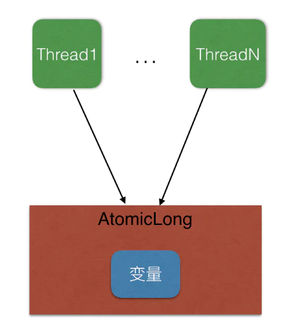
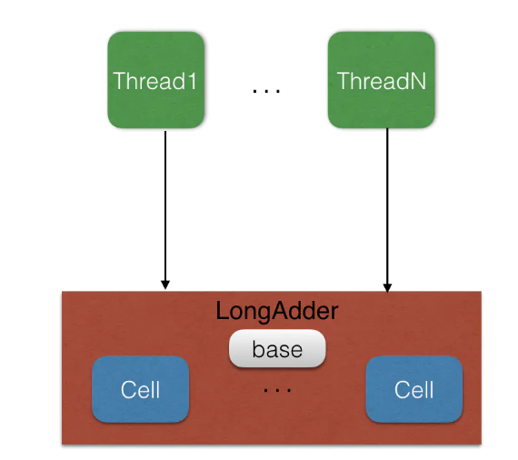

## 为什么要引入LongAdder 

AtomicLong类为开发人员使用线程安全的计数器提供了方便，但是AtomicLong在高并发下存在一些问题，当大量线程调用同一个AtomicLong的实例的方法时候，同时只有一个线程CAS的修改计数器的值能成功，失败的线程则会原地占用cpu进行自旋重试，这回造成大量线程白白浪费cpu。

LongAdder类，其采用分而治之的策略来减少同一个变量的并发竞争度,LongAdder的核心思想是把一个原子变量分解为多个变量，让同样多的线程去竞争多个资源，这样竞争每个资源的线程数就被分担了下来，下面通过图形来理解下两者设计的不同之处：

* AtomicLong



* LongAdder



LongAdder维护了一个延迟初始化的原子性更新数组cells（默认情况下Cell数组是null）和一个基值变量base，由于cells占用内存是相对比较大的，所以一开始并不创建，而是在需要时候在创建，也就是惰性创建。

下面我们首先看下Cell的结构：

```java
    @sun.misc.Contended static final class Cell {
        volatile long value;
        Cell(long x) { value = x; }
        final boolean cas(long cmp, long val) {
            return UNSAFE.compareAndSwapLong(this, valueOffset, cmp, val);
        }

        // Unsafe 机制
        private static final sun.misc.Unsafe UNSAFE;
        private static final long valueOffset;
        static {
            try {
                UNSAFE = sun.misc.Unsafe.getUnsafe();
                Class<?> ak = Cell.class;
                valueOffset = UNSAFE.objectFieldOffset
                    (ak.getDeclaredField("value"));
            } catch (Exception e) {
                throw new Error(e);
            }
        }
    }
```

当一开始判断cell数组是null并且并发线程较少时候所有的累加操作都是对base变量进行的，这时候就退化为了AtomicLong。cell数组的大小保持是2的N次方大小，初始化时候Cell数组的中Cell的元素个数为2，数组里面的变量实体是Cell类型。

当多个线程在争夺同一个Cell原子变量时候如果失败并不是在当前cell变量上一直自旋CAS重试，而是会尝试在其它Cell的变量上进行CAS尝试，这个改变增加了当前线程重试时候CAS成功的可能性。最后获取LongAdder当前值的时候是把所有Cell变量的value值累加后在加上base返回的，如下代码：

```java
public long sumThenReset() {
        Cell[] as = cells; Cell a;
        long sum = base;
        base = 0L;
        if (as != null) {
            for (int i = 0; i < as.length; ++i) {
                if ((a = as[i]) != null) {
                    sum += a.value;
                    a.value = 0L;
                }
            }
        }
        return sum;
    }
```

## LongAccumulator

**LongAccumulator**是**LongAdder**的增强版。**LongAdder**只能针对数值进行加减运算，而**LongAccumulator**提供了自定义的函数操作。其构造函数如下：


通过**LongBinaryOperator**，可以自定义对入参的任意操作，并返回结果（**LongBinaryOperator**接收2个long作为参数，并返回1个long）

**LongAccumulator**内部原理和LongAdder几乎完全一样，都是利用了父类**Striped64**的**longAccumulate**方法。这里就不再赘述了，读者可以自己阅读源码。

## DoubleAdder和DoubleAccumulator

从名字也可以看出，**DoubleAdder**和**DoubleAccumulator**用于操作double原始类型。

与**LongAdder**的唯一区别就是，其内部会通过一些方法，将原始的double类型，转换为long类型，其余和**LongAdder**完全一样：


# 