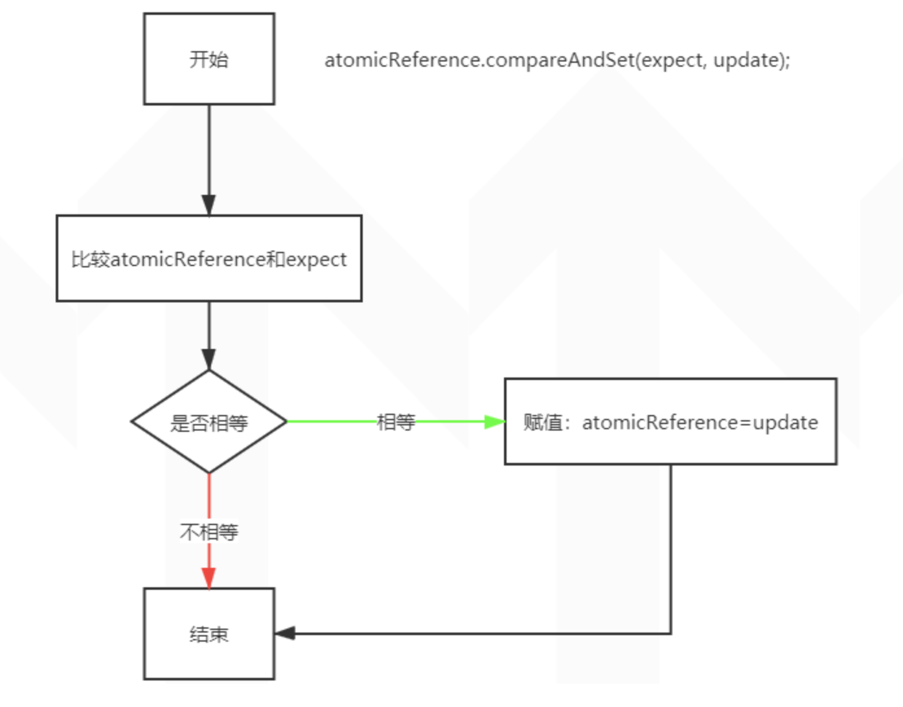

# AtomicReference

原子更新引用类型。原理没什么好说的了，需要的就是了解一下它现在支持的所有方法,以及基本使用

# 基本使用

> 先简单定义个 User 类

```java
@Data
@AllArgsConstructor
public class User {
    private String name;
    private Integer age;
}
```

> 使用 AtomicReference 初始化，并赋值

```java
public static void main( String[] args ) {
    User user1 = new User("张三", 23);
    User user2 = new User("李四", 25);
    User user3 = new User("王五", 20);

	//初始化为 user1
    AtomicReference<User> atomicReference = new AtomicReference<>();
    atomicReference.set(user1);

	//把 user2 赋给 atomicReference
    atomicReference.compareAndSet(user1, user2);
    System.out.println(atomicReference.get());

	//把 user3 赋给 atomicReference
    atomicReference.compareAndSet(user1, user3);
    System.out.println(atomicReference.get());
}
```

输出结果如下：

```bash
User(name=李四, age=25)
User(name=李四, age=25)
```

# 解释

> compareAndSet(V expect, V update)

该方法作用是：如果atomicReference==expect，就把update赋给atomicReference，否则不做任何处理。


- atomicReference的初始值是user1，所以调用compareAndSet(user1, user2)，由于user1==user1，所以会把user2赋给atomicReference。此时值为“李四”
- 第二次调用atomicReference.compareAndSet(user1, user3)，由于user2 != user1，所以set失败。atomicReference仍然为“李四”
