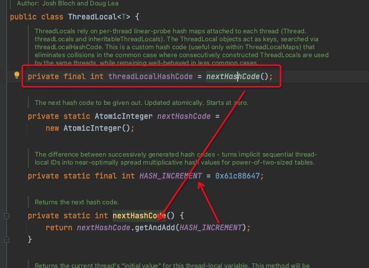

## ThreadLocal是什么

ThreadLocal是一个本地线程副本变量工具类。**ThreadLocal 适用于每个线程需要自己独立的实例且该实例需要在多个方法中被使用，也即变量在线程间隔离而在方法或类间共享的场景。**

## ThreadLocal类的几个核心方法

```java
public T get()
public void set(T value)
public void initialValue()
public void remove()
```

- get()方法用于获取当前线程的副本变量值。
- set()方法用于保存当前线程的副本变量值。
- initialValue()为当前线程初始副本变量值。
- remove()方法移除当前前程的副本变量值（**防止内存泄漏的根本解决方案，后文中会介绍 ThreadLocal的内存泄漏问题**）。

## ThreadLocal的数据结构

**下图为ThreadLocal的内部结构图**

)

从上面的结构图，我们已经窥见ThreadLocal的核心机制：

- 每个Thread线程内部都有一个Map。
- 线程的这个Map里面存储线程本地对象（key=ThreadLocal的实例对象）和线程的变量副本（value）
- 但是，Thread内部的Map是由ThreadLocal维护的，由ThreadLocal负责向map获取和设置线程的变量值。

所以对于不同的线程，每次获取副本值时，别的线程并不能获取到当前线程的副本值，形成了副本的隔离，互不干扰。

Thread线程内部的Map在类中描述如下：

```java
public class Thread implements Runnable {
    /* ThreadLocal values pertaining to this thread. This map is maintained
     * by the ThreadLocal class. */
    ThreadLocal.ThreadLocalMap threadLocals = null;
}
```

## ThreadLocalMap

### 介绍

上文中我们了解到了ThreadLocalMap是java.lang.ThreadLocal类的静态内部类。ThreadLocalMap主要是作为成员变量，应用在java.lang.Thread类。探索ThreadLocalMap，有助于理解多线程并发环境下ThreadLocal的实现原理。它没有实现Map接口，而是用独立的方式实现了Map的功能，其内部的Entry也独立实现。

ThreadLocalMap类图：


在ThreadLocalMap中，也是用Entry来保存K-V结构数据的。但是Entry中key只能是ThreadLocal对象，这点被Entry的构造方法已经限定死了。

### Entry

```java
// WeakReference<ThreadLocal> 意味着 ThreadLocal会被弱引用持有，任何一次gc都可能回收它（如果它的内存区在这次gc回收的区域）
static class Entry extends WeakReference<ThreadLocal> {
    /** The value associated with this ThreadLocal. */
    Object value;

    Entry(ThreadLocal k, Object v) {
        super(k);
        value = v;
    }
}
```

Entry继承自WeakReference，包括两个元素，一个ThreadLocal 类型的成员和一个Object类型的成员value。其中ThreadLocal 类型的成员是一个弱引用，其特点是，当引用元素无强引用时，JVM GC时会立即回收引用元素。关于引用着一块大家可以去了解一下关于Java强引用、软引用、弱引用、幽灵引用相关的知识

ThreadLocalMap的成员变量：

```java
static class ThreadLocalMap {
    /**
     * The initial capacity -- MUST be a power of two.
     */
    private static final int INITIAL_CAPACITY = 16;

    /**
     * The table, resized as necessary.
     * table.length MUST always be a power of two.
     * 容器，他的大小必须是 2次方，这一点和hashMap的设计是相同的，这样的设计可以使用 hashCode &    	     
     * (length - 1) 来快速定位索引
     */
    private Entry[] table;

    /**
     * The number of entries in the table.
     */
    private int size = 0;

    /**
     * The next size value at which to resize.
     */
    private int threshold; // Default to 0
}
```

### Hash冲突怎么解决

#### 斐波那契散列乘数

#### 线性探测

ThreadLocalMap和HashMap的最大的不同在于，ThreadLocalMap结构非常简单，没有next引用，也就是说ThreadLocalMap中解决Hash冲突的方式并非链表的方式，而是采用**线性探测**的方式，所谓线性探测，就是根据初始key的hashcode值确定元素在table数组中的位置，如果发现这个位置上已经有其他key值的元素被占用，则利用固定的算法寻找一定步长的下个位置，依次判断，直至找到能够存放的位置。

ThreadLocalMap解决Hash冲突的方式就是简单的步长加1或减1，寻找下一个相邻的位置。

```java
/**
 * Increment i modulo len.
 */
private static int nextIndex(int i, int len) {
    return ((i + 1 < len) ? i + 1 : 0);
}

/**
 * Decrement i modulo len.
 */
private static int prevIndex(int i, int len) {
    return ((i - 1 >= 0) ? i - 1 : len - 1);
}
```

显然ThreadLocalMap采用线性探测的方式解决Hash冲突的效率很低，如果有大量不同的ThreadLocal对象放入map中时发送冲突，或者发生二次冲突，则效率很低。

为了降低冲突机率提高效率，ThreadLocal 实例的HashCode 采用了 用斐波那契散列乘数使hash分布更均匀

看 ThreadLocal源码就会发现 每次`new ThreadLocal`时因为threadLocalHashCode的初始化，会使threadLocalHashCode值自增一次，增量设计师这个斐波那契散列乘数 0x61c88647。



#### 用斐波那契散列乘数使hash分布更均匀

**0x61c88647是斐波那契散列乘数,它的优点是通过它散列(hash)出来的结果分布会比较均匀，可以很大程度上避免hash冲突，已初始容量16为例，hash并与15位运算计算数组下标结果如下：**

|  hashCode  | 数组下标 |
| :--------: | :------: |
| 0x61c88647 |    7     |
| 0xc3910c8e |    14    |
| 0x255992d5 |    5     |
| 0x8722191c |    12    |
| 0xe8ea9f63 |    3     |
| 0x4ab325aa |    10    |
| 0xac7babf1 |    1     |
| 0xe443238  |    8     |
| 0x700cb87f |    15    |

### 构造器

```java
ThreadLocalMap(ThreadLocal<?> firstKey, Object firstValue) {
    table = new Entry[INITIAL_CAPACITY];
    int i = firstKey.threadLocalHashCode & (INITIAL_CAPACITY - 1);
    table[i] = new Entry(firstKey, firstValue);
    size = 1;
    setThreshold(INITIAL_CAPACITY);
}
```

```java
private ThreadLocalMap(ThreadLocalMap parentMap) {
    Entry[] parentTable = parentMap.table;
    int len = parentTable.length;
    setThreshold(len);
    table = new Entry[len];

    for (int j = 0; j < len; j++) {
        Entry e = parentTable[j];
        if (e != null) {
            @SuppressWarnings("unchecked")
            ThreadLocal<Object> key = (ThreadLocal<Object>) e.get();
            if (key != null) {
                Object value = key.childValue(e.value);
                Entry c = new Entry(key, value);
                int h = key.threadLocalHashCode & (len - 1);
                while (table[h] != null)
                    h = nextIndex(h, len);// 线性探测
                table[h] = c;
                size++;
            }
        }
    }
}
```

根据传入批量Entries，将所有Key非空Entry设置到该类Entry数组

### Expunge（内存擦除）

Entry对象Key为弱引用，当Key所指对象无强引用时，JVM GC时会自动回收该对象，从而造成Entry状态变为STALE（ Entry.get()==null  就说明Entry的状态是STALE），即无效状态。此时，必须对该Entry对象及其Value引用进行擦除，防止内存泄漏。

#### expungeStaleEntry

基础擦除方法

```java
/**
 * 从 staleSlot 开始知道遇到第一个 空的位置，将沿途发现的所有 STALE状态的Entry清理，同时如果发现
 * 非STALE状态Entry，如果发现他的hash值计算得到索引位置 h 和 他当前的位置i不想等则重新给他找位置
 **/
private int expungeStaleEntry(int staleSlot) {
    Entry[] tab = table;
    int len = tab.length;

    // expunge entry at staleSlot
    tab[staleSlot].value = null;
    tab[staleSlot] = null;
    size--;

    // Rehash until we encounter null
    Entry e;
    int i;
    for (i = nextIndex(staleSlot, len);
         (e = tab[i]) != null;
         i = nextIndex(i, len)) {
        ThreadLocal<?> k = e.get();
        if (k == null) {
            e.value = null;
            tab[i] = null;
            size--;
        } else {
            int h = k.threadLocalHashCode & (len - 1);
            if (h != i) {
                tab[i] = null;

                // Unlike Knuth 6.4 Algorithm R, we must scan until
                // null because multiple entries could have been stale.
               // 从新给 i这个位置的entry找位置
                while (tab[h] != null)
                    h = nextIndex(h, len);
                tab[h] = e;
            }
        }
    }
    return i;
}
```

#### cleanSomeSlots

部分擦除

```java
private boolean cleanSomeSlots(int i, int n) {
    boolean removed = false;
    Entry[] tab = table;
    int len = tab.length;
    do {
        i = nextIndex(i, len);
        Entry e = tab[i];
        if (e != null && e.get() == null) {
            n = len;
            removed = true;
            i = expungeStaleEntry(i);
        }
    } while ( (n >>>= 1) != 0);
    return removed;
}
```

#### expungeStaleEntries

全表擦除

```java
private void expungeStaleEntries() {
    Entry[] tab = table;
    int len = tab.length;
    for (int j = 0; j < len; j++) {
        Entry e = tab[j];
        if (e != null && e.get() == null)
            expungeStaleEntry(j);
    }
}
```

### set 方法

```java
private void set(ThreadLocal<?> key, Object value) {

    // We don't use a fast path as with get() because it is at
    // least as common to use set() to create new entries as
    // it is to replace existing ones, in which case, a fast
    // path would fail more often than not.

    Entry[] tab = table;
    int len = tab.length;
    // 计算索引
    int i = key.threadLocalHashCode & (len-1);

    for (Entry e = tab[i];
         e != null;
         e = tab[i = nextIndex(i, len)]) {
        ThreadLocal<?> k = e.get();

        if (k == key) {// 找到之后直接替换
            e.value = value;
            return;
        }

        if (k == null) {// STALE状态Entry，执行替换方法，并直接返回
            replaceStaleEntry(key, value, i);
            return;
        }
    }
		// 空位存入
    tab[i] = new Entry(key, value);
    int sz = ++size;
    /**
     * 判断Entry数组是否需要扩容；因为此处Entry数组新增了一个Entry，所以首先执行一次启发式擦除过程，如
     * 果成功擦除了元素，表明Entry数组并无变大，不需要扩容，否则，新增一个元素后，如果Entry数组大小大于
     * 阈值（length的2/3），则进行扩容。
     **/
    if (!cleanSomeSlots(i, sz) && sz >= threshold)
        rehash();
}
```

### replaceStaleEntry

```java
private void replaceStaleEntry(ThreadLocal<?> key, Object value,
                               int staleSlot) {
    Entry[] tab = table;
    int len = tab.length;
    Entry e;

    // 从当前staleSlot向前探寻其它STALE元素，遇到空元素结束；
    int slotToExpunge = staleSlot;
    for (int i = prevIndex(staleSlot, len);
         (e = tab[i]) != null;
         i = prevIndex(i, len))
        if (e.get() == null)
            slotToExpunge = i;

		// 从当前staleSlotd的下一个元素stale_i，开始遍历，如果查找到包含传参key的Entry，即key_i，则交换stale_i和key_i两个Entry，并从确定的STALE元素位置开始擦除操作，再从结束位置开始 cleanSomeSlots 擦除；
    for (int i = nextIndex(staleSlot, len);
         (e = tab[i]) != null;
         i = nextIndex(i, len)) {
        ThreadLocal<?> k = e.get();

        // If we find key, then we need to swap it
        // with the stale entry to maintain hash table order.
        // The newly stale slot, or any other stale slot
        // encountered above it, can then be sent to expungeStaleEntry
        // to remove or rehash all of the other entries in run.
        if (k == key) {
            e.value = value;

            tab[i] = tab[staleSlot];
            tab[staleSlot] = e;

            // Start expunge at preceding stale entry if it exists
            if (slotToExpunge == staleSlot)
                slotToExpunge = i;
            cleanSomeSlots(expungeStaleEntry(slotToExpunge), len);
            return;
        }

        // If we didn't find stale entry on backward scan, the
        // first stale entry seen while scanning for key is the
        // first still present in the run.
        if (k == null && slotToExpunge == staleSlot)
            slotToExpunge = i;
    }

    // 如果未查到到包含传参key的Entry，则直接在staleSlot位置设置传参key对应Entry，
    tab[staleSlot].value = null;
    tab[staleSlot] = new Entry(key, value);

    // 并从确定的slotToExpunge元素开始擦除操作，再从结束位置开始cleanSomeSlots擦除。
    if (slotToExpunge != staleSlot)
        cleanSomeSlots(expungeStaleEntry(slotToExpunge), len);
}
```

### getEntry 方法

```java
private Entry getEntry(ThreadLocal<?> key) {
            int i = key.threadLocalHashCode & (table.length - 1);
            Entry e = table[i];
            if (e != null && e.get() == key)
                return e;
            else
              // 碰撞查找
                return getEntryAfterMiss(key, i, e);
        }

private Entry getEntryAfterMiss(ThreadLocal<?> key, int i, Entry e) {
            Entry[] tab = table;
            int len = tab.length;

            while (e != null) {
                ThreadLocal<?> k = e.get();
                if (k == key)
                    return e;
                if (k == null)// 内存擦除
                    expungeStaleEntry(i);
                else
                    i = nextIndex(i, len);
                e = tab[i];
            }
            return null;
        }
```

### remove

      /**
         * Remove the entry for key.
         */
        private void remove(ThreadLocal<?> key) {
            Entry[] tab = table;
            int len = tab.length;
            int i = key.threadLocalHashCode & (len-1);
            for (Entry e = tab[i];
                 e != null;
                 e = tab[i = nextIndex(i, len)]) {
                if (e.get() == key) {
                    e.clear();
                    expungeStaleEntry(i);
                    return;
                }
            }
        }
在Entry数组中，删除指定Key的元素。如果找到待删除元素，首先将引用key值置空，然后从当前位置开始执行擦除过程。

## ThreadLocal 内存泄漏问题

有了上面我们的 ThreadLocal 的介绍，我们知道 ThreadLocal 在使用的时候会给每一个是用到它的线程创建一个 ThreadLocalMap 用来存放线程各自的副本，我们知道通常我们的线程的使用都是利用到线程池的，还有就是在一个服务系统中很可能线程池中的这些线程都是不会销毁的，也就是说如果有100个这样的线程没有销毁，在只有一个TheadLocal变量的时候，这100个线程中就存在 100个 ThreadLocalMap，以及 100个ThreadLocalMap 中会分别存放一个 entry；在这样的情况下，我们就会面临两种内存泄漏情况：

* 一种是 TheadLocal 是被强引用的情况：由于 TheadLocal 变量被强引用着，无法对其内存进行擦出，会导致上面免俗的 100个entry的内存泄露
* 一种是其被弱引用的情况：这个是 Josh Bloch 和 Doug Lea 对TheadLocal 的优化，为了避免非 static TheadLocal变量内存泄漏设计的，内存擦出方案，利用弱饮用的特性在，线程执行完成之后，非 static TheadLocal变量的引用被移除线程虚拟机栈之后发生gc回收之后，标记这一块Entry实例是可以擦出的，在TheadLocalMap的get，set方法中会执行这样的擦出工作防止内存泄漏，如果不使用弱饮用来这几Entry的key, 那么我们上面描述的这100份内存会一直存在那，也就是这些内存泄漏了

上面我们描述的只是 单个 TheadLocal 且 只有100线程的场景，如果是 10个200线程呢，那就是2000个entry的泄漏，所以为了避免这样的问题，最根本的是在使用完成之后调用 ThreadLocal#remove方法


### 

