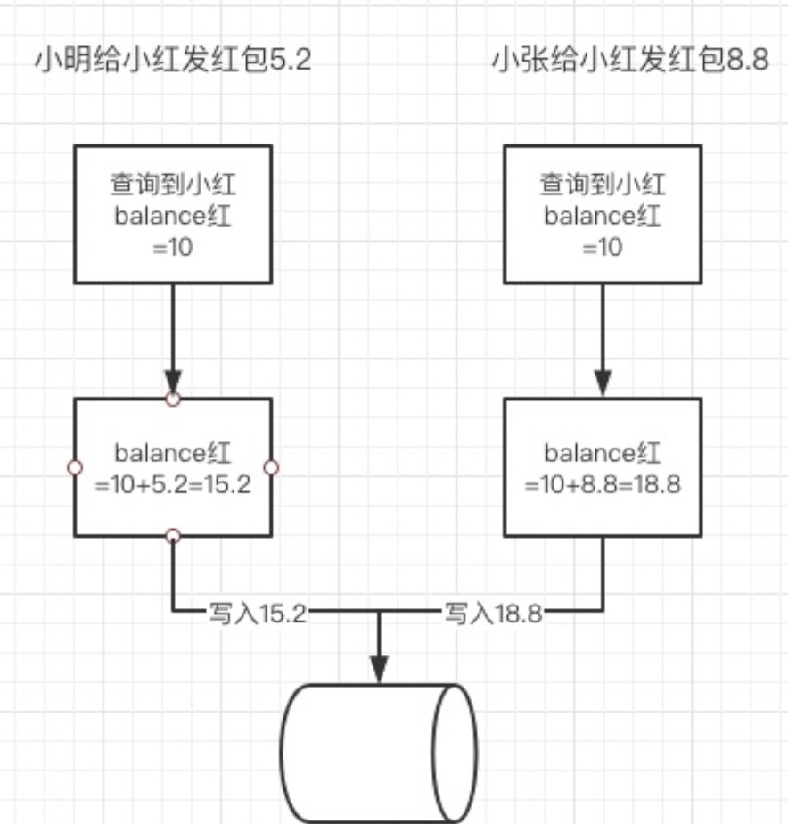

# 并发&多线程

**什么是并发问题？**

首先并发问题不是并行，但是并行可能会导致发生并发问题，并发问题主要是是指同一时间由于多线程或多进程（一般是分布式场景的多进程）对同一个数据进行读写操作，参数数据不一致的问题，比如我们现在有这样一段转账的代码，当这样的场景发生之后，最终这个小红的余额是15.2还是18.8 就完全取决于哪一个请求最新到达数据库了，当然这个场景可以通过SQL方式解决同时利用SQL的写互斥（这里是数据库通过锁帮助你处理了并发问题）

```
1. 查询form用户的余额 balanceA
2. balanceA - money
3. to用户的余额 balanceB
4. balanceB + money
```

如下图：




**我们现在是如何解决并发问题的？**

**处理并发我们需要处理两个关键问题：线程（进程）之间如何通信及线程（进程）之间如何同步**

并发问题在我们程序开发中可以说是非常常见，并且是我们每一个开发人员都会遇到的问题，并且也是我们必须去解决的问题，我们现在看看不同场景的下的并发问题

单进程的线程间并发问题：在这样的场景下我们主要需要解决线程间通信和同步问题，后文我们会介绍java中是怎么实现这一点的，以及有哪些工具可以使用，他们的原理是

多进程/多机器的并发问题：随着技术的发展我们发现从单机来到了集群时代（非对称集群（比如主备集群），对称集群（分布式服务，多台机器运行同一套代码）），在这样的场景我们处理并发问题需要的就是要处理多台机器间的通信和同步问题，这时候我们只能借助第三方类似中介一样的工具———中间件，来帮助我们实现通信甚至是同步的处理，比如 zookeeper，redis , db ..... 问题的本质一直没变只不过这时候我们不是在一台机器上了

# java单机并发控制

上面我们提到了解决并发问题的实质是需要实现线程，进程间的通信，对于我们使用java开发的人员来说，在处理多线程之间的并发问题的时候在java.util.current 包下面提供了很多工具类，有线程池，锁，并发容器等等给我们使用，在了解这个包之前我们需要先了解我们在java并发编程中的一些重要的概念，这样你才能读懂那些工具类是怎么实现线程间通信来实现处理并发问题的。

这里我分了两个部分来介绍&讲解

* [并发编程的重要概念](并发编程中的重要概念.md)
* [JUC(java.util.current 并发编程工具包)](JUC/JUC.md)

同时这里也介绍一个lang包下的适用于每个线程需要自己独立的实例且该实例需要在多个方法中被使用，即变量在线程间隔离而在方法或类间共享的场景的工具。

* [ThreadLocal](ThreadLocal.md)
