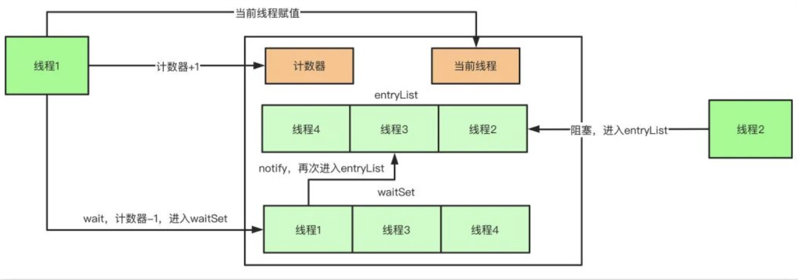
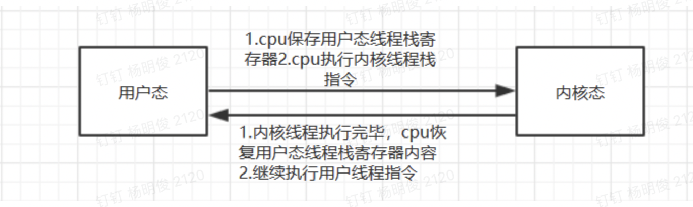
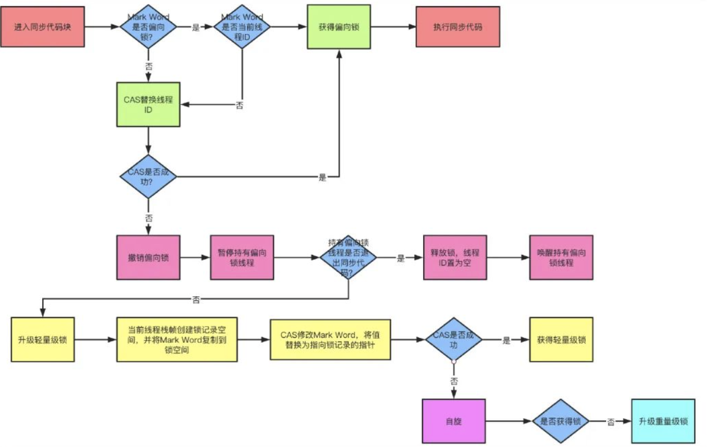

java中每一个对象都可以作为一个锁（锁是存在Java对象头里的。），当我们在使用`synchronized`关键字的时候具体表现是：

1. 普通同步方法，锁是当前实例对象（该关键字作用于普通方法）
2. 静态同步方法，锁是当前的类的Class的对象（该关键字作用于静态（static）方法）
3. 同步块，这个的锁就是放在`synchronized` 的括号里的配置对象了

JVM基于进入和退出Monitor对象来实现方法同步和代码块同步。代码块同步是使用monitorenter和monitorexit指令实现的，monitorenter指令是在编译后插入到同步代码块的开始位置，而monitorexit是插入到方法结束处和异常处。任何对象都有一个monitor与之关联，当且一个monitor被持有后，它将处于锁定状态。

根据虚拟机规范的要求，在执行monitorenter指令时，首先要去尝试获取对象的锁，如果这个对象没被锁定，或者当前线程已经拥有了那个对象的锁，把锁的计数器加1；相应地，在执行monitorexit指令时会将锁计数器减1，当计数器被减到0时，锁就释放了。如果获取对象锁失败了，那当前线程就要阻塞等待，直到对象锁被另一个线程释放为止。

synchronized是排它锁，当一个线程获得锁之后，其他线程必须等待该线程释放锁后才能获得锁，**而且由于Java中的线程和操作系统原生线程是一一对应的，线程被阻塞或者唤醒时时会从用户态切换到内核态，这种转换非常消耗性能。**

注意：

1、synchronized同步块对同一条线程来说是可重入的，不会出现自己把自己锁死的问题；

如果再深入到源码来说，synchronized实际上有两个队列waitSet和entryList。

1. 当多个线程进入同步代码块时，首先进入entryList
2. 有一个线程获取到monitor锁后，就赋值给当前线程，并且计数器+1
3. 如果线程调用wait方法，将释放锁，当前线程置为null，计数器-1，同时进入waitSet等待被唤醒，调用notify或者notifyAll之后又会进入entryList竞争锁
4. 如果线程执行完毕，同样释放锁，计数器-1，当前线程置为null

# synchronized中的多级锁

从java SE 6 开始为了减少锁的获取和释放带来的性能消耗，所以引入了：偏向锁，轻量级锁，所以目前synchronizd的锁存在四种状态（等级）：

* 无锁状态
* 偏向锁
* 轻量级锁
* 重量级锁

上诉的几个状态随着竞争情况的逐渐升级，锁的状态也会随之改变，**需要注意的是：锁可以升级但是不能降级**

ps: https://mp.weixin.qq.com/s/-xFSHf7Gz3FUcafTJUIGWQ 这个链接中的文章也可阅读

## java对象头结构

为了继续说明`synchronized`的几种锁是在线程竞争中是怎样变化的，我们需要先了解 java的对象头结构，他们存储什么样的数据，因为我们知道这里的锁说到底也就是一个java对象，而在对象的锁则是在对象的对象头中管理的。

| 长度                       | 内容                  | 说明                                     |
| -------------------------- | --------------------- | ---------------------------------------- |
| 32/64 bit (取决于操作系统) | mark word             | 存储对象的hash code,分代年龄，锁相关信息 |
| 32/64 bit                  | Class Metadata adress | 存储指向对象数据类型的指针               |
| 32/64 bit                  | Array lenth           | 数组的长度（如果是数组类型的对象的话）   |

很显然我们的锁相关的信息存储在对象头的mark word 中，我们再来看看它的结构，32位JVM的默认存储结构

在运行期间对象的这部分信息会随着，锁的变化而变化，可能变成下面四种情况，在我们锁状态变化过程中，对象头的mark word的这个信息会这样变化

64位JVM

可以看到锁信息也是存在于对象的`mark word`中的。当对象状态为偏向锁（biasable）时，`mark word`存储的是偏向的线程ID；当状态为轻量级锁（lightweight locked）时，`mark word`存储的是指向线程栈中`Lock Record`的指针；当状态为重量级锁（inflated）时，为指向堆中的monitor对象的指针。

## 偏向锁

### **为什么要引⼊偏向锁？**

因为经过HotSpot的作者大量的研究发现，大多数时候是不存在锁竞争的，常常是⼀个线程多次获得同⼀个锁，因此如果每次都要竞争锁会增⼤很多没有必要付出的代价，为了降低获取锁的代价，才引⼊的偏向锁。

### **偏向锁原理和升级过程**

当线程1访问代码块并获取锁对象时，会在java对象头和栈帧中记录偏向的锁的threadID，因为**偏向锁不会主动释放锁**，因此以后线程1再次获取锁的时候，需要**比较当前线程的 threadID 和 Java象头中的 threadID是否⼀致**，如果⼀致（还是线程1获取锁对象），则无需使用CAS来加锁、解锁；

如果不⼀致（其他线程，如线程2要竞争锁对象，而偏向锁不会主动释放因此还是存储的线程1的threadID），那么**需要查看Java 对象头中记录的线程 1 是否存活**，如果没有存活，那么锁对象被重置为无锁状态，其它线程（线程2）可以竞争将其设置为偏向锁；

如果存活，那么立刻**查找该线程（线程1）的栈帧信息，如果还是需要继续持有这个锁对象**，那么暂停当前线程1，撤销偏向锁，升级为轻量级锁，如果线程1 不再使用该锁对象，那么将锁对象状态设为无锁状态，重新偏向新的线程

## 轻量级锁

### 为什么要引入轻量级锁？

**轻量级锁考虑的是竞争锁对象的线程不多，而且线程持有锁的时间也不长的情景**。因为**阻塞线程需要CPU从用户态转到内核态，代价较大，如果刚刚阻塞不久这个锁就被释放了，那这个代价就有点得不偿失了**，因此这个时候就干**脆不阻塞这个线程，让它自旋这等待锁释放**。

### 轻量级锁加锁

java线程在执行同步块之前，JVM会先在当前线程的这一**栈帧中**创建用于**存储锁记录的空间**，并且将对象（锁）的**对象头中的mark word数据**复制到这部分**锁记录空间中**，然后线程尝试使用 CAS将对象头的mark word 中的数据替换为指向锁记录的指针，如果成功，当前线程获取到了锁，如果失败表示其他线程竞争锁，当前线程会尝试使用自旋操作执行CAS尝试获取锁。

1. 如果在自旋尝试过程中获取到了锁（也就是之获得锁的线程执行完成或其他情况，释放了锁）那就执行线程的逻辑，如果多次尝试之后失败（也就是说这里的竞争比较激励），为了避免无用的自旋操作，会将锁升级重量级锁（这时会修改对象的对象头中的锁标志为重量锁标志 `10`）
2. **或者在线程 1执行中, 2在自选等待，这时候又 3 线程过来竞争这个锁对象，这也会导致锁升级** 

### 轻量级锁解锁

解锁过程正好相反，会使用原子的CAS将栈帧的所记录空间中对象的原mark word数据替换回对象头的mark word空间中。如果成功表示没有竞争发生，如果失败，表示当前锁存在竞争，锁就会膨胀成重量级锁

## 重量级锁

由于Java的线程是映射到操作系统的原生线程之上的，如果要阻塞或唤醒一条线程，都需要操作系统来帮忙完成，这就需要从用户态转换到核心态中，因此状态转换需要耗费很多的处理器时间。JDK1.6以前，synchronized是Java语言中的一个较重的操作。在JDK1.6以后，虚拟机进行了一些优化，譬如在通知操作系统阻塞线程之前加入一段自旋等待过程（也就是轻量级锁，自旋尝试获取，如果一定的自旋次数之后未获取到JVM的锁，就会到内核去阻塞这个线程，同时JVM这边膨胀成重量锁），避免频繁地切入做用户态，内核态的上下文切换

**`synchronized`的`monitor`锁机制和JDK的`ReentrantLock`与`Condition`是很相似的，`ReentrantLock`也有一个存放等待获取锁线程的链表，`Condition`也有一个类似`WaitSet`的集合用来存放调用了`await`的线程。如果你之前对`ReentrantLock`有深入了解，那理解起`monitor`应该是很简单。不过没有自旋尝试的过程所以如果不是经过了 轻量锁的优化，性能是不够好的**

重量级锁是我们常说的传统意义上的锁，其利用操作系统底层的同步机制去实现Java中的线程同步。

重量级锁的状态下，对象的`mark word`为指向一个堆中monitor对象的指针。

一个monitor对象包括这么几个关键字段：cxq（下图中的ContentionList），EntryList ，WaitSet，owner。

其中cxq ，EntryList ，WaitSet都是由ObjectWaiter的链表结构，owner指向持有锁的线程。

当一个线程尝试获得锁时，如果该锁已经被占用，则会将该线程封装成一个`ObjectWaiter`对象插入到cxq的队列的队首，然后调用`park`函数挂起当前线程。在linux系统上，`park`函数底层调用的是gclib库的`pthread_cond_wait`，JDK的`ReentrantLock`底层也是用该方法挂起线程的(LockSupport工具的park方法)。

当线程释放锁时，会从cxq或EntryList中挑选一个线程唤醒，被选中的线程叫做`Heir presumptive`即假定继承人（应该是这样翻译），就是图中的`Ready Thread`，假定继承人被唤醒后会尝试获得锁，但`synchronized`是非公平的，所以假定继承人不一定能获得锁（这也是它叫"假定"继承人的原因）。

如果线程获得锁后调用`Object#wait`方法，则会将线程加入到WaitSet中，当被`Object#notify`唤醒后，会将线程从WaitSet移动到cxq或EntryList中去。需要注意的是，当调用一个锁对象的`wait`或`notify`方法时，**如当前锁的状态是偏向锁或轻量级锁则会先膨胀成重量级锁**。

# 锁消除

JVM在JIT运行时，对一些代码要求同步而实际该段代码在数据共享上不可能出现竞争的锁而进行消除操作

# 锁粗化

对于相同锁定对象的相邻同步代码块，JVM为了提高性能，就会对同步范围进行粗化，把锁在第一个操作中加上，然后在最后一个操作中释放，这样就只加了一次锁但是达到了同样的效果。

# Synchronized和ReentrantLock的区别

1. Synchronized是JVM层次的锁实现，ReentrantLock是JDK层次的锁实现；

2. Synchronized的锁状态是无法在代码中直接判断的，但是ReentrantLock可以通过`ReentrantLock#isLocked`判断；

3. Synchronized是非公平锁，ReentrantLock是可以是公平也可以是非公平的；

4. Synchronized是不可以被中断的，而`ReentrantLock#lockInterruptibly`方法是可以被中断的；

5. 在发生异常时Synchronized会自动释放锁（由javac编译时自动实现），而ReentrantLock需要开发者在finally块中显示释放锁；

6. ReentrantLock获取锁的形式有多种：如立即返回是否成功的tryLock(),以及等待指定时长的获取，更加灵活；

   参考:

> * 《并发编程的艺术》
>* https://blog.csdn.net/lengxiao1993/article/details/81568130
> * https://github.com/farmerjohngit/myblog/issues/12

# 从JVM和操作系统聊一聊java的锁

这块面试人员希望了解到的是关于，我们对java锁的理解

java的锁我们常用的有 Synchronized 以及JUC相关的那些锁工具，这里我主要说一下Synchronized，他是和ReentrantLock类似的但是Synchronized是jvm 层面提供的，早期 ReentrantLock 性能是优于Synchronized的但是 从jdk 1.6 以后他们的性能差距就不那么明显了，因为对其做了很多的优化，JDK 开发团队为了减少且降低了线程上线文切换的代价，引入了 **偏向锁，轻量级锁，以及自旋优化；**

为什么早期 Synchronized 的性能比 ReentrantLock差呢？因为早期的时候 Synchronized 完全依赖锁对象的monitor 来实现的同步，无论同步代码块是否存在竞争都直接走monitor同步逻辑：获取monitor锁，获取失败放入同步等待队列，同时通过操作系统将线程挂起，以及后续的线程唤醒参与竞争都会涉及到**线程的用户态到内核态的上下文切换**：因为cpu的切换它是由操作系统内核提供的，用户程序是无法直接访问cpu的，线程的执行本质上是cpu操作的，线程的切换自然需要cpu切换执行，cpu的访问是操作系统才能操作的，那么必然存在从用户态切换到内核太，这个切换也是需要cpu做切换的，会有一个中断，然后cpu保存当前的执行现场（因为它再次切换回来的时候需要指从从哪开始继续执行），然后才能切换到内核态

> ps:
>
> 切换线程上下文，需要保护和恢复寄存器数据
>
> 1、切换到执行内核线程的时候，内核代码对用户不信任，需要进行额外的检查。
>
> 2、内核线程执行完返回过程有很多额外工作，比如检查是否需要调度等
>
> 3、如果被切换的线程属于不同用户程序间切换的话，那么还要更新cr3寄存器，这样会更换每个程序的虚拟内存到物理内存映射表的地址
>
> *  https://blog.csdn.net/mydriverc2/article/details/113185189
> * https://blog.csdn.net/u010727189/article/details/103401970?spm=1001.2101.3001.6650.1&utm_medium=distribute.pc_relevant.none-task-blog-2%7Edefault%7ECTRLIST%7ERate-1.pc_relevant_default&depth_1-utm_source=distribute.pc_relevant.none-task-blog-2%7Edefault%7ECTRLIST%7ERate-1.pc_relevant_default&utm_relevant_index=2

所以这是一个很重的操作，这也就是**重量级锁名称的由来**，而偏向锁是：锁不存在竞争的时候使用的

轻量级锁是：锁的竞争不是那么激烈的时候使用CAS（compare and swap）来快速的完成线程的切换

什么是不存在竞争呢？也就是我们虽然使用了同步锁，但是同步代码块一直由一个线程在执行

什么是锁竞争不激烈？同步代码块的执行是线程交替执行的？

**偏向锁**实现方式：[索引](#轻量级锁)

**轻量级锁**实现方式：[索引](#偏向锁)

**自旋优化**：是其实是在重量级锁的逻辑中的入队操作（将线程放入锁的同步队列）前增加的一个了一个尝试再次获取锁的操作，目的是为了避免线程被挂起（阻塞），这样就能减少线程切换带来的性能开销；自旋也是有代价的，不能自旋过长时间（会占用cpu时间），也不能太短（本来再尝试一次就能获取锁成功从而导致线线程被阻塞），所以这里的自旋逻辑做了自适应的优化：比如对象刚刚的一次自旋操作成功过，那么认为这次自旋成功的可能性会高，就多自旋几次；反之，就少自旋甚至不自旋；

