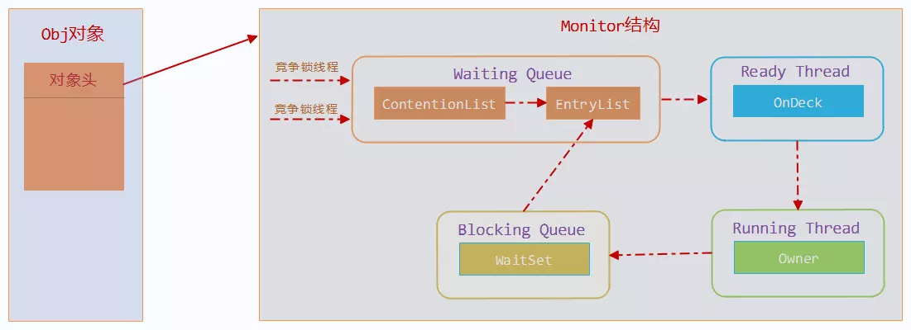

java中每一个对象都可以作为一个锁（锁是存在Java对象头里的。），当我们在使用`synchronized`关键字的时候具体表现是：

1. 普通同步方法，锁是当前实例对象（该关键字作用于普通方法）
2. 静态同步方法，锁是当前的类的Class的对象（该关键字作用于静态（static）方法）
3. 同步块，这个的锁就是放在`synchronized` 的括号里的配置对象了

JVM基于进入和退出Monitor对象来实现方法同步和代码块同步。代码块同步是使用monitorenter和monitorexit指令实现的，monitorenter指令是在编译后插入到同步代码块的开始位置，而monitorexit是插入到方法结束处和异常处。任何对象都有一个monitor与之关联，当且一个monitor被持有后，它将处于锁定状态。

根据虚拟机规范的要求，在执行monitorenter指令时，首先要去尝试获取对象的锁，如果这个对象没被锁定，或者当前线程已经拥有了那个对象的锁，把锁的计数器加1；相应地，在执行monitorexit指令时会将锁计数器减1，当计数器被减到0时，锁就释放了。如果获取对象锁失败了，那当前线程就要阻塞等待，直到对象锁被另一个线程释放为止。

注意：

1、synchronized同步快对同一条线程来说是可重入的，不会出现自己把自己锁死的问题；


**看一下一份代码编译后的字节码**

```java
public class SyncTest {
    public void syncBlock(){
        synchronized (this){
            System.out.println("hello block");
        }
    }java
    public synchronized void syncMethod(){
        System.out.println("hello method");
    }
}
```

```java
{
  public void syncBlock();
    descriptor: ()V
    flags: ACC_PUBLIC
    Code:
      stack=2, locals=3, args_size=1
         0: aload_0
         1: dup
         2: astore_1
         3: monitorenter				 	  // monitorenter指令进入同步块
         4: getstatic     #2                  // Field java/lang/System.out:Ljava/io/PrintStream;
         7: ldc           #3                  // String hello block
         9: invokevirtual #4                  // Method java/io/PrintStream.println:(Ljava/lang/String;)V
        12: aload_1
        13: monitorexit						  // monitorexit指令退出同步块
        14: goto          22
        17: astore_2
        18: aload_1
        19: monitorexit						  // monitorexit指令退出同步块
        20: aload_2
        21: athrow
        22: return
      Exception table:
         from    to  target type
             4    14    17   any
            17    20    17   any
 

  public synchronized void syncMethod();
    descriptor: ()V
    flags: ACC_PUBLIC, ACC_SYNCHRONIZED      //添加了ACC_SYNCHRONIZED标记
    Code:
      stack=2, locals=1, args_size=1
         0: getstatic     #2                  // Field java/lang/System.out:Ljava/io/PrintStream;
         3: ldc           #5                  // String hello method
         5: invokevirtual #4                  // Method java/io/PrintStream.println:(Ljava/lang/String;)V
         8: return
 
}
```

从上面的中文注释处可以看到，对于`synchronized`关键字而言，`javac`在编译时，会生成对应的`monitorenter`和`monitorexit`指令分别对应`synchronized`同步块的进入和退出，有两个`monitorexit`指令的原因是：为了保证抛异常的情况下也能释放锁，所以`javac`为同步代码块添加了一个隐式的try-finally，在finally中会调用`monitorexit`命令释放锁。而对于`synchronized`方法而言，`javac`为其生成了一个`ACC_SYNCHRONIZED`关键字，在JVM进行方法调用时，发现调用的方法被`ACC_SYNCHRONIZED`修饰，则会先尝试获得锁。

在JVM底层，对于这两种`synchronized`语义的实现大致相同，在后文中会选择一种进行详细分析。

# synchronized中的多级锁

从java SE 6 开始为了减少锁的获取和释放带来的性能消耗，所以引入了：偏向锁，轻量级锁，所限目前synchronizd的锁存在四种状态（等级）：

* 无锁状态
* 偏向锁
* 轻量级锁
* 重量级锁

上诉的几个状态随着竞争情况的逐渐升级，锁的状态也会随之改变，**需要注意的是：锁可以升级但是不能降级**

## java对象头结构

为了继续说明`synchronized`的几种锁是在线程竞争中是怎样变化的，我们需要先了解 java的对象头结构，他们存储什么样的数据，因为我们知道这里的锁说到底也就是一个java对象，而在对象的锁则是在对象的对象头中管理的。

| 长度                       | 内容                  | 说明                                     |
| -------------------------- | --------------------- | ---------------------------------------- |
| 32/64 bit (取决于操作系统) | mark word             | 存储对象的hash code,分代年龄，锁相关信息 |
| 32/64 bit                  | Class Metadata adress | 存储指向对象数据类型的指针               |
| 32/64 bit                  | Array lenth           | 数组的长度（如果是数组类型的对象的话）   |

很显然我们的锁相关的信息存储在对象头的mark word 中，我们再来看看它的结构，32位JVM的默认存储结构


在运行期间对象的这部分信息会随着，锁的变化而变化，可能变成下面四种情况，在我们锁状态变化过程中，对象头的mark word的这个信息会这样变化


64位JVM


可以看到锁信息也是存在于对象的`mark word`中的。当对象状态为偏向锁（biasable）时，`mark word`存储的是偏向的线程ID；当状态为轻量级锁（lightweight locked）时，`mark word`存储的是指向线程栈中`Lock Record`的指针；当状态为重量级锁（inflated）时，为指向堆中的monitor对象的指针。

## 偏向锁

### 偏向锁的获取

偏向锁的获取方式是将对象头的 **MarkWord** 部分中， 标记上线程ID， 以表示哪一个线程获得了偏向锁。 具体的赋值逻辑如下：

* 首先读取目标对象的 MarkWord, 判断是否处于可偏向的状态（如下图），也就是我们的mark word 中此时的偏向锁信息

  

* 判断是否为可偏向状态（锁的对象头的mark woed 中的 thread id 不存在，是否是偏向锁 `1`,锁标志位`01`）

  这时候线程才可以使用CAS操作将自己的线程id写入到 锁的对象头的mark word中

* 如果是已偏向状态（thread id 存在了），只需判断该id是否等于当前线程的id
  * 相等，那就继续执行代码快
  * 不相等，证明该同步块存在线程竞争，需要撤销偏向锁（在这过程中锁会膨胀成轻量锁）

### 偏向锁的撤销

偏向锁的撤销（Revoke） 操作并不是将对象恢复到无锁可偏向的状态， 而是在偏向锁的获取过程中， 发现了竞争时， 直接将一个被偏向的对象“升级到” 被加了轻量级锁的状态。 这个操作的具体完成方式如下：

* 在偏向锁 CAS 更新操作失败以后， 等待到达全局安全点。
  * 通过 MarkWord 中已经存在的 Thread Id 找到成功获取了偏向锁的那个线程, 然后在该线程的栈帧中补充上轻量级加锁时， 会保存的锁记录（Lock Record）， 然后将被获取了偏向锁对象的 MarkWord 更新为* 指向这条锁记录的指针。
  * 至此， 锁撤销操作完成， 阻塞在安全点的线程可以继续执行。

### 偏向锁的在偏向机制

* 从偏向锁状态的mark word中的数据我们可以看到一个epoch的值，这个值就代表了该thread id对象相乘的偏向时效性
* 除了对象中的 epoch, 对象所属的类 class 信息中， 也会保存一个 epoch 值
* 每当遇到一个全局安全点时， 如果要对 class C 进行批量再偏向， 则首先对 class C 中保存的 epoch 进行增加操作， 得到一个新的 epoch_new
* 然后扫描所有持有 class C 实例的线程栈， 根据线程栈的信息判断出该线程是否锁定了该对象， 仅将 epoch_new 的值赋给被锁定的对象中。
* 退出安全点后， 当有线程需要尝试获取偏向锁时， 直接检查 class C 中存储的 epoch 值是否与目标对象中存储的 epoch 值相等， 如果不相等， 则说明该对象的偏向锁已经无效了， 可以尝试对此对象重新进行偏向操作。

## 轻量级锁

JVM的开发者发现在很多情况下，在Java程序运行时，同步块中的代码都是不存在竞争的，不同的线程交替的执行同步块中的代码。这种情况下，用重量级锁是没必要的。因此JVM引入了轻量级锁的概念。避免了直接使用重量级锁，频繁的线程阻塞/唤醒操作（这样的操作都存在，用户态和内核态的切换，性能损耗比较大）

### 轻量级锁加锁

java线程在执行同步块之前，JVM会先在当前线程的这一**栈帧中**创建用于**存储锁记录的空间**，并且将对象（锁）的**对象头中的mark word数据**复制到这部分**锁记录空间中**，然后线程尝试使用 CAS将对象头的mark word 中的数据替换为指向锁记录的指针，如果成功，当前线程获取到了锁，如果失败表示其他线程竞争锁，当前线程会尝试使用自旋操作执行CAS尝试获取锁。如果在自旋尝试过程中获取到了锁（也就是之获得锁的线程执行完成或其他情况，释放了锁）那就执行线程的逻辑，如果多次尝试之后失败（也就是说这里的竞争比较激励），为了避免无用的自旋操作，会将锁升级重量级锁（这时会修改对象的对象头中的锁标志为重量锁标志 `10`）

### 轻量级锁解锁

解锁过程正好相反，会使用原子的CAS将栈帧的所记录空间中对象的原mark word数据替换会对象头的mark word空间中。如果成功表示没有竞争发生，如果失败，表示当前锁存在竞争，锁就会膨胀成重量级锁

## 重量级锁

由于Java的线程是映射到操作系统的原生线程之上的，如果要阻塞或唤醒一条线程，都需要操作系统来帮忙完成，这就需要从用户态转换到核心态中，因此状态转换需要耗费很多的处理器时间。JDK1.6以前，synchronized是Java语言中的一个较重的操作。在JDK1.6以后，虚拟机进行了一些优化，譬如在通知操作系统阻塞线程之前加入一段自旋等待过程（也就是轻量级锁，自旋尝试获取，如果一定的自旋次数之后未获取到JVM的锁，就会到内核去阻塞这个线程，同时JVM这边膨胀成重量锁），避免频繁地切入做用户态，内核态的上下文切换

**`synchronized`的`monitor`锁机制和JDK的`ReentrantLock`与`Condition`是很相似的，`ReentrantLock`也有一个存放等待获取锁线程的链表，`Condition`也有一个类似`WaitSet`的集合用来存放调用了`await`的线程。如果你之前对`ReentrantLock`有深入了解，那理解起`monitor`应该是很简单。不过没有自旋尝试的过程所以如果不是经过了 轻量锁的优化，性能是不够好的**

重量级锁是我们常说的传统意义上的锁，其利用操作系统底层的同步机制去实现Java中的线程同步。

重量级锁的状态下，对象的`mark word`为指向一个堆中monitor对象的指针。

一个monitor对象包括这么几个关键字段：cxq（下图中的ContentionList），EntryList ，WaitSet，owner。

其中cxq ，EntryList ，WaitSet都是由ObjectWaiter的链表结构，owner指向持有锁的线程。

[](https://camo.githubusercontent.com/c67e1e05cd18036d99db46063368d4d60fdae88f/68747470733a2f2f757365722d676f6c642d63646e2e786974752e696f2f323031382f31312f32382f313637353964643162306164346662653f773d3131303126683d34303026663d7765627026733d3135363832)

当一个线程尝试获得锁时，如果该锁已经被占用，则会将该线程封装成一个`ObjectWaiter`对象插入到cxq的队列的队首，然后调用`park`函数挂起当前线程。在linux系统上，`park`函数底层调用的是gclib库的`pthread_cond_wait`，JDK的`ReentrantLock`底层也是用该方法挂起线程的(LockSupport工具的park方法)。

当线程释放锁时，会从cxq或EntryList中挑选一个线程唤醒，被选中的线程叫做`Heir presumptive`即假定继承人（应该是这样翻译），就是图中的`Ready Thread`，假定继承人被唤醒后会尝试获得锁，但`synchronized`是非公平的，所以假定继承人不一定能获得锁（这也是它叫"假定"继承人的原因）。

如果线程获得锁后调用`Object#wait`方法，则会将线程加入到WaitSet中，当被`Object#notify`唤醒后，会将线程从WaitSet移动到cxq或EntryList中去。需要注意的是，当调用一个锁对象的`wait`或`notify`方法时，**如当前锁的状态是偏向锁或轻量级锁则会先膨胀成重量级锁**。

# Synchronized和ReentrantLock的区别

1. Synchronized是JVM层次的锁实现，ReentrantLock是JDK层次的锁实现；
2. Synchronized的锁状态是无法在代码中直接判断的，但是ReentrantLock可以通过`ReentrantLock#isLocked`判断；
3. Synchronized是非公平锁，ReentrantLock是可以是公平也可以是非公平的；
4. Synchronized是不可以被中断的，而`ReentrantLock#lockInterruptibly`方法是可以被中断的；
5. 在发生异常时Synchronized会自动释放锁（由javac编译时自动实现），而ReentrantLock需要开发者在finally块中显示释放锁；
6. ReentrantLock获取锁的形式有多种：如立即返回是否成功的tryLock(),以及等待指定时长的获取，更加灵活；
7. Synchronized在特定的情况下**对于已经在等待的线程**是后来的线程先获得锁（上文有说），而ReentrantLock对于**已经在等待的线程**一定是先来的线程先获得锁（FIFO）；

> 参考:
>
> * 《并发编程的艺术》
>* https://blog.csdn.net/lengxiao1993/article/details/81568130
> * https://github.com/farmerjohngit/myblog/issues/12

