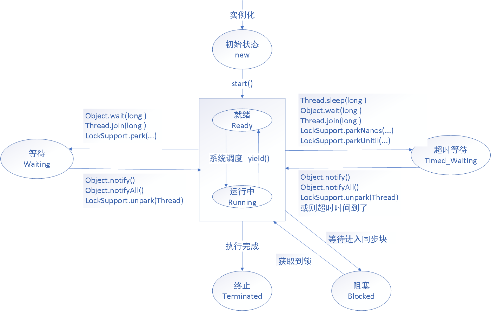

# 1.引言（很重要哦）

[java内存模型-JMM](../JVM/JMM.md)

通过上文我们知道了JVM为每一个线程分配了独立的内存（虚拟机栈），他们共享堆中的数据，在执行对同一数据的读改写的过程中先读取到数据，然后存放在他们各自的虚拟机栈中进行逻辑处理，比如我们现在有一个数据 a=1, A,B 线程都执行 a++ 的操作的时候， 数据先读取到自己的虚拟机栈中，然后分别执行a+1的操作之后，在写回到共享内存区（jvm堆区）这时候最终的结果就是 a = 2,但是正确的结果应该是 a = 3 , 怎么解决问题呢？我们都会想到如果线程间对这个数据处理的时候能够变成一个同步的流程就好了（一个线程处理完之后，另一个线程继续处理），这样当然可以解决这个问题，但是怎么实现同步呢？我们需要两个线程间可以通信，这样才可以在一个线程执行的时候，告诉另一个线程你等一会，我执行完了你才可以执行，这个就需要说到我们后面的 **volatile** 变量 b，他可以帮我们实现线程间的通信，这个变量在每次读数据的都会从共享内存区域读取最新数据，每次写也是立马刷新的共享内存区，有了这个功能的话也就是如果线程A执行到a++的时候，先将变量b修改成了1，线程B在来的时候走到读取变量b的代码的时候就会发现b=1，线程知道了自己需要等待；说到这其实还会有一种情况就是 线程A,B同时获取b=0，同时修改b=1.这样就没有达成同步的效果，这时候就需要我们的[CAS（compare and swap）](CAS.md) 的加入了，有了这个能力之后，就算是同时拿到数据是0也只有一个线程可以修改成功，这样就完美的达成了同步的效果了

上面讨论的都是基于**编译器和处理器不会对我们的指令进行重排序**的情况下才能达成的效果（**volatile变量确实是有这样的防止重排序效果**），比如上面的操作如果被重排序成：先处理a,再处理b，那么就完全达不到我们想要的效果了，那么下面我会给大家详细介绍，关于我们的**重排序**，**volatile**，**以及和重排序相关的内存屏障**，**我们的as-if-serial规则，happens-before规则..... 内容**

# 2.重排序

## 2.1 重排序介绍


**重排序的目的是为了提高指令的并行度，从而提升性能，但是他们在执行重排序的时候会准守我们的数据依赖性，他们不会改变存在数据依赖性的操作的执行顺序**

比如这段代码1：变量 a 和 flag 完全没有**数据依赖性**，执行的时候就可能被重新排序成 代码2的情况，这是在处理器对指令做重排序的时候真实会发生的事

代码1:

```java
int a = 1;        //1
boolean flag = true;  // 2
System.out.println(a+",",flag)//3
```

代码2:

```java
boolean flag = true;  // 2
int a = 1;        //1
System.out.println(a+",",flag)//3
```

## 2.2 数据依赖性 

我们在聊重排序的时候提到了**数据依赖性**，什么样的操作具有数据依赖性？如果两个操作访问同一个变量，且这两个操作中有一个为写操作，此时这两个操作之间就存在数据依赖性。数据依赖分下列三种类型：

写后读：

```java
int a = 1 ;
int b = a ;
```

写后写：

```java
int a = 1 ;
a = 2 ;
```

读后写

```java
int b = 2 ; // 1
int a = b ; // 2
b = 1; // 3
// 这里我们的123的执行顺序是不会改变的
```

**重排序不会改变具有数据依赖性的两个操作的执行顺序**

## 2.3 as-if-serial

as-if-serial 规则指的是不管怎么进行重排序，单线程的执行结果不能被改变。也就是说在存在数据依赖性的操作不重排序的前提之下，虽然其他的操作是可以重排序的，但是单线程的执行结果不能被改变。

## 2.4 内存屏障

我们知道我们的运算最终都是由cpu进行操作的，但是现在的cpu都是多核心的，并且每个核心都有自己私有的高速缓存，那么这个数据被核心处理之后写到高速缓存中之后，就会有**消息协议（比如MESI协议）**来确保所有的缓存数据会对所有的共享这一数据的核心同步保持数据一致性。这个使内存数据对CPU核可见的技术被称为**内存屏障**。也许你会说取消高速缓存不就好了吗？但是由于内存的数据读写性能和cpu的处理速度严重不匹配，所以需要引入高速缓存来平衡两者的差异，并且高速缓存被和cpu集成在一起，使得处理核和存储距离更近这样传输就可以更快；为什么多个核心之间不使用同一个高速缓存呢？这样不就没有多核心之间数据不一致的问题了吗？这方面我没有深入了解过也不是很清楚。下面我们来介绍当前我们使用的主流的cpu的设计条件下，我们有哪些内存屏障可以使用

首先我们介绍一下数据访问的基础指令：

- Store：将处理器缓存的数据刷新到内存中。
- Load：将内存存储的数据拷贝到处理器的缓存中。

**内存屏障有四种，但是不是所有处理器都存在这四种内存屏障**：

| 屏障类型   | 指令示例                 | 说明                                                         |
| :--------- | :----------------------- | :----------------------------------------------------------- |
| LoadLoad   | Load1;LoadLoad;Load2     | 该屏障确保Load1数据的装载先于Load2及其后所有装载指令的的操作 |
| StoreStore | Store1;StoreStore;Store2 | 该屏障确保Store1立刻刷新数据到内存(使其对其他处理器可见)的操作先于Store2及其后所有存储指令的操作 |
| LoadStore  | Load1;LoadStore;Store2   | 确保Load1的数据装载先于Store2，以及让后面所有的store指令刷新数据到主内存中 |
| StoreLoad  | Store1;StoreLoad;Load2   | 该屏障确保**Store1立刻刷新数据到内存的操作先于Load2以及其后所有load指令**。**它会使该屏障之前的所有内存访问指令(store指令和load指令)完成之后,才执行该屏障之后的内存访问指令** |

StoreLoad Barriers同时具备其他三个屏障的效果，因此也称之为`全能屏障`（mfence），是目前大多数处理器所支持的；但是相对其他屏障，该屏障的开销相对昂贵。

# 3. happens-before

它指的是如果一个操作  A-happens-before -B, 那么A 操作一定对B操作可见（内存的可见性）

也就是说如果操作A-happens-before -B ,那么 B 一定能知道 A 对内存数据的修改。

比如： 对volatile变量的写入操作必须在对该变量的读操作之前执行。

# 4. 锁的内存语义

锁的内存语义：其实是我们对锁他需要在内存方面实现/达到的效果的定义

* 锁的释放的内存语义：他会达成把当前本地换存中的共享变量的值都刷新到主内存中效果
* **锁的获取的内存语义**：他会达成把当前**临界区**本地内存置为无效，重新从主内存中读取共享变量的效果

**临界区**：获取锁和释放锁之间的那一块操作区域。（获取锁释放锁之间那一块代码）

# 5. volatile

volatile变量规则（happens-before）：**对volatile变量的写入操作必须在对该变量的读操作之前执行**。

**volatile能够保证变量的可见性，以及阻止一些指令重排序问题**

它的作用是：

- 保持可见性
- 禁用重排序（读操作禁止重排序之后的操作，写操作禁止重排序之前的操作）

## volatile如何解决内存可见性与重排序问题

> 在编译器层面，仅将volatile作为标记使用，取消编译层面的缓存和重排序。这是java为了屏蔽不同操作系统之间的差别进行的定义

如果硬件架构本身已经保证了内存可见性（如单核处理器、一致性足够的内存模型等），那么volatile就是一个空标记，不会插入相关语义的内存屏障。

如果硬件架构本身不进行处理器重排序、有更强的重排序语义（能够分析多核间的数据依赖）、或在单核处理器上重排序，那么volatile也是一个空标记，不会插入相关语义的内存屏障。

如果不是上述的情况，以x86架构为例，JVM对volatile变量的处理如下：

- 在写volatile变量v之后，插入一个sfence。这样，sfence之前的所有store（包括写v）不会被重排序到sfence之后，sfence之后的所有store不会被重排序到sfence之前，禁用跨sfence的store重排序；且sfence之前修改的值都会被写回缓存，并标记其他CPU中的缓存失效。
- 在读volatile变量v之前，插入一个lfence。这样，lfence之后的load（包括读v）不会被重排序到lfence之前，lfence之前的load不会被重排序到lfence之后，禁用跨lfence的load重排序；且lfence之后，会首先刷新无效缓存，从而得到最新的修改值，与sfence配合保证内存可见性。

> 在另外一些平台上，JVM使用mfence代替sfence与lfence，实现更强的语义。

二者结合，共同实现了Happens-Before关系中的volatile变量规则。

##  总结

**volatile 读的内存语义+内存屏障**

* **内存屏障**：volatile读的后面会插入LoadLoad+LoadStroe内存屏障，也就是说一个volatile变量的读操作后面的任何读写操作都不会重排序到这个 volatile变量读操作之前，volatile变量的读操作之前的读操作也不会重排到他之后

  也就是说从**内存语义**上理解就是：volatile 变量的读会保证在它之后的读都是从内存中读取的最新的值

**volatile 写的内存语义+内存屏障**

- **内存屏障**：volatile写的后面会插入StroeLoad内存屏障，也就是说一个volatile变量写的后面任何变量的读操作都不会重排序到这个 volatile变量写之前；volatile写的前面会插入StroeStroe内存屏障,也就是说一个volatile变量写的前面任何变量的写操作都不会重排序到这个 volatile变量写之后；

  也就是说从**内存语义**上理解就是：volatile 变量的写 **具有与锁的释放的内存语义具有相同的内存效果**，他会把当前本地换存中的共享变量的值都刷新到主内存中，最后通过处理器间的缓存一致性协议，达成其他处理器可见的效果

**总结**：**这样就能将 volatile变量读前面的所有写操作的值都刷新到主内存，使得一系列的写操作对其他线程可见。**

# 关于上面的概念更多的内容

请仔细阅读 [一文解决内存屏障](一文解决内存屏障.md) 这里面解释了

# 6. CAS

[CAS](CAS.md)

# 7. 锁的释放和获取的内存语义的实现方式

*  使用 volatile 变量的读——写所具有的内存语义
* 利用CAS附带的volatile 读——写语义。

# 8. 双重检查锁

初期的代码：

```java
public class DoubleCheckedLock{
  private static Instance instance;
  
  public static Instance getInstance(){
    if(instance == null){// 第一次检查
      synchronized(DoubleCheckedLock.class){
        if(instance == null){// 第二次检查
        	instance = new Instance();// 标记为 i
        }  
      }
    }
    return instance;
  }
  
}
```

### 为什么要使用双重检查锁呢？

为了实现绝对的单例，我们需要考略到多线程中的同步问题，这时候使用 synchronized 性能开销相对较大，所以使用的上面的代码，如果第一次检查 instance不为null，那就不需要执行下面的加锁操作。因此可以降低  synchronized 带来的性能开销。

### 这个代码是否存在什么问题呢？

问题出在 标记 i 这个位置，这行代码可以分解为：

```java
memory  = allocate(); // 1. 分配对象的内存空间
ctorinstance(memory);// 2. 初始化对象
instance = memory;// 3. 将instance指向刚分配的内存地址
```

上面这部分代码中2个3之间，可能会重排序（在一些JIT编译器上这种重排序是真实发生的）

如果两个并行的线程A，B掉用这样的代码，如果A走到标记i位置发生了重排序，就有可能发生B线程判断instance!=null,然后他访问对象，但是这个对象还没有初始化或没初始化完成这样的情况。

### 解决的方法

1. 不允许2和3重排序

2. 允许2个3重排序，但是不允许其他线程“看到”这个重排序（利用初始化过程是同步的这一点）

通过两个方法分别设计两种解决方案：

* 基于volatile的解决方案：不允许2和3重排序

  ```java
  public class DoubleCheckedLock{
    private volatile static Instance instance;
    
    public static Instance getInstance(){
      if(instance == null){
        synchronized(DoubleCheckedLock.class){
          if(instance == null){
          	instance = new Instance();// instance 为volatile 就没问题了
          }  
        }
      }
      return instance;
    }
    
  }
  ```

*  基于类初始化的解决方案：允许2个3重排序，但是不允许其他线程“看到”这个重排序

  类的初始化：在Class被加载之后，线程调用之前。初始化的时候会去获取锁，这个锁可以同步多个线程对同一个类的初始化，

  什么时候会初始化？

  * new 一个类的时候
  * 一个类中声明的static方法被调用
  * 一个类中声明的非final的static属性被使用

  了解了这些就可以设计代码了

  ```java
  public class InstanceFactory{
    private static class InstanceHolder{
      public static Instance instance = new Instance();
    }
    public static Instance getInstance(){
      return InstanceHolder.instance;
    }
  }
  ```

  这个代码我们在并发的时候，由于初始化锁的原因，调用getInstance()方法的时候会被同步，这样在第一次初始化的时候，这个instance变量只会被实例化一次。

# 9.线程

现代操作系统运行一个程序时，会为它创建一个进程，而线程是轻量级进程，是比进程更小的一个单元。在一个进程中可以创建多个线程。这些线程拥有自己的计数器，堆栈，局部变量等。他们能访问共享的内存变量。一个线程在一个时刻只能运行在一个处理器核心上，处理器单核心会在一些线程上做切换，多核处理器线程会同时发生并行以及切换。

## 9.1 使用多线程的意义

* 利用更多的处理器核心：现代处理器都是多核 cpu , 这样的处理器更加擅长并行计算，处理器在提高单核主频（每秒计算速度）的同时也在向着更多的核心发展，怎么更好利用处理器的多个核心呢？大然是使用多线程，同时利用多个核心。
* 更快的响应时间：有的业务处理是可以拆分成好几步同时运行的。这时候使用多线程去分别处理，肯定相比你一个个串行化处理快

## 9.2 线程优先级

现代操作系统会分出一个个时间片，线程会分配到一个个时间片，当线程时间片用完（线程执行完成也会切换别的线程）就会发生线程调用，并等待下一次分配。线程优先级就是决定线程需要多（少）分配一些处理器资源的线程属性。

**注意：线程优先级属性不能决定线程是否优先执行**

## 10.3 java线程的状态



## 10.4 java 创建线程的方式：

查看Java Thread 的源码可以看出，创建线程的方式不管是使用继承Thread，还是实现Runnable（最后也是要使用new Thread(...)）,最终执行的都是一个方法创建线程：

```java
private void init(ThreadGroup g, Runnable target, String name,
                      long stackSize, AccessControlContext acc,
                      boolean inheritThreadLocals) {
        if (name == null) {
            throw new NullPointerException("name cannot be null");
        }

        this.name = name;
				// 拿到的是当前线程，也就是即将要创建的线程的父线程
        Thread parent = currentThread();
				//...省略了部分系统检查的代码
        this.group = g;
  			// 根据父线程的 类型指定是否是 daemon,以及他的优先级priority
        this.daemon = parent.isDaemon();
        this.priority = parent.getPriority();
  			// 配置当前线程的上下文类加载器（继承父线程的）
        if (security == null || isCCLOverridden(parent.getClass()))
            this.contextClassLoader = parent.getContextClassLoader();
        else
            this.contextClassLoader = parent.contextClassLoader;
  	
        this.inheritedAccessControlContext =
                acc != null ? acc : AccessController.getContext();
        this.target = target;
        setPriority(priority);
        if (inheritThreadLocals && parent.inheritableThreadLocals != null)
            this.inheritableThreadLocals =
                ThreadLocal.createInheritedMap(parent.inheritableThreadLocals);
        /* Stash the specified stack size in case the VM cares */
        this.stackSize = stackSize;

        /* Set thread ID */
        tid = nextThreadID();
    }
```

## 10.5 线程启动 start()

调用 start() 方法，这时候只是说明可以被处理器调度运行，并不是直接开始运行了

## 10.6 线程中断 interrupt()

中断可以理解为一个标识的属性，它表示**一个运行中线程是否被其他线程进行了中断操作**，其他线程通过调用该线程的`interrupt()`方法对其进行中断。，也可以调用静态方法Thread.interrupted()对当前线程的中断标识位进行复位。通过调用线程对象的`isInterrupted()`来判断是否被中断（返回true代表中断了），需要注意的是：

* 如果一个线程已经执行完成，这时候就算你调用一个线程的`interrupt()`方法，然后通过`isInterrupted()`你也会发现返回的是false.
* Java API 中许多声明抛出`InterruptedException`的方法（例如`Thread.sleep()`），它们在抛出该异常前（也就不管是否产生异常），Java虚拟机会清除该线程的中断标识位，这时候你调用`isInterrupted()`获得的值也将是false。
* 一个线程如果在运行，就算你调用该方法，线程也不会停止，如果线程处于闲置（例如处于sleep, wait, join 等状态）那么线程将立即退出被阻塞状态，并抛出一个InterruptedException异常。仅此而已。

> **抛出 方法定义throws InterruptedException 异常的方法，java对这个有特殊处理，会在这个过程中复位线程的中断标识**

我们除了使用`interrupt()`这个方法来实现中断线程，在有的时候也可以通过一个标识变量来实现。

```java
public class Demo {

    static volatile boolean flag = true;

    public static void main(String[] args) throws InterruptedException {

        doSomeThing();
        Thread.sleep(5000);
        changeFlag();
        System.out.println("  end  ");
    }

    public static void doSomeThing() {
        new Thread(new Runnable() {
            @Override
            public void run() {
                while (Demo.flag) {
                    System.out.println("......");
                }
            }
        }).start();
    }

    public static void changeFlag() {
        Demo.flag = false;
    }

}
```

## 10.7 线程间通信

这里我们主要介绍通过java自身提供的机制来实现通信

### 10.7.1 volatile+synchronized

* `volatile`就不做细节介绍了，前文有说到，他的读写规则实现变量线程间的可见性，这样也就实现了线程间的通信

* `synchronized`它是**通过加锁的方式来实现线程同步，以及锁住的临界区间原子性，并且因为是一个同步过程，并且根据锁的内存语义，也能知道临界区的共享变量是满足可见性的**。

  那么`synchronized`  的锁对象都是什么 呢？

  * 用在非`static`方法上他的锁就是当前对象
  * 用在static方法上他的锁就是当前类的Class对象
  * 对于同步方法块，那就是对应括号中指定的对象

  **在同步过程中，没有获取到这个唯一对象锁的线程会进入和该对象关联的同步队列，后文中还会提到`wait()`,`join()`方法，这个东西会让线程进入和对象关联的等待队列。**

### 10.7.2 等待（超时）通知机制——wait() , notify(),notifyAll()

这些方法是 Object 定义的方法，主要的作用是在使用 `synchronized`的时候，使用13.1中所说的情况对应的锁对象调用这些方法可以实现等待通知。（wait() , notify(),notifyAll()方法的调用必须在`synchronized块中）

* `wait()`: 调用该方法之后，当前线程变为等待状态，并将当前线程**放置在与调用`wait()`方法关联的对象的关联的等待队列中，线程会释放当前这个对象锁，同时会释放cpu资源**。**当该线程再次获取这个对象锁的时候，会从`wait()`方法返回并且继续执行**
* `wait(long millis)`：超时等待(单位毫秒)，在上面的基础上增加了时间限制，如果在参数指定的时间内，没有获取到锁（没有用那个锁对象调用`notify()/notifyAll()`方法），那么会按时返回，继续执行
* `notify() notifyAll()`方法在调用之后，等待的线程并不会立即获取到锁从`wait()`方法处返回，而是要等调用`notify() notifyAll()`方法的线程释放锁之后才有机会获取锁。原因是：
  * `notify()`: **将对象锁关联的等待队列中的一个等待线程从等待队列移动到同步队列**，这时候对象锁关联的同步队列中的线程可以**竞争**这个对象锁。
  * `notifyAll()`:**将对象锁关联的等待队列中的所有等待线程从等待队列移动到同步队列**

**总结**：我们 java 中在并发时，我们的锁对象可以拥有一个**同步队列**和一个**等待队列**

## 10.8 线程中一部分方法介绍

### 10.8.1 join()

在一个线程A中，执行线程B的`join()`方法，那么线程A 只有等待线程B终止（不管什么方式终止）才能从B调用的`jion()`处返回；线程处理提供了`join()`,还同时提供了`join(long millis)+join(long millis,int nanos)`两个用于超时等待的方法，这些方法内部其实使用的是wait()方法来实现的。

`join()`源码：可以看出调用了`join(long millis)`

```java
public final void join() throws InterruptedException {
    join(0);
}
```

`join(long millis)`源码：（单位毫秒）

```java
public final synchronized void join(long millis)
throws InterruptedException {
    long base = System.currentTimeMillis();
    long now = 0;

    if (millis < 0) {
        throw new IllegalArgumentException("timeout value is negative");
    }

    if (millis == 0) {
        while (isAlive()) {
            wait(0);// 可以看到jion() 使用的是这部分逻辑，调用了wait(0)方法，只要当前线程isAlive()，也就是没有终止，那就一直等待
        }
    } else {// 这部分就是超时等待的逻辑，在判断线程isAlive()的同时，进行了超时处理
        while (isAlive()) {
            long delay = millis - now;
            if (delay <= 0) {
                break;
            }
            wait(delay);
            now = System.currentTimeMillis() - base;
        }
    }
}
```

### 10.8.2 isAlive()

当线程处于就绪、运行、阻塞（超时阻塞）状态  返回true 

新建、终止。返回 false

### 10.8.3 Thread.sleep(long millis)

在指定的毫秒数内让当前线程休眠，**该方法不释放对象锁，会释放cpu资源**，到达时间后会从该方法处返回继续执行。

### 10.8.4 Thread. yield()

**暂停当前当前线程，把执行机会让给相同或者更高优先级的线程。（该方法不释放对象锁，释放cpu 资源）** 

实际上，` Thread.yield()`方法对应了如下操作：先检测当前是否有相同优先级的线程处于同可运行状态，如有，则把 CPU  的占有权交给此线程，否则，继续运行原来的线程。所以 yield() 方法称为“退让”，它把运行机会让给了同等(更高)优先级的其他线程（这些线程会去竞争 cpu）。

###  10.8.5  Thread.sleep(long millis) 和 Thread. yield()比较

两个方法都是Thread的静态方法，**都会使当前处于运行状态的线程放弃CPU**，把运行机会让给别的线程。两者的区别在于：

* `sleep((long millis)`方法会给其他线程运行的机会，不考虑其他线程的优先级；`yield()`方法只会给相同优先级或者更高优先级的线程一个运行的机会。
* 线程执行了`sleep(long millis)`方法，将转到阻塞状态；线程执行了yield()方法，将转到就绪状态。

## 10.9 守护（daemon）线程

daemon线程是一种支持型线程，主要用作程序后台调度以及一些支持型任务。在java虚拟机中，当不存在非daemon线程的时候，虚拟机将退出，**同时虚拟机中所有daemon线程也会立即终止**，所以 daemon 线程不能保证 finally语句块能够得到执行

**所以，构建daemon线程你不能依赖finally 语句块来确保需要执行的资源释放，关闭，清理等操作**

## 10.10 Thread中一些其他比较重要的方法介绍

* **setDefaultUncaughtExceptionHandler** 方法设置当线程由于未捕获的异常突然终止而调用的默认处理程序，注意java中没有为线程类中定义一个这样的默认处理程序。

